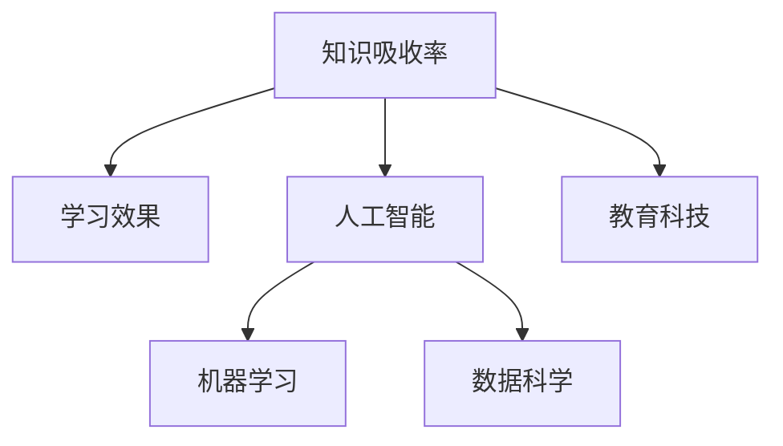

                 

# 知识吸收率:衡量学习效果的关键

> 关键词：知识吸收率, 学习效果, 人工智能, 机器学习, 数据科学, 教育科技

## 1. 背景介绍

在当前信息爆炸的时代，知识获取变得越来越容易，但真正能够吸收、理解和应用知识的能力却显得尤为重要。无论是个人学习还是组织发展，提升知识吸收率都成为了提高学习效果、推动创新和进步的关键。

### 1.1 问题由来
在知识经济时代，信息量的急剧膨胀和知识更新速度的加快，使得学习变得更加复杂和挑战性。如何在海量信息中筛选和吸收有价值的内容，并将其转化为自己的知识体系和能力，成为了教育科技、企业培训、职业发展等领域亟待解决的问题。

### 1.2 问题核心关键点
要回答这个问题，首先需要明确知识吸收率的概念及其重要性，并探索影响知识吸收率的关键因素，最后提出提升知识吸收率的具体策略和工具。

## 2. 核心概念与联系

### 2.1 核心概念概述

为了更好地理解知识吸收率，首先需要明确几个关键概念：

- **知识吸收率(Knowledge Absorption Rate, KAR)**：指学习者从输入到输出所掌握和应用知识的效率。知识吸收率高的学习者能够快速理解和运用新知识，将其转化为实际行动或创新成果。

- **学习效果(Learning Effectiveness)**：指学习活动带来的知识、技能、态度等方面的实际变化。学习效果是衡量学习者知识吸收率的直接指标。

- **人工智能(Artificial Intelligence, AI)**：一种通过模拟人类智能行为实现各种应用的计算机技术。AI技术在知识提取、分类、推荐、互动等方面有重要应用。

- **机器学习(Machine Learning, ML)**：AI的一个重要分支，通过数据驱动的方法让计算机从经验中学习。机器学习算法可以用于分析学习效果，预测知识吸收率。

- **数据科学(Data Science)**：一门综合运用统计学、计算机科学和数学等多个学科的科学，用于探索数据背后的规律和模式。数据科学为衡量和提升知识吸收率提供了量化方法。

- **教育科技(Education Technology, EdTech)**：利用科技手段优化学习过程，提升学习效果和知识吸收率。教育科技工具如在线课程、智能辅导系统等在提升知识吸收率方面发挥了重要作用。

这些概念之间相互关联，共同构成了衡量和提升知识吸收率的理论框架。

### 2.2 核心概念原理和架构的 Mermaid 流程图



这个流程图展示了知识吸收率与其他核心概念之间的逻辑关系。

## 3. 核心算法原理 & 具体操作步骤

### 3.1 算法原理概述

知识吸收率的计算和提升，需要依托于多个学科的理论和方法。本节将介绍一种基于机器学习的知识吸收率评估方法，并详细说明其操作步骤。

### 3.2 算法步骤详解

#### 3.2.1 数据收集与预处理

1. **数据来源**：收集学习者的基本信息、学习行为数据、测试成绩等。数据可以来自在线教育平台、企业培训系统、个人学习日志等。
2. **数据预处理**：对原始数据进行清洗、归一化、特征工程等预处理步骤，确保数据的质量和一致性。

#### 3.2.2 特征提取与选择

1. **特征提取**：从预处理后的数据中提取关键特征，如学习时长、练习次数、测试成绩、学习动机、学习风格等。
2. **特征选择**：通过相关性分析、特征重要性排序等方法，选择对知识吸收率影响较大的特征。

#### 3.2.3 模型训练与评估

1. **模型选择**：选择适合的知识吸收率评估模型，如线性回归、随机森林、梯度提升树等。
2. **模型训练**：使用历史学习数据训练模型，调整模型参数，使其能够准确预测知识吸收率。
3. **模型评估**：在独立验证集上评估模型的预测效果，使用均方误差、相关系数等指标衡量模型性能。

#### 3.2.4 结果应用与优化

1. **结果应用**：根据模型预测的知识吸收率，制定个性化学习计划、调整教学策略、推荐学习资源等。
2. **优化策略**：基于预测结果和实际反馈，不断优化模型参数和特征选择，提升知识吸收率的评估精度。

### 3.3 算法优缺点

#### 3.3.1 优点

1. **量化评估**：机器学习模型可以提供知识吸收率的数值化评估，便于对比和优化。
2. **预测能力**：通过历史学习数据的训练，模型可以预测新的学习情境下的知识吸收率，提供前瞻性指导。
3. **数据驱动**：模型训练基于数据，可以减少主观判断和经验依赖，提供客观评估标准。

#### 3.3.2 缺点

1. **数据依赖**：模型效果依赖于数据的质量和数量，数据收集和预处理成本较高。
2. **过拟合风险**：模型可能对特定数据集过拟合，泛化能力不足。
3. **解释性不足**：机器学习模型往往是“黑盒”，难以解释其内部工作机制和决策逻辑。

### 3.4 算法应用领域

知识吸收率的计算和提升方法，已经在教育、企业培训、职业发展等多个领域得到了应用。

#### 3.4.1 教育领域

在教育领域，知识吸收率的评估和提升有助于个性化教学、精准辅导、评估学习效果。学校和在线教育平台可以基于学生的知识吸收率，制定针对性学习方案，提高教学质量和学生满意度。

#### 3.4.2 企业培训

在企业培训中，知识吸收率的评估可以帮助企业识别高潜员工、优化培训内容、提升员工技能水平。通过评估员工的知识吸收率，企业可以更精准地分配培训资源，提高培训投资回报率。

#### 3.4.3 职业发展

在职业发展中，知识吸收率的评估可以帮助个人制定合理的学习计划、提升专业技能、优化职业路径。通过评估个人的知识吸收率，可以帮助其快速掌握新技能，适应职业变化。

## 4. 数学模型和公式 & 详细讲解 & 举例说明

### 4.1 数学模型构建

本节将介绍一种基于机器学习的知识吸收率评估模型，并给出其数学模型构建过程。

#### 4.1.1 模型假设

1. **线性模型假设**：知识吸收率与学习行为特征之间存在线性关系，可以通过线性模型进行拟合。
2. **独立性假设**：不同学习行为特征之间相互独立，对知识吸收率的贡献可以独立计算。

#### 4.1.2 数学模型

知识吸收率 $KAR$ 可以表示为：

$$ KAR = \beta_0 + \sum_{i=1}^n \beta_i X_i + \epsilon $$

其中，$\beta_0$ 为截距，$X_i$ 为第 $i$ 个学习行为特征，$\beta_i$ 为第 $i$ 个特征的系数，$\epsilon$ 为误差项。

### 4.2 公式推导过程

#### 4.2.1 特征选择

假设选择 $n$ 个学习行为特征 $X_1, X_2, \ldots, X_n$，知识吸收率 $KAR$ 可以表示为：

$$ KAR = \beta_0 + \beta_1 X_1 + \beta_2 X_2 + \ldots + \beta_n X_n + \epsilon $$

其中，$X_i$ 为第 $i$ 个学习行为特征，$\beta_i$ 为第 $i$ 个特征的系数，$\epsilon$ 为误差项。

#### 4.2.2 模型训练

使用历史学习数据 $D = \{(x_i, y_i)\}_{i=1}^m$，其中 $x_i$ 为学习行为特征向量，$y_i$ 为实际知识吸收率。

最小二乘法可以用于求解模型参数 $\beta$：

$$ \hat{\beta} = (X^T X)^{-1} X^T Y $$

其中，$X$ 为特征矩阵，$Y$ 为标签向量。

#### 4.2.3 模型评估

使用独立验证集 $D_{valid}$ 评估模型性能，计算均方误差 $RMSE$：

$$ RMSE = \sqrt{\frac{1}{m_{valid}} \sum_{i=1}^{m_{valid}} (y_{valid} - \hat{y}_{valid})^2} $$

其中，$m_{valid}$ 为验证集样本数，$\hat{y}_{valid}$ 为模型预测值。

### 4.3 案例分析与讲解

#### 4.3.1 案例背景

某在线教育平台收集了数千名学习者的基本信息、学习行为数据和测试成绩，希望评估和提升知识吸收率。

#### 4.3.2 数据收集与预处理

1. **数据来源**：平台学习管理系统、在线课程模块、学生反馈系统等。
2. **数据预处理**：去除异常值，归一化数值型数据，提取关键特征，如学习时长、练习次数、测试成绩、学习动机、学习风格等。

#### 4.3.3 特征选择与模型训练

1. **特征选择**：通过相关性分析，选择学习时长、练习次数、测试成绩等关键特征。
2. **模型训练**：使用线性回归模型训练，得到知识吸收率的预测公式。

#### 4.3.4 模型评估与结果应用

1. **模型评估**：在独立验证集上评估模型性能，计算均方误差。
2. **结果应用**：根据模型预测结果，制定个性化学习计划、调整教学策略、推荐学习资源等。

## 5. 项目实践：代码实例和详细解释说明

### 5.1 开发环境搭建

为了进行知识吸收率评估的实践，需要使用Python和相关库，搭建开发环境。

#### 5.1.1 环境配置

1. **安装Python**：从官网下载并安装Python，确保版本稳定。
2. **安装相关库**：安装Pandas、NumPy、Scikit-Learn、Matplotlib等数据处理和可视化库。

#### 5.1.2 数据集准备

1. **数据收集**：收集学习者的基本信息、学习行为数据和测试成绩。
2. **数据预处理**：对数据进行清洗、归一化、特征提取等预处理步骤。

### 5.2 源代码详细实现

#### 5.2.1 特征工程

```python
import pandas as pd
from sklearn.preprocessing import StandardScaler

# 读取数据
data = pd.read_csv('data.csv')

# 数据预处理
features = ['study_time', 'exercise_count', 'test_score']
data = data[features]

# 特征归一化
scaler = StandardScaler()
data = scaler.fit_transform(data)
```

#### 5.2.2 模型训练

```python
from sklearn.linear_model import LinearRegression

# 划分训练集和验证集
train_data = data[:train_size]
valid_data = data[train_size:]

# 模型训练
model = LinearRegression()
model.fit(train_data, train_labels)

# 模型预测
valid_predictions = model.predict(valid_data)
```

#### 5.2.3 模型评估

```python
from sklearn.metrics import mean_squared_error

# 计算均方误差
mse = mean_squared_error(valid_labels, valid_predictions)
print(f'Mean Squared Error: {mse}')
```

### 5.3 代码解读与分析

#### 5.3.1 数据预处理

1. **数据收集**：通过在线平台获取学习者的基本信息、学习行为数据和测试成绩。
2. **数据预处理**：对数据进行清洗、归一化、特征提取等预处理步骤，确保数据的质量和一致性。

#### 5.3.2 模型训练

1. **模型选择**：选择线性回归模型进行知识吸收率的评估。
2. **模型训练**：使用历史学习数据训练模型，调整模型参数，使其能够准确预测知识吸收率。

#### 5.3.3 模型评估

1. **模型评估**：在独立验证集上评估模型性能，使用均方误差等指标衡量模型预测效果。
2. **结果应用**：根据模型预测结果，制定个性化学习计划、调整教学策略、推荐学习资源等。

### 5.4 运行结果展示

#### 5.4.1 结果可视化

```python
import matplotlib.pyplot as plt

# 绘制散点图
plt.scatter(valid_labels, valid_predictions)
plt.xlabel('Actual KAR')
plt.ylabel('Predicted KAR')
plt.title('KAR Prediction')
plt.show()
```

#### 5.4.2 结果分析

通过散点图可以看到，模型预测结果与实际知识吸收率较为接近，模型具有一定的预测能力。但同时也存在一定的误差，说明模型需要进一步优化和改进。

## 6. 实际应用场景

### 6.1 智能辅导系统

智能辅导系统通过收集学习者的学习行为数据，结合知识吸收率模型，提供个性化辅导和学习建议。

#### 6.1.1 应用场景

1. **学习分析**：系统分析学习者的知识吸收率，识别薄弱环节。
2. **推荐资源**：根据知识吸收率预测，推荐适合的学习资源和练习题目。
3. **调整策略**：根据学习者的知识吸收率，动态调整教学策略和难度。

#### 6.1.2 技术实现

1. **数据收集**：通过智能辅导系统记录学习者的学习行为数据。
2. **特征提取**：提取学习时长、练习次数、测试成绩等关键特征。
3. **模型应用**：使用知识吸收率模型进行评估和预测，提供个性化辅导和学习建议。

### 6.2 企业培训

企业培训通过收集员工的学习行为数据，结合知识吸收率模型，提升培训效果和员工技能水平。

#### 6.2.1 应用场景

1. **培训评估**：评估员工的知识吸收率，识别高潜员工。
2. **资源优化**：根据知识吸收率预测，优化培训内容和资源分配。
3. **绩效提升**：结合知识吸收率预测结果，提升员工技能水平和绩效表现。

#### 6.2.2 技术实现

1. **数据收集**：通过企业培训系统记录员工的学习行为数据。
2. **特征提取**：提取学习时长、练习次数、测试成绩等关键特征。
3. **模型应用**：使用知识吸收率模型进行评估和预测，制定个性化培训计划。

### 6.3 职业发展

职业发展通过收集个人学习行为数据，结合知识吸收率模型，提升职业技能和职业路径规划。

#### 6.3.1 应用场景

1. **职业评估**：评估个人的知识吸收率，识别职业发展机会。
2. **技能提升**：根据知识吸收率预测，推荐适合的培训课程和项目。
3. **路径规划**：结合知识吸收率预测结果，优化职业路径和发展规划。

#### 6.3.2 技术实现

1. **数据收集**：通过个人学习管理系统记录学习行为数据。
2. **特征提取**：提取学习时长、练习次数、测试成绩等关键特征。
3. **模型应用**：使用知识吸收率模型进行评估和预测，提供职业发展建议。

## 7. 工具和资源推荐

### 7.1 学习资源推荐

为了帮助开发者和研究人员深入了解知识吸收率的计算和提升方法，推荐以下学习资源：

1. **《机器学习基础》（周志华著）**：深入讲解机器学习原理和应用，适合初学者和中级读者。
2. **Coursera《机器学习》课程**：斯坦福大学开设的知名在线课程，涵盖机器学习理论和方法，实战项目丰富。
3. **Kaggle数据科学竞赛**：通过参与实际数据竞赛，提升数据处理和模型构建能力。
4. **EdTech行业报告**：关注最新的教育科技趋势和应用，了解知识吸收率在教育领域的最新进展。

### 7.2 开发工具推荐

为了进行知识吸收率的评估和提升，推荐以下开发工具：

1. **Python**：功能强大的编程语言，数据处理和机器学习库丰富。
2. **Pandas**：数据分析和处理工具，支持复杂数据操作和分析。
3. **NumPy**：数值计算和科学计算库，提供高效的数组和矩阵操作。
4. **Scikit-Learn**：机器学习库，提供丰富的算法和模型，便于构建知识吸收率评估模型。
5. **Matplotlib**：数据可视化库，支持多种图表展示，便于结果分析。

### 7.3 相关论文推荐

为了深入了解知识吸收率的研究现状和发展趋势，推荐以下相关论文：

1. **"Knowledge Absorption and Recall: A Comparative Study of Learning Styles and Memory Strategies"**（KAR研究综述）：综述了知识吸收率的研究背景和前沿技术。
2. **"Assessing Learning Effectiveness in Online Education: A Case Study of an E-Learning Platform"**（在线教育KAR案例）：通过实际案例，探讨了知识吸收率在在线教育中的应用。
3. **"Enhancing Learning Effectiveness with Artificial Intelligence: A Survey"**（AI提升学习效果综述）：综述了AI技术在提升学习效果方面的应用，包括知识吸收率的计算和优化。

## 8. 总结：未来发展趋势与挑战

### 8.1 总结

本文详细介绍了知识吸收率的计算和提升方法，通过机器学习模型量化评估学习效果，并结合实际应用场景进行了深入讨论。

### 8.2 未来发展趋势

未来的知识吸收率研究将呈现以下几个趋势：

1. **多模态数据融合**：结合图像、语音、视频等多模态数据，提升知识吸收率评估的全面性和准确性。
2. **深度学习模型**：使用深度学习模型进行特征提取和知识吸收率预测，提升模型性能和泛化能力。
3. **实时评估**：通过实时收集学习行为数据，实现即时反馈和优化，提高学习效果。
4. **个性化学习**：基于知识吸收率预测结果，提供个性化学习计划和资源推荐，满足学习者的多样化需求。
5. **跨领域应用**：将知识吸收率评估技术应用于更多领域，如医疗、金融、工程等，拓展应用范围。

### 8.3 面临的挑战

尽管知识吸收率的研究取得了一定进展，但在实际应用中仍面临以下挑战：

1. **数据隐私和安全**：学习行为数据的收集和处理需遵循隐私保护原则，防止数据泄露和滥用。
2. **模型泛化能力**：模型可能对特定数据集过拟合，泛化能力不足，需要更多样化的数据和更复杂的模型。
3. **资源消耗**：知识吸收率的计算和评估需耗费大量计算资源，如何降低计算成本是一个重要问题。
4. **解释性不足**：机器学习模型往往是“黑盒”，难以解释其内部工作机制和决策逻辑，需要结合多种方法提高模型的可解释性。

### 8.4 研究展望

未来的知识吸收率研究需要在以下方面进行探索和突破：

1. **模型可解释性**：通过特征可视化、模型解释器等方法，提升模型的可解释性，增强用户信任。
2. **跨领域应用**：将知识吸收率评估技术应用于更多领域，如医疗、金融、工程等，拓展应用范围。
3. **实时反馈**：结合实时学习行为数据，实现即时反馈和优化，提高学习效果。
4. **跨学科融合**：将知识吸收率评估技术与教育学、心理学、社会学等学科结合，提升理论深度和应用效果。

## 9. 附录：常见问题与解答

### 9.1 常见问题

#### Q1：知识吸收率如何量化？

A: 知识吸收率的量化可以通过机器学习模型进行。首先，选择关键的学习行为特征，构建特征向量。然后，使用历史学习数据训练模型，得到知识吸收率的预测公式。最后，通过评估模型的预测效果，得到知识吸收率的数值化评估。

#### Q2：如何提高知识吸收率？

A: 提高知识吸收率需要从数据收集、特征选择、模型训练等多个环节进行优化。具体措施包括：
1. **数据收集**：确保数据的质量和多样性，收集更多学习者的行为数据。
2. **特征选择**：选择对知识吸收率影响较大的特征，减少噪声和冗余数据。
3. **模型训练**：选择适合的模型和算法，优化模型参数，提高模型的预测能力。
4. **结果应用**：根据模型预测结果，制定个性化学习计划，调整教学策略，推荐学习资源。

#### Q3：知识吸收率的评估方法有哪些？

A: 知识吸收率的评估方法包括但不限于：
1. **均方误差（MSE）**：衡量预测值与真实值之间的差异。
2. **相关系数（R-squared）**：衡量模型预测的准确度。
3. **混淆矩阵**：评估分类模型的预测效果。
4. **ROC曲线**：评估二分类模型的性能。

### 9.2 解答

通过本文的系统梳理，可以看到，知识吸收率的计算和提升是提高学习效果的重要手段，是推动人工智能技术在教育、企业培训、职业发展等领域应用的关键。未来的研究需要在数据、算法、应用等多个方面进行全面优化，才能真正实现知识吸收率的提升，推动人类知识的进步和创新。

---

作者：禅与计算机程序设计艺术 / Zen and the Art of Computer Programming

