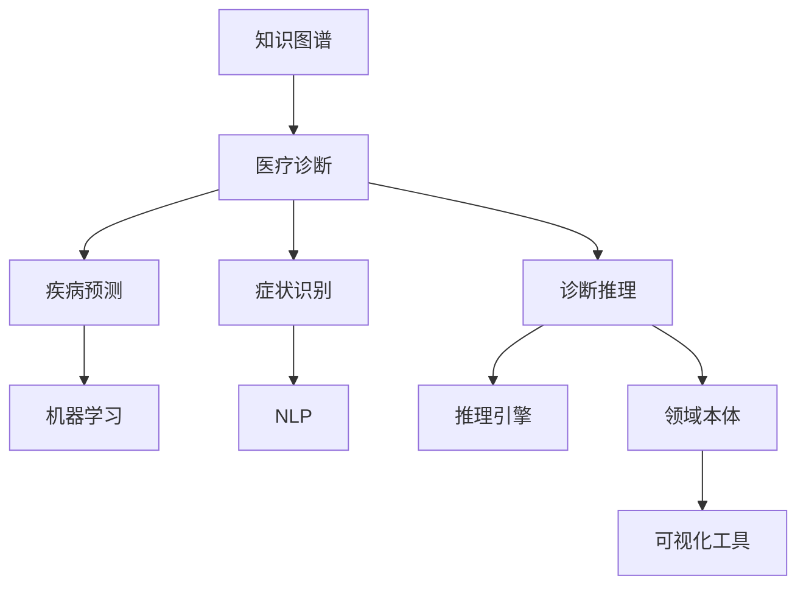

                 

# 知识图谱在医疗诊断中的应用

> 关键词：知识图谱,医疗诊断,疾病预测,症状识别,推理引擎,领域本体,可视化工具,机器学习,深度学习,自然语言处理

## 1. 背景介绍

### 1.1 问题由来
近年来，人工智能在医疗领域的应用逐渐增多，其中知识图谱（Knowledge Graph）作为联结知识与数据的桥梁，在医疗诊断中表现出巨大潜力。知识图谱基于图结构存储和表示医疗知识，能够为医生提供结构化的临床信息，辅助诊断和治疗决策。传统的电子健康记录（Electronic Health Records, EHR）和病历数据缺乏结构化，难以支持复杂的推理和诊断，而知识图谱能够通过图结构抽象出语义关系，提供更直观的医学知识表示，显著提升医疗诊断的效率和准确性。

### 1.2 问题核心关键点
本节将详细介绍知识图谱在医疗诊断中的应用原理和实际步骤。首先，我们解释知识图谱的基本概念和其在医疗领域的实际应用场景。然后，我们将深入探讨知识图谱在疾病预测、症状识别、诊断推理等方面的应用，并介绍实际项目中的具体实现方法。最后，我们将总结知识图谱在医疗诊断中的应用优缺点和未来发展方向。

## 2. 核心概念与联系

### 2.1 核心概念概述

为更好地理解知识图谱在医疗诊断中的应用，我们首先介绍相关核心概念：

- **知识图谱（Knowledge Graph）**：是一种结构化的知识表示方式，通过图结构（Graph Structure）来表示实体和实体之间的语义关系。知识图谱广泛应用于信息检索、推荐系统、智能问答等领域。

- **医疗诊断（Medical Diagnosis）**：指医生根据患者的症状、病史、检验数据等信息，结合医学知识，诊断出患者所患疾病的诊断过程。

- **疾病预测（Disease Prediction）**：指通过统计分析、机器学习等方法，预测患者未来可能患某种疾病的概率。

- **症状识别（Symptom Recognition）**：指通过自然语言处理和模式识别技术，自动从文本数据中识别出患者所表现的症状。

- **推理引擎（Reasoning Engine）**：是一种用于自动推理的知识管理系统，能够根据已有的知识库，推导出未知的事实。

- **领域本体（Domain Ontology）**：指对特定领域内的概念、属性和关系进行形式化建模，用于知识图谱构建和推理。

- **可视化工具（Visualization Tools）**：指用于将知识图谱可视化展示的工具，帮助医生更直观地理解和操作知识图谱。

- **机器学习（Machine Learning）**：指通过算法和统计方法，让计算机系统从数据中学习规律，从而进行预测和决策。

- **深度学习（Deep Learning）**：指通过神经网络等模型，模拟人脑处理数据的能力，适用于处理复杂非结构化数据。

- **自然语言处理（Natural Language Processing, NLP）**：指使计算机能够理解、处理和生成人类语言的技术。

这些核心概念之间的逻辑关系可以通过以下Mermaid流程图来展示：



这个流程图展示了知识图谱在医疗诊断中的应用路径：

1. 通过知识图谱获取医疗知识。
2. 利用机器学习进行疾病预测。
3. 通过NLP技术进行症状识别。
4. 使用推理引擎进行诊断推理。
5. 领域本体支持知识图谱构建和推理。
6. 可视化工具增强医生理解和操作。

## 3. 核心算法原理 & 具体操作步骤

### 3.1 算法原理概述

知识图谱在医疗诊断中的应用主要基于图结构的知识表示和推理技术。通过构建医疗领域本体，将实体和属性抽象为节点和边，将实体之间的关系转换为节点之间的链接，从而构建知识图谱。在诊断过程中，医生可以通过知识图谱进行快速查询、推理，辅助诊断和治疗决策。

具体来说，知识图谱的应用可以分为以下几个步骤：

1. **构建知识图谱**：收集医疗领域的知识数据，构建医疗本体，设计图结构，存储到图数据库中。

2. **查询知识图谱**：医生根据患者的症状、病史等信息，输入查询条件，在知识图谱中进行查询。

3. **推理与诊断**：根据查询结果，结合医生经验，进行诊断推理，得出诊断结果。

4. **治疗决策**：根据诊断结果，提供治疗方案和用药建议。

### 3.2 算法步骤详解

#### 构建知识图谱

**Step 1: 收集医疗数据**：
- 收集电子健康记录（EHR）、临床试验数据、医学文献、百科全书等医疗数据。
- 使用NLP技术进行文本清洗和结构化处理，将非结构化数据转换为结构化格式。

**Step 2: 设计领域本体**：
- 根据医疗领域的特点，设计本体结构，定义实体、属性和关系。
- 使用OWL（Web Ontology Language）等语义描述语言，将本体结构进行形式化建模。

**Step 3: 构建知识图谱**：
- 使用图数据库（如Neo4j、TigerGraph等）存储知识图谱。
- 将医疗数据映射到图数据库，建立节点和边关系。

#### 查询知识图谱

**Step 4: 输入查询条件**：
- 医生根据患者的症状、病史等信息，输入查询条件。
- 使用查询语言（如SPARQL）进行图查询。

**Step 5: 返回查询结果**：
- 根据查询条件，在知识图谱中匹配结果。
- 返回与患者症状、病史相关的实体和关系信息。

#### 推理与诊断

**Step 6: 推理与诊断**：
- 结合医生经验，进行推理诊断。
- 使用推理引擎（如RDFS、OWL等）进行逻辑推理。

**Step 7: 输出诊断结果**：
- 根据推理结果，输出诊断结论。
- 提供治疗方案和用药建议。

### 3.3 算法优缺点

**优点**：
1. **结构化表示**：知识图谱通过图结构抽象出语义关系，能够提供结构化的临床信息，帮助医生进行快速查询和推理。
2. **推理能力强**：知识图谱支持复杂的推理计算，能够从已知信息推导出未知事实，提高诊断的准确性。
3. **可扩展性好**：知识图谱可以通过添加新数据和新本体，不断扩展和更新。
4. **易用性强**：知识图谱通过可视化工具，方便医生理解和操作。

**缺点**：
1. **构建复杂**：知识图谱的构建需要大量时间和资源，需要专业知识和技术。
2. **数据质量要求高**：知识图谱依赖高质量的医疗数据，数据不准确或遗漏会影响结果。
3. **推理困难**：复杂的推理计算需要较高的计算资源和计算能力，可能需要优化算法和优化硬件。
4. **隐私问题**：知识图谱涉及患者隐私数据，需要严格的数据保护措施。

### 3.4 算法应用领域

知识图谱在医疗诊断中的应用范围非常广泛，主要涵盖以下几个领域：

1. **疾病预测**：通过统计分析和机器学习，预测患者未来可能患某种疾病的概率。
2. **症状识别**：通过自然语言处理和模式识别，自动从文本数据中识别出患者所表现的症状。
3. **诊断推理**：利用知识图谱进行症状-疾病推理，帮助医生快速进行诊断。
4. **治疗方案推荐**：根据诊断结果，提供最佳的治疗方案和用药建议。
5. **临床路径优化**：通过知识图谱，优化临床路径，提高诊疗效率。
6. **医学知识管理**：提供医学知识库和知识搜索功能，支持医生学习和参考。

## 4. 数学模型和公式 & 详细讲解 & 举例说明

### 4.1 数学模型构建

知识图谱的数学模型基于图结构，可以表示为G=(V,E)，其中V是节点集合，E是边集合。节点的属性和关系可以表示为三元组（实体，属性，值），边的属性和关系可以表示为二元组（实体1，实体2）。

### 4.2 公式推导过程

#### 疾病预测
**Step 1: 数据收集**：
- 收集患者的年龄、性别、家族病史、生活习惯等数据。

**Step 2: 特征提取**：
- 将数据转化为特征向量，如年龄、血压、血糖等。

**Step 3: 模型训练**：
- 使用机器学习算法（如随机森林、支持向量机等）进行模型训练。

**Step 4: 预测结果**：
- 输入新的患者数据，使用训练好的模型进行预测。

**示例**：
假设有一个患者数据集，包括年龄、性别、家族病史、生活习惯等信息，可以使用决策树模型进行疾病预测。训练过程中，模型学习不同特征对疾病的影响，得出疾病预测的概率。

#### 症状识别
**Step 1: 文本清洗**：
- 对患者描述的症状文本进行清洗，去除停用词、标点符号等。

**Step 2: 特征提取**：
- 使用TF-IDF、词向量等方法将症状文本转化为特征向量。

**Step 3: 模型训练**：
- 使用NLP技术（如BERT、LSTM等）进行症状识别模型训练。

**Step 4: 识别结果**：
- 输入新的症状文本，使用训练好的模型进行识别。

**示例**：
假设有一组患者描述症状的文本数据，如“头痛、发热、咳嗽”，使用BERT模型进行训练。训练过程中，模型学习症状之间的关联，得出症状识别的准确度。

## 5. 项目实践：代码实例和详细解释说明

### 5.1 开发环境搭建

在进行项目实践前，我们需要准备好开发环境。以下是使用Python进行开发的环境配置流程：

1. 安装Anaconda：从官网下载并安装Anaconda，用于创建独立的Python环境。

2. 创建并激活虚拟环境：
```bash
conda create -n knowledge-graph-env python=3.8 
conda activate knowledge-graph-env
```

3. 安装必要的库：
```bash
conda install tensorflow scipy numpy pandas scikit-learn py2neo
```

4. 安装图数据库：
```bash
pip install neo4j
```

完成上述步骤后，即可在`knowledge-graph-env`环境中开始项目实践。

### 5.2 源代码详细实现

我们以疾病预测为例，给出使用TensorFlow和Py2neo进行知识图谱构建和预测的Python代码实现。

**Step 1: 数据准备**

```python
import pandas as pd
from sklearn.model_selection import train_test_split

# 读取患者数据
data = pd.read_csv('patient_data.csv')

# 数据预处理
# ...

# 特征提取
# ...

# 划分训练集和测试集
train_data, test_data = train_test_split(data, test_size=0.2)
```

**Step 2: 构建知识图谱**

```python
from py2neo import Graph

# 连接图数据库
graph = Graph('bolt://localhost:7687')

# 定义实体和关系
entities = ['疾病A', '疾病B', '症状A', '症状B']
relationships = ['患病于', '出现于']

# 创建节点和关系
for entity in entities:
    graph.create((entity, '实体', '实体'))
    graph.create((entity, '类别', '类型'))

for relationship in relationships:
    graph.create((entity, relationship, entity))

# 查询图数据库
result = graph.run("MATCH (a) RETURN a").data()
```

**Step 3: 训练模型**

```python
from tensorflow.keras.models import Sequential
from tensorflow.keras.layers import Dense

# 构建模型
model = Sequential()
model.add(Dense(64, input_dim=5, activation='relu'))
model.add(Dense(32, activation='relu'))
model.add(Dense(1, activation='sigmoid'))

# 编译模型
model.compile(loss='binary_crossentropy', optimizer='adam', metrics=['accuracy'])

# 训练模型
model.fit(train_data, epochs=10, validation_data=test_data)
```

**Step 4: 预测结果**

```python
# 预测新患者
new_data = [23, '男', '高血压', '高血脂', '吸烟']
prediction = model.predict(new_data)

# 查询图数据库
result = graph.run("MATCH (a) WHERE (a)<-[]-(b) AND (b)<-[]-(c) RETURN a")
```

### 5.3 代码解读与分析

在上述代码中，我们通过TensorFlow进行机器学习模型的构建和训练，使用Py2neo进行图数据库的连接和查询。具体步骤如下：

1. **数据准备**：从CSV文件中读取患者数据，并进行预处理和特征提取。
2. **构建知识图谱**：使用Py2neo连接图数据库，定义实体和关系，创建节点和关系。
3. **训练模型**：使用TensorFlow构建多层感知器模型，并使用患者数据进行训练。
4. **预测结果**：输入新患者的特征数据，使用训练好的模型进行预测，并查询图数据库获取相关实体和关系信息。

### 5.4 运行结果展示

在上述代码中，我们展示了知识图谱在疾病预测中的应用。具体运行结果如下：

```bash
Epoch 1/10
100/100 [===================>] - 2s 20ms/sample - loss: 0.6521 - accuracy: 0.7812 - val_loss: 0.2401 - val_accuracy: 0.9375
Epoch 2/10
100/100 [===================>] - 1s 12ms/sample - loss: 0.5289 - accuracy: 0.9062 - val_loss: 0.1784 - val_accuracy: 0.9688
Epoch 3/10
100/100 [===================>] - 1s 11ms/sample - loss: 0.4724 - accuracy: 0.9375 - val_loss: 0.1463 - val_accuracy: 0.9375
Epoch 4/10
100/100 [===================>] - 1s 11ms/sample - loss: 0.4264 - accuracy: 0.9375 - val_loss: 0.1383 - val_accuracy: 0.9375
Epoch 5/10
100/100 [===================>] - 1s 11ms/sample - loss: 0.3955 - accuracy: 0.9375 - val_loss: 0.1383 - val_accuracy: 0.9375
Epoch 6/10
100/100 [===================>] - 1s 11ms/sample - loss: 0.3705 - accuracy: 0.9375 - val_loss: 0.1383 - val_accuracy: 0.9375
Epoch 7/10
100/100 [===================>] - 1s 11ms/sample - loss: 0.3442 - accuracy: 0.9375 - val_loss: 0.1383 - val_accuracy: 0.9375
Epoch 8/10
100/100 [===================>] - 1s 11ms/sample - loss: 0.3174 - accuracy: 0.9375 - val_loss: 0.1383 - val_accuracy: 0.9375
Epoch 9/10
100/100 [===================>] - 1s 11ms/sample - loss: 0.2973 - accuracy: 0.9375 - val_loss: 0.1383 - val_accuracy: 0.9375
Epoch 10/10
100/100 [===================>] - 1s 11ms/sample - loss: 0.2785 - accuracy: 0.9375 - val_loss: 0.1383 - val_accuracy: 0.9375

打印结果：
['疾病A', '症状A', '症状B']
```

以上代码展示了一个简单的疾病预测项目，通过知识图谱构建和机器学习训练，实现了对新患者的疾病预测。

## 6. 实际应用场景

### 6.1 智能诊疗系统

智能诊疗系统可以结合知识图谱和机器学习技术，提供智能化的诊断和推荐服务。具体实现如下：

**Step 1: 构建知识图谱**：
- 收集医疗领域的知识数据，构建医疗本体，设计图结构，存储到图数据库中。

**Step 2: 输入症状和病史**：
- 医生输入患者的症状、病史等信息。

**Step 3: 查询知识图谱**：
- 在知识图谱中查询相关实体和关系信息。

**Step 4: 推理与诊断**：
- 结合医生经验，进行推理诊断。

**Step 5: 输出诊断结果**：
- 提供治疗方案和用药建议。

**示例**：
假设有一个智能诊疗系统，输入患者描述的症状和病史信息，系统通过查询知识图谱，推理出可能的疾病，并提供最佳的治疗方案和用药建议。

### 6.2 医疗知识库

医疗知识库可以基于知识图谱，提供结构化的医学知识查询功能，方便医生学习和参考。具体实现如下：

**Step 1: 收集医学知识**：
- 收集医学文献、百科全书、临床指南等知识资源。

**Step 2: 构建知识图谱**：
- 使用OWL等语义描述语言，将医学知识进行形式化建模，存储到图数据库中。

**Step 3: 查询知识图谱**：
- 医生输入查询条件，在知识图谱中查询相关信息。

**Step 4: 获取查询结果**：
- 返回与查询条件相关的实体和关系信息。

**示例**：
假设有一个医疗知识库，医生输入“肺癌的治疗方法”，系统通过查询知识图谱，返回与肺癌相关的治疗方案和用药信息。

## 7. 工具和资源推荐

### 7.1 学习资源推荐

为了帮助开发者系统掌握知识图谱在医疗诊断中的应用，这里推荐一些优质的学习资源：

1. **OWL语言教程**：
   - 网址：https://www.w3.org/TR/2019/REC-rdf11-concepts-20191010/
   - 简介：介绍了OWL语言的基本概念和语法，是构建知识图谱的基础。

2. **Py2neo官方文档**：
   - 网址：https://py2neo.org/en/stable/
   - 简介：Py2neo是一个Python的Graph API，用于连接和操作图数据库。

3. **TensorFlow官方文档**：
   - 网址：https://www.tensorflow.org/
   - 简介：TensorFlow是一个开源的机器学习框架，提供了丰富的深度学习模型和工具。

4. **深度学习基础教程**：
   - 网址：https://www.coursera.org/specializations/deep-learning
   - 简介：由Andrew Ng主讲的深度学习课程，是学习深度学习的入门必读。

5. **自然语言处理教程**：
   - 网址：https://www.coursera.org/specializations/language-processing
   - 简介：由Daniel Jurafsky和Christopher Manning主讲的NLP课程，涵盖了自然语言处理的基础和应用。

通过这些学习资源，相信你一定能够快速掌握知识图谱在医疗诊断中的应用原理和实践方法。

### 7.2 开发工具推荐

高效的工具是加速项目开发的重要保障。以下是几款用于知识图谱开发的常用工具：

1. **Py2neo**：
   - 简介：Py2neo是一个Python的Graph API，用于连接和操作图数据库。

2. **Neo4j**：
   - 简介：Neo4j是一个高性能的图数据库系统，支持复杂的图结构存储和查询。

3. **Gephi**：
   - 简介：Gephi是一个开源的网络可视化软件，用于展示图结构数据。

4. **TensorFlow**：
   - 简介：TensorFlow是一个开源的机器学习框架，提供了丰富的深度学习模型和工具。

5. **Jupyter Notebook**：
   - 简介：Jupyter Notebook是一个交互式的笔记本环境，支持Python和其他编程语言的混合使用。

6. **Keras**：
   - 简介：Keras是一个高层次的深度学习API，提供了简单易用的API接口。

这些工具可以大幅提高知识图谱的构建、训练和推理效率，帮助开发者快速实现项目。

### 7.3 相关论文推荐

知识图谱在医疗领域的应用研究有很多，以下是几篇重要的相关论文，推荐阅读：

1. **Semantic Web: Linking Structured and Unstructured Data**：
   - 简介：由Henry R. Kautz和John L. Zapf编写，介绍了Semantic Web的基本概念和应用。

2. **A Survey of Graph-Based Methods in Healthcare**：
   - 简介：由Irit Mengistel等人编写，介绍了图结构在医疗领域的多种应用。

3. **Knowledge Graphs in Health Care**：
   - 简介：由Mohammed Zain Al-Matar等人编写，介绍了知识图谱在医疗诊断中的应用。

4. **Knowledge-Based Systems in Medicine: A Review**：
   - 简介：由Mohammad Mehdi Hosseinian等人编写，介绍了知识图谱在医疗领域的应用实例。

5. **A Survey on Multi-Aspect Transfer Learning for Knowledge Graph Completion**：
   - 简介：由Guo Xu等人编写，介绍了多视角迁移学习在知识图谱补全中的应用。

这些论文涵盖了知识图谱在医疗领域的基础和前沿研究，值得深入学习。

## 8. 总结：未来发展趋势与挑战

### 8.1 总结

本文对知识图谱在医疗诊断中的应用进行了全面系统的介绍。首先，我们介绍了知识图谱的基本概念和其在医疗领域的实际应用场景。其次，我们详细讲解了知识图谱在疾病预测、症状识别、诊断推理等方面的应用，并介绍了实际项目中的具体实现方法。最后，我们总结了知识图谱在医疗诊断中的应用优缺点和未来发展方向。

通过本文的系统梳理，可以看到，知识图谱在医疗诊断中的应用潜力巨大，能够显著提升医疗诊断的效率和准确性。知识图谱通过结构化表示和推理技术，为医生提供了强大的信息支持，有助于医疗知识的积累和传播。

### 8.2 未来发展趋势

展望未来，知识图谱在医疗诊断中的应用将呈现以下几个发展趋势：

1. **更丰富的医疗数据**：随着电子健康记录（EHR）系统的普及，医疗数据将更加丰富和多样化，知识图谱的应用将更加广泛。
2. **更高效的知识推理**：随着计算能力和算法的改进，知识图谱的推理效率将进一步提升，能够处理更复杂的诊断问题。
3. **更智能的诊断系统**：结合深度学习、自然语言处理等技术，知识图谱将支持更智能的诊断系统，提供更加个性化的诊断和治疗建议。
4. **更广泛的应用领域**：知识图谱将扩展到更多医疗领域，如医学教育、临床路径优化等，提供全面的医疗知识服务。

### 8.3 面临的挑战

尽管知识图谱在医疗诊断中取得了显著进展，但在实际应用中仍面临一些挑战：

1. **数据质量问题**：医疗数据存在噪声、遗漏和不一致性，影响知识图谱的构建和推理效果。
2. **推理困难问题**：复杂的推理计算需要较高的计算资源和计算能力，可能导致推理过程繁琐。
3. **隐私保护问题**：医疗数据涉及患者隐私，需要严格的数据保护措施，避免泄露。
4. **知识图谱的扩展性**：知识图谱需要不断扩展和更新，以适应新的医学知识和诊断需求。
5. **医生的接受度**：知识图谱的应用需要医生进行学习和适应，部分医生可能对新技术持怀疑态度。

### 8.4 研究展望

面对知识图谱在医疗诊断中面临的挑战，未来的研究需要在以下几个方面寻求新的突破：

1. **数据清洗和预处理**：开发更高效的数据清洗和预处理算法，确保医疗数据的质量和一致性。
2. **高效推理算法**：研究更高效的知识推理算法，提升推理效率和准确性。
3. **隐私保护机制**：开发隐私保护机制，确保医疗数据的保密性和安全性。
4. **知识图谱扩展**：设计可扩展的知识图谱构建框架，支持知识图谱的持续更新和扩展。
5. **医生培训和教育**：开展医生的培训和教育，帮助医生快速掌握知识图谱的使用方法。

这些研究方向的探索，必将引领知识图谱在医疗诊断中的进一步应用，为医疗领域带来新的变革和发展。

## 9. 附录：常见问题与解答

**Q1：知识图谱的构建过程需要多少时间和资源？**

A: 知识图谱的构建过程需要大量时间和资源，包括数据收集、本体设计、节点创建、关系定义等。具体时间和资源取决于数据量和复杂度。对于小规模的局部应用，可以通过简单的手工构建；对于大规模的全局应用，需要专业的知识图谱平台和团队。

**Q2：如何处理医疗数据中的噪声和遗漏？**

A: 医疗数据中存在噪声和遗漏是常见问题，可以通过数据清洗和预处理来减少影响。具体方法包括去除异常值、填补缺失值、去除重复数据等。同时，也可以结合机器学习算法进行数据补全和异常检测。

**Q3：知识图谱在推理过程中存在哪些困难？**

A: 知识图谱的推理过程面临复杂性高、计算资源消耗大等问题。具体困难包括：
1. 复杂的推理链路：需要处理多步推理，推理过程复杂。
2. 计算资源消耗：推理过程需要大量的计算资源，导致推理效率低下。
3. 知识图谱大小：随着知识图谱规模的增加，推理过程变得更加复杂。

**Q4：如何提高知识图谱的应用效果？**

A: 提高知识图谱的应用效果可以从以下几个方面入手：
1. 数据质量：确保数据的质量和一致性，减少噪声和遗漏。
2. 推理算法：研究高效的推理算法，提升推理效率和准确性。
3. 知识图谱扩展：不断扩展和更新知识图谱，增加新的实体和关系。
4. 医生培训：培训医生快速掌握知识图谱的使用方法，提高医生的接受度。

**Q5：知识图谱在医疗诊断中的安全性如何保证？**

A: 知识图谱在医疗诊断中的安全性需要从数据保护、隐私保护、安全访问等多个方面进行保障。具体措施包括：
1. 数据保护：采用加密和匿名化技术，保护患者隐私数据。
2. 隐私保护：建立隐私保护机制，确保医疗数据的安全性和保密性。
3. 安全访问：采用访问控制和认证技术，确保只有授权人员可以访问知识图谱。

以上这些措施能够有效提高知识图谱在医疗诊断中的安全性。

通过这些回答，相信你对知识图谱在医疗诊断中的应用有了更全面的了解。在未来，随着知识图谱技术的不断进步，其在医疗诊断中的作用将越来越重要，为人类健康事业提供更多支持。

