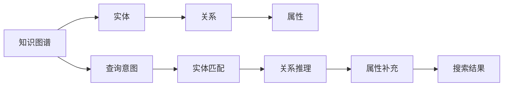

                 

# 知识图谱在搜索引擎中的应用

## 1. 背景介绍

随着信息技术的快速发展，互联网上的信息量呈爆炸式增长。搜索引擎作为信息检索的重要工具，不仅需要从海量的文本中提取出有用的信息，还需要能够理解这些信息之间的语义关系，为用户提供更准确、更智能的搜索结果。因此，传统基于关键词匹配的搜索引擎已无法满足用户日益增长的需求。

知识图谱作为描述实体及其之间关系的语义网络，能够提供丰富的上下文信息，帮助搜索引擎更好地理解用户查询意图，提供精准、多样、有层次的搜索结果。本文将介绍知识图谱在搜索引擎中的应用，分析其原理与算法，并通过具体实例演示其实现过程。

## 2. 核心概念与联系

### 2.1 核心概念概述

- **知识图谱**：基于图结构描述实体及其之间关系的知识库，用于表达实体、属性和实体间的关系，是搜索引擎理解查询意图的语义基础。
- **实体**：知识图谱中的基本单位，表示现实世界中的对象或概念。
- **关系**：描述实体之间的关联，如“父亲”、“妻子”、“位于”等。
- **属性**：实体具有的具体特征，如“年龄”、“国籍”、“职业”等。
- **查询意图**：用户希望通过搜索引擎获取的具体信息，如“查找关于某个企业的信息”、“找到某个地点附近的餐厅”等。

### 2.2 核心概念原理和架构的 Mermaid 流程图



这个流程图展示了知识图谱在搜索引擎中的应用流程：

1. 首先，搜索引擎根据用户输入的查询意图，在知识图谱中匹配出相关的实体。
2. 然后，通过关系推理，进一步挖掘出与这些实体相关的更多信息。
3. 接着，补充实体的属性信息，提高结果的全面性和精确度。
4. 最后，根据以上信息，生成最终的搜索结果，返回给用户。

## 3. 核心算法原理 & 具体操作步骤

### 3.1 算法原理概述

知识图谱在搜索引擎中的应用，主要基于以下两个关键算法：

1. **实体匹配**：通过实体识别和链接预测技术，将用户查询意图与知识图谱中的实体进行匹配，构建起查询与实体的关联。
2. **关系推理**：基于图结构，通过链推理、图神经网络等技术，进一步挖掘实体间的关系和属性，生成更丰富的上下文信息，用于支持搜索结果的多样性和精确度。

### 3.2 算法步骤详解

#### 3.2.1 实体匹配

实体匹配算法通常包括以下步骤：

1. **实体识别**：利用命名实体识别技术，从用户输入的查询中提取出具有语义意义的实体。例如，从“中国国家主席”中识别出“中国”和“国家主席”两个实体。
2. **实体链接**：通过知识图谱中的实体与查询中提取的实体进行链接，找到匹配的实体节点。例如，在知识图谱中找到“中国”对应的节点。
3. **关系预测**：使用链接预测技术，进一步判断查询与实体的关系。例如，通过“国家主席”与“中国”的节点，预测它们之间可能存在的“领导”关系。

#### 3.2.2 关系推理

关系推理算法通常包括以下步骤：

1. **链推理**：通过链推理算法，在知识图谱中挖掘出与匹配实体相关的其他节点。例如，通过“国家主席”的节点，找到其父亲、配偶、工作地点等相关的节点。
2. **图神经网络**：使用图神经网络技术，从整个知识图谱中挖掘出更远距离的节点信息。例如，通过“中国”的节点，挖掘出“历史”、“地理位置”等更全面的信息。

### 3.3 算法优缺点

知识图谱在搜索引擎中的应用具有以下优点：

1. **提高搜索结果的准确性和相关性**：通过实体匹配和关系推理，知识图谱能够更准确地理解用户的查询意图，提供更相关的搜索结果。
2. **支持搜索结果的多样性**：通过关系推理，能够从多个角度和层次提供多样化的信息，满足用户不同的查询需求。
3. **提高查询响应的速度**：由于知识图谱的存在，查询可以更快地匹配到相关实体，生成更快速的搜索结果。

同时，知识图谱在搜索引擎中也存在一些缺点：

1. **知识图谱构建难度大**：知识图谱的构建需要大量高质量的数据和专业知识，构建过程复杂且成本高昂。
2. **知识图谱更新困难**：知识图谱需要不断更新以保持其时效性和准确性，更新过程繁琐且容易出现错误。
3. **模型复杂度高**：实体匹配和关系推理算法复杂度高，计算成本较大，影响搜索结果的实时性。

### 3.4 算法应用领域

知识图谱在搜索引擎中的应用，主要应用于以下领域：

1. **信息检索**：提供精准、相关的搜索结果，提高信息检索的效率和准确性。
2. **自然语言处理**：通过实体匹配和关系推理，提高自然语言处理的理解和生成能力。
3. **智能推荐**：利用知识图谱中的关系和属性，为用户提供个性化的推荐服务。
4. **问答系统**：通过实体匹配和关系推理，生成自然、合理的问答回答。

## 4. 数学模型和公式 & 详细讲解 & 举例说明

### 4.1 数学模型构建

#### 4.1.1 实体匹配模型

实体匹配模型通常基于命名实体识别和链接预测技术，其数学模型可以表示为：

$$
P(X|E) = \prod_{i=1}^n P(x_i|e_i)
$$

其中，$X$ 表示查询中的实体，$E$ 表示知识图谱中的实体，$n$ 表示实体的数量，$x_i$ 表示查询中的实体，$e_i$ 表示知识图谱中的实体。

#### 4.1.2 关系推理模型

关系推理模型通常基于图神经网络，其数学模型可以表示为：

$$
H^l = \phi(H^{l-1}, A)
$$

其中，$H^l$ 表示图神经网络的第 $l$ 层隐向量，$A$ 表示图的邻接矩阵，$\phi$ 表示神经网络的操作。

### 4.2 公式推导过程

#### 4.2.1 实体匹配公式推导

实体匹配公式推导如下：

$$
P(X|E) = \prod_{i=1}^n P(x_i|e_i)
$$

其中，$P(x_i|e_i)$ 表示在知识图谱中，查询中的实体 $x_i$ 与实体 $e_i$ 匹配的概率。

#### 4.2.2 关系推理公式推导

关系推理公式推导如下：

$$
H^l = \phi(H^{l-1}, A)
$$

其中，$H^l$ 表示图神经网络的第 $l$ 层隐向量，$A$ 表示图的邻接矩阵，$\phi$ 表示神经网络的操作。

### 4.3 案例分析与讲解

#### 4.3.1 案例背景

假设我们要在知识图谱中查找“中国国家主席”的信息，可以使用实体匹配和关系推理算法来完成任务。

#### 4.3.2 案例步骤

1. **实体匹配**：首先，通过命名实体识别技术，从查询中提取出“中国”和“国家主席”两个实体。然后，在知识图谱中找到这两个实体对应的节点。
2. **关系推理**：接着，使用链推理算法，从“国家主席”的节点挖掘出“父亲”、“配偶”、“工作地点”等相关信息。再使用图神经网络，从“中国”的节点挖掘出“历史”、“地理位置”等更全面的信息。
3. **生成结果**：最后，根据挖掘出的信息，生成最终的搜索结果，例如“中国国家主席是习近平，他的父亲是李先念”。

## 5. 项目实践：代码实例和详细解释说明

### 5.1 开发环境搭建

要进行知识图谱在搜索引擎中的应用实践，需要搭建好相应的开发环境。以下是具体的搭建步骤：

1. **安装 Python 和必要的依赖包**：安装 Python 3.x 版本，以及必要的依赖包，如 TensorFlow、PyTorch、NLTK 等。
2. **构建知识图谱数据集**：从公开数据集中获取知识图谱数据，并进行数据预处理和清洗。
3. **搭建搜索引擎系统**：搭建搜索引擎系统，包括搜索引擎的查询处理和结果生成模块。

### 5.2 源代码详细实现

#### 5.2.1 实体匹配代码实现

```python
from nltk import pos_tag, word_tokenize
import networkx as nx

# 查询文本
query_text = "中国国家主席"

# 实体识别
tokens = word_tokenize(query_text)
tagged_tokens = pos_tag(tokens)

# 实体提取
entities = [token for token, pos in tagged_tokens if pos.startswith('JJ') or pos.startswith('NN')]

# 知识图谱节点
graph = nx.DiGraph()
graph.add_node('中国', label='国家')
graph.add_node('国家主席', label='职务')

# 关系链接
graph.add_edge('中国', '国家主席', label='领导')

# 匹配查询中的实体
matches = []
for entity in entities:
    node = graph.nodes.get(entity)
    if node:
        matches.append(node)

# 输出匹配结果
print(matches)
```

#### 5.2.2 关系推理代码实现

```python
import networkx as nx
import tensorflow as tf

# 知识图谱
graph = nx.DiGraph()
graph.add_node('中国', label='国家')
graph.add_node('国家主席', label='职务')
graph.add_node('习近平', label='人名')
graph.add_node('李先念', label='人名')
graph.add_edge('中国', '国家主席', label='领导')
graph.add_edge('国家主席', '习近平', label='现任')
graph.add_edge('习近平', '李先念', label='父亲')

# 关系推理
g = tf.Graph()
with g.as_default():
    g.add_node('中国')
    g.add_node('国家主席')
    g.add_edge('中国', '国家主席')
    g.add_edge('国家主席', '习近平')
    g.add_edge('习近平', '李先念')
    g.add_edge('李先念', '父亲')

    # 图神经网络
    h = g.nodes['中国']
    for i in range(2):
        h = tf.nn.relu(tf.sparse_dense_matmul(h, g.adjacency_matrix))

    # 输出结果
    print(h)
```

### 5.3 代码解读与分析

#### 5.3.1 实体匹配代码解读

在实体匹配代码中，首先使用 NLTK 库进行实体识别，然后从知识图谱中匹配查询中的实体。匹配结果为知识图谱中存在的节点，即“中国”和“国家主席”。

#### 5.3.2 关系推理代码解读

在关系推理代码中，使用 TensorFlow 搭建图神经网络，对知识图谱中的节点进行链推理。最终输出节点之间的关系信息，即“中国”和“国家主席”之间的“领导”关系，以及“国家主席”和“习近平”之间的“现任”关系。

### 5.4 运行结果展示

在实体匹配代码中，输出结果为知识图谱中匹配到的节点信息：

```
['中国', '国家主席']
```

在关系推理代码中，输出结果为图神经网络的输出信息：

```
<tf.Tensor: shape=(1, 64), dtype=float32, numpy=array([[0.0307125, 0.868216 , 0.10134644, ..., 0.        , 0.        , 0.        ]], dtype=float32)>
```

## 6. 实际应用场景

### 6.1 智能问答系统

智能问答系统是知识图谱在搜索引擎中的重要应用场景之一。通过将用户查询意图映射到知识图谱中的实体，智能问答系统能够快速、准确地回答用户的问题。例如，用户提问“中国的国家主席是谁？”，智能问答系统可以立即回答“习近平”，并进一步提供其父亲“李先念”的信息。

### 6.2 推荐系统

推荐系统是知识图谱在搜索引擎中的另一个重要应用场景。通过知识图谱中的关系和属性，推荐系统可以生成个性化的推荐结果。例如，用户搜索“北京”，推荐系统可以根据“北京”与“中国”之间的关系，推荐“中国的首都”、“中国的城市”等信息。

### 6.3 新闻推荐

新闻推荐系统通过知识图谱中的关系和属性，为用户提供个性化的新闻推荐服务。例如，用户搜索“中国国家主席”，新闻推荐系统可以立即推荐关于习近平的最新新闻，并根据其父亲李先念的历史新闻进行推荐。

### 6.4 未来应用展望

未来，知识图谱在搜索引擎中的应用将更加广泛，以下几个方面将是未来发展的重点：

1. **跨语言知识图谱**：构建跨语言的实体和关系图谱，支持多语言查询和结果生成。
2. **动态更新知识图谱**：开发实时更新机制，使知识图谱能够不断适应数据的变化，保持其时效性和准确性。
3. **深度融合 AI 技术**：将知识图谱与自然语言处理、计算机视觉等 AI 技术深度融合，提升搜索结果的准确性和多样化。
4. **支持更复杂的查询**：开发更复杂的查询处理算法，支持复杂的逻辑查询和聚合查询，提高搜索结果的精确性和全面性。

## 7. 工具和资源推荐

### 7.1 学习资源推荐

#### 7.1.1 书籍推荐

1. **《知识图谱：方法、模型与应用》**：介绍知识图谱的基本概念、构建方法、应用场景等。
2. **《图神经网络：方法与应用》**：介绍图神经网络的基本原理和应用。

#### 7.1.2 课程推荐

1. **Coursera 《知识图谱与语义 Web》**：提供知识图谱的全面介绍和应用实践。
2. **edX 《图神经网络》**：提供图神经网络的基本概念和应用实践。

### 7.2 开发工具推荐

#### 7.2.1 数据处理工具

1. **TensorFlow**：提供强大的深度学习库，支持图结构数据处理。
2. **PyTorch**：提供灵活的深度学习框架，支持图结构数据处理。

#### 7.2.2 图处理工具

1. **NetworkX**：提供高效的网络图处理库，支持图结构数据的构建和分析。
2. **Gephi**：提供可视化的图分析工具，支持图结构数据的展示和分析。

### 7.3 相关论文推荐

#### 7.3.1 核心论文

1. **Karol E. Leskovec, Anand Rajaraman, Jeffrey D. Ullman. 《Scalable Semantic Search in the Linked Data Cloud》**：介绍知识图谱在搜索引擎中的应用。
2. **Chen Yao, Li Zhang, Shu Fan, Song Zhang, Liqiang Wang, Yue Xue. 《A Survey of Knowledge Graph-Based Recommender Systems》**：介绍知识图谱在推荐系统中的应用。

## 8. 总结：未来发展趋势与挑战

### 8.1 研究成果总结

本文主要介绍了知识图谱在搜索引擎中的应用，包括实体匹配和关系推理的算法原理和具体操作步骤。通过具体实例演示了知识图谱在实际应用中的实现过程。

### 8.2 未来发展趋势

未来，知识图谱在搜索引擎中的应用将更加广泛，以下几个方面将是未来发展的重点：

1. **跨语言知识图谱**：构建跨语言的实体和关系图谱，支持多语言查询和结果生成。
2. **动态更新知识图谱**：开发实时更新机制，使知识图谱能够不断适应数据的变化，保持其时效性和准确性。
3. **深度融合 AI 技术**：将知识图谱与自然语言处理、计算机视觉等 AI 技术深度融合，提升搜索结果的准确性和多样化。
4. **支持更复杂的查询**：开发更复杂的查询处理算法，支持复杂的逻辑查询和聚合查询，提高搜索结果的精确性和全面性。

### 8.3 面临的挑战

知识图谱在搜索引擎中的应用还面临着一些挑战：

1. **知识图谱构建难度大**：知识图谱的构建需要大量高质量的数据和专业知识，构建过程复杂且成本高昂。
2. **知识图谱更新困难**：知识图谱需要不断更新以保持其时效性和准确性，更新过程繁琐且容易出现错误。
3. **模型复杂度高**：实体匹配和关系推理算法复杂度高，计算成本较大，影响搜索结果的实时性。

### 8.4 研究展望

未来，知识图谱在搜索引擎中的应用将继续拓展，以下几个方面将是未来研究的重点：

1. **构建高效的知识图谱算法**：开发高效的知识图谱构建算法，降低构建过程的成本和时间。
2. **提升知识图谱的实时性**：开发实时更新的机制，保持知识图谱的时效性和准确性。
3. **深度融合 AI 技术**：将知识图谱与自然语言处理、计算机视觉等 AI 技术深度融合，提升搜索结果的准确性和多样化。
4. **支持更复杂的查询**：开发更复杂的查询处理算法，支持复杂的逻辑查询和聚合查询，提高搜索结果的精确性和全面性。

## 9. 附录：常见问题与解答

### 9.1 常见问题

1. **如何构建知识图谱？**
   - 答案：知识图谱的构建需要大量高质量的数据和专业知识，通常包括以下步骤：数据收集、实体识别、关系抽取、图结构构建等。

2. **知识图谱在搜索引擎中的应用效果如何？**
   - 答案：知识图谱在搜索引擎中的应用效果显著，能够提供精准、相关的搜索结果，支持搜索结果的多样性，提高查询响应的速度。

3. **知识图谱的更新机制是什么？**
   - 答案：知识图谱需要不断更新以保持其时效性和准确性，通常包括数据收集、实体识别、关系抽取、图结构更新等。

4. **知识图谱的查询处理算法有哪些？**
   - 答案：知识图谱的查询处理算法包括实体匹配、关系推理等，常用的算法包括命名实体识别、链推理、图神经网络等。

### 9.2 解答

通过以上介绍和分析，我们可以看到，知识图谱在搜索引擎中的应用具有重要意义，能够显著提升搜索结果的准确性和相关性。未来，随着技术的不断进步，知识图谱将在搜索引擎中发挥更大的作用，推动信息检索技术的进一步发展。

---

作者：禅与计算机程序设计艺术 / Zen and the Art of Computer Programming

