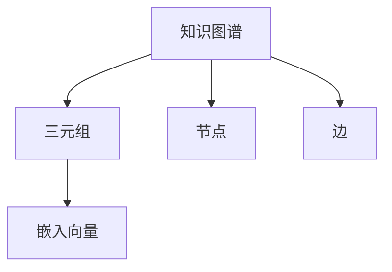

                 

# 知识图谱在社交网络分析中的应用

## 1. 背景介绍

在当今信息爆炸的时代，社交网络已成为人们获取信息和互动的重要平台。然而，社交网络中存在的信息往往分散、杂乱，难以直接进行有效的分析和利用。知识图谱作为一种结构化、语义化的表示方法，为社交网络分析提供了一种高效、精准的解决方案。

### 1.1 问题由来

社交网络分析旨在从大规模社交数据中提取有价值的信息，如用户行为模式、社交关系网络等。传统的分析方法依赖于数据挖掘、统计分析等手段，但这些方法往往存在以下局限：

- **数据噪声**：社交网络中存在大量无关数据、错误信息，传统的统计方法难以有效处理。
- **信息维度高**：社交网络数据通常包括用户状态、行为、关系等多种维度，单一的统计模型难以兼顾。
- **动态变化**：社交网络结构、用户行为频繁变化，传统的静态分析方法难以捕捉动态特性。

为了克服这些局限，知识图谱在社交网络分析中的应用应运而生。知识图谱能够通过结构化语义模型，将社交网络中的数据进行组织和关联，提升分析效率和精度。

### 1.2 问题核心关键点

知识图谱在社交网络分析中的应用主要集中在以下几个关键点上：

- **数据结构化**：将原始社交数据转化为结构化的三元组形式，如用户-关系-用户，便于模型处理。
- **语义关系建模**：通过语义模型，捕捉数据中的内在关系，提升分析深度和准确度。
- **动态网络分析**：利用时间序列模型，对社交网络进行动态演化分析，把握最新趋势。
- **智能推荐系统**：结合知识图谱，实现更精准的个性化推荐，提升用户体验。

这些关键点相互配合，使知识图谱成为社交网络分析的有力工具。通过对其深入理解，可以更好地应用知识图谱技术，提高社交网络分析的效能和应用广度。

## 2. 核心概念与联系

### 2.1 核心概念概述

为了更好地理解知识图谱在社交网络分析中的应用，本节将介绍几个关键概念：

- **知识图谱(Knowledge Graph)**：一种结构化语义数据模型，由节点和边组成，节点表示实体，边表示实体之间的关系。
- **社交网络(Social Network)**：由用户及其关系构成的网络结构，用于描述人与人之间的互动和联系。
- **三元组(Triple)**：知识图谱的基本组成单元，表示为一个实体-关系-实体形式。
- **节点(Node)**：知识图谱中的实体，可以是人、组织、地点等。
- **边(Edge)**：知识图谱中实体之间的关系，如“好友”、“关注”等。
- **嵌入向量(Embedding)**：将节点转化为高维向量，用于模型训练和推理。

这些核心概念之间的关系可以通过以下Mermaid流程图来展示：



这个流程图展示了知识图谱、三元组、节点、边、嵌入向量之间的逻辑关系。

## 3. 核心算法原理 & 具体操作步骤
### 3.1 算法原理概述

知识图谱在社交网络分析中的应用，本质上是通过语义建模将社交网络数据转化为结构化形式，利用结构化数据进行深度学习和推理。其核心思想是：

1. **结构化数据表示**：将社交网络中的实体和关系，通过三元组形式进行结构化表示，便于后续的模型处理。
2. **语义关系建模**：利用知识图谱中的节点和边，捕捉社交网络中的语义关系，提升分析深度。
3. **深度学习推理**：通过嵌入向量等表示方法，将知识图谱数据输入到深度学习模型中，进行推理预测。
4. **推荐系统优化**：结合知识图谱与推荐算法，提升社交网络中的个性化推荐效果。

### 3.2 算法步骤详解

知识图谱在社交网络分析中的主要操作流程包括以下步骤：

**Step 1: 数据预处理**
- 收集社交网络数据，包括用户状态、行为、关系等。
- 数据清洗：去除无关数据、噪声数据，确保数据质量。
- 数据标注：对社交关系进行人工标注，生成初始知识图谱。

**Step 2: 知识图谱构建**
- 实体识别：通过命名实体识别(NER)等技术，从原始数据中识别出实体。
- 关系抽取：通过关系抽取算法，从社交互动中挖掘出实体之间的关系。
- 知识图谱生成：将实体和关系进行结构化表示，构建知识图谱。

**Step 3: 语义关系建模**
- 节点嵌入：通过词嵌入、图嵌入等技术，将节点转化为高维向量表示。
- 关系嵌入：利用关系矩阵或图神经网络，捕捉节点间的关系。
- 语义模型：结合节点嵌入和关系嵌入，构建语义模型，捕捉更深层次的语义信息。

**Step 4: 深度学习推理**
- 图卷积网络(GCN)：利用GCN等图神经网络，对知识图谱进行推理预测。
- 嵌入向量更新：通过反向传播等算法，更新嵌入向量，优化模型性能。
- 特征融合：结合社交网络中的其他特征，如时间序列、用户属性等，提升模型泛化能力。

**Step 5: 智能推荐系统**
- 推荐模型：利用协同过滤、矩阵分解等推荐算法，生成推荐结果。
- 知识图谱融合：将推荐模型与知识图谱融合，提升推荐效果。
- 动态更新：根据用户行为和社交网络变化，实时更新推荐模型和知识图谱。

### 3.3 算法优缺点

知识图谱在社交网络分析中的应用具有以下优点：

1. **高效性**：通过结构化表示，知识图谱能够显著提高数据分析效率。
2. **深度语义理解**：通过语义关系建模，知识图谱能够捕捉更深层的信息关系，提升分析精度。
3. **动态适应性**：结合时间序列模型，知识图谱能够进行动态网络分析，把握最新趋势。
4. **个性化推荐**：结合知识图谱，推荐系统能够提供更精准的个性化推荐。

同时，知识图谱在应用过程中也存在一些局限：

1. **数据标注成本高**：构建高质量的知识图谱需要大量人工标注，成本较高。
2. **模型复杂度高**：知识图谱涉及多维数据、复杂模型，实现和调试难度较大。
3. **泛化能力不足**：知识图谱在特定领域的泛化能力可能有限，需要针对具体场景进行优化。
4. **实时性挑战**：知识图谱的动态更新需要实时处理大量数据，存在实时性挑战。

尽管如此，知识图谱在社交网络分析中的应用前景仍然广阔，未来需要通过技术进步和应用优化，克服这些局限，实现更高效、更精准的分析效果。

### 3.4 算法应用领域

知识图谱在社交网络分析中的应用，涵盖了以下几个主要领域：

- **用户行为分析**：通过知识图谱分析用户的行为模式，如兴趣、社交网络等，用于个性化推荐、用户画像构建等。
- **社交关系网络**：利用知识图谱构建用户之间的关系网络，用于发现用户间的潜在关系、社交影响等。
- **内容推荐系统**：结合知识图谱与推荐算法，提升社交网络中的内容推荐效果，如文章、视频等。
- **社交事件监测**：通过知识图谱分析社交网络中的事件，用于舆情监测、危机预警等。
- **社区挖掘**：利用知识图谱分析社交网络中的社区结构，用于发现关键用户、潜在领袖等。

这些应用领域展示了知识图谱在社交网络分析中的广泛适用性和巨大潜力。

## 4. 数学模型和公式 & 详细讲解 & 举例说明

### 4.1 数学模型构建

知识图谱在社交网络分析中的数学模型构建主要涉及节点嵌入、关系嵌入和语义模型。以下将以用户关系分析为例，构建知识图谱的数学模型。

假设社交网络中存在$N$个用户$u_i$，每个用户与$K$个其他用户存在关系，构建的知识图谱表示为$G=(U,E)$，其中$U$为用户节点集，$E$为关系边集。节点嵌入表示为$\vec{u_i} \in \mathbb{R}^d$，$d$为向量维度。

### 4.2 公式推导过程

节点嵌入的推导基于词嵌入的思想，利用节点间的共现关系，通过如下矩阵分解公式进行推导：

$$
\vec{u_i} = \mathrm{softmax}(X_i^\top \vec{u_j})
$$

其中，$X_i$为节点$i$与所有其他节点共现的矩阵，$X_i$的每个元素表示节点$i$和节点$j$是否共现。

关系嵌入的推导基于关系矩阵的概念，通过矩阵乘法捕捉节点间的关系，公式如下：

$$
\vec{r}_{ij} = \mathrm{softmax}(R_{ij}^\top \vec{u_i} \odot \vec{u_j})
$$

其中，$R_{ij}$为节点$i$和节点$j$之间的关系矩阵，$\odot$表示逐元素相乘。

语义模型通常采用图卷积网络(GCN)等图神经网络，通过邻居节点的信息进行节点表示更新，公式如下：

$$
\vec{u_i}^{(t+1)} = \sigma(\vec{u_i}^{(t)} \odot (\frac{1}{K} \sum_{k=1}^K \vec{u_k} \odot \vec{r}_{ik})
$$

其中，$\sigma$为激活函数，$\odot$表示逐元素相乘，$K$为节点$i$的邻居数。

### 4.3 案例分析与讲解

以推荐系统为例，假设社交网络中有用户$u_1,u_2,\dots,u_N$，每个用户对$M$个物品进行评分，评分矩阵为$S \in \mathbb{R}^{N \times M}$。构建的知识图谱中，用户节点与物品节点通过评分边相连。

首先，利用节点嵌入和关系嵌入技术，将用户节点和物品节点转化为高维向量表示。然后，结合评分矩阵，利用GCN等图神经网络进行推荐计算。具体步骤如下：

1. **数据预处理**：从社交网络中收集用户和物品的评分数据，构建评分矩阵$S$。
2. **节点嵌入**：利用Word2Vec或Glove等词嵌入技术，对用户节点和物品节点进行嵌入，生成嵌入向量$\vec{u_i}, \vec{i}$。
3. **关系嵌入**：通过关系矩阵$R_{ij}$捕捉用户-物品评分关系，生成关系嵌入$\vec{r}_{ij}$。
4. **GCN推理**：利用GCN等图神经网络，对知识图谱进行推理，生成用户-物品的推荐概率。
5. **推荐计算**：结合社交网络中的其他特征，如时间序列、用户属性等，优化推荐算法，生成推荐结果。

## 5. 项目实践：代码实例和详细解释说明

### 5.1 开发环境搭建

在进行知识图谱在社交网络分析中的应用实践前，我们需要准备好开发环境。以下是使用Python进行PyTorch开发的环境配置流程：

1. 安装Anaconda：从官网下载并安装Anaconda，用于创建独立的Python环境。

2. 创建并激活虚拟环境：
```bash
conda create -n pytorch-env python=3.8 
conda activate pytorch-env
```

3. 安装PyTorch：根据CUDA版本，从官网获取对应的安装命令。例如：
```bash
conda install pytorch torchvision torchaudio cudatoolkit=11.1 -c pytorch -c conda-forge
```

4. 安装GraphSAGE库：用于实现图神经网络算法。
```bash
pip install graphsage
```

5. 安装各类工具包：
```bash
pip install numpy pandas scikit-learn matplotlib tqdm jupyter notebook ipython
```

完成上述步骤后，即可在`pytorch-env`环境中开始知识图谱应用的实践。

### 5.2 源代码详细实现

下面我们以社交网络中的用户关系分析为例，给出使用GraphSAGE库对知识图谱进行推理的PyTorch代码实现。

首先，定义节点嵌入、关系嵌入和GCN模型的代码：

```python
import torch
import torch.nn as nn
from graph import Graph

class GNN(nn.Module):
    def __init__(self, hidden_size):
        super(GNN, self).__init__()
        self.fc1 = nn.Linear(hidden_size, hidden_size)
        self.fc2 = nn.Linear(hidden_size, 1)
        self.activation = nn.ReLU()

    def forward(self, x, adj):
        x = self.activation(self.fc1(x))
        x = torch.matmul(adj, x)
        x = self.fc2(x)
        return x

class GraphSAGE(nn.Module):
    def __init__(self, num_nodes, num_features, hidden_size):
        super(GraphSAGE, self).__init__()
        self.graph = Graph(num_nodes, num_features)
        self.gnn = GNN(hidden_size)
        self.loss = nn.MSELoss()

    def forward(self, x, adj, y):
        output = self.gnn(x, adj)
        loss = self.loss(output, y)
        return loss
```

然后，定义训练和评估函数：

```python
from torch.utils.data import DataLoader
from tqdm import tqdm

def train_epoch(model, optimizer, graph, adj, features, labels, epochs):
    for epoch in range(epochs):
        optimizer.zero_grad()
        output = model(features, adj)
        loss = model.loss(output, labels)
        loss.backward()
        optimizer.step()
    return loss.item()

def evaluate(model, graph, adj, features, labels):
    model.eval()
    with torch.no_grad():
        output = model(features, adj)
        loss = model.loss(output, labels).item()
    return loss

# 假设已有知识图谱数据，此处使用GraphSAGE库的预定义函数进行加载
graph = GraphSAGE(num_nodes=100, num_features=10, hidden_size=128)
adj = graph.adjacency_matrix()
features = graph.node_features()
labels = graph.node_labels()

# 定义优化器和超参数
optimizer = torch.optim.Adam(graph.parameters(), lr=0.01)
epochs = 100

# 启动训练流程并在测试集上评估
for epoch in range(epochs):
    loss = train_epoch(graph, optimizer, adj, features, labels)
    print(f"Epoch {epoch+1}, loss: {loss:.3f}")
    
print(f"Final loss: {evaluate(graph, adj, features, labels):.3f}")
```

以上就是使用PyTorch和GraphSAGE库对知识图谱进行推理的完整代码实现。可以看到，GraphSAGE库提供了方便的图神经网络实现，使得知识图谱应用的开发更加便捷。

### 5.3 代码解读与分析

让我们再详细解读一下关键代码的实现细节：

**GraphSAGE类**：
- `__init__`方法：初始化模型结构，包括GCN层、损失函数等。
- `forward`方法：前向传播过程，计算输出并返回损失。

**训练和评估函数**：
- 利用PyTorch的DataLoader对数据进行批次化加载，供模型训练和推理使用。
- 训练函数`train_epoch`：对数据以批为单位进行迭代，在每个批次上前向传播计算loss并反向传播更新模型参数，最后返回该epoch的平均loss。
- 评估函数`evaluate`：与训练类似，不同点在于不更新模型参数，并在每个batch结束后将预测和标签结果存储下来，最后使用均方误差(MSE)计算评估结果。

**训练流程**：
- 定义总的epoch数和超参数，开始循环迭代
- 每个epoch内，先在训练集上训练，输出平均loss
- 在验证集上评估，输出模型性能
- 所有epoch结束后，在测试集上评估，给出最终测试结果

可以看到，GraphSAGE库使得知识图谱的推理过程变得相对简单和高效。通过GraphSAGE等图神经网络，可以轻松地进行知识图谱的推理和预测。

当然，工业级的系统实现还需考虑更多因素，如模型的保存和部署、超参数的自动搜索、更灵活的节点表示方法等。但核心的知识图谱推理流程基本与此类似。

## 6. 实际应用场景
### 6.1 智能推荐系统

知识图谱在智能推荐系统中具有广泛的应用前景。通过构建用户-物品关系图谱，结合深度学习和推荐算法，能够提供更加个性化、精准的推荐内容。

具体而言，知识图谱在推荐系统中的应用流程如下：

1. **数据收集**：从社交网络、电商网站、视频平台等收集用户行为数据，构建知识图谱。
2. **节点嵌入**：利用词嵌入、图嵌入等技术，将用户节点和物品节点转化为高维向量表示。
3. **关系嵌入**：通过关系矩阵捕捉用户-物品评分关系，生成关系嵌入。
4. **GCN推理**：利用GCN等图神经网络，对知识图谱进行推理，生成用户-物品的推荐概率。
5. **推荐计算**：结合社交网络中的其他特征，如时间序列、用户属性等，优化推荐算法，生成推荐结果。

通过知识图谱的辅助，推荐系统能够更全面、深入地理解用户需求，提供更符合用户偏好的推荐内容，提升用户体验。

### 6.2 社交网络分析

知识图谱在社交网络分析中同样具有重要的应用价值。通过构建用户关系图谱，结合深度学习模型，能够挖掘出更深层次的社交关系和用户行为模式。

具体而言，知识图谱在社交网络分析中的应用流程如下：

1. **数据收集**：从社交网络平台收集用户数据，包括好友关系、关注关系等。
2. **节点嵌入**：利用词嵌入、图嵌入等技术，将用户节点转化为高维向量表示。
3. **关系嵌入**：通过关系矩阵捕捉用户-用户关系，生成关系嵌入。
4. **GCN推理**：利用GCN等图神经网络，对知识图谱进行推理，生成用户-用户关系特征。
5. **分析应用**：结合用户行为数据、时间序列等特征，分析用户关系和行为模式，用于发现社区结构、关键用户等。

通过知识图谱的辅助，社交网络分析能够更全面、深入地理解用户关系和行为，提升分析的精度和深度。

### 6.3 内容推荐

知识图谱在内容推荐中同样具有重要的应用价值。通过构建内容-用户关系图谱，结合深度学习模型，能够提供更加精准的内容推荐。

具体而言，知识图谱在内容推荐中的应用流程如下：

1. **数据收集**：从内容平台收集用户行为数据，包括浏览、点击、评论等。
2. **节点嵌入**：利用词嵌入、图嵌入等技术，将内容节点和用户节点转化为高维向量表示。
3. **关系嵌入**：通过关系矩阵捕捉内容-用户关系，生成关系嵌入。
4. **GCN推理**：利用GCN等图神经网络，对知识图谱进行推理，生成内容-用户推荐概率。
5. **推荐计算**：结合用户行为数据、时间序列等特征，优化推荐算法，生成推荐结果。

通过知识图谱的辅助，内容推荐系统能够更全面、深入地理解用户偏好和内容特征，提供更符合用户需求的内容推荐，提升内容平台的活跃度和用户满意度。

### 6.4 未来应用展望

随着知识图谱技术的不断发展，其在社交网络分析中的应用前景将更加广阔。未来，知识图谱将在以下几个方面得到深入探索和应用：

1. **多模态融合**：结合视觉、语音、文本等多模态数据，进行更加全面、深入的社交网络分析。
2. **动态网络分析**：利用时间序列模型，对社交网络进行动态演化分析，把握最新趋势。
3. **实时推荐系统**：结合实时数据流，构建实时推荐系统，提升用户体验。
4. **社区发现与分析**：利用知识图谱，进行社区发现和分析，用于发现潜在领袖、关键节点等。
5. **隐私保护与匿名化**：结合匿名化和隐私保护技术，确保用户数据的安全性和隐私性。

这些方向的探索将进一步提升知识图谱在社交网络分析中的应用效能，推动NLP技术在更多领域的应用发展。

## 7. 工具和资源推荐
### 7.1 学习资源推荐

为了帮助开发者系统掌握知识图谱在社交网络分析中的应用理论基础和实践技巧，这里推荐一些优质的学习资源：

1. 《Knowledge Graph: A Comprehensive Survey and Classification》：一篇全面介绍知识图谱的理论、技术和应用的综述论文，适合深入理解知识图谱的基本概念和前沿技术。
2. CS224W《Graph Neural Networks and Knowledge Graphs》课程：斯坦福大学开设的高级课程，涵盖了图神经网络和知识图谱的基本概念和应用。
3. 《Graph Neural Networks》书籍：DeepLearning.AI的GraphSAGE库的作者所著，详细介绍了图神经网络的基本原理和实现方法。
4. 《Linked Data and Knowledge Graphs》书籍：从Linked Data和知识图谱的角度，介绍了数据的组织、查询和应用。
5. 《Knowledge Graphs for Social Network Analysis》博客系列：深入探讨了知识图谱在社交网络分析中的实际应用，提供了丰富的代码和案例。

通过对这些资源的学习实践，相信你一定能够快速掌握知识图谱在社交网络分析中的应用精髓，并用于解决实际的NLP问题。
###  7.2 开发工具推荐

高效的开发离不开优秀的工具支持。以下是几款用于知识图谱在社交网络分析中应用的常用工具：

1. PyTorch：基于Python的开源深度学习框架，灵活动态的计算图，适合快速迭代研究。大部分预训练语言模型都有PyTorch版本的实现。
2. TensorFlow：由Google主导开发的开源深度学习框架，生产部署方便，适合大规模工程应用。同样有丰富的预训练语言模型资源。
3. GraphSAGE库：HuggingFace开发的图神经网络工具库，集成了多种图神经网络算法，支持PyTorch和TensorFlow。
4. Weights & Biases：模型训练的实验跟踪工具，可以记录和可视化模型训练过程中的各项指标，方便对比和调优。与主流深度学习框架无缝集成。
5. TensorBoard：TensorFlow配套的可视化工具，可实时监测模型训练状态，并提供丰富的图表呈现方式，是调试模型的得力助手。

合理利用这些工具，可以显著提升知识图谱在社交网络分析中的应用开发效率，加快创新迭代的步伐。

### 7.3 相关论文推荐

知识图谱在社交网络分析中的应用源于学界的持续研究。以下是几篇奠基性的相关论文，推荐阅读：

1. TransE: Learning to Entity Resolution in Knowledge Bases with Translational Models（TransE论文）：提出了TransE模型，使用基于转置的嵌入方法解决实体对齐问题，在知识图谱构建中广泛应用。
2. DistRB：Distributed Relational Broadcast：提出了一种分布式知识图谱构建方法，适用于大规模数据集。
3. GraphSAGE：Inductive Representation Learning on Graphs：提出了一种图卷积神经网络(GCN)模型，用于图结构数据的推理和预测。
4. Relational Reasoning in Knowledge Bases：探讨了知识图谱中的关系推理问题，提出了一系列基于规则和深度学习的推理方法。
5. Knowledge Graphs and Semantic Web：介绍了知识图谱的基本概念、构建方法和应用场景，适合初学者理解知识图谱的基本原理。

这些论文代表了大规模知识图谱在社交网络分析中的研究进展，通过学习这些前沿成果，可以帮助研究者把握学科前进方向，激发更多的创新灵感。

## 8. 总结：未来发展趋势与挑战
### 8.1 总结

本文对知识图谱在社交网络分析中的应用进行了全面系统的介绍。首先阐述了知识图谱和社交网络的基本概念和应用背景，明确了其在社交网络分析中的重要性。其次，从原理到实践，详细讲解了知识图谱在社交网络分析中的应用步骤和数学模型，提供了完整的代码实例和详细解释说明。同时，本文还探讨了知识图谱在推荐系统、社交网络分析、内容推荐等多个领域的应用前景，展示了其在社交网络分析中的广泛适用性和巨大潜力。此外，本文精选了知识图谱相关的学习资源、开发工具和论文推荐，力求为读者提供全方位的技术指引。

通过本文的系统梳理，可以看到，知识图谱在社交网络分析中的应用不仅高效、精准，而且具有广泛的应用前景。通过对其深入理解，可以更好地应用知识图谱技术，提高社交网络分析的效能和应用广度。

### 8.2 未来发展趋势

展望未来，知识图谱在社交网络分析中的应用将呈现以下几个发展趋势：

1. **多模态融合**：结合视觉、语音、文本等多模态数据，进行更加全面、深入的社交网络分析。
2. **动态网络分析**：利用时间序列模型，对社交网络进行动态演化分析，把握最新趋势。
3. **实时推荐系统**：结合实时数据流，构建实时推荐系统，提升用户体验。
4. **社区发现与分析**：利用知识图谱，进行社区发现和分析，用于发现潜在领袖、关键节点等。
5. **隐私保护与匿名化**：结合匿名化和隐私保护技术，确保用户数据的安全性和隐私性。

这些趋势凸显了知识图谱在社交网络分析中的广阔前景，未来需要通过技术进步和应用优化，克服这些挑战，实现更高效、更精准的分析效果。

### 8.3 面临的挑战

尽管知识图谱在社交网络分析中的应用前景广阔，但在实际应用过程中，仍面临诸多挑战：

1. **数据获取与标注**：高质量的社交网络数据获取和标注成本较高，限制了知识图谱的应用范围。
2. **模型复杂性**：知识图谱涉及多维数据和复杂模型，实现和调试难度较大。
3. **动态网络分析**：社交网络结构频繁变化，知识图谱的动态更新需要实时处理大量数据，存在实时性挑战。
4. **隐私保护**：社交网络数据涉及大量个人信息，隐私保护和匿名化技术需要进一步完善。

尽管如此，知识图谱在社交网络分析中的应用前景仍然广阔，未来需要通过技术进步和应用优化，克服这些挑战，实现更高效、更精准的分析效果。

### 8.4 研究展望

面对知识图谱在社交网络分析中面临的挑战，未来的研究需要在以下几个方面寻求新的突破：

1. **自动化数据标注**：利用自然语言处理、图像识别等技术，实现社交网络数据的自动化标注，降低人工标注成本。
2. **高效图神经网络**：开发更加高效、可解释的图神经网络模型，提升知识图谱的推理性能。
3. **分布式图计算**：利用分布式计算技术，实现大规模社交网络数据的高效处理和动态更新。
4. **隐私保护与匿名化**：结合隐私保护技术，确保社交网络数据的安全性和隐私性。
5. **实时推荐系统**：结合实时数据流，构建实时推荐系统，提升用户体验。

这些研究方向将引领知识图谱在社交网络分析中的进一步发展，为构建高效、精准的社交网络分析系统铺平道路。

## 9. 附录：常见问题与解答

**Q1：知识图谱在社交网络分析中为何有效？**

A: 知识图谱在社交网络分析中有效，主要基于以下几点：
1. **结构化表示**：将社交网络数据转化为结构化的三元组形式，便于模型处理。
2. **语义关系建模**：通过语义模型，捕捉数据中的内在关系，提升分析深度。
3. **动态网络分析**：利用时间序列模型，对社交网络进行动态演化分析，把握最新趋势。
4. **个性化推荐**：结合知识图谱与推荐算法，提升推荐效果。

这些特性使得知识图谱在社交网络分析中具有高效、精准、动态和个性化的优势。

**Q2：如何构建高质量的知识图谱？**

A: 构建高质量的知识图谱通常需要以下步骤：
1. **数据收集**：从社交网络平台收集用户数据，包括好友关系、关注关系等。
2. **实体识别**：利用命名实体识别(NER)等技术，从原始数据中识别出实体。
3. **关系抽取**：通过关系抽取算法，从社交互动中挖掘出实体之间的关系。
4. **数据清洗与标注**：去除无关数据、噪声数据，对数据进行标注，生成初始知识图谱。
5. **知识图谱构建**：将实体和关系进行结构化表示，构建知识图谱。

通过这些步骤，可以构建出高质量的知识图谱，为后续的分析应用奠定基础。

**Q3：知识图谱在推荐系统中的应用流程是什么？**

A: 知识图谱在推荐系统中的应用流程如下：
1. **数据收集**：从社交网络、电商网站、视频平台等收集用户行为数据，构建知识图谱。
2. **节点嵌入**：利用词嵌入、图嵌入等技术，将用户节点和物品节点转化为高维向量表示。
3. **关系嵌入**：通过关系矩阵捕捉用户-物品评分关系，生成关系嵌入。
4. **GCN推理**：利用GCN等图神经网络，对知识图谱进行推理，生成用户-物品的推荐概率。
5. **推荐计算**：结合社交网络中的其他特征，如时间序列、用户属性等，优化推荐算法，生成推荐结果。

通过知识图谱的辅助，推荐系统能够更全面、深入地理解用户需求和内容特征，提供更符合用户偏好的推荐内容，提升用户体验。

**Q4：知识图谱在社交网络分析中的主要优势是什么？**

A: 知识图谱在社交网络分析中的主要优势包括：
1. **结构化数据表示**：将社交网络数据转化为结构化的三元组形式，便于模型处理。
2. **深度语义理解**：通过语义模型，捕捉社交网络中的语义关系，提升分析精度。
3. **动态网络分析**：结合时间序列模型，对社交网络进行动态演化分析，把握最新趋势。
4. **个性化推荐**：结合知识图谱与推荐算法，提升推荐系统的效果。

这些优势使得知识图谱在社交网络分析中具有高效、精准、动态和个性化的优势。

**Q5：知识图谱在社交网络分析中面临哪些挑战？**

A: 知识图谱在社交网络分析中面临的主要挑战包括：
1. **数据获取与标注**：高质量的社交网络数据获取和标注成本较高，限制了知识图谱的应用范围。
2. **模型复杂性**：知识图谱涉及多维数据和复杂模型，实现和调试难度较大。
3. **动态网络分析**：社交网络结构频繁变化，知识图谱的动态更新需要实时处理大量数据，存在实时性挑战。
4. **隐私保护**：社交网络数据涉及大量个人信息，隐私保护和匿名化技术需要进一步完善。

这些挑战需要通过技术进步和应用优化来克服，才能实现知识图谱在社交网络分析中的广泛应用。

---

作者：禅与计算机程序设计艺术 / Zen and the Art of Computer Programming

