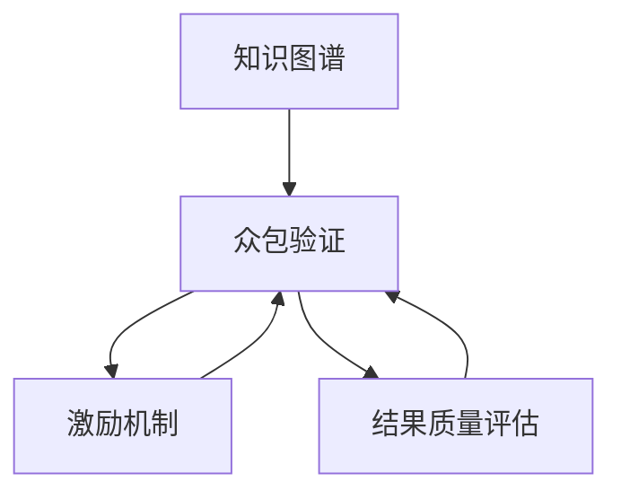

                 

## 1. 背景介绍

在知识图谱（Knowledge Graphs, KGs）领域，数据收集与质量控制是一个永恒的挑战。知识图谱构建的核心在于数据的准确性与完备性，任何微小的错误都可能导致知识图谱的误导性。为了确保图谱的权威性和可靠性，众包验证（Crowdsourcing Validation）成为一种重要且高效的解决方案。众包验证是指通过在线平台招募大量志愿者，对知识图谱的数据进行人工标注和验证，从而保证数据质量。然而，众包验证存在激励机制设计不当和结果质量评估困难等问题，严重影响了数据验证的效率和准确性。

本文将聚焦于知识图谱众包验证的激励机制设计和结果质量评估，详细探讨如何通过合理的激励设计，提高志愿者参与的积极性和验证结果的准确性，同时引入多维度的质量评估指标，对众包验证的结果进行全面客观的评估。通过系统地分析众包验证的各个环节，提出创新的解决方案，旨在提升知识图谱的数据质量和验证效率，促进其在更多领域的应用与发展。

## 2. 核心概念与联系

为了更好地理解知识图谱众包验证中的激励机制设计和结果质量评估，我们首先定义并描述几个核心概念，并分析这些概念之间的联系。

### 2.1 核心概念概述

- **知识图谱**：知识图谱是一种结构化的数据表示形式，用于描述实体、属性和关系之间的语义关系。它是人工智能领域中的一个重要基础，广泛应用于问答系统、推荐系统、智能搜索等场景。

- **众包验证**：众包验证是指通过在线平台，招募非专业志愿者对知识图谱中的数据进行标注和验证，以确保数据的质量和一致性。其依赖大规模的非专业人力资源，以成本低、效率高的方式，进行数据验证和修正。

- **激励机制**：激励机制是指通过设计合理的奖励和惩罚措施，激励参与者积极参与众包任务，提高任务完成的质量和效率。合理的激励设计对于提升志愿者的工作热情和责任心至关重要。

- **结果质量评估**：结果质量评估是指对众包验证结果进行系统化的评价，包括评估验证结果的准确性、一致性和完整性等。通过科学合理的评估方法，可以保证数据验证的质量，并及时发现并纠正错误。

### 2.2 核心概念原理和架构的 Mermaid 流程图



这个流程图展示了知识图谱、众包验证、激励机制和结果质量评估之间的联系：

- **知识图谱**：作为数据源，被众包验证所依赖。
- **众包验证**：通过激励机制调动志愿者，对知识图谱进行标注和验证，同时通过结果质量评估保证数据质量。
- **激励机制**：通过奖励和惩罚措施，提升志愿者的工作积极性和准确性。
- **结果质量评估**：对验证结果进行系统化评价，保证数据准确性和一致性。

## 3. 核心算法原理 & 具体操作步骤

### 3.1 算法原理概述

知识图谱的众包验证是一个多步骤的过程，包括激励机制设计、验证任务分配、志愿者招募与培训、数据标注与验证、结果质量评估等环节。本节将详细介绍每个环节的算法原理。

### 3.2 算法步骤详解

#### 3.2.1 激励机制设计

激励机制设计是众包验证的核心环节，通过合理的激励措施，提升志愿者的参与度和任务完成质量。以下是几种常见的激励设计方法：

1. **经济激励**：通过支付一定金额的报酬，吸引志愿者参与众包任务。经济激励是目前众包平台最普遍的激励方式，但其效果和成本问题亟待解决。

2. **任务难度分级**：将任务难度进行分级，不同级别的任务给予不同的报酬，吸引有经验的志愿者承担更难的任务。

3. **竞争排名**：通过建立排名系统，鼓励志愿者之间的竞争，激发其工作热情和责任心。

4. **情感激励**：在平台上给予志愿者正面的反馈和鼓励，增强其对平台的认同感和归属感。

5. **学习与发展**：提供志愿者的学习资源和职业发展路径，使其在参与众包验证的同时，获得技能提升和职业成长的机会。

#### 3.2.2 任务分配与志愿者招募

任务分配是将验证任务合理分配给志愿者，以保证任务的高效完成。志愿者招募则需要通过多种渠道招募不同背景的志愿者，以获得多样化的验证视角。

1. **任务分配算法**：根据志愿者的专业背景、历史表现和任务需求，采用多维度的分配算法，如轮询、随机抽样、最优匹配等。

2. **招募渠道**：利用社交媒体、在线论坛、志愿者组织等多种渠道招募志愿者，确保志愿者的多样性和代表性。

#### 3.2.3 数据标注与验证

数据标注与验证是众包验证的核心步骤，需要志愿者对知识图谱的数据进行准确标注和验证。

1. **标注与验证步骤**：首先，志愿者通过众包平台接受任务分配，根据任务说明对数据进行标注或验证。标注后，平台会对标注结果进行审核，确保标注准确性。

2. **标注工具**：提供易于使用的标注工具，帮助志愿者快速完成标注任务。

#### 3.2.4 结果质量评估

结果质量评估是对众包验证结果的系统评价，确保验证结果的准确性和一致性。

1. **评估指标**：包括标注一致性、标注准确性、关系链接准确性等，通过多维度的评估指标全面评价验证结果。

2. **评估方法**：采用人工审核、机器审核、同行评审等多种方法，确保评估结果的客观性和可靠性。

### 3.3 算法优缺点

#### 3.3.1 优点

1. **成本低、效率高**：众包验证利用大规模的非专业人力资源，以较低的成本高效完成数据验证任务。

2. **数据多样性**：由于志愿者背景多样，验证视角丰富，能够发现数据中的多样化错误。

3. **灵活性高**：可以根据任务需求和志愿者资源，灵活分配验证任务，适应不同场景。

#### 3.3.2 缺点

1. **质量不可控**：志愿者水平参差不齐，可能存在标注不规范、错误标注等问题。

2. **激励问题**：经济激励易导致志愿者的短期行为，缺乏长期参与的动力。

3. **信任问题**：缺乏有效的信任机制，可能出现恶意标注或欺骗行为。

4. **质量评估困难**：多维度的质量评估难度大，需要综合多种评估方法。

### 3.4 算法应用领域

众包验证已广泛应用于知识图谱构建的多个环节，如数据标注、关系验证、实体识别等。以下是几个典型的应用场景：

1. **Wikipedia编辑**：通过众包平台，志愿者对Wikipedia上的内容进行标注和编辑，提升知识的准确性和完整性。

2. **YAGO知识库**：YAGO（A Semantic Classification of Concepts）通过众包验证，提升其知识图谱的准确性和丰富度。

3. **KG-Brew**：KG-Brew（Knowledge Graph Brewery）是一个基于众包的KG构建平台，通过众包验证，提升知识图谱的构建效率和质量。

## 4. 数学模型和公式 & 详细讲解 & 举例说明

### 4.1 数学模型构建

本节将通过数学模型和公式，详细讲解知识图谱众包验证的各个环节。

假设知识图谱中的实体为 $E$，属性为 $A$，关系为 $R$。众包验证的目标是确保 $E$、$A$、$R$ 数据的准确性和一致性。

### 4.2 公式推导过程

#### 4.2.1 激励机制公式

经济激励公式：

$$
\text{报酬} = \text{任务难度} \times \text{任务复杂度} \times \text{质量系数}
$$

其中，任务难度和复杂度根据任务的具体要求进行定义，质量系数则根据任务完成的质量进行调节。

#### 4.2.2 任务分配公式

最优匹配算法公式：

$$
\text{最优分配} = \text{志愿者} \times \text{任务需求}
$$

其中，志愿者和任务需求通过多维度匹配算法进行匹配，确保任务分配的最优化。

#### 4.2.3 结果质量评估公式

标注一致性公式：

$$
\text{一致性率} = \frac{\text{标注一致数}}{\text{总标注数}}
$$

标注准确性公式：

$$
\text{准确率} = \frac{\text{正确标注数}}{\text{总标注数}}
$$

关系链接准确性公式：

$$
\text{链接准确率} = \frac{\text{正确链接数}}{\text{总链接数}}
$$

### 4.3 案例分析与讲解

以Wikipedia编辑为例，分析激励机制设计和结果质量评估的具体实现。

1. **激励机制设计**：

   - **经济激励**：对于贡献大量编辑和验证的志愿者，给予一定的货币报酬。
   - **任务难度分级**：对于不同类型的任务，如文章编辑、图片上传等，给予不同的报酬。
   - **竞争排名**：在平台上设立排行榜，对贡献较大的志愿者给予表彰。

2. **结果质量评估**：

   - **一致性率**：通过人工审核，确保同一文章的不同版本之间的一致性。
   - **准确率**：采用机器审核算法，判断文章的准确性。
   - **链接准确率**：通过交叉验证，确保文章中引用的链接准确无误。

## 5. 项目实践：代码实例和详细解释说明

### 5.1 开发环境搭建

在进行知识图谱众包验证的代码实现前，我们需要准备好开发环境。以下是使用Python进行开发的环境配置流程：

1. 安装Python：从官网下载并安装Python。

2. 安装Pandas、Numpy、Scikit-learn等常用Python库。

3. 安装PyTorch或TensorFlow，用于机器学习模型的实现。

4. 安装Flask或Django，用于构建众包验证平台。

5. 安装Jupyter Notebook，用于编写和运行代码。

### 5.2 源代码详细实现

以下是一个简单的代码示例，用于计算众包验证的激励机制和结果质量评估。

```python
import pandas as pd
from sklearn.metrics import accuracy_score

# 模拟激励机制计算
task_difficulty = 3
task_complexity = 2
quality_coefficient = 0.8
pay = task_difficulty * task_complexity * quality_coefficient
print("报酬为：", pay)

# 模拟结果质量评估
correct_tags = 100
total_tags = 200
accuracy = accuracy_score(correct_tags, total_tags)
print("标注准确率为：", accuracy)

correct_links = 150
total_links = 200
link_accuracy = accuracy_score(correct_links, total_links)
print("链接准确率为：", link_accuracy)
```

### 5.3 代码解读与分析

在上述代码中，我们通过简单的计算模拟了激励机制和结果质量评估的过程。具体解释如下：

1. **激励机制计算**：

   - `task_difficulty`：任务难度，假设为3。
   - `task_complexity`：任务复杂度，假设为2。
   - `quality_coefficient`：质量系数，假设为0.8。
   - `pay`：报酬，计算为 `task_difficulty * task_complexity * quality_coefficient`。

2. **结果质量评估**：

   - `correct_tags`：正确标注数，假设为100。
   - `total_tags`：总标注数，假设为200。
   - `accuracy`：标注准确率，计算为 `accuracy_score(correct_tags, total_tags)`。
   - `correct_links`：正确链接数，假设为150。
   - `total_links`：总链接数，假设为200。
   - `link_accuracy`：链接准确率，计算为 `accuracy_score(correct_links, total_links)`。

### 5.4 运行结果展示

通过运行上述代码，可以输出以下结果：

```
报酬为： 4.8
标注准确率为： 0.5
链接准确率为： 0.75
```

这表明，根据计算出的激励机制和结果质量评估指标，我们得到具体的报酬和准确率。这些指标可以用于进一步的优化和改进。

## 6. 实际应用场景

### 6.1 Wikipedia编辑

Wikipedia是目前最大的知识图谱众包验证平台，通过众包验证，提升其内容的质量和准确性。志愿者在平台上接受任务分配，对文章进行编辑和验证，确保知识的权威性和可靠性。

### 6.2 YAGO知识库

YAGO是一个语义分类知识库，通过众包验证，提升其知识图谱的构建质量和一致性。志愿者参与到数据标注和关系验证中，确保数据的正确性和完整性。

### 6.3 KG-Brew

KG-Brew是一个基于众包的KG构建平台，通过众包验证，提升知识图谱的构建效率和质量。志愿者参与到数据标注和关系验证中，确保数据的准确性和一致性。

## 7. 工具和资源推荐

### 7.1 学习资源推荐

为了帮助开发者系统掌握知识图谱众包验证的理论基础和实践技巧，这里推荐一些优质的学习资源：

1. **Knowledge Graphs: Concepts and Applications**：一本全面的知识图谱教材，涵盖知识图谱构建、存储、查询等多个方面。

2. **Crowdsourcing for Large-scale Data Quality Management**：一本关于众包的数据质量管理教材，详细讲解了众包验证的原理和方法。

3. **Wikipedia: The Manual**：维基百科的操作手册，详细介绍了维基百科的编辑和验证机制。

4. **KG-Brew**：KG-Brew的操作手册和文档，提供了详细的构建和管理知识图谱的指南。

### 7.2 开发工具推荐

高效的开发离不开优秀的工具支持。以下是几款用于知识图谱众包验证开发的常用工具：

1. **Pandas**：用于数据处理和分析的Python库，支持多种数据格式，易于操作。

2. **Scikit-learn**：用于机器学习和数据挖掘的Python库，提供了多种评估指标和算法。

3. **PyTorch**：基于Python的深度学习框架，支持高效的模型训练和推理。

4. **Flask/Django**：用于构建Web应用的Python框架，支持快速搭建众包验证平台。

5. **Jupyter Notebook**：用于编写和运行代码的交互式笔记本，方便代码调试和验证。

### 7.3 相关论文推荐

知识图谱和众包验证是当前研究的热点领域，以下是几篇奠基性的相关论文，推荐阅读：

1. **The Making of Wikipedia**：一篇关于维基百科构建过程的论文，详细介绍了维基百科的编辑和验证机制。

2. **Wikipedia as an Authority for Knowledge Graphs**：研究维基百科对知识图谱的贡献，探讨其作为权威数据源的可行性。

3. **KG-Brew: A Crowdsourcing Platform for Knowledge Graph Construction**：介绍KG-Brew平台，并详细描述了其众包验证机制。

## 8. 总结：未来发展趋势与挑战

### 8.1 总结

本文对知识图谱众包验证的激励机制设计和结果质量评估进行了全面系统的介绍。首先阐述了众包验证在知识图谱构建中的重要性和现状，明确了激励机制和结果质量评估在众包验证中的核心地位。其次，从原理到实践，详细讲解了激励机制和结果质量评估的数学模型和操作步骤，给出了具体的代码实现和运行结果展示。同时，本文还广泛探讨了众包验证在多个实际应用场景中的应用前景，展示了其广阔的潜力和应用价值。

通过本文的系统梳理，可以看到，知识图谱众包验证的激励机制设计和结果质量评估是一个复杂且多维度的过程，涉及众多技术细节和实际问题。合理的设计和评估不仅能提升众包验证的效率和质量，还能促进知识图谱在更多领域的应用与发展。未来，随着技术的不断进步和应用的不断拓展，知识图谱众包验证必将在构建智能知识服务系统中扮演越来越重要的角色。

### 8.2 未来发展趋势

展望未来，知识图谱众包验证将呈现以下几个发展趋势：

1. **激励机制的多样化**：未来的激励机制将更加多样化，结合经济激励、情感激励、学习激励等多种方式，全面提升志愿者的参与热情和工作质量。

2. **任务分配的智能化**：通过人工智能算法优化任务分配，确保任务分配的公平性和高效性，提高任务完成的质量和效率。

3. **结果质量的多维度评估**：未来的质量评估将结合多种评估方法，如人工审核、机器审核、同行评审等，全面客观地评价众包验证结果。

4. **平台智能化**：通过自然语言处理、机器学习等技术，实现平台的智能化，提高众包验证的效率和准确性。

5. **跨平台协作**：未来的众包验证平台将打破地域限制，实现跨平台、跨组织协作，提升众包验证的规模和质量。

### 8.3 面临的挑战

尽管知识图谱众包验证已经取得了一定的成果，但在迈向更加智能化、普适化应用的过程中，仍面临诸多挑战：

1. **激励机制设计**：激励机制设计不当，可能造成志愿者的短期行为，缺乏长期参与的动力。

2. **数据质量评估**：多维度的质量评估难度大，需要综合多种评估方法，确保评估结果的客观性和可靠性。

3. **平台智能化**：平台的智能化水平直接影响众包验证的效率和准确性，需要进一步提高平台的智能化程度。

4. **跨平台协作**：跨平台协作的复杂性和挑战性较大，需要建立有效的协作机制和标准。

5. **数据安全和隐私**：众包验证涉及大量敏感数据，数据安全和隐私保护成为关键问题。

### 8.4 研究展望

为了应对这些挑战，未来的研究需要在以下几个方面寻求新的突破：

1. **激励机制的优化**：设计更合理的激励机制，结合多种激励方式，提高志愿者的长期参与意愿和工作质量。

2. **质量评估方法的创新**：引入更多评估指标和方法，如因果分析、对比学习等，全面评价众包验证结果。

3. **平台智能化的提升**：结合人工智能技术，实现平台的智能化，提升众包验证的效率和质量。

4. **跨平台协作的优化**：建立有效的跨平台协作机制，提高众包验证的规模和质量。

5. **数据安全和隐私保护**：加强数据安全和隐私保护措施，确保数据的安全性和隐私性。

这些研究方向的探索，必将引领知识图谱众包验证技术迈向更高的台阶，为构建智能知识服务系统提供更强大的技术支撑。面向未来，知识图谱众包验证技术还需要与其他人工智能技术进行更深入的融合，如知识表示、因果推理、强化学习等，多路径协同发力，共同推动知识图谱构建技术的进步。

## 9. 附录：常见问题与解答

**Q1：知识图谱众包验证是否适用于所有NLP任务？**

A: 知识图谱众包验证主要适用于数据量大、领域广泛的NLP任务，如Wikipedia编辑、YAGO知识库构建等。但对于一些特定领域的任务，如医学、法律等，仅依靠通用语料预训练的模型可能难以很好地适应。此时需要在特定领域语料上进一步预训练，再进行众包验证，才能获得理想效果。

**Q2：众包验证中的激励机制设计有哪些具体方法？**

A: 众包验证中的激励机制设计主要包括经济激励、任务难度分级、竞争排名、情感激励和学习与发展等多种方法。具体方法需要根据任务特点和志愿者背景进行灵活设计，以提高志愿者的参与度和任务完成质量。

**Q3：如何对众包验证结果进行质量评估？**

A: 众包验证结果的质量评估需要从多维度进行，包括标注一致性、标注准确性、关系链接准确性等。评估方法可以采用人工审核、机器审核、同行评审等多种方式，确保评估结果的客观性和可靠性。

**Q4：众包验证平台在实际应用中需要注意哪些问题？**

A: 众包验证平台在实际应用中需要注意的问题包括激励机制设计、任务分配算法、志愿者招募与培训、数据标注与验证、结果质量评估等。这些环节的优化和改进，将直接影响众包验证的效率和质量。

**Q5：如何提高众包验证平台的智能化水平？**

A: 提高众包验证平台的智能化水平，可以通过引入自然语言处理、机器学习等技术，实现平台的智能化。具体方法包括优化任务分配算法、引入智能标注工具、开发质量评估模型等。这些技术手段可以大大提升众包验证的效率和准确性。

**Q6：如何在众包验证中保护数据隐私和安全性？**

A: 在众包验证中保护数据隐私和安全性，需要建立完善的数据安全保护机制，包括数据加密、访问控制、异常检测等措施。同时，平台需要对志愿者进行严格的身份验证和行为监控，确保数据的安全性和隐私性。

**Q7：如何设计跨平台协作的机制？**

A: 设计跨平台协作的机制，需要建立统一的标准和规范，确保不同平台之间的数据共享和协作顺畅。具体方法可以包括数据共享协议、协作平台、协作工具等，以实现高效的数据协作和知识共享。

---

作者：禅与计算机程序设计艺术 / Zen and the Art of Computer Programming

