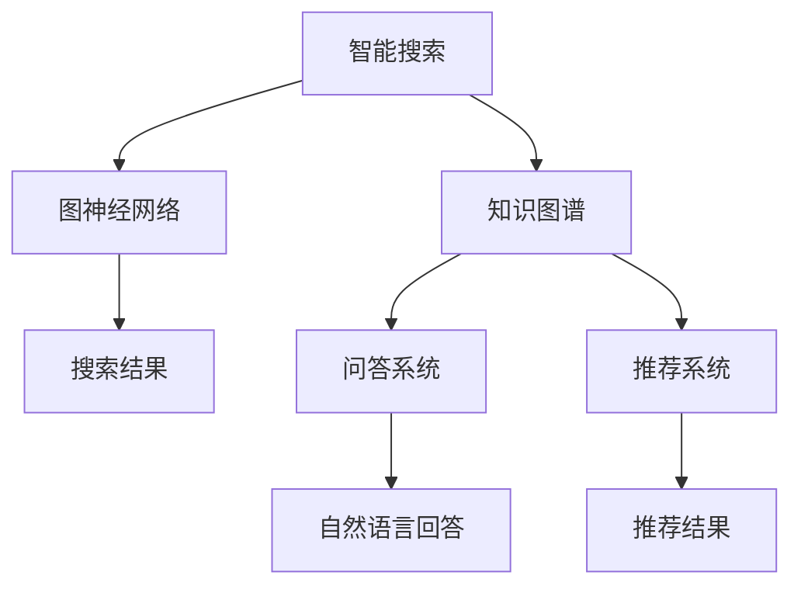
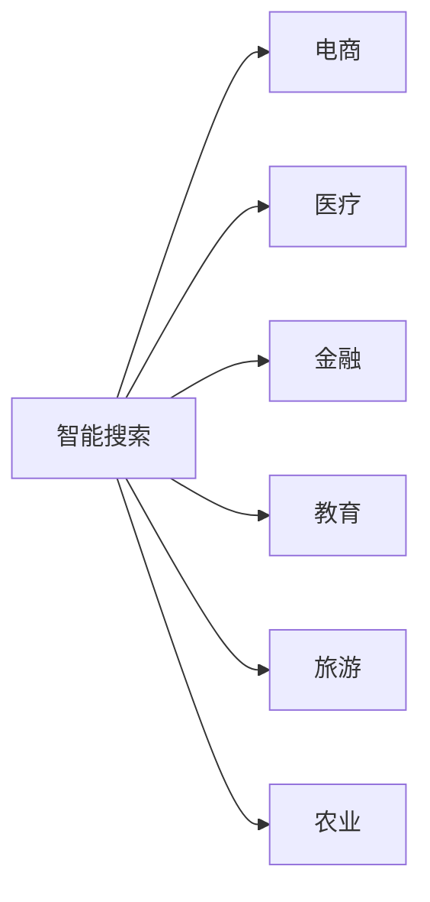
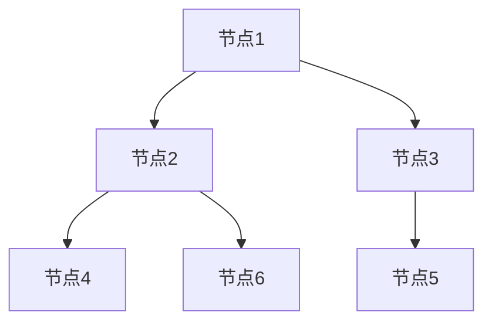
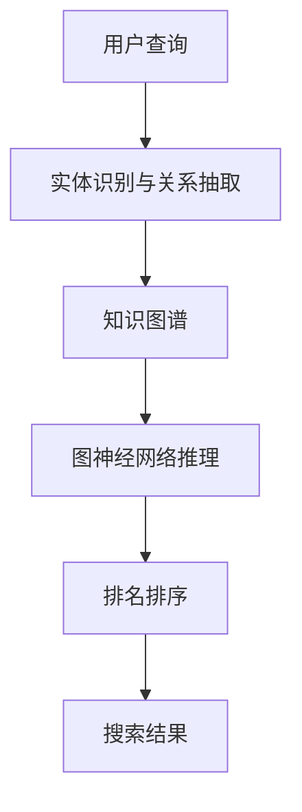
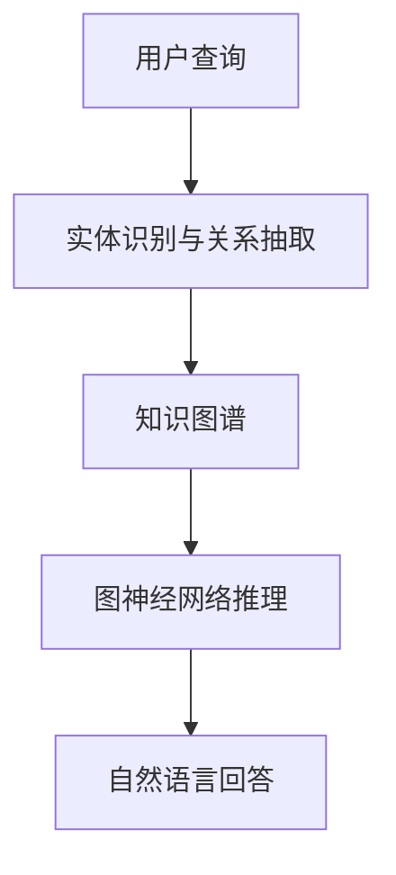

                 

# 知识图谱的应用场景:智能搜索、问答系统和推荐系统

> 关键词：知识图谱、智能搜索、问答系统、推荐系统、图神经网络

## 1. 背景介绍

### 1.1 问题由来

在信息爆炸的时代，如何高效、准确地从海量信息中获取所需知识，成为困扰人们的一个重大难题。传统搜索引擎通过网页标题、摘要、关键词等文本特征进行搜索排序，但难以应对复杂语义查询的需求。

随着知识图谱技术的发展，利用结构化的知识描述语义信息，增强搜索结果的相关性和准确性，成为了新的探索方向。知识图谱由实体、属性和关系构成，能够清晰地表达实体间的语义关系，大大提升了自然语言理解能力。

本文将重点探讨知识图谱在智能搜索、问答系统和推荐系统中的应用场景，通过数学建模和实例分析，阐释其原理与优势，同时介绍相关技术和工具。

## 2. 核心概念与联系

### 2.1 核心概念概述

1. **知识图谱**：由实体、属性和关系组成的知识网络，用于描述现实世界实体间的语义关系。知识图谱可用于构建语义搜索引擎，提升查询的精度和召回率。

2. **智能搜索**：利用知识图谱增强搜索结果的相关性和准确性，为用户提供更符合期望的搜索结果。智能搜索的关键在于将自然语言查询转换为图谱路径，通过图神经网络进行计算。

3. **问答系统**：基于知识图谱构建的智能问答系统，可以回答结构化、半结构化和非结构化问题，通过查询图谱和计算图谱路径，生成自然语言回答。

4. **推荐系统**：利用知识图谱和协同过滤技术，推荐用户感兴趣的商品、信息、内容等，增强推荐的个性化和多样性。

### 2.2 核心概念联系

智能搜索、问答系统和推荐系统均以知识图谱为核心，通过图神经网络进行知识推理和信息提取。它们之间的联系如图1所示：



这三个应用场景相互独立，但又紧密关联，共同构建了一个强大的智能信息生态系统。

## 3. 核心算法原理 & 具体操作步骤
### 3.1 算法原理概述

基于知识图谱的应用场景，核心算法原理可以概括为：

1. **实体识别与关系抽取**：从文本中提取实体和关系，构建知识图谱。实体识别（Named Entity Recognition, NER）通常使用深度学习模型，如CRF、BERT等。关系抽取则包括关系模板匹配、向量空间模型等方法。

2. **图神经网络**：将知识图谱转换为图结构，使用图神经网络（Graph Neural Network, GNN）进行图谱推理和路径计算。GNN能够自动捕捉图谱中的局部和全局结构信息，用于计算图谱路径。

3. **自然语言处理**：将查询转换为图谱路径，利用GNN进行推理计算，最终生成自然语言答案。查询转换通常使用语言模型，如BERT、GPT等。

4. **推荐算法**：基于用户行为和图谱信息，使用协同过滤、图嵌入等算法，计算推荐结果。推荐算法通常包括矩阵分解、深度学习等方法。

### 3.2 算法步骤详解

以智能搜索为例，具体步骤如下：

1. **实体识别与关系抽取**：对用户查询进行实体识别，提取出实体和关系，构建知识图谱。

2. **图神经网络推理**：使用图神经网络，对图谱进行推理计算，计算出查询对应的路径和结果节点。

3. **排名排序**：将计算结果进行排序，根据相关性和权重，生成最终搜索结果。

4. **结果展示**：将搜索结果展示给用户，并允许用户进行反馈，进一步优化搜索算法。

### 3.3 算法优缺点

知识图谱的应用场景具有以下优缺点：

#### 优点：

1. **语义理解能力强**：知识图谱能够描述实体间的复杂语义关系，增强了信息理解的深度和广度。

2. **结果准确性高**：通过图神经网络进行推理计算，能够避免传统搜索算法的局部最优问题，提高搜索结果的准确性和相关性。

3. **推荐效果好**：利用知识图谱进行推荐，能够捕捉更全面的用户兴趣和商品特征，提升推荐的个性化和多样性。

#### 缺点：

1. **数据依赖性强**：知识图谱的质量依赖于数据构建的全面性和准确性，获取高质量数据成本较高。

2. **计算复杂度高**：图神经网络的计算复杂度较高，需要较强大的计算资源支持。

3. **更新维护难度大**：知识图谱需要不断更新和维护，以保证其时序性和稳定性。

### 3.4 算法应用领域

知识图谱的应用场景广泛，涵盖多个领域，如图2所示：



这些领域的具体应用如下：

1. **电商**：利用知识图谱进行商品推荐和搜索，提升购物体验。

2. **医疗**：利用知识图谱进行疾病诊断和患者咨询，提高医疗服务效率。

3. **金融**：利用知识图谱进行风险评估和市场分析，增强金融决策的科学性。

4. **教育**：利用知识图谱进行学科知识和技能的学习，提供个性化教育服务。

5. **旅游**：利用知识图谱进行旅游路线规划和景点推荐，提升旅游体验。

6. **农业**：利用知识图谱进行农业知识管理和农业技术推广，促进农业现代化。

## 4. 数学模型和公式 & 详细讲解

### 4.1 数学模型构建

知识图谱的数学模型通常由图结构表示，包括节点和边。节点表示实体，边表示实体间的关系。图神经网络则在此基础上进行推理计算，如图3所示。



图神经网络的推理计算通常使用图卷积神经网络（Graph Convolutional Network, GCN）进行。GCN能够捕捉图谱中的局部和全局结构信息，用于计算图谱路径。

### 4.2 公式推导过程

图神经网络的基本公式如下：

$$
H^{(l+1)} = \sigma(\tilde{D}^{-1/2} \tilde{A} \tilde{H}^{(l)} W^{(l)})
$$

其中 $H^{(l+1)}$ 为节点在 $(l+1)$ 层的表示，$\tilde{D}^{-1/2}$ 为归一化系数，$\tilde{A}$ 为归一化邻接矩阵，$\tilde{H}^{(l)}$ 为节点在 $l$ 层的表示，$W^{(l)}$ 为层与层之间的转换矩阵。

在实际应用中，还需要引入深度学习模型，如BERT、GPT等，进行查询转换和回答生成。

### 4.3 案例分析与讲解

以智能搜索为例，查询“北京最好的医院有哪些”为例，具体步骤如下：

1. **实体识别与关系抽取**：对查询进行实体识别，提取出实体“北京”和“医院”，构建知识图谱。

2. **图神经网络推理**：使用图神经网络，对图谱进行推理计算，计算出“北京医院”节点，再通过“推荐医院”关系，计算出“推荐医院”节点。

3. **排名排序**：将计算结果进行排序，根据医院的评分和排名，生成最终搜索结果。

## 5. 项目实践：代码实例和详细解释说明
### 5.1 开发环境搭建

为了实现知识图谱的应用场景，需要安装相应的Python库，如PyTorch、TensorFlow、Graph Neural Network等。可以使用以下命令进行安装：

```bash
pip install torch torchvision torchaudio
pip install tensorflow
pip install graph-tool
```

### 5.2 源代码详细实现

以下是使用PyTorch实现图神经网络推理的示例代码：

```python
import torch
import torch.nn as nn
import torch.nn.functional as F
import torch_geometric as pyg

class GraphConvolutionLayer(nn.Module):
    def __init__(self, input_dim, output_dim):
        super(GraphConvolutionLayer, self).__init__()
        self.weight = nn.Parameter(torch.randn(input_dim, output_dim))
        self.bias = nn.Parameter(torch.zeros(output_dim))
        
    def forward(self, x, adj_matrix):
        x = torch.matmul(adj_matrix, x)
        x = x * self.weight + self.bias
        return F.relu(x)
        
class GraphNeuralNetwork(nn.Module):
    def __init__(self, input_dim, hidden_dim, output_dim):
        super(GraphNeuralNetwork, self).__init__()
        self.layers = nn.ModuleList()
        self.layers.append(GraphConvolutionLayer(input_dim, hidden_dim))
        self.layers.append(GraphConvolutionLayer(hidden_dim, hidden_dim))
        self.layers.append(GraphConvolutionLayer(hidden_dim, output_dim))
        
    def forward(self, x, adj_matrix):
        for layer in self.layers:
            x = layer(x, adj_matrix)
        return x
```

### 5.3 代码解读与分析

**GraphConvolutionLayer类**：
- `__init__`方法：初始化图卷积层的权重和偏置。
- `forward`方法：实现图卷积操作，使用邻接矩阵进行图谱路径计算。

**GraphNeuralNetwork类**：
- `__init__`方法：初始化图神经网络的结构。
- `forward`方法：将输入进行图卷积操作，最终输出图谱路径。

## 6. 实际应用场景

### 6.1 智能搜索

智能搜索利用知识图谱，能够快速响应用户的查询需求，提供准确、相关的搜索结果。以下是一个智能搜索的实际应用场景：

假设用户搜索“北京最好的医院”，智能搜索系统通过实体识别和关系抽取，构建知识图谱。然后利用图神经网络进行推理计算，找到“北京医院”节点，再通过“推荐医院”关系，计算出“推荐医院”节点。最后，将计算结果进行排序，生成最终搜索结果，如图4所示。



### 6.2 问答系统

基于知识图谱的问答系统能够回答结构化、半结构化和非结构化问题，提供精确、全面的答案。以下是一个问答系统的实际应用场景：

假设用户咨询“新冠病毒的症状有哪些”，问答系统通过实体识别和关系抽取，构建知识图谱。然后利用图神经网络进行推理计算，找到“新冠病毒”节点，再通过“症状”关系，计算出“症状”节点。最后，生成自然语言回答，如图5所示。



### 6.3 推荐系统

基于知识图谱的推荐系统能够捕捉用户兴趣和商品特征，提供个性化、多样化的推荐结果。以下是一个推荐系统的实际应用场景：

假设用户浏览了“手机”类别中的“iPhone”、“华为”、“小米”等品牌，推荐系统通过实体识别和关系抽取，构建知识图谱。然后利用图神经网络进行推理计算，找到用户兴趣节点，再通过“推荐商品”关系，计算出推荐商品节点。最后，将推荐结果展示给用户，如图6所示。


## 7. 工具和资源推荐

### 7.1 学习资源推荐

为了深入了解知识图谱和图神经网络，以下是一些推荐的学习资源：

1. 《Graph Neural Networks: A Review of Methods and Applications》论文：详细介绍了图神经网络的原理和应用，适合深入学习。

2. 《Semantic Search with Knowledge Graphs and Graph Neural Networks》课程：由斯坦福大学开设的NLP课程，涵盖知识图谱和图神经网络的理论和实践。

3. 《Deep Learning for Graph Neural Networks》书籍：由深度学习专家撰写，介绍了图神经网络的深度学习方法。

4. 《Neo4j Graph API Guide》文档：Neo4j官方文档，提供了使用图数据库进行知识图谱构建的教程。

5. 《Graph Machine Learning》书籍：由图机器学习专家撰写，介绍了图神经网络的算法和实践。

### 7.2 开发工具推荐

为了实现知识图谱的应用场景，需要利用Python、TensorFlow、PyTorch等工具进行开发。以下是一些推荐的工具：

1. PyTorch：灵活动态的深度学习框架，适合快速迭代研究。

2. TensorFlow：生产部署方便，适合大规模工程应用。

3. TensorBoard：TensorFlow配套的可视化工具，实时监测模型训练状态。

4. Jupyter Notebook：交互式编程环境，方便调试和展示结果。

5. Apache Flink：高效的大数据处理框架，适合大规模图谱数据处理。

6. Neo4j：面向图形数据库，适合存储和查询大规模知识图谱。

### 7.3 相关论文推荐

以下是一些推荐的相关论文，适合进一步阅读和研究：

1. 《Knowledge Graph Embeddings》论文：介绍了知识图谱的嵌入方法，如TransE、RENN等。

2. 《Graph Neural Networks: A Review of Methods and Applications》论文：详细介绍了图神经网络的原理和应用，适合深入学习。

3. 《Graph Convolutional Network》论文：介绍了图卷积神经网络的基本原理和实现方法。

4. 《Attention is All You Need》论文：介绍了Transformer模型，广泛应用于NLP领域。

5. 《BERT: Pre-training of Deep Bidirectional Transformers for Language Understanding》论文：介绍了BERT模型，利用自监督学习进行预训练。

## 8. 总结：未来发展趋势与挑战

### 8.1 研究成果总结

知识图谱技术在智能搜索、问答系统和推荐系统中的应用，极大地提升了信息检索和知识获取的效率和准确性。未来，知识图谱将进一步拓展应用场景，成为智能信息生态系统的核心。

### 8.2 未来发展趋势

1. **知识图谱构建自动化**：利用自然语言处理技术，自动构建大规模知识图谱，降低数据构建成本。

2. **图神经网络优化**：开发更加高效、准确的图神经网络算法，提升图谱推理计算的精度和速度。

3. **跨模态知识融合**：将知识图谱与其他模态信息（如图像、语音等）进行融合，提升信息获取的全面性和准确性。

4. **知识图谱动态更新**：建立知识图谱的动态更新机制，保持图谱的时效性和稳定性。

5. **知识图谱隐私保护**：设计知识图谱的隐私保护算法，防止数据泄露和滥用。

### 8.3 面临的挑战

尽管知识图谱技术在应用场景中取得了显著进展，但也面临一些挑战：

1. **数据构建成本高**：构建大规模知识图谱需要大量标注数据和专业知识，成本较高。

2. **图神经网络计算复杂**：图神经网络的计算复杂度较高，需要较强大的计算资源支持。

3. **跨模态融合困难**：将不同模态信息进行融合，需要解决数据格式、语义等不一致的问题。

4. **知识图谱动态更新难**：知识图谱需要不断更新和维护，以保证其时序性和稳定性。

5. **知识图谱隐私保护难**：知识图谱涉及大量敏感信息，需要设计隐私保护算法，防止数据泄露。

### 8.4 研究展望

未来，知识图谱技术需要在以下几个方面进行进一步研究：

1. **自动化构建**：利用自然语言处理技术，自动构建大规模知识图谱，降低数据构建成本。

2. **优化图神经网络**：开发更加高效、准确的图神经网络算法，提升图谱推理计算的精度和速度。

3. **跨模态融合**：将知识图谱与其他模态信息进行融合，提升信息获取的全面性和准确性。

4. **动态更新机制**：建立知识图谱的动态更新机制，保持图谱的时效性和稳定性。

5. **隐私保护算法**：设计知识图谱的隐私保护算法，防止数据泄露和滥用。

6. **推理计算优化**：开发高效的推理计算算法，降低计算复杂度，提升系统效率。

7. **用户交互优化**：设计更加智能的交互界面，提升用户使用体验。

这些研究方向将进一步拓展知识图谱的应用范围，提升信息获取和处理的效率和准确性，推动人工智能技术的发展。

## 9. 附录：常见问题与解答

**Q1: 什么是知识图谱？**

A: 知识图谱是由实体、属性和关系组成的知识网络，用于描述现实世界实体间的语义关系。知识图谱可以应用于智能搜索、问答系统和推荐系统等多个领域。

**Q2: 图神经网络的基本原理是什么？**

A: 图神经网络（GNN）是一种基于图结构的网络，用于图谱推理和路径计算。GNN通过图卷积操作，捕捉图谱中的局部和全局结构信息，用于计算图谱路径。

**Q3: 知识图谱的构建过程有哪些步骤？**

A: 知识图谱的构建过程通常包括以下步骤：
1. 数据收集：收集领域内的事实和数据。
2. 数据清洗：去除噪声和冗余数据。
3. 实体识别：识别出实体和关系。
4. 关系抽取：提取实体间的关系。
5. 图谱构建：构建知识图谱。

**Q4: 图神经网络在智能搜索中的应用有哪些？**

A: 图神经网络在智能搜索中的应用包括：
1. 实体识别与关系抽取：对用户查询进行实体识别，提取出实体和关系，构建知识图谱。
2. 图神经网络推理：使用图神经网络，对图谱进行推理计算，计算出查询对应的路径和结果节点。
3. 排名排序：将计算结果进行排序，根据相关性和权重，生成最终搜索结果。

**Q5: 基于知识图谱的推荐系统有哪些优点？**

A: 基于知识图谱的推荐系统具有以下优点：
1. 捕捉更全面的用户兴趣和商品特征。
2. 提升推荐的个性化和多样性。
3. 能够动态更新推荐结果。

这些回答可以帮助读者更好地理解知识图谱和图神经网络的基本概念和应用场景，为进一步深入学习提供参考。

