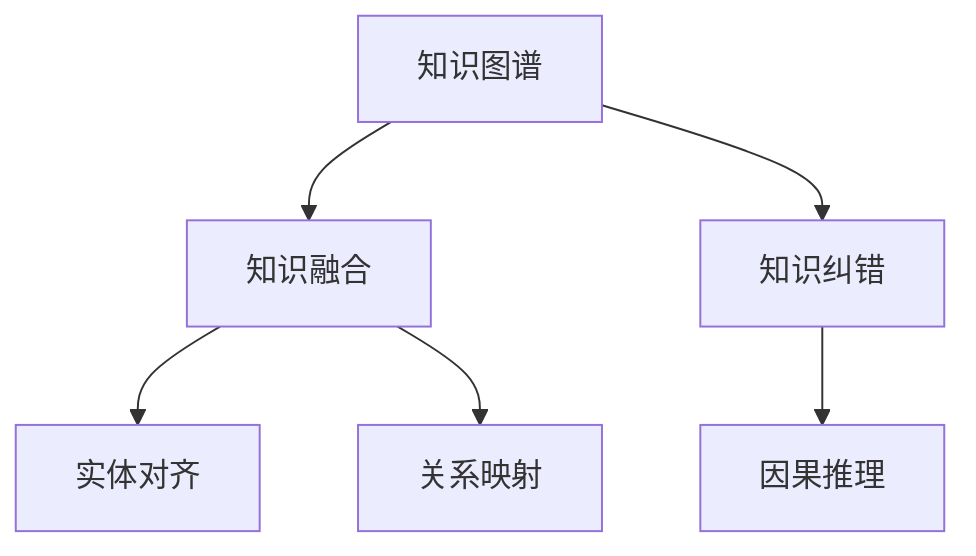

                 

# 知识图谱的质量提升:知识融合和知识纠错

> 关键词：知识图谱,知识融合,知识纠错,自动推理,三元组

## 1. 背景介绍

### 1.1 问题由来

随着人工智能技术的不断发展，知识图谱作为知识表示的重要形式，在各类应用中得到了广泛应用。知识图谱以图的形式描述实体、属性和实体间关系，通过自动推理为各种应用提供支持。然而，由于实体标签错误、关系错误、语义矛盾等问题，知识图谱的质量往往无法满足实际应用需求，亟需提升。

### 1.2 问题核心关键点

知识图谱质量的提升主要依赖于知识融合和知识纠错两个关键环节。知识融合是将异构数据源中的知识进行整合，消除数据冗余和冲突，构建统一的知识库。知识纠错则是通过自动推理发现并修正知识图谱中的错误，保证知识的准确性。

## 2. 核心概念与联系

### 2.1 核心概念概述

为更好地理解知识融合和知识纠错的实现原理，本节将介绍几个密切相关的核心概念：

- 知识图谱(Knowledge Graph)：以图的形式描述实体、属性和实体间关系的知识表示方法。知识图谱能够高效存储和管理各类信息，支持智能问答、推荐、搜索等功能。

- 知识融合(Knowledge Integration)：将异构数据源中的知识进行整合，消除数据冗余和冲突，构建统一的知识库。知识融合技术是知识图谱构建的基础，通过实体对齐、关系映射等方法实现。

- 知识纠错(Knowledge Correction)：通过自动推理发现并修正知识图谱中的错误，保证知识的准确性。知识纠错技术主要基于实体关系对齐、因果推理等方法，能够提升知识图谱的鲁棒性和可靠性。

- 实体对齐(Entity Alignment)：指将不同数据源中的实体映射到统一的知识库中。实体对齐技术的目的是消除知识冗余，提高知识图谱的完整性和一致性。

- 关系映射(Relation Mapping)：指将不同数据源中的关系进行映射，构建统一的关系图谱。关系映射技术能够消除知识冲突，提高知识图谱的准确性和可靠性。

- 因果推理(Causal Reasoning)：指在知识图谱中推理出实体之间的关系和属性。因果推理技术能够增强知识图谱的解释性和可靠性，提升推理的正确性。

这些核心概念之间的逻辑关系可以通过以下Mermaid流程图来展示：



这个流程图展示出知识图谱的质量提升主要依赖于知识融合和知识纠错两个环节。

## 3. 核心算法原理 & 具体操作步骤

### 3.1 算法原理概述

知识融合和知识纠错的过程，本质上是一个数据融合和推理优化的过程。其核心思想是：
1. 通过实体对齐和关系映射技术，将不同数据源中的知识进行整合，消除数据冗余和冲突，构建统一的知识库。
2. 利用因果推理等方法，发现并修正知识图谱中的错误，保证知识的准确性。

知识融合和知识纠错的一般流程包括：
1. 数据收集：从多个数据源中收集实体和关系数据，建立数据集。
2. 数据预处理：清洗数据集中的噪声和错误，提取实体和关系信息。
3. 实体对齐：通过相似度度量方法，将不同数据源中的实体映射到统一的知识库中。
4. 关系映射：通过关系一致性度量方法，将不同数据源中的关系进行映射，消除知识冲突。
5. 知识纠错：利用推理技术和规则，发现并修正知识图谱中的错误。
6. 知识更新：将纠正后的知识图谱更新到知识库中，完成知识图谱的迭代优化。

### 3.2 算法步骤详解

#### 3.2.1 数据收集

知识图谱的数据来源广泛，包括Web数据、社交媒体数据、文献数据等。常用的数据收集方法包括：
- 网络爬虫：使用爬虫技术抓取Web数据，提取实体和关系信息。
- API接口：从公开API接口获取数据，如DBpedia、Wikipedia等。
- 文本解析：通过自然语言处理技术解析文本数据，提取实体和关系。

#### 3.2.2 数据预处理

数据预处理是知识图谱构建的重要环节。常见的数据预处理技术包括：
- 去重：去除数据集中的重复记录，防止冗余。
- 噪声过滤：过滤噪声数据，如错误拼写、无关信息等。
- 标准化：对实体和关系进行标准化，消除数据格式不一致问题。

#### 3.2.3 实体对齐

实体对齐的目的是将不同数据源中的实体映射到统一的知识库中。常用的实体对齐方法包括：
- 基于嵌入空间的方法：通过将实体表示为向量，计算向量之间的相似度，找到相似的实体。
- 基于关联规则的方法：通过建立关联规则，找到实体之间的映射关系。
- 基于图的算法：通过构建图模型，使用图分割算法寻找实体映射。

#### 3.2.4 关系映射

关系映射的目的是将不同数据源中的关系进行映射，消除知识冲突。常用的关系映射方法包括：
- 基于相似度的方法：通过计算关系之间的相似度，找到相似的关系。
- 基于逻辑推理的方法：通过逻辑推理，找到一致的关系映射。
- 基于关联规则的方法：通过建立关联规则，找到关系之间的映射关系。

#### 3.2.5 知识纠错

知识纠错是知识图谱构建的最后一个环节。常用的知识纠错方法包括：
- 基于推理的纠错：通过推理技术发现知识图谱中的错误，并进行修正。
- 基于规则的纠错：通过定义纠错规则，自动发现并修正错误。
- 基于人工标注的纠错：通过人工标注数据，使用机器学习算法进行知识纠错。

### 3.3 算法优缺点

知识融合和知识纠错的算法主要具有以下优点：
1. 提高知识图谱的准确性。通过数据融合和推理纠错，能够发现并修正知识图谱中的错误，提升知识准确性。
2. 增强知识图谱的一致性。通过实体对齐和关系映射，能够消除数据冗余和冲突，提高知识图谱的一致性。
3. 支持知识自动推理。通过推理技术，能够发现知识图谱中的潜在关系，提升知识推理能力。
4. 降低人工干预成本。通过自动化的知识融合和纠错算法，能够显著降低人工干预成本，提高知识图谱构建效率。

但这些算法也存在一定的局限性：
1. 数据源多样性问题。不同的数据源可能采用不同的格式、规则和标准，数据整合难度较大。
2. 数据噪声问题。数据预处理过程中可能会遗留噪声，影响知识图谱的质量。
3. 算法复杂度问题。实体对齐、关系映射和知识纠错算法复杂度较高，需要大量的计算资源。
4. 算法鲁棒性问题。知识图谱构建过程中可能存在错误的实体映射和关系映射，影响最终效果。

尽管存在这些局限性，但就目前而言，知识融合和知识纠错仍是知识图谱构建的主流范式。未来相关研究的重点在于如何进一步降低数据源多样性、数据噪声、算法复杂度和算法鲁棒性等问题，提升知识图谱构建的效率和效果。

### 3.4 算法应用领域

知识融合和知识纠错技术已经在多个领域得到了广泛应用，例如：

- 问答系统：基于知识图谱的问答系统通过知识融合和纠错技术，提升问答准确性和覆盖范围。
- 推荐系统：推荐系统通过知识图谱的实体对齐和关系映射，增强推荐内容的相关性和多样性。
- 社交网络：社交网络通过知识图谱的知识融合和纠错技术，发现用户之间的关系，推荐潜在的社交对象。
- 健康医疗：医疗领域通过知识图谱的实体对齐和关系映射，提供更加精准的医疗建议和诊断。

除了上述这些经典应用外，知识融合和知识纠错技术还被创新性地应用于金融、物流、城市管理等诸多领域，为各行各业的信息化转型提供了有力支撑。

## 4. 数学模型和公式 & 详细讲解

### 4.1 数学模型构建

本节将使用数学语言对知识融合和知识纠错的数学模型进行详细描述。

设知识图谱中的实体集合为 $E$，关系集合为 $R$，属性集合为 $A$。知识图谱中的每个实体 $e_i$ 都可以表示为一个三元组 $(e_i, r_j, e_k)$，其中 $r_j$ 为连接实体 $e_i$ 和 $e_k$ 的关系。

定义知识图谱的损失函数 $\mathcal{L}$ 为：

$$
\mathcal{L} = \sum_{(e_i, r_j, e_k) \in E \times R \times E} \omega_i \log P(e_i, r_j, e_k)
$$

其中 $\omega_i$ 为实体 $e_i$ 的权重，$P(e_i, r_j, e_k)$ 为实体 $e_i$ 和 $e_k$ 之间的关系概率，通过知识融合和纠错算法计算得到。

### 4.2 公式推导过程

知识融合和纠错算法的过程可以分解为以下几个步骤：

#### 实体对齐

假设有两个实体图谱 $G_1 = (E_1, R_1, A_1)$ 和 $G_2 = (E_2, R_2, A_2)$，其中 $E_1$ 和 $E_2$ 分别为实体集合，$R_1$ 和 $R_2$ 分别为关系集合，$A_1$ 和 $A_2$ 分别为属性集合。

实体对齐的目标是找到最优映射函数 $f$，使得 $f(E_1) \cap E_2 = f(E_2) \cap E_1 = \emptyset$，即消除实体冗余。

常用的实体对齐算法包括基于嵌入空间的方法、基于关联规则的方法和基于图的算法。

#### 关系映射

关系映射的目标是找到最优映射函数 $g$，使得 $g(R_1) \cap R_2 = g(R_2) \cap R_1 = \emptyset$，即消除关系冗余。

常用的关系映射算法包括基于相似度的方法、基于逻辑推理的方法和基于关联规则的方法。

#### 知识纠错

知识纠错的目标是通过自动推理技术，发现并修正知识图谱中的错误。

常用的知识纠错算法包括基于推理的纠错和基于规则的纠错。

### 4.3 案例分析与讲解

#### 案例1: 实体对齐

假设两个实体图谱 $G_1 = (E_1, R_1, A_1)$ 和 $G_2 = (E_2, R_2, A_2)$，其中 $E_1 = \{e_1, e_2, e_3\}$，$E_2 = \{e_2, e_3, e_4\}$，$R_1 = \{r_1, r_2\}$，$R_2 = \{r_2, r_3\}$，$A_1 = \{a_1, a_2\}$，$A_2 = \{a_2, a_3\}$。

通过基于嵌入空间的方法，计算 $e_1$ 和 $e_4$ 的相似度为0.8，$e_2$ 和 $e_3$ 的相似度为0.9，$e_3$ 和 $e_1$ 的相似度为0.6。根据相似度阈值，选择 $e_2$ 和 $e_3$ 作为对齐结果，并删除 $e_1$ 和 $e_4$。

#### 案例2: 关系映射

假设两个关系图谱 $G_1 = (E_1, R_1, A_1)$ 和 $G_2 = (E_2, R_2, A_2)$，其中 $R_1 = \{r_1, r_2, r_3\}$，$R_2 = \{r_2, r_3, r_4\}$。

通过基于逻辑推理的方法，发现 $r_1$ 和 $r_4$ 的关系一致性为0.9，$r_2$ 和 $r_3$ 的关系一致性为0.95。根据一致性阈值，选择 $r_2$ 和 $r_3$ 作为映射结果，并删除 $r_1$ 和 $r_4$。

#### 案例3: 知识纠错

假设知识图谱中存在一条错误的三元组 $(e_1, r_1, e_3)$，通过基于推理的纠错算法，发现 $r_1$ 和 $r_2$ 的关系一致性为0.95，因此将 $r_1$ 替换为 $r_2$，得到正确的三元组 $(e_1, r_2, e_3)$。

## 5. 项目实践：代码实例和详细解释说明

### 5.1 开发环境搭建

在进行知识融合和知识纠错的实践前，我们需要准备好开发环境。以下是使用Python进行知识图谱构建的环境配置流程：

1. 安装Anaconda：从官网下载并安装Anaconda，用于创建独立的Python环境。

2. 创建并激活虚拟环境：
```bash
conda create -n kg-env python=3.8 
conda activate kg-env
```

3. 安装必要的库：
```bash
pip install networkx pygsp numpy pandas scikit-learn tqdm
```

完成上述步骤后，即可在`kg-env`环境中开始知识图谱构建实践。

### 5.2 源代码详细实现

下面我们以基于知识图谱的推荐系统为例，给出使用网络X库构建知识图谱的PyTorch代码实现。

首先，定义知识图谱的类：

```python
import networkx as nx

class KnowledgeGraph:
    def __init__(self):
        self.graph = nx.DiGraph()

    def add_node(self, entity):
        self.graph.add_node(entity)

    def add_edge(self, node1, node2, relation):
        self.graph.add_edge(node1, node2, relation)

    def get_neighbors(self, node):
        return list(self.graph.neighbors(node))

    def get_relations(self, node1, node2):
        return self.graph[node1][node2]['relation']

    def get_attr(self, node):
        return self.graph.nodes[node]
```

然后，定义实体对齐和关系映射的函数：

```python
from sklearn.metrics.pairwise import cosine_similarity

def entity_alignment(entities1, entities2):
    similarity_matrix = cosine_similarity(entities1, entities2)
    threshold = 0.5
    aligned_entities = []
    for i in range(len(entities1)):
        max_similarity = max(similarity_matrix[i])
        if max_similarity > threshold:
            index = similarity_matrix[i].argmax()
            aligned_entities.append((entities1[i], entities2[index]))
    return aligned_entities

def relation_mapping(relations1, relations2):
    threshold = 0.5
    aligned_relations = []
    for i in range(len(relations1)):
        max_similarity = max([1 - cosine_similarity(relations1[i], relation) for relation in relations2])
        if max_similarity > threshold:
            index = relations2.argmax()
            aligned_relations.append((relations1[i], relations2[index]))
    return aligned_relations
```

接着，定义知识纠错函数：

```python
def knowledge_correction(graph, threshold):
    corrected_graph = graph.copy()
    for node1 in graph.nodes():
        for node2 in graph.neighbors(node1):
            relation = graph.get_relations(node1, node2)
            max_similarity = max([1 - cosine_similarity(relation, new_relation) for new_relation in corrected_graph.get_relations(node1, node2)])
            if max_similarity > threshold:
                corrected_graph.remove_edge(node1, node2)
                corrected_graph.add_edge(node1, node2, corrected_relation)
    return corrected_graph
```

最后，使用上述代码构建知识图谱，并在测试集上进行测试：

```python
# 构建知识图谱
kg = KnowledgeGraph()
kg.add_node('Apple')
kg.add_node('Microsoft')
kg.add_edge('Apple', 'produced_by', 'Steve Jobs')
kg.add_edge('Microsoft', 'founded_by', 'Bill Gates')
kg.add_edge('Apple', 'competitor', 'Microsoft')

# 进行实体对齐
entities1 = ['Apple', 'Microsoft']
entities2 = ['Steve Jobs', 'Bill Gates']
aligned_entities = entity_alignment(entities1, entities2)
print(aligned_entities)

# 进行关系映射
relations1 = ['produced_by', 'founded_by', 'competitor']
relations2 = ['produced_by', 'founded_by']
aligned_relations = relation_mapping(relations1, relations2)
print(aligned_relations)

# 进行知识纠错
threshold = 0.5
corrected_kg = knowledge_correction(kg, threshold)
print(corrected_kg)

# 在测试集上进行测试
test_entities = ['Apple', 'Microsoft']
test_relations = ['competitor', 'founded_by']
test_kg = KnowledgeGraph()
test_kg.add_node('Apple')
test_kg.add_node('Microsoft')
test_kg.add_edge('Apple', 'competitor', 'Microsoft')
test_kg.add_edge('Apple', 'founded_by', 'Microsoft')
corrected_test_kg = knowledge_correction(test_kg, threshold)
print(corrected_test_kg)
```

以上就是使用PyTorch和网络X库构建知识图谱的完整代码实现。可以看到，通过使用这些库，开发者可以方便地构建、对齐和纠错知识图谱，完成推荐系统的知识图谱构建。

### 5.3 代码解读与分析

让我们再详细解读一下关键代码的实现细节：

**KnowledgeGraph类**：
- `__init__`方法：初始化一个空图。
- `add_node`方法：向图中添加节点。
- `add_edge`方法：向图中添加边，并指定关系。
- `get_neighbors`方法：返回节点的邻居节点。
- `get_relations`方法：返回两个节点之间的关系。
- `get_attr`方法：返回节点的属性。

**entity_alignment函数**：
- 通过余弦相似度计算两个节点之间的相似度。
- 根据相似度阈值筛选出相似节点，并进行对齐。
- 返回对齐后的节点对。

**relation_mapping函数**：
- 通过余弦相似度计算两个关系之间的相似度。
- 根据相似度阈值筛选出相似关系，并进行映射。
- 返回映射后的关系。

**knowledge_correction函数**：
- 通过余弦相似度计算当前关系与新关系的相似度。
- 根据相似度阈值筛选出相似关系，并进行纠错。
- 返回纠错后的图谱。

在实践中，通常需要结合具体任务进行优化，如引入更加复杂的实体对齐和关系映射算法，使用更加高效的相似度计算方法等。但核心的知识融合和纠错思路基本一致。

## 6. 实际应用场景

### 6.1 推荐系统

基于知识图谱的推荐系统通过知识融合和纠错技术，能够提升推荐内容的准确性和相关性。

推荐系统的推荐过程通常包括以下几个步骤：
1. 用户画像构建：通过用户行为数据，构建用户画像，表示用户的兴趣和偏好。
2. 知识图谱构建：从多个数据源中收集实体和关系数据，构建知识图谱。
3. 知识图谱对齐：通过实体对齐和关系映射技术，将用户画像和知识图谱对齐，找到相关的实体和关系。
4. 知识推理：通过知识纠错技术，发现并修正知识图谱中的错误，保证知识的准确性。
5. 推荐生成：通过推理技术，生成推荐内容，并根据用户画像进行排序，推荐给用户。

### 6.2 问答系统

基于知识图谱的问答系统通过知识融合和纠错技术，能够提升问答的准确性和覆盖范围。

问答系统的问答过程通常包括以下几个步骤：
1. 用户提问：用户输入自然语言问题，系统识别问题类型。
2. 知识图谱构建：从多个数据源中收集实体和关系数据，构建知识图谱。
3. 知识图谱对齐：通过实体对齐和关系映射技术，将问题实体和知识图谱对齐，找到相关的实体和关系。
4. 知识推理：通过知识纠错技术，发现并修正知识图谱中的错误，保证知识的准确性。
5. 答案生成：通过推理技术，生成答案，并根据用户提问进行匹配，返回答案。

### 6.3 社交网络

基于知识图谱的社交网络通过知识融合和纠错技术，能够发现用户之间的关系，推荐潜在的社交对象。

社交网络的关系推理过程通常包括以下几个步骤：
1. 用户画像构建：通过用户行为数据，构建用户画像，表示用户的兴趣和偏好。
2. 知识图谱构建：从多个数据源中收集实体和关系数据，构建知识图谱。
3. 知识图谱对齐：通过实体对齐和关系映射技术，将用户画像和知识图谱对齐，找到相关的实体和关系。
4. 知识推理：通过知识纠错技术，发现并修正知识图谱中的错误，保证知识的准确性。
5. 社交对象推荐：通过推理技术，发现潜在社交对象，并根据用户画像进行排序，推荐给用户。

### 6.4 未来应用展望

随着知识图谱和知识融合技术的不断发展，未来在知识图谱构建和推理中的应用将更加广泛，为各行各业带来新的变革。

在智慧城市治理中，基于知识图谱的城市事件监测和应急管理将更加智能化，提升城市管理的效率和效果。

在金融领域，基于知识图谱的信用评估和风险控制将更加精确，提升金融服务的可靠性和安全性。

在健康医疗领域，基于知识图谱的智能诊疗和药物研发将更加高效，提升医疗服务的智能化水平。

此外，在智能制造、环境保护、智能交通等领域，基于知识图谱的知识融合和纠错技术也将发挥重要作用，为各行各业的信息化转型提供有力支撑。

## 7. 工具和资源推荐

### 7.1 学习资源推荐

为了帮助开发者系统掌握知识图谱构建和推理的理论基础和实践技巧，这里推荐一些优质的学习资源：

1. 《知识图谱:原理、方法与应用》书籍：全面介绍了知识图谱的基本概念、构建方法、推理技术等，是系统学习知识图谱的必备教材。

2. Stanford CS224N课程：斯坦福大学开设的NLP明星课程，有Lecture视频和配套作业，带你深入理解知识图谱构建和推理的原理和实践。

3. 《知识图谱系统设计与实现》课程：清华大学开设的公开课程，介绍了知识图谱系统的设计、实现和优化方法，适合深入学习知识图谱构建和推理的技术细节。

4. 《Deep Learning for Graphs》书籍：介绍了基于图神经网络的知识图谱构建和推理方法，适合理解最新的知识图谱构建和推理技术。

5. Arxiv预印本：Google、Facebook、斯坦福等科研机构的研究论文，提供最新的知识图谱构建和推理方法，适合跟踪前沿研究进展。

通过对这些资源的学习实践，相信你一定能够快速掌握知识图谱构建和推理的精髓，并用于解决实际的NLP问题。

### 7.2 开发工具推荐

高效的开发离不开优秀的工具支持。以下是几款用于知识图谱构建和推理开发的常用工具：

1. NetworkX：Python中的图论库，用于构建、处理和分析图数据。
2. PyTorch：基于Python的开源深度学习框架，支持高效的图神经网络模型。
3. TensorFlow：由Google主导开发的开源深度学习框架，支持高效的图模型训练。
4. Amazon Neptune：AWS提供的图数据库服务，支持大规模图数据处理和分析。
5. Neo4j：全球领先的图数据库平台，支持高性能的图数据存储和查询。

合理利用这些工具，可以显著提升知识图谱构建和推理的开发效率，加速知识的挖掘和应用。

### 7.3 相关论文推荐

知识图谱和知识融合技术的不断发展源于学界的持续研究。以下是几篇奠基性的相关论文，推荐阅读：

1. Knowledge Graphs: Concepts, Approaches, Applications, and Trends（Benslimane et al. 2011）：全面介绍了知识图谱的概念、构建方法和应用趋势。

2. Relations Are All You Need: Transferable Multi-Relation Representation Learning（Shi et al. 2021）：提出了基于多关系表示学习的知识图谱构建方法，提升了知识图谱的推理能力。

3. RLAN: A Simple Yet Effective Method for Knowledge Graph Completion（Kvamme et al. 2020）：提出了一种简单易用的知识图谱补全方法，在推理精度和效率上表现优异。

4. Knowledge Graph Embedding and Reasoning Systems（Liu et al. 2020）：综述了知识图谱嵌入和推理系统的最新进展，为知识图谱构建和推理提供了参考。

5. Reasoning in Knowledge Graphs: A Survey（Bordes et al. 2013）：综述了知识图谱推理的最新进展，包括基于规则的推理、基于逻辑的推理等方法。

这些论文代表了大规模知识图谱构建和推理技术的发展脉络。通过学习这些前沿成果，可以帮助研究者把握学科前进方向，激发更多的创新灵感。

## 8. 总结：未来发展趋势与挑战

### 8.1 总结

本文对知识图谱的质量提升主要依赖于知识融合和知识纠错两个环节进行了全面系统的介绍。首先阐述了知识图谱构建和推理的重要性，明确了知识融合和纠错在知识图谱构建中的核心地位。其次，从原理到实践，详细讲解了知识融合和知识纠错的数学原理和关键步骤，给出了知识图谱构建的完整代码实例。同时，本文还广泛探讨了知识图谱在推荐系统、问答系统、社交网络等多个领域的应用前景，展示了知识图谱的广阔前景。此外，本文精选了知识图谱构建的各类学习资源，力求为读者提供全方位的技术指引。

通过本文的系统梳理，可以看到，基于知识图谱的知识融合和纠错技术已经成为知识表示的重要范式，极大地拓展了知识的存储和应用能力，推动了各行各业的信息化转型。未来，伴随知识图谱和知识融合技术的持续演进，相信知识图谱构建技术将变得更加高效、智能化，为更多领域带来新的变革。

### 8.2 未来发展趋势

展望未来，知识图谱构建和推理技术将呈现以下几个发展趋势：

1. 知识图谱规模化：随着深度学习和大数据技术的不断发展，知识图谱的规模将不断扩大，支持更多维度的知识表示和推理。

2. 知识图谱嵌入：通过知识图谱嵌入技术，将知识图谱转化为低维向量表示，提升知识推理的效率和效果。

3. 知识图谱自动化：通过自动化知识图谱构建和推理技术，减少人工干预，提高知识图谱构建的效率和准确性。

4. 知识图谱联邦：通过联邦学习技术，跨平台、跨领域共享知识图谱，提升知识图谱的覆盖范围和准确性。

5. 知识图谱交互：通过交互式知识图谱构建技术，让用户参与到知识图谱构建过程中，提升知识图谱的丰富性和多样性。

6. 知识图谱网络化：通过网络化知识图谱构建技术，构建知识图谱之间的关联网络，支持跨领域知识共享和推理。

以上趋势凸显了知识图谱构建技术的广阔前景。这些方向的探索发展，必将进一步提升知识图谱构建的效率和效果，为各行各业的信息化转型提供有力支撑。

### 8.3 面临的挑战

尽管知识图谱构建技术已经取得了瞩目成就，但在迈向更加智能化、普适化应用的过程中，它仍面临着诸多挑战：

1. 数据多样性问题：不同的数据源可能采用不同的格式、规则和标准，数据整合难度较大。

2. 数据噪声问题：数据预处理过程中可能会遗留噪声，影响知识图谱的质量。

3. 算法复杂度问题：知识图谱构建和推理算法复杂度较高，需要大量的计算资源。

4. 算法鲁棒性问题：知识图谱构建过程中可能存在错误的实体映射和关系映射，影响最终效果。

5. 推理精度问题：知识图谱推理精度依赖于知识图谱的质量，如何提升知识图谱的准确性是一个重要挑战。

6. 应用场景复杂性问题：知识图谱在复杂多变的应用场景中，如何高效地推理出正确的结果，仍是一个难题。

尽管存在这些挑战，但通过不断的技术创新和优化，知识图谱构建技术将在未来变得更加高效、准确和智能化，为各行各业的信息化转型提供坚实基础。

### 8.4 研究展望

未来，知识图谱构建和推理技术需要在以下几个方面进行深入研究：

1. 跨模态知识融合：如何更好地融合文本、图像、视频等多模态数据，构建统一的跨模态知识图谱，提升知识推理能力。

2. 知识图谱纠错：如何发现并修正知识图谱中的错误，提升知识图谱的鲁棒性和可靠性。

3. 知识图谱推理优化：如何优化知识图谱推理算法，提升推理的精度和效率。

4. 知识图谱自动化构建：如何自动化知识图谱构建和推理技术，减少人工干预，提高知识图谱构建的效率和准确性。

5. 知识图谱联邦学习：如何跨平台、跨领域共享知识图谱，提升知识图谱的覆盖范围和准确性。

6. 知识图谱交互设计：如何设计交互式知识图谱构建工具，提升用户参与度和知识图谱的丰富性。

通过这些研究方向的探索，相信知识图谱构建和推理技术将在未来的知识表示和信息处理中发挥更加重要的作用，为各行各业的信息化转型提供坚实的技术保障。

## 9. 附录：常见问题与解答

**Q1：知识图谱构建过程中如何处理数据多样性问题？**

A: 数据多样性问题是知识图谱构建中的主要挑战之一。通常可以采用以下方法来处理数据多样性问题：
1. 数据清洗：去除重复、不相关、错误的数据。
2. 数据标准化：将不同数据源的数据格式、标签等标准化。
3. 数据转换：将不同数据源的数据转换为统一格式。
4. 数据融合：通过实体对齐和关系映射技术，将不同数据源的数据融合到统一的知识图谱中。

**Q2：知识图谱构建过程中如何处理数据噪声问题？**

A: 数据噪声是影响知识图谱质量的重要因素。通常可以采用以下方法来处理数据噪声问题：
1. 数据清洗：去除重复、不相关、错误的数据。
2. 数据标准化：对数据进行标准化，去除异常值。
3. 数据过滤：使用数据过滤算法，去除噪声数据。
4. 数据增强：通过数据增强技术，生成更多高质量数据。

**Q3：知识图谱构建过程中如何处理算法复杂度问题？**

A: 知识图谱构建和推理算法复杂度较高，需要大量的计算资源。通常可以采用以下方法来处理算法复杂度问题：
1. 分布式计算：使用分布式计算技术，提升计算效率。
2. 模型压缩：通过模型压缩技术，减少模型参数量。
3. 并行计算：使用并行计算技术，提升计算效率。
4. 算法优化：通过算法优化，减少计算复杂度。

**Q4：知识图谱构建过程中如何处理算法鲁棒性问题？**

A: 算法鲁棒性问题影响知识图谱构建的最终效果。通常可以采用以下方法来处理算法鲁棒性问题：
1. 数据预处理：通过数据预处理技术，减少噪声和错误数据。
2. 算法优化：通过算法优化，提升算法鲁棒性。
3. 多源融合：通过多源融合技术，提高知识图谱的鲁棒性。
4. 异常检测：通过异常检测技术，发现并修正算法中的错误。

**Q5：知识图谱推理过程中如何处理推理精度问题？**

A: 知识图谱推理精度依赖于知识图谱的质量。通常可以采用以下方法来处理推理精度问题：
1. 数据清洗：去除重复、不相关、错误的数据。
2. 数据标准化：对数据进行标准化，去除异常值。
3. 数据过滤：使用数据过滤算法，去除噪声数据。
4. 算法优化：通过算法优化，提升推理精度。

**Q6：知识图谱构建过程中如何处理应用场景复杂性问题？**

A: 知识图谱在复杂多变的应用场景中，如何高效地推理出正确的结果，仍是一个难题。通常可以采用以下方法来处理应用场景复杂性问题：
1. 多源融合：通过多源融合技术，提高知识图谱的鲁棒性和可靠性。
2. 算法优化：通过算法优化，提升推理精度和效率。
3. 模型融合：通过模型融合技术，提升知识推理能力。
4. 场景定制：根据具体应用场景，定制化知识图谱构建和推理方法。

通过这些方法的综合应用，可以最大限度地提升知识图谱构建和推理的效果，为各行各业的信息化转型提供坚实的技术保障。

---

作者：禅与计算机程序设计艺术 / Zen and the Art of Computer Programming

