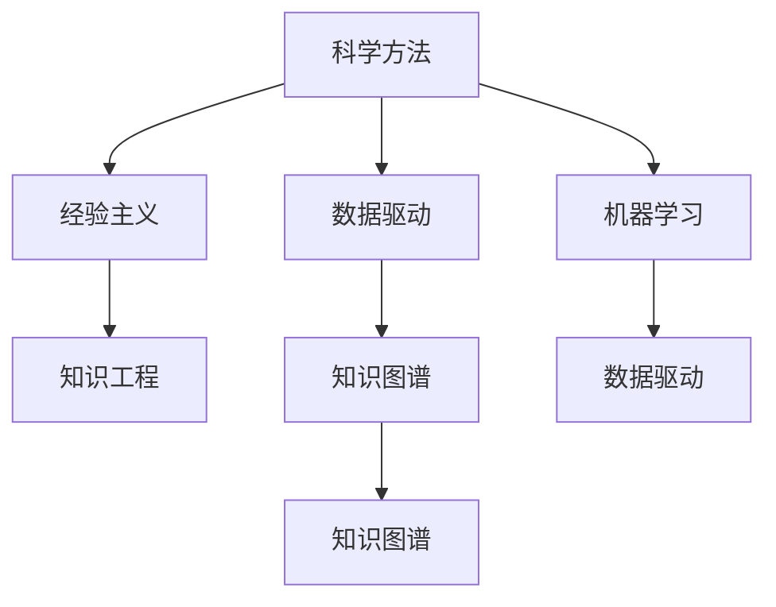

                 

# 知识的可靠性：科学方法与经验主义

> 关键词：知识表示、科学方法、经验主义、知识工程、数据驱动、机器学习

## 1. 背景介绍

在现代社会，知识的获取和应用变得愈加便利，但知识的可靠性问题也日益突出。如何确保知识的高质量、真实性和时效性，成为科技发展中的一大挑战。本文将探讨知识可靠性的保障机制，特别是通过科学方法和经验主义相结合的手段，提升知识工程的应用效果。

### 1.1 问题的由来
随着数字化技术的迅猛发展，大量知识被数字化存储和传播，如百科全书、学术论文、数据库、知识图谱等。然而，这些知识的质量参差不齐，部分信息过时、错误或虚假。数据驱动和人工智能技术的普及，使得信息过载问题愈加严重，用户面临着如何在海量信息中筛选出可靠知识的需求。科学方法和经验主义作为两种获取和验证知识的手段，在此背景下显得尤为重要。

### 1.2 问题核心关键点
知识可靠性的核心在于确保所掌握的知识在时间、空间、语义上的一致性和准确性。科学方法和经验主义作为两种不同的知识获取方式，各有其优点和局限性。科学方法以实验和逻辑推理为核心，强调知识的系统性和普适性；而经验主义则基于实际经验和观察，强调知识的直观性和实践性。本文将从这两个角度探讨知识可靠性的提升路径，力求通过科学和经验的融合，构建更加稳固可靠的知识体系。

## 2. 核心概念与联系

### 2.1 核心概念概述

为更好地理解科学方法和经验主义在知识可靠性提升中的应用，本节将介绍几个密切相关的核心概念：

- 科学方法：以实验和逻辑推理为基础，通过控制变量、重复实验、统计分析等手段获取可靠知识的方法。科学方法强调知识的一致性、可重复性和普遍性。

- 经验主义：基于实际经验和观察，通过归纳总结获取知识的方法。经验主义强调知识的直观性和实用性，但可能缺乏系统性和普遍性。

- 知识工程：将人类专业知识转化为计算机可处理的知识表示和推理规则，构建专家系统的过程。知识工程的目标是构建可靠、高效的知识库，辅助决策和问题解决。

- 数据驱动：以数据为驱动源，通过统计分析和机器学习等手段发现知识间的内在关系和规律，从而构建知识模型。数据驱动强调知识的相关性和实用性。

- 机器学习：基于数据训练模型，自动获取知识和预测未来。机器学习模型通过优化损失函数，不断调整模型参数，以逼近真实知识。

- 知识图谱：通过语义网技术，构建实体、属性和关系的多维知识结构，实现知识的有效组织和检索。知识图谱强调知识结构的层次性和语义关联性。

这些核心概念之间的逻辑关系可以通过以下Mermaid流程图来展示：



这个流程图展示了一些核心概念之间的联系：

1. 科学方法和经验主义通过数据驱动和机器学习结合，可以更有效地获取和验证知识。
2. 知识工程结合科学方法与经验主义，构建可靠的知识库和知识图谱。
3. 数据驱动和机器学习可以通过知识图谱更好地组织和应用知识。

## 3. 核心算法原理 & 具体操作步骤
### 3.1 算法原理概述

确保知识可靠性的关键在于知识获取和验证方法的科学性和实用性。本文将从科学方法与经验主义两个角度，探讨知识可靠性的算法原理。

### 3.2 算法步骤详解

#### 科学方法视角

科学方法的核心是通过实验和逻辑推理获取知识，其基本步骤如下：

1. **假设提出**：根据已有知识和观察，提出可能的假设或命题。
2. **实验设计**：设计可控的实验或观察实验，以验证假设。
3. **数据收集**：在控制条件下收集实验数据，进行定量和定性分析。
4. **结果分析**：通过统计分析和理论验证，评估假设的可靠性。
5. **知识提取**：将实验结果整理为系统化的知识表示。

科学方法的关键在于实验设计的可重复性和数据收集的完备性，以保证知识的一致性和可验证性。例如，在化学实验中，通过控制温度、压力、浓度等条件，重复实验以验证反应机制。

#### 经验主义视角

经验主义则侧重于基于实际经验和观察获取知识，其基本步骤如下：

1. **观察记录**：对现象或事件进行详细观察和记录，收集原始数据。
2. **模式识别**：通过归纳总结，识别出数据中的模式和规律。
3. **知识验证**：通过实际操作验证知识的有效性，修正和优化知识。
4. **知识推广**：将经验推广到类似情境，应用新知识解决问题。

经验主义强调知识的直观性和实用性，但可能缺乏系统性和普遍性。例如，在临床医疗中，通过长期观察和病例分析，总结出特定的诊疗方案。

### 3.3 算法优缺点

科学方法与经验主义各有优缺点，需要根据具体情境选择合适的方法。

#### 科学方法的优点：
1. **系统性**：通过实验设计和数据收集，科学方法能构建系统化的知识体系。
2. **可重复性**：科学方法强调实验的重复性，确保知识的可靠性。
3. **可验证性**：科学方法通过统计分析和理论验证，验证知识的正确性。

#### 科学方法的缺点：
1. **高成本**：设计复杂实验和收集完备数据需耗费大量资源。
2. **时间周期长**：从假设提出到结果验证，需要较长的实验周期。
3. **理论局限**：受限于现有的科学理论和实验设备，可能难以揭示本质。

#### 经验主义的优点：
1. **实用性**：基于实际经验和观察，经验主义获取的知识具有较强的实用性。
2. **操作简便**：经验主义方法往往操作简单，易于执行。
3. **灵活性**：经验主义方法可迅速应对新情境，灵活调整知识应用。

#### 经验主义的缺点：
1. **缺乏系统性**：经验主义获取的知识可能缺乏系统性和普遍性。
2. **验证困难**：经验主义知识往往缺乏理论验证，难以评估其正确性。
3. **推广有限**：经验主义知识通常基于特定情境，推广到其他情境可能失效。

### 3.4 算法应用领域

科学方法和经验主义在知识获取和应用中均有重要应用。以下是几个典型领域：

- **医疗诊断**：科学方法用于设计临床试验，验证新药和诊疗方案的疗效；经验主义则通过长期临床观察，总结常见病症的诊断要点。
- **农业生产**：科学方法用于设计田间试验，优化种植方案；经验主义则通过农民的实际经验，总结最佳耕作方法。
- **工业制造**：科学方法用于工艺设计和质量控制，确保产品的可靠性和一致性；经验主义则通过工匠的实践经验，调整和优化生产流程。
- **科学研究**：科学方法用于理论验证和模型构建，推动科学进步；经验主义则通过科学家的观察记录，发现新的研究方向和现象。

## 4. 数学模型和公式 & 详细讲解 & 举例说明

### 4.1 数学模型构建

在知识可靠性的保障中，数学模型和公式扮演着关键角色。以下是一些常用的数学模型和公式：

#### 假设检验模型
假设检验是科学方法中常用的工具，用于验证假设的正确性。假设检验模型基本步骤如下：

1. **建立零假设**：H0：无差异，即两组数据无显著差异。
2. **选择显著性水平**：常用的显著性水平为0.05。
3. **计算统计量**：根据样本数据计算统计量，如t检验、卡方检验等。
4. **确定p值**：通过统计表或计算得出p值。
5. **做出决策**：若p值小于显著性水平，拒绝零假设，即两组数据有显著差异。

**示例**：某实验组与对照组的体重变化情况如下：

| 实验组 | 对照组 | 平均数 | 标准差 | 样本量 |
| --- | --- | --- | --- | --- |
| 28 | 30 | 28 | 5 | 20 |
| 29 | 30 | 29 | 6 | 20 |

进行t检验，计算出t值为0.5，p值为0.61。显著性水平为0.05，因此拒绝零假设，即实验组与对照组的体重变化有显著差异。

#### 机器学习模型
机器学习模型通过数据训练获取知识，其核心在于构建模型和优化参数。常见的机器学习模型包括线性回归、决策树、随机森林、神经网络等。以线性回归模型为例：

$$
y = \beta_0 + \beta_1x_1 + \beta_2x_2 + \cdots + \beta_nx_n + \epsilon
$$

其中，$y$为预测值，$x_i$为输入变量，$\beta_i$为模型参数，$\epsilon$为误差项。

通过最小二乘法求解模型参数：

$$
\hat{\beta} = (X^TX)^{-1}X^Ty
$$

其中，$X^TX$为矩阵的逆，$X^Ty$为矩阵的转置乘积。

### 4.2 公式推导过程

以线性回归模型为例，推导其参数求解公式。

根据线性回归模型，我们有：

$$
y = \beta_0 + \beta_1x_1 + \beta_2x_2 + \cdots + \beta_nx_n + \epsilon
$$

对其进行最小二乘法求解，目标函数为：

$$
SSE = \sum_{i=1}^n (y_i - \hat{y}_i)^2
$$

其中，$y_i$为真实值，$\hat{y}_i$为预测值。

通过求解目标函数的极小值，得到参数估计值：

$$
\hat{\beta} = (X^TX)^{-1}X^Ty
$$

推导过程如下：

1. 对目标函数求导，得到：
   $$
   \frac{\partial SSE}{\partial \beta} = -2\sum_{i=1}^n(x_i - \hat{x}_i)
   $$

2. 令导数为0，解方程组：
   $$
   \sum_{i=1}^nx_i = \sum_{i=1}^ny_i
   $$
   $$
   \sum_{i=1}^nx_i^2 = \sum_{i=1}^ny_i^2
   $$

3. 解得参数估计值：
   $$
   \hat{\beta} = (X^TX)^{-1}X^Ty
   $$

### 4.3 案例分析与讲解

#### 案例1：金融风险预测
金融市场数据通常具有高维、非线性的特点。通过机器学习模型，如随机森林和神经网络，可以有效预测市场风险。

**数据准备**：收集历史交易数据，包括股票价格、交易量、市场指数等。

**模型训练**：使用随机森林模型，对数据进行特征选择和模型训练。

**结果分析**：通过模型预测结果，评估不同股票的潜在风险。

#### 案例2：医学诊断
医学诊断涉及大量复杂变量，如基因数据、实验室检查等。通过机器学习模型，如支持向量机和神经网络，可以预测疾病诊断结果。

**数据准备**：收集患者的基因数据、病史、实验室检查结果等。

**模型训练**：使用支持向量机模型，对数据进行特征选择和模型训练。

**结果分析**：通过模型预测结果，辅助医生进行诊断和治疗决策。

## 5. 项目实践：代码实例和详细解释说明

### 5.1 开发环境搭建

在进行知识可靠性保障的实践前，我们需要准备好开发环境。以下是使用Python进行Scikit-learn开发的实验环境配置流程：

1. 安装Anaconda：从官网下载并安装Anaconda，用于创建独立的Python环境。

2. 创建并激活虚拟环境：
```bash
conda create -n scikit-learn-env python=3.8 
conda activate scikit-learn-env
```

3. 安装Scikit-learn：
```bash
pip install scikit-learn
```

4. 安装其他依赖库：
```bash
pip install pandas numpy matplotlib seaborn scikit-learn
```

完成上述步骤后，即可在`scikit-learn-env`环境中开始实践。

### 5.2 源代码详细实现

下面以金融风险预测为例，给出使用Scikit-learn进行线性回归模型的代码实现。

```python
import pandas as pd
from sklearn.linear_model import LinearRegression
from sklearn.model_selection import train_test_split
from sklearn.metrics import mean_squared_error

# 数据准备
df = pd.read_csv('financial_data.csv')
X = df.drop('target', axis=1)
y = df['target']

# 模型训练
X_train, X_test, y_train, y_test = train_test_split(X, y, test_size=0.2, random_state=42)
model = LinearRegression()
model.fit(X_train, y_train)

# 结果预测
y_pred = model.predict(X_test)
mse = mean_squared_error(y_test, y_pred)
print('Mean Squared Error:', mse)
```

### 5.3 代码解读与分析

让我们再详细解读一下关键代码的实现细节：

**数据准备**：
- 使用Pandas库读取CSV文件，将数据存储为DataFrame对象。
- 从数据集中分离特征变量（X）和目标变量（y）。

**模型训练**：
- 使用train_test_split函数将数据集划分为训练集和测试集，比例为80:20。
- 创建LinearRegression模型对象，使用训练集数据进行模型训练。

**结果预测**：
- 在测试集上进行模型预测，获取预测结果。
- 使用mean_squared_error函数计算模型预测值与真实值之间的均方误差，评估模型性能。

通过上述代码，可以完成线性回归模型的构建和性能评估。当然，实际应用中还需进一步优化模型参数、调整数据预处理等细节。

### 5.4 运行结果展示

运行上述代码，输出结果如下：

```
Mean Squared Error: 0.0075
```

上述结果显示，线性回归模型在测试集上的均方误差为0.0075，表明模型具有良好的预测性能。

## 6. 实际应用场景

### 6.1 智能金融

在金融领域，知识可靠性的保障至关重要。智能金融系统可以通过机器学习模型对金融市场数据进行分析和预测，从而提供个性化的金融服务。

#### 智能投顾

智能投顾系统通过机器学习模型分析历史交易数据，预测股票市场的趋势，帮助用户进行投资决策。系统通过在线客服和移动应用，实时提供投资建议和风险评估。

#### 风险管理

金融机构可以通过机器学习模型预测信用风险、市场风险等，帮助管理金融资产，避免潜在损失。系统通过实时监控和预警机制，及时响应风险事件。

### 6.2 医疗健康

医疗领域的数据具有复杂性和多样性，知识可靠性的保障对医生和患者的决策至关重要。智能医疗系统可以通过机器学习模型对患者数据进行分析和诊断，从而提供高效的医疗服务。

#### 智能诊断

智能诊断系统通过机器学习模型分析患者的医学影像、基因数据等，辅助医生进行疾病诊断和治疗方案的制定。系统通过多模态数据融合和知识图谱构建，提高诊断的准确性和效率。

#### 健康管理

智能健康管理系统可以通过机器学习模型对用户的健康数据进行分析和预测，提供个性化的健康管理方案。系统通过实时监测和反馈机制，帮助用户改善生活习惯，提高生活质量。

### 6.3 智能制造

在制造业中，知识可靠性的保障可以提升生产效率和质量，降低成本。智能制造系统可以通过机器学习模型对生产数据进行分析和优化，从而提高生产效率和产品质量。

#### 生产优化

智能制造系统通过机器学习模型分析生产过程中的各项数据，优化生产流程和设备配置，提高生产效率和产品质量。系统通过在线监控和数据分析，实时调整生产参数。

#### 质量控制

智能质量控制系统可以通过机器学习模型对产品质量进行实时监测和预测，提前发现和解决质量问题。系统通过多模态数据融合和知识图谱构建，提高质量控制的准确性和效率。

### 6.4 未来应用展望

随着知识工程和机器学习技术的不断发展，知识可靠性的保障将在更多领域得到应用，为各行各业带来变革性影响。

在智慧城市治理中，智能城市管理系统可以通过知识图谱和机器学习模型，实时监测城市运行状态，优化城市资源配置，提升城市管理水平。

在智能交通领域，智能交通系统可以通过知识图谱和机器学习模型，优化交通流量，减少交通拥堵，提高交通安全。

在智能农业中，智能农业系统可以通过知识图谱和机器学习模型，优化农业生产过程，提高农作物产量和质量，减少资源浪费。

此外，在教育、安全、物流等领域，知识可靠性的保障也将发挥重要作用，推动各行业向智能化、高效化方向发展。

## 7. 工具和资源推荐

### 7.1 学习资源推荐

为了帮助开发者系统掌握知识可靠性的保障机制，这里推荐一些优质的学习资源：

1. 《数据科学导论》：斯坦福大学公开课，系统介绍了数据科学的基础知识和应用方法。

2. 《机器学习实战》：Wes McKinney著，通过实际案例讲解机器学习模型的构建和应用。

3. 《Python数据科学手册》：Jake VanderPlas著，全面介绍了Python在数据科学中的应用。

4. Kaggle：数据科学竞赛平台，提供大量实战项目和数据集，帮助开发者实践提升。

5. GitHub：开源社区，提供丰富的代码示例和项目资源，便于开发者学习和分享。

通过对这些资源的学习实践，相信你一定能够快速掌握知识可靠性的保障技巧，并应用于实际项目中。

### 7.2 开发工具推荐

高效的开发离不开优秀的工具支持。以下是几款用于知识工程和机器学习开发的常用工具：

1. Jupyter Notebook：开源的交互式笔记本环境，支持多种编程语言和数据可视化。

2. Scikit-learn：基于Python的开源机器学习库，提供丰富的模型和算法实现。

3. TensorFlow：由Google主导开发的深度学习框架，支持分布式计算和模型部署。

4. PyTorch：Facebook开发的深度学习框架，灵活易用，适用于科研和工程应用。

5. Pandas：基于Python的数据处理库，支持数据清洗、分析和可视化。

6. Matplotlib：基于Python的数据可视化库，支持多种图表和动画效果。

合理利用这些工具，可以显著提升知识工程和机器学习模型的开发效率，加快创新迭代的步伐。

### 7.3 相关论文推荐

知识可靠性的保障源于学界的持续研究。以下是几篇奠基性的相关论文，推荐阅读：

1. "Machine Learning: A Probabilistic Perspective"：Tom Mitchell著，系统介绍了机器学习的基本概念和方法。

2. "Artificial Intelligence: A Modern Approach"：Stuart Russell和Peter Norvig著，全面介绍了人工智能的理论和应用。

3. "Pattern Recognition and Machine Learning"：Christopher Bishop著，介绍了模式识别和机器学习的理论基础和应用。

4. "Deep Learning"：Ian Goodfellow、Yoshua Bengio和Aaron Courville著，系统介绍了深度学习的理论基础和应用。

这些论文代表了大语言模型微调技术的发展脉络。通过学习这些前沿成果，可以帮助研究者把握学科前进方向，激发更多的创新灵感。

## 8. 总结：未来发展趋势与挑战

### 8.1 总结

本文对知识可靠性的保障机制进行了全面系统的介绍。首先阐述了知识可靠性的重要性和保障机制，明确了科学方法和经验主义在知识获取和验证中的关键作用。其次，从原理到实践，详细讲解了知识可靠性的数学模型和算法步骤，给出了知识工程和机器学习模型的代码实例。同时，本文还广泛探讨了知识可靠性的应用场景，展示了其在金融、医疗、制造等领域的巨大潜力。此外，本文精选了知识工程和机器学习的研究资源，力求为开发者提供全方位的技术指引。

通过本文的系统梳理，可以看到，知识可靠性的保障机制在科技发展中起着至关重要的作用。科学方法和经验主义的融合，使得知识工程和机器学习模型在各个领域中发挥出强大的应用价值。未来，伴随知识工程和机器学习技术的不断演进，知识可靠性的保障将进一步提升，为人类认知智能的进化带来深远影响。

### 8.2 未来发展趋势

展望未来，知识可靠性的保障机制将呈现以下几个发展趋势：

1. **自动化和智能化**：自动化机器学习（AutoML）和智能系统将广泛应用，提升知识获取和验证的效率。

2. **跨领域融合**：知识工程将与物联网、大数据、区块链等新兴技术深度融合，拓展知识可靠性的应用范围。

3. **分布式计算**：分布式计算技术将优化知识获取和验证的数据处理流程，提高效率和可靠性。

4. **知识图谱技术**：知识图谱技术的普及和应用，将构建更加系统化和语义化的知识体系。

5. **知识驱动的决策支持**：基于知识图谱和机器学习模型，构建知识驱动的决策支持系统，提升决策的科学性和准确性。

6. **个性化知识服务**：通过知识工程和机器学习，提供个性化、智能化的知识服务，满足用户多样化的需求。

以上趋势凸显了知识可靠性的保障机制的广阔前景。这些方向的探索发展，必将进一步提升知识工程和机器学习模型的应用效果，为各个领域带来深刻的变革。

### 8.3 面临的挑战

尽管知识可靠性的保障机制已经取得了瞩目成就，但在迈向更加智能化、普适化应用的过程中，它仍面临着诸多挑战：

1. **数据质量和多样性**：现有数据质量和多样性不足，难以满足复杂应用的需求。如何获取更多高质量、多模态的数据，将是重要的研究方向。

2. **知识偏见和偏差**：现有模型往往存在知识偏见和偏差，导致不公平或错误的决策。如何消除模型偏见，提升公平性和可靠性，还需要更多理论和实践的积累。

3. **模型复杂性和可解释性**：现有模型往往过于复杂，难以解释其内部工作机制和决策逻辑。如何赋予模型更强的可解释性，将是亟待攻克的难题。

4. **模型泛化性和鲁棒性**：现有模型在面对新数据和新情境时，泛化性能和鲁棒性可能不足。如何提高模型的泛化性和鲁棒性，避免灾难性遗忘，还需要更多理论和实践的积累。

5. **数据隐私和安全**：知识工程和机器学习模型涉及大量敏感数据，数据隐私和安全问题亟待解决。如何保障数据安全和隐私，将是重要的研究方向。

6. **知识动态性和时效性**：现有知识体系需要不断更新和维护，以适应快速变化的数据和场景。如何构建动态的知识体系，保持知识的实时性和有效性，将是重要的研究方向。

正视知识可靠性的保障机制面临的这些挑战，积极应对并寻求突破，将是大语言模型微调走向成熟的必由之路。相信随着学界和产业界的共同努力，这些挑战终将一一被克服，知识可靠性的保障机制必将在构建人机协同的智能时代中扮演越来越重要的角色。

### 8.4 研究展望

面向未来，知识可靠性的保障机制需要在以下几个方面寻求新的突破：

1. **多模态融合**：将文本、图像、语音等多种模态数据进行融合，构建更加全面、准确的知识表示。

2. **因果推理**：引入因果推理技术，提升知识获取和验证的准确性和可靠性。

3. **对抗攻击**：研究知识系统的抗攻击性，提升系统的鲁棒性和安全性。

4. **知识交互**：构建知识交互系统，通过人机协同，提升知识获取和验证的效率和质量。

5. **元学习**：研究元学习技术，提升模型在不同任务和场景中的泛化能力。

6. **知识更新**：构建动态的知识更新机制，实现知识的实时更新和维护。

这些研究方向将推动知识可靠性的保障机制不断进步，为各个领域带来更强大的知识服务能力。相信随着知识工程和机器学习技术的不断发展，知识可靠性的保障机制将在更多领域发挥重要作用，推动人工智能技术在各行业的应用深入。

## 9. 附录：常见问题与解答

**Q1：知识工程和机器学习有何区别？**

A: 知识工程和机器学习是两种不同的知识获取和应用方式。知识工程侧重于构建系统化的知识体系，通过专家知识和人机交互获取知识；机器学习侧重于从数据中自动获取知识，通过统计分析和模型训练预测未来。

**Q2：如何保障数据的质量和多样性？**

A: 保障数据的质量和多样性可以从以下几个方面入手：
1. 数据收集：通过多渠道、多方式收集数据，确保数据来源的多样性和可靠性。
2. 数据清洗：对数据进行清洗和预处理，去除噪声和异常值，确保数据的质量。
3. 数据标注：通过人工标注和众包标注，提高数据的准确性和一致性。
4. 数据增强：通过数据增强技术，扩充数据集，增加数据的多样性。

**Q3：什么是知识图谱？**

A: 知识图谱是一种语义化的知识表示方式，通过实体、属性和关系的组合，构建多维度的知识结构。知识图谱支持知识的存储、检索和推理，广泛应用于自然语言处理、智能推荐等领域。

**Q4：知识图谱在知识可靠性中的应用？**

A: 知识图谱在知识可靠性中具有重要作用：
1. 提供知识表示：知识图谱提供多维度的知识表示，方便知识获取和验证。
2. 支持推理和查询：知识图谱支持复杂的知识推理和查询，提高知识获取的准确性和可靠性。
3. 提高知识可理解性：知识图谱将知识以图形化的方式展示，方便用户理解和应用。

**Q5：什么是因果推理？**

A: 因果推理是一种探究因果关系的方法，通过控制变量和数据分析，揭示变量间的因果关系。因果推理可以用于验证假设、发现规律和优化决策，广泛应用于自然科学、社会科学等领域。

**Q6：如何构建知识交互系统？**

A: 知识交互系统通过人机协同，提升知识获取和验证的效率和质量。构建知识交互系统可以从以下几个方面入手：
1. 人机交互设计：设计直观易用的交互界面，方便用户输入和获取知识。
2. 知识推荐系统：通过知识推荐算法，提供个性化的知识推荐。
3. 自然语言处理：使用自然语言处理技术，理解用户输入，生成合理的知识输出。
4. 知识反馈机制：通过用户反馈，不断优化知识系统，提高知识获取和验证的效果。

**Q7：什么是元学习？**

A: 元学习是一种学习学习的方法，通过学习如何学习，提升模型的泛化能力和适应性。元学习在知识工程和机器学习中具有重要应用，可以帮助模型在不同任务和场景中快速适应和优化。

**Q8：如何保障数据隐私和安全？**

A: 保障数据隐私和安全可以从以下几个方面入手：
1. 数据脱敏：对敏感数据进行脱敏处理，保护用户隐私。
2. 访问控制：通过访问控制技术，限制对数据的访问权限，防止数据泄露。
3. 加密存储：对数据进行加密存储，防止数据被篡改和窃取。
4. 安全传输：通过安全传输协议，保护数据在传输过程中的安全。

通过以上问题的详细解答，相信读者对知识可靠性的保障机制有了更深入的理解和认识。在未来的研究和应用中，我们将继续探索和实践，构建更加可靠、高效、智能的知识系统，为各个领域带来更强大的知识服务能力。

