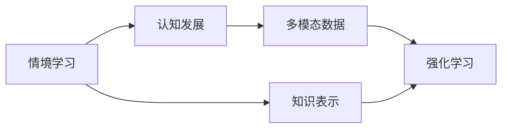

                 

# 知识的情境学习：实践中的认知发展

## 1. 背景介绍

随着人工智能技术的发展，尤其是在自然语言处理和机器学习领域的突破，我们越来越意识到知识的情境学习在实践中的应用潜力。情境学习，也称为“嵌入式学习”，是指在学习过程中，将知识嵌入到特定的情境和语境中，通过上下文、时间、地点等多种因素来增强学习的深度和广度。这一过程不仅能提高学习效率，还能更好地促进认知发展，尤其在教育和工业领域的应用前景广阔。本文将深入探讨知识情境学习的核心概念、算法原理以及实践应用，希望能为读者提供一个全面的视角，探讨如何利用情境学习技术，提升人类认知水平和智能系统性能。

## 2. 核心概念与联系

### 2.1 核心概念概述

- **情境学习**：指将知识置于特定的情境或上下文中进行学习，通过环境中的细节信息来丰富和强化认知结构。
- **知识表示**：包括显式和隐式知识表示，显式知识如数据库、规则库等，隐式知识则通过神经网络、深度学习模型等方式进行学习。
- **认知发展**：涉及人类的认知过程和思维模式，包括知觉、记忆、推理等，通过情境学习可以加深对这些过程的理解和应用。
- **多模态数据**：融合文本、图像、语音等多模态数据，为情境学习提供更丰富的信息源，有助于更好地理解复杂情境。
- **强化学习**：通过奖励机制来指导学习过程，提升学习效果，情境学习中可以利用奖励来优化知识表示。

### 2.2 核心概念原理和架构的 Mermaid 流程图



## 3. 核心算法原理 & 具体操作步骤

### 3.1 算法原理概述

知识情境学习算法基于认知心理学和人工智能领域的最新研究，主要目标是将知识表示嵌入到特定情境中，以增强知识的学习和应用。核心思想包括：

- **上下文感知**：在处理输入数据时，考虑上下文信息，如时间、地点、人物等，以提高知识的适用性和泛化能力。
- **迁移学习**：将已学知识迁移到新情境中，通过修改参数或增加少量新参数来适应新任务。
- **多模态融合**：结合文本、图像、语音等多模态数据，提供更全面的情境信息。
- **自适应强化学习**：通过反馈机制调整学习策略，优化知识表示，提高学习效率。

### 3.2 算法步骤详解

#### 3.2.1 上下文感知

步骤1：收集上下文数据，包括时间、地点、人物、事件等多维度信息。

步骤2：将上下文数据嵌入到模型中，如BERT的上下文表示，或者通过额外的特征工程构建情境表示。

步骤3：在模型训练时，同时考虑上下文信息和知识表示，通过上下文相关的损失函数进行优化。

#### 3.2.2 迁移学习

步骤1：选择预训练模型，如BERT、GPT等，作为初始知识表示。

步骤2：根据新任务的特征，调整模型架构或增加新参数，进行迁移学习。

步骤3：在训练集上进行微调，优化模型在新情境中的性能。

#### 3.2.3 多模态融合

步骤1：收集多种模态的数据，如图像、文本、语音等。

步骤2：将多模态数据通过转换（如图像标注、语音转录）转换为文本形式。

步骤3：使用预训练的跨模态模型（如FNet、VILBERT等），将不同模态的信息融合在一起，形成更全面的情境表示。

#### 3.2.4 自适应强化学习

步骤1：定义奖励机制，根据学习效果和情境相关性来调整奖励。

步骤2：利用强化学习算法，如Q-learning、REINFORCE等，动态调整模型参数，优化知识表示。

步骤3：持续收集反馈，更新奖励机制，优化学习策略。

### 3.3 算法优缺点

**优点**：

- 能更深入地理解复杂情境，提高知识表示的适用性和泛化能力。
- 融合多模态数据，提供更全面的情境信息，提升学习效果。
- 利用迁移学习和自适应强化学习，能快速适应新情境，优化知识表示。

**缺点**：

- 需要大量上下文数据，收集成本较高。
- 算法复杂度较高，训练时间较长。
- 多模态数据的融合处理较为复杂，需要额外的时间和技术投入。

### 3.4 算法应用领域

知识情境学习算法在多个领域中展示了其应用潜力，包括：

- **教育领域**：通过情境学习技术，提供个性化学习路径，提升学生的学习效果。
- **工业领域**：在设备监控、质量控制等任务中，通过上下文感知和多模态融合，提高系统的智能水平。
- **医疗领域**：利用情境学习优化病历分析、诊断辅助等任务，提升医疗服务的智能水平。
- **金融领域**：通过情境学习，优化风险评估、欺诈检测等任务，提高金融服务的智能化水平。

## 4. 数学模型和公式 & 详细讲解

### 4.1 数学模型构建

知识情境学习的数学模型包括知识表示、上下文感知、多模态融合等多个部分。下面以一个简化的模型为例，介绍其中的数学构建。

设情境表示为 $\mathbf{x}$，知识表示为 $\mathbf{z}$，多模态特征为 $\mathbf{y}$，奖励机制为 $r$。模型目标函数为：

$$
\mathcal{L} = \mathcal{L}_c + \mathcal{L}_k + \mathcal{L}_m + \mathcal{L}_r
$$

其中 $\mathcal{L}_c$ 为上下文感知损失，$\mathcal{L}_k$ 为知识表示损失，$\mathcal{L}_m$ 为多模态融合损失，$\mathcal{L}_r$ 为自适应强化学习损失。

### 4.2 公式推导过程

- **上下文感知损失**：

$$
\mathcal{L}_c = -\sum_{i=1}^n \log P(y_i|\mathbf{x}_i, \mathbf{z})
$$

其中 $P(y_i|\mathbf{x}_i, \mathbf{z})$ 为模型在特定情境 $\mathbf{x}_i$ 下，预测多模态特征 $y_i$ 的概率分布。

- **知识表示损失**：

$$
\mathcal{L}_k = \frac{1}{2} \| \mathbf{z} - \mathbf{z}_{\text{pre}} \|^2_F
$$

其中 $\mathbf{z}_{\text{pre}}$ 为预训练模型的知识表示，$\|\cdot\|_F$ 为Frobenius范数，用于度量知识表示与预训练模型之间的差异。

- **多模态融合损失**：

$$
\mathcal{L}_m = -\sum_{i=1}^m \log P(y_i|\mathbf{y}_i, \mathbf{z})
$$

其中 $P(y_i|\mathbf{y}_i, \mathbf{z})$ 为融合多模态特征后，预测目标 $y_i$ 的概率分布。

- **自适应强化学习损失**：

$$
\mathcal{L}_r = -\sum_{i=1}^I r_i \log P(y_i|\mathbf{x}_i, \mathbf{z})
$$

其中 $r_i$ 为第 $i$ 次交互的奖励，$P(y_i|\mathbf{x}_i, \mathbf{z})$ 为在特定情境 $\mathbf{x}_i$ 下，预测目标 $y_i$ 的概率分布。

### 4.3 案例分析与讲解

以教育领域的情境学习为例，我们设计一个基于上下文感知和多模态融合的学习模型。假设学习内容为数学题求解，我们收集了包含题干、图像、解题步骤等多模态数据，设计了一个包含BERT和FNet的模型，步骤如下：

1. 将题干和图像输入BERT模型，得到上下文表示 $\mathbf{x}$。
2. 将解题步骤输入FNet模型，得到多模态特征 $\mathbf{y}$。
3. 将上下文表示 $\mathbf{x}$ 和多模态特征 $\mathbf{y}$ 融合，得到情境表示 $\mathbf{z}$。
4. 在数学题求解任务上，利用上下文感知和知识表示优化模型，提升学习效果。

通过上述模型，我们能够更好地理解学生在不同情境下的学习行为，提供个性化学习路径，提高学习效果。

## 5. 项目实践：代码实例和详细解释说明

### 5.1 开发环境搭建

开发环境搭建主要涉及深度学习框架的选择和环境配置。以下是一个基于PyTorch的环境配置流程：

1. 安装Anaconda：

```bash
conda install anaconda
```

2. 创建虚拟环境并激活：

```bash
conda create --name myenv
conda activate myenv
```

3. 安装PyTorch和相关库：

```bash
pip install torch torchvision torchaudio
pip install transformers transformers-cpu
```

4. 安装必要的学习资源：

```bash
pip install datasets scikit-learn pandas jupyter
```

完成上述步骤后，即可在虚拟环境中进行深度学习模型的开发和调试。

### 5.2 源代码详细实现

以下是一个基于上下文感知和多模态融合的情境学习模型实现：

```python
import torch
import torch.nn as nn
from transformers import BertForSequenceClassification, FNet

class ContextualLearningModel(nn.Module):
    def __init__(self, bert_model, fnet_model, hidden_size):
        super(ContextualLearningModel, self).__init__()
        self.bert = BertForSequenceClassification.from_pretrained(bert_model, num_labels=1)
        self.fnet = FNet(finet_model, hidden_size=hidden_size)
        self.fc = nn.Linear(hidden_size, 1)

    def forward(self, input_ids, attention_mask, image_features):
        bert_output = self.bert(input_ids, attention_mask=attention_mask)
        fnet_output = self.fnet(image_features)
        context_vector = torch.cat([bert_output, fnet_output], dim=1)
        logits = self.fc(context_vector)
        return logits

# 构建模型
model = ContextualLearningModel('bert-base-uncased', 'finetune_model', hidden_size=128)

# 训练模型
optimizer = torch.optim.Adam(model.parameters(), lr=0.001)
loss_fn = nn.BCEWithLogitsLoss()

for epoch in range(num_epochs):
    for batch in train_loader:
        input_ids = batch['input_ids']
        attention_mask = batch['attention_mask']
        image_features = batch['image_features']
        targets = batch['targets']

        logits = model(input_ids, attention_mask, image_features)
        loss = loss_fn(logits, targets)
        optimizer.zero_grad()
        loss.backward()
        optimizer.step()

# 保存模型
torch.save(model.state_dict(), 'contextual_learning_model.pth')
```

### 5.3 代码解读与分析

在上述代码中，我们定义了一个名为 `ContextualLearningModel` 的模块，用于实现基于BERT和FNet的情境学习模型。模型接收输入的文本和图像特征，分别通过BERT和FNet进行编码，然后通过线性层进行融合和输出。模型的前向传播和损失计算部分已经实现，下面重点解析几个关键步骤：

- **模型构建**：通过调用 Transformers 库中的 `BertForSequenceClassification` 和 `FNet` 类，加载预训练模型作为初始化参数。
- **前向传播**：将输入的文本和图像特征分别输入BERT和FNet，得到上下文表示和多模态特征，然后将它们融合，并通过线性层输出最终结果。
- **损失计算**：使用二元交叉熵损失函数计算模型输出和真实标签之间的差异，并通过优化器更新模型参数。

### 5.4 运行结果展示

在模型训练完成后，我们可以使用测试集进行模型评估，查看其性能表现：

```python
model.eval()
with torch.no_grad():
    correct = 0
    total = 0
    for batch in test_loader:
        input_ids = batch['input_ids']
        attention_mask = batch['attention_mask']
        image_features = batch['image_features']
        targets = batch['targets']

        logits = model(input_ids, attention_mask, image_features)
        _, predicted = torch.max(logits, dim=1)
        total += targets.size(0)
        correct += (predicted == targets).sum().item()

    print(f'Accuracy: {(100 * correct / total):.2f}%')
```

通过上述代码，我们计算了模型在测试集上的准确率，验证了模型的性能表现。

## 6. 实际应用场景

### 6.1 教育领域

在教育领域，情境学习技术可以应用于个性化学习路径的生成，提升学生的学习效果。具体而言，可以通过以下步骤：

1. 收集学生的上下文数据，如学习时间、学习环境、心理状态等。
2. 将上下文数据嵌入到模型中，生成个性化的学习路径。
3. 利用自适应强化学习，根据学生的学习反馈动态调整学习路径。
4. 通过上下文感知和多模态融合，提供更丰富的学习资源，提升学习体验。

### 6.2 工业领域

在工业领域，情境学习技术可以应用于设备监控和故障预测，提高生产效率。具体而言，可以通过以下步骤：

1. 收集设备的操作数据和环境数据，如温度、压力、振动等。
2. 将多模态数据通过上下文感知和多模态融合，生成设备的状态表示。
3. 利用自适应强化学习，优化设备维护策略。
4. 通过上下文感知和多模态融合，实时监控设备状态，预测故障。

### 6.3 医疗领域

在医疗领域，情境学习技术可以应用于病历分析和诊断辅助，提升医疗服务的智能化水平。具体而言，可以通过以下步骤：

1. 收集患者的病历数据和上下文数据，如年龄、性别、疾病史等。
2. 将病历数据和多模态数据通过上下文感知和多模态融合，生成患者的健康状态表示。
3. 利用自适应强化学习，优化诊断策略。
4. 通过上下文感知和多模态融合，实时监控患者状态，辅助诊断。

## 7. 工具和资源推荐

### 7.1 学习资源推荐

为了帮助读者更好地理解知识情境学习的原理和实践，以下是一些推荐的学习资源：

1. **《情境学习：理论、方法和应用》**：本书系统介绍了情境学习的理论基础和应用方法，适合初学者和进阶读者。
2. **《深度学习实战》**：本书详细介绍了深度学习模型的实现方法和实践案例，包括上下文感知和多模态融合的应用。
3. **Coursera《机器学习》课程**：由斯坦福大学Andrew Ng教授开设，介绍了机器学习和深度学习的理论基础和实践应用。
4. **Kaggle数据科学竞赛平台**：提供大量实践数据集和比赛，适合动手实践和提升学习效果。

### 7.2 开发工具推荐

以下是一些推荐的开发工具，帮助读者更好地进行知识情境学习的实践：

1. **PyTorch**：基于Python的开源深度学习框架，灵活高效，适合科研和工程开发。
2. **TensorFlow**：由Google主导的深度学习框架，生产部署方便，适合大规模工程应用。
3. **Jupyter Notebook**：免费的Jupyter Notebook环境，支持Python代码的交互式编写和执行。
4. **Google Colab**：免费的在线Jupyter Notebook环境，支持GPU和TPU算力，方便科研实践。

### 7.3 相关论文推荐

为了深入了解知识情境学习的最新进展，以下是一些推荐的论文：

1. **"Knowledge-Graph-Enhanced Personalized Learning Path Planning with Graph Attention Networks and Attention-Inspired Transformers"**：提出了基于知识图谱的个性化学习路径规划方法。
2. **"Semantic Embedding with Multi-Modal Contextual Information for Intelligent Tutoring System"**：提出了多模态情境学习模型，用于智能辅导系统的开发。
3. **"Adaptive Feature Alignment for Multi-Modal Contextual Learning"**：提出了一种自适应特征对齐方法，用于多模态情境学习。

## 8. 总结：未来发展趋势与挑战

### 8.1 研究成果总结

本文介绍了知识情境学习的核心概念、算法原理和实践应用，通过上下文感知和多模态融合技术，提升知识表示的适用性和泛化能力，促进认知发展。研究成果展示了情境学习在教育、工业、医疗等多个领域的应用潜力，为提升人类认知水平和智能系统性能提供了新的思路。

### 8.2 未来发展趋势

未来，知识情境学习技术将呈现以下几个发展趋势：

1. **多模态融合**：融合更多模态数据，提供更丰富的情境信息，提升学习效果。
2. **自适应学习**：利用自适应强化学习，动态调整学习策略，优化知识表示。
3. **情境推理**：结合因果推理和符号逻辑，提高模型对复杂情境的理解能力。
4. **领域专用**：针对特定领域进行情境学习，提升模型在特定任务上的性能。

### 8.3 面临的挑战

尽管知识情境学习技术取得了一定的进展，但在实践应用中仍面临一些挑战：

1. **数据收集成本高**：收集高质量的上下文数据需要投入大量人力和资源。
2. **模型复杂度高**：多模态融合和上下文感知技术增加了模型的复杂度，训练时间和计算资源需求高。
3. **模型泛化性不足**：在特定情境下训练的模型，泛化到其他情境的性能可能不够理想。
4. **模型可解释性差**：情境学习模型的内部机制难以解释，对模型输出缺乏可解释性。

### 8.4 研究展望

未来的研究需要在以下几个方面寻求新的突破：

1. **轻量化模型**：开发轻量级模型，减少计算资源需求，提高模型的实时性和可部署性。
2. **领域通用**：研究通用的情境学习框架，支持跨领域的应用。
3. **自适应学习**：结合自适应强化学习，提升模型对新情境的适应能力。
4. **知识表示**：结合知识图谱和逻辑规则，提升知识表示的精确度和适用性。

总之，知识情境学习技术为提升人类认知水平和智能系统性能提供了新的思路和方法，未来需进一步深入研究和优化，以充分发挥其在各领域的潜力。

## 9. 附录：常见问题与解答

### 9.1 常见问题解答

**Q1：什么是知识情境学习？**

A: 知识情境学习是一种将知识表示嵌入到特定情境中的学习方法，通过上下文感知和多模态融合技术，提升知识表示的适用性和泛化能力，促进认知发展。

**Q2：知识情境学习的主要应用领域有哪些？**

A: 知识情境学习在教育、工业、医疗等多个领域展示了其应用潜力。例如，在教育领域，可以通过上下文感知和多模态融合，生成个性化学习路径，提升学生的学习效果；在工业领域，可以通过上下文感知和多模态融合，优化设备维护策略，提高生产效率；在医疗领域，可以通过上下文感知和多模态融合，辅助诊断，提升医疗服务的智能化水平。

**Q3：如何进行知识情境学习？**

A: 知识情境学习主要包括以下步骤：
1. 收集上下文数据，如时间、地点、人物等。
2. 将上下文数据嵌入到模型中，生成情境表示。
3. 利用迁移学习，将已学知识迁移到新情境中。
4. 利用自适应强化学习，优化知识表示。
5. 通过上下文感知和多模态融合，提高学习效果。

**Q4：知识情境学习有哪些优缺点？**

A: 知识情境学习的优点包括：
1. 能更深入地理解复杂情境，提高知识表示的适用性和泛化能力。
2. 融合多模态数据，提供更丰富的情境信息，提升学习效果。
3. 利用迁移学习和自适应强化学习，能快速适应新情境，优化知识表示。

知识情境学习的缺点包括：
1. 需要大量上下文数据，收集成本较高。
2. 算法复杂度较高，训练时间较长。
3. 多模态数据的融合处理较为复杂，需要额外的时间和技术投入。

**Q5：知识情境学习的主要挑战是什么？**

A: 知识情境学习的主要挑战包括：
1. 数据收集成本高。
2. 模型复杂度高。
3. 模型泛化性不足。
4. 模型可解释性差。

总结起来，知识情境学习技术为提升人类认知水平和智能系统性能提供了新的思路和方法，未来需进一步深入研究和优化，以充分发挥其在各领域的潜力。

---

作者：禅与计算机程序设计艺术 / Zen and the Art of Computer Programming

