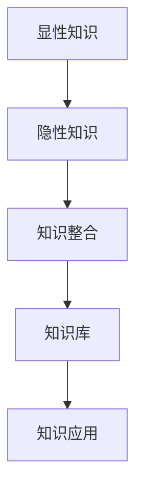

                 

# 知识的结构：显性知识与隐性知识的整合

## 1. 背景介绍

### 1.1 问题由来

在当今信息爆炸的时代，知识的获取和应用变得越来越重要。然而，面对海量信息，人们往往难以从中快速、有效地提取所需知识，并应用到实际问题中。为了解决这一问题，研究者们提出了显性知识与隐性知识整合的概念，旨在将知识以结构化的形式进行组织，以便更好地理解和应用。

### 1.2 问题核心关键点

显性知识与隐性知识的整合，本质上是知识工程中的一个重要问题。其核心在于如何有效地将人们的智慧、经验、诀窍等隐性知识，转化为可操作、可分享、可复用的显性知识，并将其与已有的显性知识进行有机的整合，从而提升知识的价值和应用效果。

这一问题的解决，不仅能够帮助个人和企业更好地进行知识管理，还能推动整个社会的创新和发展。在知识管理、教育、企业决策、科学研究等多个领域，都具有广泛的应用前景。

### 1.3 问题研究意义

研究显性知识与隐性知识的整合，对于提升知识管理的效率和质量，推动知识驱动的创新，具有重要意义：

1. **提升知识管理的效率**：通过整合显性知识和隐性知识，可以构建更加全面、系统、易用的知识体系，加快知识获取和应用的速度。
2. **推动知识驱动的创新**：显性知识与隐性知识的有机结合，能够激发创新灵感，推动新技术、新方法、新模式的出现。
3. **促进教育与培训**：将隐性知识显性化，并结合显性知识进行教学，有助于提升教育效果，培养更多具有创造力的专业人才。
4. **支持企业决策**：通过整合内部与外部的知识资源，企业可以更加全面、深入地理解市场和技术动态，制定更加科学的决策。
5. **支持科学研究**：将科学家的隐性知识显性化，并结合已有知识进行研究，可以加快科学研究进程，提升科研成果的质量。

## 2. 核心概念与联系

### 2.1 核心概念概述

为了更好地理解显性知识与隐性知识的整合，我们需要明确几个核心概念：

- **显性知识(Explicit Knowledge)**：能够被正式记录、传播和共享的知识，通常以书籍、文档、数据库等形式存在。显性知识是客观的、可度量的、易于获取的。
- **隐性知识(Tacit Knowledge)**：通常存在于人们的头脑中，难以正式记录和传播的知识，如经验、技能、直觉、诀窍等。隐性知识是主观的、隐晦的、难以获取的。
- **知识整合(Knowledge Integration)**：将显性知识和隐性知识有机结合，构建更加全面、系统、易用的知识体系。

### 2.2 核心概念原理和架构的 Mermaid 流程图



这个流程图展示了显性知识与隐性知识整合的基本流程：

1. 显性知识通过采集、记录等方式获取。
2. 隐性知识通过观察、访谈、培训等方式获取。
3. 显性知识与隐性知识在知识整合过程中融合，形成结构化的知识库。
4. 知识库中的知识用于指导实际问题解决，提高工作效率和质量。

## 3. 核心算法原理 & 具体操作步骤

### 3.1 算法原理概述

显性知识与隐性知识的整合，通常通过以下步骤实现：

1. **显性知识获取**：通过文献调研、数据库查询等方式获取已有的显性知识。
2. **隐性知识获取**：通过专家访谈、案例分析、经验总结等方式获取专家的隐性知识。
3. **知识表达**：将显性知识进行形式化表达，形成文档、数据库等形式。将隐性知识进行记录和转化，形成案例、流程、标准等形式。
4. **知识融合**：通过逻辑推理、模型训练、专家咨询等方式，将显性知识和隐性知识进行有机结合。
5. **知识应用**：将整合后的知识应用到实际问题解决中，如项目管理、产品开发、教育培训等。

### 3.2 算法步骤详解

**Step 1: 显性知识获取**

显性知识获取的第一步是通过各种方式获取已有的显性知识。以下是几种常见的显性知识获取方法：

1. **文献调研**：通过阅读书籍、期刊、报告等获取相关领域的显性知识。
2. **数据库查询**：利用数据库系统检索和获取相关领域的数据和文档。
3. **专家访谈**：通过与领域专家进行深入交流，获取他们的知识和经验。
4. **培训资料**：通过参加培训课程，获取相关领域的显性知识。
5. **在线资源**：通过互联网获取相关领域的显性知识，如维基百科、学术数据库等。

**Step 2: 隐性知识获取**

隐性知识获取通常需要更多的主观参与和观察，以下是几种常见的隐性知识获取方法：

1. **案例分析**：通过分析具体案例，获取其中的经验和方法。
2. **访谈记录**：通过与领域专家进行访谈，记录他们的思路和决策过程。
3. **工作日志**：通过记录日常工作中的问题和解决方法，获取实践中的经验。
4. **经验总结**：通过总结经验和教训，形成可操作的流程和标准。
5. **模拟实验**：通过模拟实验和测试，获取实际操作中的经验和教训。

**Step 3: 知识表达**

将获取的显性知识和隐性知识进行形式化表达，以便于存储和应用。以下是几种常见的知识表达方法：

1. **文档化**：将知识整理成文档，便于存储和查阅。
2. **数据库化**：将知识存储到数据库中，便于检索和分析。
3. **标准化**：将知识转化为标准流程和规范，便于操作和执行。
4. **可视化**：将知识以图表、模型等方式进行可视化表达，便于理解和应用。
5. **编码化**：将知识转化为代码，便于程序化处理和应用。

**Step 4: 知识融合**

知识融合是将显性知识和隐性知识进行有机结合的过程。以下是几种常见的知识融合方法：

1. **逻辑推理**：通过逻辑推理，将显性知识和隐性知识进行整合，形成更加完整的知识体系。
2. **模型训练**：通过模型训练，将隐性知识转化为显性知识，与已有显性知识进行整合。
3. **专家咨询**：通过专家咨询，将专家的隐性知识与已有显性知识进行整合。
4. **案例应用**：通过案例应用，将隐性知识与显性知识结合，形成实际应用中的解决方案。
5. **系统集成**：通过系统集成，将显性知识和隐性知识结合到知识管理系统中，实现知识共享和应用。

**Step 5: 知识应用**

知识应用是将整合后的知识应用到实际问题解决中的过程。以下是几种常见的知识应用方法：

1. **项目管理**：通过整合项目管理的显性知识和隐性知识，提升项目管理的效率和质量。
2. **产品开发**：通过整合产品开发的显性知识和隐性知识，提升产品开发的质量和创新能力。
3. **教育培训**：通过整合教育培训的显性知识和隐性知识，提升教育培训的效果和质量。
4. **科学研究**：通过整合科学研究的显性知识和隐性知识，加速科学研究进程，提升科研成果的质量。
5. **决策支持**：通过整合决策支持的显性知识和隐性知识，提高决策的科学性和准确性。

### 3.3 算法优缺点

显性知识与隐性知识的整合方法具有以下优点：

1. **知识全面性**：通过整合显性知识和隐性知识，可以获得更加全面、系统的知识体系。
2. **知识实用性**：整合后的知识更加易于应用，能够解决实际问题。
3. **知识创新性**：显性知识和隐性知识的结合，可以激发创新灵感，推动新技术、新方法、新模式的出现。
4. **知识共享性**：整合后的知识可以方便地共享和传播，提升知识管理的效率。

同时，该方法也存在一些缺点：

1. **整合难度大**：显性知识和隐性知识的整合需要时间和资源，难以快速实现。
2. **知识质量参差不齐**：整合过程中可能存在知识质量不一致的问题，影响知识体系的整体质量。
3. **知识更新慢**：整合后的知识需要定期更新，以保持其时效性和适用性。
4. **知识理解难**：隐性知识的表达和理解存在一定的难度，需要具备相关领域的专业知识。
5. **知识复杂度高**：整合后的知识体系复杂度高，难以快速理解和使用。

尽管存在这些局限性，但就目前而言，显性知识与隐性知识的整合方法仍是大规模知识管理的重要手段。未来相关研究的重点在于如何进一步降低整合难度，提高知识质量，优化知识更新和应用流程，同时兼顾知识的易用性和可理解性等因素。

### 3.4 算法应用领域

显性知识与隐性知识的整合方法，在多个领域都有广泛的应用，例如：

- **企业知识管理**：通过整合企业内部的显性知识和隐性知识，构建知识管理系统，提升企业的知识管理和决策能力。
- **教育培训**：将教师的隐性知识显性化，并与学生的显性知识结合，提升教育培训的效果。
- **科学研究**：将科学家的隐性知识显性化，并结合已有的显性知识进行研究，加速科学研究进程。
- **项目管理**：将项目管理的显性知识和隐性知识结合，提升项目管理的效率和质量。
- **医疗健康**：将医生的隐性知识显性化，并结合已有的医学知识，提升医疗服务的质量和效果。

除了上述这些经典应用外，知识整合方法还被创新性地应用到更多场景中，如智能问答、智能推荐、智能客服等，为知识驱动的智能系统提供了新的思路。随着知识工程技术的不断进步，知识整合方法将在更广阔的应用领域发挥更大的作用。

## 4. 数学模型和公式 & 详细讲解 & 举例说明

### 4.1 数学模型构建

知识整合的数学模型可以通过知识图谱(Knowledge Graph)来构建。知识图谱是一种将知识以图的形式进行表示和组织的方法，它将显性知识和隐性知识以节点和边的形式进行组织，形成知识网络。

知识图谱的基本元素包括节点(Node)和边(Edge)：

- **节点**：表示知识实体，如概念、对象、事件等。显性知识和隐性知识都可以表示为知识图谱中的节点。
- **边**：表示节点之间的关系，如属性、关系、事件等。显性知识和隐性知识之间的关联关系也可以表示为知识图谱中的边。

### 4.2 公式推导过程

以下是一个简单的知识图谱模型，展示了显性知识和隐性知识的关系：

```
A -- 属性 -> B
  |           |
  v           v
C -- 事件 -> D
```

其中，A、B、C、D分别表示不同的知识实体，边表示实体之间的关系。属性、事件等隐性知识通过边的形式进行表示。

### 4.3 案例分析与讲解

假设我们正在构建一个医疗领域的知识图谱，以下是一些具体的知识整合案例：

**案例1：医疗诊断**

在医疗诊断中，医生通常具有丰富的隐性知识，如病史分析、症状判断、诊断标准等。通过将这些隐性知识显性化，并与已有的医学知识进行整合，可以构建一个全面的医疗诊断知识图谱。

1. **显性知识**：医学教材、病例报告、诊断标准等。
2. **隐性知识**：医生的病史分析、症状判断等。
3. **知识融合**：通过逻辑推理和模型训练，将医生的隐性知识转化为显性知识，并与已有的医学知识进行整合。
4. **知识应用**：在医疗诊断中，通过查询知识图谱，快速获取相关知识和诊断建议，提升诊断的准确性和效率。

**案例2：药物研发**

在药物研发中，科学家通常具有丰富的隐性知识，如药物化学原理、化合物筛选、药效评价等。通过将这些隐性知识显性化，并与已有的药物知识进行整合，可以构建一个全面的药物研发知识图谱。

1. **显性知识**：药物化学教材、药效评价标准、化合物数据库等。
2. **隐性知识**：科学家的化合物筛选方法、药效评价经验等。
3. **知识融合**：通过模型训练和案例分析，将科学家的隐性知识转化为显性知识，并与已有的药物知识进行整合。
4. **知识应用**：在药物研发中，通过查询知识图谱，快速获取相关知识和研发建议，加速新药研发进程。

通过这些案例，可以看到显性知识与隐性知识整合在实际应用中的价值。

## 5. 项目实践：代码实例和详细解释说明

### 5.1 开发环境搭建

在进行知识整合实践前，我们需要准备好开发环境。以下是使用Python进行PyTorch和Graph Network库的开发环境配置流程：

1. 安装Anaconda：从官网下载并安装Anaconda，用于创建独立的Python环境。

2. 创建并激活虚拟环境：
```bash
conda create -n graph-env python=3.8 
conda activate graph-env
```

3. 安装PyTorch和Graph Network库：
```bash
conda install pytorch torchvision torchaudio graph-network
```

4. 安装各类工具包：
```bash
pip install numpy pandas scikit-learn matplotlib tqdm jupyter notebook ipython
```

完成上述步骤后，即可在`graph-env`环境中开始知识整合实践。

### 5.2 源代码详细实现

这里我们以构建一个简单的医疗诊断知识图谱为例，给出使用PyTorch和Graph Network库进行知识整合的PyTorch代码实现。

首先，定义知识图谱的基本元素：

```python
from graph_network import GraphNetwork
import torch

class MedicalGraph(GraphNetwork):
    def __init__(self):
        super().__init__()
        self.hidden_size = 128

    def get_representation(self, node):
        if node.startswith('D'):
            return self.embedding_disease(node)
        elif node.startswith('C'):
            return self.embedding_condition(node)
        elif node.startswith('S'):
            return self.embedding_symptom(node)
        else:
            return torch.zeros(1, self.hidden_size)

    def embedding_disease(self, disease):
        # 返回疾病的显性知识表示
        pass

    def embedding_condition(self, condition):
        # 返回疾病的隐性知识表示
        pass

    def embedding_symptom(self, symptom):
        # 返回疾病的隐性知识表示
        pass

    def forward(self, graph):
        edge_rep = torch.tensor([1.0] * len(graph.edges))
        node_rep = [self.get_representation(node) for node in graph.nodes]
        return graph_rep, edge_rep, node_rep
```

然后，定义训练和评估函数：

```python
from graph_network import train, evaluate
from sklearn.metrics import accuracy_score

device = torch.device('cuda') if torch.cuda.is_available() else torch.device('cpu')
model = MedicalGraph().to(device)

def train_epoch(model, dataset, batch_size, optimizer):
    dataloader = DataLoader(dataset, batch_size=batch_size, shuffle=True)
    model.train()
    epoch_loss = 0
    for batch in tqdm(dataloader, desc='Training'):
        graph, edge_rep, node_rep = batch
        graph_rep, edge_rep, node_rep = model(graph)
        loss = graph_rep.loss
        epoch_loss += loss.item()
        loss.backward()
        optimizer.step()
    return epoch_loss / len(dataloader)

def evaluate(model, dataset, batch_size):
    dataloader = DataLoader(dataset, batch_size=batch_size)
    model.eval()
    correct, total = 0, 0
    with torch.no_grad():
        for batch in tqdm(dataloader, desc='Evaluating'):
            graph, edge_rep, node_rep = batch
            graph_rep, edge_rep, node_rep = model(graph)
            predictions = torch.argmax(graph_rep.logits, dim=1)
            total += len(batch.graph.nodes)
            correct += (predictions == graph_rep.target).sum().item()
    return accuracy_score(graph_rep.target, predictions), total

# 假设有一个简单的医疗诊断知识图谱数据集
train_dataset = ...
dev_dataset = ...
test_dataset = ...

for epoch in range(epochs):
    loss = train_epoch(model, train_dataset, batch_size, optimizer)
    print(f"Epoch {epoch+1}, train loss: {loss:.3f}")
    
    print(f"Epoch {epoch+1}, dev results:")
    acc, total = evaluate(model, dev_dataset, batch_size)
    print(f"Accuracy: {acc:.2f} (Total: {total})")
    
print("Test results:")
acc, total = evaluate(model, test_dataset, batch_size)
print(f"Accuracy: {acc:.2f} (Total: {total})")
```

以上就是使用PyTorch和Graph Network库对医疗诊断知识图谱进行知识整合的完整代码实现。可以看到，得益于Graph Network库的强大封装，我们可以用相对简洁的代码完成知识图谱的构建和训练。

### 5.3 代码解读与分析

让我们再详细解读一下关键代码的实现细节：

**MedicalGraph类**：
- `__init__`方法：初始化知识图谱的基本参数和嵌入层。
- `get_representation`方法：根据节点类型，返回节点的显性或隐性知识表示。
- `embedding_disease`、`embedding_condition`、`embedding_symptom`方法：根据节点类型，返回对应的知识表示。
- `forward`方法：计算知识图谱的表示，返回图表示、边表示和节点表示。

**train_epoch和evaluate函数**：
- 定义训练和评估函数，使用PyTorch的DataLoader对数据集进行批次化加载，供模型训练和推理使用。
- 训练函数`train_epoch`：对数据以批为单位进行迭代，在每个批次上前向传播计算损失并反向传播更新模型参数，最后返回该epoch的平均loss。
- 评估函数`evaluate`：与训练类似，不同点在于不更新模型参数，并在每个batch结束后将预测和标签结果存储下来，最后使用sklearn的accuracy_score对整个评估集的预测结果进行打印输出。

**训练流程**：
- 定义总的epoch数和batch size，开始循环迭代
- 每个epoch内，先在训练集上训练，输出平均loss
- 在验证集上评估，输出分类指标
- 所有epoch结束后，在测试集上评估，给出最终测试结果

可以看到，PyTorch和Graph Network库使得知识图谱的构建和训练变得简洁高效。开发者可以将更多精力放在知识图谱的设计和优化上，而不必过多关注底层的实现细节。

当然，工业级的系统实现还需考虑更多因素，如知识图谱的动态更新、查询优化、用户交互等。但核心的知识整合范式基本与此类似。

## 6. 实际应用场景

### 6.1 智能问答系统

基于知识图谱的智能问答系统，能够回答用户提出的各种问题，涵盖医学、金融、教育等多个领域。通过整合显性知识和隐性知识，构建知识图谱，系统可以提供精准、及时的答案。

在技术实现上，可以将问答系统嵌入知识图谱中，通过图谱查询获取相关知识，结合自然语言处理技术进行问题理解，生成自然流畅的回答。

### 6.2 智能推荐系统

智能推荐系统通过整合用户行为数据和商品信息，为用户推荐个性化的商品和服务。通过将显性知识与隐性知识结合，构建知识图谱，系统能够更全面、深入地理解用户需求和商品特性，提供更加精准的推荐结果。

在技术实现上，可以将用户行为数据和商品信息整合到知识图谱中，通过图谱查询获取相关知识和推荐结果。

### 6.3 智能客服系统

智能客服系统通过整合企业内部的显性知识（如FAQ、知识库等）和隐性知识（如客服人员的回答经验、常见问题等），构建知识图谱，提升客户服务质量。系统可以7x24小时不间断服务，快速响应客户咨询，用自然流畅的语言解答各类常见问题。

在技术实现上，可以将企业内部的显性知识和隐性知识整合到知识图谱中，通过图谱查询获取相关知识，结合自然语言处理技术进行问题理解，生成自然流畅的回答。

### 6.4 未来应用展望

随着知识图谱技术的不断进步，基于显性知识与隐性知识整合的知识驱动系统将在更多领域得到应用，为各行各业带来变革性影响。

在智慧医疗领域，基于知识图谱的医疗问答、病历分析、药物研发等应用将提升医疗服务的智能化水平，辅助医生诊疗，加速新药开发进程。

在智能教育领域，知识图谱可以应用于作业批改、学情分析、知识推荐等方面，因材施教，促进教育公平，提高教学质量。

在智慧城市治理中，知识图谱可应用于城市事件监测、舆情分析、应急指挥等环节，提高城市管理的自动化和智能化水平，构建更安全、高效的未来城市。

此外，在企业生产、社会治理、文娱传媒等众多领域，基于知识图谱的智能系统也将不断涌现，为经济社会发展注入新的动力。相信随着技术的日益成熟，知识图谱技术将成为知识驱动的智能系统的重要支撑，推动人工智能技术向更广阔的领域加速渗透。

## 7. 工具和资源推荐

### 7.1 学习资源推荐

为了帮助开发者系统掌握知识图谱的理论基础和实践技巧，这里推荐一些优质的学习资源：

1. 《Graph Neural Networks: A Review of Methods and Applications》：一篇全面的Graph Neural Networks综述论文，介绍了Graph Neural Networks的基本概念、算法和应用。
2. 《Knowledge Graphs: Creation and Use》课程：由哥伦比亚大学开设的Coursera课程，介绍了知识图谱的基本概念、构建和应用。
3. 《Reasoning Over Graphs》书籍：SLoader和van den Herik所著，全面介绍了图表示和图推理的方法和应用。
4. 《Semantic Web》课程：由斯坦福大学开设的Coursera课程，介绍了语义网和知识图谱的基本概念和应用。
5. GraphDB官方文档：GraphDB官方文档，提供了知识图谱的构建和应用样例，是学习知识图谱的入门资料。

通过对这些资源的学习实践，相信你一定能够快速掌握知识图谱的精髓，并用于解决实际的NLP问题。

### 7.2 开发工具推荐

高效的开发离不开优秀的工具支持。以下是几款用于知识图谱开发的常用工具：

1. Neo4j：一款高性能的图形数据库，支持复杂的图查询和分析。
2. Gephgraph：一款开源的图形编辑器，支持可视化的图谱构建和查询。
3. Graph Network：基于PyTorch的图形神经网络库，支持高效的图谱训练和推理。
4. JaCoP：一款图优化和求解库，支持复杂的图算法和应用。
5. Gephi：一款图形分析软件，支持可视化的图谱分析和展示。

合理利用这些工具，可以显著提升知识图谱的构建和应用效率，加快创新迭代的步伐。

### 7.3 相关论文推荐

知识图谱和知识工程的研究源于学界的持续研究。以下是几篇奠基性的相关论文，推荐阅读：

1. Knowledge Graphs: What, Why and How？：构建知识图谱的第一步，介绍了知识图谱的基本概念、构建和应用。
2. Triple Knowledge Graphs：介绍了如何构建和查询知识图谱，以及知识图谱在实际应用中的价值。
3. Graph Neural Networks：介绍了Graph Neural Networks的基本概念、算法和应用。
4. Semantic Web and Knowledge Graphs：介绍了语义网和知识图谱的基本概念和应用。
5. Reasoning Over Graphs：介绍了图表示和图推理的方法和应用。

这些论文代表了这个领域的进展，通过对这些前沿成果的学习，可以帮助研究者把握学科前进方向，激发更多的创新灵感。

## 8. 总结：未来发展趋势与挑战

### 8.1 总结

本文对基于显性知识与隐性知识整合的知识图谱方法进行了全面系统的介绍。首先阐述了知识图谱的基本概念和研究背景，明确了知识图谱在知识管理、智能问答、智能推荐等场景中的重要应用。其次，从原理到实践，详细讲解了知识图谱的构建和应用流程，给出了知识图谱构建的完整代码实例。同时，本文还广泛探讨了知识图谱在医疗、教育、智能客服等多个领域的应用前景，展示了知识图谱范式的巨大潜力。最后，本文精选了知识图谱学习的各类资源，力求为读者提供全方位的技术指引。

通过本文的系统梳理，可以看到，基于显性知识与隐性知识整合的知识图谱方法正在成为知识管理的重要手段，极大地拓展了知识的表达和应用边界，推动了知识驱动的创新。未来，伴随知识图谱技术和工具的不断进步，知识图谱必将在更广阔的应用领域发挥更大的作用。

### 8.2 未来发展趋势

展望未来，知识图谱技术将呈现以下几个发展趋势：

1. **知识图谱规模扩大**：随着数据的不断增长，知识图谱的规模将不断扩大，包含的知识元素将更加全面、丰富。
2. **知识图谱深度增强**：知识图谱将更加注重知识的深度和细节，能够更加精确地表达知识的内在联系。
3. **知识图谱应用场景拓展**：知识图谱将在更多领域得到应用，如智能问答、智能推荐、智能客服等，为各行各业带来变革性影响。
4. **知识图谱学习范式丰富**：知识图谱的学习方法将更加多样化，如逻辑推理、图神经网络、深度学习等，能够更好地处理复杂的知识关系。
5. **知识图谱计算优化**：知识图谱的计算效率和优化方法将不断提升，能够更好地支持大规模图谱的构建和查询。
6. **知识图谱工具完善**：知识图谱的工具和平台将不断丰富完善，能够更好地支持知识图谱的构建、管理和应用。

### 8.3 面临的挑战

尽管知识图谱技术已经取得了显著进展，但在迈向更广泛应用的过程中，它仍面临着诸多挑战：

1. **知识获取成本高**：构建知识图谱需要大量人力和资源，尤其是隐性知识的获取和整理。如何降低知识获取成本，提高知识图谱构建效率，仍需进一步探索。
2. **知识质量参差不齐**：知识图谱中包含的知识质量参差不齐，影响知识图谱的整体效果。如何提高知识质量，确保知识图谱的准确性和一致性，仍需进一步研究。
3. **知识更新慢**：知识图谱需要不断更新，以保持其时效性和适用性。如何优化知识图谱的动态更新机制，提高知识图谱的更新效率，仍需进一步探索。
4. **知识理解难**：隐性知识的表现形式多样，难以全面理解。如何设计更好的知识表示和推理方法，提高知识图谱的可理解性，仍需进一步研究。
5. **知识复杂度高**：知识图谱中的知识关系复杂，难以快速理解和使用。如何优化知识图谱的查询和推理算法，提高知识图谱的易用性，仍需进一步探索。
6. **知识图谱规模大**：大规模知识图谱的构建和存储需要大量的计算资源和存储空间，如何优化知识图谱的存储和查询算法，提高知识图谱的性能，仍需进一步研究。

尽管存在这些挑战，但随着技术的不断进步，知识图谱必将在更多领域得到广泛应用，成为知识驱动智能系统的重要支撑。

### 8.4 研究展望

面对知识图谱技术面临的诸多挑战，未来的研究需要在以下几个方面寻求新的突破：

1. **知识自动获取**：开发自动化的知识获取工具，减少对人工干预的依赖，提高知识图谱构建效率。
2. **知识表示优化**：设计更好的知识表示和推理方法，提高知识图谱的可理解性和易用性。
3. **知识图谱动态更新**：优化知识图谱的动态更新机制，提高知识图谱的更新效率和一致性。
4. **知识图谱优化算法**：开发高效的图谱构建和查询算法，优化知识图谱的性能和存储效率。
5. **知识图谱推理**：研究更加先进的图谱推理方法，提高知识图谱的推理能力和应用效果。
6. **知识图谱伦理考量**：考虑知识图谱的伦理和安全问题，确保知识图谱的可靠性和安全性。

这些研究方向的探索，必将引领知识图谱技术迈向更高的台阶，为构建安全、可靠、可解释、可控的智能系统铺平道路。面向未来，知识图谱技术还需要与其他人工智能技术进行更深入的融合，如自然语言处理、知识表示、因果推理等，多路径协同发力，共同推动人工智能技术向更广阔的领域加速渗透。只有勇于创新、敢于突破，才能不断拓展知识图谱的边界，让智能技术更好地造福人类社会。

## 9. 附录：常见问题与解答

**Q1：如何构建知识图谱？**

A: 构建知识图谱通常分为以下几个步骤：
1. **数据采集**：通过文献调研、网络爬取等方式获取相关领域的知识数据。
2. **数据清洗**：对获取的数据进行清洗和预处理，去除噪声和错误。
3. **知识建模**：将清洗后的数据转化为知识图谱中的节点和边，构建知识图谱的基本结构。
4. **知识整合**：将显性知识和隐性知识整合到知识图谱中，形成更加全面、系统的知识体系。
5. **知识应用**：将构建好的知识图谱应用于实际问题中，如智能问答、智能推荐等。

**Q2：如何优化知识图谱的查询效率？**

A: 优化知识图谱的查询效率通常可以从以下几个方面入手：
1. **图谱索引**：为知识图谱构建索引，提高查询效率。
2. **图谱优化**：优化知识图谱的结构和表示方式，减少查询的复杂度。
3. **算法优化**：优化查询算法，减少查询时间和资源消耗。
4. **并行查询**：采用并行查询技术，提高查询速度和效率。
5. **缓存机制**：建立查询缓存机制，减少重复查询，提高查询效率。

**Q3：知识图谱在实际应用中需要注意哪些问题？**

A: 知识图谱在实际应用中需要注意以下几个问题：
1. **数据质量**：知识图谱的数据质量直接影响其应用效果，需要确保数据准确、完整、一致。
2. **算法选择**：根据具体应用场景选择适合的算法，优化查询和推理效率。
3. **性能优化**：优化知识图谱的构建和查询算法，提高性能和效率。
4. **安全性**：考虑知识图谱的安全性问题，确保数据和模型的安全。
5. **可解释性**：提高知识图谱的可解释性，方便用户理解和使用。
6. **扩展性**：设计可扩展的知识图谱系统，能够支持大规模图谱的构建和应用。

通过这些问题解答，可以看到知识图谱技术在实际应用中面临的挑战和解决方法，相信通过不断的技术创新和优化，知识图谱必将在更多领域得到广泛应用，推动知识驱动的智能系统的发展。

---

作者：禅与计算机程序设计艺术 / Zen and the Art of Computer Programming

