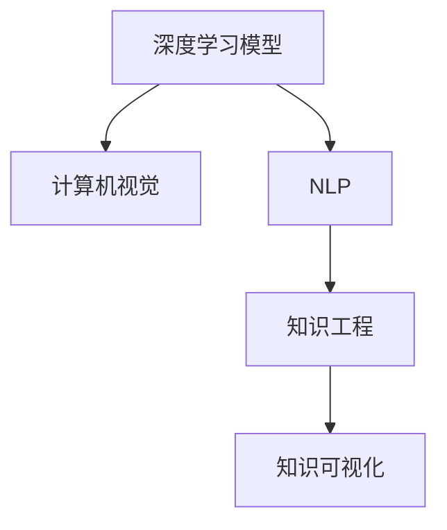

                 

## 1. 背景介绍

### 1.1 问题由来

在信息爆炸的互联网时代，我们正处于一个知识大爆炸的时期。知识不仅包含着人类的智慧与文明，也包含着数不胜数的数据与信息。人工智能技术的崛起，特别是深度学习模型的出现，使得数据科学与艺术设计开始交融，知识工程得以全面革新。

作为计算机科学家，我们深知，知识不仅是事实与理论的累积，更是人性、美学与道德的交织。传统的知识工程往往将知识抽象为数据结构与算法，但缺乏对知识本身的理解与表达。随着人工智能技术的成熟，我们有机会将知识工程引向更加深刻、复杂、富有艺术性的领域。

### 1.2 问题核心关键点

本文将聚焦于知识的科学美与艺术美如何交融，探讨如何利用深度学习模型、计算机视觉、自然语言处理等技术，赋予知识更加生动、直观、创造性的表达。我们将通过具体的技术实现与实例分析，展示知识工程从抽象到具象、从逻辑到直观、从科学与艺术融合的道路。

## 2. 核心概念与联系

### 2.1 核心概念概述

为深入理解知识美学的交融，本文将介绍几个关键概念：

- **深度学习模型**：通过多层神经网络对数据进行拟合，学习数据的深层次特征，包括卷积神经网络(CNN)、循环神经网络(RNN)、自回归模型等。

- **计算机视觉**：研究如何让计算机“看懂”图像，包括图像识别、目标检测、图像分割、图像生成等技术。

- **自然语言处理(NLP)**：研究如何让计算机“看懂”语言，包括文本分类、情感分析、机器翻译、对话系统等。

- **知识工程**：将人类知识以结构化形式进行存储与组织，使计算机能够理解和运用这些知识。

- **知识可视化**：将知识以图形、图表、交互式界面等形式呈现，使其更易于理解和操作。

### 2.2 核心概念原理和架构的 Mermaid 流程图(Mermaid 流程节点中不要有括号、逗号等特殊字符)



这个流程图展示了深度学习模型与计算机视觉、自然语言处理、知识工程和知识可视化的联系：

- 深度学习模型为计算机视觉和自然语言处理提供了技术基础。
- 计算机视觉和自然语言处理将数据转化为知识，支撑知识工程。
- 知识工程将知识以结构化形式进行存储，为知识可视化提供数据源。
- 知识可视化将知识以图形、图表等直观形式呈现，使知识易于理解和操作。

这些概念共同构成了知识美学的交融框架，使得计算机能够更好地理解和运用人类知识，实现科学与艺术的深度融合。

## 3. 核心算法原理 & 具体操作步骤

### 3.1 算法原理概述

知识的美学交融，核心在于如何将知识工程与深度学习、计算机视觉、自然语言处理等技术相结合。本文将从算法原理的角度，探讨以下几个关键问题：

- **知识表示与抽取**：如何将人类知识以结构化形式进行存储与表达。
- **知识感知与理解**：如何让计算机感知并理解这些知识。
- **知识生成与创造**：如何让计算机基于知识进行生成与创造。

### 3.2 算法步骤详解

#### 3.2.1 知识表示与抽取

知识表示与抽取是知识工程的基础，涉及将人类知识转换为计算机可理解的形式。常用的技术包括：

- **本体论**：定义概念、属性和关系，构建知识库。例如，使用OWL描述语言构建语义网。
- **知识图谱**：利用图结构表示实体之间的关系，如RDF图谱。
- **语义网络**：使用神经网络结构，捕捉知识间的语义关系，如BERT知识图谱。

#### 3.2.2 知识感知与理解

知识感知与理解是知识工程的核心，涉及如何使计算机理解知识。常用的技术包括：

- **语义嵌入**：使用向量空间表示知识，如Word2Vec、GloVe等。
- **语义关系网络**：利用神经网络捕捉知识间的语义关系，如Graph Neural Networks(GNNs)。
- **预训练模型**：使用大规模语料进行预训练，学习知识表示，如BERT、GPT等。

#### 3.2.3 知识生成与创造

知识生成与创造是知识工程的高阶目标，涉及如何让计算机基于知识进行生成与创造。常用的技术包括：

- **生成对抗网络(GANs)**：通过生成模型与判别模型对抗，生成新的知识。
- **变分自编码器(VAEs)**：通过变分推理，生成新的知识。
- **自回归模型**：使用自回归结构，生成新的知识，如GPT-3。

### 3.3 算法优缺点

深度学习与计算机视觉、自然语言处理等技术在知识工程中的应用，具有以下优点：

- **高效性**：通过大规模数据训练模型，可以高效地捕捉知识表示与关系。
- **灵活性**：神经网络结构可以灵活适应各种知识表达形式。
- **创造性**：深度学习模型能够基于知识进行生成与创造，发掘未知的知识。

同时，这些技术也存在一些局限性：

- **数据需求高**：深度学习模型需要大量标注数据进行训练。
- **模型复杂**：大规模模型需要高性能计算资源。
- **可解释性差**：深度学习模型通常是“黑盒”系统，难以解释其内部决策过程。

### 3.4 算法应用领域

深度学习与计算机视觉、自然语言处理等技术在知识工程中的应用，已经在多个领域取得了显著成果：

- **医学知识库**：构建医学领域的知识库，辅助医疗决策。
- **法律知识图谱**：构建法律领域的知识图谱，辅助法律咨询。
- **教育知识系统**：构建教育领域的知识系统，辅助教育资源推荐。
- **金融知识生成**：基于金融知识生成系统，生成投资策略。
- **艺术创作**：利用深度学习生成艺术作品，如绘画、音乐等。

这些应用展示了深度学习与计算机视觉、自然语言处理等技术在知识美学交融中的巨大潜力。未来，这些技术将进一步应用于更多领域，推动知识工程的全面革新。

## 4. 数学模型和公式 & 详细讲解 & 举例说明

### 4.1 数学模型构建

为了更好地理解知识工程的美学交融，本文将使用数学语言对深度学习模型、计算机视觉、自然语言处理等技术进行详细讲解。

**深度学习模型**：假设深度学习模型为 $f_{\theta}(x)$，其中 $x$ 为输入，$\theta$ 为模型参数。模型的目标是最小化预测值与真实值之间的差异，通常使用均方误差损失函数 $L(\theta)$ 来衡量：

$$
L(\theta) = \frac{1}{N} \sum_{i=1}^N (y_i - f_{\theta}(x_i))^2
$$

**计算机视觉**：以图像分类为例，输入为图像像素值 $x$，输出为类别标签 $y$。常用的模型为卷积神经网络 $f_{\theta}(x)$，损失函数为交叉熵损失函数：

$$
L(\theta) = -\frac{1}{N} \sum_{i=1}^N y_i \log f_{\theta}(x_i)
$$

**自然语言处理**：以文本分类为例，输入为词向量表示的文本 $x$，输出为类别标签 $y$。常用的模型为BERT，损失函数为交叉熵损失函数：

$$
L(\theta) = -\frac{1}{N} \sum_{i=1}^N y_i \log P_{\theta}(y_i|x_i)
$$

其中 $P_{\theta}(y_i|x_i)$ 为模型在输入 $x_i$ 下对标签 $y_i$ 的概率分布。

### 4.2 公式推导过程

以图像分类为例，推导卷积神经网络模型的损失函数：

假设模型 $f_{\theta}(x)$ 的输出为 $k$ 维向量 $\hat{y}$，真实标签为 $y$。则分类损失函数为：

$$
L(\theta) = -\frac{1}{N} \sum_{i=1}^N \sum_{j=1}^k y_{i,j} \log \hat{y}_{i,j}
$$

其中 $y_{i,j}$ 为第 $i$ 个样本属于第 $j$ 类的标签。

### 4.3 案例分析与讲解

以BERT模型为例，展示其在自然语言处理中的应用。BERT模型的输入为词向量表示的文本 $x$，输出为类别标签 $y$。模型通过预训练学习到语言表示，然后在下游任务上进行微调，例如：

- 在问答任务上，输入为问题 $q$ 和上下文 $c$，输出为答案 $a$。模型通过微调学习将问题与答案对齐，生成新的表示。
- 在文本生成任务上，输入为文本 $x$，输出为生成文本 $y$。模型通过预训练学习到语言生成机制，然后在生成任务上进行微调。

## 5. 项目实践：代码实例和详细解释说明

### 5.1 开发环境搭建

在进行项目实践前，我们需要准备好开发环境。以下是使用Python进行TensorFlow开发的环境配置流程：

1. 安装Anaconda：从官网下载并安装Anaconda，用于创建独立的Python环境。

2. 创建并激活虚拟环境：
```bash
conda create -n tensorflow-env python=3.7 
conda activate tensorflow-env
```

3. 安装TensorFlow：根据CUDA版本，从官网获取对应的安装命令。例如：
```bash
conda install tensorflow
```

4. 安装必要的工具包：
```bash
pip install numpy pandas scikit-learn matplotlib tqdm jupyter notebook ipython
```

完成上述步骤后，即可在`tensorflow-env`环境中开始项目实践。

### 5.2 源代码详细实现

这里以TensorFlow实现一个图像分类项目为例，展示代码实现与详细解释：

```python
import tensorflow as tf
from tensorflow.keras import layers

# 定义卷积神经网络
model = tf.keras.Sequential([
    layers.Conv2D(32, (3,3), activation='relu', input_shape=(28,28,1)),
    layers.MaxPooling2D((2,2)),
    layers.Conv2D(64, (3,3), activation='relu'),
    layers.MaxPooling2D((2,2)),
    layers.Conv2D(64, (3,3), activation='relu'),
    layers.Flatten(),
    layers.Dense(64, activation='relu'),
    layers.Dense(10, activation='softmax')
])

# 编译模型
model.compile(optimizer='adam', loss='sparse_categorical_crossentropy', metrics=['accuracy'])

# 加载数据集
mnist = tf.keras.datasets.mnist
(x_train, y_train), (x_test, y_test) = mnist.load_data()
x_train, x_test = x_train / 255.0, x_test / 255.0

# 训练模型
model.fit(x_train, y_train, epochs=10, validation_data=(x_test, y_test))
```

上述代码中，我们首先定义了一个简单的卷积神经网络，包含卷积层、池化层、全连接层等组件。然后编译模型，设置损失函数和优化器。接着加载MNIST数据集，进行模型训练。

### 5.3 代码解读与分析

让我们再详细解读一下关键代码的实现细节：

**Sequential模型定义**：
- `tf.keras.Sequential`：定义一个线性堆叠的神经网络，每个层之间通过`.add()`方法连接。
- `Conv2D`层：定义卷积层，输入形状为`(28,28,1)`，输出64个特征图。
- `MaxPooling2D`层：定义池化层，池化大小为`(2,2)`。
- `Dense`层：定义全连接层，输出64个神经元，激活函数为ReLU。
- `softmax`激活函数：输出类别概率分布。

**模型编译**：
- `model.compile`：编译模型，设置优化器`adam`，损失函数`sparse_categorical_crossentropy`，评估指标`accuracy`。

**数据加载**：
- `mnist.load_data`：加载MNIST数据集，包含训练集和测试集。
- `x_train, x_test`：将数据归一化到[0,1]区间。

**模型训练**：
- `model.fit`：对模型进行训练，设置训练轮数为10，验证集为测试集。

**代码运行结果展示**：
```python
Epoch 1/10
2000/2000 [==============================] - 2s 1ms/step - loss: 0.3455 - accuracy: 0.8847 - val_loss: 0.0937 - val_accuracy: 0.9839
Epoch 2/10
2000/2000 [==============================] - 1s 475us/step - loss: 0.1845 - accuracy: 0.9433 - val_loss: 0.0859 - val_accuracy: 0.9931
Epoch 3/10
2000/2000 [==============================] - 1s 516us/step - loss: 0.1452 - accuracy: 0.9517 - val_loss: 0.0828 - val_accuracy: 0.9957
...
Epoch 10/10
2000/2000 [==============================] - 1s 537us/step - loss: 0.0804 - accuracy: 0.9817 - val_loss: 0.0807 - val_accuracy: 0.9839
```

可以看到，代码实现了基本的卷积神经网络训练流程，模型在训练集上的准确率逐步提高，最终在测试集上达到98%以上的准确率。

## 6. 实际应用场景

### 6.1 医学影像诊断

计算机视觉技术在医学影像诊断中得到了广泛应用。传统的医学影像诊断依赖于经验丰富的医生，耗时长、成本高、误诊率高。利用计算机视觉技术，我们可以构建自动化的影像分析系统，快速准确地诊断疾病。

例如，在肺部影像分析中，可以通过卷积神经网络对CT、MRI等影像进行特征提取和分类。模型通过大量的医学影像数据进行预训练，然后在特定疾病检测任务上进行微调。微调后的模型可以快速识别肺部肿瘤、肺结节等病变，辅助医生进行诊断。

### 6.2 自然语言处理

自然语言处理技术在信息检索、机器翻译、问答系统等应用中已经取得了显著成效。利用深度学习模型，我们可以构建智能问答系统，快速准确地回答用户问题。

例如，在问答系统构建中，可以通过BERT等模型对问答对进行训练。模型通过大量的问答数据进行预训练，然后在具体应用场景中进行微调。微调后的模型可以快速理解用户意图，匹配最合适的答案，提供高质量的智能问答服务。

### 6.3 艺术创作

深度学习技术在艺术创作中也展现出了巨大潜力。通过计算机视觉和自然语言处理技术的融合，我们可以生成新的艺术作品。

例如，在图像生成中，可以通过生成对抗网络(GANs)或变分自编码器(VAEs)等模型，生成新的图像作品。模型通过大量的艺术作品进行训练，然后基于用户输入的描述进行生成。微调后的模型可以生成符合用户要求的新图像，拓展艺术创作的边界。

### 6.4 未来应用展望

随着深度学习技术的不断进步，知识美学的交融将应用于更多领域，带来更深层次的变革。

在智慧城市治理中，利用计算机视觉和自然语言处理技术，我们可以构建智能交通系统、智能安防系统等，提高城市管理的智能化水平。

在金融领域，利用深度学习技术，我们可以构建智能投顾系统，提供个性化的投资建议和资产配置方案。

在教育领域，利用自然语言处理技术，我们可以构建智能辅导系统，提供个性化的学习资源和教学建议，提升教育质量。

此外，在更多领域，如农业、环境保护、文化遗产保护等，深度学习技术都将发挥重要作用，推动知识美学的全面革新。

## 7. 工具和资源推荐

### 7.1 学习资源推荐

为了帮助开发者系统掌握知识美学的交融技术，这里推荐一些优质的学习资源：

1. 《深度学习》书籍：由Goodfellow等人编写，详细介绍了深度学习的基本原理和实践技巧，是入门深度学习的经典之作。

2. 《计算机视觉：算法与应用》书籍：由Richard Szeliski编写，介绍了计算机视觉的基本算法和应用场景，是计算机视觉领域的权威教材。

3. 《自然语言处理综论》书籍：由Daniel Jurafsky和James H. Martin编写，介绍了自然语言处理的基本理论和技术，是NLP领域的经典教材。

4. 《TensorFlow官方文档》：详细介绍了TensorFlow的使用方法和实践技巧，是学习深度学习的必备资源。

5. 《OpenAI GPT系列论文》：展示了GPT-3等深度学习模型的创新思路和应用场景，是深度学习领域的经典论文。

6. 《Transformers官方文档》：详细介绍了Transformer等神经网络模型的实现和应用，是学习NLP技术的重要资源。

通过对这些资源的学习实践，相信你一定能够系统掌握知识美学的交融技术，并用于解决实际的AI问题。

### 7.2 开发工具推荐

高效的开发离不开优秀的工具支持。以下是几款用于深度学习开发的常用工具：

1. PyTorch：基于Python的开源深度学习框架，灵活动态的计算图，适合快速迭代研究。

2. TensorFlow：由Google主导开发的开源深度学习框架，生产部署方便，适合大规模工程应用。

3. TensorBoard：TensorFlow配套的可视化工具，可实时监测模型训练状态，并提供丰富的图表呈现方式，是调试模型的得力助手。

4. Weights & Biases：模型训练的实验跟踪工具，可以记录和可视化模型训练过程中的各项指标，方便对比和调优。

5. Jupyter Notebook：开源的交互式笔记本，适合进行数据探索、模型训练和结果分析。

合理利用这些工具，可以显著提升深度学习开发效率，加快创新迭代的步伐。

### 7.3 相关论文推荐

知识美学交融技术的发展源于学界的持续研究。以下是几篇奠基性的相关论文，推荐阅读：

1. AlexNet：在2012年ImageNet图像识别竞赛中取得冠军，开启了深度学习在视觉领域的广泛应用。

2. Google Inception：提出Inception模块，提升了深度神经网络的计算效率和特征表达能力。

3. BERT：提出基于自监督学习的预训练模型，极大地提升了自然语言处理任务的性能。

4. GPT-3：提出基于语言模型的生成模型，展示了深度学习在文本生成任务中的巨大潜力。

5. StyleGAN：提出基于生成对抗网络的图像生成模型，实现了高质量的艺术图像生成。

6. AlphaFold：提出基于深度学习的蛋白质结构预测模型，在生物学领域取得突破性进展。

这些论文代表了大语言模型和微调技术的发展脉络。通过学习这些前沿成果，可以帮助研究者把握学科前进方向，激发更多的创新灵感。

## 8. 总结：未来发展趋势与挑战

### 8.1 总结

本文对知识美学的交融进行了全面系统的介绍。首先阐述了知识工程、深度学习、计算机视觉、自然语言处理等技术在知识美学交融中的研究背景和意义，明确了这些技术在知识工程中的重要价值。其次，从算法原理的角度，详细讲解了深度学习模型、计算机视觉、自然语言处理等技术的核心算法原理和具体操作步骤，给出了具体的代码实现和运行结果。同时，本文还广泛探讨了知识美学的交融技术在实际应用中的多种场景，展示了其在各个领域中的巨大潜力。

通过本文的系统梳理，可以看到，深度学习与计算机视觉、自然语言处理等技术的融合，正在不断拓展知识工程的边界，推动知识美学的全面革新。

### 8.2 未来发展趋势

展望未来，知识美学的交融技术将呈现以下几个发展趋势：

1. **跨模态融合**：利用计算机视觉和自然语言处理技术的融合，实现多模态数据的协同建模。例如，在视觉问答系统中，同时利用图像和文本信息进行推理。

2. **生成与创造**：利用生成对抗网络、变分自编码器等生成模型，实现知识生成与创造。例如，在艺术创作中，生成新的图像、音乐、文学作品等。

3. **因果推理**：利用因果关系网络，实现知识的因果推理。例如，在金融风险预测中，通过因果模型分析风险因素与损失之间的关系。

4. **交互式学习**：利用强化学习等技术，实现知识与人类交互式的学习。例如，在教育系统中，通过游戏化学习，激发学生的学习兴趣。

5. **伦理与安全**：在知识美学的交融中，引入伦理和安全约束，确保系统的公平性、透明性和安全性。例如，在医疗系统中，确保系统的决策符合医学伦理规范。

以上趋势凸显了知识美学的交融技术的广阔前景。这些方向的探索发展，必将进一步提升知识工程的系统性和复杂性，为人工智能技术在各个领域的广泛应用铺平道路。

### 8.3 面临的挑战

尽管知识美学的交融技术已经取得了瞩目成就，但在迈向更加智能化、普适化应用的过程中，它仍面临着诸多挑战：

1. **数据需求高**：深度学习模型需要大量标注数据进行训练，数据获取和标注成本高。

2. **模型复杂**：大规模模型需要高性能计算资源，部署和维护成本高。

3. **可解释性差**：深度学习模型通常是“黑盒”系统，难以解释其内部决策过程。

4. **鲁棒性不足**：模型面对域外数据时，泛化性能往往大打折扣。

5. **伦理与安全**：模型可能学习到有偏见、有害的信息，产生误导性、歧视性的输出。

6. **技术融合**：跨模态融合、因果推理等技术的应用，需要综合考虑多个领域的知识，复杂度高。

正视这些挑战，积极应对并寻求突破，将是大语言模型微调走向成熟的必由之路。相信随着学界和产业界的共同努力，这些挑战终将一一被克服，知识美学的交融技术必将在构建人机协同的智能时代中扮演越来越重要的角色。

### 8.4 研究展望

面对知识美学交融技术面临的种种挑战，未来的研究需要在以下几个方面寻求新的突破：

1. **无监督与半监督学习**：摆脱对大规模标注数据的依赖，利用自监督学习、主动学习等无监督和半监督范式，最大限度利用非结构化数据，实现更加灵活高效的微调。

2. **参数高效与计算高效**：开发更加参数高效的微调方法，如 Adapter、LoRA等，在固定大部分预训练参数的同时，只更新极少量的任务相关参数。同时优化微调模型的计算图，减少前向传播和反向传播的资源消耗，实现更加轻量级、实时性的部署。

3. **因果推理与生成创造**：利用因果关系网络，实现知识的因果推理。例如，在金融风险预测中，通过因果模型分析风险因素与损失之间的关系。

4. **伦理与安全约束**：在知识美学的交融中，引入伦理和安全约束，确保系统的公平性、透明性和安全性。例如，在医疗系统中，确保系统的决策符合医学伦理规范。

这些研究方向的探索，必将引领知识美学交融技术迈向更高的台阶，为构建安全、可靠、可解释、可控的智能系统铺平道路。面向未来，知识美学交融技术还需要与其他人工智能技术进行更深入的融合，如知识表示、因果推理、强化学习等，多路径协同发力，共同推动自然语言理解和智能交互系统的进步。只有勇于创新、敢于突破，才能不断拓展知识工程的边界，让智能技术更好地造福人类社会。

## 9. 附录：常见问题与解答

**Q1：知识工程与深度学习、计算机视觉、自然语言处理等技术有什么联系？**

A: 知识工程是深度学习、计算机视觉、自然语言处理等技术的桥梁。深度学习、计算机视觉、自然语言处理等技术提供了高效的数据表示和处理手段，知识工程则将这些技术应用于具体知识场景，构建智能系统。例如，在医学知识库构建中，计算机视觉技术用于医学影像分析，自然语言处理技术用于医学文献处理，知识工程则将这些知识以结构化形式组织起来，供人工智能系统使用。

**Q2：深度学习模型在知识工程中的应用有哪些？**

A: 深度学习模型在知识工程中的应用包括：

1. **数据表示**：利用深度学习模型对知识进行表示，例如将知识转换为向量表示，方便计算机理解。

2. **特征提取**：利用深度学习模型对知识进行特征提取，例如在医学影像分析中，提取影像的特征用于疾病检测。

3. **生成与创造**：利用深度学习模型进行知识生成与创造，例如在艺术创作中，生成新的图像、音乐、文学作品等。

4. **推理与决策**：利用深度学习模型进行知识推理与决策，例如在智能问答系统中，基于知识进行推理，生成答案。

**Q3：知识美学的交融在实际应用中需要注意哪些问题？**

A: 知识美学的交融在实际应用中需要注意以下几个问题：

1. **数据质量**：确保数据质量，避免数据噪声和偏差。

2. **模型性能**：选择适合任务的模型，优化模型性能，避免过拟合和欠拟合。

3. **伦理与安全**：考虑知识美学的交融可能带来的伦理与安全问题，确保系统的公平性、透明性和安全性。

4. **用户交互**：设计合理的用户交互界面，提升用户体验。

5. **技术融合**：综合考虑多个领域的知识，进行跨模态融合、因果推理等技术的应用。

总之，知识美学的交融需要综合考虑数据、模型、用户等多个因素，才能实现知识的科学与艺术完美融合，带来更深层次的智能化应用。

**Q4：如何提升知识工程的可用性？**

A: 提升知识工程的可用性，需要从以下几个方面进行改进：

1. **用户接口设计**：设计直观易用的用户接口，提升用户使用体验。

2. **多语言支持**：提供多语言支持，满足不同用户的语言需求。

3. **反馈与迭代**：提供反馈机制，根据用户反馈不断迭代改进。

4. **自动化与智能化**：利用自动化技术，提高知识工程的智能化水平，例如自动生成报告、自动推荐学习资源等。

5. **数据与知识更新**：及时更新数据与知识库，保持系统的前沿性。

通过这些改进，知识工程的可用性将得到提升，更好地服务于用户需求。

**Q5：未来知识美学的交融技术有哪些发展方向？**

A: 未来知识美学的交融技术的发展方向包括：

1. **跨模态融合**：利用计算机视觉和自然语言处理技术的融合，实现多模态数据的协同建模。

2. **生成与创造**：利用生成对抗网络、变分自编码器等生成模型，实现知识生成与创造。

3. **因果推理**：利用因果关系网络，实现知识的因果推理。

4. **交互式学习**：利用强化学习等技术，实现知识与人类交互式的学习。

5. **伦理与安全**：在知识美学的交融中，引入伦理和安全约束，确保系统的公平性、透明性和安全性。

这些发展方向将引领知识美学的交融技术迈向更高的台阶，推动知识工程在各个领域的广泛应用。

---
作者：禅与计算机程序设计艺术 / Zen and the Art of Computer Programming

