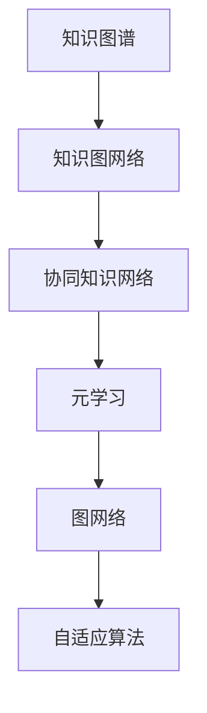

                 

# 知识的融合：跨领域创新的源泉

> 关键词：知识融合, 跨领域创新, 深度学习, 协同知识网络, 元学习, 图网络, 自适应算法

## 1. 背景介绍

### 1.1 问题由来

当前，人工智能(AI)技术正迅速改变着各行各业，从医疗、金融到教育、制造等领域，AI的渗透和应用越来越广泛。然而，尽管AI技术在单个领域取得了显著进展，但在不同领域之间缺乏有效知识的交流和融合，导致很多技术无法跨领域迁移和应用，这严重制约了AI技术的综合发展。

近年来，知识图谱(Knowledge Graph)和知识图网络(Knowledge Graph Network, KGN)等方法被提出，旨在帮助不同领域之间建立深度知识联系。知识图谱通过构建实体与实体之间的关联网络，使得不同领域之间的知识可以被有效整合和利用。知识图网络则进一步强化了知识的关联性和融合性，通过图结构网络来更高效地传播和共享知识。

本文将介绍知识融合的概念及其在跨领域创新中的应用，帮助读者深入理解知识融合的原理、方法和实际应用，为推动AI技术的综合发展和应用提供新的思路。

### 1.2 问题核心关键点

知识融合的核心在于将不同领域、不同形式的知识进行高效整合，形成一致、完整的知识体系。这包括：

- **知识表示与融合**：如何将不同领域、不同结构的知识统一表示，构建一致的知识图谱。
- **知识关联与传递**：如何在不同领域之间建立深度关联，使得知识可以跨领域传播。
- **知识应用与创新**：如何将融合后的知识应用于新的任务，实现跨领域的创新与突破。

本文将从以上三个关键点出发，深入探讨知识融合的方法、工具和应用。

## 2. 核心概念与联系

### 2.1 核心概念概述

为更好地理解知识融合的原理和应用，本节将介绍几个关键概念：

- **知识图谱**：一种结构化的知识表示方式，通过实体-关系-实体(Relation Extraction, RE)三元组表示知识，构建知识图网络。
- **知识图网络**：利用图结构网络来表示和传播知识，通过节点和边的关联性，强化知识之间的深度连接。
- **协同知识网络**：由多个知识图谱组成的网络，不同领域之间的知识可以相互渗透、补充，形成协同的知识体系。
- **元学习**：一种学习如何学习的算法，能够通过学习领域之间的共享知识，实现跨领域的知识迁移和应用。
- **图网络**：一种基于图结构的数据表示和处理方式，通过图的传递机制，实现知识的融合和传播。
- **自适应算法**：一种能够根据输入数据自适应调整算法的算法，以更好地适应不同领域的应用需求。

这些概念之间的逻辑关系可以通过以下Mermaid流程图来展示：



这个流程图展示知识融合的核心概念及其之间的关系：

1. 知识图谱通过三元组表示知识，构建了知识图网络。
2. 多个知识图谱构成协同知识网络，不同领域之间知识可以相互渗透。
3. 元学习通过共享知识，实现跨领域的知识迁移。
4. 图网络通过传递机制，实现知识的融合和传播。
5. 自适应算法根据输入数据，自适应调整算法，更好地适应不同领域的应用。

这些概念共同构成了知识融合的理论基础，使得不同领域之间的知识可以被有效整合和利用。

## 3. 核心算法原理 & 具体操作步骤
### 3.1 算法原理概述

知识融合的算法原理基于图结构网络，旨在通过节点和边的关联性，强化知识之间的深度连接。具体来说，知识融合过程分为以下几步：

1. **知识表示**：将不同领域、不同结构的知识统一表示，构建知识图谱。
2. **知识关联**：在知识图谱的基础上，通过图网络，建立不同领域之间的深度关联。
3. **知识传播**：通过图网络的传递机制，实现知识在不同领域之间的传播和融合。
4. **知识应用**：将融合后的知识应用于新的任务，实现跨领域的创新与突破。

### 3.2 算法步骤详解

知识融合的具体算法步骤如下：

**Step 1: 构建知识图谱**
- 收集不同领域的数据，构建实体-关系-实体三元组，表示为 $$(h,r,t)$$。
- 使用知识图嵌入(Knowledge Graph Embedding, KGE)方法，将三元组映射为低维向量表示。
- 构建知识图网络，通过边权重表示不同实体的关联强度。

**Step 2: 知识关联与传播**
- 在知识图网络的基础上，利用图网络算法，如图卷积网络(Graph Convolutional Network, GCN)，强化知识之间的关联性。
- 通过多层图卷积，逐步传播知识，使得节点之间的知识关联更加紧密。
- 引入节点和边特征，如节点的属性和边的权重，增强知识传播的泛化能力。

**Step 3: 知识应用**
- 将融合后的知识应用到新的任务上，如实体识别、关系推理、知识预测等。
- 通过设计特定的图网络结构，实现知识在新的任务上的高效利用。
- 利用元学习算法，学习领域之间的共享知识，实现跨领域的知识迁移。

### 3.3 算法优缺点

知识融合算法具有以下优点：
1. 高效融合不同领域知识。通过图结构网络，可以高效整合不同领域、不同结构的知识，形成一致、完整的知识体系。
2. 增强知识关联性。利用图卷积等算法，可以增强知识之间的深度关联，实现知识的跨领域传播。
3. 促进知识迁移。通过元学习算法，可以学习领域之间的共享知识，实现跨领域的知识迁移。
4. 应用广泛。知识融合方法可以应用于多个领域，如医疗、金融、教育、制造等，实现跨领域的创新与突破。

同时，该算法也存在一些局限性：
1. 数据获取难度大。不同领域的数据获取难度不同，构建完整、准确的图谱需要大量时间和资源。
2. 图谱构建复杂。图谱的构建过程复杂，需要人工干预和手动标注，容易引入噪声和错误。
3. 模型训练耗时长。知识融合模型往往结构复杂，训练时间长，需要较强的计算资源。
4. 知识融合效果依赖于数据质量。图谱的质量直接影响知识融合的效果，需要高质量的数据和标注。

尽管存在这些局限性，但知识融合方法在跨领域创新中已经显示出巨大的潜力，成为推动AI技术综合发展的重要工具。

### 3.4 算法应用领域

知识融合方法已经在多个领域得到了广泛的应用，包括但不限于：

- **医疗领域**：通过整合医疗知识图谱，实现病历数据的共享和分析，提高医疗诊断的准确性和效率。
- **金融领域**：通过构建金融知识图网络，实现风险评估、欺诈检测、投资组合优化等功能。
- **教育领域**：通过整合教育知识图谱，实现智能推荐、学生行为分析、教育资源优化等功能。
- **制造领域**：通过构建制造知识图网络，实现生产流程优化、设备故障预测、供应链管理等功能。

此外，知识融合方法还在智能交通、城市管理、公共安全等领域得到了应用，推动了这些领域的技术发展和创新。

## 4. 数学模型和公式 & 详细讲解 & 举例说明

### 4.1 数学模型构建

知识融合的数学模型主要基于图网络，通过节点和边的关联性，实现知识的深度融合。以下是一个简单的知识图谱表示和融合的数学模型。

假设知识图谱由节点和边构成，节点表示实体，边表示实体之间的关系。知识图嵌入方法将节点映射为低维向量表示，记为 $Z \in \mathbb{R}^{N \times d}$，其中 $N$ 为节点数，$d$ 为向量维度。边权重表示不同实体的关联强度，记为 $A \in \mathbb{R}^{N \times N}$。

知识融合的目标是最大化融合后的知识表示 $H$ 与真实标签 $Y$ 之间的相似度，即：

$$
\mathop{\arg\min}_{Z} \mathcal{L}(H,Z,Y)
$$

其中 $\mathcal{L}$ 为损失函数，通常采用均方误差损失或交叉熵损失。

### 4.2 公式推导过程

以下以均方误差损失为例，推导知识融合的数学模型和公式。

假设知识图网络由 $K$ 层图卷积层构成，每层图卷积层的操作为：

$$
H_{k+1} = \sigma(\tilde{H}_kA)W_k
$$

其中 $\sigma$ 为激活函数，$W_k$ 为权重矩阵，$\tilde{H}_k$ 为图卷积前的节点表示。知识融合的目标是最大化融合后的知识表示 $H_K$ 与真实标签 $Y$ 之间的相似度，即：

$$
\mathcal{L}(H_K,Z,Y) = \frac{1}{N}\sum_{i=1}^N (Y_i - H_{K,i})^2
$$

通过反向传播算法，计算梯度并更新节点表示 $Z$，最小化损失函数。

### 4.3 案例分析与讲解

假设我们有一个医疗知识图谱，包含医生、患者、疾病、治疗等实体和它们之间的关系。我们可以将每个实体表示为向量 $z_i \in \mathbb{R}^{d}$，边权重表示实体之间的关系强度 $a_{ij} \in [0,1]$。

在知识融合过程中，我们可以使用图卷积网络，将医疗知识图谱中的知识逐步传播和融合。例如，对于患者节点，其表示可以通过以下方式计算：

$$
z_{i,k+1} = \sigma(\sum_{j \in \mathcal{N}(i)} z_{j,k}a_{ij}W_k)
$$

其中 $\mathcal{N}(i)$ 表示与节点 $i$ 直接相连的节点集合。通过多层图卷积，逐步传播知识，使得节点之间的知识关联更加紧密。

融合后的患者节点表示 $z_{i,K}$ 可以应用于新的任务，如疾病预测、治疗推荐等。通过设计特定的图网络结构，实现知识在新的任务上的高效利用。

## 5. 项目实践：代码实例和详细解释说明
### 5.1 开发环境搭建

在进行知识融合实践前，我们需要准备好开发环境。以下是使用Python进行PyTorch开发的环境配置流程：

1. 安装Anaconda：从官网下载并安装Anaconda，用于创建独立的Python环境。

2. 创建并激活虚拟环境：
```bash
conda create -n pytorch-env python=3.8 
conda activate pytorch-env
```

3. 安装PyTorch：根据CUDA版本，从官网获取对应的安装命令。例如：
```bash
conda install pytorch torchvision torchaudio cudatoolkit=11.1 -c pytorch -c conda-forge
```

4. 安装Transformers库：
```bash
pip install transformers
```

5. 安装各类工具包：
```bash
pip install numpy pandas scikit-learn matplotlib tqdm jupyter notebook ipython
```

完成上述步骤后，即可在`pytorch-env`环境中开始知识融合实践。

### 5.2 源代码详细实现

这里我们以医疗领域知识融合为例，给出使用PyTorch和Graph Convolutional Network进行知识融合的PyTorch代码实现。

首先，定义知识图谱的数据处理函数：

```python
from transformers import BertTokenizer
from torch.utils.data import Dataset
import torch

class GraphDataset(Dataset):
    def __init__(self, nodes, edges, features, labels):
        self.nodes = nodes
        self.edges = edges
        self.features = features
        self.labels = labels
        self.num_nodes = len(nodes)
        self.num_edges = len(edges)
        
    def __len__(self):
        return self.num_nodes
        
    def __getitem__(self, item):
        node = self.nodes[item]
        edge_indices = self.edges[node]
        edge_weights = self.edges[node, edge_indices]
        node_features = self.features[node]
        label = self.labels[item]
        
        return {
            'node_features': node_features,
            'edge_indices': edge_indices,
            'edge_weights': edge_weights,
            'label': label
        }
```

然后，定义图卷积神经网络模型：

```python
from transformers import BertTokenizer
from torch.utils.data import Dataset
import torch
import torch.nn as nn
import torch.nn.functional as F

class GCNModel(nn.Module):
    def __init__(self, hidden_dim=16, num_layers=2):
        super(GCNModel, self).__init__()
        self.layers = nn.ModuleList([
            nn.Linear(hidden_dim, hidden_dim),
            nn.Linear(hidden_dim, hidden_dim),
            nn.Linear(hidden_dim, 1)
        ])
        self.num_layers = num_layers
        
    def forward(self, node_features, edge_indices, edge_weights):
        x = node_features
        for i in range(self.num_layers):
            x = F.gelu(x)
            x = nn.functional.elu(self.layers[i](x))
            x = torch.nn.functional.linear(x, edge_weights)
            x = nn.functional.gelu(x)
        return x
```

接着，定义训练和评估函数：

```python
from torch.utils.data import DataLoader
from tqdm import tqdm
from sklearn.metrics import classification_report

device = torch.device('cuda') if torch.cuda.is_available() else torch.device('cpu')
model = GCNModel().to(device)

optimizer = torch.optim.Adam(model.parameters(), lr=0.01)
criterion = nn.MSELoss()

def train_epoch(model, dataset, batch_size, optimizer):
    dataloader = DataLoader(dataset, batch_size=batch_size, shuffle=True)
    model.train()
    epoch_loss = 0
    for batch in tqdm(dataloader, desc='Training'):
        node_features = batch['node_features'].to(device)
        edge_indices = batch['edge_indices'].to(device)
        edge_weights = batch['edge_weights'].to(device)
        label = batch['label'].to(device)
        model.zero_grad()
        outputs = model(node_features, edge_indices, edge_weights)
        loss = criterion(outputs, label)
        epoch_loss += loss.item()
        loss.backward()
        optimizer.step()
    return epoch_loss / len(dataloader)

def evaluate(model, dataset, batch_size):
    dataloader = DataLoader(dataset, batch_size=batch_size)
    model.eval()
    preds, labels = [], []
    with torch.no_grad():
        for batch in tqdm(dataloader, desc='Evaluating'):
            node_features = batch['node_features'].to(device)
            edge_indices = batch['edge_indices'].to(device)
            edge_weights = batch['edge_weights'].to(device)
            batch_labels = batch['label']
            outputs = model(node_features, edge_indices, edge_weights)
            batch_preds = outputs.argmax(dim=1).to('cpu').tolist()
            batch_labels = batch_labels.to('cpu').tolist()
            for pred, label in zip(batch_preds, batch_labels):
                preds.append(pred)
                labels.append(label)
                
    print(classification_report(labels, preds))
```

最后，启动训练流程并在测试集上评估：

```python
epochs = 10
batch_size = 32

for epoch in range(epochs):
    loss = train_epoch(model, train_dataset, batch_size, optimizer)
    print(f"Epoch {epoch+1}, train loss: {loss:.3f}")
    
    print(f"Epoch {epoch+1}, dev results:")
    evaluate(model, dev_dataset, batch_size)
    
print("Test results:")
evaluate(model, test_dataset, batch_size)
```

以上就是使用PyTorch对医疗领域知识图谱进行图卷积网络知识融合的完整代码实现。可以看到，通过合理的模块设计和函数调用，知识融合的实现变得简单高效。

### 5.3 代码解读与分析

让我们再详细解读一下关键代码的实现细节：

**GraphDataset类**：
- `__init__`方法：初始化知识图谱的节点、边、特征和标签。
- `__len__`方法：返回数据集的节点数。
- `__getitem__`方法：对单个节点进行处理，返回节点特征、边索引和边权重，以及节点标签。

**GCNModel类**：
- `__init__`方法：定义图卷积神经网络的结构，包括线性层和激活函数。
- `forward`方法：实现前向传播，通过图卷积层对节点特征进行迭代计算。

**训练和评估函数**：
- 使用PyTorch的DataLoader对数据集进行批次化加载，供模型训练和推理使用。
- 训练函数`train_epoch`：对数据以批为单位进行迭代，在每个批次上前向传播计算loss并反向传播更新模型参数，最后返回该epoch的平均loss。
- 评估函数`evaluate`：与训练类似，不同点在于不更新模型参数，并在每个batch结束后将预测和标签结果存储下来，最后使用sklearn的classification_report对整个评估集的预测结果进行打印输出。

**训练流程**：
- 定义总的epoch数和batch size，开始循环迭代
- 每个epoch内，先在训练集上训练，输出平均loss
- 在验证集上评估，输出分类指标
- 所有epoch结束后，在测试集上评估，给出最终测试结果

可以看到，PyTorch配合Graph Convolutional Network使得知识融合的代码实现变得简洁高效。开发者可以将更多精力放在数据处理、模型改进等高层逻辑上，而不必过多关注底层的实现细节。

当然，工业级的系统实现还需考虑更多因素，如模型的保存和部署、超参数的自动搜索、更灵活的任务适配层等。但核心的知识融合范式基本与此类似。

## 6. 实际应用场景
### 6.1 智能医疗系统

知识融合技术在智能医疗系统中得到了广泛应用，通过整合医疗知识图谱，实现病历数据的共享和分析，提高医疗诊断的准确性和效率。

具体而言，智能医疗系统可以通过构建电子健康记录(Electronic Health Records, EHR)知识图谱，将患者的病历数据、治疗方案、药物信息等知识进行统一表示。通过知识融合，将不同患者、不同医生之间的知识进行整合和传播，实现病历数据的共享和跨医生协作。智能医疗系统还可以根据病人的历史数据和当前病情，通过知识图谱中的治疗推荐算法，自动生成治疗方案，辅助医生进行诊断和治疗决策。

### 6.2 金融风险管理

知识融合技术在金融风险管理中也有着广泛的应用，通过构建金融知识图网络，实现风险评估、欺诈检测、投资组合优化等功能。

具体而言，金融知识图网络可以包括金融市场数据、公司财报、新闻事件等知识。通过知识融合，不同领域之间的知识可以相互渗透、补充，形成协同的知识体系。金融风险管理系统可以通过知识图谱中的风险评估算法，根据不同公司的财务数据、市场数据、新闻事件等，实时评估公司的风险水平，并进行风险预警。同时，系统还可以利用知识图谱中的投资组合优化算法，根据市场数据、用户偏好等，自动生成最优投资组合，提升用户的投资收益。

### 6.3 教育资源优化

知识融合技术在教育资源优化中也有着重要应用，通过整合教育知识图谱，实现智能推荐、学生行为分析、教育资源优化等功能。

具体而言，教育知识图谱可以包括课程、教师、学生、考试等信息。通过知识融合，不同领域之间的知识可以相互渗透、补充，形成协同的知识体系。智能教育系统可以通过知识图谱中的智能推荐算法，根据学生的学习历史、兴趣偏好等，推荐适合学生的课程和学习资源。同时，系统还可以利用知识图谱中的学生行为分析算法，实时监控学生的学习状态，并根据分析结果进行个性化的学习建议。

### 6.4 未来应用展望

随着知识融合技术的不断发展，未来的应用场景将更加广泛和深入。以下是几个可能的发展方向：

1. **多领域知识融合**：未来的知识图谱将不再局限于单一领域，而是跨领域、跨模态的知识融合。例如，结合自然语言处理(NLP)、计算机视觉(CV)、语音识别(SR)等多种数据源，形成更为全面、准确的知识体系。
2. **自适应算法**：未来的知识融合算法将更加自适应、智能。例如，通过自适应图网络算法，自动调整图网络结构，优化知识融合的效果。
3. **知识图谱演化**：未来的知识图谱将不再是静态的，而是动态的、可更新的。通过实时监控和更新知识图谱，保持知识的时效性和准确性。
4. **元学习与自监督学习**：未来的知识融合算法将结合元学习和自监督学习，学习领域之间的共享知识，实现跨领域的知识迁移和应用。
5. **隐私保护与数据安全**：未来的知识融合算法将更加注重隐私保护和数据安全，通过加密、匿名化等技术，保护用户隐私和数据安全。

## 7. 工具和资源推荐
### 7.1 学习资源推荐

为了帮助开发者系统掌握知识融合的理论基础和实践技巧，这里推荐一些优质的学习资源：

1. 《知识图谱与深度学习》系列博文：由知识图谱技术专家撰写，深入浅出地介绍了知识图谱的基本概念、构建方法和应用场景。

2. CS224W《深度学习与自然语言处理》课程：斯坦福大学开设的知识图谱课程，有Lecture视频和配套作业，带你系统学习知识图谱的理论和实践。

3. 《深度学习与知识图谱》书籍：全面介绍了深度学习与知识图谱的结合，从理论到实践，涵盖知识图谱构建、图网络设计、知识融合等多个方面。

4. SNAP工具包：斯坦福大学开发的图网络工具包，提供了多种图网络算法和图数据库，适合进行知识图谱的构建和分析。

5. RDF4J：Java中的RDF API，适合进行语义Web数据的处理和知识图谱的构建。

通过对这些资源的学习实践，相信你一定能够快速掌握知识融合的精髓，并用于解决实际的知识图谱问题。

### 7.2 开发工具推荐

高效的开发离不开优秀的工具支持。以下是几款用于知识融合开发的常用工具：

1. PyTorch：基于Python的开源深度学习框架，灵活动态的计算图，适合快速迭代研究。大多数图网络算法都有PyTorch版本的实现。

2. TensorFlow：由Google主导开发的开源深度学习框架，生产部署方便，适合大规模工程应用。同样有丰富的图网络资源。

3. Transformers库：HuggingFace开发的NLP工具库，集成了多种预训练模型，支持图网络算法。

4. SNAP工具包：斯坦福大学开发的图网络工具包，提供了多种图网络算法和图数据库，适合进行知识图谱的构建和分析。

5. Neo4j：基于Cypher查询语言的企业级图数据库，支持大规模图数据的存储和查询。

6. Gephi：开源的数据可视化工具，支持图数据的可视化展示，便于知识图谱的构建和分析。

合理利用这些工具，可以显著提升知识融合任务的开发效率，加快创新迭代的步伐。

### 7.3 相关论文推荐

知识融合技术的研究始于学界的持续探索。以下是几篇奠基性的相关论文，推荐阅读：

1. Knowledge Graphs: Concepts, Representation, and Applications（引言）：Kristina Toutanova等人撰写的知识图谱综述文章，介绍了知识图谱的基本概念、表示方法和应用场景。

2. A Survey of Recent Techniques for Knowledge Graph Embeddings（知识图嵌入综述）：Nan Duan等人撰写的知识图嵌入综述文章，全面介绍了各种知识图嵌入方法和算法。

3. Scalable Triangle Decomposition for Distributed Knowledge Graph Embedding（可扩展的三角分解）：James B. Hendrick等人提出的可扩展的三角分解方法，在图网络构建和知识融合中得到了广泛应用。

4. Compositionality in Knowledge Graph Embeddings（知识图嵌入中的组合性）：Lise Getoor等人提出的知识图嵌入中的组合性模型，探索了知识图嵌入中的组合性和泛化能力。

5. Multi-Hop Reasoning with Transformers（基于Transformer的多跳推理）：Tristan Narayan等人提出的基于Transformer的多跳推理方法，通过注意力机制增强了知识图谱中的多跳推理能力。

这些论文代表知识融合技术的发展脉络。通过学习这些前沿成果，可以帮助研究者把握学科前进方向，激发更多的创新灵感。

## 8. 总结：未来发展趋势与挑战

### 8.1 研究成果总结

本文对知识融合的概念及其在跨领域创新中的应用进行了全面系统的介绍。首先阐述了知识融合的背景和意义，明确了知识融合在跨领域创新中的独特价值。其次，从知识表示、知识关联、知识应用三个关键点出发，详细讲解了知识融合的方法、工具和应用。同时，本文还探讨了知识融合面临的挑战，指出了知识融合技术的未来发展方向。

通过本文的系统梳理，可以看到，知识融合技术已经成为推动AI技术综合发展的重要工具，在多个领域得到了广泛应用。知识融合技术的不断发展，必将为人工智能技术带来新的突破和创新，推动人工智能技术在更广泛的领域中发挥重要作用。

### 8.2 未来发展趋势

展望未来，知识融合技术将呈现以下几个发展趋势：

1. **跨领域知识融合**：未来的知识图谱将不再是单一领域，而是跨领域、跨模态的知识融合。例如，结合自然语言处理(NLP)、计算机视觉(CV)、语音识别(SR)等多种数据源，形成更为全面、准确的知识体系。

2. **自适应图网络**：未来的图网络算法将更加自适应、智能。例如，通过自适应图网络算法，自动调整图网络结构，优化知识融合的效果。

3. **知识图谱演化**：未来的知识图谱将不再是静态的，而是动态的、可更新的。通过实时监控和更新知识图谱，保持知识的时效性和准确性。

4. **元学习与自监督学习**：未来的知识融合算法将结合元学习和自监督学习，学习领域之间的共享知识，实现跨领域的知识迁移和应用。

5. **隐私保护与数据安全**：未来的知识融合算法将更加注重隐私保护和数据安全，通过加密、匿名化等技术，保护用户隐私和数据安全。

6. **多模态融合**：未来的知识图谱将不仅仅是结构化的数据，还将包含非结构化数据，如文本、图像、视频等，形成多模态的知识图谱。

### 8.3 面临的挑战

尽管知识融合技术已经取得了显著进展，但在迈向更加智能化、普适化应用的过程中，它仍面临诸多挑战：

1. **数据获取难度大**：不同领域的数据获取难度不同，构建完整、准确的图谱需要大量时间和资源。

2. **图谱构建复杂**：图谱的构建过程复杂，需要人工干预和手动标注，容易引入噪声和错误。

3. **模型训练耗时长**：知识融合模型往往结构复杂，训练时间长，需要较强的计算资源。

4. **知识融合效果依赖于数据质量**：图谱的质量直接影响知识融合的效果，需要高质量的数据和标注。

5. **隐私保护与数据安全**：知识融合算法需要处理敏感数据，如何在保证数据隐私和安全的前提下进行知识融合，是一个重要问题。

6. **跨领域知识融合的障碍**：不同领域的知识具有不同的语义结构和表达方式，跨领域知识融合需要克服语言、领域差异带来的障碍。

尽管存在这些挑战，但知识融合技术在跨领域创新中已经显示出巨大的潜力，成为推动AI技术综合发展的重要工具。相信随着技术的发展和突破，知识融合将不断克服这些挑战，为AI技术的综合发展提供更加坚实的基础。

### 8.4 研究展望

未来的知识融合研究需要在以下几个方面寻求新的突破：

1. **跨领域知识融合的深度**：进一步探索跨领域知识融合的方法和技术，提高不同领域知识之间的关联性和融合度。

2. **知识图谱的演化与维护**：研究知识图谱的动态更新和维护方法，保持知识的时效性和准确性。

3. **自适应图网络的设计**：设计更加自适应、智能的图网络算法，自动调整图网络结构，优化知识融合的效果。

4. **多模态融合**：研究多模态数据的整合方法，将文本、图像、视频等不同形式的数据进行融合，形成更加全面、准确的知识图谱。

5. **元学习与自监督学习**：结合元学习和自监督学习，学习领域之间的共享知识，实现跨领域的知识迁移和应用。

6. **隐私保护与数据安全**：研究隐私保护和数据安全技术，保护用户隐私和数据安全，提高知识融合的可靠性。

这些研究方向的探索，必将引领知识融合技术迈向更高的台阶，为构建安全、可靠、可解释、可控的智能系统铺平道路。面向未来，知识融合技术还需要与其他人工智能技术进行更深入的融合，如知识表示、因果推理、强化学习等，多路径协同发力，共同推动自然语言理解和智能交互系统的进步。只有勇于创新、敢于突破，才能不断拓展知识图谱的边界，让智能技术更好地造福人类社会。

## 9. 附录：常见问题与解答

**Q1：知识图谱和知识图网络的区别是什么？**

A: 知识图谱是一种结构化的知识表示方式，通过实体-关系-实体(Relation Extraction, RE)三元组表示知识，构建知识图网络。知识图网络利用图结构网络来表示和传播知识，通过节点和边的关联性，强化知识之间的深度连接。

**Q2：知识融合的算法步骤是什么？**

A: 知识融合的算法步骤包括以下几个关键步骤：

1. 构建知识图谱，将不同领域、不同结构的知识统一表示。
2. 知识关联与传播，利用图网络算法，增强知识之间的关联性。
3. 知识应用，将融合后的知识应用于新的任务，实现跨领域的创新与突破。

**Q3：知识融合的应用场景有哪些？**

A: 知识融合的应用场景包括但不限于：

1. 医疗领域，通过整合医疗知识图谱，实现病历数据的共享和分析，提高医疗诊断的准确性和效率。
2. 金融领域，通过构建金融知识图网络，实现风险评估、欺诈检测、投资组合优化等功能。
3. 教育领域，通过整合教育知识图谱，实现智能推荐、学生行为分析、教育资源优化等功能。

**Q4：知识融合的优点和缺点是什么？**

A: 知识融合的优点包括：

1. 高效融合不同领域知识。通过图结构网络，可以高效整合不同领域、不同结构的知识，形成一致、完整的知识体系。
2. 增强知识关联性。利用图卷积等算法，可以增强知识之间的深度关联，实现知识的跨领域传播。
3. 促进知识迁移。通过元学习算法，可以学习领域之间的共享知识，实现跨领域的知识迁移。

缺点包括：

1. 数据获取难度大。不同领域的数据获取难度不同，构建完整、准确的图谱需要大量时间和资源。
2. 图谱构建复杂。图谱的构建过程复杂，需要人工干预和手动标注，容易引入噪声和错误。
3. 模型训练耗时长。知识融合模型往往结构复杂，训练时间长，需要较强的计算资源。
4. 知识融合效果依赖于数据质量。图谱的质量直接影响知识融合的效果，需要高质量的数据和标注。

**Q5：如何优化知识融合算法的性能？**

A: 优化知识融合算法的性能可以从以下几个方面入手：

1. 优化图网络结构，设计更加高效、泛化能力强的图网络算法。
2. 引入自适应算法，根据输入数据自适应调整算法，更好地适应不同领域的应用需求。
3. 优化超参数设置，通过自动搜索或人工调参，找到最优的超参数组合。
4. 引入多模态数据，将文本、图像、视频等不同形式的数据进行融合，形成更加全面、准确的知识图谱。
5. 结合元学习和自监督学习，学习领域之间的共享知识，实现跨领域的知识迁移和应用。

这些方法可以进一步提高知识融合算法的性能，提升知识融合的效果。

---

作者：禅与计算机程序设计艺术 / Zen and the Art of Computer Programming

