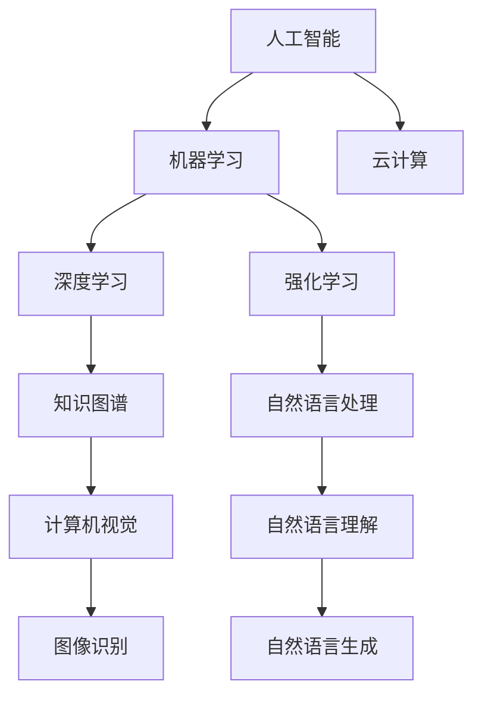

                 

# 知识的误解：常见概念错误及纠正

## 1. 背景介绍

在现代信息技术快速发展的背景下，知识传递和获取方式不断变革。然而，在知识和信息爆炸的浪潮中，人们很容易因为缺乏严谨的逻辑和深度的理解而产生一些常见的误解。特别是在计算机科学和技术领域，由于知识体系庞大、前沿进展迅速，容易导致概念混淆或理解偏差。本文将聚焦于计算机科学和技术领域，具体剖析几个常见概念错误及其纠正方法，帮助读者建立更为准确、全面的认知体系。

## 2. 核心概念与联系

### 2.1 核心概念概述

为了更好地理解这些常见概念错误，首先列出需要澄清的关键概念：

- 人工智能（AI）：指通过计算机程序和算法模拟人类智能的科学技术。
- 机器学习（ML）：一种让计算机从数据中学习规律并自主进行预测或决策的技术。
- 深度学习（DL）：机器学习的一种，利用深层神经网络模型进行复杂数据模式分析。
- 强化学习（RL）：机器学习的一种，通过奖励反馈机制训练智能体以最优策略进行决策。
- 知识图谱（KG）：一种用于结构化表示和查询知识库的技术，能够进行实体、关系和属性的表示和推理。
- 自然语言处理（NLP）：研究计算机如何理解、处理和生成自然语言的技术。
- 计算机视觉（CV）：涉及如何让计算机从图像和视频中提取、处理和理解信息的技术。
- 云计算（Cloud Computing）：通过互联网提供按需计算资源和服务的模式。

### 2.2 核心概念原理和架构的 Mermaid 流程图

由于篇幅限制，无法直接嵌入 Mermaid 流程图，但可以简要描述以下关键流程：



这个流程图展示了人工智能、机器学习和深度学习之间的联系和分支，以及这些技术如何与其他领域如知识图谱、自然语言处理和计算机视觉等融合。

## 3. 核心算法原理 & 具体操作步骤

### 3.1 算法原理概述

本文将深入探讨几个常见算法原理及其具体操作步骤，以期澄清误解。

### 3.2 算法步骤详解

1. **机器学习和深度学习**：
    - 概述：机器学习通过数据驱动的方式，让模型学习输入与输出之间的映射关系。深度学习是机器学习的一个子领域，通过构建深层神经网络，在非线性复杂数据模式上表现优异。
    - 具体操作步骤：
        - 数据准备：收集和预处理数据，确保数据集质量和多样性。
        - 模型构建：选择或设计合适的神经网络架构，并使用随机梯度下降（SGD）等优化算法进行模型训练。
        - 模型评估：在验证集上评估模型性能，选择合适的超参数。
        - 模型应用：将训练好的模型应用于新数据，进行预测或决策。

2. **强化学习**：
    - 概述：强化学习通过智能体在环境中与环境交互，通过奖励反馈机制不断调整策略，以最大化累积奖励为目标。
    - 具体操作步骤：
        - 环境定义：定义环境的状态、动作和奖励函数。
        - 智能体设计：设计智能体的策略和学习算法，如Q-learning、SARSA等。
        - 策略训练：通过与环境的交互，智能体不断调整策略以获得最高奖励。
        - 策略评估：在测试集上评估策略效果，确保策略泛化能力。

3. **知识图谱**：
    - 概述：知识图谱是一种语义化的知识表示方法，通过图结构组织和存储实体、关系和属性，支持高效的查询和推理。
    - 具体操作步骤：
        - 数据收集：从多个数据源中提取知识，构建初始知识库。
        - 图谱构建：使用图算法和规则对知识进行整合和纠错，形成知识图谱。
        - 图谱应用：使用查询语言（如SPARQL）进行知识检索和推理。

4. **自然语言处理**：
    - 概述：自然语言处理通过计算机程序理解、处理和生成自然语言，包括文本分类、信息抽取、机器翻译等。
    - 具体操作步骤：
        - 数据准备：收集和预处理文本数据，确保数据质量和标注准确性。
        - 模型构建：使用Transformer等模型进行文本编码和解码。
        - 模型训练：在标注数据上进行有监督或无监督学习，调整模型参数。
        - 模型评估：在测试集上评估模型效果，选择合适的评价指标。

### 3.3 算法优缺点

**机器学习和深度学习**：
- 优点：可以处理大规模、高维度的数据，适用于复杂模式识别和决策任务。
- 缺点：需要大量标注数据，模型复杂度高，训练时间长，容易过拟合。

**强化学习**：
- 优点：适用于非结构化数据和动态环境，策略优化能力强。
- 缺点：奖励设计困难，训练过程复杂，模型难以解释。

**知识图谱**：
- 优点：结构化表示知识，支持高效查询和推理，易于维护和更新。
- 缺点：构建和维护成本高，对数据源依赖性强，难以处理噪声和模糊信息。

**自然语言处理**：
- 优点：能够处理自然语言数据，应用广泛，如情感分析、文本分类等。
- 缺点：依赖大量标注数据，模型复杂，需要高精度预处理和后处理。

## 4. 数学模型和公式 & 详细讲解 & 举例说明

### 4.1 数学模型构建

以**深度学习**为例，我们介绍常用的数学模型及其构建方法。

- **神经网络**：
    - 模型构建：多层感知器（MLP）、卷积神经网络（CNN）、循环神经网络（RNN）等。
    - 数学模型：$\theta = \mathop{\arg\min}_{\theta} \frac{1}{N}\sum_{i=1}^N L(y_i, f(x_i; \theta))$
        - $y_i$：真实标签
        - $x_i$：输入数据
        - $f(x_i; \theta)$：模型预测输出
        - $L(y_i, f(x_i; \theta))$：损失函数，如交叉熵损失

- **知识图谱**：
    - 模型构建：使用图神经网络（GNN）进行实体关系学习和推理。
    - 数学模型：$g_{\theta}(G, S) = \{e_j | e_j \in E\}$，其中$g_{\theta}$为图神经网络模型，$G$为知识图谱，$S$为节点集合。

### 4.2 公式推导过程

- **深度学习**：
    - 前向传播：$h_{l+1} = \sigma(W_{l+1}h_l + b_{l+1})$
    - 反向传播：$\frac{\partial L}{\partial W_{l+1}} = \frac{\partial L}{\partial h_{l+1}}\frac{\partial h_{l+1}}{\partial W_{l+1}} = \delta_{l+1}W_{l+1}h_l$
    - 参数更新：$W_{l+1} \leftarrow W_{l+1} - \eta \frac{\partial L}{\partial W_{l+1}}$

- **知识图谱**：
    - 图神经网络：$\text{Aggregate}(h_l) = \frac{1}{k}\sum_{i=1}^k g(h_l, h_i)$
    - 实体关系学习：$\hat{R}_{ij} = \sigma(\text{Aggregate}(h_i) \odot \text{Aggregate}(h_j))$
    - 推理：$\text{Reasoning}(H, R, T) = \text{Aggregate}(H) * \text{Aggregate}(T)$

### 4.3 案例分析与讲解

- **深度学习案例**：
    - 问题描述：图像分类任务，给定一张图片，预测其类别。
    - 数据准备：收集和预处理图像数据集，如CIFAR-10、ImageNet等。
    - 模型构建：使用卷积神经网络，加入池化、批归一化等技术。
    - 模型训练：在图像分类数据集上，使用随机梯度下降进行模型训练。
    - 模型评估：在测试集上评估模型准确率、召回率等指标，选择合适模型参数。

- **知识图谱案例**：
    - 问题描述：推荐系统，为用户推荐个性化商品。
    - 数据准备：收集用户行为数据和商品信息，构建知识图谱。
    - 图神经网络构建：使用图卷积网络（GCN）进行实体关系学习。
    - 模型训练：在推荐数据集上，使用图神经网络进行推理，生成推荐结果。
    - 模型评估：在测试集上评估推荐精度和用户体验。

## 5. 项目实践：代码实例和详细解释说明

### 5.1 开发环境搭建

为了更好地进行项目实践，需要准备以下开发环境：

1. **编程语言**：
    - 建议选择Python，并熟悉Numpy、Pandas、Scikit-learn等库。
2. **深度学习框架**：
    - 建议使用TensorFlow、PyTorch等主流深度学习框架。
3. **模型库**：
    - 使用Keras、TensorFlow Model Zoo、PyTorch Hub等开源模型库。

### 5.2 源代码详细实现

以下给出**深度学习**和**知识图谱**的源代码实现示例：

**深度学习代码**：
```python
import tensorflow as tf
from tensorflow.keras import layers, models

# 构建卷积神经网络
model = models.Sequential([
    layers.Conv2D(32, (3, 3), activation='relu', input_shape=(32, 32, 3)),
    layers.MaxPooling2D((2, 2)),
    layers.Conv2D(64, (3, 3), activation='relu'),
    layers.MaxPooling2D((2, 2)),
    layers.Flatten(),
    layers.Dense(10, activation='softmax')
])

# 编译模型
model.compile(optimizer='adam',
              loss='categorical_crossentropy',
              metrics=['accuracy'])

# 训练模型
model.fit(train_images, train_labels, epochs=10, validation_data=(test_images, test_labels))
```

**知识图谱代码**：
```python
import networkx as nx
import igraph

# 构建知识图谱
G = nx.Graph()
G.add_edge('A', 'B')
G.add_edge('B', 'C')
G.add_edge('C', 'A')

# 图神经网络推理
embedding = nx.algorithms.feature_vector.node2vec(G, dim=16, walk_length=2)
result = nx.algorithms.pagerank(G, embedding)

# 输出结果
print(result)
```

### 5.3 代码解读与分析

**深度学习代码**：
- `Sequential`：定义线性堆叠模型结构。
- `Conv2D`：定义卷积层。
- `MaxPooling2D`：定义池化层。
- `Dense`：定义全连接层。
- `compile`：编译模型，设置优化器、损失函数和评估指标。
- `fit`：训练模型，在训练集和验证集上进行迭代优化。

**知识图谱代码**：
- `nx.Graph`：定义有向图结构。
- `add_edge`：添加图边。
- `node2vec`：使用节点嵌入算法计算节点特征向量。
- `pagerank`：使用PageRank算法计算节点重要性。

## 6. 实际应用场景

### 6.1 智能推荐系统

智能推荐系统通过深度学习算法分析用户行为数据，构建用户画像，预测用户偏好，从而提供个性化推荐。应用场景包括电商网站、社交媒体、音乐和视频平台等。

### 6.2 语音识别

语音识别技术通过深度学习算法将语音信号转换为文本，广泛应用于语音助手、电话客服、智能音箱等场景。

### 6.3 图像识别

图像识别技术通过深度学习算法从图像中提取特征，实现目标检测、人脸识别、图像分类等应用，广泛应用于安防监控、自动驾驶、医疗影像分析等领域。

### 6.4 未来应用展望

未来，人工智能技术将进一步融入各个行业，产生更多应用场景，如自动驾驶、工业自动化、智能家居等。

## 7. 工具和资源推荐

### 7.1 学习资源推荐

1. **Coursera**：提供计算机科学和技术领域的高质量课程，涵盖机器学习、深度学习、自然语言处理等。
2. **edX**：提供业界领先的技术课程，如MIT的深度学习课程。
3. **Kaggle**：提供数据科学竞赛平台，通过实际项目学习数据处理和模型训练。
4. **GitHub**：提供开源代码库，学习优秀项目的实现细节和代码优化。

### 7.2 开发工具推荐

1. **Jupyter Notebook**：提供交互式编程环境，方便模型调试和数据可视化。
2. **PyCharm**：提供全功能的IDE，支持深度学习框架和数据分析库。
3. **Google Colab**：提供免费GPU资源，支持协作开发和实时预览。

### 7.3 相关论文推荐

1. **《Deep Learning》**：Ian Goodfellow等著，全面介绍深度学习理论和技术。
2. **《Reinforcement Learning: An Introduction》**：Richard S. Sutton和Andrew G. Barto著，深入讲解强化学习算法。
3. **《Knowledge Graphs for Conceptualization》**：Judea Pearl著，探讨知识图谱在知识表示和推理中的应用。

## 8. 总结：未来发展趋势与挑战

### 8.1 研究成果总结

本文通过深入剖析几个常见概念错误，澄清了人工智能、机器学习、深度学习、强化学习和知识图谱等领域的技术原理，提供了实际应用案例和代码实现，帮助读者建立全面的认知体系。

### 8.2 未来发展趋势

1. **自适应学习**：智能模型能够自适应地调整学习策略，应对不同场景和数据。
2. **跨领域应用**：通过知识图谱等技术，实现跨领域知识融合和应用。
3. **人机协同**：结合强化学习和自然语言处理，构建更加智能的交互系统。
4. **数据驱动**：大数据和分布式计算技术，推动模型训练和推理效率提升。

### 8.3 面临的挑战

1. **数据隐私和安全**：处理敏感数据时，需要确保隐私保护和数据安全。
2. **模型解释性**：建立透明、可解释的模型，避免“黑盒”问题。
3. **计算资源**：大规模深度学习模型需要高效的计算资源支持。
4. **技术落地**：将前沿技术转化为实际应用，面临诸多工程挑战。

### 8.4 研究展望

未来需要进一步研究以下几个方向：
1. **可解释性和透明性**：开发可解释的模型，提升系统的可信任度。
2. **跨模态学习**：研究多模态数据融合技术，提升模型的泛化能力。
3. **对抗攻击和鲁棒性**：设计鲁棒的模型，抵抗恶意攻击。
4. **自监督学习**：利用未标注数据进行模型训练，降低标注成本。

## 9. 附录：常见问题与解答

**Q1：深度学习中的过拟合问题如何解决？**

A：深度学习中的过拟合问题通常通过以下方法解决：
1. 数据增强：扩充训练集，提高模型泛化能力。
2. 正则化：使用L1或L2正则化，限制模型复杂度。
3. Dropout：随机丢弃部分神经元，减少模型冗余。
4. Early Stopping：监控验证集误差，及时停止训练。

**Q2：知识图谱的构建和维护需要注意什么？**

A：知识图谱的构建和维护需要注意以下方面：
1. 数据质量：确保数据准确性和完整性。
2. 实体关系：定义清晰合理的实体关系。
3. 图结构：选择合适的图算法和模型，如GNN。
4. 实时更新：定期更新知识图谱，保持其时效性。

**Q3：如何提高深度学习模型的解释性？**

A：提高深度学习模型的解释性可以通过以下方法：
1. 可视化技术：使用可视化工具，如TensorBoard，展示模型内部结构和推理过程。
2. 特征重要性分析：计算输入特征的重要性，评估模型决策依据。
3. 模型简化：使用简化模型或特征选择方法，提高模型可解释性。

---

作者：禅与计算机程序设计艺术 / Zen and the Art of Computer Programming

