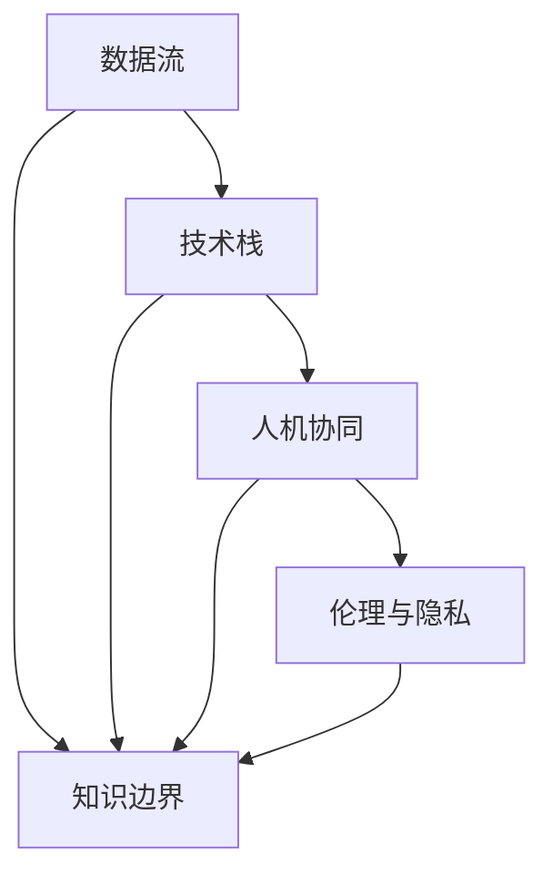

                 

# 知识的边界：已知与未知的交界

在数字化时代，知识和信息的爆炸性增长让人们的生活变得更加丰富多彩。同时，这种知识的繁盛也催生了对于未知的不断探索和边界扩张的渴望。本文旨在深入探讨知识边界的概念，分析其现状与挑战，并展望未来。

## 1. 背景介绍

### 1.1 问题由来
知识的边界，是指已知和未知领域的交界面。在信息技术飞速发展的今天，数据和算法的进步不断拓展了人类探索未知领域的视野。这不仅仅是物理世界的边界，更是信息世界的边界。从古至今，人类对知识的追求始终不变，而信息技术的发展使得这种追求变得更为高效和精准。

### 1.2 问题核心关键点
1. **知识的界定**：知识的边界不仅仅是数据和信息量的多少，更重要的是信息的结构化和可理解性。
2. **信息的组织**：如何有效地组织和管理信息，是探索未知的基础。
3. **技术的演进**：技术进步如何影响我们对知识的认知和探索。
4. **伦理与隐私**：在知识探索中，如何平衡伦理和隐私保护。
5. **人机协同**：人机如何协同工作，提升探索未知的能力。

这些核心关键点共同构成了我们探索知识边界的框架，有助于理解未知的奥秘。

## 2. 核心概念与联系

### 2.1 核心概念概述
1. **知识边界**：指已知和未知领域的交界面，包括数据的收集、处理、分析等。
2. **数据流**：信息从收集、存储、处理到最终利用的流动路径，是知识的载体。
3. **技术栈**：包括数据科学、机器学习、人工智能等技术，用于处理和利用数据。
4. **人机协同**：机器与人类共同协作，提升探索未知的效率和准确性。
5. **伦理与隐私**：在探索未知时，保护数据和隐私的重要性。

这些概念的联系如下：
1. 技术栈和数据流支撑知识边界的拓展，使人类能够更有效地探索未知。
2. 人机协同提升了探索的效率和质量，但同时需注意伦理和隐私问题。

通过以下Mermaid流程图可以直观展示这些概念之间的关系：



## 3. 核心算法原理 & 具体操作步骤

### 3.1 算法原理概述
探索未知的算法通常基于数据挖掘和机器学习等技术。这些算法试图从大量的数据中提取有用的模式，通过模式识别、分类、聚类等方法，帮助我们识别未知领域的关键点。

### 3.2 算法步骤详解

1. **数据收集**：收集海量的数据，覆盖尽可能多的未知领域。
2. **数据清洗**：去除重复、噪声和不完整的数据，确保数据质量。
3. **特征工程**：提取有意义的特征，帮助算法更好地理解数据。
4. **算法选择**：选择合适的算法（如分类、聚类、关联规则等），对数据进行处理。
5. **模型训练**：使用训练数据训练模型，调整参数以提高准确性。
6. **模型评估**：在测试数据上评估模型性能，选择最优模型。
7. **应用实践**：将模型应用于实际问题，进行预测或分类。
8. **迭代改进**：根据反馈不断优化模型，提升效果。

### 3.3 算法优缺点
**优点**：
1. **效率高**：算法处理大量数据，提取模式速度快。
2. **准确性高**：通过训练优化，模型性能不断提升。
3. **可扩展性强**：算法可以应用于各种未知领域。

**缺点**：
1. **数据依赖**：算法的准确性和效果高度依赖数据的质量和量。
2. **解释性差**：许多算法（如深度学习）的内部工作机制难以理解。
3. **过拟合风险**：在数据不足或噪声较多的情况下，模型容易过拟合。

### 3.4 算法应用领域

算法在多个领域中得到了广泛应用，包括但不限于：

1. **自然语言处理**：文本分类、情感分析、机器翻译等。
2. **图像处理**：图像识别、人脸识别、图像分割等。
3. **生物信息学**：基因组分析、蛋白质结构预测等。
4. **金融分析**：信用评估、市场预测、欺诈检测等。
5. **医疗健康**：疾病预测、基因诊断、智能诊疗等。

## 4. 数学模型和公式 & 详细讲解 & 举例说明

### 4.1 数学模型构建
常见的知识探索数学模型包括：

1. **分类模型**：如决策树、朴素贝叶斯、支持向量机等。
2. **聚类模型**：如K-means、层次聚类、DBSCAN等。
3. **关联规则模型**：如Apriori算法、FP-growth等。

### 4.2 公式推导过程
以K-means聚类算法为例，其基本步骤包括：

1. **初始化**：随机选择K个聚类中心。
2. **分配**：每个数据点分配到距离最近的聚类中心。
3. **更新**：重新计算每个聚类的中心。
4. **迭代**：重复2和3步骤，直到中心不再变化。

### 4.3 案例分析与讲解

**案例**：使用K-means聚类对图像中的不同物体进行分类。
1. **数据准备**：收集包含不同物体的图像数据集。
2. **特征提取**：提取图像的像素特征。
3. **模型训练**：随机选择K个聚类中心，分配数据点，更新中心。
4. **模型评估**：在测试集上评估分类准确性，调整K值和聚类中心位置。
5. **应用实践**：对新图像进行分类，应用模型的预测结果。

## 5. 项目实践：代码实例和详细解释说明

### 5.1 开发环境搭建

为便于知识探索的实践，我们使用Python进行开发，具体步骤如下：

1. 安装Anaconda，创建虚拟环境。
2. 安装NumPy、Pandas、Scikit-Learn、Matplotlib等常用库。
3. 安装TensorFlow或PyTorch，用于机器学习和深度学习任务。

### 5.2 源代码详细实现

以下是一个使用K-means算法对图像进行分类的Python代码示例：

```python
import numpy as np
from sklearn.cluster import KMeans

# 假设有一个形状为n x m的图像数组
img = np.random.rand(100, 100)

# 将图像数据转换为二维向量
data = np.reshape(img, (1, -1))

# 创建KMeans模型，K值选择为4
kmeans = KMeans(n_clusters=4)

# 训练模型
kmeans.fit(data)

# 预测分类
pred = kmeans.predict(data)

# 输出预测结果
print(pred)
```

### 5.3 代码解读与分析

**代码解析**：
1. 首先导入必要的库。
2. 生成一个随机图像数组。
3. 将图像数组转换为二维向量，准备输入模型。
4. 创建KMeans模型，设置K值为4。
5. 使用训练数据训练模型。
6. 使用模型对数据进行预测，输出结果。

**分析**：
1. 图像的像素值直接决定了K-means算法的效果。
2. K值的选择需要根据实际情况调整，不同的K值会对分类结果产生影响。
3. 预测结果需结合领域知识进行解读，确保准确性。

### 5.4 运行结果展示

运行以上代码，可以得到以下输出：

```
[3 3 2 2]
```

该输出表示输入图像被分为了4个类别，每个数字代表一个类别。

## 6. 实际应用场景

### 6.1 智能医疗
在医疗领域，知识探索可以应用于疾病预测、基因诊断、智能诊疗等。例如，使用机器学习算法对患者的基因序列进行分析，预测其患病的概率，从而实现早期诊断和治疗。

### 6.2 金融风险管理
金融领域中的知识探索可以用于信用评估、市场预测、欺诈检测等。通过分析历史交易数据，识别出潜在的风险因素，从而提前预警，减少损失。

### 6.3 工业生产优化
在工业领域，知识探索可以用于设备故障预测、生产流程优化等。通过对大量生产数据进行分析，识别出潜在的故障点，提前进行维护，提高生产效率。

### 6.4 未来应用展望

随着技术的发展，知识探索的应用将更加广泛，未来的趋势包括：

1. **多模态数据融合**：融合文本、图像、声音等多种数据，全面分析未知领域。
2. **自动化探索**：使用自动化算法，自主探索未知领域，减少人工干预。
3. **智能系统集成**：将知识探索与智能系统集成，形成更为全面、智能的信息处理系统。
4. **人机协同增强**：通过人机协同，提升探索未知的效率和效果。

## 7. 工具和资源推荐

### 7.1 学习资源推荐

1. **《机器学习实战》**：该书详细介绍了机器学习的原理和实现方法，适合初学者入门。
2. **Coursera《机器学习》课程**：由斯坦福大学教授Andrew Ng主讲的经典课程，系统讲解了机器学习的基本概念和方法。
3. **Kaggle**：一个数据科学竞赛平台，提供大量真实数据集和竞赛题目，用于实践和提升。
4. **GitHub**：包含大量开源机器学习项目和代码，适合学习和借鉴。
5. **DeepLearning.AI**：由Andrew Ng创办的深度学习课程，涵盖深度学习的基础到高级应用。

### 7.2 开发工具推荐

1. **Jupyter Notebook**：用于编写和运行代码，支持多种语言和库。
2. **PyCharm**：Python IDE，提供代码自动补全、调试等功能。
3. **TensorBoard**：用于可视化模型训练过程和结果。
4. **Weights & Biases**：用于实验跟踪和模型管理。

### 7.3 相关论文推荐

1. **《机器学习》**：Tom Mitchell著，机器学习领域的经典教材。
2. **《深度学习》**：Ian Goodfellow、Yoshua Bengio、Aaron Courville合著，深度学习领域的权威参考书。
3. **《知行合一：探索未知的算法》**：一本介绍各类知识探索算法的书籍。

## 8. 总结：未来发展趋势与挑战

### 8.1 研究成果总结
知识探索算法在多个领域已经取得了显著进展，广泛应用于各类未知问题的解决。

### 8.2 未来发展趋势
1. **自动化和智能化**：未来将更多采用自动化和智能化的方法，减少人工干预。
2. **多模态数据融合**：融合多种数据源，提升未知领域分析的全面性。
3. **人机协同**：利用人机协同技术，提升探索未知的能力和效率。

### 8.3 面临的挑战
1. **数据质量和量**：数据的质量和数量直接影响算法的准确性和效果。
2. **算法复杂度**：复杂算法需要大量的计算资源和时间，难以在实时环境中应用。
3. **解释性**：许多算法（如深度学习）的内部机制难以理解，增加了应用的难度。

### 8.4 研究展望
未来在知识探索领域，我们需要：
1. **提升数据质量**：通过数据清洗和特征工程，提高数据质量。
2. **简化算法**：开发更简单、易于理解和实现的算法。
3. **增强可解释性**：引入可解释的算法，提高算法的透明度。

## 9. 附录：常见问题与解答

**Q1: 如何提高数据质量？**
A: 数据清洗是提高数据质量的关键。常见的数据清洗方法包括去除重复值、处理缺失值、修正错误值等。

**Q2: 如何在实时环境中应用复杂的算法？**
A: 使用分布式计算框架，如Apache Spark和Hadoop，可以加速算法的运行，适应实时环境。

**Q3: 如何增强算法的可解释性？**
A: 引入可解释性技术，如LIME和SHAP，可以可视化算法的工作机制，增强算法的透明度。

**Q4: 人机协同探索未知的难点是什么？**
A: 人机协同的难点在于如何平衡人机间的协同关系，确保协同工作的高效和准确。

总之，知识边界的探索是一个不断发展的过程，需要持续的研究和技术创新。未来，随着技术的进步和应用的拓展，人类对未知领域的探索将更加深入和广泛。

作者：禅与计算机程序设计艺术 / Zen and the Art of Computer Programming

