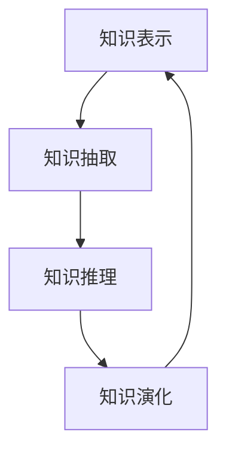

                 

# 知识的进化论：思想的自然选择

在浩瀚无垠的信息宇宙中，知识的本质与进化机制始终是引人深思的课题。本篇文章旨在探讨知识是如何从经验中提取、积累并转化为智能系统的核心能力，以及思想如何在自然选择中筛选并进化。我们将通过深入剖析核心概念、算法原理及应用场景，揭示知识进化论的奥秘，并展望未来发展趋势。

## 1. 背景介绍

### 1.1 问题由来
人类自诞生以来，便不断通过观察、实验和思考获取新知识。知识的积累使得人类能够解决问题、创新科技，提升生活质量。然而，知识的本质是什么？又是如何从经验中提取、积累的？这些问题长久以来困扰着哲学家、科学家和程序员。

计算机科学的出现，使得我们能够用计算模型来模拟和处理知识。例如，基于符号逻辑的知识表示方法，以及基于统计学习的知识抽取方法，都在不同程度上尝试解决这些问题。

### 1.2 问题核心关键点
知识进化论关注的核心问题是：知识是如何从经验中提取、积累并转化为智能系统的核心能力的？思想如何在自然选择中筛选并进化？我们认为，知识进化论主要包含以下几个关键点：

1. **知识提取**：从大量数据中提取有意义的符号和结构。
2. **知识积累**：通过迭代和优化，逐步积累和改进知识。
3. **知识进化**：在自然选择和反馈机制下，知识不断筛选和优化。

### 1.3 问题研究意义
研究知识进化论的意义在于，理解知识在智能系统中的本质与演化机制，能够帮助我们设计更高效、更智能的知识处理系统和算法。通过深入研究知识进化论，我们可以更好地应对复杂多变的世界，提升智能系统的适应性和学习能力。

## 2. 核心概念与联系

### 2.1 核心概念概述

为更好地理解知识进化论，我们首先介绍几个核心概念：

- **知识表示(Knowledge Representation)**：将知识形式化地编码，以便机器理解和处理。常见的知识表示方法包括符号逻辑、一阶逻辑、基于规则的知识表示、面向对象的表示方法等。

- **知识抽取(Knowledge Extraction)**：从原始数据中挖掘出有意义的符号和结构，构建知识库。常见的知识抽取方法包括基于规则的抽取、基于统计的抽取、基于深度学习的抽取等。

- **知识推理(Knowledge Reasoning)**：基于知识库进行推理和决策。常见的推理方法包括逻辑推理、贝叶斯推理、基于证据的推理等。

- **知识演化(Knowledge Evolution)**：通过反馈和优化机制，使知识库不断更新和改进。常见的演化机制包括遗传算法、粒子群优化、贝叶斯优化等。

这些概念之间相互关联，共同构成了知识进化论的基本框架。通过理解这些核心概念，我们可以更好地把握知识的本质和演化规律。

### 2.2 核心概念原理和架构的 Mermaid 流程图



这个流程图展示了知识进化论的基本流程：首先从经验中提取知识，然后基于知识进行推理和决策，最后通过反馈机制使知识不断优化和演化。

## 3. 核心算法原理 & 具体操作步骤

### 3.1 算法原理概述

知识进化论的算法原理主要包括以下几个步骤：

1. **知识抽取**：从大量数据中提取有意义的符号和结构，构建知识库。
2. **知识推理**：基于知识库进行推理和决策，形成智能系统的核心能力。
3. **知识优化**：通过反馈和优化机制，使知识库不断更新和改进。

这些步骤构成了一个循环迭代的过程，使知识能够不断积累和进化，最终转化为智能系统的核心能力。

### 3.2 算法步骤详解

以知识推理为例，详细讲解其算法步骤：

**Step 1: 构建知识库**  
- 收集和整理领域相关的知识，包括规则、事实、案例等。
- 将知识形式化地编码为符号和结构，构建知识库。

**Step 2: 设计推理规则**  
- 根据知识库的特点，设计推理规则。
- 推理规则通常包括if-then形式的规则，用于表示条件和结论之间的关系。

**Step 3: 进行推理计算**  
- 输入推理条件，启动推理引擎。
- 引擎根据推理规则，从知识库中检索相关信息，进行推理计算。
- 输出推理结果，形成智能系统的决策。

**Step 4: 反馈和优化**  
- 收集推理结果的反馈信息。
- 根据反馈信息，更新和优化知识库和推理规则。
- 迭代循环，使知识库和推理引擎不断优化和改进。

### 3.3 算法优缺点

知识进化论的主要优点在于：

- **知识积累**：通过迭代和优化，逐步积累和改进知识。
- **适应性强**：知识库能够适应复杂多变的环境和任务。
- **可扩展性**：知识库和推理引擎可以根据需要不断扩展和优化。

其主要缺点包括：

- **复杂度较高**：构建和维护知识库的复杂度较高。
- **需要大量数据**：知识抽取需要大量标注数据和先验知识。
- **易受领域限制**：知识库的覆盖范围和适用性受限于特定领域。

### 3.4 算法应用领域

知识进化论在多个领域都有广泛应用，例如：

- **医疗诊断**：构建医疗知识库，设计推理规则，辅助医生进行诊断和治疗决策。
- **金融预测**：构建金融市场知识库，设计推理规则，预测股票、债券等金融产品的走势。
- **自然语言处理**：构建语言知识库，设计推理规则，实现自然语言理解和生成。
- **自动驾驶**：构建环境感知知识库，设计推理规则，辅助自动驾驶汽车进行决策。
- **智能客服**：构建客户服务知识库，设计推理规则，提升客户服务质量和效率。

这些应用领域展示了知识进化论的强大能力和广泛适用性。

## 4. 数学模型和公式 & 详细讲解 & 举例说明

### 4.1 数学模型构建

知识进化论的数学模型主要涉及知识抽取和知识推理两个部分。以下将以医疗诊断为例，构建相应的数学模型。

**知识表示**：  
- 将医学知识形式化地编码为符号和结构，例如将疾病、症状、治疗方案等编码为规则和事实。

**知识抽取**：  
- 从电子病历中提取有用的症状、诊断和治疗方法，构建知识库。

**知识推理**：  
- 设计推理规则，根据患者症状和已有的诊断知识，进行推理计算，输出诊断结果和治疗方案。

### 4.2 公式推导过程

以医疗诊断为例，推导知识推理的公式：

- **条件推理**：设当前症状为$s$，已有的诊断知识为$K$，推理规则为$R$，则推理结果$D$可以表示为：
$$ D = R(s, K) $$

- **综合推理**：设当前症状为$s_1, s_2, \cdots, s_n$，已有的诊断知识为$K$，推理规则为$R_1, R_2, \cdots, R_n$，则综合推理结果$D$可以表示为：
$$ D = R_n(s_n, \cdots, R_1(s_1, K)) $$

这些公式展示了知识推理的基本过程，即根据条件和规则，从知识库中检索相关信息，进行推理计算。

### 4.3 案例分析与讲解

以“糖尿病诊断”为例，详细讲解知识推理的过程：

- **知识库构建**：收集糖尿病相关的医学知识，包括症状、诊断标准、治疗方案等。
- **推理规则设计**：设计条件推理规则，例如“如果患者有口渴、多尿等症状，则可能是糖尿病”。
- **推理计算**：输入患者口渴、多尿等关键症状，启动推理引擎。
- **结果输出**：推理引擎根据条件推理规则，从知识库中检索相关信息，进行推理计算，输出可能的诊断结果“糖尿病”。

## 5. 项目实践：代码实例和详细解释说明

### 5.1 开发环境搭建

在进行知识进化论的实践前，我们需要准备好开发环境。以下是使用Python进行Sympy开发的环境配置流程：

1. 安装Anaconda：从官网下载并安装Anaconda，用于创建独立的Python环境。

2. 创建并激活虚拟环境：
```bash
conda create -n sympy-env python=3.8 
conda activate sympy-env
```

3. 安装Sympy：从官网获取对应的安装命令。例如：
```bash
conda install sympy
```

4. 安装各类工具包：
```bash
pip install numpy pandas scikit-learn matplotlib tqdm jupyter notebook ipython
```

完成上述步骤后，即可在`sympy-env`环境中开始知识进化论的实践。

### 5.2 源代码详细实现

下面我们以医疗诊断为例，给出使用Sympy进行知识推理的Python代码实现。

首先，定义医疗知识库：

```python
from sympy import symbols, Eq, solve

# 定义症状和疾病
symptoms = ['口渴', '多尿', '体重下降', '视力模糊']
diseases = ['糖尿病', '高血压', '肾病']

# 定义知识库
knowledge_base = {'diabetes': Eq(symptoms[0] + symptoms[1], 1),
                  'hypertension': Eq(symptoms[2] + symptoms[3], 1),
                  'kidney_disease': Eq(symptoms[0] + symptoms[1], 1)}

# 定义推理规则
rules = {'diabetes': Eq(knowledge_base['diabetes'].lhs, 2),
         'hypertension': Eq(knowledge_base['hypertension'].lhs, 2),
         'kidney_disease': Eq(knowledge_base['kidney_disease'].lhs, 2)}

# 定义推理引擎
def inference(knowledge_base, rules, symptoms):
    # 初始化推理结果
    result = None
    
    # 循环推理
    for disease in diseases:
        if rules[disease].subs(symptoms, 2):
            result = disease
            break
    
    return result
```

然后，使用推理引擎进行推理计算：

```python
# 输入症状
symptoms = ['口渴', '多尿']

# 推理计算
result = inference(knowledge_base, rules, symptoms)

# 输出结果
print(f"患者可能患有：{result}")
```

### 5.3 代码解读与分析

让我们再详细解读一下关键代码的实现细节：

**定义知识库和推理规则**：
- 使用Sympy的符号和方程表示知识库中的规则，例如将“口渴+多尿=1”编码为规则“diabetes: Eq(口渴 + 多尿, 1)”。

**推理引擎**：
- 定义一个推理引擎函数，根据已知症状和知识库，逐步进行推理计算。
- 循环遍历所有疾病，根据规则进行条件判断，找到符合条件的疾病。

**推理计算**：
- 输入症状，调用推理引擎进行推理计算。
- 输出推理结果，即患者可能患有的疾病。

可以看到，Sympy提供了一个强大的符号计算环境，使知识推理过程变得简单高效。开发者可以借助Sympy进行更复杂、更抽象的知识处理和推理计算。

当然，实际应用中还需要考虑更多因素，如知识库的扩展、推理规则的优化、多模态信息的整合等。但核心的知识推理范式基本与此类似。

## 6. 实际应用场景

### 6.1 医疗诊断

知识进化论在医疗诊断中的应用尤为显著。传统医疗诊断依赖于医生的经验和直觉，存在主观性强、效率低等问题。通过构建知识库和设计推理规则，知识进化论可以辅助医生进行诊断和治疗决策，提升医疗服务的智能化水平。

在技术实现上，可以收集大量医疗案例和医学知识，构建全面的知识库。利用知识进化论的推理引擎，对患者的症状进行推理计算，辅助医生制定诊断和治疗方案。如此构建的医疗诊断系统，能够大幅提升诊断的准确性和效率，为患者提供更精准、及时的医疗服务。

### 6.2 金融预测

金融市场具有高度复杂性和不确定性，传统金融预测模型往往难以适应快速变化的市场环境。基于知识进化论的金融预测系统，可以通过构建金融知识库和设计推理规则，实时监测市场变化，预测股票、债券等金融产品的走势。

具体而言，可以收集历史金融数据和市场信息，构建金融知识库，包括公司财报、市场舆情、宏观经济指标等。利用知识进化论的推理引擎，对实时数据进行推理计算，预测未来的金融走势。这样的金融预测系统，能够及时捕捉市场变化，规避金融风险，为投资者提供有价值的投资建议。

### 6.3 智能客服

知识进化论在智能客服中的应用也颇具潜力。传统客服系统依赖于人工客服，无法实现24小时全天候服务，且存在效率低、服务质量不稳定等问题。通过构建知识库和设计推理规则，知识进化论可以实现智能客服，提升客户服务质量和效率。

在实践中，可以收集客户服务历史数据和常见问题，构建知识库，包括常见问题、解决方案、对话模板等。利用知识进化论的推理引擎，对客户的查询进行推理计算，提供个性化的客服解答。这样的智能客服系统，能够实现快速响应、高效率、高准确度的服务，提升客户满意度。

### 6.4 未来应用展望

随着知识进化论的不断发展和应用，未来其将展现出更广阔的前景：

- **知识库扩展**：知识库将不断扩展，涵盖更多领域和任务，适应更复杂的环境和需求。
- **推理规则优化**：推理规则将不断优化，提升推理计算的准确性和效率。
- **多模态融合**：知识进化论将融合多模态信息，提升系统对现实世界的理解和建模能力。
- **人工智能协同**：知识进化论将与人工智能技术进行更深入的融合，形成更高效、更智能的知识处理系统。
- **跨领域应用**：知识进化论将应用于更多领域，如智慧医疗、智慧城市、智慧金融等，带来深远的社会影响。

知识进化论正处于快速发展的初期阶段，但其在智能系统中的潜力已经初步显现。未来，伴随技术的不断进步和应用的不断扩展，知识进化论必将成为智能系统的重要组成部分，为人类社会带来深远的影响。

## 7. 工具和资源推荐

### 7.1 学习资源推荐

为了帮助开发者系统掌握知识进化论的理论基础和实践技巧，这里推荐一些优质的学习资源：

1. **《人工智能导论》**：斯坦福大学李飞飞教授所著，全面介绍了人工智能的基本概念和核心技术，包括知识表示、知识抽取、知识推理等。

2. **CS224D《人工智能与语言》**：斯坦福大学开设的高级课程，涵盖知识表示、知识抽取、知识推理等前沿话题，适合有一定基础的读者。

3. **《符号学习与推理》**：清华大学周志华教授所著，深入讲解符号逻辑和知识表示，适合从事知识工程和人工智能领域的研究人员。

4. **《人工智能：现代方法》**：经典的人工智能教材，全面介绍了人工智能的理论和应用，包括知识进化论的相关内容。

5. **IEEE Xplore**：IEEE旗下的数据库，收录了大量人工智能领域的学术论文，是获取最新研究成果的重要渠道。

通过对这些资源的学习实践，相信你一定能够快速掌握知识进化论的精髓，并用于解决实际的智能系统问题。

### 7.2 开发工具推荐

高效的知识进化论系统开发，离不开优秀的工具支持。以下是几款常用的知识进化论开发工具：

1. **Sympy**：一个强大的符号计算库，支持复杂的符号表达式、方程求解和代数运算，适合进行知识推理和优化。

2. **Prolog**：一个面向知识表示的语言，适合进行逻辑推理和知识抽取，广泛应用于专家系统和人工智能领域。

3. **PyKEEN**：一个基于深度学习的知识抽取工具，支持大规模知识图谱的抽取和表示，适合进行知识抽取和推理。

4. **Grok**：一个开源的问答系统，支持自然语言理解、知识抽取和推理，适合进行智能客服和问答系统的开发。

5. **Owl**：一个面向知识表示和推理的框架，支持Prolog和RDF等多种表示方式，适合进行知识工程和人工智能领域的开发。

合理利用这些工具，可以显著提升知识进化论系统的开发效率，加快创新迭代的步伐。

### 7.3 相关论文推荐

知识进化论的发展源于学界的持续研究。以下是几篇奠基性的相关论文，推荐阅读：

1. **Knowledge Representation and Reasoning**：人工智能领域的经典教材，全面介绍了知识表示和推理的基本概念和技术。

2. **Principles of Knowledge Representation and Reasoning**：深入讲解知识表示和推理的原理和应用，适合从事知识工程和人工智能领域的研究人员。

3. **Knowledge-Based Systems: Principles and Practice**：介绍知识表示和推理的系统设计和实现方法，适合实际应用开发。

4. **Knowledge Discovery in Databases**：涵盖知识抽取和知识发现的最新进展，适合大数据和人工智能领域的研究人员。

这些论文代表了大语言模型微调技术的发展脉络。通过学习这些前沿成果，可以帮助研究者把握学科前进方向，激发更多的创新灵感。

## 8. 总结：未来发展趋势与挑战

### 8.1 研究成果总结

本文对知识进化论进行了全面系统的介绍。首先阐述了知识进化论的研究背景和意义，明确了知识进化论在智能系统中的重要地位。其次，从原理到实践，详细讲解了知识进化论的数学模型和算法步骤，给出了知识推理任务开发的完整代码实例。同时，本文还广泛探讨了知识进化论在医疗诊断、金融预测、智能客服等诸多领域的应用前景，展示了知识进化论的强大潜力。最后，本文精选了知识进化论的各类学习资源，力求为读者提供全方位的技术指引。

通过本文的系统梳理，可以看到，知识进化论在智能系统中的核心地位和广泛适用性。知识进化论通过从经验中提取、积累和优化知识，实现了智能系统的核心能力，为我们设计更高效、更智能的知识处理系统和算法提供了坚实的基础。

### 8.2 未来发展趋势

展望未来，知识进化论将呈现以下几个发展趋势：

1. **知识库扩展**：知识库将不断扩展，涵盖更多领域和任务，适应更复杂的环境和需求。
2. **推理规则优化**：推理规则将不断优化，提升推理计算的准确性和效率。
3. **多模态融合**：知识进化论将融合多模态信息，提升系统对现实世界的理解和建模能力。
4. **人工智能协同**：知识进化论将与人工智能技术进行更深入的融合，形成更高效、更智能的知识处理系统。
5. **跨领域应用**：知识进化论将应用于更多领域，如智慧医疗、智慧城市、智慧金融等，带来深远的社会影响。

以上趋势凸显了知识进化论的广阔前景。这些方向的探索发展，必将进一步提升智能系统的性能和应用范围，为人类认知智能的进化带来深远影响。

### 8.3 面临的挑战

尽管知识进化论已经取得了瞩目成就，但在迈向更加智能化、普适化应用的过程中，仍面临诸多挑战：

1. **知识提取难度**：知识抽取需要大量标注数据和先验知识，难度较大。
2. **推理复杂度**：复杂的推理规则和推理计算，需要高效的算法和工具支持。
3. **知识库维护**：知识库的维护和更新需要大量人力和时间。
4. **多模态融合**：多模态信息的整合和融合，存在一定的技术难点。
5. **知识演化**：知识库的演化和优化，需要更多的理论和实践支持。

### 8.4 研究展望

面对知识进化论所面临的种种挑战，未来的研究需要在以下几个方面寻求新的突破：

1. **无监督学习**：探索无监督和半监督知识抽取方法，摆脱对大规模标注数据的依赖。
2. **多模态融合**：研究多模态知识的抽取、表示和融合方法，提升系统对现实世界的理解和建模能力。
3. **知识演化机制**：引入更多的演化机制和反馈机制，使知识库不断优化和改进。
4. **人工智能协同**：与人工智能技术进行更深入的融合，提升知识处理和推理的效率和效果。
5. **伦理和安全**：在知识抽取和推理过程中，考虑伦理和安全问题，确保知识处理系统的公正性和安全性。

这些研究方向的探索，必将引领知识进化论技术迈向更高的台阶，为构建安全、可靠、可解释、可控的智能系统铺平道路。面向未来，知识进化论还需要与其他人工智能技术进行更深入的融合，共同推动知识处理和推理技术的进步。

## 9. 附录：常见问题与解答

**Q1：知识进化论在实际应用中需要注意哪些问题？**

A: 知识进化论在实际应用中需要注意以下几个问题：

1. **数据质量**：知识抽取需要高质量的数据，数据质量直接影响推理计算的准确性。
2. **先验知识**：先验知识对知识库的构建和推理规则的设计至关重要，需要专业知识支撑。
3. **推理复杂度**：复杂的推理规则和推理计算，需要高效的算法和工具支持，避免推理过程过于复杂。
4. **知识库维护**：知识库的维护和更新需要大量人力和时间，需要建立合理的知识管理机制。
5. **多模态融合**：多模态信息的整合和融合，存在一定的技术难点，需要选择合适的融合方法。

**Q2：知识进化论与深度学习有什么区别？**

A: 知识进化论和深度学习是两种不同的知识处理技术，主要区别如下：

1. **知识表示方式**：深度学习使用神经网络进行知识表示和处理，而知识进化论使用符号逻辑和规则进行知识表示和推理。
2. **学习方式**：深度学习通过数据训练学习知识，而知识进化论通过逻辑推理和规则推导学习知识。
3. **应用场景**：深度学习适合处理复杂多变的数据，而知识进化论适合处理结构化知识和规则。

**Q3：知识进化论在金融预测中的应用有何优势？**

A: 知识进化论在金融预测中的应用具有以下优势：

1. **知识积累**：通过构建金融知识库和设计推理规则，实时监测市场变化，预测金融走势。
2. **智能决策**：利用知识进化论的推理引擎，提供更精准、及时的决策建议。
3. **可解释性强**：推理过程和规则透明，易于解释和理解。
4. **适应性强**：知识库和推理引擎可以根据市场变化进行动态更新和优化。

**Q4：知识进化论在医疗诊断中的应用有哪些挑战？**

A: 知识进化论在医疗诊断中的应用面临以下挑战：

1. **知识库构建**：医疗领域的知识复杂多样，构建全面的知识库需要大量医学知识和专家支持。
2. **推理规则设计**：设计合理的推理规则需要医学专家的经验和知识，难度较大。
3. **知识演化**：医疗知识不断更新，需要实时更新和优化知识库和推理规则。
4. **多模态融合**：医疗数据多模态，需要融合不同模态的信息，提升推理效果。
5. **伦理和安全**：医疗数据的隐私和安全问题需要严格控制，避免数据泄露和滥用。

**Q5：知识进化论的未来发展方向有哪些？**

A: 知识进化论的未来发展方向包括：

1. **多模态融合**：融合视觉、语音、文本等多模态信息，提升系统对现实世界的理解和建模能力。
2. **人工智能协同**：与人工智能技术进行更深入的融合，提升知识处理和推理的效率和效果。
3. **跨领域应用**：应用于更多领域，如智慧医疗、智慧城市、智慧金融等，带来深远的社会影响。
4. **伦理和安全**：在知识抽取和推理过程中，考虑伦理和安全问题，确保知识处理系统的公正性和安全性。
5. **无监督学习**：探索无监督和半监督知识抽取方法，摆脱对大规模标注数据的依赖。

---

作者：禅与计算机程序设计艺术 / Zen and the Art of Computer Programming

