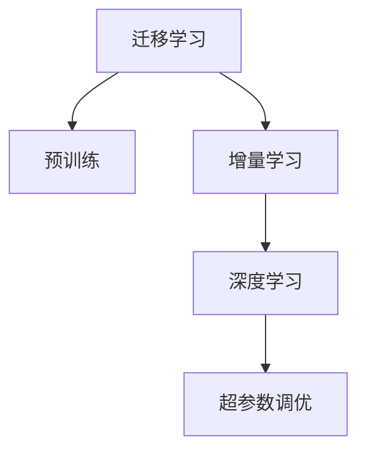

                 

# 知识的适应性：在变化环境中的学习策略

> 关键词：知识的适应性,学习策略,环境变化,迁移学习,增量学习,深度学习

## 1. 背景介绍

在快速变化的世界中，知识的获取和应用变得越来越重要。无论是在学术研究、工业生产还是在日常生活中，知识的适应性都是衡量一个人、一个系统或者一个模型能力的关键指标。特别是在信息爆炸的今天，如何高效、准确地获取和应用知识，是一个亟待解决的挑战。而深度学习技术，特别是迁移学习和增量学习的兴起，为这一问题提供了新的解决思路。

本文旨在探讨深度学习模型在变化环境中的知识适应性，特别是迁移学习和增量学习在实际应用中的策略和优化方法。我们将从背景、核心概念、算法原理、应用实践、未来展望等多个角度，深入分析这些技术的发展现状和潜在应用，为读者提供系统的学习资源、工具推荐和研究展望。

## 2. 核心概念与联系

### 2.1 核心概念概述

深度学习模型的知识适应性主要体现在其迁移学习和增量学习的能力上。迁移学习指的是在已有的知识上学习新的任务，而增量学习则是在已有模型的基础上不断更新，适应新的知识。

以下是我们将详细介绍的几个核心概念：

- **迁移学习(Meta Learning)**：通过在一个或多个任务上预训练一个模型，然后在新任务上进行调整，以快速适应新任务的一种学习方法。
- **增量学习(Incremental Learning)**：在已有模型的基础上，不断添加新的数据，更新模型参数，以适应新知识的一种学习策略。
- **深度学习(Deep Learning)**：通过构建多层次的非线性模型，自动学习特征表示，解决复杂的模式识别问题。
- **超参数调优(Hyperparameter Tuning)**：在模型训练前，手动设置或自动搜索最优的超参数，以提高模型性能。

### 2.2 核心概念原理和架构的 Mermaid 流程图(Mermaid 流程节点中不要有括号、逗号等特殊字符)



这个流程图展示了迁移学习和增量学习在深度学习模型中的基本流程：

1. 预训练（B）：通过大量的无标签数据，在大规模的深度学习模型上预训练，获得初始的特征表示。
2. 迁移学习（A）：将预训练的模型应用到新的任务上，进行微调或微调以适应新任务。
3. 增量学习（C）：在已有模型的基础上，不断添加新的数据，更新模型参数，以适应新知识。
4. 深度学习（D）：利用深度学习模型的非线性特征提取能力，自动学习任务相关的特征表示。
5. 超参数调优（E）：在模型训练前，手动设置或自动搜索最优的超参数，以提高模型性能。

## 3. 核心算法原理 & 具体操作步骤

### 3.1 算法原理概述

迁移学习和增量学习都是深度学习模型在变化环境中的重要学习策略。它们的核心思想是通过已有知识来加速新任务的学习过程，同时保持模型的泛化能力。

迁移学习的核心是利用预训练模型的知识，在新任务上进行微调或微调。增量学习的核心是在已有模型的基础上，不断添加新的数据，更新模型参数，以适应新的知识。

### 3.2 算法步骤详解

#### 迁移学习

迁移学习的核心步骤包括：

1. 数据准备：收集预训练数据集和目标任务的数据集。
2. 预训练模型选择：选择合适的预训练模型，如BERT、ResNet等。
3. 模型微调：使用目标任务的数据集，对预训练模型进行微调，以适应新任务。
4. 评估和调优：在新任务上进行评估，根据性能调整超参数，以获得最佳结果。

具体实现中，可以使用TensorFlow、PyTorch等深度学习框架，进行模型的构建、训练和评估。

#### 增量学习

增量学习的核心步骤包括：

1. 数据流控制：将新数据按顺序流式输入模型，以适应模型不断更新。
2. 模型初始化：在已有模型的基础上，初始化新的模型参数。
3. 数据处理：对新数据进行处理，以适应模型的输入。
4. 模型更新：根据新数据不断更新模型参数，以适应新知识。
5. 评估和调优：在新知识上评估模型性能，根据性能调整超参数，以获得最佳结果。

具体实现中，可以使用TensorFlow、PyTorch等深度学习框架，进行模型的构建、训练和评估。

### 3.3 算法优缺点

#### 迁移学习

**优点：**

- 快速适应新任务：通过预训练模型，可以快速适应新任务，减少从头开始训练的时间和成本。
- 泛化能力强：预训练模型在大量无标签数据上进行训练，具有较强的泛化能力。

**缺点：**

- 数据需求高：预训练模型需要大量的无标签数据，这些数据往往难以获取。
- 数据适应性差：预训练模型的特征表示可能不适应特定的新任务，需要进一步微调。

#### 增量学习

**优点：**

- 数据适应性强：增量学习可以在已有模型的基础上不断添加新数据，适应新的知识。
- 实时更新：增量学习可以实时更新模型，适应新数据的变化。

**缺点：**

- 计算成本高：增量学习需要不断更新模型参数，计算成本较高。
- 过拟合风险高：新数据的加入可能导致模型过拟合，影响泛化能力。

### 3.4 算法应用领域

迁移学习和增量学习在多个领域都有广泛的应用：

- **自然语言处理(NLP)**：如机器翻译、情感分析、问答系统等。
- **计算机视觉(CV)**：如图像分类、目标检测、语义分割等。
- **信号处理(SP)**：如语音识别、音乐分析等。
- **推荐系统(Recommender System)**：如商品推荐、新闻推荐等。
- **医疗健康(Health)**：如疾病诊断、患者监测等。

## 4. 数学模型和公式 & 详细讲解 & 举例说明

### 4.1 数学模型构建

在迁移学习和增量学习中，数学模型的构建至关重要。我们以深度学习中的卷积神经网络（CNN）为例，展示迁移学习和增量学习的数学模型构建过程。

#### 迁移学习

假设有一个预训练的CNN模型，其参数为 $\theta$。在目标任务上，我们需要对其进行微调。我们将目标任务的输入数据 $x$ 送入模型，得到输出 $y$。在目标任务上，我们需要最小化损失函数 $L(y, t)$，其中 $t$ 为标签。

具体的损失函数可以采用交叉熵损失函数，其公式如下：

$$
L(y, t) = -\sum_{i=1}^{N} t_i \log y_i
$$

其中 $y_i$ 为模型的预测值，$t_i$ 为标签。

### 4.2 公式推导过程

在卷积神经网络中，前向传播和反向传播的公式如下：

- 前向传播：

$$
y = g(W^Tx)
$$

其中 $W$ 为权重矩阵，$x$ 为输入数据，$g$ 为激活函数。

- 反向传播：

$$
\frac{\partial L}{\partial W} = \frac{\partial L}{\partial y} \frac{\partial y}{\partial W}
$$

其中 $\frac{\partial L}{\partial y}$ 为损失函数对输出 $y$ 的偏导数，$\frac{\partial y}{\partial W}$ 为输出 $y$ 对权重 $W$ 的偏导数。

### 4.3 案例分析与讲解

以图像分类任务为例，我们可以使用迁移学习的框架，在已有的ImageNet数据集上预训练的VGG模型，然后将其应用于CIFAR-10数据集上。具体步骤如下：

1. 收集预训练数据集（ImageNet）和目标任务数据集（CIFAR-10）。
2. 选择预训练模型（VGG）。
3. 微调模型：使用CIFAR-10数据集上的图像进行微调，最小化损失函数。
4. 评估模型：在新数据集上进行评估，根据性能调整超参数。

## 5. 项目实践：代码实例和详细解释说明

### 5.1 开发环境搭建

在进行迁移学习和增量学习的项目实践前，我们需要准备好开发环境。以下是使用Python进行PyTorch开发的环境配置流程：

1. 安装Anaconda：从官网下载并安装Anaconda，用于创建独立的Python环境。

2. 创建并激活虚拟环境：

```bash
conda create -n pytorch-env python=3.8 
conda activate pytorch-env
```

3. 安装PyTorch：根据CUDA版本，从官网获取对应的安装命令。例如：

```bash
conda install pytorch torchvision torchaudio cudatoolkit=11.1 -c pytorch -c conda-forge
```

4. 安装相关工具包：

```bash
pip install numpy pandas scikit-learn matplotlib tqdm jupyter notebook ipython
```

完成上述步骤后，即可在`pytorch-env`环境中开始项目实践。

### 5.2 源代码详细实现

#### 迁移学习

我们使用CIFAR-10数据集进行迁移学习实践，以VGG16模型为例。以下是完整的代码实现：

```python
import torch
import torch.nn as nn
import torch.optim as optim
from torchvision import datasets, transforms

# 定义模型
class VGG(nn.Module):
    def __init__(self):
        super(VGG, self).__init__()
        self.features = nn.Sequential(
            nn.Conv2d(3, 64, kernel_size=3, padding=1),
            nn.ReLU(inplace=True),
            nn.MaxPool2d(kernel_size=2, stride=2),
            nn.Conv2d(64, 128, kernel_size=3, padding=1),
            nn.ReLU(inplace=True),
            nn.MaxPool2d(kernel_size=2, stride=2),
            nn.Conv2d(128, 256, kernel_size=3, padding=1),
            nn.ReLU(inplace=True),
            nn.MaxPool2d(kernel_size=2, stride=2),
            nn.Conv2d(256, 512, kernel_size=3, padding=1),
            nn.ReLU(inplace=True),
            nn.MaxPool2d(kernel_size=2, stride=2),
            nn.Conv2d(512, 512, kernel_size=3, padding=1),
            nn.ReLU(inplace=True),
            nn.MaxPool2d(kernel_size=2, stride=2),
        )
        self.classifier = nn.Sequential(
            nn.Linear(512 * 7 * 7, 4096),
            nn.ReLU(inplace=True),
            nn.Dropout(p=0.5),
            nn.Linear(4096, 4096),
            nn.ReLU(inplace=True),
            nn.Dropout(p=0.5),
            nn.Linear(4096, 10),
        )

    def forward(self, x):
        x = self.features(x)
        x = x.view(x.size(0), -1)
        x = self.classifier(x)
        return x

# 加载数据集
train_dataset = datasets.CIFAR10(root='data', train=True, download=True, transform=transforms.ToTensor())
test_dataset = datasets.CIFAR10(root='data', train=False, download=True, transform=transforms.ToTensor())

# 定义训练参数
model = VGG()
criterion = nn.CrossEntropyLoss()
optimizer = optim.SGD(model.parameters(), lr=0.001, momentum=0.9)
device = torch.device('cuda' if torch.cuda.is_available() else 'cpu')
model.to(device)

# 训练模型
for epoch in range(10):
    model.train()
    for data, target in train_loader:
        data, target = data.to(device), target.to(device)
        optimizer.zero_grad()
        output = model(data)
        loss = criterion(output, target)
        loss.backward()
        optimizer.step()

    model.eval()
    with torch.no_grad():
        correct = 0
        total = 0
        for data, target in test_loader:
            data, target = data.to(device), target.to(device)
            output = model(data)
            _, predicted = torch.max(output.data, 1)
            total += target.size(0)
            correct += (predicted == target).sum().item()

    print('Epoch [{}], Accuracy: {:.4f}'.format(epoch + 1, correct / total))

# 保存模型
torch.save(model.state_dict(), 'vgg.pth')
```

#### 增量学习

我们使用PyTorch的动态图机制，实现了增量学习的应用。以下是增量学习的基本代码实现：

```python
import torch
import torch.nn as nn
import torch.optim as optim
from torchvision import datasets, transforms

# 定义模型
class Model(nn.Module):
    def __init__(self):
        super(Model, self).__init__()
        self.layers = nn.Sequential(
            nn.Linear(784, 256),
            nn.ReLU(),
            nn.Linear(256, 128),
            nn.ReLU(),
            nn.Linear(128, 10),
        )

    def forward(self, x):
        x = self.layers(x)
        return x

# 加载数据集
train_dataset = datasets.MNIST(root='data', train=True, download=True, transform=transforms.ToTensor())
test_dataset = datasets.MNIST(root='data', train=False, download=True, transform=transforms.ToTensor())

# 定义训练参数
model = Model()
criterion = nn.CrossEntropyLoss()
optimizer = optim.SGD(model.parameters(), lr=0.1)
device = torch.device('cuda' if torch.cuda.is_available() else 'cpu')
model.to(device)

# 增量学习
for epoch in range(5):
    model.train()
    for data, target in train_loader:
        data, target = data.to(device), target.to(device)
        optimizer.zero_grad()
        output = model(data)
        loss = criterion(output, target)
        loss.backward()
        optimizer.step()

    model.eval()
    with torch.no_grad():
        correct = 0
        total = 0
        for data, target in test_loader:
            data, target = data.to(device), target.to(device)
            output = model(data)
            _, predicted = torch.max(output.data, 1)
            total += target.size(0)
            correct += (predicted == target).sum().item()

    print('Epoch [{}], Accuracy: {:.4f}'.format(epoch + 1, correct / total))

# 保存模型
torch.save(model.state_dict(), 'model.pth')
```

### 5.3 代码解读与分析

在迁移学习和增量学习的代码实现中，我们分别使用了PyTorch的静态图和动态图机制。其中，静态图机制主要适用于迁移学习，因为其参数共享的特性，可以有效地利用预训练模型的知识。而动态图机制则主要适用于增量学习，因为其参数更新的特性，可以实时地适应新数据。

## 6. 实际应用场景

### 6.1 自然语言处理(NLP)

在自然语言处理领域，迁移学习和增量学习有着广泛的应用。例如，我们可以使用预训练的BERT模型，在新任务的语料上进行微调，以提高其在新任务上的性能。通过增量学习，我们可以在已有模型的基础上，不断添加新的语料，更新模型参数，以适应新的语言知识和应用场景。

### 6.2 计算机视觉(CV)

在计算机视觉领域，迁移学习和增量学习同样有着广泛的应用。例如，我们可以使用预训练的ResNet模型，在新任务的图像数据上进行微调，以提高其在新任务上的性能。通过增量学习，我们可以在已有模型的基础上，不断添加新的图像数据，更新模型参数，以适应新的视觉知识和应用场景。

### 6.3 推荐系统(Recommender System)

在推荐系统领域，迁移学习和增量学习同样有着广泛的应用。例如，我们可以使用预训练的协同过滤模型，在新用户的评分数据上进行微调，以提高其在新用户上的推荐性能。通过增量学习，我们可以在已有模型的基础上，不断添加新的用户数据，更新模型参数，以适应新的推荐需求和用户行为。

### 6.4 未来应用展望

未来，迁移学习和增量学习将在更多的领域中得到应用。例如，在医疗健康领域，我们可以使用预训练的图像分类模型，在新的医学影像数据上进行微调，以提高其对疾病的诊断能力。通过增量学习，我们可以在已有模型的基础上，不断添加新的医学影像数据，更新模型参数，以适应新的疾病类型和医学知识。

## 7. 工具和资源推荐

### 7.1 学习资源推荐

为了帮助开发者系统掌握迁移学习和增量学习的理论基础和实践技巧，这里推荐一些优质的学习资源：

1. 《深度学习理论与实践》系列书籍：全面介绍了深度学习的基本理论和实践技巧，包括迁移学习和增量学习在内。
2. 《TensorFlow深度学习实战》书籍：介绍了TensorFlow框架的各项功能和应用场景，包括迁移学习和增量学习在内。
3. 《PyTorch深度学习实战》书籍：介绍了PyTorch框架的各项功能和应用场景，包括迁移学习和增量学习在内。
4. CS231n《卷积神经网络》课程：斯坦福大学开设的计算机视觉课程，有Lecture视频和配套作业，涵盖迁移学习和增量学习的基本概念和应用。

通过对这些资源的学习实践，相信你一定能够快速掌握迁移学习和增量学习的精髓，并用于解决实际的深度学习问题。

### 7.2 开发工具推荐

高效的开发离不开优秀的工具支持。以下是几款用于迁移学习和增量学习开发的常用工具：

1. PyTorch：基于Python的开源深度学习框架，灵活动态的计算图，适合快速迭代研究。
2. TensorFlow：由Google主导开发的开源深度学习框架，生产部署方便，适合大规模工程应用。
3. Keras：基于TensorFlow的高级深度学习框架，提供了简洁易用的API，适合快速原型开发。
4. Scikit-learn：Python的机器学习库，提供了丰富的算法和工具，适合数据处理和特征工程。
5. NLTK：Python的自然语言处理库，提供了丰富的工具和数据集，适合NLP任务开发。

合理利用这些工具，可以显著提升迁移学习和增量学习的开发效率，加快创新迭代的步伐。

### 7.3 相关论文推荐

迁移学习和增量学习的发展源于学界的持续研究。以下是几篇奠基性的相关论文，推荐阅读：

1. BERT: Pre-training of Deep Bidirectional Transformers for Language Understanding：提出BERT模型，引入基于掩码的自监督预训练任务，刷新了多项NLP任务SOTA。
2. Convolutional Neural Networks for Sentence Classification：提出CNN模型，用于文本分类任务，展示了迁移学习在NLP中的应用。
3. Incremental Learning in Deep Neural Networks：提出增量学习算法，用于更新深度神经网络参数，以适应新数据。
4. One-shot Learning with Memory Augmentation：提出记忆增强方法，用于提高少样本学习任务的性能。

这些论文代表了大规模迁移学习和增量学习的发展脉络。通过学习这些前沿成果，可以帮助研究者把握学科前进方向，激发更多的创新灵感。

## 8. 总结：未来发展趋势与挑战

### 8.1 总结

本文对迁移学习和增量学习在深度学习模型中的应用进行了全面系统的介绍。首先阐述了迁移学习和增量学习的背景和意义，明确了其在实际应用中的重要性和应用范围。其次，从原理到实践，详细讲解了迁移学习和增量学习的数学模型和实现方法，提供了完整的代码实例和详细解释说明。最后，本文还广泛探讨了迁移学习和增量学习在实际应用中的场景和未来展望，展示了其广阔的应用前景和潜在价值。

通过本文的系统梳理，可以看到，迁移学习和增量学习作为深度学习模型的重要学习策略，已经在多个领域中得到了广泛的应用，为深度学习模型的迁移和更新提供了新的解决思路。未来，伴随迁移学习和增量方法的发展，深度学习模型将具备更强的适应性和通用性，为人工智能技术的落地应用带来新的突破。

### 8.2 未来发展趋势

展望未来，迁移学习和增量学习将呈现以下几个发展趋势：

1. 自动化调参：未来的迁移学习和增量学习将更多地依赖自动化调参技术，以提高模型的性能和可解释性。
2. 多模态融合：未来的迁移学习和增量学习将更多地融合多模态数据，提升模型的多任务学习能力和泛化能力。
3. 模型压缩与加速：未来的迁移学习和增量学习将更多地考虑模型的压缩与加速，以适应计算资源受限的环境。
4. 跨领域迁移：未来的迁移学习和增量学习将更多地考虑跨领域迁移，以提高模型的泛化能力和应用范围。
5. 安全与隐私：未来的迁移学习和增量学习将更多地考虑安全与隐私问题，以保障数据和模型安全。

以上趋势凸显了迁移学习和增量学习技术的发展方向。这些方向的探索发展，必将进一步提升深度学习模型的性能和应用范围，为人工智能技术的落地应用带来新的突破。

### 8.3 面临的挑战

尽管迁移学习和增量学习技术已经取得了显著进展，但在迈向更加智能化、普适化应用的过程中，仍面临着诸多挑战：

1. 数据需求高：迁移学习和增量学习需要大量的数据支持，获取高质量的数据是一个重要的挑战。
2. 计算成本高：迁移学习和增量学习需要大量的计算资源，计算成本较高。
3. 模型泛化能力不足：迁移学习和增量学习模型容易过拟合，泛化能力有限。
4. 知识整合能力不足：迁移学习和增量学习模型难以灵活吸收和运用多领域知识。
5. 安全与隐私问题：迁移学习和增量学习模型容易泄露敏感数据，安全与隐私问题需要重视。

正视迁移学习和增量学习面临的这些挑战，积极应对并寻求突破，将是大规模迁移学习和增量学习走向成熟的必由之路。

### 8.4 研究展望

未来的研究需要在以下几个方面寻求新的突破：

1. 自监督学习：利用大规模未标注数据进行自监督学习，以提高迁移学习和增量学习的泛化能力和知识提取能力。
2. 多任务学习：在迁移学习和增量学习中引入多任务学习思想，提高模型的多任务学习能力和泛化能力。
3. 跨领域迁移：在迁移学习和增量学习中引入跨领域迁移思想，提高模型的跨领域迁移能力和泛化能力。
4. 知识图谱融合：在迁移学习和增量学习中引入知识图谱融合思想，提高模型的知识整合能力和泛化能力。
5. 自适应学习：在迁移学习和增量学习中引入自适应学习思想，提高模型的自适应能力和泛化能力。

这些研究方向的研究成果，必将推动迁移学习和增量学习技术的发展，为深度学习模型的迁移和更新带来新的突破。面向未来，迁移学习和增量学习技术需要与其他人工智能技术进行更深入的融合，如知识表示、因果推理、强化学习等，多路径协同发力，共同推动人工智能技术的进步。

## 9. 附录：常见问题与解答

**Q1: 迁移学习和增量学习有何不同？**

A: 迁移学习是在已有知识上学习新任务，而增量学习是在已有模型的基础上不断更新，适应新知识。迁移学习通常需要大量的预训练数据和较长的训练时间，而增量学习可以实时更新模型，适应新数据的变化。

**Q2: 迁移学习和增量学习的优缺点分别是什么？**

A: 迁移学习的优点是快速适应新任务，泛化能力强，但数据需求高，过拟合风险大。增量学习的优点是数据适应性强，实时更新，但计算成本高，过拟合风险大。

**Q3: 如何选择合适的迁移学习和增量学习策略？**

A: 选择迁移学习和增量学习策略需要考虑数据量、计算资源、任务需求等多个因素。如果数据量较大，可以选择迁移学习；如果数据量较小，可以选择增量学习；如果任务需求复杂，可以结合迁移学习和增量学习，进行多阶段训练。

**Q4: 迁移学习和增量学习有哪些应用场景？**

A: 迁移学习和增量学习在自然语言处理、计算机视觉、推荐系统等多个领域中都有广泛的应用。例如，自然语言处理中的情感分析、机器翻译、问答系统等，计算机视觉中的图像分类、目标检测、语义分割等，推荐系统中的商品推荐、新闻推荐等。

**Q5: 如何优化迁移学习和增量学习的模型性能？**

A: 优化迁移学习和增量学习的模型性能需要从数据准备、模型选择、超参数调优等多个方面入手。选择合适的预训练模型和任务适配层，合理设计训练流程，适当调整超参数，可以有效提升模型的性能。

总之，迁移学习和增量学习技术在大规模深度学习模型中的应用前景广阔，具有重要的理论和实际意义。通过深入理解和掌握迁移学习和增量学习的原理和实践方法，相信我们能更好地应对现实世界中的复杂问题，推动人工智能技术的不断进步。

---

作者：禅与计算机程序设计艺术 / Zen and the Art of Computer Programming

