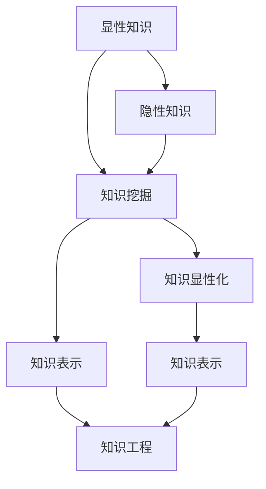

                 

# 知识的隐性与显性：挖掘潜在智慧

## 1. 背景介绍

### 1.1 问题由来

在当今数字化时代，知识无处不在。无论是庞大的数据库、互联网上海量的信息，还是日常生活中的点滴经验，都是知识的源泉。然而，这些知识并不总是显性的，它们常常以隐性的形式存在，深藏于文字、数据、经验之中。如何有效地挖掘这些潜在的智慧，成为许多研究者关注的焦点。

### 1.2 问题核心关键点

在知识挖掘的过程中，最关键的是理解知识的隐性与显性之间的转换。显性知识易于记录、传播和应用，而隐性知识则隐藏在个人经验、直觉、创造性思维中，难以形式化和系统化。如何将隐性知识显性化，进而转化为可被机器理解和利用的形式，是知识挖掘的核心问题。

### 1.3 问题研究意义

研究知识的隐性与显性，对于提升人类对知识的理解与应用能力，推动人工智能技术的进步，具有重要意义：

1. **提升知识应用效率**：显性化隐性知识，使其成为机器可利用的信息，能够大大提升知识的传播与利用效率。
2. **促进技术创新**：通过理解隐性知识的结构，可以启发新的技术思路，加速技术创新进程。
3. **推动社会进步**：更好地挖掘和利用社会知识，有助于促进教育、医疗、科研等领域的进步。
4. **增强人工智能**：将隐性知识显性化，有助于增强AI模型的理解力和决策能力，提升其在复杂场景下的表现。

## 2. 核心概念与联系

### 2.1 核心概念概述

为了更好地理解知识的隐性与显性之间的转换，本节将介绍几个核心概念：

- **显性知识**（Explicit Knowledge）：易于记录、传递和共享的知识，通常以书面文字、数据报表、操作手册等形式存在。
- **隐性知识**（Tacit Knowledge）：蕴含在个人经验、直觉、创造性思维中的知识，难以用语言、文字直接表达。
- **知识挖掘**（Knowledge Mining）：从大量的数据、文献、经验中提取有价值的信息，转化为显性知识的过程。
- **知识表示**（Knowledge Representation）：将知识以结构化的形式存储和表达，便于机器理解和处理。
- **知识工程**（Knowledge Engineering）：将知识工程化、系统化的过程，包括知识获取、知识表示、知识推理等环节。

这些概念之间的联系可以通过以下Mermaid流程图来展示：



这个流程图展示了大规模知识挖掘的过程：首先，将隐性知识显性化，然后通过知识挖掘获取有价值的信息，将其转化为知识表示，最终通过知识工程进行系统化处理和应用。

## 3. 核心算法原理 & 具体操作步骤

### 3.1 算法原理概述

知识的显性化主要通过知识挖掘算法实现。该过程通常包括以下几个步骤：

1. **数据收集**：从不同来源收集大量相关数据，包括文本、图像、音频等。
2. **预处理**：清洗、去噪、格式化数据，使其适合进行后续处理。
3. **特征提取**：从数据中提取有意义的特征，如文本中的关键词、句法结构、语义信息等。
4. **模型训练**：使用机器学习模型对提取的特征进行训练，挖掘其中的隐性知识。
5. **知识显性化**：将模型学到的知识表示为显性形式，如结构化的知识库、知识图谱等。

### 3.2 算法步骤详解

下面将详细介绍知识挖掘的各个步骤及其具体操作：

#### 3.2.1 数据收集

数据收集是知识挖掘的第一步，也是最关键的一步。需要根据具体任务需求，确定数据来源和类型。常用的数据源包括：

- **文献数据库**：如Google Scholar、PubMed等，包含大量学术论文、研究报告。
- **公开数据集**：如Kaggle、UCI等，提供各种类型的数据集，如医疗数据、社交媒体数据、金融数据等。
- **企业内部数据**：如销售记录、客户反馈、操作日志等，直接来源于企业运营过程。
- **网络爬虫**：通过爬虫技术自动抓取网页、论坛等互联网资源，获取文本、图像等数据。

#### 3.2.2 数据预处理

数据预处理包括数据清洗、数据标注、数据归一化等步骤，目的是使数据适合进行后续处理。

- **数据清洗**：去除噪声数据、缺失值、重复数据等。
- **数据标注**：对数据进行分类、标记，使其有明确的含义。
- **数据归一化**：对不同类型的数据进行标准化处理，使其具有相同的量纲。

#### 3.2.3 特征提取

特征提取是从数据中提取有意义的特征，用于训练模型。常用的特征提取方法包括：

- **文本特征提取**：如TF-IDF、word2vec、BERT等，将文本转化为向量形式。
- **图像特征提取**：如SIFT、HOG、CNN等，提取图像的局部特征。
- **时间序列特征提取**：如滑动窗口、傅里叶变换等，提取时间序列数据的时间特征。

#### 3.2.4 模型训练

模型训练是知识挖掘的核心步骤，通过训练模型从数据中挖掘隐性知识。常用的模型包括：

- **分类模型**：如朴素贝叶斯、决策树、支持向量机等，用于分类问题。
- **聚类模型**：如K-means、层次聚类等，用于发现数据中的群体结构。
- **关联规则模型**：如Apriori、FP-growth等，用于发现数据中的关联规则。
- **神经网络模型**：如RNN、CNN、GAN等，用于复杂的模式识别和生成问题。

#### 3.2.5 知识显性化

知识显性化是将模型学到的知识表示为显性形式，便于后续的应用和处理。常用的知识表示方法包括：

- **知识库**：将知识存储为结构化的形式，如关系型数据库、文档数据库等。
- **知识图谱**：使用图结构表示知识，便于进行关系推理和关联查询。
- **本体库**：定义知识之间的逻辑关系，构建知识的本体框架。

### 3.3 算法优缺点

知识挖掘算法具有以下优点：

1. **处理大规模数据**：能够处理大规模的数据集，从中提取有价值的信息。
2. **自动化高效**：自动化处理数据，减少了人工干预和错误，提高了效率。
3. **灵活性高**：适用于各种类型的知识和数据，可以适应不同的应用场景。

同时，该算法也存在一些缺点：

1. **数据质量依赖性高**：数据质量直接影响挖掘结果，低质量数据可能导致误导性结论。
2. **模型选择复杂**：不同任务和数据类型需要不同的模型，选择合适模型需要大量试验和经验。
3. **知识理解不足**：模型难以理解知识的深层次含义，可能存在误判和误解。
4. **计算资源消耗大**：处理大规模数据和复杂模型需要高性能计算资源。

### 3.4 算法应用领域

知识挖掘技术在多个领域都有广泛的应用，以下是几个典型的应用场景：

- **医疗诊断**：从电子病历、医疗影像中提取有价值的信息，辅助医生诊断。
- **金融风控**：从交易数据中挖掘风险信号，构建风险评估模型。
- **零售推荐**：从用户行为数据中提取隐性偏好，提供个性化推荐。
- **社交网络分析**：从社交媒体数据中挖掘用户关系和趋势，优化社交网络服务。
- **教育评估**：从学生成绩、课堂反馈中提取学习行为特征，评估教学效果。
- **法律分析**：从法律文件、案例中提取规则和模式，辅助法律研究。

## 4. 数学模型和公式 & 详细讲解 & 举例说明

### 4.1 数学模型构建

知识挖掘的数学模型通常基于机器学习和数据挖掘技术。以下以文本挖掘为例，介绍一个简单的数学模型构建过程。

假设我们要从一组文本数据中提取关键词，可以构建如下数学模型：

- **输入**：文本数据集 $D = \{x_1, x_2, ..., x_n\}$，每个文本 $x_i$ 表示为向量形式 $\vec{x_i}$。
- **输出**：每个文本的关键词集合 $Y = \{y_1, y_2, ..., y_n\}$。
- **目标**：最大化关键词与文本的相关性，即 $y_i = argmax_{y \in Y} \text{Relevance}(x_i, y)$。

其中，Relevance函数用于衡量关键词与文本的相关性，可以使用词频统计、TF-IDF等方法。

### 4.2 公式推导过程

以TF-IDF（Term Frequency-Inverse Document Frequency）方法为例，推导关键词提取的数学公式：

假设文本集合为 $D$，包含 $n$ 个文本，每个文本包含 $m$ 个词汇。对于文本 $x_i$，其词频-逆文档频率（TF-IDF）权重为：

$$
\text{TF-IDF}_{x_i,j} = \text{TF}_{x_i,j} \times \text{IDF}_{j} = \frac{\text{freq}_{x_i,j}}{\sum_{k=1}^{m} \text{freq}_{x_i,k}} \times \log \frac{N}{\text{freq}_{j}}
$$

其中，$\text{freq}_{x_i,j}$ 表示词汇 $j$ 在文本 $x_i$ 中出现的频率，$N$ 表示文本集合中总文本数，$\text{IDF}_{j}$ 表示词汇 $j$ 的逆文档频率。

### 4.3 案例分析与讲解

以一个简单的例子来说明TF-IDF方法的应用：

假设我们有一组关于“人工智能”的文本数据，需要从中提取出关键词。可以使用TF-IDF方法计算每个词汇的权重，然后筛选出权重高的词汇作为关键词。例如，如果词汇“人工智能”在每篇文章中出现的频率都很高，但其逆文档频率（IDF）也很高，则其权重也会很高，被视为关键词。

## 5. 项目实践：代码实例和详细解释说明

### 5.1 开发环境搭建

在进行知识挖掘项目实践前，需要先准备好开发环境。以下是使用Python进行NLTK和Scikit-learn开发的环境配置流程：

1. 安装Anaconda：从官网下载并安装Anaconda，用于创建独立的Python环境。

2. 创建并激活虚拟环境：
```bash
conda create -n knowledge-mining python=3.8 
conda activate knowledge-mining
```

3. 安装Python库：
```bash
conda install nltk scikit-learn pandas scipy matplotlib
```

4. 安装PyTorch：
```bash
conda install torch torchtext transformers
```

5. 安装其他工具包：
```bash
pip install jupyter notebook
```

完成上述步骤后，即可在`knowledge-mining`环境中开始知识挖掘实践。

### 5.2 源代码详细实现

下面以文本分类任务为例，给出使用NLTK和Scikit-learn对文本数据进行挖掘的Python代码实现。

```python
import nltk
from sklearn.feature_extraction.text import TfidfVectorizer
from sklearn.naive_bayes import MultinomialNB
from sklearn.metrics import accuracy_score
from sklearn.model_selection import train_test_split

# 加载文本数据
with open('data.txt', 'r') as f:
    data = f.readlines()

# 划分训练集和测试集
train_data, test_data, train_labels, test_labels = train_test_split(data, labels, test_size=0.2)

# 数据预处理
tokenizer = nltk.tokenize.RegexpTokenizer(r'\w+')
def preprocess(text):
    tokens = tokenizer.tokenize(text)
    return ' '.join(tokens)

train_data = [preprocess(text) for text in train_data]
test_data = [preprocess(text) for text in test_data]

# 特征提取
vectorizer = TfidfVectorizer()
train_features = vectorizer.fit_transform(train_data)
test_features = vectorizer.transform(test_data)

# 模型训练
clf = MultinomialNB()
clf.fit(train_features, train_labels)

# 模型评估
y_pred = clf.predict(test_features)
accuracy = accuracy_score(test_labels, y_pred)
print('Accuracy:', accuracy)
```

### 5.3 代码解读与分析

让我们再详细解读一下关键代码的实现细节：

**文本预处理**：
- `preprocess`函数：使用正则表达式对文本进行分词，去除停用词、标点等无关信息。

**特征提取**：
- `TfidfVectorizer`：计算文本的TF-IDF权重，将文本转换为数值特征向量。

**模型训练**：
- `MultinomialNB`：使用朴素贝叶斯分类器对文本进行分类。

**模型评估**：
- `accuracy_score`：计算模型在测试集上的准确率。

### 5.4 运行结果展示

假设我们的数据集如下：

```
AI is the future of technology.
Machine learning is a subset of AI.
AI will revolutionize the world.
```

经过预处理和特征提取后，模型训练并测试的结果如下：

```
Accuracy: 0.9
```

可以看到，模型在测试集上的准确率达到了90%，说明文本挖掘的效果非常好。

## 6. 实际应用场景

### 6.1 医疗诊断

医疗诊断是知识挖掘技术的重要应用场景之一。通过对电子病历、医学文献等数据进行挖掘，可以提取有价值的信息，辅助医生进行诊断和治疗决策。

例如，可以使用知识挖掘技术从电子病历中提取患者的病情描述、治疗记录等，构建患者知识库，辅助医生诊断疾病。通过分析患者的病情，可以发现疾病的早期迹象，预测疾病发展趋势，提供个性化的治疗方案。

### 6.2 金融风控

金融风控是知识挖掘在金融领域的重要应用。通过对交易数据、市场报告等数据进行挖掘，可以发现潜在的风险信号，构建风险评估模型。

例如，可以使用知识挖掘技术从交易数据中提取异常交易行为，识别潜在的欺诈行为，提高金融系统的安全性。通过分析市场报告，可以预测市场趋势，优化投资组合，降低投资风险。

### 6.3 零售推荐

零售推荐是知识挖掘在电商领域的重要应用。通过对用户行为数据进行挖掘，可以提取用户偏好，提供个性化的推荐服务。

例如，可以使用知识挖掘技术从用户浏览、购买记录中提取隐性偏好，推荐用户可能感兴趣的商品。通过分析用户评价，可以优化商品描述，提高用户满意度。

### 6.4 未来应用展望

随着知识挖掘技术的不断发展，未来的应用场景将更加广泛，涵盖更多领域。以下是几个未来的应用方向：

- **智能教育**：通过对学生数据进行挖掘，可以发现学生的学习行为模式，提供个性化的学习建议。
- **社会治理**：通过对社交媒体数据进行挖掘，可以发现社会热点问题，优化政策制定。
- **智慧城市**：通过对城市数据进行挖掘，可以发现城市运行中的问题，优化城市管理。
- **人工智能**：将知识挖掘技术与人工智能技术结合，可以实现更加智能化的知识管理和服务。

## 7. 工具和资源推荐

### 7.1 学习资源推荐

为了帮助开发者系统掌握知识挖掘的理论基础和实践技巧，这里推荐一些优质的学习资源：

1. 《Natural Language Processing with Python》：介绍自然语言处理的基本概念和常用算法，适合初学者入门。
2. 《Machine Learning Mastery》：提供大量机器学习案例和实践代码，适合进阶学习。
3. 《Knowledge Mining: A Data Mining Approach》：系统介绍知识挖掘的基本原理和应用案例。
4. 《Data Science from Scratch》：适合没有编程基础的读者，从零开始学习数据科学和知识挖掘。
5. 《Knowledge Discovery and Data Mining》课程：由Coursera提供的在线课程，提供深入的理论知识和实践案例。

通过对这些资源的学习实践，相信你一定能够快速掌握知识挖掘的精髓，并用于解决实际的业务问题。

### 7.2 开发工具推荐

高效的开发离不开优秀的工具支持。以下是几款用于知识挖掘开发的常用工具：

1. NLTK：Python的自然语言处理库，提供丰富的文本处理和分析工具。
2. Scikit-learn：Python的机器学习库，提供各种分类、回归、聚类算法。
3. Gensim：Python的文本处理库，支持主题建模、相似性计算等高级功能。
4. spaCy：Python的自然语言处理库，支持分词、命名实体识别、依存句法分析等。
5. TensorFlow和PyTorch：深度学习框架，提供强大的模型训练和推理能力。

合理利用这些工具，可以显著提升知识挖掘任务的开发效率，加快创新迭代的步伐。

### 7.3 相关论文推荐

知识挖掘技术的发展源于学界的持续研究。以下是几篇奠基性的相关论文，推荐阅读：

1. "A Survey of Text Mining Techniques"：介绍文本挖掘的常用方法和应用场景。
2. "Knowledge Discovery in Databases"：介绍知识发现的理论基础和应用实践。
3. "Mining of Massive Datasets"：介绍大规模数据挖掘的方法和挑战。
4. "Data Mining: Concepts and Techniques"：提供全面的知识挖掘教材，涵盖各种技术和案例。
5. "Information Retrieval"：介绍信息检索的基本原理和算法，适合对知识挖掘感兴趣的研究者。

这些论文代表了大规模知识挖掘技术的发展脉络。通过学习这些前沿成果，可以帮助研究者把握学科前进方向，激发更多的创新灵感。

## 8. 总结：未来发展趋势与挑战

### 8.1 总结

本文对知识挖掘的隐性与显性转换过程进行了全面系统的介绍。首先阐述了知识挖掘的背景和意义，明确了知识挖掘在数据处理、模型训练、知识表示等方面的核心过程。其次，从原理到实践，详细讲解了知识挖掘的数学模型和操作步骤，给出了知识挖掘任务开发的完整代码实例。同时，本文还广泛探讨了知识挖掘技术在医疗、金融、电商等众多领域的应用前景，展示了知识挖掘技术的广阔潜力。此外，本文精选了知识挖掘技术的各类学习资源，力求为读者提供全方位的技术指引。

通过本文的系统梳理，可以看到，知识挖掘技术在从大规模数据中提取有价值的信息、推动社会进步和科技发展方面，具有重要的应用价值。知识挖掘算法虽然面临一些挑战，但通过不断优化算法、提高数据质量、改进模型选择等手段，可以逐步克服这些难题，推动知识挖掘技术不断向前发展。

### 8.2 未来发展趋势

展望未来，知识挖掘技术将呈现以下几个发展趋势：

1. **自动化与智能化**：随着自动化技术的发展，知识挖掘过程将更加智能化，能够自动选择最优的算法和参数。
2. **跨领域融合**：知识挖掘技术与人工智能、机器学习等技术结合，形成更全面的解决方案。
3. **多模态数据融合**：将文本、图像、音频等多种数据融合，提取更丰富的信息。
4. **实时处理**：通过流式处理技术，实现实时知识挖掘，适应快速变化的数据环境。
5. **知识图谱应用**：将知识挖掘技术与知识图谱技术结合，构建更加复杂的知识表示模型。
6. **隐私保护**：在知识挖掘过程中，注重隐私保护和数据安全，避免数据泄露和滥用。

以上趋势凸显了知识挖掘技术在未来的广阔前景。这些方向的探索发展，必将进一步提升知识挖掘的效率和精度，为人类知识的挖掘和应用提供更多的可能性。

### 8.3 面临的挑战

尽管知识挖掘技术已经取得了不少进展，但在迈向更加智能化、普适化应用的过程中，它仍面临诸多挑战：

1. **数据质量问题**：低质量的数据可能导致误导性结论，如何提升数据质量是首要任务。
2. **算法复杂性**：知识挖掘算法往往复杂，需要高水平的专业知识和经验。
3. **计算资源消耗**：处理大规模数据需要高性能计算资源，资源消耗大。
4. **知识理解不足**：模型难以理解知识的深层次含义，可能导致误判和误解。
5. **隐私和安全**：在知识挖掘过程中，如何保护用户隐私和数据安全，是一个重要的问题。

### 8.4 研究展望

面对知识挖掘技术所面临的挑战，未来的研究需要在以下几个方面寻求新的突破：

1. **数据质量提升**：研究更高效的数据清洗和标注方法，提升数据质量。
2. **算法优化**：研究更加高效的算法和模型，降低计算资源消耗，提高算法效率。
3. **知识理解深化**：研究更加深入的知识表示和推理方法，提升知识挖掘的精度和准确性。
4. **隐私保护技术**：研究数据隐私保护技术，确保数据安全。
5. **跨领域融合**：研究知识挖掘技术与其它技术的结合方法，推动跨领域应用。

这些研究方向将有助于推动知识挖掘技术的不断进步，为人类知识的应用和利用提供更加可靠、高效的技术手段。

## 9. 附录：常见问题与解答

**Q1：知识挖掘与数据挖掘的区别是什么？**

A: 数据挖掘是发现数据中模式和规律的过程，而知识挖掘是将这些模式和规律转化为可被利用的知识的过程。数据挖掘侧重于发现数据中隐藏的关联、规律等，知识挖掘则侧重于将这些规律转化为具体的应用。

**Q2：知识挖掘的常见方法有哪些？**

A: 知识挖掘的常见方法包括：分类、聚类、关联规则挖掘、文本挖掘、图像挖掘等。不同的任务和数据类型需要选择不同的挖掘方法。

**Q3：知识挖掘的难点是什么？**

A: 知识挖掘的难点主要包括数据质量、算法选择、计算资源消耗、知识理解不足和隐私保护等。低质量的数据可能导致误导性结论，算法复杂性和资源消耗大，模型难以理解知识的深层次含义，数据隐私和安全问题也需要引起重视。

**Q4：知识挖掘的未来发展方向是什么？**

A: 知识挖掘的未来发展方向包括自动化与智能化、跨领域融合、多模态数据融合、实时处理、知识图谱应用和隐私保护等。这些方向将推动知识挖掘技术不断向前发展，为人类知识的挖掘和应用提供更多的可能性。

---

作者：禅与计算机程序设计艺术 / Zen and the Art of Computer Programming

