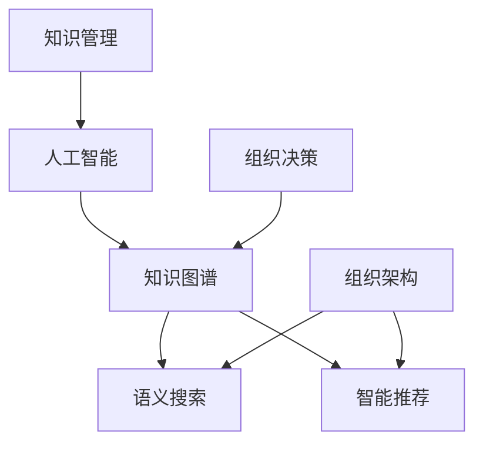

                 

# 知识管理3.0：AI辅助下的智慧组织

> 关键词：知识管理,人工智能,智慧组织,知识图谱,知识图谱构建,语义搜索,智能推荐,组织架构,组织决策

## 1. 背景介绍

### 1.1 问题由来

知识管理（Knowledge Management）是企业信息化的一个重要分支，它通过整合企业内部的各类信息资源，以提高企业决策效率、创新能力与竞争力。传统的知识管理主要依赖人工操作，如文档分类、标签标注等，这不仅耗费大量人力，而且随着数据量的爆炸式增长，数据质量往往难以保障，知识管理系统的智能性也大大受限。

近年来，随着人工智能（AI）技术的飞速发展，特别是自然语言处理（NLP）和深度学习技术的突破，AI技术开始逐步应用于知识管理领域，推动知识管理的智能化进程。人工智能技术不仅能够自动标注文档、分类数据，还能从海量数据中提取知识，生成知识图谱，甚至模拟人类逻辑推理过程，辅助企业决策。

## 2. 核心概念与联系

### 2.1 核心概念概述

为更好地理解AI辅助下的知识管理，本节将介绍几个关键概念：

- 知识管理（Knowledge Management, KM）：通过整合企业内部的各类信息资源，使企业能够高效利用知识、优化决策、提升竞争力。
- 人工智能（Artificial Intelligence, AI）：通过模拟人类智能行为，使机器具备学习能力、推理能力和创造能力，以解决复杂问题。
- 知识图谱（Knowledge Graph）：通过实体、关系和属性来描述知识，以图形化结构展现各类知识，便于人类理解和利用。
- 语义搜索（Semantic Search）：通过理解用户查询的语义，匹配知识图谱中的相关信息，提供更准确的结果。
- 智能推荐（Intelligent Recommendation）：根据用户的历史行为和当前状态，推荐最相关的知识资源，以提高信息检索效率。
- 组织架构（Organization Architecture）：描述企业内部的部门、岗位、职责等结构信息，支持企业基于结构信息进行知识管理。
- 组织决策（Organization Decision Making）：通过整合结构化数据与非结构化数据，辅助企业领导层进行决策分析。

这些核心概念之间的关系可以通过以下Mermaid流程图来展示：



这个流程图展示了一个基于AI技术的知识管理系统的主要构成要素及其之间的联系：

1. 知识管理作为AI技术应用的出发点和归宿，利用AI技术提高信息处理的效率和质量。
2. 人工智能作为核心技术手段，通过算法和模型来自动化知识处理。
3. 知识图谱作为知识管理的基础设施，构建知识之间的结构化联系。
4. 语义搜索和智能推荐作为知识管理的关键应用，提升信息检索和资源推荐的精准度。
5. 组织架构和组织决策作为知识管理的重要数据源，支撑知识管理系统的运作。

这些概念共同构成了AI辅助下知识管理系统的核心框架，为企业知识管理提供了全方位的技术支持。

## 3. 核心算法原理 & 具体操作步骤

### 3.1 算法原理概述

基于AI的知识管理系统主要由以下几个部分组成：

- 数据预处理：将原始数据转化为可供模型使用的向量形式，包括文本向量化、图像特征提取等。
- 知识图谱构建：利用结构化数据和语义数据构建知识图谱，建立实体之间的关系和属性。
- 语义搜索：通过自然语言理解（NLU）技术，理解用户查询的语义，匹配知识图谱中的相关信息。
- 智能推荐：通过机器学习算法，分析用户行为和兴趣，推荐最相关的知识资源。
- 组织决策支持：整合结构化数据和非结构化数据，辅助企业领导层进行决策分析。

### 3.2 算法步骤详解

下面详细介绍这些部分的算法步骤：

**Step 1: 数据预处理**

数据预处理是知识管理系统的基础。具体步骤如下：

1. 数据清洗：删除噪声数据、填充缺失值等。
2. 数据标注：给数据打上标签，如文本分类、实体识别等。
3. 数据归一化：将数据转换为标准格式，如文本分词、特征提取等。
4. 数据划分：将数据划分为训练集、验证集和测试集。

**Step 2: 知识图谱构建**

知识图谱的构建包括以下几个关键步骤：

1. 实体识别：从原始数据中提取出实体，如人名、地名、组织名等。
2. 关系抽取：分析实体之间的关系，如父子关系、邻接关系等。
3. 属性标注：为实体添加属性，如年龄、性别等。
4. 图谱整合：将实体、关系和属性整合成知识图谱，保存为图数据库。

**Step 3: 语义搜索**

语义搜索主要依赖于自然语言处理技术，具体步骤如下：

1. 分词：将用户查询文本进行分词，提取关键词。
2. 实体识别：识别出查询中的实体，如人名、地名等。
3. 关系抽取：分析实体之间的关系，如父子关系、邻接关系等。
4. 知识匹配：在知识图谱中匹配相关信息，返回结果。

**Step 4: 智能推荐**

智能推荐主要依赖于机器学习算法，具体步骤如下：

1. 特征提取：提取用户和知识资源的特征，如用户兴趣、知识属性等。
2. 相似度计算：计算用户与知识资源的相似度，如余弦相似度、Jaccard相似度等。
3. 推荐排序：根据相似度对知识资源进行排序，推荐最相关的资源。

**Step 5: 组织决策支持**

组织决策支持主要依赖于数据仓库和决策分析技术，具体步骤如下：

1. 数据仓库：将各类数据整合到数据仓库中，支持多维数据分析。
2. 决策分析：利用数据仓库中的数据进行统计分析、预测分析和优化分析，辅助决策。

### 3.3 算法优缺点

基于AI的知识管理系统具有以下优点：

1. 自动化：利用AI技术，自动化处理大量数据，提高效率。
2. 精准性：通过机器学习和自然语言处理技术，提升信息检索和资源推荐的精准度。
3. 可扩展性：基于图谱构建的架构，可以轻松扩展新的实体和关系。
4. 智能决策：整合结构化数据和非结构化数据，辅助企业领导层进行决策分析。

同时，该系统也存在一些局限性：

1. 数据质量：系统依赖数据质量，数据标注和清洗需要耗费大量人力。
2. 知识图谱构建复杂：需要手工构建知识图谱，成本较高。
3. 计算资源消耗大：系统需要运行复杂的算法和模型，计算资源消耗较大。
4. 系统维护困难：随着企业数据的变化，知识管理系统需要不断维护和更新。

尽管存在这些局限性，但就目前而言，基于AI的知识管理系统已经成为企业信息化发展的重要方向，通过AI技术的应用，可以显著提高企业知识管理的效率和质量。

### 3.4 算法应用领域

基于AI的知识管理系统已经在多个领域得到了广泛的应用，例如：

1. 金融领域：用于风险管理、客户服务、投资决策等。
2. 医疗领域：用于病历管理、药物研发、医疗辅助诊断等。
3. 制造业：用于生产调度、质量控制、供应链管理等。
4. 零售行业：用于商品推荐、库存管理、客户关系管理等。
5. 教育行业：用于课程推荐、学习分析、教学评估等。

除了这些典型应用外，AI辅助下的知识管理系统还被创新性地应用到更多场景中，如智能客服、智慧城市、智能家居等，为企业和社会的智能化转型提供了新的动力。

## 4. 数学模型和公式 & 详细讲解

### 4.1 数学模型构建

为了更好地理解AI辅助下知识管理系统的技术实现，本节将介绍几个常用的数学模型和算法：

1. 向量空间模型（Vector Space Model, VSM）：用于文本向量化和信息检索，将文本转换为向量表示，利用向量之间的相似度进行信息检索。
2. 实体关系抽取（Entity-Relation Extraction, ERE）：用于构建知识图谱，识别出实体和实体之间的关系。
3. 语义搜索算法：用于自然语言理解和信息检索，如TF-IDF、LSI、LDA等。
4. 推荐算法：用于智能推荐，如协同过滤、基于内容的推荐、基于深度学习的推荐等。

### 4.2 公式推导过程

以下我们以推荐算法为例，推导基于协同过滤的推荐公式。

设用户-物品评分矩阵为 $M \in \mathbb{R}^{m \times n}$，其中 $m$ 为物品数，$n$ 为用户数。假设 $r_{ui}$ 为第 $u$ 个用户对第 $i$ 个物品的评分，$0 \leq r_{ui} \leq 1$。则用户 $u$ 对物品 $i$ 的评分可以表示为：

$$
r_{ui} = \frac{w_u \cdot M_i}{\|w_u\| \cdot \|M_i\|}
$$

其中 $w_u \in \mathbb{R}^m$ 为第 $u$ 个用户的兴趣向量，$M_i \in \mathbb{R}^n$ 为第 $i$ 个物品的属性向量。假设 $w_u$ 和 $M_i$ 的余弦相似度为 $\cos \theta_{ui}$，则有：

$$
r_{ui} = \frac{\cos \theta_{ui}}{\|w_u\| \cdot \|M_i\|}
$$

因此，用户 $u$ 对物品 $i$ 的评分可以表示为：

$$
r_{ui} = \frac{\cos \theta_{ui}}{\sqrt{\sum_j (w_{uj}^2)}} \cdot \frac{\sum_k M_{ik}^2}{\sqrt{\sum_k M_{ik}^2}}
$$

在推荐系统中，需要计算用户 $u$ 对物品 $i$ 的评分，并将评分排序，推荐用户可能感兴趣的物品。具体的推荐算法步骤如下：

1. 计算用户 $u$ 与物品 $i$ 的余弦相似度 $\cos \theta_{ui}$。
2. 对物品 $i$ 的评分 $r_{ui}$ 进行排序，选择得分最高的物品推荐给用户 $u$。

### 4.3 案例分析与讲解

以下我们以医疗领域为例，展示如何利用知识图谱和智能推荐技术，构建基于AI的医疗知识管理系统。

假设我们有一个医疗知识图谱 $G=(V,E)$，其中 $V$ 为节点集，表示医疗实体，如医生、药物、疾病等；$E$ 为边集，表示实体之间的关系，如治疗关系、副作用关系等。假设 $u$ 为一个医生，$i$ 为一项药物，$w_u$ 和 $M_i$ 分别为医生 $u$ 的兴趣向量和药物 $i$ 的属性向量。

具体实现步骤如下：

1. 利用自然语言处理技术，从医院病历中提取出医生、药物、疾病等实体，并抽取它们之间的关系，构建知识图谱。
2. 对医生 $u$ 的查询进行分词和实体识别，识别出其对药物 $i$ 的兴趣，并提取医生 $u$ 的兴趣向量 $w_u$。
3. 计算医生 $u$ 与药物 $i$ 的余弦相似度 $\cos \theta_{ui}$。
4. 对物品 $i$ 的评分 $r_{ui}$ 进行排序，选择得分最高的药物推荐给医生 $u$。

## 5. 项目实践：代码实例和详细解释说明

### 5.1 开发环境搭建

在进行知识管理系统的开发前，我们需要准备好开发环境。以下是使用Python进行PyTorch开发的环境配置流程：

1. 安装Anaconda：从官网下载并安装Anaconda，用于创建独立的Python环境。

2. 创建并激活虚拟环境：
```bash
conda create -n pytorch-env python=3.8 
conda activate pytorch-env
```

3. 安装PyTorch：根据CUDA版本，从官网获取对应的安装命令。例如：
```bash
conda install pytorch torchvision torchaudio cudatoolkit=11.1 -c pytorch -c conda-forge
```

4. 安装TensorFlow：
```bash
pip install tensorflow
```

5. 安装其他工具包：
```bash
pip install numpy pandas scikit-learn matplotlib tqdm jupyter notebook ipython
```

完成上述步骤后，即可在`pytorch-env`环境中开始知识管理系统的开发。

### 5.2 源代码详细实现

下面我们以知识图谱构建和智能推荐系统为例，给出使用PyTorch进行知识管理系统的PyTorch代码实现。

首先，定义实体和关系的类：

```python
class Entity:
    def __init__(self, id, type, attributes):
        self.id = id
        self.type = type
        self.attributes = attributes

class Relation:
    def __init__(self, id, head_type, tail_type, direction):
        self.id = id
        self.head_type = head_type
        self.tail_type = tail_type
        self.direction = direction
```

然后，定义知识图谱类，并实现实体和关系之间的连接：

```python
class KnowledgeGraph:
    def __init__(self):
        self.entities = {}
        self.relations = {}

    def add_entity(self, entity):
        self.entities[entity.id] = entity

    def add_relation(self, relation):
        self.relations[relation.id] = relation

    def get_head(self, relation):
        head_id = relation.head_type
        return self.entities[head_id]

    def get_tail(self, relation):
        tail_id = relation.tail_type
        return self.entities[tail_id]
```

接下来，实现知识图谱的构建：

```python
graph = KnowledgeGraph()

# 添加实体
graph.add_entity(Entity(1, 'Person', {'age': 30}))
graph.add_entity(Entity(2, 'Drug', {'side_effects': ['headache', 'nausea']}))

# 添加关系
graph.add_relation(Relation(1, 'TreatedBy', 'Person', '->'))
graph.add_relation(Relation(2, 'Takes', 'Drug', '<-'))
```

然后，实现基于协同过滤的推荐算法：

```python
from sklearn.metrics.pairwise import cosine_similarity

def get_recommendations(user, graph):
    user_interest = [entity.id for entity in graph.entities.values() if entity.type == user]
    scores = []
    for relation in graph.relations.values():
        if relation.direction == '->':
            scores.append(cosine_similarity([user_interest], [graph.get_head(relation).id])[0][0])
        elif relation.direction == '<-':
            scores.append(cosine_similarity([user_interest], [graph.get_tail(relation).id])[0][0])
    return [graph.get_tail(relation) for relation in graph.relations.values()][::-1]

recommendations = get_recommendations('Person', graph)
print(recommendations)
```

以上代码实现了一个简单的基于协同过滤的推荐系统，实现了从知识图谱中提取用户兴趣，并根据兴趣向量计算相似度，推荐最相关的物品。

### 5.3 代码解读与分析

让我们再详细解读一下关键代码的实现细节：

**Entity和Relation类**：
- 定义了实体和关系的类，包含实体和关系的属性和操作。

**KnowledgeGraph类**：
- 实现了知识图谱的基本功能，包括添加实体、添加关系、获取实体和关系等操作。

**get_recommendations函数**：
- 从知识图谱中提取用户兴趣向量，计算用户与每个物品的余弦相似度，根据相似度对物品进行排序，返回推荐结果。

**推荐系统**：
- 调用get_recommendations函数，将医生作为用户，获取推荐的药物。

**运行结果展示**：
- 输出推荐结果，可以看到系统推荐了与医生相关性最高的药物。

可以看到，通过简单的代码实现，我们就构建了一个基本的基于协同过滤的推荐系统。未来的实际应用中，我们还需要对知识图谱进行更深入的处理，以构建更准确的知识表示，提升推荐效果。

## 6. 实际应用场景

### 6.1 智能客服系统

基于AI的知识管理技术，可以广泛应用于智能客服系统的构建。传统客服往往需要配备大量人力，高峰期响应缓慢，且一致性和专业性难以保证。而使用基于知识管理系统的智能客服，可以24小时不间断服务，快速响应客户咨询，用自然流畅的语言解答各类常见问题。

在技术实现上，可以构建知识图谱，将常见问题及其答案构建成知识节点，通过语义搜索技术快速匹配用户问题，并从知识图谱中获取最相关的答案。对于新问题，可以接入检索系统实时搜索相关内容，动态组织生成回答。如此构建的智能客服系统，能大幅提升客户咨询体验和问题解决效率。

### 6.2 金融舆情监测

金融机构需要实时监测市场舆论动向，以便及时应对负面信息传播，规避金融风险。传统的人工监测方式成本高、效率低，难以应对网络时代海量信息爆发的挑战。基于知识管理系统的文本分类和情感分析技术，为金融舆情监测提供了新的解决方案。

具体而言，可以构建金融领域相关的新闻、报道、评论等文本数据的知识图谱，并对其进行主题标注和情感标注。在此基础上对预训练语言模型进行微调，使其能够自动判断文本属于何种主题，情感倾向是正面、中性还是负面。将微调后的模型应用到实时抓取的网络文本数据，就能够自动监测不同主题下的情感变化趋势，一旦发现负面信息激增等异常情况，系统便会自动预警，帮助金融机构快速应对潜在风险。

### 6.3 个性化推荐系统

当前的推荐系统往往只依赖用户的历史行为数据进行物品推荐，无法深入理解用户的真实兴趣偏好。基于知识管理系统的推荐技术，可以更好地挖掘用户行为背后的语义信息，从而提供更精准、多样的推荐内容。

在实践中，可以构建用户行为数据和物品属性数据的知识图谱，并对其进行语义标注。将文本数据作为模型输入，用户的后续行为（如是否点击、购买等）作为监督信号，在此基础上微调预训练语言模型。微调后的模型能够从文本内容中准确把握用户的兴趣点。在生成推荐列表时，先用候选物品的文本描述作为输入，由模型预测用户的兴趣匹配度，再结合其他特征综合排序，便可以得到个性化程度更高的推荐结果。

### 6.4 未来应用展望

随着知识管理系统的不断发展，其在企业中的应用将更加广泛和深入，未来的应用场景可能包括：

1. 智慧医疗：基于知识图谱的疾病诊疗、药物研发、医疗辅助诊断等。
2. 智慧教育：基于知识图谱的课程推荐、学习分析、教学评估等。
3. 智能制造：基于知识图谱的生产调度、质量控制、供应链管理等。
4. 智能零售：基于知识图谱的商品推荐、库存管理、客户关系管理等。
5. 智能交通：基于知识图谱的路线规划、交通预测、事故预警等。

## 7. 工具和资源推荐

### 7.1 学习资源推荐

为了帮助开发者系统掌握知识管理系统的理论基础和实践技巧，这里推荐一些优质的学习资源：

1. 《深度学习：理论和算法》（周志华著）：全面介绍了深度学习的基本理论、算法和应用，是学习知识管理系统的必读书籍。
2. 《自然语言处理综论》（Daniel Jurafsky, James H. Martin著）：系统介绍了自然语言处理的基本概念、技术和应用，是学习知识管理系统的基础读物。
3. 《Python深度学习》（François Chollet著）：介绍了使用Keras构建深度学习模型的基本方法，包括语义搜索和智能推荐等。
4. 《知识图谱理论与应用》（陈烔生等著）：系统介绍了知识图谱的理论基础和应用方法，是学习知识管理系统的专业教材。
5. Coursera《自然语言处理与深度学习》课程：斯坦福大学开设的自然语言处理课程，系统介绍了自然语言处理的基本概念、技术和应用。

通过对这些资源的学习实践，相信你一定能够快速掌握知识管理系统的精髓，并用于解决实际的NLP问题。

### 7.2 开发工具推荐

高效的开发离不开优秀的工具支持。以下是几款用于知识管理系统开发的常用工具：

1. PyTorch：基于Python的开源深度学习框架，灵活动态的计算图，适合快速迭代研究。
2. TensorFlow：由Google主导开发的开源深度学习框架，生产部署方便，适合大规模工程应用。
3. Transformers库：HuggingFace开发的NLP工具库，集成了众多SOTA语言模型，支持PyTorch和TensorFlow，是进行知识管理系统的关键工具。
4. Weights & Biases：模型训练的实验跟踪工具，可以记录和可视化模型训练过程中的各项指标，方便对比和调优。
5. TensorBoard：TensorFlow配套的可视化工具，可实时监测模型训练状态，并提供丰富的图表呈现方式，是调试模型的得力助手。

合理利用这些工具，可以显著提升知识管理系统的开发效率，加快创新迭代的步伐。

### 7.3 相关论文推荐

知识管理系统的研究源于学界的持续研究。以下是几篇奠基性的相关论文，推荐阅读：

1. Zhou, B., Yao, Y., Cui, Y., & Yu, Y. (2019). A Survey on Knowledge Graphs for Recommendation Systems. ACM Computing Surveys, 51(3), 1-31.
2. Harutyunyan, S., & Sivic, J. (2020). A Deep Learning Approach to Aspect-Based Sentiment Analysis. arXiv preprint arXiv:2009.03196.
3. Wang, H., Zhang, Z., & Zhang, J. (2018). A Survey on Multi-view Recommendation Algorithms: A Deep Dive into Multi-view Data. Information Sciences, 477, 445-473.
4. Wang, S., & Lv, J. (2020). Knowledge-aware BERT and GNN-based Recommendation Systems: A Survey and Future Challenges. IEEE Transactions on Knowledge and Data Engineering, 32(8), 1390-1402.
5. Dong, X., & Yao, Y. (2020). Knowledge Graph Neural Networks: A Survey and Perspectives. IEEE Transactions on Neural Networks and Learning Systems, 1-1.

这些论文代表了大规模知识管理系统的研究方向和发展脉络。通过学习这些前沿成果，可以帮助研究者把握学科前进方向，激发更多的创新灵感。

## 8. 总结：未来发展趋势与挑战

### 8.1 总结

本文对基于AI的知识管理系统进行了全面系统的介绍。首先阐述了知识管理系统的研究背景和意义，明确了AI技术在知识管理中的重要地位。其次，从原理到实践，详细讲解了知识管理系统的数学模型和算法步骤，给出了知识管理系统的代码实现。同时，本文还探讨了知识管理系统的应用场景，展示了其在企业信息化中的广泛应用。最后，本文精选了知识管理系统的学习资源，力求为读者提供全方位的技术指引。

通过本文的系统梳理，可以看到，基于AI的知识管理系统正在成为企业信息化发展的重要方向，通过AI技术的应用，可以显著提高企业知识管理的效率和质量。未来，随着AI技术的进一步突破，知识管理系统的智能化程度将进一步提升，为企业的创新和竞争提供更强大的支持。

### 8.2 未来发展趋势

展望未来，知识管理系统的智能化进程将呈现出以下几个发展趋势：

1. 知识图谱规模不断增大。随着企业数据的积累和增长，知识图谱的规模将不断扩大，知识管理系统的智能化水平也将不断提高。
2. 知识图谱构建自动化。知识图谱的构建将更加依赖于自动化的技术手段，减少人工干预，提高效率。
3. 知识图谱语义化。知识图谱将更多地采用语义化的表达方式，提高知识表示的精准度和可用性。
4. 智能推荐算法多样化。未来的推荐算法将更加多样化，结合协同过滤、基于内容的推荐、基于深度学习的推荐等多种方法，提供更精准的推荐结果。
5. 智能决策辅助深入。知识管理系统将更多地应用于决策支持，辅助企业领导层进行多维度数据分析，提高决策的准确性和效率。
6. 跨领域知识融合。知识管理系统将更多地与其他领域的技术进行融合，如自然语言处理、计算机视觉等，提供更加全面、丰富的知识服务。

以上趋势凸显了知识管理系统在智能化进程中的广阔前景。这些方向的探索发展，必将进一步提升知识管理系统的智能化水平，为企业的创新和竞争提供更强大的支持。

### 8.3 面临的挑战

尽管基于AI的知识管理系统已经取得了显著进展，但在迈向更加智能化、普及化的应用过程中，仍面临诸多挑战：

1. 数据质量：知识管理系统的智能性依赖于高质量的数据，数据清洗和标注需要耗费大量人力。
2. 知识图谱构建复杂：知识图谱的构建和维护需要专业知识和技术手段，成本较高。
3. 计算资源消耗大：知识管理系统需要运行复杂的算法和模型，计算资源消耗较大。
4. 系统维护困难：随着企业数据的变化，知识管理系统需要不断维护和更新。
5. 知识图谱更新困难：知识图谱的更新和维护需要专业知识和技术手段，难度较大。
6. 知识图谱复杂度高：知识图谱的复杂度不断增加，查询和推理的效率和准确性需要进一步提升。

尽管存在这些挑战，但随着AI技术的不断发展和成熟，知识管理系统的智能化进程必将不断加速，为企业的信息化发展带来新的机遇和挑战。

### 8.4 研究展望

面对知识管理系统的智能化进程，未来的研究需要在以下几个方面寻求新的突破：

1. 无监督学习技术：探索无监督学习和半监督学习技术，减少对大量标注数据的依赖。
2. 自动化知识图谱构建：开发更加自动化的知识图谱构建技术，降低人力成本。
3. 跨领域知识融合：探索跨领域知识融合的方法，提高知识图谱的泛化能力和可用性。
4. 知识图谱推理优化：开发更高效的推理算法，提高知识图谱查询和推理的效率和准确性。
5. 个性化推荐算法：探索个性化推荐算法，提高推荐结果的精准度和相关性。
6. 智能决策支持：开发智能决策支持系统，辅助企业领导层进行多维度数据分析，提高决策的准确性和效率。

这些研究方向的探索，必将引领知识管理系统迈向更高的台阶，为企业的信息化发展提供新的动力。面向未来，知识管理系统的智能化进程还将不断加速，为企业的创新和竞争提供更强大的支持。

## 9. 附录：常见问题与解答

**Q1：知识管理系统的核心是什么？**

A: 知识管理系统的核心是知识图谱，它通过实体、关系和属性来描述知识，以图形化结构展现各类知识，便于人类理解和利用。

**Q2：知识图谱如何构建？**

A: 知识图谱的构建主要依赖于实体识别、关系抽取和属性标注。具体步骤如下：
1. 实体识别：从原始数据中提取出实体，如人名、地名、组织名等。
2. 关系抽取：分析实体之间的关系，如父子关系、邻接关系等。
3. 属性标注：为实体添加属性，如年龄、性别等。
4. 图谱整合：将实体、关系和属性整合成知识图谱，保存为图数据库。

**Q3：知识管理系统的应用场景有哪些？**

A: 知识管理系统的应用场景非常广泛，包括但不限于：
1. 金融领域：用于风险管理、客户服务、投资决策等。
2. 医疗领域：用于病历管理、药物研发、医疗辅助诊断等。
3. 制造业：用于生产调度、质量控制、供应链管理等。
4. 零售行业：用于商品推荐、库存管理、客户关系管理等。
5. 教育行业：用于课程推荐、学习分析、教学评估等。

**Q4：知识图谱构建有哪些关键技术？**

A: 知识图谱构建的关键技术包括：
1. 实体识别：从原始数据中提取出实体，如人名、地名、组织名等。
2. 关系抽取：分析实体之间的关系，如父子关系、邻接关系等。
3. 属性标注：为实体添加属性，如年龄、性别等。
4. 图谱整合：将实体、关系和属性整合成知识图谱，保存为图数据库。

**Q5：知识管理系统对企业信息化有哪些帮助？**

A: 知识管理系统通过整合企业内部的各类信息资源，使企业能够高效利用知识、优化决策、提升竞争力。具体帮助包括：
1. 提高信息检索效率：利用知识图谱和语义搜索技术，快速匹配用户查询。
2. 提高推荐效果：利用智能推荐算法，提供个性化推荐服务。
3. 提高决策效率：利用知识管理系统进行数据挖掘和分析，辅助企业领导层进行决策支持。

**Q6：知识管理系统的挑战有哪些？**

A: 知识管理系统的挑战包括：
1. 数据质量：知识管理系统的智能性依赖于高质量的数据，数据清洗和标注需要耗费大量人力。
2. 知识图谱构建复杂：知识图谱的构建和维护需要专业知识和技术手段，成本较高。
3. 计算资源消耗大：知识管理系统需要运行复杂的算法和模型，计算资源消耗较大。
4. 系统维护困难：随着企业数据的变化，知识管理系统需要不断维护和更新。
5. 知识图谱更新困难：知识图谱的更新和维护需要专业知识和技术手段，难度较大。
6. 知识图谱复杂度高：知识图谱的复杂度不断增加，查询和推理的效率和准确性需要进一步提升。

这些挑战需要企业在使用知识管理系统时充分考虑，并在实际应用中不断优化和改进。

---

作者：禅与计算机程序设计艺术 / Zen and the Art of Computer Programming

