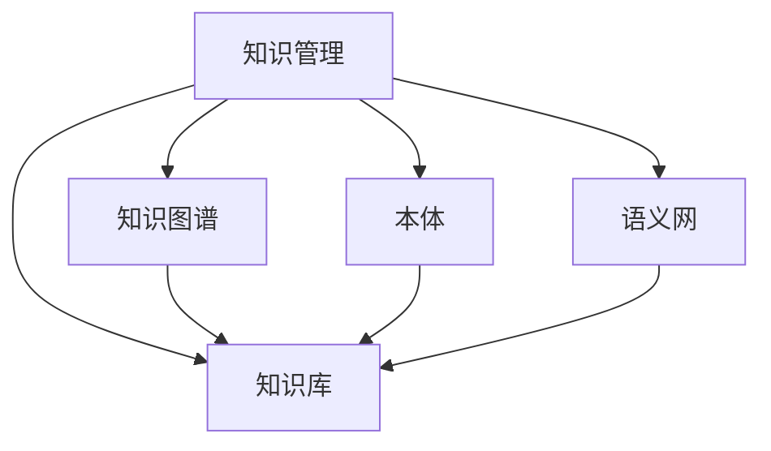

                 

# 知识管理在农业科技创新中的作用

## 1. 背景介绍

### 1.1 问题由来
农业科技创新的关键在于知识的积累和应用。传统的农业生产依赖经验，缺乏系统化的知识管理，导致生产效率低下，研发周期长，创新成果转化难。如何在农业科技领域构建有效的知识管理系统，促进知识积累和应用，已成为农业科技创新的重要课题。

### 1.2 问题核心关键点
知识管理在农业科技创新中发挥的作用主要体现在以下几个方面：
- **知识积累**：系统化地收集、整理、存储农业科技领域的各种知识资源，如学术论文、专利、试验数据、专家经验等。
- **知识共享**：搭建知识共享平台，促进科研人员、农民、企业的交流互动，加速知识的传播和应用。
- **知识应用**：将积累的知识转化为实际生产力和技术创新，推动农业科技的产业化应用。
- **知识驱动创新**：以知识为基础，引导农业科技研发方向，提升科技创新效率和效果。

### 1.3 问题研究意义
构建知识管理系统，可以大幅提升农业科技创新的效率和效果，缩短研发周期，降低成本，提高农业科技的产业化水平。知识管理不仅能够促进农业科技领域的知识积累和应用，还能推动农业科技与信息技术、物联网、大数据等现代技术的深度融合，引领农业科技的智能化转型。

## 2. 核心概念与联系

### 2.1 核心概念概述

为更好地理解知识管理在农业科技创新中的作用，本节将介绍几个密切相关的核心概念：

- **知识管理**：通过系统的收集、存储、组织、共享和应用知识资源，提升知识创造和利用效率的过程。
- **农业科技**：利用现代科学技术解决农业生产、农业环境、农业机械等方面的问题，提高农业生产效率和质量。
- **知识库**：集中存储和管理知识资源的系统，如数据库、文档库、多媒体库等。
- **知识图谱**：利用图结构表示实体、属性和关系，构建知识网络，促进知识推理和发现。
- **本体**：定义和组织知识库中的概念和关系，支持语义查询和知识推理。
- **语义网**：通过本体和链接技术，构建知识网络，实现知识资源的语义关联和智能搜索。

这些核心概念之间的逻辑关系可以通过以下Mermaid流程图来展示：



这个流程图展示出知识管理与知识库、知识图谱、本体和语义网之间的关系：

1. 知识管理通过构建知识库、知识图谱、本体和语义网，系统地管理和应用知识资源。
2. 知识库集中存储和管理各种知识资源，是知识管理的基础设施。
3. 知识图谱和本体通过定义和组织知识资源，支持语义查询和推理，提高知识的关联性和可理解性。
4. 语义网通过链接技术，将知识资源关联起来，构建智能化的知识网络，促进知识的传播和应用。

## 3. 核心算法原理 & 具体操作步骤
### 3.1 算法原理概述

农业科技知识管理系统的构建，本质上是将农业科技领域的知识资源进行系统化组织和管理的过程。其核心算法原理包括以下几个关键步骤：

- **知识采集**：通过爬虫、数据导入等方式，从学术论文、专利、试验数据等渠道收集农业科技领域的各种知识资源。
- **知识存储**：将收集到的知识资源存储到数据库或文档库中，进行结构化或非结构化存储。
- **知识组织**：通过构建知识图谱、本体等结构，对知识资源进行分类、关联和组织，提升知识的可检索性和可利用性。
- **知识共享**：搭建知识共享平台，促进科研人员、农民、企业等不同群体之间的交流互动，加速知识传播和应用。
- **知识应用**：将积累的知识转化为实际生产力和技术创新，推动农业科技的产业化应用。

### 3.2 算法步骤详解

农业科技知识管理系统构建的具体步骤包括：

1. **需求分析**：明确知识管理系统的需求，包括知识采集渠道、存储结构、共享方式、应用场景等。
2. **数据采集**：选择合适的数据源和采集工具，进行数据收集和预处理。
3. **数据存储**：选择合适的数据库或文档库，进行数据存储和结构化处理。
4. **知识组织**：设计知识图谱、本体等知识结构，对存储的数据进行分类、关联和组织。
5. **知识共享**：搭建知识共享平台，实现知识的检索、交流和共享。
6. **知识应用**：将知识管理系统的功能嵌入到农业科技应用的各个环节，推动知识应用和创新。
7. **系统测试**：对知识管理系统进行测试和优化，确保其稳定性和可用性。

### 3.3 算法优缺点

农业科技知识管理系统构建的优缺点如下：

**优点**：
- 提升农业科技知识积累和应用效率，缩短研发周期，降低成本。
- 推动农业科技产业化应用，提升农业生产效率和质量。
- 促进农业科技领域的知识共享和交流，促进科研合作和创新。

**缺点**：
- 需要大量的前期投入和专业知识，建设成本较高。
- 系统复杂度高，管理和维护成本较大。
- 对数据质量要求高，需要严格的数据清洗和预处理。

### 3.4 算法应用领域

农业科技知识管理系统可以广泛应用于以下几个领域：

- **农业科研**：促进农业科研人员的知识共享和交流，加速科研创新。
- **农业教育**：提供农业科技领域的知识资源和课程，提升教育质量。
- **农业企业**：提供农业科技知识和应用案例，推动技术转化和应用。
- **农业政府**：提供农业科技政策和管理知识，支持农业政策制定和实施。
- **农民培训**：提供农业科技知识和技术应用，提升农民的生产技能。

## 4. 数学模型和公式 & 详细讲解 & 举例说明

### 4.1 数学模型构建

农业科技知识管理系统构建的数学模型主要包括以下几个关键部分：

- **知识表示模型**：将农业科技领域的知识资源进行语义化表示，支持知识的分类、关联和推理。
- **知识检索模型**：通过搜索算法，从知识库中检索出与用户查询相关的知识资源。
- **知识推理模型**：通过推理算法，基于知识图谱和本体进行知识推理，发现新的知识和关系。
- **知识应用模型**：将知识管理系统的功能嵌入到农业科技应用的各个环节，推动知识应用和创新。

### 4.2 公式推导过程

以知识检索模型为例，我们假设农业科技知识库中有 $N$ 个知识实体 $E=\{e_i\}_{i=1}^N$，用户查询为 $q$。知识检索模型的目标是从知识库中检索出与查询相关的知识实体集合 $S$。

知识检索模型的公式推导过程如下：

$$
S = \arg\min_{S \subseteq E} \max_{e_i \in S} \mathcal{L}(e_i, q)
$$

其中 $\mathcal{L}$ 为知识实体 $e_i$ 与查询 $q$ 之间的相似度函数，$\max_{e_i \in S}$ 表示在集合 $S$ 中，选择与查询最相关的知识实体。

### 4.3 案例分析与讲解

以农业科研知识图谱的构建为例，我们可以使用以下步骤：

1. **实体识别**：识别农业科技领域的各种实体，如作物、农药、化肥等。
2. **属性提取**：提取实体的属性，如作物类型、产量、种植方式等。
3. **关系定义**：定义实体之间的关系，如作物与病虫害的关系、农药与效果的关联等。
4. **知识图谱构建**：将实体、属性和关系存储到知识图谱中，构建农业科技知识网络。
5. **知识推理**：基于知识图谱进行推理，如推断某种作物的适宜种植区域、推荐合适的农药和施肥方案等。

## 5. 项目实践：代码实例和详细解释说明
### 5.1 开发环境搭建

在进行农业科技知识管理系统开发前，我们需要准备好开发环境。以下是使用Python进行知识管理系统开发的 environment 配置流程：

1. 安装Anaconda：从官网下载并安装Anaconda，用于创建独立的Python环境。

2. 创建并激活虚拟环境：
```bash
conda create -n knowledge-management python=3.8 
conda activate knowledge-management
```

3. 安装必要的依赖库：
```bash
pip install numpy pandas scikit-learn tensorflow pydot graphviz
```

4. 搭建Web服务器：
```bash
pip install flask
```

5. 搭建数据库服务器：
```bash
pip install sqlite3
```

完成上述步骤后，即可在`knowledge-management`环境中开始开发。

### 5.2 源代码详细实现

下面我们以农业科研知识图谱的构建为例，给出使用Python实现的知识图谱构建代码：

```python
import networkx as nx
import pydot

# 定义实体类
class Entity:
    def __init__(self, name, attributes):
        self.name = name
        self.attributes = attributes

# 定义关系类
class Relationship:
    def __init__(self, source, target, type):
        self.source = source
        self.target = target
        self.type = type

# 构建知识图谱
graph = nx.DiGraph()

# 添加实体
graph.add_node("Crop", name="Crop", attributes={"type": "Plant", "category": "Cereals"})

# 添加关系
graph.add_edge("Crop", "Pest", type="Affected_by")
graph.add_edge("Pest", "Chemical", type="Treated_by")

# 可视化知识图谱
dot_graph = nx.to_dot(graph)
graph = pydot.graph_from_dot_data(dot_graph.to_dot())
graph.write_svg('knowledge_graph.svg')
```

这段代码展示了如何使用网络图表示法构建农业科技知识图谱，并使用Pydot将其可视化。可以看到，通过定义实体类、关系类，并使用网络图表示法，我们可以方便地构建和展示农业科技领域的知识网络。

### 5.3 代码解读与分析

让我们再详细解读一下关键代码的实现细节：

**Entity类**：
- 定义实体类，包括名称和属性。属性可以是文本、数值、日期等多种类型。

**Relationship类**：
- 定义关系类，包括源实体、目标实体和关系类型。关系可以是任意类型，如逻辑关系、物理关系等。

**知识图谱构建**：
- 使用网络图表示法，添加实体和关系。可以通过添加节点和边，构建知识图谱。
- 使用Pydot将知识图谱可视化，并保存为SVG格式文件。

可以看到，通过定义实体类、关系类，并使用网络图表示法，我们可以方便地构建和展示农业科技领域的知识网络。在实际应用中，我们可以进一步扩展实体和关系类型，构建更加复杂和丰富的知识图谱。

## 6. 实际应用场景
### 6.1 智能农业管理平台

基于农业科技知识管理系统的智能农业管理平台，可以集成气象、土壤、作物等多个传感器数据，结合知识图谱和本体技术，实现智能化的农业管理。

在技术实现上，可以将传感器数据导入知识图谱，通过推理算法，预测作物生长状况、病虫害发生概率等，并根据推理结果，自动调整灌溉、施肥、病虫害防治等管理策略。如此构建的智能农业管理平台，能够大幅提升农业生产的智能化和自动化水平，降低人工成本，提高农业生产效率。

### 6.2 农业科研知识库

农业科研知识库通过集成农业科研领域的各种知识资源，为科研人员提供丰富的科研数据和文献支持，促进科研创新。

在技术实现上，可以将农业科技论文、专利、试验数据等存储到知识库中，通过构建知识图谱和本体，支持科研人员进行知识检索和推理。此外，还可以集成科研协作平台，促进科研人员的交流和合作，加速科研成果的转化和应用。

### 6.3 农业教育平台

农业教育平台通过提供农业科技领域的知识资源和课程，提升农业教育质量，培养高素质的农业人才。

在技术实现上，可以构建农业科技知识图谱和本体，提供语义化的知识检索和推理服务，支持农业教育平台的教学和互动。此外，还可以集成虚拟实验室、在线实验等工具，提升学生的实践能力。

### 6.4 未来应用展望

随着农业科技知识管理系统的不断发展和完善，将在更多领域得到应用，为农业科技的智能化转型提供新的动力。

在智慧农业领域，基于农业科技知识管理系统，可以实现对农业生产过程的智能监控和管理，提升农业生产效率和质量。

在农业科技研发中，知识管理系统能够促进科研人员的知识共享和交流，加速农业科技的产业化应用。

在农业政策和决策中，知识管理系统能够提供农业科技政策和管理的知识支持，辅助政府制定科学决策。

此外，在农业贸易、农业金融等众多领域，农业科技知识管理系统也将发挥重要作用，为农业科技的跨行业融合提供新的突破。相信随着技术的发展，农业科技知识管理系统必将在农业科技的智能化转型中扮演越来越重要的角色。

## 7. 工具和资源推荐
### 7.1 学习资源推荐

为了帮助开发者系统掌握农业科技知识管理系统的构建方法，这里推荐一些优质的学习资源：

1. 《知识管理原理与实践》系列博文：由知识管理专家撰写，深入浅出地介绍了知识管理的原理、技术和应用。

2. 《农业科技知识图谱构建与应用》课程：农业科技领域的知识图谱专家开设的课程，涵盖知识图谱的构建、应用和挑战。

3. 《农业科技知识管理》书籍：农业科技领域知识管理方面的经典著作，全面介绍了知识管理的原理、技术和实践。

4. W3Schools Python教程：官方Python教程，从基础语法到高级应用，全面覆盖Python开发知识点。

5. GitHub上的开源项目：如Knowledge Graphs in Agriculture、Agriculture Knowledge Management System等，提供大量的代码示例和实现细节。

通过对这些资源的学习实践，相信你一定能够快速掌握农业科技知识管理系统的构建方法，并用于解决实际的农业科技问题。
###  7.2 开发工具推荐

高效的开发离不开优秀的工具支持。以下是几款用于农业科技知识管理系统开发的常用工具：

1. PyTorch：基于Python的开源深度学习框架，灵活动态的计算图，适合快速迭代研究。

2. TensorFlow：由Google主导开发的开源深度学习框架，生产部署方便，适合大规模工程应用。

3. Neo4j：全球领先的关系数据库系统，专门用于图数据库的构建和查询。

4. Elasticsearch：开源的搜索引擎和分析工具，支持文本和结构化数据的检索和分析。

5. Apache Solr：开源的企业搜索平台，支持高级搜索功能和大规模数据处理。

6. Jupyter Notebook：交互式计算环境，适合数据处理和算法开发。

合理利用这些工具，可以显著提升农业科技知识管理系统的开发效率，加快创新迭代的步伐。

### 7.3 相关论文推荐

农业科技知识管理系统的研究已经取得诸多成果，以下是几篇奠基性的相关论文，推荐阅读：

1. "Knowledge Management in Agriculture: A Review and Roadmap" 论文，总结了农业科技知识管理系统的研究现状和未来方向。

2. "Building an Agricultural Knowledge Graph: A Survey and Case Study" 论文，介绍了农业科技知识图谱的构建方法和应用案例。

3. "A Multi-Modal Knowledge Management System for Agricultural Decision Support" 论文，探讨了多模态知识管理在农业科技中的应用。

4. "Knowledge Management Systems in Agriculture: A Literature Review" 论文，提供了农业科技知识管理系统的研究综述和应用场景。

5. "Semantic Agriculture: A Survey and Future Challenges" 论文，总结了农业科技语义网的研究进展和未来挑战。

这些论文代表了大语言模型微调技术的发展脉络。通过学习这些前沿成果，可以帮助研究者把握学科前进方向，激发更多的创新灵感。

## 8. 总结：未来发展趋势与挑战

### 8.1 总结

本文对农业科技知识管理系统进行了全面系统的介绍。首先阐述了农业科技知识管理系统的背景、核心概念和构建方法，明确了知识管理在农业科技创新中的独特价值。其次，从原理到实践，详细讲解了农业科技知识管理系统构建的数学模型和操作步骤，给出了具体的代码实现。同时，本文还探讨了知识管理系统在农业科研、农业教育、农业管理等多个领域的应用场景，展示了知识管理系统的广阔前景。

通过本文的系统梳理，可以看到，农业科技知识管理系统已经在农业科技创新的多个环节发挥了重要作用。未来，伴随技术的不断进步和完善，农业科技知识管理系统必将在农业科技的智能化转型中扮演越来越重要的角色。

### 8.2 未来发展趋势

展望未来，农业科技知识管理系统将呈现以下几个发展趋势：

1. **知识图谱的多模态融合**：融合文本、图像、音频等多模态数据，构建更加全面和丰富的知识图谱。

2. **知识推理的智能化**：引入人工智能和机器学习技术，提升知识推理的自动化和智能化水平，支持更复杂的推理任务。

3. **知识共享的全球化**：通过国际合作和数据共享，促进全球农业科技知识的交流和传播，提升农业科技的国际化水平。

4. **知识应用的多场景化**：推动农业科技知识管理系统在农业科研、农业教育、农业管理等多个场景中的应用，促进农业科技的全面发展。

5. **知识驱动的智慧农业**：以知识为基础，引导农业科技的智能化转型，推动农业生产的智能化和自动化水平。

以上趋势凸显了农业科技知识管理系统的广阔前景。这些方向的探索发展，必将进一步提升农业科技知识的积累和应用效率，推动农业科技的智能化转型。

### 8.3 面临的挑战

尽管农业科技知识管理系统已经取得了显著成果，但在迈向更加智能化、普适化应用的过程中，仍面临诸多挑战：

1. **数据质量问题**：农业科技领域的知识资源存在数据缺失、数据冗余、数据不规范等问题，影响知识管理系统的准确性和可用性。

2. **技术复杂度**：农业科技知识管理系统的构建和维护需要跨学科的知识和技术，技术复杂度较高，需要投入大量资源。

3. **应用普及度**：农业科技知识管理系统的应用普及度较低，需要进一步推广和宣传，提升用户的使用体验和参与度。

4. **标准化问题**：农业科技知识管理系统缺乏统一的标准和规范，影响不同系统之间的互操作性和数据共享。

5. **安全性问题**：农业科技知识管理系统涉及大量敏感信息，需要保障系统的安全性和隐私保护。

6. **经济成本问题**：农业科技知识管理系统的建设和维护需要大量资金投入，中小企业难以承担。

正视农业科技知识管理系统面临的这些挑战，积极应对并寻求突破，将是大规模推广应用的关键。

### 8.4 研究展望

面对农业科技知识管理系统面临的诸多挑战，未来的研究需要在以下几个方面寻求新的突破：

1. **数据治理和清洗**：建立农业科技知识资源的数据治理机制，提升数据质量，确保数据准确性和一致性。

2. **标准化和互操作性**：制定农业科技知识管理系统的标准化规范，促进不同系统之间的数据共享和互操作。

3. **低成本化**：开发低成本的农业科技知识管理系统，降低中小企业应用门槛，推动农业科技知识管理系统的普及。

4. **安全性与隐私保护**：加强数据加密和安全防护，确保农业科技知识管理系统的安全性和隐私保护。

5. **知识驱动的智慧农业**：将农业科技知识管理系统与智慧农业技术深度融合，提升农业生产的智能化和自动化水平。

这些研究方向的探索，必将引领农业科技知识管理系统的技术进步，为农业科技的智能化转型提供新的动力。

## 9. 附录：常见问题与解答

**Q1：农业科技知识管理系统是否适用于所有农业科技领域？**

A: 农业科技知识管理系统主要适用于农业科技领域中的知识资源管理和应用，包括农业科研、农业生产、农业环境、农业机械等多个方面。但对于一些特殊领域，如农机设计、农业生物工程等，需要进一步定制化开发。

**Q2：农业科技知识管理系统需要哪些前期投入？**

A: 农业科技知识管理系统的构建需要以下前期投入：
1. 人力资源：需要具备农业科技、信息科学、计算机科学等跨学科的知识和技能。
2. 资金投入：需要投入大量资金进行知识资源的采集、存储、组织和管理。
3. 技术平台：需要搭建高性能的知识管理平台，支持数据存储、检索、推理等功能。

**Q3：如何提高农业科技知识管理系统的数据质量？**

A: 提高农业科技知识管理系统的数据质量，可以采取以下措施：
1. 数据清洗：对农业科技知识资源进行清洗，去除重复、错误、不规范的数据。
2. 数据标注：对农业科技知识资源进行标注，提升数据的准确性和一致性。
3. 数据整合：将不同来源、不同格式的知识资源进行整合，形成统一的数据库。
4. 数据共享：建立农业科技知识共享平台，促进数据共享和交流，提升数据的丰富性和多样性。

**Q4：农业科技知识管理系统在实际应用中需要注意哪些问题？**

A: 农业科技知识管理系统在实际应用中需要注意以下问题：
1. 系统稳定性：确保农业科技知识管理系统的稳定性和可靠性，避免系统崩溃或故障。
2. 用户隐私：保护用户隐私，确保农业科技知识管理系统中的数据安全。
3. 数据更新：定期更新农业科技知识资源，保持系统内容的最新性和时效性。
4. 用户反馈：收集用户反馈，优化系统功能和用户体验。

**Q5：如何评估农业科技知识管理系统的性能？**

A: 评估农业科技知识管理系统的性能可以从以下几个方面进行：
1. 知识准确性：评估知识资源的准确性和一致性，确保知识管理系统的可靠性。
2. 知识覆盖率：评估知识资源的覆盖范围和丰富性，确保知识管理系统的全面性。
3. 知识推理效率：评估知识推理的效率和准确性，确保知识管理系统的智能化水平。
4. 用户满意度：收集用户反馈，评估用户对农业科技知识管理系统的满意度和使用体验。

**Q6：如何推动农业科技知识管理系统的普及和应用？**

A: 推动农业科技知识管理系统的普及和应用，可以采取以下措施：
1. 政府支持：政府出台相关政策，支持农业科技知识管理系统的建设和发展。
2. 企业合作：农业企业和科研机构合作，共同开发和推广农业科技知识管理系统。
3. 教育和培训：开展农业科技知识管理系统的教育和培训，提升用户的使用技能和知识水平。
4. 宣传推广：通过宣传和推广活动，提高农业科技知识管理系统的知名度和影响力。

总之，农业科技知识管理系统需要在数据治理、标准化、低成本化、安全性等方面不断优化和提升，才能真正实现其应用价值，推动农业科技的智能化转型。

