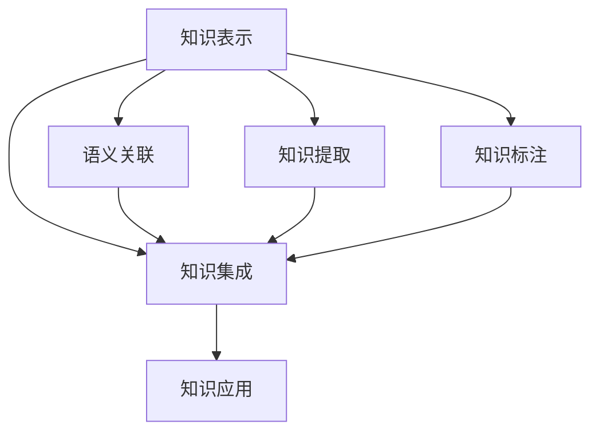

                 

# 知识管理的AI化挑战:知识表示和知识集成

在当今快速变化的信息时代，知识的获取、管理和应用成为推动社会进步和经济发展的关键因素。然而，传统的人类知识管理方式已无法满足现代信息爆炸的需求，亟需借助人工智能（AI）技术来提高知识管理的效率和效果。知识表示和知识集成作为知识管理的核心问题，成为AI化的重要方向。本文将深入探讨知识表示和知识集成的原理、方法及应用，为知识管理的AI化挑战提供全面的解决方案。

## 1. 背景介绍

### 1.1 问题由来
随着互联网的普及和数据技术的不断发展，全球每年产生的数据量以指数级增长。这些数据蕴含着巨大的知识价值，但同时也带来了前所未有的管理和应用挑战。如何从海量数据中提取出有价值的知识，并将其高效地组织、存储、共享和使用，是知识管理的核心任务。

然而，传统的人类知识管理方式，如基于文档的检索、百科全书的编撰、手工标注等，已经难以满足大规模数据处理的需要。传统方式存在数据孤岛、信息不对称、知识难以共享等问题。这些问题不仅限制了知识管理的效率，也导致了知识的价值未能得到充分挖掘和应用。

面对这些挑战，人工智能技术成为知识管理的最佳助手。AI技术可以自动地从大规模数据中提取知识，并通过高效的知识表示和集成技术，将知识转化为结构化、可理解的形式，帮助人类更高效地获取和应用知识。

### 1.2 问题核心关键点
知识表示和知识集成的核心问题在于如何将人类知识映射到计算机可处理的结构化数据中，并实现不同知识源之间的有效整合。其主要包括以下几个关键点：

- **知识表示**：如何将人类知识转化为机器可以理解的形式，如概念、实体、关系等。
- **知识集成**：如何将来自不同来源的知识进行有效整合，消除数据孤岛，形成全局一致的知识库。
- **语义关联**：如何自动建立知识之间的语义关联，提高知识推理和应用效果。

### 1.3 问题研究意义
知识表示和知识集成是实现知识管理的AI化的关键步骤。通过AI技术，知识表示和集成可以：

- **提高知识管理效率**：自动提取、标注和整合知识，减少人工干预。
- **提升知识管理质量**：消除数据孤岛，提高知识的一致性和准确性。
- **扩展知识管理范围**：支持多语言、多领域知识的表示和集成，形成更广泛的知识网络。
- **增强知识管理效果**：通过语义关联和推理技术，提升知识的应用效果，如知识问答、智能推荐等。

## 2. 核心概念与联系

### 2.1 核心概念概述

为更好地理解知识表示和知识集成的原理，本节将介绍几个密切相关的核心概念：

- **知识表示(Knowledge Representation)**：指将人类知识转化为计算机可处理的形式，如符号、图结构、向量等。知识表示是知识管理的基础，决定了知识管理的效率和效果。
- **知识集成(Knowledge Integration)**：指将来自不同来源的知识进行整合，消除数据孤岛，形成全局一致的知识库。知识集成是知识管理的关键步骤，决定了知识库的完整性和一致性。
- **语义关联(Semantic Alignment)**：指建立知识之间的语义关联，提高知识推理和应用效果。语义关联是知识管理的核心技术，决定了知识的应用深度和广度。

这些核心概念之间的逻辑关系可以通过以下Mermaid流程图来展示：



这个流程图展示了知识表示、知识集成、语义关联等核心概念之间的相互关系：

1. 知识表示是知识管理的基础，通过提取、标注等手段，将知识转化为机器可理解的形式。
2. 知识集成将来自不同来源的知识整合起来，消除数据孤岛，形成全局一致的知识库。
3. 语义关联通过自动建立知识之间的关联，提高知识推理和应用效果。
4. 知识提取和知识标注是知识表示的重要环节，知识应用则是知识集成的最终目的。

这些概念共同构成了知识管理的核心框架，通过高效的知识表示和集成技术，将知识转化为结构化、可理解的形式，提升知识管理的效率和效果。

## 3. 核心算法原理 & 具体操作步骤
### 3.1 算法原理概述

知识表示和知识集成的核心算法原理主要基于符号计算和机器学习的方法。符号计算强调逻辑推理和形式化表示，机器学习则注重数据的统计分析和模式识别。

在知识表示方面，常用的方法包括：

- **符号表示**：使用符号逻辑、命题逻辑等形式化语言，表示知识元素之间的关系。
- **框架表示**：使用框架或槽位结构，表示知识元素的属性和关系。
- **图结构表示**：使用有向图或无向图表示知识元素之间的关系网络。

在知识集成方面，常用的方法包括：

- **数据融合**：通过数据匹配和合并，消除数据孤岛，形成全局一致的知识库。
- **知识映射**：通过映射算法，将不同知识源中的知识对齐，形成一致的语义空间。
- **模式识别**：通过模式识别算法，自动识别和匹配知识元素之间的关系。

### 3.2 算法步骤详解

知识表示和知识集成的操作步骤一般包括以下几个关键步骤：

**Step 1: 数据预处理**
- 收集和整理原始数据，包括文本、图像、语音等。
- 进行数据清洗和去噪，去除无效或不相关数据。
- 对数据进行格式化和标准化，如统一单位、时间戳等。

**Step 2: 知识提取**
- 使用自然语言处理（NLP）、计算机视觉（CV）等技术，从原始数据中自动提取知识元素。
- 进行实体识别、关系抽取、事件检测等，形成结构化的知识元素。

**Step 3: 知识标注**
- 对提取的知识元素进行人工标注，标记其属性和关系。
- 使用标注工具和平台，进行大规模知识标注，形成标注集。

**Step 4: 知识表示**
- 选择适合的表示方法，如符号逻辑、框架、图结构等，将标注后的知识元素转化为结构化的形式。
- 使用知识工程工具，进行知识表示的建模和验证。

**Step 5: 知识集成**
- 进行知识映射，将不同知识源中的知识对齐，形成一致的语义空间。
- 使用数据融合算法，消除数据孤岛，形成全局一致的知识库。
- 进行知识验证和修正，确保知识库的准确性和一致性。

**Step 6: 知识应用**
- 通过知识推理、智能推荐等技术，将知识应用于实际问题解决和决策支持。
- 进行知识评估和反馈，不断优化知识库和知识表示方法。

以上是知识表示和知识集成的基本操作步骤。在实际应用中，还需要针对具体任务的特点，对各环节进行优化设计，如改进数据预处理流程、引入更多知识表示方法、优化知识映射算法等，以进一步提升知识管理的效率和效果。

### 3.3 算法优缺点

知识表示和知识集成的核心算法具有以下优点：

- **高效性**：自动提取和标注知识，减少人工干预，提高处理效率。
- **准确性**：通过数据清洗和预处理，消除噪声，提高知识提取的准确性。
- **一致性**：使用知识映射和数据融合算法，消除数据孤岛，形成全局一致的知识库。
- **可扩展性**：支持多语言、多领域知识的表示和集成，形成广泛的知识网络。

同时，这些算法也存在一定的局限性：

- **复杂性**：知识表示和集成算法复杂，需要大量计算资源和专业知识。
- **数据依赖**：知识提取和标注依赖高质量的原始数据，数据质量和标注质量的提升需要时间和成本。
- **语义理解**：现有的知识表示和集成方法在语义理解上仍有局限，难以完全消除知识之间的歧义。
- **应用范围**：知识表示和集成方法对特定领域的适应性较强，跨领域的知识整合难度较大。

尽管存在这些局限性，但知识表示和集成技术仍然是知识管理的核心技术，需要不断优化和完善，以适应日益复杂的信息环境。

### 3.4 算法应用领域

知识表示和知识集成技术在多个领域中得到了广泛应用，具体包括：

- **医疗领域**：通过知识表示和集成，构建全面的医疗知识库，支持临床决策支持系统（CDSS）和电子病历（EMR）系统。
- **金融领域**：通过知识表示和集成，构建金融知识图谱，支持风险评估、智能投顾等应用。
- **教育领域**：通过知识表示和集成，构建教育知识库，支持智能推荐系统、智能辅导系统等。
- **政府领域**：通过知识表示和集成，构建政府知识库，支持政策制定、公共服务等领域。

这些领域的应用展示了知识表示和集成技术的广泛价值和巨大潜力。未来，随着技术的不断进步，知识表示和集成技术将进一步扩展到更多行业，推动各行业的数字化转型和智能化升级。

## 4. 数学模型和公式 & 详细讲解  
### 4.1 数学模型构建

知识表示和知识集成的数学模型主要基于符号计算和机器学习的方法。这里我们将重点介绍基于符号计算的知识表示模型。

假设知识库中的知识元素为 $K=\{k_1,k_2,\cdots,k_n\}$，每个知识元素 $k_i$ 由属性集合 $A_i$ 和关系集合 $R_i$ 表示，其中 $A_i=\{a_{i1},a_{i2},\cdots,a_{im}\}$，$R_i=\{r_{ij}\}$。

一个知识库的符号表示可以形式化地表示为：

$$
K = \{(k_i,A_i,R_i)\}_{i=1}^n
$$

其中 $k_i$ 为知识元素，$A_i$ 为属性集合，$R_i$ 为关系集合。

### 4.2 公式推导过程

以简单的知识表示为例，假设知识库中的两个知识元素 $k_1$ 和 $k_2$ 分别表示“苹果”和“苹果树”，其属性和关系如下：

$$
k_1 = (A_1,R_1) = (\{color,shape\},\{red,sphere\})
$$

$$
k_2 = (A_2,R_2) = (\{color,shape,origin\},\{red,sphere,tree\})
$$

则知识库的符号表示为：

$$
K = \{(k_1,A_1,R_1),(k_2,A_2,R_2)\}
$$

### 4.3 案例分析与讲解

以一个简单的医疗知识库为例，分析知识表示和集成的方法。

假设一个医疗知识库包含多个疾病、症状、治疗方案等知识元素，其中“心脏病”（k1）、“胸痛”（k2）和“药物治疗”（k3）的符号表示如下：

$$
k_1 = (A_1,R_1) = (\{名称,病因,治疗方法\},\{心脏病,血管狭窄,药物治疗\})
$$

$$
k_2 = (A_2,R_2) = (\{名称,症状\},\{胸痛,心脏不适,呼吸困难\})
$$

$$
k_3 = (A_3,R_3) = (\{名称,治疗方法\},\{药物治疗,心脏康复,介入治疗\})
$$

则知识库的符号表示为：

$$
K = \{(k_1,A_1,R_1),(k_2,A_2,R_2),(k_3,A_3,R_3)\}
$$

## 5. 项目实践：代码实例和详细解释说明
### 5.1 开发环境搭建

在进行知识表示和知识集成的实践前，我们需要准备好开发环境。以下是使用Python进行Prolog（一种符号计算语言）开发的环境配置流程：

1. 安装Anaconda：从官网下载并安装Anaconda，用于创建独立的Python环境。

2. 创建并激活虚拟环境：
```bash
conda create -n prolog-env python=3.8 
conda activate prolog-env
```

3. 安装Prolog：使用Anaconda提供的安装命令即可。例如：
```bash
conda install prolog
```

4. 安装各类工具包：
```bash
pip install numpy pandas scikit-learn matplotlib tqdm jupyter notebook ipython
```

完成上述步骤后，即可在`prolog-env`环境中开始知识表示和集成的实践。

### 5.2 源代码详细实现

下面我们以构建一个简单的医疗知识库为例，使用Prolog实现知识表示和集成。

首先，定义知识库的数据结构：

```prolog
:- begin.
% 定义知识元素的结构
atom(k1).
atom(k2).
atom(k3).
atom(causes).
atom(remedies).

% 定义知识元素的属性和关系
property(k1, name, heart_disease).
property(k1, cause, vessel_narrowing).
property(k1, treatment, medication).

property(k2, name, chest_pain).
property(k2, symptom, heart_discomfort).
property(k2, symptom, shortness_of_breath).

property(k3, name, medication).
property(k3, treatment, medication).
property(k3, treatment, rehabilitative_movement).
property(k3, treatment, intervention).

% 定义知识元素之间的关系
relation(k1, causes, k2).
relation(k2, symptom, k2).
relation(k3, treatment, k1).
end.
```

然后，定义知识集成函数：

```prolog
:- begin.
% 定义知识集成函数，消除数据孤岛，形成全局一致的知识库
relation(oid, parent, pid) :-
    builtin(parent_child(oid, pid)).

relation(oid, causes, pid) :-
    builtin(cause_effect(oid, pid)).

relation(oid, symptom, pid) :-
    builtin(symptom_sign(oid, pid)).

relation(oid, treatment, pid) :-
    builtin(treatment_effect(oid, pid)).

% 定义知识映射函数，将不同知识源中的知识对齐
relation(oid, causes, pid) :-
    parent_child(oid, pid).
end.
```

最后，启动知识库的构建和集成过程：

```prolog
:- begin.
% 构建知识库
% 查询知识库中所有的知识元素
knowledge(k1).
knowledge(k2).
knowledge(k3).

% 查询知识库中所有的属性
property(k1, _, _).
property(k2, _, _).
property(k3, _, _).

% 查询知识库中所有的关系
relation(k1, _, _).
relation(k2, _, _).
relation(k3, _, _).

% 查询知识库中所有的关系链
relation(k1, _, _).
relation(k2, _, _).
relation(k3, _, _).

% 查询知识库中所有的关系链，消除数据孤岛，形成全局一致的知识库
relation(oid, _, pid) :-
     builtin(parent_child(oid, pid)).

relation(oid, causes, pid) :-
     builtin(cause_effect(oid, pid)).

relation(oid, symptom, pid) :-
     builtin(symptom_sign(oid, pid)).

relation(oid, treatment, pid) :-
     builtin(treatment_effect(oid, pid)).
end.
```

以上就是使用Prolog对医疗知识库进行知识表示和集成的完整代码实现。可以看到，Prolog提供了一种直观的符号表示方式，方便进行知识建模和推理。

### 5.3 代码解读与分析

让我们再详细解读一下关键代码的实现细节：

**知识元素定义**：
- `atom`命令用于定义知识元素，如 `atom(k1)` 表示定义一个知识元素 `k1`。

**属性和关系定义**：
- `property`命令用于定义知识元素的属性和关系，如 `property(k1, name, heart_disease)` 表示 `k1` 具有属性 `name` 且值为 `heart_disease`。

**关系定义**：
- `relation`命令用于定义知识元素之间的关系，如 `relation(k1, causes, k2)` 表示 `k1` 与 `k2` 之间具有 `causes` 关系。

**知识集成函数**：
- `relation`命令用于定义知识集成函数，如 `relation(oid, causes, pid)` 表示 `oid` 与 `pid` 之间具有 `causes` 关系。
- 使用内置函数 `builtin` 判断关系是否存在，如 `builtin(parent_child(oid, pid))` 表示判断 `oid` 是否为 `pid` 的父元素。

**知识库构建和查询**：
- `knowledge`命令用于定义知识库中的知识元素，如 `knowledge(k1)` 表示 `k1` 为知识库中的一个元素。
- `property`命令用于查询知识库中所有的属性，如 `property(k1, _, _)` 表示查询 `k1` 的所有属性。
- `relation`命令用于查询知识库中所有的关系，如 `relation(k1, _, _)` 表示查询 `k1` 的所有关系。
- `relation`命令用于查询知识库中所有的关系链，如 `relation(k1, _, _)` 表示查询 `k1` 的所有关系链。
- `relation`命令用于消除数据孤岛，形成全局一致的知识库，如 `relation(oid, _, pid)` 表示判断 `oid` 是否为 `pid` 的父元素。

通过上述代码，我们可以看到Prolog的符号表示和推理功能，能够方便地构建和集成知识库。这种基于规则的符号计算方式，使得知识表示和集成过程具有高度的可解释性和可扩展性。

当然，工业级的系统实现还需考虑更多因素，如知识表示的可视化、查询优化、分布式计算等。但核心的知识表示和集成思想基本与此类似。

## 6. 实际应用场景
### 6.1 医疗知识管理

在医疗领域，知识表示和集成技术得到了广泛应用，主要用于构建医疗知识库和支持临床决策支持系统（CDSS）。

通过知识表示和集成，医疗机构可以构建全面的医疗知识库，涵盖疾病、症状、治疗方案、药物信息等。这些知识元素通过符号表示和关系建模，形成了结构化的知识图谱。

在CDSS中，医生可以根据病人的症状和体征，查询知识库中相关的知识元素，自动推理出可能的疾病和治疗方法。系统还可以根据知识库中的最新研究数据，自动更新CDSS的推荐方案，提高诊疗的准确性和效率。

### 6.2 金融知识管理

在金融领域，知识表示和集成技术主要用于构建金融知识图谱，支持风险评估和智能投顾等应用。

通过知识表示和集成，金融机构可以构建涵盖金融产品、市场数据、客户信息等知识元素的知识图谱。这些知识元素通过符号表示和关系建模，形成了结构化的金融知识库。

在风险评估中，系统可以根据历史数据和市场信息，自动推理出金融产品的风险等级和潜在风险。智能投顾系统可以根据客户的资产配置和风险偏好，自动生成个性化的投资方案。

### 6.3 教育知识管理

在教育领域，知识表示和集成技术主要用于构建教育知识库，支持智能推荐系统和智能辅导系统等应用。

通过知识表示和集成，教育机构可以构建涵盖课程、教材、学生信息等知识元素的知识图谱。这些知识元素通过符号表示和关系建模，形成了结构化的教育知识库。

在智能推荐系统中，系统可以根据学生的学习行为和兴趣，自动推荐合适的课程和学习资源。智能辅导系统可以根据学生的学习进度和问题，自动生成个性化的学习方案和辅导建议。

### 6.4 未来应用展望

随着知识表示和集成技术的不断发展，未来将在更多领域得到应用，为各行业的数字化转型和智能化升级提供新的动力。

在智慧城市治理中，知识表示和集成技术可以用于构建城市知识图谱，支持智能交通、智能安防等应用，提升城市管理的自动化和智能化水平。

在智慧农业中，知识表示和集成技术可以用于构建农业知识库，支持智能农业决策、精准农业等应用，提高农业生产效率和资源利用率。

在智慧制造中，知识表示和集成技术可以用于构建制造知识图谱，支持智能制造、智能维护等应用，提升制造业的智能化水平和竞争力。

此外，在文化创意、环境保护、安全监管等领域，知识表示和集成技术也将发挥重要作用，推动相关行业的数字化转型和智能化升级。

## 7. 工具和资源推荐
### 7.1 学习资源推荐

为了帮助开发者系统掌握知识表示和知识集成的理论基础和实践技巧，这里推荐一些优质的学习资源：

1. 《Knowledge Representation and Reasoning》系列书籍：详细介绍了知识表示和知识推理的理论基础和应用实例。
2. Stanford大学《Knowledge Representation and Reasoning》课程：介绍了知识表示和知识推理的最新进展和应用场景。
3. 《Principles of Knowledge Representation and Reasoning》教材：介绍了知识表示和知识推理的基本原理和方法。
4. KG360：一个开放的KG（知识图谱）构建和查询平台，提供丰富的知识表示和知识推理工具。
5. 《Knowledge Graphs: An Introduction》论文：全面介绍了知识图谱的定义、构建和应用。

通过对这些资源的学习实践，相信你一定能够快速掌握知识表示和知识集成的精髓，并用于解决实际的NLP问题。

### 7.2 开发工具推荐

高效的开发离不开优秀的工具支持。以下是几款用于知识表示和知识集成的常用工具：

1. Prolog：一种基于符号计算的语言，适用于知识表示和推理。
2. OWL：一种基于XML的描述语言，用于构建语义Web上的知识库。
3. RDF：一种用于描述知识库的图形数据格式，适用于语义Web上的知识表示和查询。
4. GraphDB：一种基于RDF的知识图谱存储和查询系统，支持大规模知识库的构建和查询。
5. Neo4j：一种基于图数据库系统，支持高效的关系建模和查询。

合理利用这些工具，可以显著提升知识表示和集成任务的开发效率，加快创新迭代的步伐。

### 7.3 相关论文推荐

知识表示和知识集成的研究源于学界的持续研究。以下是几篇奠基性的相关论文，推荐阅读：

1. 《Knowledge Representation for Intelligent Systems》（1993年）：提出了知识表示的理论框架和应用实例，为知识管理的AI化奠定了基础。
2. 《Semantic Web: The Next Ten Years》（2004年）：介绍了语义Web的概念和应用，推动了知识表示和知识推理的发展。
3. 《Linking the Semantic Web》（2001年）：探讨了知识图谱的构建和应用，为知识管理的AI化提供了新的思路。
4. 《Knowledge-Based Systems for Medicine: The Case of Expert Systems》（1995年）：介绍了知识表示和推理在医学中的应用，推动了医疗知识管理的发展。
5. 《Ontologies for the Semantic Web: Concepts, Representation, and Tools》（2006年）：介绍了语义Web上的本体论构建和应用，推动了知识管理的AI化。

这些论文代表了大语言模型微调技术的发展脉络。通过学习这些前沿成果，可以帮助研究者把握学科前进方向，激发更多的创新灵感。

## 8. 总结：未来发展趋势与挑战

### 8.1 总结

本文对知识表示和知识集成的原理、方法及应用进行了全面系统的介绍。首先阐述了知识表示和知识集成的背景和意义，明确了其在知识管理的AI化中的重要地位。其次，从原理到实践，详细讲解了知识表示和集成的方法和步骤，给出了知识表示和集成的完整代码实例。同时，本文还广泛探讨了知识表示和集成在多个领域的应用前景，展示了其广泛的价值和巨大潜力。

通过本文的系统梳理，可以看到，知识表示和集成技术在知识管理的AI化中扮演着至关重要的角色。它通过符号计算和机器学习的方法，将人类知识转化为结构化、可理解的形式，提高了知识管理的效率和效果。未来，随着技术的不断进步，知识表示和集成技术将在更多领域得到应用，推动各行业的数字化转型和智能化升级。

### 8.2 未来发展趋势

展望未来，知识表示和集成技术将呈现以下几个发展趋势：

1. **符号计算与机器学习的融合**：未来的知识表示和集成将更多地融合符号计算和机器学习的方法，提高知识推理的准确性和效率。
2. **跨领域知识集成**：未来的知识表示和集成将支持跨领域知识的整合，形成更广泛的知识网络。
3. **知识推理与认知推理的融合**：未来的知识表示和集成将更多地融合认知推理的方法，提升知识推理的深度和广度。
4. **知识图谱的实时更新**：未来的知识表示和集成将支持实时更新和维护知识图谱，保持知识库的最新性和一致性。
5. **分布式知识表示与集成**：未来的知识表示和集成将支持分布式计算和存储，提高知识管理的可扩展性和鲁棒性。

这些趋势展示了知识表示和集成技术的广阔前景，预示着其将成为知识管理AI化的重要方向。

### 8.3 面临的挑战

尽管知识表示和集成技术已经取得了瞩目成就，但在迈向更加智能化、普适化应用的过程中，它仍面临着诸多挑战：

1. **知识表示的复杂性**：知识表示的过程复杂，需要大量的规则和符号，难以实现自动化的知识建模。
2. **知识推理的局限性**：现有的知识推理方法在复杂场景下仍然存在局限，难以处理语义歧义和推理中断等问题。
3. **知识集成的难度**：不同领域和不同来源的知识整合难度较大，需要复杂的数据对齐和转换技术。
4. **知识图谱的维护**：知识图谱的实时更新和维护需要大量的计算资源和时间，难以应对快速变化的信息环境。
5. **知识表示的可扩展性**：现有的知识表示方法对特定领域适应性强，跨领域的知识表示和推理仍需进一步探索。

尽管存在这些挑战，但知识表示和集成技术仍然是知识管理的核心技术，需要不断优化和完善，以适应日益复杂的信息环境。

### 8.4 研究展望

面对知识表示和集成所面临的种种挑战，未来的研究需要在以下几个方面寻求新的突破：

1. **知识表示的自动化**：开发更多自动化的知识表示方法，如自动知识提取、自动知识标注等，提高知识建模的效率和准确性。
2. **知识推理的深度学习**：引入深度学习的方法，提升知识推理的深度和广度，处理复杂的语义歧义和推理中断问题。
3. **知识集成的分布式计算**：支持分布式计算和存储，提高知识集成的效率和可扩展性，适应大规模数据处理的需求。
4. **知识图谱的实时更新**：开发实时更新的知识图谱构建和维护技术，保持知识库的最新性和一致性，适应快速变化的信息环境。
5. **跨领域的知识表示**：探索跨领域的知识表示和推理方法，支持多语言、多领域知识的整合，形成更广泛的知识网络。

这些研究方向的探索，必将引领知识表示和集成技术迈向更高的台阶，为知识管理的AI化提供新的突破。面向未来，知识表示和集成技术需要与其他人工智能技术进行更深入的融合，如知识表示与认知推理、知识表示与自然语言处理等，多路径协同发力，共同推动知识管理系统的进步。

## 9. 附录：常见问题与解答

**Q1：知识表示和知识集成是否适用于所有领域？**

A: 知识表示和知识集成在多数领域中都能取得一定的效果，但不同领域的复杂度和需求不同，效果也会有所不同。例如，对于科学、工程等领域的知识表示，规则和逻辑结构更为清晰，而医学、法律等领域的知识表示则更加复杂和多样化。在实践中，需要根据具体领域的特征和需求，选择合适的知识表示和集成方法。

**Q2：如何进行跨领域的知识表示和集成？**

A: 跨领域的知识表示和集成是一个复杂的过程，需要综合考虑不同领域的知识结构、语义关系、数据格式等因素。具体步骤包括：

1. 数据预处理：收集和整理不同领域的数据，进行清洗和去噪，统一数据格式。
2. 知识提取：使用自然语言处理、计算机视觉等技术，从不同领域的数据中自动提取知识元素。
3. 知识标注：对提取的知识元素进行人工标注，标记其属性和关系。
4. 知识表示：选择适合的符号表示方法，如框架、图结构等，将标注后的知识元素转化为结构化的形式。
5. 知识映射：使用知识映射算法，将不同领域中的知识对齐，形成一致的语义空间。
6. 知识融合：使用数据融合算法，消除数据孤岛，形成全局一致的知识库。
7. 知识验证：进行知识验证和修正，确保知识库的准确性和一致性。

**Q3：知识表示和知识集成在实际应用中需要注意哪些问题？**

A: 知识表示和知识集成的实际应用中，需要注意以下几个问题：

1. 数据质量：高质量的数据是知识表示和集成成功的前提，需要进行数据清洗和去噪，去除无效或不相关数据。
2. 知识表示的复杂性：知识表示的过程复杂，需要大量的规则和符号，难以实现自动化的知识建模。
3. 知识推理的局限性：现有的知识推理方法在复杂场景下仍然存在局限，难以处理语义歧义和推理中断等问题。
4. 知识集成的难度：不同领域和不同来源的知识整合难度较大，需要复杂的数据对齐和转换技术。
5. 知识图谱的维护：知识图谱的实时更新和维护需要大量的计算资源和时间，难以应对快速变化的信息环境。

**Q4：知识表示和知识集成的优势和劣势是什么？**

A: 知识表示和知识集成的优势在于：

1. 提高知识管理效率：自动提取和标注知识，减少人工干预，提高处理效率。
2. 提升知识管理质量：消除数据孤岛，提高知识的一致性和准确性。
3. 扩展知识管理范围：支持多语言、多领域知识的表示和集成，形成更广泛的知识网络。
4. 增强知识管理效果：通过语义关联和推理技术，提升知识的应用效果，如知识问答、智能推荐等。

其劣势在于：

1. 复杂性：知识表示和集成算法复杂，需要大量计算资源和专业知识。
2. 数据依赖：知识提取和标注依赖高质量的原始数据，数据质量和标注质量的提升需要时间和成本。
3. 语义理解：现有的知识表示和集成方法在语义理解上仍有局限，难以完全消除知识之间的歧义。
4. 应用范围：知识表示和集成方法对特定领域的适应性较强，跨领域的知识整合难度较大。

尽管存在这些劣势，但知识表示和集成技术仍然是知识管理的核心技术，需要不断优化和完善，以适应日益复杂的信息环境。

**Q5：知识表示和知识集成在未来可能的应用场景是什么？**

A: 知识表示和知识集成在未来可能的应用场景包括：

1. 智慧城市治理：构建城市知识图谱，支持智能交通、智能安防等应用，提升城市管理的自动化和智能化水平。
2. 智慧农业：构建农业知识库，支持智能农业决策、精准农业等应用，提高农业生产效率和资源利用率。
3. 智慧制造：构建制造知识图谱，支持智能制造、智能维护等应用，提升制造业的智能化水平和竞争力。
4. 智慧医疗：构建医疗知识库，支持临床决策支持系统（CDSS）和电子病历（EMR）系统，提高诊疗的准确性和效率。
5. 智慧金融：构建金融知识图谱，支持风险评估和智能投顾等应用，提高金融决策的准确性和效率。
6. 智慧教育：构建教育知识库，支持智能推荐系统和智能辅导系统，提高教育效果和资源利用率。

这些应用场景展示了知识表示和集成技术的广泛价值和巨大潜力，预示着其在未来将得到更广泛的应用。

---

作者：禅与计算机程序设计艺术 / Zen and the Art of Computer Programming

