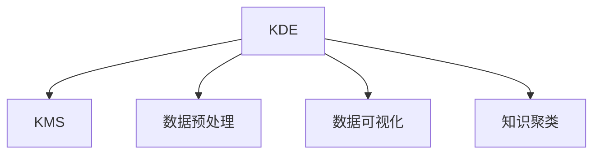

                 

## 1. 背景介绍

在当今信息爆炸的时代，知识的发现和利用已经成为了组织竞争力的关键。组织间的竞争不再局限于产品和服务，更多地体现在对知识资源的整合和利用上。知识管理(Knowledge Management, KMS)作为帮助组织系统化、智能化地管理、共享和应用知识的重要手段，得到了广泛的应用。然而，尽管KMS系统得到了广泛的应用，但如何最大化地发挥知识发现引擎(Knowledge Discovery Engine, KDE)的效益，仍然是一个亟待解决的问题。

### 1.1 问题由来

当前的知识管理系统中，知识发现引擎往往被视为一个黑箱系统，缺乏可解释性，难以理解其内部工作机制和决策逻辑。这就导致系统在实际应用中，对复杂情境的适应能力不足，无法灵活地应对快速变化的环境。另一方面，由于缺乏有效指导策略，系统往往无法充分发挥自身潜力，可能存在知识冗余、难以聚类、噪声干扰等问题，导致知识发现的质量和效率低下。

为了解决这个问题，本文将深入探讨知识管理策略，系统阐述如何通过合理的策略设计，最大化地发挥知识发现引擎的效益。本文将从知识发现引擎的基本原理出发，介绍核心算法原理，并通过实际操作案例展示如何进行有效的策略设计。同时，本文还将探讨知识发现引擎在实际应用中的常见挑战，并提出相应的应对策略。

## 2. 核心概念与联系

### 2.1 核心概念概述

为更好地理解知识管理策略，本节将介绍几个密切相关的核心概念：

- **知识发现引擎(Knowledge Discovery Engine, KDE)**：使用数据分析、机器学习等技术，从海量数据中自动提取和发现知识的工具。常见的KDE技术包括数据挖掘、文本挖掘、社交网络分析等。
- **知识管理(Knowledge Management, KMS)**：一种旨在帮助组织系统化、智能化地管理和利用知识的方法和过程，通常包括知识的创建、组织、搜索、共享、应用等环节。
- **数据预处理**：在知识发现前，对数据进行清洗、归一化、特征提取等操作，以提升发现的质量和效率。
- **数据可视化**：将发现的知识转化为图表、报表等可视化形式，便于理解和使用。
- **知识聚类**：对发现的知识进行分类、归并，以便于进一步的组织和应用。

这些核心概念之间的逻辑关系可以通过以下Mermaid流程图来展示：



这个流程图展示了大语言模型微调的各个核心概念及其之间的关系：

1. KDE从原始数据中发现知识。
2. 知识通过KMS系统化和智能化地管理、共享和应用。
3. 数据预处理提升KDE的发现质量。
4. 数据可视化便于理解和使用。
5. 知识聚类促进知识组织和应用。

这些核心概念共同构成了知识管理的理论基础，是实现知识发现引擎效益最大化的重要手段。

## 3. 核心算法原理 & 具体操作步骤
### 3.1 算法原理概述

知识发现引擎的核心原理是利用数据分析、机器学习等技术，从海量数据中自动提取和发现知识。其核心算法包括数据预处理、聚类分析、分类器训练等。本文将以聚类分析为例，系统阐述知识发现引擎的算法原理。

聚类分析是一种常用的无监督学习算法，通过将数据点分为不同的组别，使得同一组内数据点之间相似度高，不同组之间差异大。常见的聚类算法包括K-means、层次聚类、DBSCAN等。本文将重点介绍K-means算法，并结合实际案例展示其操作步骤。

### 3.2 算法步骤详解

K-means聚类算法的主要步骤如下：

1. **数据预处理**：对原始数据进行清洗、归一化、特征提取等操作，确保数据的质量和一致性。

2. **初始化聚类中心**：随机选取K个样本作为初始聚类中心。

3. **循环迭代**：
   - 对于每个数据点，计算其到K个聚类中心的距离，并将其归为距离最近的聚类中心对应的组别。
   - 重新计算每个组的中心点，作为新的聚类中心。
   - 重复上述步骤，直到各组内数据点不再移动或达到预设的迭代次数。

4. **聚类结果可视化**：将聚类结果转化为散点图、热力图等可视化形式，便于理解。

### 3.3 算法优缺点

K-means算法作为一种经典的聚类算法，具有以下优点：
- 简单易懂，实现容易。
- 在大规模数据上表现良好，计算效率高。
- 结果可视化，易于理解和应用。

但同时，K-means算法也存在一些缺点：
- 对初始聚类中心的选择敏感。
- 假设数据点为欧式空间，对于高维数据效果不佳。
- 无法处理非凸形状的簇。
- 对于簇的个数K需要手动设置，依赖人工经验。

### 3.4 算法应用领域

K-means聚类算法在知识管理领域得到了广泛的应用，具体包括：

- **客户分群**：对客户数据进行聚类，发现不同客户群体的消费行为、需求偏好等特征，实现精准营销。
- **内容推荐**：对用户行为数据进行聚类，发现用户兴趣群体，实现个性化推荐。
- **文档聚类**：对海量文档进行聚类，发现不同主题的文档集，便于信息管理和检索。
- **社交网络分析**：对社交网络数据进行聚类，发现不同社交圈层，便于社区管理和治理。

## 4. 数学模型和公式 & 详细讲解 & 举例说明
### 4.1 数学模型构建

K-means聚类算法的基本数学模型为：

$$
\min_{C,z} \sum_{i=1}^n \sum_{k=1}^K d(x_i, c_k)^2 + \sum_{k=1}^K \sum_{x \in c_k} ||c_k - \mu_k||^2
$$

其中，$n$ 为数据点数量，$K$ 为簇的数量，$x_i$ 为第 $i$ 个数据点，$c_k$ 为第 $k$ 个簇的质心，$\mu_k$ 为第 $k$ 个簇的平均向量。

该模型的目标是使得每个数据点属于离其最近的簇，同时簇内的数据点与质心之间的距离最小，簇之间的距离最大。

### 4.2 公式推导过程

首先，定义每个数据点到簇质心的距离函数：

$$
f_k(x_i) = d(x_i, c_k)
$$

其中，$d(\cdot,\cdot)$ 为欧式距离函数。

其次，定义簇的质心更新规则：

$$
\mu_k = \frac{1}{|c_k|} \sum_{x \in c_k} x
$$

其中，$|c_k|$ 为第 $k$ 个簇的元素数量。

根据上述定义，K-means算法可以理解为以下步骤：

1. 随机选取K个数据点作为初始聚类中心。
2. 对于每个数据点，计算其到K个聚类中心的距离，并将其归为距离最近的聚类中心对应的组别。
3. 重新计算每个组的中心点，作为新的聚类中心。
4. 重复上述步骤，直到各组内数据点不再移动或达到预设的迭代次数。

### 4.3 案例分析与讲解

以下是一个简单的K-means聚类案例：

假设有一组数据点，其横坐标为用户的年龄，纵坐标为用户的消费金额。通过对这组数据进行聚类，可以发现不同年龄段的消费行为模式。具体步骤如下：

1. 随机选取K个数据点作为初始聚类中心。
2. 对于每个数据点，计算其到K个聚类中心的距离，并将其归为距离最近的聚类中心对应的组别。
3. 重新计算每个组的中心点，作为新的聚类中心。
4. 重复上述步骤，直到各组内数据点不再移动或达到预设的迭代次数。

最终，聚类结果可以直观地展示为散点图，便于理解不同年龄段用户的消费行为模式。

## 5. 项目实践：代码实例和详细解释说明
### 5.1 开发环境搭建

在进行K-means聚类实践前，我们需要准备好开发环境。以下是使用Python进行Scikit-Learn开发的环境配置流程：

1. 安装Anaconda：从官网下载并安装Anaconda，用于创建独立的Python环境。

2. 创建并激活虚拟环境：
```bash
conda create -n kmeans-env python=3.8 
conda activate kmeans-env
```

3. 安装Scikit-Learn：
```bash
pip install scikit-learn
```

4. 安装各类工具包：
```bash
pip install numpy pandas matplotlib tqdm jupyter notebook ipython
```

完成上述步骤后，即可在`kmeans-env`环境中开始聚类实践。

### 5.2 源代码详细实现

下面以K-means算法为例，给出使用Scikit-Learn进行聚类的PyTorch代码实现。

```python
import numpy as np
from sklearn.cluster import KMeans
from sklearn.metrics import silhouette_score
from sklearn.datasets import make_blobs

# 生成随机数据集
X, true_labels = make_blobs(n_samples=1000, centers=5, random_state=42)
X = X[:, 0]

# 设置聚类数目
K = 5

# 训练K-means模型
kmeans = KMeans(n_clusters=K, random_state=42)
kmeans.fit(X)

# 计算轮廓系数
silhouette_avg = silhouette_score(X, kmeans.labels_)
print('轮廓系数: {:.3f}'.format(silhouette_avg))

# 可视化聚类结果
import matplotlib.pyplot as plt

plt.scatter(X, kmeans.labels_)
plt.show()
```

### 5.3 代码解读与分析

让我们再详细解读一下关键代码的实现细节：

**make_blobs函数**：
- 用于生成包含固定数量的簇和噪声的数据集，每个簇的数据数量和位置由参数控制。

**KMeans类**：
- 实现了K-means聚类算法，可以自动计算每个簇的质心，并返回聚类标签。

**轮廓系数**：
- 用于衡量聚类结果的质量，值越大表示聚类效果越好。

**可视化代码**：
- 使用matplotlib库对聚类结果进行可视化展示。

**训练流程**：
- 通过KMeans类的fit方法，训练模型并自动划分数据点。

**评估流程**：
- 通过轮廓系数评估聚类效果，打印输出。

**展示流程**：
- 使用matplotlib的scatter方法，将聚类结果可视化展示为散点图。

可以看到，Scikit-Learn库的封装使得K-means聚类的代码实现变得简洁高效。开发者可以将更多精力放在数据处理、模型改进等高层逻辑上，而不必过多关注底层的实现细节。

当然，工业级的系统实现还需考虑更多因素，如模型的保存和部署、超参数的自动搜索、更灵活的任务适配层等。但核心的聚类范式基本与此类似。

## 6. 实际应用场景
### 6.1 客户分群

基于K-means聚类的客户分群技术，可以帮助企业更好地理解客户需求和行为模式，实现精准营销。

在技术实现上，可以收集用户的历史行为数据，将用户按照某些关键特征进行聚类，如年龄、性别、消费金额等。通过分析不同群体的消费特征，企业可以制定有针对性的营销策略，提高客户满意度和忠诚度。

### 6.2 内容推荐

K-means聚类技术在内容推荐系统中的应用，可以帮助推荐引擎发现用户兴趣群体，实现个性化推荐。

具体而言，可以收集用户对不同内容项的评分数据，使用K-means算法将用户分为不同群体。通过对不同群体的内容偏好进行分析，推荐引擎可以为用户推荐他们感兴趣的内容，提升用户粘性和满意度。

### 6.3 文档聚类

K-means聚类技术在文档聚类中的应用，可以帮助组织对海量文档进行有效的管理和检索。

具体而言，可以收集不同主题的文档，使用K-means算法将文档分为不同主题的簇。通过对不同主题的文档进行分析，组织可以更好地进行文档管理和检索，提高工作效率。

### 6.4 社交网络分析

K-means聚类技术在社交网络分析中的应用，可以帮助发现不同社交圈层，便于社区管理和治理。

具体而言，可以收集社交网络中的用户关系数据，使用K-means算法将用户分为不同社交圈层。通过对不同圈层的用户进行分析，社区管理者和政策制定者可以制定更加合理的管理策略，提高社区治理效果。

## 7. 工具和资源推荐
### 7.1 学习资源推荐

为了帮助开发者系统掌握K-means聚类的理论基础和实践技巧，这里推荐一些优质的学习资源：

1. 《机器学习实战》系列博文：由K-means算法之父之一撰写，深入浅出地介绍了K-means算法的基本原理和实际应用。

2. Coursera《机器学习》课程：斯坦福大学开设的机器学习课程，涵盖了K-means算法及其变种的详细讲解，配套作业和考试。

3. 《K-means Clustering: A Review》书籍：详细介绍了K-means算法的历史、基本原理和最新研究进展，适合深入学习。

4. Weights & Biases：模型训练的实验跟踪工具，可以记录和可视化模型训练过程中的各项指标，方便对比和调优。与主流深度学习框架无缝集成。

5. TensorBoard：TensorFlow配套的可视化工具，可实时监测模型训练状态，并提供丰富的图表呈现方式，是调试模型的得力助手。

通过对这些资源的学习实践，相信你一定能够快速掌握K-means聚类的精髓，并用于解决实际的KMS问题。

### 7.2 开发工具推荐

高效的开发离不开优秀的工具支持。以下是几款用于K-means聚类开发的常用工具：

1. Python：作为K-means聚类实现的主流语言，Python具有丰富的数据处理和机器学习库，支持数据预处理、模型训练、结果可视化等全流程开发。

2. Scikit-Learn：开源机器学习库，提供了简单易用的K-means聚类实现，支持参数设置、模型评估、可视化等高级功能。

3. Jupyter Notebook：交互式编程环境，方便快速迭代和展示代码运行结果。

4. Weights & Biases：模型训练的实验跟踪工具，可以记录和可视化模型训练过程中的各项指标，方便对比和调优。

5. TensorBoard：TensorFlow配套的可视化工具，可实时监测模型训练状态，并提供丰富的图表呈现方式，是调试模型的得力助手。

合理利用这些工具，可以显著提升K-means聚类任务的开发效率，加快创新迭代的步伐。

### 7.3 相关论文推荐

K-means聚类技术的发展源于学界的持续研究。以下是几篇奠基性的相关论文，推荐阅读：

1. K-means: Algorithms for Vector Quantization - MacQueen (1967)：K-means算法的经典论文，详细介绍了算法的数学原理和实现方法。

2. K-means++: The Advantages of Careful Seeding - Arthur & Vassilvitskii (2007)：提出K-means++算法，改进初始聚类中心的选择方法，提高算法效率和性能。

3. Mini-Batch K-means: A Distributed Approach to Clustering at Scale - Ding, He, & Kara (2012)：提出Mini-Batch K-means算法，改进算法在大规模数据上的处理能力。

4. Fast K-means Clustering using Adaptive Sampling - Cao & Weng (2013)：提出Fast K-means算法，加速算法的收敛速度，提高计算效率。

5. Scalable K-means: Breaking the Curse of Dimensionality in Clustering Algorithms - T. Yin, et al. (2018)：提出Scalable K-means算法，进一步提高算法在大规模数据上的处理能力。

这些论文代表了大规模聚类技术的发展脉络。通过学习这些前沿成果，可以帮助研究者把握学科前进方向，激发更多的创新灵感。

## 8. 总结：未来发展趋势与挑战

### 8.1 总结

本文对K-means聚类算法进行了全面系统的介绍。首先阐述了知识管理系统的基本原理，明确了K-means聚类算法在知识发现中的重要作用。其次，从算法原理和操作步骤的角度，详细讲解了K-means聚类的核心内容。最后，探讨了K-means聚类在实际应用中的常见挑战，并提出了相应的应对策略。

通过本文的系统梳理，可以看到，K-means聚类算法在知识管理系统中具有广泛的应用前景，为实现知识发现引擎的效益最大化提供了重要手段。

### 8.2 未来发展趋势

展望未来，K-means聚类技术将呈现以下几个发展趋势：

1. 算法效率的提升。随着算法的改进和优化，K-means聚类在大规模数据上的处理能力将进一步提升。新的算法如Mini-Batch K-means、Scalable K-means等，将在大规模数据处理上发挥更大的作用。

2. 算法复杂度的降低。新的K-means算法如K-means++、Fast K-means等，将显著降低算法的复杂度和计算资源消耗，提高算法的可扩展性和适用性。

3. 算法的可解释性增强。随着可解释AI技术的发展，K-means算法的可解释性将得到提升，使得用户能够更好地理解聚类结果的来源和含义。

4. 算法的应用范围扩大。K-means算法不仅在数据分析和模式识别中有广泛应用，还将被引入到更多的应用场景中，如社交网络分析、推荐系统等。

5. 算法与其他技术的融合。K-means算法将与大数据、深度学习等技术进一步融合，形成更强大的知识发现引擎，提升知识发现的质量和效率。

以上趋势凸显了K-means聚类技术的广阔前景，为实现知识发现引擎的效益最大化提供了重要手段。这些方向的探索发展，必将进一步提升知识管理系统的性能和应用范围。

### 8.3 面临的挑战

尽管K-means聚类技术已经取得了一定的成就，但在迈向更加智能化、普适化应用的过程中，仍面临诸多挑战：

1. 数据质量问题。聚类算法对数据的质量和一致性要求较高，若数据存在缺失、噪声等问题，将直接影响聚类结果的准确性。

2. 簇的数目选择。K-means算法需要手动设置簇的数目，依赖人工经验，难以自动优化。簇的数目不合适，将导致聚类结果的泛化能力下降。

3. 数据维度问题。K-means算法在处理高维数据时效果不佳，需要引入降维等预处理方法，以提高聚类效果。

4. 可扩展性问题。K-means算法在大规模数据上计算开销较大，难以直接处理亿级别的数据。

5. 算法鲁棒性问题。K-means算法对初始聚类中心的选择较为敏感，不同的初始中心可能导致不同的聚类结果。

6. 算法应用场景限制。K-means算法适用于球型簇和近似球型簇，对非凸形状的簇效果不佳。

这些挑战是实现知识发现引擎效益最大化的障碍，需要通过不断的技术改进和应用探索来解决。

### 8.4 研究展望

面对K-means聚类算法面临的挑战，未来的研究需要在以下几个方面寻求新的突破：

1. 探索更高效的聚类算法。通过引入随机化、增量更新等技术，降低算法的计算复杂度和内存占用，提高算法的可扩展性。

2. 引入更先进的模型优化方法。如增量学习、自适应学习等，通过在聚类过程中动态调整模型参数，提高聚类效果和效率。

3. 引入更智能的聚类指导策略。如基于遗传算法、贝叶斯网络等方法，自动优化聚类数目和参数设置，提高聚类质量。

4. 引入更灵活的数据预处理方法。如降维、特征选择等，提高数据的可聚类性和质量。

5. 引入更稳健的聚类模型。如多模态聚类、半监督聚类等，提高算法的鲁棒性和泛化能力。

这些研究方向将为实现知识发现引擎的效益最大化提供重要支持，推动知识管理系统的进一步发展和应用。

## 9. 附录：常见问题与解答

**Q1：K-means聚类算法适用于所有数据集吗？**

A: K-means聚类算法适用于球型簇和近似球型簇的数据集，对于非凸形状的簇效果不佳。同时，K-means聚类算法对数据的质量和一致性要求较高，若数据存在缺失、噪声等问题，将直接影响聚类结果的准确性。因此，在实际应用中，需要根据具体数据集的特点选择合适的聚类算法。

**Q2：如何优化K-means聚类的初始聚类中心？**

A: 初始聚类中心的选择对聚类结果影响较大，常见的优化方法有K-means++和K-means||。K-means++算法通过引入距离权值，选取离当前簇距离最远的点作为新的聚类中心，可以有效避免初始聚类中心的选择问题。K-means||算法则通过基于密度的聚类，自动发现和选择初始聚类中心，进一步提升聚类效果。

**Q3：如何处理高维数据？**

A: 高维数据在K-means聚类中容易出现"维度灾难"问题，即簇的数量随着维度的增加呈指数增长，难以聚类。常用的方法包括主成分分析(PCA)、线性判别分析(LDA)等降维方法，将高维数据降维到低维空间中，便于聚类。

**Q4：如何处理聚类结果的可视化？**

A: 聚类结果的可视化可以通过散点图、热力图、3D图等形式展示，便于理解聚类效果。常用的可视化工具包括Matplotlib、Seaborn、Plotly等，支持复杂图表的绘制和交互式展示。

**Q5：如何优化K-means聚类的计算效率？**

A: 可以通过并行计算、分布式计算等方法，提高K-means聚类的计算效率。如使用Spark、Hadoop等大数据处理框架，将聚类任务分布到多台机器上进行计算，显著提升处理能力。

这些常见问题及解答，将有助于开发者更好地理解和应用K-means聚类算法，提升知识管理系统的性能和应用范围。

---

作者：禅与计算机程序设计艺术 / Zen and the Art of Computer Programming

