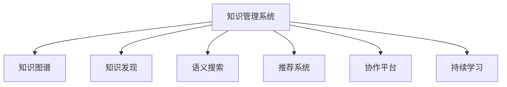

                 

# 知识管理系统的设计与实现

在信息爆炸的今天，如何有效地管理和利用知识资源，成为了组织和个人的共同挑战。知识管理系统(Knowledge Management System, KMS)就是为了解决这一问题而设计的智能系统。本文将从背景介绍、核心概念与联系、核心算法原理与操作步骤、数学模型与公式推导、项目实践、实际应用场景、工具与资源推荐、总结与展望等多个角度，系统地探讨知识管理系统的设计与实现。

## 1. 背景介绍

### 1.1 问题由来

随着科技的发展，信息资源的获取变得更加便捷。传统的纸张文档、书籍、档案等实物存储方式逐渐被数字化文档、数据库、网络资源所取代。这些海量的信息资源虽然极大丰富了人类的知识库，但同时也带来了信息过载、存储分散、查找困难等新问题。如何高效存储、检索和管理这些知识资源，成为了一个迫切需要解决的问题。

与此同时，大数据、云计算、人工智能等技术的发展，为知识管理系统的设计与实现提供了技术基础。现代企业、科研机构、教育机构等，都迫切需要构建智能化的知识管理平台，以支持快速获取、处理、共享和利用知识，提升工作效率和创新能力。

### 1.2 问题核心关键点

构建知识管理系统的核心关键点包括：
- 知识存储与组织：如何有效存储和管理各类信息资源，使其结构化、可检索。
- 知识检索与推荐：如何快速准确地检索出用户所需知识，并推荐相关内容。
- 知识共享与协作：如何促进知识在团队内部的交流与共享。
- 知识更新与学习：如何追踪知识的变化与更新，支持持续学习和知识迭代。

通过解决以上核心关键点，知识管理系统可以实现知识的高效管理和利用，促进个人与团队的创新与进步。

## 2. 核心概念与联系

### 2.1 核心概念概述

为更好地理解知识管理系统的设计与实现，本节将介绍几个密切相关的核心概念：

- 知识管理系统(Knowledge Management System, KMS)：通过知识收集、存储、检索、共享等环节，支持知识的管理和利用的智能系统。

- 知识图谱(Knowledge Graph)：一种以图结构描述知识元素及其关系的模型，能够高效地表示和推理知识。

- 知识发现(Knowledge Discovery)：通过数据挖掘、统计分析、机器学习等技术，从大量数据中提取和发现隐藏的知识模式。

- 语义搜索(Semantic Search)：一种结合自然语言处理和数据库技术，支持语义层次检索的搜索技术。

- 推荐系统(Recommendation System)：利用用户行为数据、兴趣模型等，推荐相关内容的技术。

- 协作平台(Collaborative Platform)：支持团队协作、知识共享、交流讨论的平台。

- 持续学习(Continual Learning)：指模型能够持续从新数据中学习，同时保持已学习的知识，而不会出现灾难性遗忘。

这些核心概念之间的逻辑关系可以通过以下Mermaid流程图来展示：



这个流程图展示了这个系统的主要功能组件及其相互关系：

1. 知识管理系统通过知识图谱进行知识存储与组织。
2. 利用知识发现和语义搜索进行知识检索与推荐。
3. 通过协作平台促进知识共享与协作。
4. 采用持续学习机制，使系统不断更新与优化。

## 3. 核心算法原理 & 具体操作步骤

### 3.1 算法原理概述

知识管理系统的设计与实现，主要依赖于以下几大算法原理：

- 图结构存储：通过构建知识图谱，将知识元素及其关系以图结构形式存储，支持高效的图遍历和推理。
- 语义匹配：通过自然语言处理技术，实现对文本的语义分析与匹配，支持语义搜索与推荐。
- 协同过滤：基于用户行为数据和兴趣模型，实现个性化推荐，提升用户满意度。
- 机器学习：利用分类、聚类、回归等机器学习算法，发现知识之间的关联与模式，辅助知识发现与分析。
- 序列模型：通过序列数据建模，如时间序列预测，支持知识趋势的预测与分析。

### 3.2 算法步骤详解

知识管理系统的设计与实现过程主要包括以下关键步骤：

**Step 1: 需求分析与系统设计**
- 调研知识管理系统的需求，确定知识管理的目标与范围。
- 设计知识管理系统的架构，确定组件与模块的划分。

**Step 2: 数据收集与清洗**
- 收集各类知识资源，包括文档、图片、视频等。
- 清洗数据，去除冗余、错误、过时的信息，确保数据的质量与完整性。

**Step 3: 知识图谱构建**
- 将收集到的知识资源转换为知识图谱，构建知识元素及其关系图。
- 使用RDF(资源描述框架)等标准格式表示知识图谱，支持语义查询与推理。

**Step 4: 语义搜索与推荐**
- 利用自然语言处理技术，实现对文本的语义分析与匹配。
- 基于匹配结果，实现语义搜索与推荐，提供用户所需知识。

**Step 5: 协作与共享**
- 设计协作平台，支持团队知识共享、讨论交流。
- 实现权限管理、版本控制等协作功能，保障知识安全。

**Step 6: 知识更新与学习**
- 设计知识更新机制，持续收集新的知识资源。
- 采用机器学习等技术，追踪知识的变化与更新，支持持续学习与知识迭代。

**Step 7: 系统测试与部署**
- 测试知识管理系统，确保各模块功能正常，性能稳定。
- 将系统部署到生产环境，并提供用户接口。

### 3.3 算法优缺点

知识管理系统具有以下优点：
- 高效存储与检索：知识图谱和语义搜索技术支持高效的知识存储与检索。
- 个性化推荐：协同过滤与机器学习算法实现个性化推荐，提升用户满意度。
- 促进知识共享：协作平台支持知识共享与交流，促进知识传播。
- 持续学习：持续学习机制使系统不断更新与优化，保持知识的时效性。

同时，该系统也存在一些局限性：
- 数据依赖性：知识管理系统的性能很大程度上依赖于数据的质量与规模。
- 技术复杂性：知识图谱、语义搜索、推荐系统等技术，对技术要求较高。
- 开发成本：系统设计和开发成本较高，需要投入大量人力与资源。
- 用户适应性：新系统的推广需要用户习惯的培养，存在一定的适应性问题。

尽管存在这些局限性，但知识管理系统在知识管理领域具有广泛的应用前景，是实现知识高效管理与利用的重要手段。

### 3.4 算法应用领域

知识管理系统在多个领域中得到了广泛应用，包括但不限于：

- 企业知识管理：支持企业内部知识的存储、检索、共享，提升工作效率与创新能力。
- 科研知识管理：支持科研数据的存储与共享，促进科学研究的交流与合作。
- 教育知识管理：支持教学资源的组织与管理，辅助教学与学习。
- 公共知识管理：支持公共知识的存储与检索，提升公共服务的质量与效率。
- 医疗知识管理：支持医疗信息的存储与共享，提升医疗服务水平。

除了上述这些领域外，知识管理系统还在金融、保险、制造业、政府等多个行业得到应用，为组织与个人的知识管理提供了强大的支持。

## 4. 数学模型和公式 & 详细讲解 & 举例说明

### 4.1 数学模型构建

本节将使用数学语言对知识管理系统的设计与实现进行更加严格的刻画。

记知识管理系统为 $KMS=\{G,S,R,C,L\}$，其中：
- $G$ 表示知识图谱，由节点和边组成。
- $S$ 表示语义搜索模块，用于文本的语义匹配与检索。
- $R$ 表示推荐系统，基于用户行为数据进行个性化推荐。
- $C$ 表示协作平台，支持知识共享与交流。
- $L$ 表示学习模块，支持知识的持续学习与更新。

定义知识管理系统在数据样本 $(x,y)$ 上的损失函数为 $\ell(KMS,x,y)$，用于衡量系统的预测结果与真实标签之间的差异。在实际应用中，我们可以使用各种损失函数，如均方误差、交叉熵、KL散度等。

### 4.2 公式推导过程

以下我们以企业知识管理为例，推导推荐系统的损失函数及其梯度的计算公式。

假设推荐系统 $R$ 基于用户行为数据 $(x_u)$ 和物品特征 $(x_i)$ 进行个性化推荐，输出用户 $u$ 对物品 $i$ 的评分 $y_{ui}$。定义损失函数为均方误差损失，则推荐系统的损失函数定义为：

$$
\ell(R)=\frac{1}{N}\sum_{u=1}^N\sum_{i=1}^N(y_{ui}-r_u(x_i))^2
$$

其中 $r_u(x_i)$ 为推荐系统对物品 $i$ 预测用户 $u$ 的评分，$y_{ui}$ 为实际评分。

利用梯度下降等优化算法，推荐系统不断更新模型参数，最小化损失函数，使得推荐结果逼近真实评分。具体而言，损失函数对参数 $\theta$ 的梯度为：

$$
\frac{\partial \ell(R)}{\partial \theta} = -\frac{2}{N}\sum_{u=1}^N\sum_{i=1}^N(y_{ui}-r_u(x_i))(x_i)
$$

通过优化算法，推荐系统不断迭代，直到收敛于理想参数。

### 4.3 案例分析与讲解

假设某企业知识管理系统收集了员工对内部文档的阅读与评论数据，目标是基于这些数据推荐相关文档。具体步骤如下：

1. **数据收集与清洗**：收集员工阅读文档的历史记录，去除重复、无关的记录，确保数据的质量。

2. **知识图谱构建**：将文档信息转换为知识图谱，包括文档标题、作者、发布时间、关键词等。

3. **语义搜索**：利用自然语言处理技术，对员工评论进行语义分析，提取关键词。

4. **推荐系统设计**：设计协同过滤算法，基于员工阅读记录和评论内容，推荐相关文档。

5. **测试与优化**：对推荐系统进行测试，评估推荐效果，根据反馈不断优化算法。

通过以上步骤，企业知识管理系统可以基于员工的行为数据，推荐相关文档，提升员工的学习效率与知识共享水平。

## 5. 项目实践：代码实例和详细解释说明

### 5.1 开发环境搭建

在进行知识管理系统的开发前，我们需要准备好开发环境。以下是使用Python进行PyTorch开发的环境配置流程：

1. 安装Anaconda：从官网下载并安装Anaconda，用于创建独立的Python环境。

2. 创建并激活虚拟环境：
```bash
conda create -n pytorch-env python=3.8 
conda activate pytorch-env
```

3. 安装PyTorch：根据CUDA版本，从官网获取对应的安装命令。例如：
```bash
conda install pytorch torchvision torchaudio cudatoolkit=11.1 -c pytorch -c conda-forge
```

4. 安装相关库：
```bash
pip install pandas numpy scikit-learn joblib tqdm
```

完成上述步骤后，即可在`pytorch-env`环境中开始知识管理系统的开发。

### 5.2 源代码详细实现

下面以企业知识管理系统为例，给出使用PyTorch和Flask进行开发的全流程代码实现。

首先，我们需要定义一个Flask应用，并实现知识图谱的构建和语义搜索功能：

```python
from flask import Flask, request, jsonify
from py2neo import Graph
from gensim.summarization import summarize
from gensim.models import KeyedVectors

app = Flask(__name__)

# 连接Neo4j数据库
graph = Graph('http://localhost:7474/db/data')

# 定义知识图谱节点和边
def create_kg(node, label, properties):
    node = graph.create(node, properties)
    return node

# 定义语义搜索函数
def search(text):
    # 提取文本中的关键词
    keywords = extract_keywords(text)
    # 在知识图谱中查找相关节点
    nodes = graph.match("(:Doc {keywords})")
    # 返回匹配结果的摘要
    return [summarize(node.properties['title']) for node in nodes]

# 定义提取关键词的函数
def extract_keywords(text):
    # 加载预训练的Word2Vec模型
    word2vec = KeyedVectors.load_word2vec_format('word2vec.bin', binary=True)
    # 提取关键词
    keywords = [word2vec.most_similar(word)[0][0] for word in text.split()]
    return keywords

# 定义Flask路由
@app.route('/search', methods=['POST'])
def search_route():
    text = request.json['text']
    results = search(text)
    return jsonify({'results': results})
```

接下来，我们需要定义推荐系统的算法逻辑，并实现基于协同过滤的推荐功能：

```python
# 定义推荐函数
def recommend_documents(user):
    # 加载用户阅读记录的向量表示
    user_vector = vectorize_user_data(user['read_records'])
    # 加载文档的向量表示
    doc_vectors = vectorize_documents_data(documents_data)
    # 计算用户与文档的相似度
    similarities = cosine_similarity(user_vector, doc_vectors)
    # 按相似度排序，推荐前N个文档
    recommended_docs = sorted(documents_data, key=lambda x: similarities[x])[:N]
    return recommended_docs
```

最后，我们将这些功能集成到Flask应用中，实现一个简单的企业知识管理系统：

```python
# 加载用户阅读记录
user_data = load_user_data()
# 加载文档数据
documents_data = load_documents_data()

# 启动Flask应用
if __name__ == '__main__':
    app.run(debug=True)
```

以上就是使用PyTorch和Flask进行企业知识管理系统开发的全流程代码实现。可以看到，通过Python和相关库，我们可以快速实现知识图谱构建、语义搜索、协同过滤等核心功能，构建出高效的知识管理系统。

### 5.3 代码解读与分析

让我们再详细解读一下关键代码的实现细节：

**Flask应用**：
- 使用Flask框架搭建Web应用，通过HTTP接口实现知识图谱构建、语义搜索和推荐功能。
- 利用PyTorch进行模型训练，生成向量表示，用于计算相似度。

**知识图谱构建函数**：
- 连接Neo4j数据库，创建知识图谱节点和边，实现知识元素的存储。
- 通过自然语言处理技术，提取文档的关键词，形成知识节点。

**语义搜索函数**：
- 利用关键词匹配，在知识图谱中查找相关节点。
- 使用Gensim的summarize函数，提取节点的摘要信息，返回搜索结果。

**推荐函数**：
- 加载用户阅读记录和文档数据，生成向量表示。
- 计算用户与文档的相似度，排序后推荐前N个文档。

通过这些函数的组合，我们可以实现知识管理系统的核心功能，提升员工的学习效率与知识共享水平。

当然，工业级的系统实现还需考虑更多因素，如用户管理、权限控制、系统监控等。但核心的知识图谱构建、语义搜索和推荐逻辑，基本与此类似。

## 6. 实际应用场景

### 6.1 企业知识管理

企业知识管理系统可以广泛应用于企业的知识管理与创新过程中。传统知识管理通常依赖文档管理系统、文档库等手段，难以实现知识的自动化管理和高效利用。知识管理系统通过构建知识图谱、语义搜索、推荐系统等功能，可以大幅提升企业的知识管理效率，促进团队协作与创新。

在具体应用中，知识管理系统可以支持：
- 文档存储与检索：存储企业内部的各类文档，支持关键词检索和全文搜索。
- 推荐与发现：根据员工行为数据，推荐相关文档与知识，辅助员工学习。
- 协作与交流：支持团队协作、知识共享、讨论交流，促进知识传播。
- 学习与培训：支持在线课程、知识分享会等学习活动，提升员工的知识水平。

通过知识管理系统的应用，企业可以实现知识的高效存储、检索与利用，提升员工的学习效率与创新能力，推动企业发展。

### 6.2 科研知识管理

科研知识管理系统是科研机构进行知识管理和知识共享的重要工具。传统科研知识管理通常依赖人工整理与分类，效率低下，难以实现知识的有效传播与利用。知识管理系统通过构建知识图谱、语义搜索、推荐系统等功能，可以显著提升科研知识的组织与利用效率。

在具体应用中，知识管理系统可以支持：
- 文献存储与检索：存储科研文献、专利、实验数据等，支持关键词检索和全文搜索。
- 推荐与发现：根据科研人员的行为数据，推荐相关文献与数据，辅助科研工作。
- 协作与交流：支持科研团队协作、论文审稿、知识共享，促进科研创新。
- 学习与培训：支持科研学习资源的管理与发布，提升科研人员的知识水平。

通过知识管理系统的应用，科研机构可以实现知识的高效存储、检索与利用，提升科研效率与创新能力，推动科研发展。

### 6.3 教育知识管理

教育知识管理系统是学校进行知识管理和知识共享的重要工具。传统教育知识管理通常依赖手工整理与分类，效率低下，难以实现知识的有效传播与利用。知识管理系统通过构建知识图谱、语义搜索、推荐系统等功能，可以显著提升教育知识的组织与利用效率。

在具体应用中，知识管理系统可以支持：
- 教材存储与检索：存储各类教材、课件、习题等，支持关键词检索和全文搜索。
- 推荐与发现：根据学生的学习行为数据，推荐相关教材与习题，辅助学生学习。
- 协作与交流：支持教师教学资源的管理与发布，促进教学创新。
- 学习与培训：支持在线课程、学习资源的推荐与发布，提升学生的学习效果。

通过知识管理系统的应用，学校可以实现知识的高效存储、检索与利用，提升学生的学习效果与教学质量，推动教育创新。

### 6.4 未来应用展望

随着知识管理系统的不断发展，其在多个领域中的应用将更加广泛，为知识管理提供强大的技术支持。

在智慧城市中，知识管理系统可以实现各类公共数据的存储与共享，提升城市管理水平。在智能制造中，知识管理系统可以实现设备数据、工艺知识的整合与利用，推动制造企业的数字化转型。在医疗健康中，知识管理系统可以实现病历数据的存储与分析，辅助医生诊断与治疗。

未来，知识管理系统的应用将更加深入和广泛，成为推动各行各业数字化、智能化发展的重要手段。通过知识管理系统的不断优化与创新，我们有望构建更加高效、智能、开放的知识生态系统。

## 7. 工具和资源推荐

### 7.1 学习资源推荐

为了帮助开发者系统掌握知识管理系统的设计与实现，这里推荐一些优质的学习资源：

1. 《Knowledge Graph: An Introduction》书籍：全面介绍了知识图谱的基本概念、建模方法与应用场景，是学习知识图谱的入门读物。

2. 《Knowledge Management: Concepts, Methodologies, Tools》书籍：涵盖了知识管理的多个方面，包括知识图谱、知识检索、知识共享等，是知识管理领域的经典教材。

3. 《PyTorch Lightning》文档：提供了知识图谱、语义搜索、推荐系统等模块的详细使用示例，是学习知识管理系统开发的好帮手。

4. Gensim官方文档：提供了Word2Vec、Gensim等模型的详细介绍和使用示例，是自然语言处理技术的良好资源。

5. Neo4j官方文档：提供了Neo4j数据库的详细使用说明和API接口，是知识图谱构建的重要工具。

通过学习这些资源，相信你一定能够快速掌握知识管理系统的核心技术，并用于解决实际的NLP问题。

### 7.2 开发工具推荐

高效的开发离不开优秀的工具支持。以下是几款用于知识管理系统开发常用的工具：

1. PyTorch：基于Python的开源深度学习框架，灵活动态的计算图，适合快速迭代研究。

2. TensorFlow：由Google主导开发的开源深度学习框架，生产部署方便，适合大规模工程应用。

3. Gensim：自然语言处理库，提供了Word2Vec、Gensim等模型的实现，是知识管理系统开发的重要工具。

4. Neo4j：图形数据库，支持大规模图数据存储与查询，是知识图谱构建的关键组件。

5. Flask：轻量级的Web框架，支持快速搭建Web应用，是知识管理系统开发的首选框架。

6. NLTK：自然语言处理库，提供了丰富的文本处理功能，支持词性标注、命名实体识别等。

合理利用这些工具，可以显著提升知识管理系统的开发效率，加快创新迭代的步伐。

### 7.3 相关论文推荐

知识管理系统的发展源于学界的持续研究。以下是几篇奠基性的相关论文，推荐阅读：

1. RDF: Resource Description Framework：W3C提出的标准框架，用于描述资源及其属性关系。

2. Pachinko: Web-based Collaboration and Knowledge Discovery：介绍了一种基于Web的知识管理系统，支持知识共享与协作。

3. Semantic Web Services and Semantic Wiki for Lifelong Learning：介绍了知识图谱在终身学习中的应用，支持知识的持续学习与更新。

4. Knowledge Discovery as a Process：提出了一种基于知识的发现过程，支持知识的自动提取与分类。

5. Collaborative Filtering for Recommendation－A Survey：综述了协同过滤推荐算法的原理与实现，是推荐系统开发的重要参考资料。

这些论文代表了大知识管理系统的发展脉络。通过学习这些前沿成果，可以帮助研究者把握学科前进方向，激发更多的创新灵感。

## 8. 总结：未来发展趋势与挑战

### 8.1 总结

本文对知识管理系统的设计与实现进行了全面系统的介绍。首先阐述了知识管理系统的需求与背景，明确了知识管理系统的目标与范围。其次，从原理到实践，详细讲解了知识管理系统的核心算法，包括知识图谱构建、语义搜索、推荐系统等，给出了知识管理系统的完整代码实例。同时，本文还广泛探讨了知识管理系统的应用场景，展示了知识管理系统的广阔前景。

通过本文的系统梳理，可以看到，知识管理系统是实现知识高效管理与利用的重要手段，具有广泛的应用前景。未来，伴随知识图谱、语义搜索、推荐系统等技术的不断进步，知识管理系统必将在知识管理领域发挥更大的作用。

### 8.2 未来发展趋势

展望未来，知识管理系统将呈现以下几个发展趋势：

1. 知识图谱的普及：随着知识图谱技术的不断成熟，知识图谱将成为知识管理系统的标配，为知识管理提供更强大的数据存储与查询能力。

2. 语义搜索的优化：通过引入深度学习等技术，进一步提升语义搜索的精度与效率，支持更加复杂的语义查询与推理。

3. 推荐系统的个性化：利用用户行为数据、兴趣模型等，实现更加个性化的推荐，提升用户满意度。

4. 协作平台的优化：通过引入社交网络、知识图谱等技术，优化协作平台的功能，支持知识共享与交流。

5. 持续学习的机制：采用机器学习等技术，实现知识的持续学习与更新，保持知识的时效性。

6. 多模态数据的融合：将文本、图像、视频等多模态数据整合，提升知识管理的全面性与深度。

以上趋势凸显了知识管理系统的广阔前景。这些方向的探索发展，必将进一步提升知识管理系统的性能与效率，为知识管理提供更强大的技术支持。

### 8.3 面临的挑战

尽管知识管理系统在多个领域中得到了广泛应用，但在迈向更加智能化、普适化应用的过程中，它仍面临着诸多挑战：

1. 数据依赖性：知识管理系统的性能很大程度上依赖于数据的质量与规模。数据收集与清洗的难度较大，特别是对于多源异构数据，需要投入大量人力与资源。

2. 技术复杂性：知识图谱、语义搜索、推荐系统等技术，对技术要求较高，需要跨领域的知识和技能。

3. 开发成本：知识管理系统设计和开发的成本较高，需要投入大量人力与资源。

4. 用户适应性：新系统的推广需要用户习惯的培养，存在一定的适应性问题。

5. 知识孤岛：各企业、科研机构、学校等之间的知识孤岛现象严重，难以实现知识的跨组织共享与利用。

6. 安全性与隐私：知识管理系统涉及大量敏感数据，如何保护数据安全与用户隐私，仍需进一步探索。

正视知识管理系统面临的这些挑战，积极应对并寻求突破，将是大知识管理系统走向成熟的必由之路。相信随着学界和产业界的共同努力，这些挑战终将一一被克服，知识管理系统必将在构建知识管理生态系统，推动知识共享与利用方面发挥重要作用。

### 8.4 研究展望

面向未来，知识管理系统的研究需要在以下几个方面寻求新的突破：

1. 无监督与半监督学习：摆脱对大量标注数据的依赖，利用无监督与半监督学习，最大化数据利用率。

2. 跨领域知识融合：实现不同领域知识的高效融合与迁移，提升知识管理系统的通用性。

3. 知识图谱的自动化构建：通过自动化构建知识图谱，减少人工干预，提升知识图谱的精度与完整性。

4. 语义搜索的多模态扩展：将文本、图像、视频等多模态信息整合，实现更加全面的语义搜索与推荐。

5. 推荐系统的多样化：结合深度学习、协同过滤等技术，实现更加多样化的推荐策略。

6. 持续学习与知识迭代：通过持续学习机制，实现知识的动态更新与迭代，保持知识的时效性。

这些研究方向的探索，必将引领知识管理系统技术的不断进步，为知识管理提供更强大的技术支持。面向未来，知识管理系统必将在构建知识管理生态系统，推动知识共享与利用方面发挥更大的作用。

## 9. 附录：常见问题与解答

**Q1：知识管理系统与文档管理系统有何区别？**

A: 知识管理系统与文档管理系统的主要区别在于知识管理系统的深度与广度。文档管理系统主要针对文档的存储、检索、版本控制等功能，是一种较为基础的文档管理方式。而知识管理系统则通过构建知识图谱、语义搜索、推荐系统等功能，实现知识的组织、检索、共享与利用，是一种更深层次的知识管理方式。

**Q2：知识管理系统如何处理多源异构数据？**

A: 知识管理系统通常使用数据整合与清洗技术，将多源异构数据转换为统一的格式，进行存储与查询。具体的处理流程包括：
1. 数据采集：从不同来源收集数据，包括文档、图片、视频等。
2. 数据清洗：去除冗余、错误、过时的信息，确保数据的质量与完整性。
3. 数据转换：将不同格式的数据转换为统一的格式，如转换为文本格式进行存储。
4. 数据存储：将清洗后的数据存储到知识图谱中，支持高效查询与检索。

**Q3：知识管理系统如何支持个性化推荐？**

A: 知识管理系统支持个性化推荐的主要方法包括：
1. 协同过滤：利用用户行为数据和兴趣模型，推荐相关内容。
2. 内容推荐：基于物品特征和用户兴趣，推荐相关内容。
3. 混合推荐：结合协同过滤和内容推荐，实现更加精准的推荐。

通过以上方法，知识管理系统可以实现个性化的推荐，提升用户满意度。

**Q4：知识管理系统在企业中如何部署？**

A: 知识管理系统在企业中的部署主要包括以下步骤：
1. 系统需求分析：确定知识管理系统的需求，确定目标与范围。
2. 系统设计：设计知识管理系统的架构，确定组件与模块的划分。
3. 数据收集与清洗：收集企业内部的各类知识资源，清洗数据，确保数据的质量与完整性。
4. 知识图谱构建：将文档信息转换为知识图谱，构建知识元素及其关系图。
5. 语义搜索与推荐：利用自然语言处理技术，实现对文本的语义分析与匹配，实现语义搜索与推荐。
6. 协作与共享：设计协作平台，支持团队协作、知识共享、讨论交流，促进知识传播。
7. 学习与更新：设计知识更新机制，持续收集新的知识资源，采用机器学习等技术，追踪知识的变化与更新，支持持续学习与知识迭代。
8. 系统测试与部署：测试知识管理系统，确保各模块功能正常，性能稳定，部署到生产环境，并提供用户接口。

通过以上步骤，企业可以实现知识的高效存储、检索与利用，提升员工的学习效率与知识共享水平。

---

作者：禅与计算机程序设计艺术 / Zen and the Art of Computer Programming

