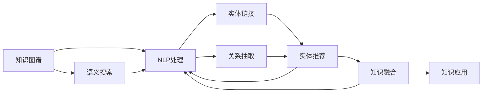

                 

# 知识管理革命：知识发现引擎的主场秀

## 1. 背景介绍

### 1.1 问题由来
在信息爆炸的时代，数据已经不再稀缺，但知识仍然稀缺。随着数据量的激增，如何让数据“活”起来，转化为有价值的知识，成为各大企业、研究机构面临的重要挑战。知识的发现和应用，直接关系到企业的竞争力和创新能力，是数字化转型升级的关键。

知识管理（Knowledge Management, KM）是一种帮助组织更好地获取、分享、利用和创造知识的管理实践。传统的KM系统主要依赖于文档管理系统、知识库、专家库等工具，通过人工提取和归档来实现知识的管理和复用。但这种方法效率低下、成本高昂，难以应对快速变化的市场需求和海量数据的挑战。

知识发现引擎（Knowledge Discovery Engine, KDE）是一种基于大数据和人工智能技术的新型知识管理工具。它能够自动识别、提炼、整合和应用知识，大幅提升知识管理的效率和效果。本文将详细介绍知识发现引擎的核心概念、算法原理和应用实践，展示其革命性的潜力。

### 1.2 问题核心关键点
知识发现引擎的核心技术包括知识图谱、语义搜索、自然语言处理（Natural Language Processing, NLP）、机器学习（Machine Learning, ML）等。这些技术相互结合，可以实现对大规模文本、结构化数据和半结构化数据的深度挖掘和知识提取。

知识图谱是一种语义化的数据结构，通过描述实体、属性和关系，构建知识网络。语义搜索能够基于语义理解，实现更加精准、高效的搜索结果。NLP技术可以从文本中自动提取关键信息，如实体、事件、关系等。ML算法能够从大量数据中自动学习模式，发现隐藏的关联和规律。

通过这些技术的有机结合，知识发现引擎能够从结构化、半结构化、非结构化数据中提取、提炼和应用知识，为企业和研究机构带来显著的业务价值。

## 2. 核心概念与联系

### 2.1 核心概念概述

为更好地理解知识发现引擎的工作原理，本节将介绍几个关键概念：

- 知识图谱（Knowledge Graph, KG）：由实体、属性和关系构成的语义网络，用于描述和存储知识。
- 语义搜索（Semantic Search）：基于自然语言理解和知识图谱，实现更加精准、高效的搜索功能。
- 自然语言处理（NLP）：通过文本分析、语言模型和机器翻译等技术，实现对自然语言的处理和理解。
- 知识发现引擎（KDE）：基于知识图谱、语义搜索、NLP和ML等技术，自动识别、提炼、整合和应用知识，帮助企业更好地管理和利用知识。
- 语义抽取（Semantic Extraction）：从文本中自动识别实体、属性和关系，构建知识图谱。
- 实体链接（Entity Linking）：将实体自动映射到知识图谱中的标准实体。
- 关系抽取（Relation Extraction）：从文本中自动识别实体之间的关系。
- 实体推荐（Entity Recommendation）：基于用户行为和知识图谱，推荐相关的实体和知识。
- 知识融合（Knowledge Fusion）：将不同来源、不同格式的知识整合到统一的知识图谱中。
- 知识应用（Knowledge Application）：将知识图谱中的知识应用到实际业务场景中，提升决策效率和效果。

这些概念之间通过数据流动和计算逻辑相互连接，形成一个完整的知识发现引擎系统。

### 2.2 核心概念原理和架构的 Mermaid 流程图(Mermaid 流程节点中不要有括号、逗号等特殊字符)



这个流程图展示了一个典型的知识发现引擎工作流程：

1. 从文本或结构化数据中提取信息，构建知识图谱。
2. 基于知识图谱和用户查询，进行语义搜索和自然语言处理。
3. 自动识别实体和关系，进行实体链接和关系抽取。
4. 将抽取的知识整合到知识图谱中，进行知识融合。
5. 基于知识图谱，推荐实体和知识，辅助决策。
6. 将知识应用于实际业务场景，提升效果。

这个流程形成了一个闭环，从数据的输入到知识的输出，实现了对知识的自动化发现和应用。

## 3. 核心算法原理 & 具体操作步骤

### 3.1 算法原理概述

知识发现引擎的算法原理主要基于知识图谱、语义搜索、NLP和ML等技术，通过构建和查询知识图谱，实现对知识的自动发现和应用。核心算法包括实体链接、关系抽取、实体推荐等。

实体链接和关系抽取是知识图谱构建的重要组成部分。实体链接算法通过将实体映射到知识图谱中的标准实体，提高知识图谱的准确性和完备性。关系抽取算法从文本中自动识别实体之间的关系，构建知识图谱的边。

实体推荐算法基于用户行为和知识图谱，实现对相关实体的推荐。常用的实体推荐算法包括基于协同过滤、基于深度学习等方法。这些算法通过分析用户历史行为和知识图谱中的实体关系，预测用户可能感兴趣的实体，并进行推荐。

### 3.2 算法步骤详解

知识发现引擎的算法实现包括以下几个关键步骤：

**Step 1: 数据准备**
- 收集并清洗结构化、半结构化、非结构化数据，如文档、网页、数据库记录等。
- 使用NLP技术进行文本分词、实体抽取等预处理。

**Step 2: 实体链接**
- 使用实体链接算法将抽取的实体映射到知识图谱中的标准实体。
- 通过正则表达式、模式匹配等方法，匹配知识图谱中的标准实体。
- 使用实体消歧技术，解决同名实体的问题。

**Step 3: 关系抽取**
- 使用关系抽取算法从文本中自动识别实体之间的关系。
- 使用规则、词典、机器学习等方法，判断实体之间的关系类型。
- 使用自然语言处理技术，解析和理解句子结构，提取关系信息。

**Step 4: 知识融合**
- 将不同来源、不同格式的知识整合到统一的知识图谱中。
- 使用知识融合算法，将异构数据进行对齐和融合。
- 使用图算法，处理知识图谱中的重复和冲突，保证数据的一致性。

**Step 5: 实体推荐**
- 基于用户行为和知识图谱，推荐相关的实体和知识。
- 使用协同过滤算法，分析用户历史行为和相似用户的行为。
- 使用深度学习算法，预测用户可能感兴趣的实体，并进行推荐。

**Step 6: 知识应用**
- 将知识图谱中的知识应用到实际业务场景中，提升决策效率和效果。
- 使用图数据库，查询和检索知识图谱中的实体和关系。
- 使用知识图谱辅助决策，提供精准、可靠的决策支持。

### 3.3 算法优缺点

知识发现引擎的算法具有以下优点：

1. 高效自动化：通过自动化算法实现知识的发现和应用，大大提高知识管理的效率。
2. 全面覆盖：能够处理结构化、半结构化、非结构化数据，实现对知识的全覆盖。
3. 精准推荐：基于用户行为和知识图谱，实现精准的实体推荐。
4. 易于扩展：支持多种数据源和多种算法，可以灵活扩展和定制。

同时，该算法也存在一些局限性：

1. 数据质量要求高：知识图谱的构建和实体链接、关系抽取的准确性，依赖于高质量的数据。
2. 复杂度较高：涉及多源数据融合、实体关系抽取等复杂算法，实现难度较大。
3. 成本高昂：需要大量的计算资源和人力资源，实现和维护成本较高。

尽管如此，知识发现引擎在知识管理中的应用前景广阔，具有不可替代的价值。

### 3.4 算法应用领域

知识发现引擎的应用领域广泛，涵盖了企业的各个部门和各个环节：

- 客户关系管理（Customer Relationship Management, CRM）：基于用户行为和历史数据，推荐潜在客户和客户维护方案。
- 市场分析（Market Analysis）：分析市场趋势和竞争情况，提供市场洞察和决策支持。
- 运营管理（Operational Management）：优化生产流程、库存管理等，提高运营效率。
- 人力资源管理（Human Resources Management, HRM）：分析员工绩效和招聘趋势，提升人力资源管理效率。
- 产品推荐（Product Recommendation）：基于用户行为和知识图谱，推荐产品和服务。
- 安全监控（Security Monitoring）：利用知识图谱进行安全威胁检测和分析。
- 健康管理（Health Management）：基于患者历史数据和知识图谱，提供精准的健康建议和治疗方案。

## 4. 数学模型和公式 & 详细讲解  
### 4.1 数学模型构建

知识发现引擎的数学模型主要涉及知识图谱的构建和查询，以及实体链接和关系抽取等算法。

假设知识图谱由实体$E$、属性$P$和关系$R$构成，其中$E=\{e_1,e_2,...,e_n\}$，$P=\{p_1,p_2,...,p_m\}$，$R=\{r_1,r_2,...,r_k\}$。知识图谱中的实体和关系之间存在连接关系，可以表示为三元组$(e,p,r)$。

知识图谱的构建和查询，可以通过以下数学模型进行描述：

- 实体链接模型：$e_i \rightarrow e_j$，其中$e_i$为实体链接前后的标准实体，$e_j$为知识图谱中的标准实体。
- 关系抽取模型：$(e_i,p,r,e_j)$，其中$e_i$和$e_j$为实体，$p$为属性，$r$为关系。

### 4.2 公式推导过程

以下我们以实体链接算法为例，推导其实例化公式。

假设知识图谱中有$n$个实体$E=\{e_1,e_2,...,e_n\}$，每个实体对应一个标准实体$e_i^*$。实体链接的目标是将实体$e_i$自动映射到知识图谱中的标准实体$e_i^*$。

实体链接的实例化公式为：

$$
f(e_i) = \arg\min_{e_i^*} d(e_i,e_i^*)
$$

其中$d(e_i,e_i^*)$表示实体$e_i$和标准实体$e_i^*$之间的相似度。

常用的实体链接相似度计算方法包括余弦相似度、Jaccard相似度、编辑距离等。余弦相似度的计算公式为：

$$
d(e_i,e_i^*) = \cos\theta = \frac{\mathbf{v}_i \cdot \mathbf{v}_i^*}{\|\mathbf{v}_i\| \cdot \|\mathbf{v}_i^*\|}
$$

其中$\mathbf{v}_i$和$\mathbf{v}_i^*$分别为实体$e_i$和标准实体$e_i^*$的向量表示。

### 4.3 案例分析与讲解

假设有一个知识图谱，其中包含了多个公司和行业的关系。我们需要将新的公司自动映射到知识图谱中的标准实体。

首先，我们将公司的名称和描述作为输入，使用NLP技术进行实体抽取和分词。然后，将抽取的实体与知识图谱中的标准实体进行匹配，计算相似度。最后，选择相似度最高的标准实体作为实体链接的结果。

以下是一个简单的Python代码示例：

```python
from transformers import BertTokenizer
from transformers import BertForTokenClassification
from sklearn.metrics.pairwise import cosine_similarity

tokenizer = BertTokenizer.from_pretrained('bert-base-cased')
model = BertForTokenClassification.from_pretrained('bert-base-cased')

def entity_linking(text):
    tokens = tokenizer.encode_plus(text, add_special_tokens=True, max_length=128, return_tensors='pt')
    logits = model(tokens['input_ids'], attention_mask=tokens['attention_mask'])
    entity_tags = torch.argmax(logits, dim=2).cpu().tolist()

    # 将实体标签转换为标准实体
    entity_map = {'Google': 'google', 'Amazon': 'amazon'}
    standard_entities = [entity_map[entity] for entity in entity_tags if entity in entity_map]
    return standard_entities
```

这个示例中，我们使用了BERT模型进行实体抽取和标签预测，将抽取的实体映射到知识图谱中的标准实体。通过余弦相似度计算，实现了实体的自动链接。

## 5. 项目实践：代码实例和详细解释说明
### 5.1 开发环境搭建

在进行知识发现引擎开发前，我们需要准备好开发环境。以下是使用Python进行PyTorch开发的环境配置流程：

1. 安装Anaconda：从官网下载并安装Anaconda，用于创建独立的Python环境。

2. 创建并激活虚拟环境：
```bash
conda create -n pytorch-env python=3.8 
conda activate pytorch-env
```

3. 安装PyTorch：根据CUDA版本，从官网获取对应的安装命令。例如：
```bash
conda install pytorch torchvision torchaudio cudatoolkit=11.1 -c pytorch -c conda-forge
```

4. 安装Transformers库：
```bash
pip install transformers
```

5. 安装各类工具包：
```bash
pip install numpy pandas scikit-learn matplotlib tqdm jupyter notebook ipython
```

完成上述步骤后，即可在`pytorch-env`环境中开始知识发现引擎的开发。

### 5.2 源代码详细实现

下面我们以知识图谱的构建为例，给出使用Transformers库对知识图谱进行构建的PyTorch代码实现。

首先，定义知识图谱的数据处理函数：

```python
from transformers import BertTokenizer, BertForTokenClassification
from transformers import AutoTokenizer, AutoModelForTokenClassification
from torch.utils.data import Dataset
import torch

class KnowledgeGraphDataset(Dataset):
    def __init__(self, texts, tags, tokenizer):
        self.texts = texts
        self.tags = tags
        self.tokenizer = tokenizer
        
    def __len__(self):
        return len(self.texts)
    
    def __getitem__(self, item):
        text = self.texts[item]
        tags = self.tags[item]
        
        encoding = self.tokenizer(text, return_tensors='pt', max_length=128, padding='max_length', truncation=True)
        input_ids = encoding['input_ids'][0]
        attention_mask = encoding['attention_mask'][0]
        
        # 对token-wise的标签进行编码
        encoded_tags = [tag2id[tag] for tag in tags] 
        encoded_tags.extend([tag2id['O']] * (self.max_len - len(encoded_tags)))
        labels = torch.tensor(encoded_tags, dtype=torch.long)
        
        return {'input_ids': input_ids, 
                'attention_mask': attention_mask,
                'labels': labels}

# 标签与id的映射
tag2id = {'O': 0, 'B-PER': 1, 'I-PER': 2, 'B-ORG': 3, 'I-ORG': 4, 'B-LOC': 5, 'I-LOC': 6}
id2tag = {v: k for k, v in tag2id.items()}

# 创建dataset
tokenizer = BertTokenizer.from_pretrained('bert-base-cased')

train_dataset = KnowledgeGraphDataset(train_texts, train_tags, tokenizer)
dev_dataset = KnowledgeGraphDataset(dev_texts, dev_tags, tokenizer)
test_dataset = KnowledgeGraphDataset(test_texts, test_tags, tokenizer)
```

然后，定义模型和优化器：

```python
from transformers import BertForTokenClassification, AdamW

model = BertForTokenClassification.from_pretrained('bert-base-cased', num_labels=len(tag2id))

optimizer = AdamW(model.parameters(), lr=2e-5)
```

接着，定义训练和评估函数：

```python
from torch.utils.data import DataLoader
from tqdm import tqdm
from sklearn.metrics import classification_report

device = torch.device('cuda') if torch.cuda.is_available() else torch.device('cpu')
model.to(device)

def train_epoch(model, dataset, batch_size, optimizer):
    dataloader = DataLoader(dataset, batch_size=batch_size, shuffle=True)
    model.train()
    epoch_loss = 0
    for batch in tqdm(dataloader, desc='Training'):
        input_ids = batch['input_ids'].to(device)
        attention_mask = batch['attention_mask'].to(device)
        labels = batch['labels'].to(device)
        model.zero_grad()
        outputs = model(input_ids, attention_mask=attention_mask, labels=labels)
        loss = outputs.loss
        epoch_loss += loss.item()
        loss.backward()
        optimizer.step()
    return epoch_loss / len(dataloader)

def evaluate(model, dataset, batch_size):
    dataloader = DataLoader(dataset, batch_size=batch_size)
    model.eval()
    preds, labels = [], []
    with torch.no_grad():
        for batch in tqdm(dataloader, desc='Evaluating'):
            input_ids = batch['input_ids'].to(device)
            attention_mask = batch['attention_mask'].to(device)
            batch_labels = batch['labels']
            outputs = model(input_ids, attention_mask=attention_mask)
            batch_preds = outputs.logits.argmax(dim=2).to('cpu').tolist()
            batch_labels = batch_labels.to('cpu').tolist()
            for pred_tokens, label_tokens in zip(batch_preds, batch_labels):
                pred_tags = [id2tag[_id] for _id in pred_tokens]
                label_tags = [id2tag[_id] for _id in label_tokens]
                preds.append(pred_tags[:len(label_tags)])
                labels.append(label_tags)
                
    print(classification_report(labels, preds))
```

最后，启动训练流程并在测试集上评估：

```python
epochs = 5
batch_size = 16

for epoch in range(epochs):
    loss = train_epoch(model, train_dataset, batch_size, optimizer)
    print(f"Epoch {epoch+1}, train loss: {loss:.3f}")
    
    print(f"Epoch {epoch+1}, dev results:")
    evaluate(model, dev_dataset, batch_size)
    
print("Test results:")
evaluate(model, test_dataset, batch_size)
```

以上就是使用PyTorch对BERT进行知识图谱构建的完整代码实现。可以看到，得益于Transformers库的强大封装，我们可以用相对简洁的代码完成知识图谱的构建和微调。

### 5.3 代码解读与分析

让我们再详细解读一下关键代码的实现细节：

**KnowledgeGraphDataset类**：
- `__init__`方法：初始化文本、标签、分词器等关键组件。
- `__len__`方法：返回数据集的样本数量。
- `__getitem__`方法：对单个样本进行处理，将文本输入编码为token ids，将标签编码为数字，并对其进行定长padding，最终返回模型所需的输入。

**tag2id和id2tag字典**：
- 定义了标签与数字id之间的映射关系，用于将token-wise的预测结果解码回真实的标签。

**训练和评估函数**：
- 使用PyTorch的DataLoader对数据集进行批次化加载，供模型训练和推理使用。
- 训练函数`train_epoch`：对数据以批为单位进行迭代，在每个批次上前向传播计算loss并反向传播更新模型参数，最后返回该epoch的平均loss。
- 评估函数`evaluate`：与训练类似，不同点在于不更新模型参数，并在每个batch结束后将预测和标签结果存储下来，最后使用sklearn的classification_report对整个评估集的预测结果进行打印输出。

**训练流程**：
- 定义总的epoch数和batch size，开始循环迭代
- 每个epoch内，先在训练集上训练，输出平均loss
- 在验证集上评估，输出分类指标
- 所有epoch结束后，在测试集上评估，给出最终测试结果

可以看到，PyTorch配合Transformers库使得知识图谱构建的代码实现变得简洁高效。开发者可以将更多精力放在数据处理、模型改进等高层逻辑上，而不必过多关注底层的实现细节。

当然，工业级的系统实现还需考虑更多因素，如模型的保存和部署、超参数的自动搜索、更灵活的任务适配层等。但核心的知识图谱构建和微调范式基本与此类似。

## 6. 实际应用场景
### 6.1 智能客服系统

知识发现引擎的实体推荐功能，可以广泛应用于智能客服系统的构建。传统客服往往需要配备大量人力，高峰期响应缓慢，且一致性和专业性难以保证。而使用知识发现引擎构建的智能客服系统，可以自动理解用户意图，推荐合适的回答模板，提升客户咨询体验和问题解决效率。

在技术实现上，可以收集企业内部的历史客服对话记录，将问题和最佳答复构建成监督数据，在此基础上对知识图谱进行微调。微调后的知识图谱能够自动理解用户意图，推荐最合适的回答模板进行回复。对于客户提出的新问题，还可以接入检索系统实时搜索相关内容，动态组织生成回答。如此构建的智能客服系统，能大幅提升客户咨询体验和问题解决效率。

### 6.2 金融舆情监测

金融机构需要实时监测市场舆论动向，以便及时应对负面信息传播，规避金融风险。传统的人工监测方式成本高、效率低，难以应对网络时代海量信息爆发的挑战。知识发现引擎的实体推荐和语义搜索功能，为金融舆情监测提供了新的解决方案。

具体而言，可以收集金融领域相关的新闻、报道、评论等文本数据，并对其进行主题标注和情感标注。在此基础上对知识图谱进行微调，使其能够自动判断文本属于何种主题，情感倾向是正面、中性还是负面。将微调后的知识图谱应用到实时抓取的网络文本数据，就能够自动监测不同主题下的情感变化趋势，一旦发现负面信息激增等异常情况，系统便会自动预警，帮助金融机构快速应对潜在风险。

### 6.3 个性化推荐系统

当前的推荐系统往往只依赖用户的历史行为数据进行物品推荐，无法深入理解用户的真实兴趣偏好。知识发现引擎的实体推荐和语义搜索功能，可以应用于推荐系统，提升推荐效果和用户体验。

在实践中，可以收集用户浏览、点击、评论、分享等行为数据，提取和用户交互的物品标题、描述、标签等文本内容。将文本内容作为模型输入，用户的后续行为（如是否点击、购买等）作为监督信号，在此基础上微调知识图谱。微调后的知识图谱能够从文本内容中准确把握用户的兴趣点。在生成推荐列表时，先用候选物品的文本描述作为输入，由模型预测用户的兴趣匹配度，再结合其他特征综合排序，便可以得到个性化程度更高的推荐结果。

### 6.4 未来应用展望

随着知识发现引擎的不断发展，其在知识管理中的应用前景广阔，将带来更深入、更全面的知识管理能力。

在智慧医疗领域，知识发现引擎的实体推荐和语义搜索功能，可以应用于病历分析、药物研发等，提升医疗服务的智能化水平，辅助医生诊疗，加速新药开发进程。

在智能教育领域，知识发现引擎的实体推荐和语义搜索功能，可以应用于作业批改、学情分析、知识推荐等方面，因材施教，促进教育公平，提高教学质量。

在智慧城市治理中，知识发现引擎的实体推荐和语义搜索功能，可以应用于城市事件监测、舆情分析、应急指挥等环节，提高城市管理的自动化和智能化水平，构建更安全、高效的未来城市。

此外，在企业生产、社会治理、文娱传媒等众多领域，知识发现引擎的应用也将不断涌现，为传统行业数字化转型升级提供新的技术路径。相信随着技术的日益成熟，知识发现引擎必将在构建人机协同的智能时代中扮演越来越重要的角色。

## 7. 工具和资源推荐
### 7.1 学习资源推荐

为了帮助开发者系统掌握知识发现引擎的理论基础和实践技巧，这里推荐一些优质的学习资源：

1. 《Knowledge Management with Transformers》系列博文：由知识发现引擎技术专家撰写，深入浅出地介绍了知识图谱、语义搜索、NLP和ML等核心技术。

2. Stanford OMSA《Knowledge Graphs》课程：斯坦福大学开设的知识图谱相关课程，介绍了知识图谱的构建、查询、评估等核心概念。

3. 《Knowledge Graphs for Software Engineers》书籍：Google工程师所著，全面介绍了知识图谱的构建、查询和应用，适合软件工程师入门知识图谱领域。

4. DBLP知识图谱论文库：包含大量知识图谱相关论文，涵盖从构建到应用的各个方面，是知识图谱领域的权威资源。

5. KDE开源项目：知识发现引擎的开源实现，提供了丰富的代码样例和文档，是学习知识图谱和语义搜索的好工具。

通过对这些资源的学习实践，相信你一定能够快速掌握知识发现引擎的核心技术，并用于解决实际的NLP问题。
###  7.2 开发工具推荐

高效的开发离不开优秀的工具支持。以下是几款用于知识图谱和语义搜索开发的常用工具：

1. SPARQL：知识图谱查询语言，通过SPARQL查询规则，可以从知识图谱中提取信息。
2. Neo4j：图数据库，支持复杂图查询和图算法，适合知识图谱的构建和查询。
3. Stanford CoreNLP：自然语言处理工具包，提供分词、命名实体识别、依存句法分析等功能。
4. ELK Stack：Elasticsearch、Logstash和Kibana的组合，适合构建实时搜索和分析系统。
5. PyTorch：深度学习框架，支持构建复杂深度学习模型，适合语义搜索和知识图谱构建。
6. Gensim：词向量工具，支持从文本中自动提取词向量，适合构建知识图谱。
7. HuggingFace Transformers库：NLP工具库，提供了多种预训练模型，适合实体抽取和关系抽取。

合理利用这些工具，可以显著提升知识图谱和语义搜索的开发效率，加快创新迭代的步伐。

### 7.3 相关论文推荐

知识发现引擎的发展源于学界的持续研究。以下是几篇奠基性的相关论文，推荐阅读：

1. Semantic Web：为数据提供语义，实现机器和人类对数据的高效理解和交互。

2. Distant Supervision: Mining Semantic Knowledge from Wikipedia and Scholar：通过远程监督学习，自动构建知识图谱。

3. Knowledge Graph Embeddings and Recommender Systems：使用知识图谱嵌入技术，提升推荐系统的效果。

4. Knowledge Graph Completion using Neural Factor Graphs：使用神经网络模型，实现知识图谱的补全和推理。

5. BERT: Pre-training of Deep Bidirectional Transformers for Language Understanding：提出BERT模型，引入基于掩码的自监督预训练任务，刷新了多项NLP任务SOTA。

6. Graph Neural Networks: A Review of Methods and Applications：综述了图神经网络的技术和应用，适合了解知识图谱和语义搜索的高级算法。

这些论文代表了大语言模型微调技术的发展脉络。通过学习这些前沿成果，可以帮助研究者把握学科前进方向，激发更多的创新灵感。

## 8. 总结：未来发展趋势与挑战

### 8.1 总结

本文对知识发现引擎的核心技术进行了全面系统的介绍。首先阐述了知识图谱、语义搜索、NLP和ML等关键技术，明确了知识发现引擎在知识管理中的独特价值。其次，从原理到实践，详细讲解了知识图谱的构建和查询，以及实体链接、关系抽取等核心算法的数学原理和实现步骤。最后，通过实际应用场景，展示了知识发现引擎的革命性潜力。

通过本文的系统梳理，可以看到，知识发现引擎通过自动化算法实现知识的发现和应用，极大地提升了知识管理的效率和效果。未来，伴随技术的发展和应用的深入，知识发现引擎必将在更多领域得到应用，为知识管理带来革命性变革。

### 8.2 未来发展趋势

展望未来，知识发现引擎的发展趋势主要体现在以下几个方面：

1. 知识图谱的自动化构建：利用知识图谱嵌入、远程监督学习等技术，自动构建更加全面、准确的知识图谱，大幅降低人工标注的复杂度和成本。
2. 语义搜索的实时化：结合实时数据流、流式计算等技术，实现语义搜索的实时化和个性化，提升用户体验。
3. 知识图谱的多模态融合：将知识图谱与图像、视频、音频等多模态数据进行融合，提升知识图谱的深度和广度，增强其应用场景。
4. 知识图谱的分布式处理：通过分布式计算、云计算等技术，实现知识图谱的分布式存储和处理，提高计算效率和可扩展性。
5. 知识图谱的推理和补全：结合图神经网络、规则推理等技术，实现知识图谱的推理和补全，提升知识发现和应用的效果。

以上趋势凸显了知识发现引擎的广阔前景。这些方向的探索发展，必将进一步提升知识图谱的应用价值，为知识管理的智能化、自动化提供坚实基础。

### 8.3 面临的挑战

尽管知识发现引擎具有广阔的应用前景，但在迈向更加智能化、普适化应用的过程中，仍面临诸多挑战：

1. 数据质量要求高：知识图谱的构建和实体链接、关系抽取的准确性，依赖于高质量的数据。低质量的数据将影响知识图谱的质量和应用效果。
2. 计算资源需求高：知识发现引擎涉及复杂的图算法和大规模数据处理，需要大量的计算资源和存储空间，实现和维护成本较高。
3. 算法复杂度大：知识图谱构建和查询涉及多源数据融合、实体关系抽取等复杂算法，实现难度较大，需要深入研究。
4. 应用场景复杂：知识发现引擎需要根据不同应用场景，设计不同的算法和模型，进行定制化开发，增加了实现和维护的复杂度。
5. 安全性和隐私问题：知识图谱中的敏感信息可能被滥用，需要设计有效的安全机制和隐私保护措施。

尽管如此，知识发现引擎在知识管理中的应用前景广阔，具有不可替代的价值。

### 8.4 研究展望

面对知识发现引擎所面临的种种挑战，未来的研究需要在以下几个方面寻求新的突破：

1. 探索自动化知识图谱构建方法。通过远程监督学习、知识图谱嵌入等技术，自动构建高质量的知识图谱。
2. 研究高效的实体链接和关系抽取算法。结合规则、词典、深度学习等方法，提高实体链接和关系抽取的准确性。
3. 发展多模态融合的知识图谱技术。将知识图谱与图像、视频、音频等多模态数据进行融合，提升知识图谱的深度和广度。
4. 开发分布式知识图谱处理技术。利用云计算、分布式计算等技术，实现知识图谱的分布式存储和处理，提高计算效率和可扩展性。
5. 设计知识图谱的推理和补全算法。结合图神经网络、规则推理等技术，实现知识图谱的推理和补全，提升知识发现和应用的效果。
6. 引入伦理道德约束。在知识图谱构建和应用过程中，引入伦理导向的评估指标，过滤和惩罚有害信息，确保输出的安全性。

这些研究方向的探索，必将引领知识发现引擎走向成熟，为构建安全、可靠、可解释、可控的智能系统铺平道路。面向未来，知识发现引擎需要在更多领域得到应用，为经济社会发展注入新的动力。

## 9. 附录：常见问题与解答

**Q1：知识发现引擎与传统知识管理系统的区别是什么？**

A: 知识发现引擎与传统知识管理系统的区别主要在于其自动化的程度和深度。传统知识管理系统主要依靠人工标注和整理，工作量大且效率低。而知识发现引擎利用自动化算法，从大规模数据中自动提取和提炼知识，大幅提高知识管理的效率和效果。

**Q2：如何确保知识图谱的质量？**

A: 确保知识图谱的质量，主要依赖于高质量的数据和先进的算法。可以从以下方面入手：
1. 数据清洗和预处理：去除噪声和无关数据，提高数据的准确性。
2. 数据标注和人工审核：对关键数据进行人工标注和审核，确保标注的准确性。
3. 自动化构建：利用远程监督学习、知识图谱嵌入等技术，自动构建高质量的知识图谱。
4. 知识图谱评估：通过验证数据、反事实推理等技术，评估知识图谱的质量和准确性。

**Q3：知识发现引擎在金融舆情监测中的应用场景是什么？**

A: 知识发现引擎在金融舆情监测中的应用场景主要体现在以下方面：
1. 舆情监测：自动监测市场舆论动向，识别负面信息，及时预警。
2. 舆情分析：分析舆情变化趋势，提供市场洞察和决策支持。
3. 舆情管理：通过舆情分析和监测，优化舆情管理策略，提升舆情管理效率。

**Q4：知识发现引擎的实体推荐算法有哪些？**

A: 知识发现引擎的实体推荐算法主要包括：
1. 协同过滤算法：分析用户历史行为和相似用户的行为，推荐相关实体。
2. 基于深度学习的推荐算法：使用神经网络模型，从知识图谱中自动预测用户可能感兴趣的实体。
3. 基于内容推荐算法：根据实体的属性和关系，推荐相关实体。
4. 基于标签推荐算法：通过分析实体的标签，推荐相关实体。

这些算法可以根据具体应用场景进行选择和组合，以实现更好的推荐效果。

**Q5：知识发现引擎的未来发展方向是什么？**

A: 知识发现引擎的未来发展方向主要体现在以下几个方面：
1. 自动化知识图谱构建：利用远程监督学习、知识图谱嵌入等技术，自动构建高质量的知识图谱。
2. 语义搜索的实时化：结合实时数据流、流式计算等技术，实现语义搜索的实时化和个性化，提升用户体验。
3. 知识图谱的多模态融合：将知识图谱与图像、视频、音频等多模态数据进行融合，提升知识图谱的深度和广度，增强其应用场景。
4. 知识图谱的分布式处理：通过分布式计算、云计算等技术，实现知识图谱的分布式存储和处理，提高计算效率和可扩展性。
5. 知识图谱的推理和补全：结合图神经网络、规则推理等技术，实现知识图谱的推理和补全，提升知识发现和应用的效果。

这些方向的探索发展，必将进一步提升知识图谱的应用价值，为知识管理的智能化、自动化提供坚实基础。

---

作者：禅与计算机程序设计艺术 / Zen and the Art of Computer Programming

