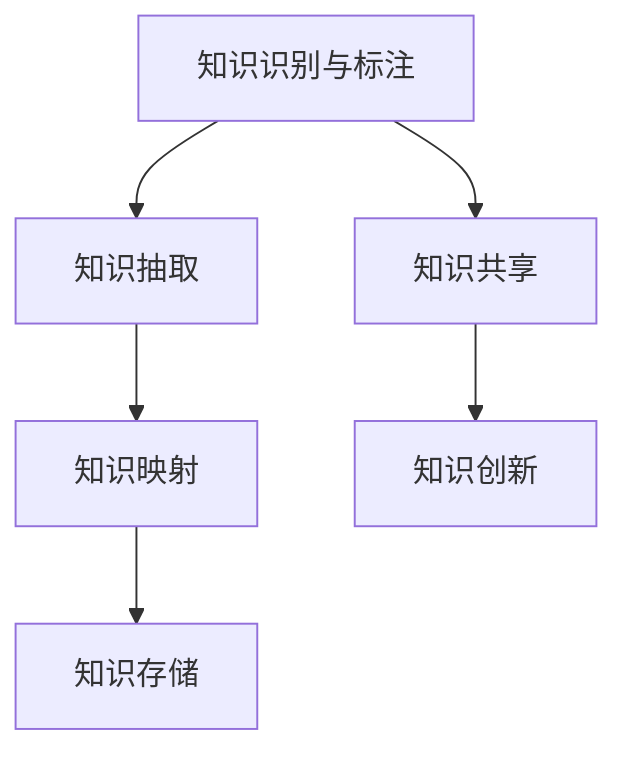

                 

# 知识管理：leveraging组织的集体智慧

> 关键词：知识管理,集体智慧,组织学习,组织知识库,知识图谱,元数据,知识抽取,知识映射,知识共享,知识创新

## 1. 背景介绍

### 1.1 问题由来

在全球化的知识经济时代，企业内部的知识资产往往散落在各个员工、项目组和业务部门的文档、邮件、笔记、代码库等资源中，难以系统整合和有效利用。加之组织知识获取、共享和转化效率低下，往往导致创新力不足、重复劳动和知识断层等问题。为了改善这一现状，知识管理成为了当今企业信息化建设的核心目标之一。

知识管理是关于组织内知识的收集、存储、共享和应用的一套系统化方法，旨在提升组织的学习能力、创新力和竞争力。通过系统化管理组织内部的知识资源，实现知识的高效传播和共享，促进组织成员的协作和创新，最终推动企业持续增长。

### 1.2 问题核心关键点

知识管理的核心在于如何有效地挖掘、整合、存储和应用组织内部的知识资源，构建集体的智慧池，以支撑企业的业务运营和创新发展。核心关键点包括：

- **知识识别与标注**：识别和标注组织内部存在的各种显性和隐性知识。
- **知识抽取与存储**：通过文本挖掘、机器学习和语义分析等技术手段，从文档、代码、笔记等数据源中抽取知识，并存储到知识库中。
- **知识映射与融合**：将异构、散落的知识进行逻辑上的映射和融合，形成连贯的知识体系。
- **知识共享与协作**：构建知识共享平台，促进组织成员之间的交流协作。
- **知识创新与应用**：通过知识图谱、推荐系统等工具，支持知识的新颖应用和创新。

通过提升知识管理水平，企业能够显著减少重复劳动，优化资源配置，加速新知识和新产品的生成。本文旨在系统介绍知识管理的核心概念和技术，帮助读者理解如何构建和应用知识管理框架。

## 2. 核心概念与联系

### 2.1 核心概念概述

在深入探讨知识管理的技术框架前，先简要介绍一下几个关键概念：

- **知识管理(Knowledge Management, KM)**：通过信息技术手段，系统化管理组织内部知识的收集、存储、共享和应用。
- **知识图谱(Knowledge Graph)**：一种结构化表示实体、属性和关系的数据模型，用于表示复杂世界中的实体及其相互关系。
- **元数据(Metadata)**：描述数据的数据，如数据的来源、格式、结构、处理方式等，帮助数据用户更好地理解和使用数据。
- **知识抽取(Information Extraction, IE)**：从文本、数据中自动提取有价值的信息，如实体、关系等。
- **知识映射(Knowledge Mapping)**：将异构、散落的知识逻辑上整合并映射到一个统一的知识体系中。
- **知识共享(Knowledge Sharing)**：通过知识库、问答系统等工具，促进组织成员间的知识交流和合作。
- **知识创新(Knowledge Innovation)**：基于已有知识体系，通过分析和推理，生成新的知识。

这些概念间的关系可以通过以下Mermaid流程图来展示：



这个流程图展示了一个基本的知识管理流程，从知识识别和标注开始，到知识抽取、映射、存储和创新，形成了完整的知识链条。

### 2.2 核心概念原理和架构

知识管理的核心架构由以下几个主要部分构成：

1. **知识库(Knowledge Base)**：存储和管理组织内部的显性和隐性知识。
2. **知识图谱(KG)**：构建知识库中的知识关系网络，支撑知识推理和应用。
3. **知识抽取系统(IE System)**：自动从非结构化数据中提取知识。
4. **知识映射系统(KM System)**：整合、映射异构知识，形成统一的知识体系。
5. **知识共享平台(KS Platform)**：构建知识共享环境，促进协作和知识交流。
6. **知识创新应用(KA Application)**：基于知识图谱和知识共享平台，支持知识的新颖应用和创新。

以下将详细介绍这些系统的设计原理和实现方法。

## 3. 核心算法原理 & 具体操作步骤

### 3.1 算法原理概述

知识管理主要涉及以下几个关键步骤：

1. **知识识别与标注**：通过专家评估、自动标注等手段，对组织内的显性知识（如文档、邮件、代码）和隐性知识（如员工经验、项目总结）进行识别和标注。
2. **知识抽取与存储**：采用文本挖掘、信息抽取等技术，从大量文档、代码、笔记等非结构化数据中抽取结构化知识，并存储到知识库中。
3. **知识映射与融合**：使用知识图谱技术，将异构、散落的知识进行逻辑上的映射和融合，形成连贯的知识体系。
4. **知识共享与协作**：构建知识共享平台，通过问答系统、知识图谱等工具，促进组织成员间的知识交流和协作。
5. **知识创新与应用**：利用知识图谱、推荐系统等技术，支持知识的新颖应用和创新。

### 3.2 算法步骤详解

#### 3.2.1 知识识别与标注

知识识别的主要任务是识别出组织内部的显性和隐性知识，包括文档、邮件、代码、员工经验、项目总结等。知识标注则是将这些知识进行分类、归档，以形成系统的知识结构。

知识识别的主要手段包括：
- **专家评估**：通过专家对组织内各类资源进行手动评估和分类。
- **自动标注**：利用文本挖掘、自然语言处理等技术，自动对文档、邮件等文本资源进行标注。

知识标注的关键在于设计合适的标注框架，如分类体系、属性标签等。这通常需要专家参与设计，确保标注体系能够反映组织内部的知识结构。

#### 3.2.2 知识抽取与存储

知识抽取是从非结构化数据中提取出结构化知识的过程。这通常包括实体识别、关系抽取、属性抽取等步骤。

知识抽取的主要技术手段包括：
- **规则抽取**：通过编写规则和模板，自动提取特定格式的数据。
- **机器学习抽取**：利用文本挖掘、机器学习等技术，自动学习知识抽取的模型。
- **深度学习抽取**：采用序列标注、实体关系抽取等深度学习技术，自动抽取复杂的知识结构。

知识存储则是将抽取到的结构化知识存储到知识库中。常用的知识存储技术包括：
- **关系型数据库**：用于存储结构化的元数据和关系数据。
- **非关系型数据库**：用于存储半结构化、非结构化数据。
- **文档数据库**：用于存储文档、代码等非结构化数据。

#### 3.2.3 知识映射与融合

知识映射是将异构、散落的知识进行逻辑上的整合，形成一个统一的知识体系。这通常通过构建知识图谱来实现。

知识映射的主要技术手段包括：
- **本体建模**：构建知识本体，描述知识的属性和关系。
- **知识图谱构建**：通过实体关系抽取、关系推理等技术，构建知识图谱。
- **知识融合**：通过语义对齐、知识推理等技术，将异构知识进行融合。

知识融合的关键在于构建一个连贯的知识体系，使得知识可以高效地被检索、推理和应用。

#### 3.2.4 知识共享与协作

知识共享平台是组织知识共享和协作的核心工具，它通过知识图谱、问答系统等技术，促进组织成员间的知识交流和合作。

知识共享的主要技术手段包括：
- **知识图谱查询**：通过知识图谱的搜索和推理功能，快速检索知识。
- **问答系统**：通过问答机器人，提供实时的知识查询和建议。
- **协作工具**：如项目管理、任务分配等，支持团队协作。

知识共享平台的构建需要考虑数据的安全性和隐私性，确保知识共享不会泄露敏感信息。

#### 3.2.5 知识创新与应用

知识创新应用则是通过知识图谱、推荐系统等技术，支持知识的新颖应用和创新。

知识创新应用的主要技术手段包括：
- **知识推理**：通过知识图谱中的推理功能，支持知识的推理和创新。
- **知识推荐**：利用推荐系统，根据用户兴趣和行为，推荐相关知识。
- **知识工程**：通过知识抽取、知识映射等技术，构建新的知识应用。

知识创新应用的关键在于知识推理和推荐，通过这些技术手段，支持组织内部的知识应用和创新。

### 3.3 算法优缺点

知识管理的主要优点包括：
- **提升组织学习效率**：通过系统化管理知识，提升组织的学习效率和知识共享能力。
- **促进协作和创新**：构建知识共享平台，促进组织成员间的协作和知识创新。
- **优化资源配置**：通过知识库和知识图谱，优化资源的配置和利用。

知识管理的主要缺点包括：
- **技术复杂度高**：构建知识管理系统的技术复杂度高，需要多种技术手段的综合应用。
- **数据质量问题**：知识抽取和映射需要高质量的数据，数据质量问题可能导致知识不准确或不完整。
- **隐私和安全问题**：知识共享过程中可能涉及敏感信息，需要严格的数据安全和隐私保护措施。

### 3.4 算法应用领域

知识管理的应用领域非常广泛，涵盖了企业内部管理的各个方面。以下是几个典型应用场景：

1. **研发管理**：通过知识图谱和推荐系统，支持研发项目的知识应用和创新。
2. **产品开发**：利用知识共享平台，促进产品设计和开发的协作和创新。
3. **客户支持**：通过知识库和问答系统，快速响应客户咨询，提升客户满意度。
4. **培训和教育**：通过知识图谱和推荐系统，支持员工培训和知识传递。
5. **财务和运营**：通过知识共享平台，优化财务和运营流程，提升效率和准确性。

## 4. 数学模型和公式 & 详细讲解

### 4.1 数学模型构建

知识管理的数学模型通常基于图结构，用节点表示知识实体，用边表示知识关系。下面以知识图谱为例，介绍基本的数学模型构建方法。

设知识图谱中的节点表示知识实体，边表示知识关系。知识图谱可以表示为G(V,E)，其中V是节点集合，E是边集合。节点v∈V和边e∈E的关系可以用以下公式表示：

$$ v = \{v_1, v_2, ..., v_n\} $$
$$ e = \{e_1, e_2, ..., e_m\} $$

其中，v表示节点集合，n表示节点数；e表示边集合，m表示边数。

知识图谱的数学模型构建通常包括以下几个步骤：

1. **节点表示**：将知识实体表示为节点，可以通过节点编号或自然语言描述表示。
2. **边表示**：将知识关系表示为边，可以通过边类型或元组表示。
3. **知识推理**：通过知识图谱中的推理功能，支持知识的推理和应用。

### 4.2 公式推导过程

知识推理是知识图谱的核心功能之一。下面介绍基于知识图谱的知识推理方法。

设知识图谱G(V,E)中存在一个知识实体v，关系e，目标实体t。知识推理的目标是从已知节点v和关系e出发，找到目标节点t。

知识推理的主要技术手段包括：
- **规则推理**：通过编写规则和模板，进行简单的知识推理。
- **逻辑推理**：利用逻辑公式和推理规则，进行复杂的知识推理。
- **深度学习推理**：通过神经网络模型，进行更加灵活和高效的推理。

知识推理的公式推导如下：

设知识图谱中存在节点v和e，目标节点为t。知识推理的公式表示为：

$$ R(v, e, t) = R(v, e, t) \cup R(v, e, v_1) \cup R(v_1, e, t) $$

其中，$R(v, e, t)$表示从节点v和关系e出发，直接推理到目标节点t的推理路径。$R(v, e, v_1)$表示从节点v和关系e出发，先到达节点v1，再从节点v1和关系e到达目标节点t的推理路径。

### 4.3 案例分析与讲解

以一个简单的知识图谱为例，进行知识推理的讲解。

设知识图谱中存在节点v表示“苹果公司”，关系e表示“总部所在地”，目标节点t表示“加利福尼亚州”。

知识推理的目标是从节点v和关系e出发，找到目标节点t。根据公式推导，知识推理的过程如下：

1. 从节点v和关系e出发，直接推理到目标节点t。
2. 从节点v和关系e出发，先到达节点v1（表示“库比蒂诺市”），再从节点v1和关系e到达目标节点t。

知识推理的最终结果是目标节点t“加利福尼亚州”，推理路径为：

$$ R(v, e, t) = R(v, e, t) \cup R(v, e, v_1) \cup R(v_1, e, t) $$

通过知识推理，我们可以高效地从知识图谱中提取有用的信息，支持知识的新颖应用和创新。

## 5. 项目实践：代码实例和详细解释说明

### 5.1 开发环境搭建

构建知识管理系统的开发环境主要包括以下几个步骤：

1. 安装Python环境：建议安装Anaconda，方便后续的包管理。
2. 安装知识管理相关的Python包：如NLTK、Spacy、TensorFlow等。
3. 安装数据库系统：如MySQL、PostgreSQL等，用于存储知识图谱和元数据。
4. 搭建知识共享平台：如使用Django或Flask等框架，构建知识共享的Web界面。

### 5.2 源代码详细实现

以下是一个简单的知识管理系统的Python代码实现。

```python
import networkx as nx
import matplotlib.pyplot as plt

# 构建知识图谱
G = nx.Graph()
G.add_node('苹果公司', type='公司', location='加利福尼亚州')
G.add_edge('苹果公司', '总部所在地', '加利福尼亚州')

# 进行知识推理
path = nx.shortest_path(G, '苹果公司', '加利福尼亚州')
print(path)
```

以上代码实现了简单的知识图谱构建和知识推理。通过构建知识图谱，我们可以高效地从节点和关系中推理出目标节点的路径。

### 5.3 代码解读与分析

以上代码中，我们使用了NetworkX库来构建和操作知识图谱。

1. **知识图谱构建**：通过add_node和add_edge方法，添加节点和边。
2. **知识推理**：通过shortest_path方法，找到节点之间的最短路径。

通过代码实现，我们可以看到知识图谱的构建和推理过程。在实际应用中，需要根据具体的业务需求，进一步优化知识图谱的设计和推理算法，以满足实际需求。

## 6. 实际应用场景

### 6.1 研发管理

在研发管理中，知识管理可以通过知识图谱和推荐系统，支持项目的知识应用和创新。

**应用场景**：
- 技术文档检索：通过知识图谱查询功能，快速找到相关的技术文档。
- 项目规划：通过知识图谱中的项目关系，优化项目规划和资源分配。
- 创新设计：通过知识图谱中的知识推理，支持新技术和新产品的设计。

**案例**：某科技公司通过知识图谱和推荐系统，构建了研发知识库，支持技术文档检索、项目规划和创新设计，显著提高了研发效率和创新能力。

### 6.2 产品开发

在产品开发中，知识管理可以通过知识共享平台，促进产品设计和开发的协作和创新。

**应用场景**：
- 用户需求分析：通过知识图谱中的用户需求，优化产品设计和功能。
- 团队协作：通过知识共享平台，支持团队成员之间的协作和知识传递。
- 质量控制：通过知识图谱中的知识推理，优化产品测试和质量控制流程。

**案例**：某电子产品公司通过知识共享平台，支持产品设计和开发的协作和创新，显著提高了产品的质量和市场竞争力。

### 6.3 客户支持

在客户支持中，知识管理可以通过知识库和问答系统，快速响应客户咨询，提升客户满意度。

**应用场景**：
- 问题解答：通过知识库中的常见问题解答，快速解决客户咨询。
- 服务支持：通过问答系统，提供实时的客户支持。
- 知识更新：通过知识图谱中的知识推理，支持知识库的实时更新。

**案例**：某电信公司通过知识库和问答系统，支持客户支持服务，显著提高了客户满意度和服务质量。

### 6.4 未来应用展望

随着知识管理技术的不断进步，未来的知识管理将呈现出以下几个趋势：

1. **多模态知识管理**：未来的知识管理将不仅仅局限于文本知识，还将包括图像、视频、语音等多模态数据。
2. **实时知识管理**：未来的知识管理将实现实时数据采集、实时知识推理和实时应用，支持动态知识更新。
3. **智能知识管理**：未来的知识管理将引入人工智能技术，支持知识的自动抽取、推理和应用。
4. **个性化知识管理**：未来的知识管理将引入个性化推荐系统，支持用户个性化知识获取和应用。

这些趋势将使得知识管理更加智能、高效和个性化，为企业和组织带来更大的价值。

## 7. 工具和资源推荐

### 7.1 学习资源推荐

以下是一些有用的学习资源，帮助读者系统掌握知识管理的理论和实践：

1. **《知识管理与组织学习》**：该书详细介绍了知识管理的基本概念、方法和技术，适合企业知识管理从业者阅读。
2. **《知识图谱理论与实践》**：该书介绍了知识图谱的原理、建模和应用，适合技术开发人员阅读。
3. **Coursera《知识管理与组织学习》课程**：由斯坦福大学教授授课，涵盖知识管理的理论和实践。
4. **Kaggle《知识图谱竞赛》**：通过参与知识图谱竞赛，提升知识图谱建模和应用的能力。

### 7.2 开发工具推荐

以下是一些有用的开发工具，帮助读者高效构建知识管理系统：

1. **Django**：一个流行的Web框架，支持构建知识共享平台。
2. **Flask**：一个轻量级的Web框架，支持构建简单的知识管理Web界面。
3. **PyTorch**：一个深度学习框架，支持知识抽取和知识推理。
4. **TensorFlow**：一个深度学习框架，支持知识图谱的构建和推理。
5. **NLTK**：一个自然语言处理库，支持知识抽取和知识推理。

### 7.3 相关论文推荐

以下是一些有用的论文，帮助读者深入理解知识管理的理论和实践：

1. **《A Survey of Knowledge Management: An Evolutionary Perspective》**：对知识管理的发展历程和未来趋势进行了综述。
2. **《Knowledge Management: Towards an Incremental Value-Balanced Approach》**：提出了一种基于增量的知识管理方法，支持知识的动态更新。
3. **《Knowledge Mapping and Knowledge Management》**：详细介绍了知识映射和知识管理的原理和方法。
4. **《Knowledge Graphs and Their Applications》**：介绍了知识图谱的构建和应用方法，适合技术开发人员阅读。

## 8. 总结：未来发展趋势与挑战

### 8.1 研究成果总结

本文从知识管理的核心概念和技术入手，系统介绍了知识管理的原理、方法、技术和应用场景。通过案例分析和代码实例，帮助读者理解知识管理的实际操作和应用效果。

### 8.2 未来发展趋势

未来知识管理将呈现出以下几个趋势：

1. **多模态知识管理**：未来的知识管理将不仅仅局限于文本知识，还将包括图像、视频、语音等多模态数据。
2. **实时知识管理**：未来的知识管理将实现实时数据采集、实时知识推理和实时应用，支持动态知识更新。
3. **智能知识管理**：未来的知识管理将引入人工智能技术，支持知识的自动抽取、推理和应用。
4. **个性化知识管理**：未来的知识管理将引入个性化推荐系统，支持用户个性化知识获取和应用。

### 8.3 面临的挑战

尽管知识管理技术已经取得了显著进展，但仍面临以下挑战：

1. **数据质量问题**：知识抽取和映射需要高质量的数据，数据质量问题可能导致知识不准确或不完整。
2. **隐私和安全问题**：知识共享过程中可能涉及敏感信息，需要严格的数据安全和隐私保护措施。
3. **技术复杂度高**：构建知识管理系统的技术复杂度高，需要多种技术手段的综合应用。

### 8.4 研究展望

未来的知识管理研究需要从以下几个方面进行探索：

1. **知识抽取和映射**：提升知识抽取和映射的准确性和效率，支持高质量的知识管理。
2. **数据安全和隐私**：加强数据安全和隐私保护措施，确保知识共享过程的安全性。
3. **多模态知识管理**：研究多模态数据管理技术，支持更加全面的知识获取和应用。

通过这些研究方向的探索，未来知识管理技术将更加智能、高效和安全，为企业和组织带来更大的价值。

## 9. 附录：常见问题与解答

**Q1: 知识管理的主要任务是什么？**

A: 知识管理的主要任务是系统化管理组织内部的知识资源，提升组织的学习效率、创新能力和竞争力。具体包括知识识别与标注、知识抽取与存储、知识映射与融合、知识共享与协作、知识创新与应用等步骤。

**Q2: 知识管理的主要技术手段有哪些？**

A: 知识管理的主要技术手段包括知识图谱构建、知识抽取、知识映射、知识共享、知识推理等。

**Q3: 知识图谱在知识管理中的应用有哪些？**

A: 知识图谱在知识管理中的应用包括技术文档检索、项目规划、创新设计、用户需求分析、团队协作、质量控制等。

**Q4: 未来知识管理技术的发展趋势有哪些？**

A: 未来知识管理技术的发展趋势包括多模态知识管理、实时知识管理、智能知识管理、个性化知识管理等。

**Q5: 知识管理面临的主要挑战有哪些？**

A: 知识管理面临的主要挑战包括数据质量问题、隐私和安全问题、技术复杂度高等。

以上是本文对知识管理的技术和应用的全面介绍。通过系统学习和实践，读者可以更好地掌握知识管理的核心技术和应用方法，提升组织的知识管理能力，推动企业的持续发展。

---

作者：禅与计算机程序设计艺术 / Zen and the Art of Computer Programming

