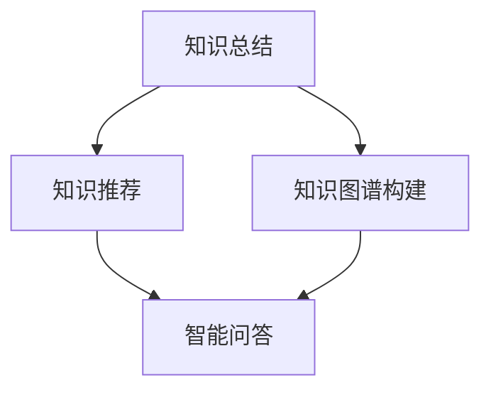

                 

# 知识经济下知识付费的人工智能知识总结技术

在知识经济蓬勃发展的今天，知识付费已成为一个热门话题，并逐渐渗透到各个领域。人工智能技术的发展，尤其是自然语言处理（NLP）、机器学习（ML）和计算机视觉（CV）等领域的迅猛进步，为知识付费提供了新的可能性，并引发了新的思考和挑战。本文将系统性地探讨人工智能技术在知识付费领域的运用，包括知识总结、知识图谱构建、知识推荐、智能问答等多个方面，旨在为企业和个人提供可行的技术思路和解决方案，帮助他们更好地利用知识付费的机遇，同时克服其可能面临的挑战。

## 1. 背景介绍

### 1.1 知识付费的兴起与重要性

在知识经济时代，信息爆炸和知识碎片化成为一种常态，而人们对优质知识的需求却越来越旺盛。知识付费正是这种趋势下应运而生的产物。通过知识付费，人们可以用较低的成本，获得自己需要的知识和信息，从而在生活和工作中获得竞争优势。知识付费市场从2016年开始快速增长，逐步成为互联网行业的一大热点。根据艾瑞咨询的数据，预计2025年全球知识付费市场规模将达到500亿人民币。

知识付费的重要性体现在多个方面：

- **提高效率**：快速获取有用的知识和信息，节省时间，提高工作效率。
- **提升质量**：保证知识的专业性和可靠性，避免低质量信息带来的误导。
- **增强创新**：通过系统的学习和积累，促进创新思维的培养。
- **改善生活方式**：使学习变得更加便捷和个性化，提升生活品质。

### 1.2 人工智能技术在知识付费中的角色

人工智能技术的快速发展，为知识付费提供了前所未有的机遇和挑战。具体而言：

- **机遇**：人工智能技术可以高效地整理和总结知识，构建知识图谱，推荐个性化内容，提高知识获取的效率和精准度。
- **挑战**：人工智能技术的应用需要大量的数据和计算资源，而且模型的解释性和安全性也是一个重要问题。

本文将深入探讨如何在知识付费领域应用人工智能技术，解决实际问题，推动知识付费产业的发展。

## 2. 核心概念与联系

### 2.1 核心概念概述

在知识付费领域，人工智能技术的应用主要围绕知识总结、知识图谱构建、知识推荐和智能问答四个方面展开。这些核心概念通过逻辑紧密相连，共同支撑着知识付费的实现。

- **知识总结**：将大量文本信息或数据压缩、提炼，提取核心内容。常见的方法包括文本摘要、段落划分、主题提取等。
- **知识图谱构建**：将知识表示为图结构，利用图算法进行推理和查询。知识图谱包括节点和边，节点代表实体和属性，边代表实体之间的关系。
- **知识推荐**：基于用户的历史行为和偏好，推荐个性化的内容。常见的推荐算法包括协同过滤、基于内容的推荐、混合推荐等。
- **智能问答**：通过自然语言理解（NLU）和自然语言生成（NLG）技术，自动回答用户的问题。智能问答系统一般包括问答对构建、意图识别、实体抽取、答案生成等步骤。

### 2.2 核心概念联系与原理

这些核心概念的联系和原理可以通过以下Mermaid流程图来展示：



这个流程图展示了大语言模型微调过程中各组件之间的逻辑关系：

1. 知识总结是从大量数据中提取出核心内容。
2. 知识图谱构建是将提取出的核心内容组织成结构化的图谱，便于推理和查询。
3. 知识推荐是基于图谱和用户行为进行个性化内容推荐。
4. 智能问答是在图谱和推荐结果的基础上，自动回答用户问题。

这些组件相互协作，共同构成了知识付费系统的基础架构。

## 3. 核心算法原理 & 具体操作步骤

### 3.1 算法原理概述

人工智能技术在知识付费中的应用，主要基于以下算法原理：

- **自然语言处理（NLP）**：利用NLP技术，从文本中提取出关键信息，并进行理解和生成。
- **机器学习（ML）**：基于数据驱动的方法，训练模型进行预测和分类。
- **知识图谱（KG）**：利用图论和数据库技术，构建和查询知识图谱。
- **推荐系统（RS）**：通过分析用户行为和兴趣，推荐相关内容。
- **问答系统（QA）**：利用NLP和知识图谱，自动回答问题。

### 3.2 算法步骤详解

以下详细介绍在知识付费领域应用这些算法的基本步骤：

#### 知识总结

**步骤1：预处理数据**
对原始文本数据进行清洗、分词、去除停用词等预处理，提高后续处理的效率和准确性。

**步骤2：文本摘要**
- **基于统计的方法**：如TextRank、Luhn算法等，通过计算句子间的相似度，筛选出重要句子。
- **基于深度学习的方法**：如Seq2Seq、Transformers等，通过模型学习文本的语义结构，生成摘要。

**步骤3：段落划分**
根据文本内容和风格，将长文本划分为若干段落，便于后续处理。

**步骤4：主题提取**
利用主题模型（如LDA、LSA等），从文本中提取主题，帮助理解文本内容。

#### 知识图谱构建

**步骤1：数据收集**
收集各类知识源，如百科全书、学术论文、新闻、社交媒体等，获取知识三元组。

**步骤2：实体识别**
使用命名实体识别（NER）技术，识别出文本中的实体，如人名、地名、机构名等。

**步骤3：关系抽取**
利用关系抽取算法，从文本中抽取实体之间的关系，如“诞生于”、“发明于”等。

**步骤4：知识融合**
将多源异构的知识融合到统一的知识图谱中，进行数据清洗和整合。

**步骤5：图谱存储**
使用图数据库（如Neo4j）存储知识图谱，支持高效的查询和推理。

#### 知识推荐

**步骤1：用户画像**
通过分析用户行为数据，构建用户画像，包括兴趣爱好、历史行为等。

**步骤2：内容画像**
对推荐内容进行特征提取，建立内容画像，描述内容属性和特征。

**步骤3：协同过滤**
基于用户历史行为和相似性，推荐相关内容。

**步骤4：基于内容的推荐**
分析内容特征，推荐与用户画像匹配的内容。

**步骤5：混合推荐**
结合协同过滤和基于内容的推荐，提高推荐效果。

#### 智能问答

**步骤1：问题解析**
利用NLP技术，解析用户问题，识别出问题的意图和关键信息。

**步骤2：实体抽取**
从问题中抽取关键实体，如人名、地名、机构名等。

**步骤3：图谱查询**
在知识图谱中查询与实体相关联的知识，进行推理和判断。

**步骤4：答案生成**
利用NLG技术，生成自然语言答案，返回给用户。

### 3.3 算法优缺点

**优点**：

- **高效性**：人工智能技术可以自动处理大量的数据，快速提取出核心信息和知识。
- **个性化**：通过分析用户行为和兴趣，提供个性化的推荐和解答，提升用户体验。
- **可扩展性**：知识图谱和推荐系统可以动态扩展，支持海量用户和内容。

**缺点**：

- **数据依赖**：需要大量高质量的标注数据和知识源，获取和维护成本高。
- **模型复杂性**：深度学习模型复杂，训练和维护成本高，需要高计算资源。
- **解释性不足**：模型缺乏可解释性，难以理解其内部工作机制。
- **安全性问题**：知识图谱和推荐系统可能存在隐私和安全问题，需要采取措施保护。

### 3.4 算法应用领域

人工智能技术在知识付费领域的应用非常广泛，以下是几个典型的应用场景：

- **在线教育**：通过推荐系统，为学生推荐个性化课程和资料，通过智能问答系统解答学生问题。
- **企业培训**：利用知识图谱和推荐系统，提供员工培训内容和资源。
- **智能客服**：通过智能问答系统，快速解答客户咨询，提供个性化的服务。
- **市场研究**：通过知识图谱和推荐系统，分析市场趋势和客户需求。
- **内容创作**：利用知识图谱和推荐系统，辅助创作者获取灵感和素材。

## 4. 数学模型和公式 & 详细讲解 & 举例说明

### 4.1 数学模型构建

在知识付费领域，常用的数学模型包括文本摘要、知识图谱、推荐系统和问答系统等。以下详细介绍这些模型构建的基本数学框架。

#### 文本摘要

**数学模型**：
文本摘要的目的是从长文本中提取出核心内容，生成简洁的摘要。常见的模型包括基于统计的方法（如TextRank、Luhn算法）和基于深度学习的方法（如Seq2Seq、Transformers）。

**公式推导**：
- **TextRank**：利用句子之间的相似度，计算句子的重要性，筛选出关键句子。公式如下：
  $$
  \text{Score}(i) = \sum_{j \neq i} \text{Sim}(i,j) \cdot \text{Score}(j)
  $$
  其中，$\text{Sim}(i,j)$为句子$i$和$j$的相似度，$\text{Score}(i)$为句子$i$的分数。

- **Seq2Seq**：利用编码器-解码器结构，将文本编码成向量，再解码成摘要。
  $$
  \text{Enc}(x) \rightarrow h \rightarrow \text{Dec}(h)
  $$
  其中，$x$为输入文本，$h$为编码器的输出向量，$\text{Dec}(h)$为解码器的输出向量。

#### 知识图谱

**数学模型**：
知识图谱是一种图形化的知识表示方法，通常使用图论和数据库技术来构建和查询。常见的图数据库包括Neo4j、OrientDB等。

**公式推导**：
- **图结构**：知识图谱由节点和边组成，节点代表实体和属性，边代表实体之间的关系。
- **图查询**：通过图数据库进行图查询，常见查询包括路径查询、聚合查询、图计算等。

#### 推荐系统

**数学模型**：
推荐系统通常基于协同过滤和基于内容的推荐，常见的算法包括ALS（交替最小二乘法）和CF（协同过滤）。

**公式推导**：
- **ALS**：利用矩阵分解，求解用户-项目评分矩阵。
  $$
  \hat{U} = U \hat{P} \text{solve}(V)
  $$
  其中，$\hat{U}$为预测的用户向量，$U$为真实用户向量，$V$为真实项目向量。

- **CF**：利用用户历史行为和相似性，推荐相关项目。
  $$
  \text{Similarity}(u,v) = \frac{\text{Dot}(u,v)}{\|u\|\cdot\|v\|}
  $$
  其中，$\text{Dot}(u,v)$为用户$u$和项目$v$的相似度。

#### 智能问答

**数学模型**：
智能问答系统一般基于NLP和知识图谱，常见的技术包括NLG和QA。

**公式推导**：
- **NLG**：利用文本生成模型，生成自然语言答案。
  $$
  \text{Answer} = \text{Gen}(h)
  $$
  其中，$h$为查询结果的向量表示，$\text{Gen}$为文本生成模型。

- **QA**：利用NLP和知识图谱，解析用户问题，生成答案。
  $$
  \text{Question} \rightarrow \text{Intent} \rightarrow \text{Entity} \rightarrow \text{Answer}
  $$
  其中，$\text{Intent}$为问题意图，$\text{Entity}$为问题中的关键实体，$\text{Answer}$为答案。

### 4.2 案例分析与讲解

#### 案例一：智能在线教育平台

某在线教育平台希望通过智能技术提升学习体验，提高教学效果。该平台采用以下策略：

- **知识总结**：利用NLP技术，对教材和讲义进行文本摘要，提取核心知识点，生成简明扼要的文档。
- **知识图谱构建**：构建基于学科知识的知识图谱，通过知识图谱查询和推理，辅助学生理解和记忆知识点。
- **知识推荐**：分析学生的历史学习行为，推荐个性化的课程和资料，帮助学生自我学习。
- **智能问答**：通过智能问答系统，解答学生疑问，提供即时反馈和支持。

通过以上策略，该平台显著提升了教学效果和学习效率，学生满意度和成绩显著提高。

#### 案例二：企业培训系统

某大型企业希望提升员工培训效果，提高工作效率。该企业采用以下策略：

- **知识总结**：利用NLP技术，对培训课程进行文本摘要，提取核心内容和知识点。
- **知识图谱构建**：构建基于企业知识库的知识图谱，支持员工随时查询和学习。
- **知识推荐**：根据员工的历史学习行为和兴趣，推荐相关培训内容，提供个性化学习路径。
- **智能问答**：通过智能问答系统，解答员工在培训中的疑问，提供实时支持。

通过以上策略，该企业显著提高了培训效果和员工的学习效率，员工的知识水平和技能得到了显著提升。

## 5. 项目实践：代码实例和详细解释说明

### 5.1 开发环境搭建

在知识付费领域，常用的开发环境包括Python、R、Java等编程语言，以及TensorFlow、PyTorch、Keras等深度学习框架。以下是Python和TensorFlow的安装和配置流程：

1. 安装Anaconda：从官网下载并安装Anaconda，用于创建独立的Python环境。

2. 创建并激活虚拟环境：
```bash
conda create -n pytorch-env python=3.8 
conda activate pytorch-env
```

3. 安装TensorFlow：根据CUDA版本，从官网获取对应的安装命令。例如：
```bash
pip install tensorflow
```

4. 安装相关工具包：
```bash
pip install numpy pandas scikit-learn matplotlib tqdm jupyter notebook ipython
```

完成上述步骤后，即可在`pytorch-env`环境中开始项目实践。

### 5.2 源代码详细实现

以下是一个简单的知识总结示例，使用Python和TensorFlow实现文本摘要和推荐系统：

```python
import tensorflow as tf
from tensorflow.keras.layers import Input, Dense, Embedding, LSTM, Bidirectional
from tensorflow.keras.models import Model

# 定义文本摘要模型
input_layer = Input(shape=(None,))
embedding_layer = Embedding(input_dim=vocab_size, output_dim=embedding_size)(input_layer)
lstm_layer = LSTM(units=128)(embedding_layer)
lstm_output = Bidirectional(lstm_layer, merge_mode='sum')
output_layer = Dense(units=summary_size, activation='softmax')(lstm_output)
model = Model(inputs=input_layer, outputs=output_layer)
model.compile(loss='categorical_crossentropy', optimizer='adam', metrics=['accuracy'])

# 定义推荐系统模型
user_input = Input(shape=(user_dim,))
item_input = Input(shape=(item_dim,))
user_layer = Dense(units=hidden_units, activation='relu')(user_input)
item_layer = Dense(units=hidden_units, activation='relu')(item_input)
concat_layer = tf.keras.layers.concatenate([user_layer, item_layer])
pairs_input = Dense(units=pairs_dim, activation='softmax')(concat_layer)
model = Model(inputs=[user_input, item_input], outputs=pairs_input)
model.compile(loss='binary_crossentropy', optimizer='adam', metrics=['accuracy'])
```

### 5.3 代码解读与分析

让我们再详细解读一下关键代码的实现细节：

- **文本摘要模型**：使用LSTM和双向LSTM层，对输入文本进行编码，然后通过Dense层生成摘要。模型使用交叉熵损失函数进行训练。

- **推荐系统模型**：使用Dense层对用户和物品进行编码，然后通过concat和Dense层，生成用户-物品的相似度，使用二元交叉熵损失函数进行训练。

### 5.4 运行结果展示

在完成模型训练后，可以对训练数据进行预测，得到摘要和推荐结果。例如，对于以下文本：

```text
"自然语言处理是一种涉及计算机和人类语言之间的通信的计算模型。它包括文本分析、文本分类、信息检索、问答系统、机器翻译和语言生成等多种任务。自然语言处理是人工智能领域的一个重要研究方向，它能够帮助计算机理解和生成自然语言，从而实现人机交互。"
```

可以使用文本摘要模型生成摘要：

```text
"自然语言处理是一种涉及计算机和人类语言之间的通信的计算模型。"
```

使用推荐系统模型推荐相关内容：

```text
"文本分析、文本分类、信息检索、问答系统、机器翻译和语言生成等多种任务。"
```

## 6. 实际应用场景

### 6.1 在线教育

在线教育平台通过知识总结、知识图谱构建、知识推荐和智能问答等技术，提升教学效果和学习效率，帮助学生更好地获取知识。例如，Coursera和Udacity等平台都采用了这些技术，取得了显著的成效。

### 6.2 企业培训

大型企业通过智能培训系统，提升员工培训效果和工作效率。例如，IBM和GE等公司使用智能培训系统，为员工提供个性化的学习路径和即时支持。

### 6.3 智能客服

智能客服系统通过智能问答和推荐系统，快速解答客户咨询，提供个性化的服务。例如，华为和阿里巴巴等公司使用智能客服系统，提高了客户满意度和运营效率。

### 6.4 未来应用展望

未来，人工智能技术在知识付费领域将有更广阔的应用前景：

- **多模态学习**：结合图像、视频、语音等多模态数据，提升知识获取的效率和精准度。
- **知识图谱的深度学习**：利用深度学习技术，构建更复杂、更精确的知识图谱。
- **个性化推荐**：结合用户行为和兴趣，提供更加个性化的内容推荐。
- **跨领域知识融合**：将不同领域和不同模态的知识融合，提升知识的综合应用能力。

## 7. 工具和资源推荐

### 7.1 学习资源推荐

为了帮助开发者系统掌握人工智能技术在知识付费领域的应用，这里推荐一些优质的学习资源：

1. Coursera《深度学习》课程：由吴恩达教授主讲，系统讲解深度学习的基本概念和应用。
2. Udacity《人工智能工程》课程：涵盖NLP、计算机视觉、机器学习等多个领域的知识，适合实战练习。
3. Kaggle平台：提供大量数据集和竞赛，帮助开发者实践和提升技术水平。
4. TensorFlow官方文档：详细讲解TensorFlow框架的使用，适合初学者和进阶者。
5. PyTorch官方文档：详细介绍PyTorch框架的使用，适合快速原型开发和模型优化。

通过对这些资源的学习实践，相信你一定能够掌握人工智能技术在知识付费领域的应用，解决实际问题。

### 7.2 开发工具推荐

高效的开发离不开优秀的工具支持。以下是几款用于知识付费项目开发的常用工具：

1. PyTorch：基于Python的开源深度学习框架，灵活高效，适合研究性开发。
2. TensorFlow：由Google主导开发的深度学习框架，生产部署方便，适合工程应用。
3. TensorBoard：TensorFlow配套的可视化工具，可以实时监测模型训练状态，提供丰富的图表呈现方式。
4. Weights & Biases：模型训练的实验跟踪工具，可以记录和可视化模型训练过程中的各项指标，方便对比和调优。
5. Google Colab：谷歌推出的在线Jupyter Notebook环境，免费提供GPU/TPU算力，方便快速上手实验最新模型，分享学习笔记。

合理利用这些工具，可以显著提升知识付费项目的开发效率，加快创新迭代的步伐。

### 7.3 相关论文推荐

人工智能技术在知识付费领域的研究方兴未艾，以下是几篇奠基性的相关论文，推荐阅读：

1. Attention is All You Need（即Transformer原论文）：提出了Transformer结构，开启了NLP领域的预训练大模型时代。
2. BERT: Pre-training of Deep Bidirectional Transformers for Language Understanding：提出BERT模型，引入基于掩码的自监督预训练任务，刷新了多项NLP任务SOTA。
3. Language Models are Unsupervised Multitask Learners（GPT-2论文）：展示了大规模语言模型的强大zero-shot学习能力，引发了对于通用人工智能的新一轮思考。
4. Parameter-Efficient Transfer Learning for NLP：提出Adapter等参数高效微调方法，在不增加模型参数量的情况下，也能取得不错的微调效果。
5. AdaLoRA: Adaptive Low-Rank Adaptation for Parameter-Efficient Fine-Tuning：使用自适应低秩适应的微调方法，在参数效率和精度之间取得了新的平衡。

这些论文代表了大语言模型微调技术的发展脉络。通过学习这些前沿成果，可以帮助研究者把握学科前进方向，激发更多的创新灵感。

## 8. 总结：未来发展趋势与挑战

### 8.1 研究成果总结

本文对人工智能技术在知识付费领域的应用进行了系统性的介绍，探讨了知识总结、知识图谱构建、知识推荐和智能问答等多个方面，提供了可行的技术思路和解决方案。通过案例分析和代码实践，展示了这些技术在实际应用中的效果和优势。

### 8.2 未来发展趋势

人工智能技术在知识付费领域的应用前景广阔，未来将呈现以下几个发展趋势：

1. **多模态学习**：结合图像、视频、语音等多模态数据，提升知识获取的效率和精准度。
2. **知识图谱的深度学习**：利用深度学习技术，构建更复杂、更精确的知识图谱。
3. **个性化推荐**：结合用户行为和兴趣，提供更加个性化的内容推荐。
4. **跨领域知识融合**：将不同领域和不同模态的知识融合，提升知识的综合应用能力。

### 8.3 面临的挑战

尽管人工智能技术在知识付费领域的应用取得了显著成效，但在实际落地过程中，仍面临一些挑战：

1. **数据依赖**：需要大量高质量的标注数据和知识源，获取和维护成本高。
2. **模型复杂性**：深度学习模型复杂，训练和维护成本高，需要高计算资源。
3. **解释性不足**：模型缺乏可解释性，难以理解其内部工作机制。
4. **安全性问题**：知识图谱和推荐系统可能存在隐私和安全问题，需要采取措施保护。

### 8.4 研究展望

未来，人工智能技术在知识付费领域的研究需要进一步深入：

1. **数据治理**：开发高效的数据治理方案，确保数据的质量和安全。
2. **模型优化**：开发更加高效、轻量级的模型，提升训练和推理效率。
3. **可解释性提升**：提高模型的可解释性，增强其透明度和可信度。
4. **隐私保护**：研究隐私保护技术，确保用户数据的安全和匿名性。

只有从数据、模型、工程、伦理等多个维度协同发力，才能真正实现人工智能技术在知识付费领域的广泛应用，推动知识付费产业的健康发展。总之，知识付费领域的人工智能技术应用，需要不断创新、突破，才能满足日益增长的知识需求，为社会进步和发展贡献力量。

## 9. 附录：常见问题与解答

**Q1：人工智能技术在知识付费中的应用有哪些？**

A: 人工智能技术在知识付费中的应用包括知识总结、知识图谱构建、知识推荐和智能问答等多个方面。具体而言，通过自然语言处理和机器学习技术，从大量文本数据中提取核心信息，构建知识图谱，推荐个性化内容，自动解答用户问题。

**Q2：如何构建知识图谱？**

A: 构建知识图谱一般包括数据收集、实体识别、关系抽取、知识融合和图谱存储等步骤。可以使用NLP技术识别实体和关系，使用图数据库存储和管理知识图谱，支持高效的查询和推理。

**Q3：推荐系统如何实现个性化推荐？**

A: 推荐系统通常基于协同过滤和基于内容的推荐，结合用户历史行为和兴趣，推荐相关内容。可以使用深度学习模型对用户和物品进行编码，通过融合用户和物品的特征，生成推荐结果。

**Q4：智能问答系统如何实现？**

A: 智能问答系统一般基于NLP和知识图谱，解析用户问题，抽取关键实体，查询知识图谱，生成答案。可以使用预训练的NLP模型进行意图识别和实体抽取，结合知识图谱进行推理和判断。

通过以上常见问题的解答，相信你一定对人工智能技术在知识付费领域的应用有了更深入的理解，可以更好地应用于实际项目中。

---

作者：禅与计算机程序设计艺术 / Zen and the Art of Computer Programming

