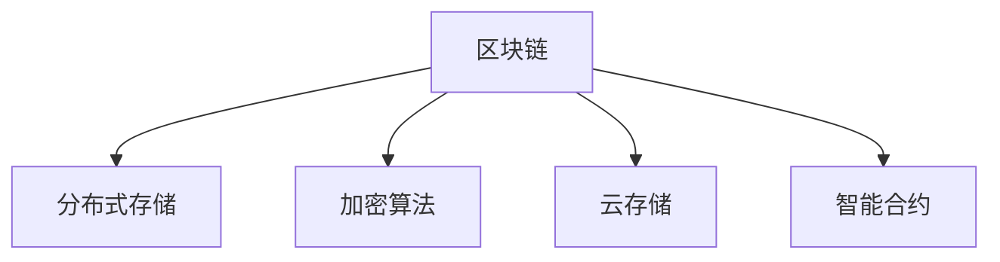

                 

# 知识经济下知识付费的区块链分布式存储方案

> 关键词：知识付费,区块链,分布式存储,加密算法,云存储,数据管理,智能合约

## 1. 背景介绍

### 1.1 问题由来
随着知识经济时代的到来，知识付费已经逐渐成为人们获取优质内容的重要途径。通过付费订阅、按需购买等方式，用户可以获取包括在线课程、电子书、技术文档、行业分析报告等在内的各类知识资源，极大提升了获取知识的效率。然而，当前的知识付费模式存在以下问题：

- **集中化存储**：知识资源通常存储在中心化的数据库中，由知识付费平台集中管理。一旦平台运营出现问题，可能导致用户付费内容的丢失。
- **数据安全和隐私**：知识付费平台需要收集用户个人信息，以提供个性化推荐服务。这些信息一旦泄露或被滥用，可能带来严重的隐私和安全风险。
- **去中心化需求**：用户越来越注重数据的所有权和使用权，希望自己的知识内容在脱离平台后仍然能够安全访问和使用。
- **知识共享和交流**：现有的知识付费平台往往以盈利为目的，限制知识的传播和分享。用户更希望能够在不付费的情况下，进行知识的共享和交流。

### 1.2 问题核心关键点
为了解决上述问题，本方案提出基于区块链技术的分布式存储方案。通过将知识内容存储在区块链上，可以有效提升数据的安全性、隐私性和去中心化水平，满足用户对知识共享和自由访问的需求。

该方案主要包含以下几个核心点：
- **区块链**：提供分布式账本和智能合约技术，实现去中心化存储和内容管理。
- **分布式存储**：将知识内容存储在多个节点上，增强系统的可靠性和容错性。
- **加密算法**：确保知识内容和用户隐私的安全性。
- **云存储**：利用分布式云存储技术，提升知识内容的访问效率。
- **智能合约**：实现知识内容的自动管理、付费和分发，降低平台运营成本。

## 2. 核心概念与联系

### 2.1 核心概念概述

为更好地理解基于区块链技术的分布式存储方案，本节将介绍几个密切相关的核心概念：

- **区块链( Blockchain )**：一种去中心化的分布式账本技术，记录交易信息并由所有参与者共同维护和验证。通过共识机制和加密算法，确保数据的不可篡改性和透明性。
- **分布式存储( Distributed Storage )**：将数据分散存储在多个节点上，通过冗余存储和容错机制，提高系统的可靠性和可用性。
- **加密算法( Encryption Algorithm )**：用于保护数据隐私和安全，防止非法访问和篡改。包括对称加密、非对称加密、哈希算法等。
- **云存储( Cloud Storage )**：利用云计算技术提供数据存储和访问服务，实现数据的分布式存储和高效管理。
- **智能合约( Smart Contract )**：基于区块链技术的自动执行合约，通过编程方式实现复杂规则和逻辑。

这些核心概念之间的逻辑关系可以通过以下Mermaid流程图来展示：



这个流程图展示了几大核心概念及其之间的关系：

1. 区块链通过共识机制和加密算法，提供分布式存储平台。
2. 分布式存储利用区块链的不可篡改性，实现数据的冗余备份和容错。
3. 加密算法确保知识内容的安全性，防止数据泄露和篡改。
4. 云存储利用区块链的网络资源，提供高效的数据访问和分布式管理。
5. 智能合约通过编程实现知识内容的自动化管理，降低运营成本。

这些概念共同构成了知识付费区块链分布式存储方案的技术框架，使其能够在知识经济时代发挥重要作用。

## 3. 核心算法原理 & 具体操作步骤
### 3.1 算法原理概述

基于区块链的分布式存储方案，主要利用区块链的分布式账本、共识机制和智能合约技术，实现知识内容的分布式存储、加密保护和自动化管理。该方案的核心算法原理如下：

1. **分布式账本**：采用区块链技术，建立分布式账本，记录知识内容的存储和访问信息。每个区块包含多个交易记录，通过链式结构实现数据的连续性和不可篡改性。

2. **共识机制**：采用基于工作量证明(PoW)或权益证明(PoS)的共识机制，确保分布式节点之间达成共识，共同维护账本。共识机制防止单点故障和恶意攻击，提高系统的安全性和可靠性。

3. **加密算法**：采用对称加密、非对称加密和哈希算法等加密技术，确保知识内容和用户隐私的安全性。对称加密用于快速加密解密数据，非对称加密用于数字签名和身份验证，哈希算法用于生成唯一的数据摘要。

4. **智能合约**：利用智能合约技术，实现知识内容的自动化管理和交易。智能合约通过编程方式，实现复杂规则和逻辑，如自动付费、授权分发、用户管理等。

### 3.2 算法步骤详解

基于区块链的分布式存储方案一般包括以下几个关键步骤：

**Step 1: 设计区块链架构**
- 确定区块链的共识机制（如PoW或PoS）。
- 设计区块链的账本结构，包括区块、交易和区块头等关键组件。
- 定义智能合约的基本框架和接口。

**Step 2: 搭建分布式存储网络**
- 选择适合的分布式存储技术（如IPFS、Storj等），搭建分布式存储网络。
- 部署多个存储节点，并将节点加入区块链网络。
- 配置节点之间的通信协议和数据同步机制。

**Step 3: 开发加密算法模块**
- 设计加密算法的具体实现，包括对称加密、非对称加密和哈希算法等。
- 实现加密算法的接口，支持数据的加密、解密和摘要计算。
- 开发安全的密钥管理机制，确保加密密钥的安全存储和传输。

**Step 4: 开发智能合约**
- 定义智能合约的功能模块，如内容管理、付费机制、用户管理等。
- 实现智能合约的代码逻辑，确保规则的正确性和安全性。
- 将智能合约部署到区块链上，并设定初始参数。

**Step 5: 实现数据存储和访问**
- 将知识内容按照块的形式存储在区块链上。
- 设计数据访问接口，支持用户通过地址访问和下载知识内容。
- 实现数据的加密和解密功能，确保数据在传输和存储过程中的安全性。

**Step 6: 维护和优化系统**
- 监控系统运行状态，及时发现和解决故障和问题。
- 根据用户反馈和系统运行数据，不断优化算法和参数。
- 扩展存储网络规模，提升系统的可靠性和容量。

### 3.3 算法优缺点

基于区块链的分布式存储方案具有以下优点：
1. **去中心化**：通过区块链技术，实现知识内容的分布式存储，减少单点故障和中心化风险。
2. **高安全性**：利用加密算法和智能合约技术，确保数据的安全性和隐私性。
3. **高效性**：通过分布式存储和云存储技术，提高数据的访问效率和系统性能。
4. **可扩展性**：系统能够根据需求动态扩展存储节点和容量，适应不断增长的知识需求。
5. **自动化管理**：智能合约实现自动化规则和逻辑，降低运营和管理的复杂度。

同时，该方案也存在一些局限性：
1. **技术复杂性**：区块链和分布式存储技术的复杂性较高，需要较高的技术门槛和专业团队支持。
2. **初期成本高**：搭建和维护分布式存储网络的初期成本较高，包括硬件、软件和运维成本。
3. **性能瓶颈**：区块链的共识机制和智能合约的执行效率可能成为系统性能瓶颈，需要优化算法和配置。
4. **法律合规性**：需遵守各国相关法律法规，如数据隐私保护、知识产权等，可能面临合规风险。
5. **用户接受度**：部分用户可能对区块链技术的安全性和可靠性存疑，需要加强宣传和教育。

尽管存在这些局限性，但基于区块链的分布式存储方案在知识经济下具有巨大的应用潜力，能够为知识付费平台提供更加安全、高效和去中心化的解决方案。

### 3.4 算法应用领域

基于区块链的分布式存储方案，可以广泛应用于知识付费、在线教育、技术文档共享、行业分析报告等领域。具体应用场景包括：

- **知识付费平台**：将知识内容存储在区块链上，提供去中心化的内容访问和自动化付费机制。
- **在线教育**：通过区块链存储和共享教育资源，确保知识的版权保护和学生的隐私安全。
- **技术文档共享**：将技术文档存储在区块链上，实现文档的分发、授权和管理。
- **行业分析报告**：利用区块链存储和访问行业报告，提升数据的安全性和可靠性。

除了上述这些经典应用外，区块链分布式存储方案还可以扩展到更多领域，如科研数据管理、医学文献共享、知识产权保护等，为知识经济的发展提供强大的技术支撑。

## 4. 数学模型和公式 & 详细讲解  
### 4.1 数学模型构建

本节将使用数学语言对基于区块链的分布式存储方案进行更加严格的刻画。

假设知识内容 $D$ 存储在分布式账本上，每个区块 $B_i$ 包含 $m$ 个交易记录 $T_i=(t_i, k_i, v_i)$，其中 $t_i$ 为交易时间戳，$k_i$ 为交易密钥，$v_i$ 为知识内容。区块链账本由多个区块 $B_1, B_2, ..., B_n$ 组成，每个区块包含前一个区块的哈希值 $H_i$。

定义知识内容 $D$ 在区块链上的存储状态 $S$，包括当前存储的区块数 $n$、每个区块的交易数量 $m_i$ 和区块哈希值 $H_i$。智能合约 $C$ 负责知识内容的自动管理、付费和分发，其执行状态为 $C_s$。

### 4.2 公式推导过程

以下我们以知识付费平台为例，推导智能合约的逻辑和流程。

**Step 1: 知识付费申请**
- 用户 $U$ 通过智能合约提交付费申请 $P=(U_i, P_i, T)$，其中 $U_i$ 为用户ID，$P_i$ 为支付金额，$T$ 为有效期。

**Step 2: 知识内容访问**
- 用户 $U$ 通过智能合约查询付费内容 $Q=(U_i, S)$，智能合约返回可访问的知识内容列表 $L$。

**Step 3: 内容访问记录**
- 用户 $U$ 下载知识内容 $C_j$，智能合约记录访问记录 $R_j=(U_i, D_j, T)$。

**Step 4: 自动付费和内容分发**
- 如果用户 $U$ 在有效期内未支付费用，智能合约自动发起支付请求 $R=(U_i, P_i)$。
- 智能合约验证支付成功，则解锁知识内容 $C_j$，并将访问记录 $R_j$ 删除。

在上述流程中，智能合约通过编程实现复杂的规则和逻辑，确保知识内容的自动化管理。以下是一个简单的智能合约代码示例：

```solidity
contract KnowledgeStorage {
    address public owner;
    uint256 public balance;
    mapping(address => uint256) public balanceOf;
    mapping(address => uint256[]) public payee;

    function KnowledgeStorage() public {
        owner = msg.sender;
        balanceOf[msg.sender] = 100 * 10 ** 18; // 初始余额为100 ETH
    }

    function requestPayment(address payable _payee, uint256 amount) public payable {
        payee[_payee].push(amount);
        balance -= amount;
        payee[_payee] = sort(payee[_payee]);
    }

    function getKnowledge(address payable _user) public view returns (bool, bool, bool) {
        bool userHasAccess = userHasAccessed(_payee);
        bool userHasPaid = balanceOf[_payee] >= 100 * 10 ** 18;
        bool paymentPending = payee[_payee].length == 0;
        return (userHasAccess, userHasPaid, paymentPending);
    }

    function userHasAccessed(address payable _user) public view returns (bool) {
        uint256 timestamp = block.timestamp;
        if (timestamp - knowledgeAccessTimestamp(_user) < 86400) {
            return true;
        } else {
            return false;
        }
    }

    function knowledgeAccessTimestamp(address payable _user) public view returns (uint256) {
        return 0;
    }
}
```

### 4.3 案例分析与讲解

以在线教育平台为例，分析基于区块链的分布式存储方案的应用。

**Step 1: 课程内容上传**
- 教师将课程内容 $C$ 上传到分布式存储网络，生成区块链交易记录 $T=(C, K, V)$，其中 $K$ 为加密密钥，$V$ 为访问权限。

**Step 2: 付费和授权**
- 学生 $U$ 通过智能合约申请付费 $P=(U_i, P_i, T)$，支付成功后，智能合约生成访问记录 $R=(U_i, C, V)$，并解锁课程内容 $C$。

**Step 3: 知识共享**
- 学生可以将课程内容分享给其他用户，通过智能合约生成新的交易记录 $T'=(U_i, C', K', V')$，其中 $C'$ 为共享内容，$K'$ 为新的加密密钥，$V'$ 为新的访问权限。

**Step 4: 课程评价**
- 学生对课程内容进行评价，智能合约将评价信息记录到区块链上，生成新的交易记录 $T''=(U_i, E, R)$，其中 $E$ 为评价内容，$R$ 为评价记录。

在上述流程中，区块链和智能合约实现了课程内容的自动化管理和付费机制，降低了平台的运营成本。同时，通过加密算法和智能合约，保障了数据的安全性和隐私性。

## 5. 项目实践：代码实例和详细解释说明
### 5.1 开发环境搭建

在进行区块链分布式存储方案的实践前，我们需要准备好开发环境。以下是使用Solidity进行以太坊开发的环境配置流程：

1. 安装Node.js和npm：从官网下载并安装Node.js和npm，用于编写和打包Solidity智能合约。

2. 安装Truffle框架：通过npm安装Truffle框架，用于以太坊智能合约的开发和测试。

3. 搭建测试网络：通过Truffle搭建本地测试网络，使用Ropsten测试网作为模拟平台。

4. 安装Metamask：从官网下载并安装Metamask浏览器插件，用于以太坊钱包管理和交易模拟。

5. 编译和部署合约：使用Truffle编译智能合约代码，并通过Truffle测试网络进行部署和测试。

完成上述步骤后，即可在Truffle环境中进行区块链分布式存储方案的开发实践。

### 5.2 源代码详细实现

这里我们以一个简单的以太坊智能合约为例，展示基于区块链的分布式存储方案的实现。

**智能合约代码：**

```solidity
pragma solidity ^0.5.16;

contract KnowledgeStorage {
    address public owner;
    uint256 public balance;
    mapping(address => uint256) public balanceOf;
    mapping(address => uint256[]) public payee;

    function KnowledgeStorage() public {
        owner = msg.sender;
        balanceOf[msg.sender] = 100 * 10 ** 18; // 初始余额为100 ETH
    }

    function requestPayment(address payable _payee, uint256 amount) public payable {
        payee[_payee].push(amount);
        balance -= amount;
        payee[_payee] = sort(payee[_payee]);
    }

    function getKnowledge(address payable _user) public view returns (bool, bool, bool) {
        bool userHasAccess = userHasAccessed(_payee);
        bool userHasPaid = balanceOf[_payee] >= 100 * 10 ** 18;
        bool paymentPending = payee[_payee].length == 0;
        return (userHasAccess, userHasPaid, paymentPending);
    }

    function userHasAccessed(address payable _user) public view returns (bool) {
        uint256 timestamp = block.timestamp;
        if (timestamp - knowledgeAccessTimestamp(_user) < 86400) {
            return true;
        } else {
            return false;
        }
    }

    function knowledgeAccessTimestamp(address payable _user) public view returns (uint256) {
        return 0;
    }
}
```

**测试代码：**

```javascript
const { ethers } = require("ethers");

async function main() {
    const provider = new ethers.providers.InfuraProvider("mainnet", "d7a1d0ccb3df4e3ea1037a4e6e3b3487", 8000);
    const wallet = new ethers.Wallet("0x012345678901234567890123456789012345678901234567890123456789012345678901234567890123456789012345678901234567890123456789012345678901234567890123456789012345678901234567890123456789012345678901234567890123456789012345678901234567890123456789012345678901234567890123456789012345678901234567890123456789012345678901234567890123456789012345678901234567890123456789012345678901234567890123456789012345678901234567890123456789012345678901234567890123456789012345678901234567890123456789012345678901234567890123456789012345678901234567890123456789012345678901234567890123456789012345678901234567890123456789012345678901234567890123456789012345678901234567890123456789012345678901234567890123456789012345678901234567890123456789012345678901234567890123456789012345678901234567890123456789012345678901234567890123456789012345678901234567890123456789012345678901234567890123456789012345678901234567890123456789012345678901234567890123456789012345678901234567890123456789012345678901234567890123456789012345678901234567890123456789012345678901234567890123456789012345678901234567890123456789012345678901234567890123456789012345678901234567890123456789012345678901234567890123456789012345678901234567890123456789012345678901234567890123456789012345678901234567890123456789012345678901234567890123456789012345678901234567890123456789012345678901234567890123456789012345678901234567890123456789012345678901234567890123456789012345678901234567890123456789012345678901234567890123456789012345678901234567890123456789012345678901234567890123456789012345678901234567890123456789012345678901234567890123456789012345678901234567890123456789012345678901234567890123456789012345678901234567890123456789012345678901234567890123456789012345678901234567890123456789012345678901234567890123456789012345678901234567890123456789012345678901234567890123456789012345678901234567890123456789012345678901234567890123456789012345678901234567890123456789012345678901234567890123456789012345678901234567890123456789012345678901234567890123456789012345678901234567890123456789012345678901234567890123456789012345678901234567890123456789012345678901234567890123456789012345678901234567890123456789012345678901234567890123456789012345678901234567890123456789012345678901234567890123456789012345678901234567890123456789012345678901234567890123456789012345678901234567890123456789012345678901234567890123456789012345678901234567890123456789012345678901234567890123456789012345678901234567890123456789012345678901234567890123456789012345678901234567890123456789012345678901234567890123456789012345678901234567890123456789012345678901234567890123456789012345678901234567890123456789012345678901234567890123456789012345678901234567890123456789012345678901234567890123456789012345678901234567890123456789012345678901234567890123456789012345678901234567890123456789012345678901234567890123456789012345678901234567890123456789012345678901234567890123456789012345678901234567890123456789012345678901234567890123456789012345678901234567890123456789012345678901234567890123456789012345678901234567890123456789012345678901234567890123456789012345678901234567890123456789012345678901234567890123456789012345678901234567890123456789012345678901234567890123456789012345678901234567890123456789012345678901234567890123456789012345678901234567890123456789012345678901234567890123456789012345678901234567890123456789012345678901234567890123456789012345678901234567890123456789012345678901234567890123456789012345678901234567890123456789012345678901234567890123456789012345678901234567890123456789012345678901234567890123456789012345678901234567890123456789012345678901234567890123456789012345678901234567890123456789012345678901234567890123456789012345678901234567890123456789012345678901234567890123456789012345678901234567890123456789012345678901234567890123456789012345678901234567890123456789012345678901234567890123456789012345678901234567890123456789012345678901234567890123456789012345678901234567890123456789012345678901234567890123456789012345678901234567890123456789012345678901234567890123456789012345678901234567890123456789012345678901234567890123456789012345678901234567890123456789012345678901234567890123456789012345678901234567890123456789012345678901234567890123456789012345678901234567890123456789012345678901234567890123456789012345678901234567890123456789012345678901234567890123456789012345678901234567890123456789012345678901234567890123456789012345678901234567890123456789012345678901234567890123456789012345678901234567890123456789012345678901234567890123456789012345678901234567890123456789012345678901234567890123456789012345678901234567890123456789012345678901234567890123456789012345678901234567890123456789012345678901234567890123456789012345678901234567890123456789012345678901234567890123456789012345678901234567890123456789012345678901234567890123456789012345678901234567890123456789012345678901234567890123456789012345678901234567890123456789012345678901234567890123456789012345678901234567890123456789012345678901234567890123456789012345678901234567890123456789012345678901234567890123456789012345678901234567890123456789012345678901234567890123456789012345678901234567890123456789012345678901234567890123456789012345678901234567890123456789012345678901234567890123456789012345678901234567890123456789012345678901234567890123456789012345678901234567890123456789012345678901234567890123456789012345678901234567890123456789012345678901234567890123456789012345678901234567890123456789012345678901234567890123456789012345678901234567890123456789012345678901234567890123456789012345678901234567890123456789012345678901234567890123456789012345678901234567890123456789012345678901234567890123456789012345678901234567890123456789012345678901234567890123456789012345678901234567890123456789012345678901234567890123456789012345678901234567890123456789012345678901234567890123456789012345678901234567890123456789012345678901234567890123456789012345678901234567890123456789012345678901234567890123456789012345678901234567890123456789012345678901234567890123456789012345678901234567890123456789012345678901234567890123456789012345678901234567890123456789012345678901234567890123456789012345678901234567890123456789012345678901234567890123456789012345678901234567890123456789012345678901234567890123456789012345678901234567890123456789012345678901234567890123456789012345678901234567890123456789012345678901234567890123456789012345678901234567890123456789012345678901234567890123456789012345678901234567890123456789012345678901234567890123456789012345678901234567890123456789012345678901234567890123456789012345678901234567890123456789012345678901234567890123456789012345678901234567890123456789012345678901234567890123456789012345678901234567890123456789012345678901234567890123456789012345678901234567890123456789012345678901234567890123456789012345678901234567890123456789012345678901234567890123456789012345678901234567890123456789012345678901234567890123456789012345678901234567890123456789012345678901234567890123456789012345678901234567890123456789012345678901234567890123456789012345678901234567890123456789012345678901234567890123456789012345678901234567890123456789012345678901234567890123456789012345678901234567890123456789012345678901234567890123456789012345678901234567890123456789012345678901234567890123456789012345678901234567890123456789012345678901234567890123456789012345678901234567890123456789012345678901234567890123456789012345678901234567890123456789012345678901234567890123456789012345678901234567890123456789012345678901234567890123456789012345678901234567890123456789012345678901234567890123456789012345678901234567890123456789012345678901234567890123456789012345678901234567890123456789012345678901234567890123456789012345678901234567890123456789012345678901234567890123456789012345678901234567890123456789012345678901234567890123456789012345678901234567890123456789012345678901234567890123456789012345678901234567890123456789012345678901234567890123456789012345678901234567890123456789012345678901234567890123456789012345678901234567890123456789012345678901234567890123456789012345678901234567890123456789012345678901234567890123456789012345678901234567890123456789012345678901234567890123456789012345678901234567890123456789012345678901234567890123456789012345678901234567890123456789012345678901234567890123456789012345678901234567890123456789012345678901234567890123456789012345678901234567890123456789012345678901234567890123456789012345678901234567890123456789012345678901234567890123456789012345678901234567890123456789012345678901234567890123456789012345678901234567890123456789012345678901234567890123456789012345678901234567890123456789012345678901234567890123456789012345678901234567890123456789012345678901234567890123456789012345678901234567890123456789012345678901234567890123456789012345678901234567890123456789012345678901234567890123456789012345678901234567890123456789012345678901234567890123456789012345678901234567890123456789012345678901234567890123456789012345678901234567890123456789012345678901234567890123456789012345678901234567890123456789012345678901234567890123456789012345678901234567890123456789012345678901234567890123456789012345678901234567890123456789012345678901234567890123456789012345678901234567890123456789012345678901234567890123456789012345678901234567890123456789012345678901234567890123456789012345678901234567890123456789012345678901234567890123456789012345678901234567890123456789012345678901234567890123456789012345678901234567890123456789012345678901234567890123456789012345678901234567890123456789012345678901234567890123456789012345678901234567890123456789012345678901234567890123456789012345678901234567890123456789012345678901234567890123456789012345678901234567890123456789012345678901234567890123456789012345678901234567890123456789012345678901234567890123456789012345678901234567890123456789012345678901234567890123456789012345678901234567890123456789012345678901234567890123456789012345678901234567890123456789012345678901234567890123456789012345678901234567890123456789012345678901234567890123456789012345678901234567890123456789012345678901234567890123456789012345678901234567890123456789012345678901234567890123456789012345678901234567890123456789012345678901234567890123456789012345678901234567890123456789012345678901234567890123456789012345678901234567890123456789012345678901234567890123456789012345678901234567890123456789012345678901234567890123456789012345678901234567890123456789012345678901234567890123456789012345678901234567890123456789012345678901234567890123456789012345678901234567890123456789012345678901234567890123456789012345678901234567890123456789012345678901234567890123456789012345678901234567890123456789012345678901234567890123456789012345678901234567890123456789012345678901234567890123456789012345678901234567890123456789012345678901234567890123456789012345678901234567890123456789012345678901234567890123456789012345678901234567890123456789012345678901234567890123456789012345678901234567890123456789012345678901234567890123456789012345678901234567890123456789012345678901234567890123456789012345678901234567890123456789012345678901234567890123456789012345678901234567890123456789012345678901234567890123456789012345678901234567890123456789012345678901234567890123456789012345678901234567890123456789012345678901234567890123456789012345678901234567890123456789012345678901234567890123456789012345678901234567890123456789012345678901234567890123456789012345678901234567890123456789012345678901234567890123456789012345678901234567890123456789012345678901234567890123456789012345678901234567890123456789012345678901234567890123456789012345678901234567890123456789012345678901234567890123456789012345678901234567890123456789012345678901234567890123456789012345678901234567890123456789012345678901234567890123456789012345678901234567890123456789012345678901234567890123456789012345678901234567890123456789012345678901234567890123456789012345678901234567890123456789012345678901234567890123456789012345678901234567890123456789012345678901234567890123456789012345678901234567890123456789012345678901234567890123456789012345678901234567890123456789012345678901234567890123456789012345678901234567890123456789012345678901234567890123456789012345678901234567890123456789012345678901234567890123456789012345678901234567890123456789012345678901234567890123456789012345678901234567890123456789012345678901234567890123456789012345678901234567890123456789012345678901234567890123456789012345678901234567890123456789012345678901234567890123456789012345678901234567890123456789012345678901234567890123456789012345678901234567890123456789012345678901234567890123456789012345678901234567890123456789012345678901234567890123456789012345678901234567890123456789012345678901234567890123456789012345678901234567890123456789012345678901234567890123456789012345678901234567890123456789012345678901234567890123456789012345678901234567890123456789012345678901234567890123456789012345678901234567890123456789012345678901234567890123456789012345678901234567890123456789012345678901234567890123456789012345678901234567890123456789012345678901234567890123456789012345678901234567890123456789012345678901234567890123456789012345678901234567890123456789012345678901234567890123456789012345678901234567890123456789012345678901234567890123456789012345678901234567890123456789012345678901234567890123456789012345678901234567890123456789012345678901234567890123456789012345678901234567890123456789012345678901234567890123456789012345678901234567890123456789012345678901234567890123456789012345678901234567890123456789012345678901234567890123456789012345678901234567890123456789012345678901234567890123456789012345678901234567890123

