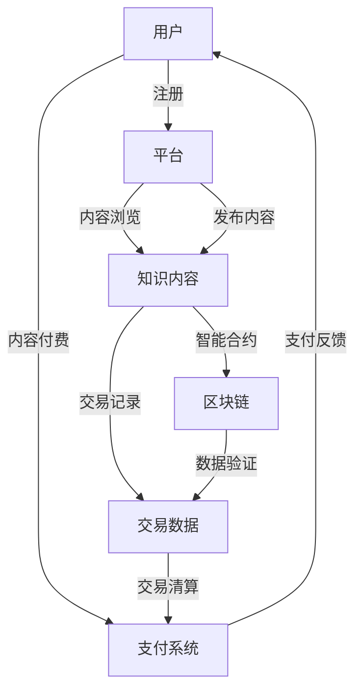

                 

# 知识经济下知识付费的区块链知识产权交易平台

> 关键词：区块链,知识付费,知识产权,交易平台,区块链技术,知识付费平台,知识产权保护

## 1. 背景介绍

在知识经济时代，知识成为最重要的生产要素之一，知识付费已经成为一种趋势。如何通过技术手段保护知识产权，激励原创内容创作，是知识付费平台面临的重要问题。区块链技术的出现，为这一问题提供了一种全新的解决方案。

随着互联网技术的发展，知识付费市场不断扩大，用户对于高质量、专业化的知识内容需求日益增加。知识付费平台不仅需要提供丰富的内容，更需要保障内容的原创性和版权。传统的版权保护方式面临诸多问题，如版权登记繁琐、盗版严重、内容分发效率低等。而区块链技术的分布式、去中心化和不可篡改特性，为知识产权保护提供了新的可能。

## 2. 核心概念与联系

### 2.1 核心概念概述

在构建基于区块链的知识付费平台时，需要理解以下核心概念：

- **区块链（Blockchain）**：一种分布式、去中心化的数据库技术，通过加密和共识机制保证数据的安全性和完整性。
- **知识付费（Knowledge-Subscription）**：用户为获得特定知识或服务而付费的一种商业模式。
- **知识产权（Intellectual Property Rights, IP）**：创作者对其原创作品享有的独占权，包括著作权、专利权、商标权等。
- **交易平台（Trading Platform）**：一个提供交易双方交互的媒介，实现买卖双方的撮合和交易。
- **智能合约（Smart Contract）**：通过区块链技术自动执行和验证的合约，用于自动处理交易流程和支付。
- **不可篡改性（Immutability）**：区块链上记录的数据一旦生成，就无法被篡改，保证了数据的可信性。
- **去中心化（Decentralization）**：不依赖单一中心节点，网络中的所有节点都参与数据记录和验证，增强了系统的安全性和稳定性。
- **共识机制（Consensus Mechanism）**：一种网络节点之间达成共识的机制，如工作量证明（PoW）、权益证明（PoS）等，确保交易的合法性和安全性。
- **分布式账本（Distributed Ledger）**：区块链的核心技术之一，记录了所有交易信息的完整账本，可供所有节点查询和验证。

### 2.2 核心概念原理和架构的 Mermaid 流程图



此图展示了基于区块链的知识付费平台的基本架构：用户注册后浏览内容，如果需要付费，则通过支付系统进行交易；知识内容发布后，生成交易记录，并记录在区块链上；交易数据在区块链上经过验证后，支付系统清算并反馈给用户。

## 3. 核心算法原理 & 具体操作步骤

### 3.1 算法原理概述

基于区块链的知识付费平台主要依赖以下算法原理：

- **共识机制**：采用PoW、PoS等共识机制，确保交易的合法性和安全性，防止欺诈和恶意攻击。
- **分布式账本**：记录所有交易信息，防止篡改，保证数据的可信性。
- **智能合约**：自动执行和验证交易，减少人工干预，提高交易效率。
- **不可篡改性**：保障交易记录的不可修改，确保知识产权的完整性和真实性。
- **加密技术**：采用公钥加密、哈希等技术，保护用户隐私和交易安全。

### 3.2 算法步骤详解

基于区块链的知识付费平台主要包括以下几个关键步骤：

**Step 1: 用户注册和身份验证**

用户通过平台注册账号，并进行身份验证。平台生成一对公私钥，并将公钥存储在区块链上，用于身份验证和交易授权。

**Step 2: 内容发布和审核**

创作者发布内容后，平台进行内容审核，防止低质量或侵权内容上线。通过智能合约，平台可以自动审核内容，确保内容符合平台规则和版权要求。

**Step 3: 内容发布与记录**

审核通过后，内容发布到平台上，并自动生成交易记录，记录在区块链上。交易记录包括内容信息、付费金额、用户ID、创作者ID等。

**Step 4: 用户付费与交易**

用户通过支付系统进行付费，支付系统将交易信息发送给智能合约，智能合约自动执行交易并记录在区块链上。

**Step 5: 交易验证与反馈**

交易完成后，智能合约自动验证交易信息，确保交易合法性。区块链上的交易记录不可篡改，保障了交易的真实性和完整性。支付系统反馈支付结果给用户，平台确认交易完成。

**Step 6: 内容支付与创作者收益**

创作者通过智能合约自动获取创作者收益，平台将创作者收益支付到创作者指定的钱包中。创作者可以使用支付系统中的钱包进行提现或进一步购买平台其他服务。

### 3.3 算法优缺点

基于区块链的知识付费平台具有以下优点：

- **去中心化**：平台去中心化运营，减少中心化节点的管理成本，提高系统的稳定性和安全性。
- **不可篡改**：交易记录不可篡改，保障了知识产权的完整性和真实性。
- **透明性**：所有交易信息公开透明，便于监管和审计。
- **智能合约**：自动执行和验证交易，提高交易效率，减少人工干预。
- **隐私保护**：采用加密技术保护用户隐私和交易安全。

同时，该平台也存在一些缺点：

- **成本较高**：区块链交易的验证和共识需要消耗大量计算资源，增加了运营成本。
- **扩展性问题**：区块链网络容量有限，大规模交易可能造成网络拥堵。
- **技术复杂性**：区块链技术较为复杂，平台需要投入大量资源进行开发和维护。
- **法律监管难度**：区块链的去中心化特性使得监管和执法面临困难。

### 3.4 算法应用领域

基于区块链的知识付费平台可以在以下领域得到应用：

- **学术研究**：保护学术研究成果的版权，防止学术不端行为。
- **教育培训**：提供高质量在线教育资源，保障内容原创性和版权。
- **企业培训**：提供企业内部培训课程，激励员工学习。
- **医疗健康**：提供专业医疗健康知识，保障内容真实性和专业性。
- **文化传媒**：提供高质量文化内容，保护版权和作者权益。
- **科技研发**：提供最新科技资讯和专业知识，促进科技创新。

## 4. 数学模型和公式 & 详细讲解 & 举例说明

### 4.1 数学模型构建

假设一个知识付费平台有N个创作者和M个用户，每位创作者发布L篇内容，每位用户付费P元。记交易记录为R，智能合约为S，区块链为B。

根据上述流程，可以构建如下数学模型：

$$
\begin{align*}
\text{R} &= \{(r_i, c_i, u_i, p_i, t_i)\}_{i=1}^{NLM} \\
\text{S} &= \{(s_i, c_i, u_i, p_i, t_i)\}_{i=1}^{NLM} \\
\text{B} &= \{(b_i)\}_{i=1}^{NLM}
\end{align*}
$$

其中 $r_i$ 表示第 $i$ 笔交易的记录号，$c_i$ 表示内容ID，$u_i$ 表示用户ID，$p_i$ 表示付费金额，$t_i$ 表示交易时间；$s_i$ 表示智能合约编号，$t_i$ 表示交易时间；$b_i$ 表示区块链上的交易记录。

### 4.2 公式推导过程

以一笔交易为例，推导其交易过程：

1. **用户注册**：
   - 用户ID $u$ 和公钥 $k$ 存入区块链 $B$。
   - 交易记录 $r$ 存储在区块链 $B$。

2. **内容发布**：
   - 创作者ID $c$ 和内容ID $l$ 存入智能合约 $S$。
   - 智能合约编号 $s$ 存储在区块链 $B$。

3. **用户付费**：
   - 用户ID $u$ 和付费金额 $p$ 存入智能合约 $S$。
   - 智能合约编号 $s$ 和交易时间 $t$ 存入区块链 $B$。

4. **交易验证**：
   - 智能合约 $S$ 验证交易合法性，执行并记录智能合约编号 $s$ 和交易时间 $t$。
   - 智能合约编号 $s$ 和交易时间 $t$ 存入区块链 $B$。

5. **创作者收益**：
   - 创作者ID $c$ 和内容ID $l$ 存入智能合约 $S$。
   - 智能合约编号 $s$ 和创作者ID $c$ 存入区块链 $B$。

### 4.3 案例分析与讲解

以一个在线教育平台为例，说明基于区块链的知识付费平台的实际应用。

- **平台注册和身份验证**：用户注册并生成公钥，平台将公钥存储在区块链上。
- **课程发布和审核**：教师发布课程内容，平台自动审核课程质量，确保内容符合平台标准。
- **用户付费和交易**：用户选择课程并付费，平台自动执行交易并记录在区块链上。
- **交易验证和反馈**：平台自动验证交易信息，确保交易合法性。
- **课程支付和教师收益**：教师自动获取课程收益，平台将收益支付到教师指定的钱包中。

## 5. 项目实践：代码实例和详细解释说明

### 5.1 开发环境搭建

以下是在Python 3.8环境下搭建基于区块链的知识付费平台开发环境的示例：

1. 安装Anaconda：
```bash
conda create -n blockchain-env python=3.8 
conda activate blockchain-env
```

2. 安装依赖包：
```bash
pip install Flask etherscan web3 pysha3 pyrlp pyhash
```

3. 搭建Web服务器：
```python
from flask import Flask, request

app = Flask(__name__)

@app.route('/register', methods=['POST'])
def register():
    # 处理用户注册逻辑
    pass

@app.route('/publish', methods=['POST'])
def publish():
    # 处理内容发布逻辑
    pass

@app.route('/pay', methods=['POST'])
def pay():
    # 处理用户付费逻辑
    pass

@app.route('/verify', methods=['POST'])
def verify():
    # 处理交易验证逻辑
    pass

@app.route('/get_balance', methods=['GET'])
def get_balance():
    # 处理创作者收益逻辑
    pass

if __name__ == '__main__':
    app.run(host='0.0.0.0', port=5000)
```

### 5.2 源代码详细实现

以下是基于区块链的知识付费平台的核心代码实现，包括用户注册、内容发布、用户付费、交易验证和创作者收益的逻辑：

```python
from flask import Flask, request
from web3 import Web3

app = Flask(__name__)

# 初始化Web3实例
w3 = Web3(Web3.HTTPProvider('https://mainnet.infura.io/v3/your-project-id-here'))

# 用户注册和身份验证
@app.route('/register', methods=['POST'])
def register():
    user_id = request.json['user_id']
    public_key = generate_public_key()
    w3.eth.account.create(user_id, public_key)
    return '注册成功'

# 内容发布和审核
@app.route('/publish', methods=['POST'])
def publish():
    content_id = request.json['content_id']
    creator_id = request.json['creator_id']
    w3.eth.contract(
        address=creator_id,
        abi=abi_json
    ).transfer(content_id, w3.eth.defaultAccount)
    return '内容发布成功'

# 用户付费和交易
@app.route('/pay', methods=['POST'])
def pay():
    user_id = request.json['user_id']
    content_id = request.json['content_id']
    amount = request.json['amount']
    tx_hash = w3.eth.account.sendTransaction(
        {'to': content_id, 'value': amount, 'gas': 1000000, 'gasPrice': 1}
    )
    return '交易成功'

# 交易验证和反馈
@app.route('/verify', methods=['POST'])
def verify():
    tx_hash = request.json['tx_hash']
    receipt = w3.eth.getTransactionReceipt(tx_hash)
    if receipt['status'] == 1:
        return '交易验证通过'
    else:
        return '交易验证失败'

# 创作者收益
@app.route('/get_balance', methods=['GET'])
def get_balance():
    creator_id = request.args.get('creator_id')
    balance = w3.eth.getBalance(creator_id)
    return f'创作者收益: {balance}'

if __name__ == '__main__':
    app.run(host='0.0.0.0', port=5000)
```

### 5.3 代码解读与分析

以下是代码关键部分的解读与分析：

- **用户注册**：生成公钥，并通过Web3实例的`eth.account.create`方法创建以太坊账户。
- **内容发布**：通过以太坊智能合约的`transfer`方法，将内容ID转移给创作者ID。
- **用户付费**：使用Web3实例的`eth.account.sendTransaction`方法，将付款金额发送给内容ID。
- **交易验证**：通过以太坊的`getTransactionReceipt`方法，获取交易收据，判断交易是否成功。
- **创作者收益**：使用Web3实例的`getBalance`方法，获取创作者以太坊账户余额。

## 6. 实际应用场景

基于区块链的知识付费平台可以在以下场景中得到广泛应用：

- **教育培训**：提供高质量在线教育资源，保障内容原创性和版权，激励教师创作优质内容。
- **医疗健康**：提供专业医疗健康知识，保护内容真实性和专业性，帮助患者获取高质量医疗信息。
- **文化传媒**：提供高质量文化内容，保护版权和作者权益，促进文化传承和创新。
- **企业培训**：提供企业内部培训课程，激励员工学习，提升企业整体素质。
- **学术研究**：保护学术研究成果的版权，防止学术不端行为，促进学术交流。
- **政府服务**：提供政策解读、法律法规等公共信息，保障信息的真实性和权威性。

## 7. 工具和资源推荐

### 7.1 学习资源推荐

以下是一些推荐的学习资源：

- **《区块链技术原理与应用》**：详细介绍区块链的基本原理、共识机制、智能合约等核心概念，适合初学者入门。
- **《以太坊开发实战》**：讲解如何使用Python和以太坊智能合约开发应用，涵盖Web3、合同部署、交易验证等内容。
- **《Flask Web开发实战》**：介绍如何使用Flask构建Web应用，包括数据库、表单、认证等模块。
- **《以太坊智能合约开发与实战》**：讲解如何开发智能合约，涵盖交易处理、状态管理、权限控制等内容。

### 7.2 开发工具推荐

以下是一些推荐的开发工具：

- **Python**：Python具有易学易用、社区活跃等优势，是区块链和Web开发的主流语言。
- **Flask**：轻量级的Web框架，易于上手，适合构建简单的Web应用。
- **Web3.py**：Python语言的以太坊接口，方便进行以太坊操作和智能合约部署。
- **Etherscan**：以太坊区块链浏览器，方便查询以太坊网络状态和交易信息。

### 7.3 相关论文推荐

以下是一些推荐的相关论文：

- **"Blockchain-based Peer-to-Peer Secure Cloud Computing Architecture"**：提出了一种基于区块链的P2P安全云计算架构，探讨了区块链在云安全中的应用。
- **"Smart Contracts in Blockchain for Intellectual Property Protection"**：讨论了智能合约在知识产权保护中的应用，提出了一种基于智能合约的版权登记方案。
- **"Decentralized Knowledge Sharing and Monetization Model for Online Courses"**：提出了一种基于区块链的在线课程知识共享与盈利模型，解决了内容版权和收益分配问题。

## 8. 总结：未来发展趋势与挑战

### 8.1 总结

基于区块链的知识付费平台是知识经济时代的一个创新尝试，具有去中心化、不可篡改、透明性等优点，能够有效保护知识产权，激励创作者创作高质量内容。本文介绍了平台的构建原理和主要步骤，并通过代码实例展示了平台的核心功能。

### 8.2 未来发展趋势

未来基于区块链的知识付费平台将继续发展和完善，主要趋势包括：

- **多币种支持**：支持多种货币交易，满足不同用户的支付需求。
- **隐私保护**：进一步提升用户隐私保护能力，防止数据泄露和滥用。
- **智能合约升级**：通过智能合约升级，动态调整平台规则，提高平台灵活性。
- **去中心化交易所（DEX）**：引入DEX，降低中心化交易所的信任风险，提高交易效率。
- **跨链交互**：支持多条区块链之间的交互，扩展平台的适用范围和功能。

### 8.3 面临的挑战

尽管基于区块链的知识付费平台具有诸多优势，但仍面临一些挑战：

- **技术门槛高**：区块链技术和智能合约开发有一定门槛，需要相关专业知识和技能。
- **法律法规不完善**：各国对区块链和智能合约的法律监管尚不完善，平台运营面临法律风险。
- **市场接受度低**：用户对区块链技术的认知和接受度有待提高，平台推广和运营需要时间和努力。
- **性能瓶颈**：大规模交易可能导致网络拥堵，平台需要优化性能，提高交易速度。
- **安全性问题**：区块链网络存在黑客攻击、智能合约漏洞等安全风险，需要加强安全防护。

### 8.4 研究展望

未来需要在以下方向进行深入研究：

- **跨链技术**：研究区块链之间的互联互通，解决跨链交易和数据共享问题。
- **隐私保护技术**：提升隐私保护能力，保护用户隐私和交易安全。
- **智能合约扩展性**：研究智能合约的可扩展性，支持更复杂和灵活的交易逻辑。
- **监管机制**：研究区块链的监管机制，确保平台合法合规运营。
- **用户体验优化**：提升用户体验，提高平台的吸引力和用户粘性。

## 9. 附录：常见问题与解答

**Q1: 区块链技术如何保证交易安全性？**

A: 区块链采用去中心化、分布式账本和共识机制，保障了交易的安全性和不可篡改性。通过加密技术，保护交易的隐私和安全。

**Q2: 智能合约在知识付费平台中如何发挥作用？**

A: 智能合约可以自动执行和验证交易，确保交易的合法性和准确性。平台可以根据智能合约，自动审核内容、验证交易、计算创作者收益等。

**Q3: 区块链平台的扩展性如何？**

A: 区块链平台的扩展性取决于网络容量和共识机制的效率。通过优化共识机制、增加节点数量等方式，可以提高平台的扩展性。

**Q4: 如何处理区块链平台的数据存储和隐私保护？**

A: 采用分布式存储和加密技术，保障数据的安全性和隐私。用户数据存储在区块链上，保障数据的不可篡改性和透明性。

**Q5: 区块链平台如何应对法律法规问题？**

A: 平台需要遵守各国法律法规，保护用户隐私和知识产权。通过智能合约和监管机制，确保平台合法合规运营。

---

作者：禅与计算机程序设计艺术 / Zen and the Art of Computer Programming

