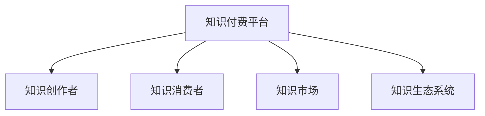

                 

# 知识经济时代下的知识付费创新商业模式设计

## 1. 背景介绍

### 1.1 问题由来
随着信息技术的飞速发展，知识传播和获取的方式已经发生了根本性的变化。在知识经济时代，知识不再仅仅是一种商品，更是一种生产力要素。知识付费模式作为知识传播的新趋势，正在重新定义知识的价值和传播路径。然而，现有的知识付费模式仍存在诸多问题：平台缺乏优质的内容生产者，用户参与度低，知识传播效果不理想等。因此，探索新的知识付费商业模式成为亟待解决的问题。

### 1.2 问题核心关键点
知识付费模式的核心在于建立知识供给方和需求方之间的有效连接，形成良性互动。关键点包括：

- 如何激励优质的内容创作者生产有价值的内容？
- 如何吸引更多用户参与知识消费？
- 如何构建可持续的知识传播生态系统？
- 如何提升知识传播的效果和效率？

### 1.3 问题研究意义
研究新的知识付费商业模式，对于拓展知识传播的新途径，提升知识的获取和应用效率，推动知识经济的快速发展，具有重要意义：

1. 促进知识经济的发展。通过知识付费，可以有效地激发知识的创造和传播，推动经济发展方式的转型升级。
2. 提升知识传播的效率和效果。知识付费模式可以根据用户需求，提供个性化的知识服务，提升知识传播的针对性和时效性。
3. 构建可持续的知识传播生态。知识付费可以形成良性的知识供给和需求互动，形成可持续发展的知识传播生态。
4. 增强用户的参与感和获得感。通过多样化的付费方式和互动机制，提升用户的参与感和获得感，增强用户的粘性。
5. 推动知识传播技术的创新。知识付费模式需要结合最新的技术手段，如大数据、人工智能等，提升知识传播的智能化和精准化水平。

## 2. 核心概念与联系

### 2.1 核心概念概述

为更好地理解知识付费模式，本节将介绍几个密切相关的核心概念：

- 知识付费(Knowledge-Based Subscription)：指用户通过付费方式获取有价值的知识产品或服务，形成知识消费的一种模式。

- 知识付费平台(Knowledge-Based Platform)：指提供知识付费服务和内容的第三方平台，如得到、付费QQ群、知识星球等。

- 知识创作者(Knowledge Creator)：指通过知识付费平台提供知识内容或服务的内容创作者，包括作家、学者、专家、自媒体等。

- 知识消费者(Knowledge Consumer)：指通过知识付费平台获取知识产品或服务，并进行消费的用户。

- 知识市场(Knowledge Market)：指知识供给方和需求方之间的交互空间，用户可以通过知识付费平台进行知识的获取和交易。

- 知识生态系统(Knowledge Ecosystem)：指知识付费平台、知识创作者、知识消费者之间形成的一种良性互动、相互促进的关系。

这些核心概念之间的逻辑关系可以通过以下Mermaid流程图来展示：



这个流程图展示了几大核心概念之间的联系：

1. 知识付费平台是知识供给方和需求方之间互动的平台。
2. 知识创作者通过平台提供知识产品和服务，赚取收益。
3. 知识消费者通过平台获取知识，并支付相应的费用。
4. 知识市场是知识供给和需求的具体表现形式。
5. 知识生态系统形成良性互动，推动知识的传播和创新。

## 3. 核心算法原理 & 具体操作步骤
### 3.1 算法原理概述

知识付费模式的核心在于建立知识供给方和需求方之间的有效连接，形成良性互动。其核心思想是：通过知识付费平台，激励优质的内容创作者生产有价值的内容，同时吸引更多的用户进行知识消费，构建可持续的知识传播生态系统。

形式化地，假设知识付费平台为 $P$，知识创作者为 $C$，知识消费者为 $U$，则知识付费模式的优化目标是最小化总成本，最大化总收益。即：

$$
\min_{P, C, U} C_{\text{total}} - B_{\text{total}} + T_{\text{interaction}}
$$

其中 $C_{\text{total}}$ 为知识创作者的总收入，$B_{\text{total}}$ 为用户支付的总费用，$T_{\text{interaction}}$ 为知识创作者和消费者之间的互动收益。

### 3.2 算法步骤详解

知识付费模式的一般流程包括：

**Step 1: 知识创作者入驻平台**
- 知识创作者通过平台提交其资质、作品等申请材料，进行审核。
- 平台对创作者进行资质审核，确保其专业性和可靠性。

**Step 2: 知识产品上架**
- 知识创作者将知识产品或服务上传到平台，填写详细的商品描述和价格信息。
- 平台对商品进行分类和管理，确保内容的科学性和准确性。

**Step 3: 知识产品推广**
- 平台通过多种渠道（如社交媒体、搜索引擎优化等）对知识产品进行推广。
- 知识创作者可以通过自有渠道进行推广，吸引更多用户关注和购买。

**Step 4: 用户付费消费**
- 用户通过平台浏览知识产品，选择感兴趣的商品进行购买。
- 平台对知识产品进行限时打折、满减等促销活动，吸引更多用户进行消费。

**Step 5: 知识创作者反馈**
- 平台对用户购买后的评价进行统计和分析，反馈给创作者。
- 创作者根据用户反馈，调整和优化其产品和服务，提升用户体验。

**Step 6: 知识消费者互动**
- 用户可以通过评论、问答、社交等功能与创作者进行互动。
- 平台对用户行为进行数据分析，挖掘用户需求，引导创作者进行内容创新。

### 3.3 算法优缺点

知识付费模式具有以下优点：

1. 激励优质内容的生产。通过平台激励机制，能够有效激励优质的创作者生产有价值的内容，丰富知识产品库。
2. 提升知识传播的效率和效果。知识付费模式可以根据用户需求，提供个性化的知识服务，提升知识传播的针对性和时效性。
3. 构建可持续的知识传播生态。知识付费平台通过提供奖励和激励，形成良性互动的生态系统。
4. 增强用户的参与感和获得感。通过多样化的付费方式和互动机制，提升用户的参与感和获得感，增强用户的粘性。
5. 推动知识传播技术的创新。知识付费模式需要结合最新的技术手段，如大数据、人工智能等，提升知识传播的智能化和精准化水平。

同时，该模式也存在一定的局限性：

1. 对创作者和消费者要求高。知识付费平台需要优质的创作者和大量高质量的内容，才能吸引更多用户。
2. 平台运营成本高。平台的推广、客服、审核等环节需要投入大量的人力和物力。
3. 用户获取成本高。平台需要进行大量的推广和宣传，才能吸引用户进行消费。
4. 内容质量参差不齐。部分创作者生产的内容质量不高，影响用户体验。
5. 用户忠诚度不高。用户对平台的粘性不足，容易流失。

尽管存在这些局限性，但就目前而言，知识付费模式仍是大规模知识传播的重要途径。未来相关研究的重点在于如何进一步优化平台运营机制，提升创作者和用户满意度，提高知识传播的效率和效果。

### 3.4 算法应用领域

知识付费模式已经在多个领域得到了广泛的应用，包括但不限于：

- 在线教育：通过知识付费模式，提供在线课程、一对一辅导等教育服务。
- 心理咨询：知识创作者提供专业的心理辅导和咨询服务，帮助用户解决心理问题。
- 职业培训：通过知识付费平台，提供职业技能培训和认证，提升用户的专业技能。
- 健身指导：知识创作者提供健身计划、营养建议等，帮助用户达到健康目标。
- 生活顾问：提供家庭管理、育儿指导、个人规划等生活咨询服务，提升用户的生活质量。

除了上述这些经典应用外，知识付费模式还被创新性地应用于更多场景中，如法律咨询、医疗健康、财经资讯等，为各行各业提供新的知识服务形式。

## 4. 数学模型和公式 & 详细讲解 & 举例说明

### 4.1 数学模型构建

本节将使用数学语言对知识付费模式进行更加严格的刻画。

记知识付费平台为 $P$，知识创作者为 $C$，知识消费者为 $U$，知识产品为 $K$。假设平台总收入为 $R$，总成本为 $C$，总收益为 $B$，知识创作者总收入为 $C_{\text{total}}$，用户支付的总费用为 $B_{\text{total}}$，创作者和用户之间的互动收益为 $T_{\text{interaction}}$。

定义知识付费平台的优化目标为最大化总收益，即：

$$
\max_{P, C, U} R - C + T_{\text{interaction}}
$$

在实践中，我们通常使用基于梯度的优化算法（如Adam、SGD等）来近似求解上述最优化问题。设 $\eta$ 为学习率，则参数的更新公式为：

$$
P \leftarrow P - \eta \nabla_{P}\mathcal{L}(P)
$$

其中 $\nabla_{P}\mathcal{L}(P)$ 为损失函数对平台参数 $P$ 的梯度，可通过反向传播算法高效计算。

### 4.2 公式推导过程

以下我们以在线教育平台为例，推导知识付费平台的优化目标函数及其梯度的计算公式。

假设平台上有 $n$ 门课程，每门课程的平均价格为 $p$，每门课程的平均流量为 $f$，平均购买率为 $r$。则平台的总收入 $R$ 为：

$$
R = \sum_{i=1}^n p_i f_i r_i
$$

平台的总成本 $C$ 包括内容制作成本、平台运营成本等，记为 $C_{\text{total}}$。则平台的总收益 $B$ 为：

$$
B = R - C_{\text{total}}
$$

创作者和用户之间的互动收益 $T_{\text{interaction}}$ 可以通过用户评论、点赞等行为量化，记为 $T_{\text{interaction}} = \alpha \sum_{i=1}^n r_i$
其中 $\alpha$ 为互动收益系数，$r_i$ 为课程 $i$ 的平均购买率。

将上述公式代入优化目标函数，得：

$$
\mathcal{L}(P) = B - \alpha \sum_{i=1}^n r_i
$$

其中 $\alpha$ 为互动收益系数，$r_i$ 为课程 $i$ 的平均购买率。

根据链式法则，损失函数对平台参数 $P$ 的梯度为：

$$
\frac{\partial \mathcal{L}(P)}{\partial P} = - \frac{\partial B}{\partial P} - \alpha \frac{\partial (\sum_{i=1}^n r_i)}{\partial P}
$$

其中 $\frac{\partial B}{\partial P}$ 和 $\frac{\partial (\sum_{i=1}^n r_i)}{\partial P}$ 分别表示平台总收入和互动收益对平台参数的梯度。

在得到损失函数的梯度后，即可带入参数更新公式，完成平台的迭代优化。重复上述过程直至收敛，最终得到最优平台参数 $P^*$。

## 5. 项目实践：代码实例和详细解释说明
### 5.1 开发环境搭建

在进行知识付费平台开发前，我们需要准备好开发环境。以下是使用Python进行Flask开发的环境配置流程：

1. 安装Anaconda：从官网下载并安装Anaconda，用于创建独立的Python环境。

2. 创建并激活虚拟环境：
```bash
conda create -n flask-env python=3.8 
conda activate flask-env
```

3. 安装Flask：
```bash
pip install flask
```

4. 安装必要的扩展库：
```bash
pip install flask_sqlalchemy flask_login flask_wtf
```

5. 初始化数据库：
```bash
flask db init
```

完成上述步骤后，即可在`flask-env`环境中开始开发知识付费平台。

### 5.2 源代码详细实现

这里我们以一个简单的知识付费平台为例，给出Flask开发的知识付费平台的代码实现。

首先，定义知识付费平台的数据库模型：

```python
from flask_sqlalchemy import SQLAlchemy

db = SQLAlchemy(app)

class User(db.Model):
    id = db.Column(db.Integer, primary_key=True)
    username = db.Column(db.String(80), unique=True, nullable=False)
    email = db.Column(db.String(120), unique=True, nullable=False)
    password = db.Column(db.String(120), nullable=False)

class Course(db.Model):
    id = db.Column(db.Integer, primary_key=True)
    title = db.Column(db.String(120), nullable=False)
    description = db.Column(db.Text, nullable=False)
    price = db.Column(db.Float, nullable=False)
    creator_id = db.Column(db.Integer, db.ForeignKey('user.id'), nullable=False)
    user = db.relationship('User', backref=db.backref('courses', lazy=True))

class Review(db.Model):
    id = db.Column(db.Integer, primary_key=True)
    user_id = db.Column(db.Integer, db.ForeignKey('user.id'), nullable=False)
    course_id = db.Column(db.Integer, db.ForeignKey('course.id'), nullable=False)
    rating = db.Column(db.Integer, nullable=False)
    comment = db.Column(db.Text, nullable=False)
    course = db.relationship('Course', backref=db.backref('reviews', lazy=True))
    user = db.relationship('User', backref=db.backref('reviews', lazy=True))
```

然后，定义知识付费平台的基本功能：

```python
from flask import Flask, render_template, request, redirect, url_for

app = Flask(__name__)

@app.route('/')
def index():
    courses = Course.query.all()
    return render_template('index.html', courses=courses)

@app.route('/course/<int:id>')
def course(id):
    course = Course.query.get(id)
    return render_template('course.html', course=course)

@app.route('/review', methods=['POST'])
def review():
    user_id = request.form.get('user')
    course_id = request.form.get('course')
    rating = request.form.get('rating')
    comment = request.form.get('comment')
    
    user = User.query.get(user_id)
    course = Course.query.get(course_id)
    review = Review(user=user, course=course, rating=rating, comment=comment)
    db.session.add(review)
    db.session.commit()
    
    return redirect(url_for('course', id=course_id))
```

最后，启动Flask应用并测试平台：

```python
if __name__ == '__main__':
    app.run(debug=True)
```

这个代码示例展示了知识付费平台的基础功能，包括课程展示、课程详情页、用户评价等。用户可以通过平台进行课程浏览、购买和评价，知识创作者可以发布和管理课程内容。

### 5.3 代码解读与分析

让我们再详细解读一下关键代码的实现细节：

**User模型**：
- 定义用户的基本信息，包括用户名、邮箱和密码等。
- 与课程表建立多对多关系，表示用户可以购买多个课程。

**Course模型**：
- 定义课程的基本信息，包括标题、描述、价格和创作者等。
- 与用户表建立多对多关系，表示一个课程可以有多个用户购买。

**Review模型**：
- 定义用户对课程的评价信息，包括用户ID、课程ID、评分和评论等。
- 与用户表和课程表建立多对多关系，表示一个用户可以对多个课程进行评价，一个课程也可以收到多个用户的评价。

**index函数**：
- 查询所有课程，并将结果传递给前端模板，展示课程列表。

**course函数**：
- 根据课程ID查询课程详情，并将结果传递给前端模板，展示课程详情页。

**review函数**：
- 接收用户提交的评价信息，将其保存到数据库中，并跳转到课程详情页。

在实际开发中，知识付费平台还需要添加更多功能，如用户注册、登录、支付、课程推荐等。开发者可以根据具体需求，扩展和优化平台的功能和性能。

## 6. 实际应用场景

### 6.1 在线教育平台

在线教育平台是知识付费模式的主要应用场景之一。通过知识付费平台，在线教育机构可以提供高质量的课程内容，帮助用户提升专业技能。用户可以根据自身需求，选择适合的课程进行学习。

在技术实现上，在线教育平台需要具备课程管理、用户管理、支付系统等功能模块。知识创作者可以上传课程视频、课件等，通过平台收取费用。平台需要具备用户注册、登录、支付、课程推荐等基础功能，同时支持多渠道推广和营销。

### 6.2 心理咨询平台

心理咨询平台通过知识付费模式，提供专业的心理辅导和咨询服务。知识创作者可以提供心理健康、职业规划、人际关系等方面的咨询服务。用户可以预约心理咨询师，获得个性化的心理支持和辅导。

在技术实现上，心理咨询平台需要具备用户预约、心理咨询师管理、支付系统等功能模块。平台需要具备高安全性和隐私保护能力，确保用户数据的安全性。

### 6.3 职业培训平台

职业培训平台通过知识付费模式，提供职业技能培训和认证。知识创作者可以提供职业技能培训课程，帮助用户提升专业技能。用户可以报名参加培训课程，通过考核获得相应的职业资格证书。

在技术实现上，职业培训平台需要具备课程管理、用户管理、支付系统等功能模块。平台需要具备高可靠性和稳定性，确保培训课程的顺利进行。

### 6.4 未来应用展望

随着知识付费模式的不断发展，未来的应用场景将更加广泛和多样化。以下是几个未来应用展望：

1. 知识共享平台：知识付费平台不仅提供付费内容，还可以提供免费的知识分享和交流平台。用户可以发布自己的知识内容，获取他人的反馈和认可，构建知识社区。

2. 定制化学习平台：知识付费平台可以根据用户的学习需求，提供定制化的学习计划和课程内容，提升学习效果和效率。

3. 虚拟现实平台：知识付费平台可以结合虚拟现实技术，提供沉浸式的知识学习体验。用户可以通过虚拟现实设备，进入虚拟课堂、实验室等场景，进行互动学习和实践。

4. 社交知识平台：知识付费平台可以结合社交功能，提供知识分享、讨论和交流的社交平台。用户可以建立自己的知识兴趣圈，与志同道合的朋友进行互动和分享。

5. 知识市场平台：知识付费平台可以构建知识市场，通过市场机制和激励机制，引导知识创作者生产有价值的内容，形成良性的知识供给和需求互动。

这些应用场景将进一步推动知识付费模式的创新和发展，为知识传播提供新的途径和形式。

## 7. 工具和资源推荐
### 7.1 学习资源推荐

为了帮助开发者系统掌握知识付费模式的理论和实践，这里推荐一些优质的学习资源：

1. 《知识付费商业模型与运营策略》系列博文：由知识付费领域的专家撰写，深入浅出地介绍了知识付费商业模型的基本概念和运营策略。

2. 《知识付费平台开发实战》课程：介绍知识付费平台的基础开发技术和工具，包括Flask、SQLAlchemy等。

3. 《知识付费平台案例分析》书籍：通过实际案例，展示知识付费平台的技术架构和业务流程，为开发者提供参考。

4. Udemy《知识付费平台的开发与运营》课程：通过实战项目，详细讲解知识付费平台开发的全过程，包括需求分析、系统设计、功能实现等。

5. Coursera《知识付费商业模式设计》课程：由知识付费领域的知名专家授课，涵盖知识付费商业模式的基本概念和运营策略。

通过对这些资源的学习实践，相信你一定能够快速掌握知识付费模式的精髓，并用于解决实际的问题。

### 7.2 开发工具推荐

高效的开发离不开优秀的工具支持。以下是几款用于知识付费平台开发的常用工具：

1. Flask：Python的轻量级Web框架，易于学习和使用，适合快速迭代研究。

2. SQLAlchemy：Python的SQL工具包，提供了丰富的SQL查询和操作功能，适合用于数据库设计和管理。

3. Flask-Login：Flask的认证扩展，提供了用户认证和授权功能，适合用于知识付费平台的用户管理。

4. Flask-WTF：Flask的表单扩展，提供了丰富的表单验证和处理功能，适合用于知识付费平台的表单处理。

5. Jupyter Notebook：Python的数据分析工具，支持代码、数据、可视化等功能的整合，适合用于数据探索和分析。

合理利用这些工具，可以显著提升知识付费平台开发的效率，加快创新迭代的步伐。

### 7.3 相关论文推荐

知识付费模式的发展源于学界的持续研究。以下是几篇奠基性的相关论文，推荐阅读：

1. 《知识付费商业模式的理论研究与实践探索》：探讨知识付费商业模式的基本概念和运营策略，为知识付费平台的开发和运营提供理论指导。

2. 《基于大数据的知识付费平台推荐系统设计》：介绍利用大数据技术优化知识付费平台的推荐系统，提升用户体验和知识传播效果。

3. 《知识付费平台的用户行为分析与预测》：分析知识付费平台的用户行为，预测用户需求，提升知识供给和需求的匹配度。

4. 《知识付费平台的内容创新与优化》：研究如何通过用户评价、反馈等数据，引导知识创作者进行内容创新和优化，提升知识产品的质量。

5. 《知识付费平台的个性化推荐算法研究》：研究如何利用个性化推荐算法，提升知识付费平台的推荐效果和用户满意度。

这些论文代表了大规模知识付费平台的研究进展，为知识付费平台的开发和运营提供了丰富的参考和借鉴。

## 8. 总结：未来发展趋势与挑战

### 8.1 总结

本文对知识付费模式进行了全面系统的介绍。首先阐述了知识付费模式的研究背景和意义，明确了知识付费模式的商业价值和潜在问题。其次，从原理到实践，详细讲解了知识付费模式的数学模型和关键步骤，给出了知识付费平台开发的完整代码实例。同时，本文还广泛探讨了知识付费模式在在线教育、心理咨询、职业培训等多个行业领域的应用前景，展示了知识付费模式的广阔前景。此外，本文精选了知识付费模式的学习资源，力求为读者提供全方位的技术指引。

通过本文的系统梳理，可以看到，知识付费模式正在成为知识传播的重要途径，极大地提升了知识的获取和应用效率。未来，伴随知识付费模式的持续演进，知识传播的生态系统将更加完善，知识经济的发展也将更加迅速。

### 8.2 未来发展趋势

展望未来，知识付费模式将呈现以下几个发展趋势：

1. 知识付费平台多元化。未来的知识付费平台不仅提供付费内容，还可能引入免费知识分享和社交功能，构建综合性的知识生态。

2. 知识付费内容个性化。知识付费平台可以根据用户的学习需求，提供定制化的学习计划和课程内容，提升学习效果和效率。

3. 知识付费平台智能化。未来的知识付费平台将结合人工智能和大数据分析技术，提升知识内容的推荐和个性化服务。

4. 知识付费平台国际化。未来的知识付费平台将面向全球用户，提供多语言支持和国际化服务，拓展知识传播的全球化进程。

5. 知识付费平台协同化。未来的知识付费平台将与教育机构、科研机构、政府部门等协同合作，共同推动知识的传播和创新。

这些趋势凸显了知识付费模式的广阔前景。这些方向的探索发展，必将进一步提升知识付费平台的用户体验和知识传播的效率和效果，推动知识经济的快速发展。

### 8.3 面临的挑战

尽管知识付费模式已经取得了瞩目成就，但在迈向更加智能化、普适化应用的过程中，它仍面临诸多挑战：

1. 平台运营成本高。知识付费平台的推广、客服、审核等环节需要投入大量的人力和物力。

2. 知识创作者收益不高。知识付费平台需要与创作者进行利益分成，创作者往往收益不高，影响创作的积极性。

3. 用户粘性不足。用户对平台的粘性不足，容易流失，平台需要不断优化用户体验和功能，提升用户满意度。

4. 内容质量参差不齐。部分创作者生产的内容质量不高，影响用户体验，平台需要加强内容审核和筛选。

5. 平台技术架构复杂。知识付费平台需要处理大量的用户数据和知识内容，技术架构需要具备高可靠性和扩展性。

6. 知识版权问题。知识付费平台涉及大量版权问题，需要制定明确的版权政策和规则，确保内容合法合规。

这些挑战需要知识付费平台在运营和管理上不断优化和创新，才能更好地推动知识付费模式的发展和应用。

### 8.4 研究展望

面向未来，知识付费模式的研究需要不断突破和创新：

1. 探索更加灵活的利益分配机制。如何通过公平的利益分配机制，激励知识创作者生产优质内容，是未来研究的重要方向。

2. 开发智能化的推荐算法。如何利用人工智能和大数据分析技术，提升知识内容的推荐效果，是未来研究的重点之一。

3. 构建开放的知识生态系统。如何通过开放合作，汇聚更多的知识创作者和消费者，形成良性的知识生态，是未来研究的难点之一。

4. 加强知识版权保护。如何通过技术手段和法律手段，保护知识创作者和消费者的权益，是未来研究的重要课题。

5. 推动知识的全球化传播。如何通过国际化的知识付费平台，推动知识的全球化传播和应用，是未来研究的挑战之一。

这些研究方向将引领知识付费模式的发展，推动知识经济的快速进步。

## 9. 附录：常见问题与解答

**Q1：知识付费模式是否适用于所有行业？**

A: 知识付费模式并不适用于所有行业。适合采用知识付费模式的行业，通常具备以下特点：

1. 需要高专业技能和知识积累。如在线教育、心理咨询、职业培训等领域，需要高技能和高知识的传播和应用。

2. 具备明确的目标用户群体。如家长、学生、职场人士等，有较强的付费意愿和消费能力。

3. 需要提供高价值的知识服务。如专业技能培训、心理辅导、职业规划等，能够为用户提供显著的价值提升。

4. 具备可量化的付费模式。如课程购买、咨询服务、定制化服务等，能够明确划分用户付费和知识创作者的收益。

**Q2：如何激励知识创作者生产优质内容？**

A: 激励知识创作者生产优质内容是知识付费模式的核心问题之一。以下是一些可能的激励机制：

1. 高收益分配。通过公平的利益分配机制，确保创作者能够获得较高的收益，提高其创作积极性。

2. 高质量内容奖励。通过平台审核机制，对优质内容给予奖励，如提高知名度、增加曝光量等。

3. 粉丝互动激励。通过平台社区功能，创作者可以与粉丝互动，获得认可和支持，提升创作动力。

4. 联合推广合作。平台与创作者联合进行市场推广，提高创作者的知名度和影响力。

5. 定制化服务支持。平台提供定制化的内容创作和传播支持，帮助创作者提升内容质量和传播效果。

6. 用户评价反馈。通过用户评价和反馈，创作者可以了解用户需求和评价，不断改进和优化其内容。

**Q3：如何构建可持续的知识付费生态？**

A: 构建可持续的知识付费生态是知识付费模式的重要目标。以下是一些可能的措施：

1. 平台透明化。平台应公开透明的运营机制和收益分配机制，提高用户和创作者的信任感。

2. 用户社区建设。平台应构建活跃的用户社区，通过用户互动和反馈，推动内容创新和优化。

3. 多元化知识服务。平台应提供多样化的知识服务，满足不同用户的需求，提升用户粘性和满意度。

4. 知识创作者培养。平台应提供培训和扶持机制，帮助创作者提升技能和创作水平，推动内容质量提升。

5. 知识市场规范化。平台应制定明确的版权政策和规则，确保内容合法合规，保护创作者和用户的权益。

6. 知识付费商业模式创新。平台应不断创新和优化商业模式，提升用户体验和知识传播效果。

这些措施需要平台在运营和管理上不断优化和创新，才能构建可持续的知识付费生态。

**Q4：如何提升知识付费平台的运营效率？**

A: 提升知识付费平台的运营效率是知识付费模式的重要目标。以下是一些可能的措施：

1. 大数据分析。平台应利用大数据分析技术，了解用户行为和需求，优化内容和推荐，提升用户满意度和粘性。

2. 自动化运营。平台应引入自动化工具和系统，如自动化审核、自动化客服等，提升运营效率和用户体验。

3. 云服务部署。平台应利用云计算资源，提供高可靠性和扩展性的部署环境，支持大规模用户和知识内容。

4. 数据安全和隐私保护。平台应加强数据安全和隐私保护措施，确保用户数据和内容的安全性。

5. 多渠道推广。平台应利用多渠道推广手段，如社交媒体、搜索引擎优化等，提升平台的知名度和用户获取率。

6. 用户反馈机制。平台应建立用户反馈机制，及时收集和处理用户意见，优化用户体验和平台功能。

这些措施需要平台在技术和管理上不断优化和创新，才能提升运营效率和用户满意度。

---

作者：禅与计算机程序设计艺术 / Zen and the Art of Computer Programming

