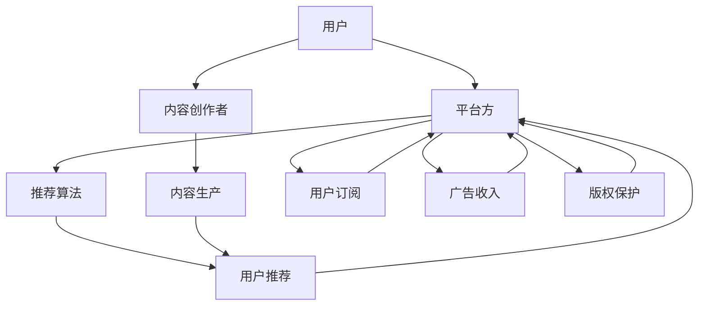

                 

# 知识经济时代下的知识付费创新商业模式运营

## 1. 背景介绍

### 1.1 问题由来
随着知识经济时代的到来，信息的价值愈发凸显。人们对于高效、精准获取知识的需求与日俱增，传统的免费信息共享模式已经难以满足这一需求。知识付费作为一种新兴的信息获取方式，在短时间内吸引了大量用户的关注和参与。其背后的逻辑在于，人们愿意为获取具有实际应用价值的高质量知识内容支付费用。

然而，知识付费领域也面临着诸多挑战。一方面，如何确保内容质量，提升用户体验，是知识付费平台必须解决的问题。另一方面，如何在激烈的市场竞争中，实现商业模式创新，吸引用户持续付费，也是亟需思考的方向。

### 1.2 问题核心关键点
为了应对上述问题，知识付费平台需要：
1. 构建一个优质且具吸引力的内容生态系统，不断提升用户黏性。
2. 探索多元化的商业模式，拓宽变现渠道。
3. 开发智能推荐算法，增强用户体验。
4. 建立有效的版权保护机制，保障内容创作者权益。
5. 采取数据驱动的运营策略，不断优化平台运营。

## 2. 核心概念与联系

### 2.1 核心概念概述

- **知识付费平台**：基于互联网平台，提供知识内容服务的业务模式。用户通过支付费用，获取高质量、高价值的知识信息。常见的知识付费平台包括Coursera、Udemy、知乎live等。

- **内容生态系统**：由知识内容创作者、平台方和用户三方共同构建的生态网络。优质内容创作者的生产和传播，是平台吸引用户、提升用户体验的关键。

- **推荐算法**：通过分析用户行为、偏好等数据，为不同用户推荐最符合其兴趣和需求的内容。推荐的精准度直接影响用户的满意度和平台的用户黏性。

- **版权保护**：通过法律和技术手段，保护内容创作者的合法权益，防止盗版和侵权行为，保障优质内容的产出和传播。

- **商业模式**：知识付费平台通过多元化的收入来源实现盈利，包括订阅模式、按需购买、打赏等多种形式。

- **数据驱动运营**：利用大数据和人工智能技术，对用户行为、内容消费等数据进行深度分析，为平台运营提供数据支持和决策依据。

### 2.2 核心概念原理和架构的 Mermaid 流程图



## 3. 核心算法原理 & 具体操作步骤
### 3.1 算法原理概述

知识付费平台的核心算法主要包括内容推荐、用户行为分析、个性化推荐等。这些算法依赖于大量用户行为数据，通过深度学习和数据挖掘技术，实现精准的内容推荐，提升用户体验。

#### 3.1.1 内容推荐算法
内容推荐算法主要基于协同过滤、基于内容的推荐、混合推荐等方法，通过对用户历史行为数据和内容特征的分析，为每个用户推荐最符合其兴趣和需求的内容。

#### 3.1.2 用户行为分析算法
用户行为分析算法通过分析用户在平台上的浏览、购买、点赞、评论等行为数据，构建用户画像，了解用户偏好和需求，从而更好地进行个性化推荐。

#### 3.1.3 个性化推荐算法
个性化推荐算法综合考虑用户的历史行为数据、内容属性、热门内容等多种因素，生成个性化推荐结果。常见的个性化推荐算法包括基于矩阵分解的推荐、深度神经网络推荐、基于迁移学习的推荐等。

### 3.2 算法步骤详解

以内容推荐算法为例，算法步骤如下：

1. **数据准备**：收集用户历史行为数据、内容属性数据等，构建用户-内容评分矩阵。

2. **特征提取**：对用户行为数据和内容属性数据进行特征提取，生成特征向量。

3. **模型训练**：基于用户-内容评分矩阵和特征向量，训练推荐模型，如协同过滤模型、深度神经网络模型等。

4. **推荐生成**：根据用户当前行为和模型预测结果，生成个性化推荐列表。

5. **结果反馈**：收集用户对推荐结果的反馈数据，不断优化模型和算法。

### 3.3 算法优缺点

#### 3.3.1 优点

1. **个性化推荐**：通过大数据和深度学习技术，实现精准的内容推荐，提升用户满意度和平台黏性。
2. **用户留存率提升**：精准推荐能够更好地满足用户需求，提高用户留存率。
3. **运营效率提升**：算法优化能够大幅提升运营效率，降低人工成本。

#### 3.3.2 缺点

1. **数据依赖性高**：推荐算法依赖大量高质量的用户行为数据，数据收集和处理难度较大。
2. **模型复杂性高**：推荐模型复杂，训练和推理计算量大，需要较高的硬件资源支持。
3. **冷启动问题**：新用户或新内容缺乏足够数据，推荐效果不佳。

### 3.4 算法应用领域

推荐算法在知识付费平台上得到广泛应用，例如：

- **内容推荐**：为用户推荐感兴趣的课程、书籍、文章等。
- **个性推荐**：根据用户历史行为和偏好，推荐个性化学习路径和内容组合。
- **社区推荐**：为用户推荐兴趣相投的创作者和用户，促进社区互动。

## 4. 数学模型和公式 & 详细讲解 & 举例说明

### 4.1 数学模型构建

以协同过滤推荐算法为例，假设用户-内容评分矩阵为 $R \in \mathbb{R}^{U \times I}$，用户特征矩阵为 $X \in \mathbb{R}^{U \times F}$，内容特征矩阵为 $Y \in \mathbb{R}^{I \times F}$，其中 $U$ 为用户数，$I$ 为内容数，$F$ 为特征数。

协同过滤模型的目标是最小化预测评分与真实评分之间的误差，即：

$$
\min_{\theta} \sum_{u,i} (r_{ui} - \theta^T (X_u \odot Y_i))^2
$$

其中 $\theta$ 为模型参数，$\odot$ 为元素乘法。

### 4.2 公式推导过程

矩阵分解形式的协同过滤算法，可以表示为：

$$
\hat{r}_{ui} = \sum_{j=1}^{F} x_{uj} \cdot y_{ij} \cdot \theta_j
$$

其中 $x_{uj}$ 和 $y_{ij}$ 分别为用户 $u$ 和内容 $i$ 的第 $j$ 个特征，$\theta_j$ 为对应特征的权重。

### 4.3 案例分析与讲解

以Coursera平台为例，平台收集用户学习课程的评分、评论、注册时间等数据，构建用户-课程评分矩阵 $R$。通过协同过滤算法，为用户推荐最符合其兴趣的课程。

假设用户 $u$ 对课程 $i$ 的评分未知，协同过滤算法可以通过用户 $u$ 的特征 $x_u$ 和课程 $i$ 的特征 $y_i$，计算其预测评分 $\hat{r}_{ui}$。如果 $\hat{r}_{ui}$ 大于阈值，则向用户推荐该课程。

## 5. 项目实践：代码实例和详细解释说明

### 5.1 开发环境搭建

开发环境搭建步骤如下：

1. **安装Python**：选择Python版本，安装 Anaconda 或 Miniconda，配置虚拟环境。

2. **安装依赖库**：安装 numpy、pandas、scikit-learn、scipy、matplotlib 等常用依赖库。

3. **搭建数据集**：使用 Pandas 等库，构建用户-内容评分矩阵，生成特征向量。

4. **训练模型**：使用 Scikit-learn 或 TensorFlow 等框架，训练推荐模型。

5. **评估模型**：使用交叉验证等方法，评估模型性能，调整模型参数。

### 5.2 源代码详细实现

以下是一个简单的协同过滤推荐算法实现示例：

```python
import numpy as np
from sklearn.neighbors import NearestNeighbors
from sklearn.metrics.pairwise import cosine_similarity

# 构建用户-内容评分矩阵
R = np.array([[5, 4, 0, 0, 0],
              [0, 0, 2, 5, 4],
              [0, 0, 0, 3, 2]])

# 特征矩阵
X = np.array([[1, 1],
              [2, 2],
              [3, 3]])
Y = np.array([[1, 0],
              [0, 1],
              [1, 1]])

# 模型参数
theta = np.array([0.5, 0.5])

# 构建协同过滤模型
nn = NearestNeighbors(n_neighbors=3, algorithm='brute')
nn.fit(R)

# 计算预测评分
pred = np.zeros_like(R)
for u in range(R.shape[0]):
    nn_u = nn.kneighbors(R[u], n_neighbors=3, return_distance=False)
    pred[u, nn_u] = np.dot(X[u], Y[nn_u].T) * theta

# 生成推荐列表
recommendations = np.where(pred >= 3)[0]

print(recommendations)
```

### 5.3 代码解读与分析

该代码主要实现了一个简单的协同过滤推荐算法，步骤如下：

1. **构建评分矩阵**：根据用户对课程的评分，构建用户-内容评分矩阵。

2. **构建特征矩阵**：根据用户特征和内容特征，构建特征矩阵。

3. **训练模型**：使用 NearestNeighbors 算法，训练协同过滤模型。

4. **预测评分**：根据用户特征、内容特征和模型参数，计算预测评分。

5. **生成推荐列表**：根据预测评分，生成推荐课程列表。

## 6. 实际应用场景

### 6.1 智能推荐系统

智能推荐系统在知识付费平台中得到广泛应用。例如，Coursera、Udemy 等平台通过推荐系统，为用户推荐最符合其兴趣的课程、书籍、文章等。通过智能推荐，平台能够提高用户黏性和留存率，增加平台收益。

### 6.2 内容创作激励机制

平台可以通过智能推荐系统，识别优质内容创作者，并为其提供更多的曝光机会和收益分成，激励更多优质内容的产出。例如，知乎live、百度百科等平台，通过智能推荐算法，将优秀创作者的文章、视频等内容推荐给更多用户，提升创作者收益。

### 6.3 广告和赞助合作

平台可以基于用户画像和内容推荐，定向推送广告和赞助信息。例如，某教育机构可以在平台上投放关于某课程的广告，平台通过推荐算法，将广告推送给对该课程有潜在兴趣的用户。

## 7. 工具和资源推荐

### 7.1 学习资源推荐

- **Coursera 和 Udacity 在线课程**：系统学习推荐算法和数据科学。
- **TensorFlow 官方文档**：深度学习框架，提供丰富的推荐算法实现和教程。
- **Scikit-learn 官方文档**：数据科学库，提供常用机器学习算法和模型实现。
- **Kaggle 竞赛平台**：通过参加推荐系统竞赛，积累实战经验。

### 7.2 开发工具推荐

- **Jupyter Notebook**：交互式编程环境，便于快速迭代开发。
- **TensorFlow**：深度学习框架，提供丰富的推荐算法实现。
- **PyTorch**：深度学习框架，支持动态图计算。
- **Pandas**：数据处理库，提供高效的数据操作功能。

### 7.3 相关论文推荐

- **《推荐系统实战》**：陈几点著，全面介绍推荐系统原理和实现。
- **《深度学习与推荐系统》**：王德民、孙志编著，系统讲解深度学习在推荐系统中的应用。
- **《推荐系统算法》**：王天下、李杨编著，介绍协同过滤、基于内容的推荐等多种推荐算法。

## 8. 总结：未来发展趋势与挑战

### 8.1 研究成果总结

知识付费平台的发展离不开高质量内容、个性化推荐、版权保护和数据驱动运营等多方面的努力。平台方需要不断优化推荐算法，提升用户体验，同时加强内容版权保护，吸引更多优质内容创作者。

### 8.2 未来发展趋势

1. **内容生态系统的完善**：构建更加开放、多元、健康的内容生态系统，吸引更多优质内容创作者。
2. **推荐算法的多样化**：采用更多样的推荐算法，如基于深度学习的推荐、基于用户画像的推荐等。
3. **数据驱动的运营**：利用大数据和人工智能技术，进行深度运营分析，优化平台运营策略。
4. **用户体验的提升**：不断优化界面设计和功能，提升用户黏性和满意度。
5. **多元化的商业模式**：探索更多元的变现渠道，如会员订阅、按需购买、广告合作等。

### 8.3 面临的挑战

1. **内容创作者权益保护**：如何通过技术手段，确保内容创作者权益，防止盗版和侵权。
2. **用户行为数据的隐私和安全**：如何保护用户隐私，防止数据泄露和滥用。
3. **推荐算法的公平性和公正性**：如何防止算法偏见，确保推荐结果的公平性和公正性。
4. **推荐算法的透明性和可解释性**：如何提高推荐算法的透明性和可解释性，增强用户信任。
5. **推荐算法的可持续性**：如何避免算法疲劳和过拟合，保持推荐系统的稳定性和长期有效性。

### 8.4 研究展望

未来的研究可以从以下几个方向进行探索：

1. **多模态推荐**：结合用户的多模态数据（如用户画像、社交网络、行为数据等），进行更加全面的推荐。
2. **实时推荐**：通过流式数据处理技术，实现实时推荐，提升用户满意度。
3. **跨平台推荐**：构建跨平台的推荐系统，提升用户在不同平台上的体验。
4. **推荐系统公平性**：研究推荐系统的公平性问题，防止算法偏见和歧视。
5. **推荐系统的可解释性**：研究推荐算法的透明性和可解释性，增强用户信任。

## 9. 附录：常见问题与解答

**Q1：如何评估推荐算法的性能？**

A: 推荐算法的性能评估主要通过以下指标：

- **准确率**：预测评分与真实评分的相似度。
- **召回率**：推荐列表中包含真实评分内容的比例。
- **F1 分数**：综合考虑准确率和召回率。
- **平均绝对误差**：预测评分与真实评分之间的平均绝对误差。

**Q2：推荐算法中如何处理冷启动问题？**

A: 冷启动问题是推荐算法中常见的问题，可以通过以下方法解决：

- **基于内容的推荐**：利用内容特征，对新用户进行推荐。
- **协同过滤推荐**：利用新用户的少量行为数据，进行推荐。
- **混合推荐**：结合多种推荐方法，提升推荐效果。
- **用户反馈机制**：收集新用户的反馈数据，进行推荐调整。

**Q3：如何在知识付费平台中实现用户行为分析？**

A: 用户行为分析可以通过以下步骤实现：

1. **数据收集**：收集用户的行为数据，如浏览、购买、点赞、评论等。
2. **数据清洗和预处理**：对收集到的数据进行清洗和预处理，去除噪声数据。
3. **特征提取**：对处理后的数据进行特征提取，生成用户画像。
4. **模型训练**：使用机器学习算法，训练用户行为分析模型。
5. **结果应用**：将分析结果应用到个性化推荐、用户激励等业务场景中。

**Q4：知识付费平台的商业模式有哪些？**

A: 知识付费平台的商业模式主要包括：

- **订阅模式**：用户按月或按年订阅，获取平台所有内容。
- **按需购买**：用户按需购买特定课程或内容。
- **打赏机制**：用户对优质内容进行打赏，激励内容创作者。
- **广告合作**：平台定向推送广告，获取广告收入。
- **知识变现**：平台推出付费问答、付费咨询等增值服务。

---

作者：禅与计算机程序设计艺术 / Zen and the Art of Computer Programming

