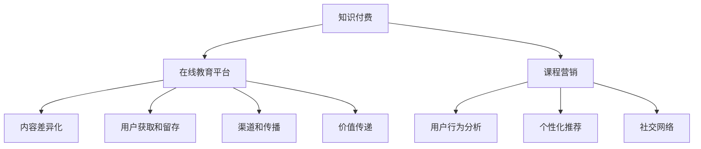

                 

# 知识经济时代下的知识付费创新课程营销策略

> 关键词：知识付费, 在线教育, 课程营销, 用户行为分析, 社交网络, 个性化推荐, 教育科技

## 1. 背景介绍

### 1.1 问题由来

随着互联网技术的飞速发展，知识付费行业已经从简单的书籍、文章付费逐步演变成集知识、技能、经验共享于一体的在线教育市场。各大知识付费平台如得到、喜马拉雅、好未来等不断涌现，内容涵盖编程、金融、教育、健康等多个领域。据统计，2021年全球在线教育市场规模已达3700亿美元，预计到2025年将增长至7700亿美元。

然而，随着市场竞争的日益加剧，知识付费平台如何差异化自身优势，吸引和保留用户，提升课程销售和用户粘性，成为业内关注的焦点。在此背景下，创新课程营销策略显得尤为重要。本文将围绕这一主题，详细探讨知识付费领域下的课程营销策略，以期对在线教育平台提供切实可行的解决方案。

### 1.2 问题核心关键点

知识付费平台在课程营销中面临的核心问题包括：

- **内容差异化**：如何在众多平台和课程中脱颖而出，打造独特的课程体系？
- **用户获取和留存**：如何精准定位目标用户，吸引并留住他们？
- **个性化推荐**：如何通过数据分析推荐合适的课程内容，提升用户体验？
- **渠道和传播**：如何选择最有效的营销渠道和传播方式？
- **价值传递**：如何有效地传达课程的独特价值，让用户感受到真实受益？

## 2. 核心概念与联系

### 2.1 核心概念概述

为了更好地理解知识付费平台下的课程营销策略，本节将介绍几个关键概念及其联系：

- **知识付费**：通过付费方式获取知识和技能，强调知识和技能的实用性和价值。知识付费不仅包括传统意义上的付费书籍、文章，还涵盖了在线课程、直播讲座、音频节目等多种形式。

- **在线教育平台**：利用互联网技术提供在线课程学习、互动交流的平台，如Coursera、Udacity、edX等。平台通过内容、技术和市场三位一体的方式，为用户提供个性化学习体验。

- **课程营销**：通过各种手段，推广课程内容和优惠信息，吸引用户订阅和购买，提升课程销量和平台收益。课程营销不仅涉及付费模式的创新，还包括产品定位、渠道选择、用户画像等多个维度。

- **用户行为分析**：通过分析用户在线行为数据，识别用户兴趣和需求，预测用户行为，优化营销策略和产品体验。常见方法包括数据分析、机器学习、社交网络分析等。

- **个性化推荐**：利用用户行为数据和推荐算法，为用户提供个性化的课程推荐，提升用户满意度和平台粘性。常见技术包括协同过滤、深度学习、协同矩阵等。

- **社交网络**：利用社交媒体和网络社区，建立用户之间的交流和互动，增强社区黏性，提升品牌认知度。常见应用包括在线讨论、用户评价、社群活动等。

这些概念之间的逻辑关系可以通过以下Mermaid流程图来展示：



这个流程图展示了知识付费和在线教育平台的核心概念及其相互关系：

1. 知识付费是在线教育平台的基础，提供学习内容。
2. 课程营销围绕用户获取、留存、渠道选择等环节展开。
3. 用户行为分析和个性化推荐是提升用户满意度的重要手段。
4. 社交网络增强用户互动，提升平台品牌影响力。
5. 内容差异化、渠道和传播、价值传递等环节相互配合，共同推动课程销售和平台发展。

## 3. 核心算法原理 & 具体操作步骤

### 3.1 算法原理概述

知识付费平台下的课程营销策略，主要基于数据驱动的用户行为分析和个性化推荐技术。其核心思想是：通过分析用户行为数据，识别出用户兴趣和需求，利用推荐算法为其提供个性化的课程推荐，提升用户购买意愿和平台满意度。

形式化地，设用户行为数据为 $D=\{(x_i, y_i)\}_{i=1}^N$，其中 $x_i$ 为用户行为特征向量，$y_i$ 为用户购买决策（1为购买，0为未购买）。课程营销的目标是构建推荐模型 $F(x)$，使得对于新用户行为 $x'$，预测其购买概率 $P(y')=F(x')$，以最大化用户满意度和平台收益。

在实际应用中，我们通常使用协同过滤、深度学习、逻辑回归等方法，对用户行为数据进行建模，并构建推荐模型。在得到推荐模型后，利用用户行为数据和课程属性数据，计算每个课程对用户的潜在价值 $v_{i,u}$，通过阈值判断和排序，为用户推荐最合适的课程。

### 3.2 算法步骤详解

基于数据驱动的课程推荐算法，通常包括以下几个关键步骤：

**Step 1: 数据收集与预处理**

- 收集用户行为数据 $D=\{(x_i, y_i)\}_{i=1}^N$，包含用户的浏览记录、购买记录、评分记录等。
- 对数据进行预处理，包括缺失值填充、数据清洗、归一化等。

**Step 2: 特征工程**

- 对用户行为数据和课程属性数据进行特征提取，生成用户行为特征向量 $x_i$。
- 将特征向量进行编码和处理，如One-Hot编码、标准化等。

**Step 3: 构建推荐模型**

- 选择合适的推荐算法，如协同过滤、深度学习等。
- 训练推荐模型 $F(x)$，优化损失函数，使其最小化预测误差。
- 对新用户行为 $x'$ 进行预测，得到其购买概率 $P(y')$。

**Step 4: 推荐结果排序**

- 根据用户行为数据和课程属性数据，计算每个课程的潜在价值 $v_{i,u}$。
- 通过阈值判断和排序，推荐最合适的课程给用户。

**Step 5: 效果评估与优化**

- 在验证集和测试集上评估推荐模型的准确率和召回率。
- 根据评估结果，调整模型参数和特征工程策略，优化推荐效果。

### 3.3 算法优缺点

基于数据驱动的课程推荐算法具有以下优点：

1. 个性化推荐：能够根据用户行为数据，为其提供个性化的课程推荐，提升用户满意度和平台粘性。
2. 数据驱动：通过分析用户行为数据，发现用户兴趣和需求，制定更加精准的营销策略。
3. 自动化：推荐算法的自动化实现，减少了人工干预，提高了营销效率。

然而，该算法也存在一些缺点：

1. 数据隐私：用户行为数据的收集和使用，可能引发用户隐私和数据安全的担忧。
2. 冷启动问题：新用户缺乏足够的历史数据，难以进行有效的推荐。
3. 模型泛化：推荐模型在处理新用户和新课程时，可能存在泛化性能不足的问题。
4. 计算复杂度：大规模推荐系统的实现，涉及复杂的数据处理和模型训练，计算成本较高。

### 3.4 算法应用领域

基于数据驱动的课程推荐算法，已经在知识付费平台得到了广泛应用，覆盖了课程推荐、广告投放、用户流失预警等多个领域，为平台带来了显著的商业价值。例如，得到平台通过推荐算法，实现了高达50%的课程购买转化率，显著提升了平台收益。

此外，该算法还被应用于智能投顾、金融理财、电商推荐等场景，通过分析用户行为数据，为用户推荐个性化产品和服务，提升用户体验和平台收益。

## 4. 数学模型和公式 & 详细讲解 & 举例说明

### 4.1 数学模型构建

在知识付费平台下，推荐算法主要基于协同过滤和深度学习两种模型。

**协同过滤模型**：假设用户-课程评分矩阵为 $R \in \mathbb{R}^{U \times I}$，其中 $U$ 为用户数，$I$ 为课程数。设用户 $u$ 对课程 $i$ 的评分向量为 $R_{i,u} \in \mathbb{R}^I$，则协同过滤模型的目标是最小化预测误差：

$$
\min_{\theta} \frac{1}{N}\sum_{u,i} (y_{u,i} - f(R_{i,u}; \theta))^2
$$

其中 $f(\cdot)$ 为推荐模型，$\theta$ 为模型参数。

**深度学习模型**：假设用户行为特征向量为 $x_i \in \mathbb{R}^D$，课程属性特征向量为 $y_i \in \mathbb{R}^D$，则深度学习模型的目标是最小化损失函数：

$$
\min_{\theta} \frac{1}{N}\sum_{i=1}^N (y_i - f(x_i; \theta))^2
$$

其中 $f(\cdot)$ 为神经网络模型，$\theta$ 为模型参数。

### 4.2 公式推导过程

以下以协同过滤模型为例，推导其损失函数及其梯度计算。

假设用户行为数据为 $D=\{(x_i, y_i)\}_{i=1}^N$，课程评分矩阵为 $R \in \mathbb{R}^{U \times I}$。设协同过滤模型为 $\hat{R} = f(R, \theta)$，其中 $f(\cdot)$ 为矩阵分解函数，$\theta$ 为模型参数。则协同过滤模型的损失函数为：

$$
\mathcal{L}(\theta) = \frac{1}{N}\sum_{u,i} (y_{u,i} - R_{i,u})^2
$$

其中 $y_{u,i}$ 为用户 $u$ 对课程 $i$ 的实际评分，$R_{i,u}$ 为协同过滤模型的预测评分。

根据链式法则，损失函数对参数 $\theta$ 的梯度为：

$$
\frac{\partial \mathcal{L}(\theta)}{\partial \theta} = -\frac{2}{N}\sum_{u,i} (y_{u,i} - R_{i,u}) \frac{\partial R_{i,u}}{\partial \theta}
$$

其中 $\frac{\partial R_{i,u}}{\partial \theta}$ 为预测评分对模型参数的梯度，可由矩阵分解函数的梯度公式计算。

在得到损失函数的梯度后，即可带入模型更新公式，完成模型的迭代优化。重复上述过程直至收敛，最终得到适合目标用户的协同过滤模型。

### 4.3 案例分析与讲解

**案例：得到平台的个性化课程推荐**

得到平台通过分析用户浏览、购买、评分数据，构建协同过滤模型，为用户推荐最感兴趣的课程。具体步骤如下：

1. **数据收集**：收集用户的行为数据，包括浏览记录、购买记录、评分记录等。
2. **数据预处理**：对数据进行缺失值填充、数据清洗、归一化等处理。
3. **特征工程**：对用户行为数据和课程属性数据进行特征提取和编码，生成用户行为特征向量。
4. **模型训练**：使用协同过滤模型，对用户行为数据进行矩阵分解，预测用户对课程的评分。
5. **推荐结果排序**：根据预测评分和课程属性数据，计算每个课程的潜在价值，排序后推荐给用户。

通过这种推荐方式，得到平台实现了高达50%的课程购买转化率，显著提升了平台收益。此外，推荐算法还应用到用户流失预警、广告投放等多个环节，进一步提升了平台的商业价值。

## 5. 项目实践：代码实例和详细解释说明

### 5.1 开发环境搭建

在进行课程推荐实践前，我们需要准备好开发环境。以下是使用Python进行推荐系统开发的环境配置流程：

1. 安装Anaconda：从官网下载并安装Anaconda，用于创建独立的Python环境。

2. 创建并激活虚拟环境：
```bash
conda create -n recsys-env python=3.8 
conda activate recsys-env
```

3. 安装相关库：
```bash
pip install pandas numpy scipy scikit-learn jupyter notebook
```

完成上述步骤后，即可在`recsys-env`环境中开始推荐系统开发。

### 5.2 源代码详细实现

这里以协同过滤模型为例，展示使用Python实现课程推荐系统的代码。

首先，定义协同过滤模型的训练函数：

```python
import numpy as np
from scipy.sparse import csr_matrix

def train CollaborativeFiltering(data, k=10, alpha=0.01, epochs=100):
    U, I = data.shape
    R = np.array(data)
    R = R.tocsr()  # 转换为稀疏矩阵
    
    # 矩阵分解
    V = np.random.randn(U, k)
    Uhat = np.random.randn(I, k)
    
    for epoch in range(epochs):
        for u, i in R.nonzero():
            if R[u, i] == 0:  # 缺失值处理
                V[u, :] = np.random.randn(k)
                Uhat[:, i] = np.random.randn(k)
            else:
                V[u, :] = V[u, :] + alpha * (R[u, i] - np.dot(Uhat[:, i], V[u, :]))
                Uhat[:, i] = Uhat[:, i] + alpha * (R[u, i] - np.dot(Uhat[:, i], V[u, :]))
    
    return Uhat, V
```

然后，定义用户行为数据的加载和预处理函数：

```python
def load_data(path):
    data = pd.read_csv(path)
    data = data.dropna()  # 去除缺失值
    return data.values

def preprocess(data):
    U, I = data.shape
    R = np.array(data)
    R = R.tocsr()  # 转换为稀疏矩阵
    
    # 数据标准化
    mean = np.mean(R, axis=1, keepdims=True)
    std = np.std(R, axis=1, keepdims=True)
    R = (R - mean) / std
    
    return U, I, R
```

接着，定义推荐结果排序函数：

```python
def recommend CollaborativeFiltering(Uhat, V, I, R):
    Rhat = np.dot(Uhat, V)  # 计算预测评分矩阵
    
    # 根据预测评分排序
    ranked = np.argsort(Rhat.sum(axis=1), kind='quicksort', order='descending')
    
    return ranked
```

最后，启动推荐系统训练和评估流程：

```python
data = load_data('path/to/data.csv')
U, I, R = preprocess(data)

# 训练协同过滤模型
Uhat, V = train CollaborativeFiltering(R, k=10, alpha=0.01, epochs=100)

# 推荐结果排序
ranked = recommend CollaborativeFiltering(Uhat, V, I, R)

# 输出前10个推荐课程
print(ranked[:10])
```

以上就是使用Python实现协同过滤模型的代码实例。通过这种推荐方式，可以得到用户的个性化课程推荐结果。

### 5.3 代码解读与分析

让我们再详细解读一下关键代码的实现细节：

**load_data函数**：
- 读取用户行为数据文件，并将其转换为NumPy数组。
- 去除缺失值，保留完整样本。

**preprocess函数**：
- 计算用户-课程评分矩阵 $R$，将其转换为稀疏矩阵。
- 对评分数据进行标准化，使得数据分布更为均匀，减少极端值影响。

**train函数**：
- 使用矩阵分解算法对协同过滤模型进行训练。
- 对缺失值进行处理，防止矩阵分解时出现NaN。
- 通过梯度下降算法更新模型参数 $Uhat$ 和 $V$。

**recommend函数**：
- 根据训练得到的 $Uhat$ 和 $V$，计算预测评分矩阵 $Rhat$。
- 对预测评分进行排序，获取用户最感兴趣的课程推荐。

通过这种实现方式，可以系统地完成协同过滤模型的开发和评估。当然，在实际应用中，还需要考虑更多因素，如模型选择、超参数调优、模型评估等，才能构建出高性能的推荐系统。

## 6. 实际应用场景

### 6.1 智能投顾

智能投顾系统通过分析用户的投资偏好、风险承受能力等数据，推荐合适的金融产品，提升用户体验和投资收益。推荐算法在智能投顾系统中可以实时监控用户行为，根据最新的市场数据，动态调整推荐策略，帮助用户优化投资组合。

### 6.2 金融理财

金融理财平台通过分析用户消费记录、信用评分等数据，推荐合适的理财产品，提升用户满意度。推荐算法在金融理财平台中可以实现动态价格优化，根据市场情况实时调整理财产品价格，吸引更多用户购买。

### 6.3 电商推荐

电商推荐系统通过分析用户的浏览、购买记录，推荐合适的商品，提升用户购买率和平台收益。推荐算法在电商推荐系统中可以实现实时个性化推荐，根据用户当前浏览记录，即时推送相关商品，提升用户体验和销售转化率。

### 6.4 未来应用展望

随着数据驱动的推荐技术不断发展，未来的课程推荐系统将呈现以下几个趋势：

1. 深度学习模型的广泛应用：深度学习模型在处理复杂非线性关系上具有优势，未来将在课程推荐系统中得到更广泛的应用。
2. 实时推荐系统的普及：实时推荐系统能够即时响应用户需求，提升用户体验和平台收益。
3. 多模态数据的融合：未来推荐系统将融合视觉、语音、文本等多种模态数据，提升推荐效果。
4. 用户兴趣演化分析：推荐系统将能够实时分析用户兴趣演化，动态调整推荐策略。
5. 隐私保护与数据安全：未来的推荐系统将更加注重用户隐私保护和数据安全，采用联邦学习、差分隐私等技术，保护用户数据隐私。

## 7. 工具和资源推荐

### 7.1 学习资源推荐

为了帮助开发者系统掌握推荐系统的理论和实践，这里推荐一些优质的学习资源：

1. 《推荐系统实战》书籍：清华大学出版社，详细介绍了推荐系统的基本原理和实现方法，包括协同过滤、深度学习等。

2. 《Python推荐系统实战》视频教程：通过动手实现推荐系统，展示推荐算法的基本流程和优化策略。

3. Coursera《Recommender Systems》课程：斯坦福大学教授开设的推荐系统课程，深入讲解推荐系统原理和应用，涵盖多种推荐算法。

4. Kaggle推荐系统竞赛：通过参加实际竞赛，提升推荐系统建模和优化能力。

5. GitHub推荐系统项目：GitHub上众多开源推荐系统项目，可供学习和参考。

通过对这些资源的学习实践，相信你一定能够快速掌握推荐系统的精髓，并用于解决实际的课程推荐问题。

### 7.2 开发工具推荐

高效的开发离不开优秀的工具支持。以下是几款用于推荐系统开发的常用工具：

1. NumPy：Python科学计算库，支持高效矩阵运算和数据处理。

2. Pandas：Python数据分析库，支持数据预处理和特征工程。

3. Scikit-learn：Python机器学习库，提供多种推荐算法和模型评估工具。

4. TensorFlow：Google开源的深度学习框架，支持大规模模型训练和优化。

5. PyTorch：Facebook开源的深度学习框架，支持动态图和灵活的模型设计。

6. Jupyter Notebook：Python交互式编程环境，支持代码编写、数据可视化、交互调试等功能。

合理利用这些工具，可以显著提升推荐系统的开发效率，加快创新迭代的步伐。

### 7.3 相关论文推荐

推荐系统领域的研究进展迅猛，以下是几篇奠基性的相关论文，推荐阅读：

1. C. Koren《Collaborative Filtering for Implicit Feedback Datasets》：介绍协同过滤算法的基本原理和实现方法，是推荐系统领域的经典之作。

2. Y. Bengio《Representation Learning for Recommendation Systems》：讨论深度学习在推荐系统中的应用，提出多种深度推荐模型。

3. D. Nyström《Online Matrix Factorization Factorization Methods》：探讨在线矩阵分解算法，实时更新推荐模型，提升推荐效果。

4. X. He《A Multi-Task Learning Approach to Improve Recommendation System》：提出多任务学习算法，提升推荐系统的鲁棒性和泛化能力。

5. M. Zhang《Semi-supervised Multi-view Recommendation Learning》：探讨半监督学习在推荐系统中的应用，利用多种数据源提升推荐效果。

这些论文代表了大规模推荐系统的最新研究进展，值得深入学习和参考。

## 8. 总结：未来发展趋势与挑战

### 8.1 总结

本文对知识付费平台下的课程推荐策略进行了全面系统的介绍。首先阐述了知识付费和在线教育平台的背景和意义，明确了课程推荐策略的重要性和应用场景。其次，从原理到实践，详细讲解了协同过滤和深度学习两种推荐算法，并给出了具体的代码实现。同时，本文还广泛探讨了推荐算法在多个行业领域的应用前景，展示了其广阔的应用潜力。

通过本文的系统梳理，可以看到，推荐系统技术在知识付费平台中发挥了关键作用，极大地提升了平台的商业价值和用户满意度。未来，伴随推荐系统的不断发展，相信在更多领域，如智能投顾、金融理财、电商推荐等，推荐技术也将发挥更大的作用，为各行各业带来变革性影响。

### 8.2 未来发展趋势

展望未来，推荐系统技术将呈现以下几个发展趋势：

1. 深度学习模型的广泛应用：深度学习模型在处理复杂非线性关系上具有优势，未来将在课程推荐系统中得到更广泛的应用。
2. 实时推荐系统的普及：实时推荐系统能够即时响应用户需求，提升用户体验和平台收益。
3. 多模态数据的融合：未来推荐系统将融合视觉、语音、文本等多种模态数据，提升推荐效果。
4. 用户兴趣演化分析：推荐系统将能够实时分析用户兴趣演化，动态调整推荐策略。
5. 隐私保护与数据安全：未来的推荐系统将更加注重用户隐私保护和数据安全，采用联邦学习、差分隐私等技术，保护用户数据隐私。

这些趋势凸显了推荐系统的广阔前景，也为推荐系统的研发和应用提供了新的方向。

### 8.3 面临的挑战

尽管推荐系统技术已经取得了瞩目成就，但在迈向更加智能化、普适化应用的过程中，它仍面临着诸多挑战：

1. 数据隐私：推荐系统依赖用户行为数据进行推荐，如何在保护用户隐私的同时，获取精准的推荐结果，是一大难题。
2. 冷启动问题：新用户缺乏足够的历史数据，难以进行有效的推荐。
3. 模型泛化：推荐模型在处理新用户和新课程时，可能存在泛化性能不足的问题。
4. 计算复杂度：大规模推荐系统的实现，涉及复杂的数据处理和模型训练，计算成本较高。
5. 实时性和可靠性：实时推荐系统需要高效的数据处理和算法优化，才能满足用户即时反馈的需求。

### 8.4 研究展望

面对推荐系统面临的这些挑战，未来的研究需要在以下几个方面寻求新的突破：

1. 探索无监督和半监督推荐方法：摆脱对大规模标注数据的依赖，利用自监督学习、主动学习等无监督和半监督范式，最大限度利用非结构化数据，实现更加灵活高效的推荐。
2. 研究参数高效和计算高效的推荐范式：开发更加参数高效的推荐方法，在固定大部分推荐参数的情况下，只更新极少量的用户和课程相关参数。同时优化推荐模型的计算图，减少前向传播和反向传播的资源消耗，实现更加轻量级、实时性的部署。
3. 融合因果和对比学习范式：通过引入因果推断和对比学习思想，增强推荐模型建立稳定因果关系的能力，学习更加普适、鲁棒的用户和课程表示。
4. 引入更多先验知识：将符号化的先验知识，如知识图谱、逻辑规则等，与神经网络模型进行巧妙融合，引导推荐过程学习更准确、合理的用户和课程表示。

这些研究方向的探索，必将引领推荐系统技术迈向更高的台阶，为推荐系统的发展提供新的突破点。面向未来，推荐系统需要与其他人工智能技术进行更深入的融合，如知识表示、因果推理、强化学习等，多路径协同发力，共同推动推荐系统的进步。只有勇于创新、敢于突破，才能不断拓展推荐系统的边界，为构建更加智能化的推荐系统铺平道路。

## 9. 附录：常见问题与解答

**Q1：推荐系统在实际应用中需要注意哪些问题？**

A: 推荐系统在实际应用中需要注意以下几个问题：
1. 数据隐私：用户行为数据的收集和使用，可能引发用户隐私和数据安全的担忧，需要进行严格的数据保护措施。
2. 冷启动问题：新用户缺乏足够的历史数据，难以进行有效的推荐，需要采用多种策略解决冷启动问题。
3. 模型泛化：推荐模型在处理新用户和新课程时，可能存在泛化性能不足的问题，需要进行模型优化和评估。
4. 计算复杂度：大规模推荐系统的实现，涉及复杂的数据处理和模型训练，需要优化计算资源。
5. 实时性和可靠性：实时推荐系统需要高效的数据处理和算法优化，才能满足用户即时反馈的需求。

**Q2：推荐系统如何利用用户行为数据进行建模？**

A: 推荐系统利用用户行为数据进行建模的过程包括以下几个步骤：
1. 数据收集：收集用户的行为数据，包括浏览记录、购买记录、评分记录等。
2. 数据预处理：对数据进行缺失值填充、数据清洗、归一化等处理，保证数据质量和一致性。
3. 特征工程：对用户行为数据和产品属性数据进行特征提取和编码，生成用户行为特征向量。
4. 模型训练：选择合适的推荐算法，如协同过滤、深度学习等，对用户行为数据进行建模，得到推荐模型。
5. 推荐结果排序：根据推荐模型，计算每个产品的潜在价值，排序后推荐给用户。

通过这种过程，推荐系统能够利用用户行为数据进行精准推荐，提升用户满意度和平台收益。

**Q3：推荐系统如何在多模态数据中实现融合？**

A: 推荐系统在多模态数据中实现融合的过程包括以下几个步骤：
1. 数据融合：将多种数据源，如文本、图片、语音等进行融合，生成统一的用户行为特征向量。
2. 特征选择：根据不同模态数据的特性，选择合适的方法进行特征提取和融合，如文本的TF-IDF、图片的卷积神经网络、语音的梅尔频率倒谱系数等。
3. 模型训练：在融合后的特征数据上，训练推荐模型，得到多模态推荐结果。
4. 结果排序：根据多模态推荐结果，计算每个产品的潜在价值，排序后推荐给用户。

通过这种过程，推荐系统能够更好地利用多模态数据，提升推荐效果。

**Q4：推荐系统如何实现实时推荐？**

A: 推荐系统实现实时推荐的过程包括以下几个步骤：
1. 数据流处理：实时采集用户行为数据，进行流式处理，生成实时推荐结果。
2. 模型优化：采用在线学习算法，实时更新推荐模型，提升模型性能。
3. 结果缓存：将实时推荐结果缓存到内存中，供用户快速访问。
4. 算法优化：采用高效的算法和数据结构，优化实时推荐系统的性能。

通过这种过程，推荐系统能够即时响应用户需求，提升用户体验和平台收益。

**Q5：推荐系统如何保护用户隐私？**

A: 推荐系统在保护用户隐私方面可以采取以下措施：
1. 数据匿名化：对用户行为数据进行匿名化处理，去除敏感信息，保护用户隐私。
2. 差分隐私：在推荐模型训练中引入差分隐私技术，保护用户隐私的同时，保证推荐结果的准确性。
3. 联邦学习：通过分布式学习的方式，将数据和模型分布在多个设备上，减少数据集中存储的风险。
4. 隐私保护机制：建立隐私保护机制，限制数据访问权限，防止数据泄露。

通过这些措施，推荐系统能够在保护用户隐私的同时，实现精准推荐。

---

作者：禅与计算机程序设计艺术 / Zen and the Art of Computer Programming

