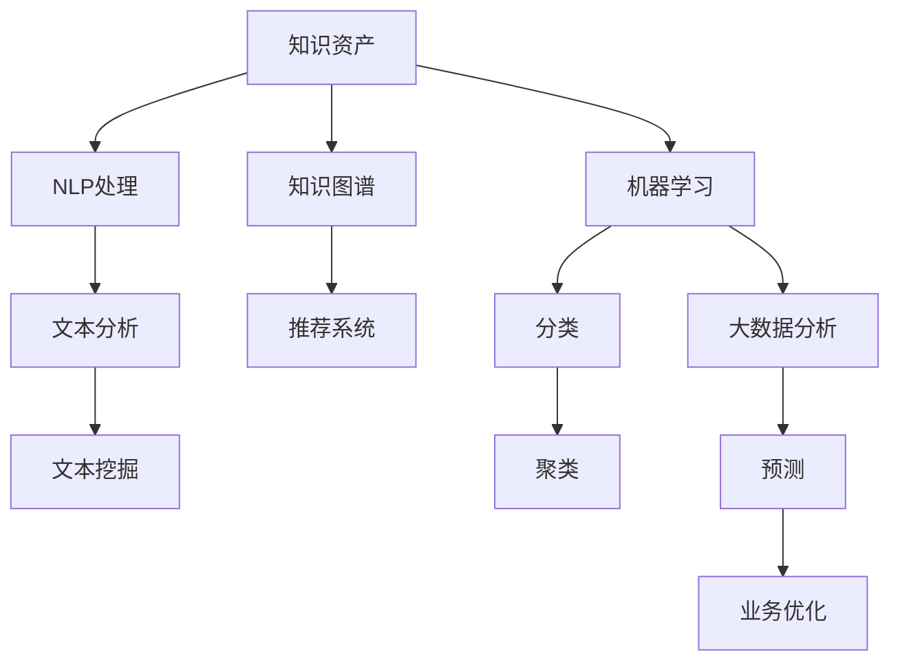

                 

# 知识资产要发掘和培育长期价值

## 1. 背景介绍

### 1.1 问题由来

在当今信息爆炸的时代，企业面临着一个重要的挑战：如何有效地管理和利用所积累的大量知识资产，以发掘其长期价值？传统的知识管理方式，如文档存档、笔记整理、定期培训等，往往难以适应快速变化的市场环境，且效率低下。而随着人工智能和大数据技术的发展，一种基于数据驱动、智能化的知识管理模式应运而生。

本博文将探讨如何通过技术手段，特别是人工智能和数据挖掘技术，发掘和培育企业知识资产的长期价值。我们将重点关注知识资产的识别、提取、组织和应用，以及在这一过程中可能遇到的技术挑战和解决方案。

### 1.2 问题核心关键点

1. **知识资产的识别与提取**：如何从海量的数据中自动识别有价值的信息，并进行结构化处理。
2. **知识资产的组织与管理**：如何设计高效的知识管理系统，将知识资产进行合理的分类、索引和管理。
3. **知识资产的应用与价值挖掘**：如何将知识资产转化为可操作的知识服务，支持企业决策和业务创新。
4. **技术手段的选择与优化**：如何选择最合适的技术手段，如自然语言处理、机器学习、大数据分析等，进行知识资产的处理和应用。
5. **知识资产的评估与优化**：如何对知识资产的应用效果进行评估，并不断优化和迭代。

通过系统回答这些问题，本博文旨在为读者提供全面、深入的知识资产管理实践指南。

## 2. 核心概念与联系

### 2.1 核心概念概述

在探讨知识资产的管理与利用时，以下几个关键概念需要重点理解：

- **知识资产**：企业内部积累的知识集合，包括文档、数据、流程、方法、经验等。
- **自然语言处理(NLP)**：通过计算机技术，将人类语言转换为计算机可以理解和处理的形式，进而提取和分析知识信息。
- **机器学习(ML)**：利用算法和统计模型，让计算机从数据中学习和发现规律，自动进行知识提取和分类。
- **大数据分析**：通过处理和分析大规模数据集，发现知识资产中的模式和关联，支持企业决策和业务优化。
- **知识图谱(KG)**：一种结构化的知识表示方式，通过节点和边来描述实体之间的关系和属性。
- **推荐系统**：利用用户行为数据，预测用户可能感兴趣的知识内容，进行个性化推荐。

这些概念之间的联系和相互作用可以通过以下Mermaid流程图来展示：



这个流程图展示了一个典型的知识资产管理流程：

1. 从知识资产中提取文本信息，通过NLP处理进行结构化。
2. 利用机器学习对提取的信息进行分类、聚类、预测等处理。
3. 通过大数据分析发现知识资产中的模式和关联，支持业务优化。
4. 构建知识图谱，形成结构化的知识表示。
5. 利用推荐系统对知识内容进行个性化推荐，支持用户获取和应用知识。

通过理解这些核心概念，我们可以更好地把握知识资产管理的技术框架和实践路径。

## 3. 核心算法原理 & 具体操作步骤

### 3.1 算法原理概述

知识资产管理涉及多个技术领域的融合应用，核心算法原理包括：

- **文本挖掘**：从文本数据中自动识别和提取有用的信息。
- **文本分类**：根据文本内容的特征，将其划分为预定义的类别。
- **实体识别**：从文本中识别出具体的实体，如人名、地名、组织机构名等。
- **情感分析**：判断文本中的情感倾向，进行情绪管理。
- **知识图谱构建**：通过关系抽取和实体链接，构建知识图谱，支持语义搜索和推理。
- **推荐系统算法**：根据用户行为数据，预测和推荐相关知识内容。

### 3.2 算法步骤详解

#### 3.2.1 文本挖掘与提取

文本挖掘和提取是知识资产管理的第一步。其步骤包括：

1. **文本收集**：从企业内部和外部收集相关文档、邮件、社交媒体等文本数据。
2. **文本预处理**：去除噪音和停用词，进行分词、词性标注等处理。
3. **文本特征提取**：使用TF-IDF、词向量等技术，将文本转换为计算机可以处理的向量表示。
4. **文本分析与挖掘**：应用自然语言处理技术，提取关键信息，如关键词、主题、情感等。

#### 3.2.2 文本分类与分类器训练

文本分类是将文本归类到预定义类别的过程。其主要步骤包括：

1. **数据准备**：将文本数据和对应的分类标签组成训练集和测试集。
2. **特征提取**：将文本转换为数值特征向量。
3. **模型选择与训练**：选择适当的分类算法（如朴素贝叶斯、支持向量机、神经网络等）进行模型训练。
4. **模型评估与优化**：在测试集上评估分类模型的性能，并根据评估结果进行模型优化。

#### 3.2.3 实体识别与命名实体识别器(NER)

实体识别是从文本中自动识别出具体的实体，如人名、地名、组织机构名等。其主要步骤包括：

1. **命名实体词典构建**：构建实体词典，存储常见的实体及其属性。
2. **实体识别模型训练**：使用标注数据训练实体识别模型，如条件随机场（CRF）、深度神经网络（CNN、RNN）等。
3. **实体链接与关系抽取**：将识别出的实体与知识图谱中的节点进行链接，抽取实体之间的关系。

#### 3.2.4 情感分析与情绪管理

情感分析是判断文本中情感倾向的过程，其步骤包括：

1. **情感词典构建**：构建情感词典，存储情感词汇及其情感极性。
2. **情感特征提取**：计算文本中情感词汇的情感得分。
3. **情感分类**：根据情感得分判断文本情感倾向。
4. **情绪管理**：根据情感分析结果，进行情绪识别和调整，支持企业决策和舆情管理。

#### 3.2.5 知识图谱构建与语义搜索

知识图谱构建是将知识资产结构化的过程，其步骤包括：

1. **实体抽取**：从文本中抽取实体及其属性。
2. **关系抽取**：抽取实体之间的关系。
3. **实体链接**：将抽取出的实体与知识图谱中的节点进行链接。
4. **图谱扩展与维护**：不断扩展和更新知识图谱，确保其准确性和完整性。
5. **语义搜索**：利用知识图谱进行语义搜索，支持快速查找和关联知识。

#### 3.2.6 推荐系统与个性化推荐

推荐系统是利用用户行为数据，预测和推荐相关知识内容的过程，其步骤包括：

1. **用户行为数据收集**：收集用户浏览、点击、购买等行为数据。
2. **用户画像构建**：根据用户行为数据，构建用户画像。
3. **推荐模型训练**：选择适当的推荐算法（如协同过滤、内容推荐、深度学习等）进行模型训练。
4. **推荐结果生成与展示**：根据用户画像和推荐模型，生成个性化推荐结果，并进行展示。

### 3.3 算法优缺点

#### 3.3.1 优点

- **高效性**：利用自动化的算法和模型，可以显著提高知识资产的处理和分析效率。
- **准确性**：通过精确的算法和模型，可以保证知识资产识别的准确性和可靠性。
- **可扩展性**：可以灵活处理大规模数据集，支持企业知识管理的长期发展。
- **智能化**：结合人工智能技术，可以实现知识资产的自动化挖掘和应用。

#### 3.3.2 缺点

- **数据依赖**：算法的准确性和效果高度依赖于数据的完备性和质量。
- **模型复杂度**：复杂算法和模型需要大量的计算资源和数据，可能存在过拟合风险。
- **用户隐私**：处理和分析用户行为数据可能涉及用户隐私，需要严格遵守相关法律法规。
- **技术门槛**：涉及多种技术领域的融合应用，需要具备较高的技术水平和经验。

### 3.4 算法应用领域

知识资产管理技术在多个领域都有广泛的应用，包括但不限于：

- **企业知识管理**：通过自动化处理和分析企业文档、邮件等，发掘企业知识资产的价值。
- **客户服务**：利用推荐系统，提供个性化客户服务，提升客户满意度。
- **市场分析**：利用情感分析和大数据分析，进行市场趋势和舆情分析。
- **产品开发**：通过知识图谱和实体链接，支持产品设计和创新。
- **人力资源管理**：利用知识图谱和推荐系统，进行人才推荐和管理。
- **金融风控**：通过情感分析和数据分析，进行风险评估和管理。

## 4. 数学模型和公式 & 详细讲解 & 举例说明

### 4.1 数学模型构建

知识资产管理的数学模型主要包括以下几个方面：

- **文本表示模型**：将文本转换为数值向量，以便于机器学习模型的处理。
- **分类模型**：用于文本分类的机器学习模型，如朴素贝叶斯、支持向量机、神经网络等。
- **实体识别模型**：用于命名实体识别的深度学习模型，如条件随机场、循环神经网络等。
- **情感分析模型**：用于情感分析的深度学习模型，如卷积神经网络、长短时记忆网络（LSTM）等。
- **推荐模型**：用于推荐系统的机器学习模型，如协同过滤、矩阵分解、深度学习等。

### 4.2 公式推导过程

#### 4.2.1 文本表示模型

文本表示模型包括词袋模型、TF-IDF、词向量模型（如Word2Vec、GloVe、BERT等）。以BERT为例，其文本表示公式为：

$$
\text{BERT embedding} = \text{Transformer}(\text{Word embedding})
$$

其中，Transformer为BERT的编码器结构，Word embedding为单词嵌入向量。

#### 4.2.2 分类模型

以朴素贝叶斯分类模型为例，其公式为：

$$
P(y|x) = \frac{P(y)}{P(x|y)P(x)}
$$

其中，$P(y|x)$为给定文本$x$属于类别$y$的概率，$P(y)$为类别$y$的概率，$P(x|y)$为给定类别$y$下，文本$x$的概率，$P(x)$为文本$x$的概率。

#### 4.2.3 实体识别模型

以条件随机场（CRF）模型为例，其公式为：

$$
P(y|x) = \frac{P(y)}{\prod_{i=1}^n P(x_i|y)}
$$

其中，$P(y)$为类别$y$的概率，$P(x_i|y)$为给定类别$y$下，文本$x_i$的概率，$P(x)$为文本$x$的概率。

#### 4.2.4 情感分析模型

以卷积神经网络（CNN）模型为例，其情感分析公式为：

$$
\text{sentiment score} = \sum_{i=1}^n \text{weight}_i \times \text{embedding}_i
$$

其中，$\text{embedding}_i$为文本中情感词$i$的嵌入向量，$\text{weight}_i$为情感词$i$的权重。

#### 4.2.5 推荐模型

以协同过滤（CF）模型为例，其推荐公式为：

$$
\text{recommendation} = \text{argmax}_{item} P(item|user, history)
$$

其中，$P(item|user, history)$为用户$u$在历史行为$history$下推荐物品$i$的概率，$\text{argmax}_{item}$表示选择概率最大的物品进行推荐。

### 4.3 案例分析与讲解

以一个具体的案例为例，说明知识资产管理的实践过程：

#### 4.3.1 案例背景

某大型企业希望利用人工智能技术，管理其积累的研发文档和专利信息，发掘其中包含的创新点和技术趋势，支持企业的技术创新和产品开发。

#### 4.3.2 数据收集与预处理

1. **数据收集**：从企业的文档管理系统、专利数据库、研发记录等渠道，收集相关文档和专利信息。
2. **文本预处理**：去除停用词和噪音，进行分词、词性标注等处理，构建文本语料库。

#### 4.3.3 文本表示与特征提取

1. **文本表示**：使用BERT模型将文本转换为向量表示。
2. **特征提取**：提取文本的关键信息，如关键词、主题等，构建特征向量。

#### 4.3.4 文本分类与主题分析

1. **分类模型训练**：使用支持向量机（SVM）模型进行文本分类，将文档和专利信息分为不同的主题。
2. **主题分析**：利用LDA（Latent Dirichlet Allocation）算法，发现文档和专利信息中的主要主题。

#### 4.3.5 实体识别与知识图谱构建

1. **实体识别**：使用命名实体识别器（NER）模型，从文本中识别出具体的实体，如专利号、技术名称等。
2. **知识图谱构建**：构建知识图谱，将识别出的实体和主题进行链接，形成结构化的知识表示。

#### 4.3.6 情感分析与趋势预测

1. **情感分析**：利用情感分析模型，分析专利信息中的情感倾向，预测技术趋势。
2. **趋势预测**：根据情感分析结果，进行技术趋势预测，支持企业的技术创新和产品开发。

#### 4.3.7 推荐系统与知识服务

1. **推荐模型训练**：使用协同过滤（CF）模型，为用户推荐相关专利信息。
2. **知识服务**：构建知识服务接口，支持用户进行知识检索、分析和应用，提升知识管理的智能化水平。

## 5. 项目实践：代码实例和详细解释说明

### 5.1 开发环境搭建

在开始知识资产管理的项目实践之前，首先需要搭建好开发环境。以下是基于Python和PyTorch的环境配置流程：

1. **安装Anaconda**：从官网下载并安装Anaconda，用于创建独立的Python环境。

2. **创建虚拟环境**：
```bash
conda create -n kaggle python=3.8
conda activate kaggle
```

3. **安装PyTorch**：根据CUDA版本，从官网获取对应的安装命令。例如：
```bash
conda install pytorch torchvision torchaudio cudatoolkit=11.1 -c pytorch -c conda-forge
```

4. **安装其他依赖包**：
```bash
pip install pandas numpy scikit-learn transformers
```

5. **下载预训练模型**：
```bash
python -m transformers-cli download bert-base-cased
```

完成上述步骤后，即可在`kaggle`环境中进行知识资产管理的代码实现。

### 5.2 源代码详细实现

以下是一个简单的示例代码，展示如何使用BERT模型进行文本分类和实体识别：

```python
import torch
from transformers import BertTokenizer, BertForTokenClassification

# 加载BERT模型和分词器
tokenizer = BertTokenizer.from_pretrained('bert-base-cased')
model = BertForTokenClassification.from_pretrained('bert-base-cased', num_labels=2)

# 加载训练数据
train_data = ['...', '...', '...']  # 包含训练样本的文本数据
train_labels = ['0', '1', '0', '1', '1']  # 对应的标签数据

# 定义训练函数
def train(model, data, labels, epochs):
    optimizer = torch.optim.Adam(model.parameters(), lr=2e-5)
    for epoch in range(epochs):
        model.train()
        for i, batch in enumerate(train_data):
            inputs = tokenizer(batch, padding=True, truncation=True, return_tensors='pt')
            outputs = model(**inputs)
            loss = outputs.loss
            optimizer.zero_grad()
            loss.backward()
            optimizer.step()

# 训练模型
train(model, train_data, train_labels, epochs=3)
```

这段代码展示了如何使用BERT模型进行文本分类任务。其中，`train`函数负责加载数据，定义优化器和训练过程。`BertForTokenClassification`模型用于处理文本分类任务，`BertTokenizer`用于分词和处理文本数据。

### 5.3 代码解读与分析

让我们详细解读一下代码中的关键部分：

1. **分词器和模型加载**：使用`BertTokenizer.from_pretrained`和`BertForTokenClassification.from_pretrained`加载分词器和模型。
2. **训练数据准备**：加载训练数据和标签，准备进行模型训练。
3. **定义训练函数**：使用`torch.optim.Adam`定义优化器，`model.train`进入模型训练模式。在每个批次上，通过`tokenizer`分词，输入模型进行前向传播和反向传播，更新模型参数。
4. **模型训练**：调用`train`函数进行模型训练，在多次迭代中更新模型参数。

## 6. 实际应用场景

### 6.1 智能客服系统

知识资产管理技术在智能客服系统中的应用，可以大幅提升客户服务的智能化水平。通过分析历史客服对话记录，提取常见问题和解决方案，构建知识库。利用文本分类和实体识别技术，将客户问题自动匹配到相应的解决方案，支持机器人自动回复和人工审核，从而提高客户满意度。

### 6.2 市场趋势分析

在市场分析中，利用知识资产管理技术，可以从大量新闻、报告和社交媒体数据中提取关键信息和情感分析，发现市场趋势和舆情变化。利用分类模型和情感分析模型，对不同主题的新闻和报告进行分类和情感分析，生成市场趋势报告，支持企业决策。

### 6.3 技术创新支持

知识资产管理技术可以支持企业的技术创新和产品开发。通过分析专利信息和技术文档，提取技术主题和创新点，构建知识图谱，支持企业进行技术创新和产品开发。利用推荐系统，为用户推荐相关专利和技术信息，支持知识共享和合作。

### 6.4 未来应用展望

未来，知识资产管理技术将在更多领域得到广泛应用，为企业带来深远的变革。在智慧医疗、智慧教育、智能制造等垂直行业，知识资产管理技术将推动各行业的数字化转型和智能化升级。通过结合人工智能和大数据技术，知识资产管理技术将不断演进，帮助企业发掘和培育知识资产的长期价值。

## 7. 工具和资源推荐

### 7.1 学习资源推荐

为了帮助开发者掌握知识资产管理的技术和方法，以下是一些优质的学习资源：

1. **《数据科学入门》（Data Science for Business）**：Coursera上的经典课程，涵盖数据处理、分析、可视化等基础概念。
2. **《自然语言处理综述》（Natural Language Processing）**：斯坦福大学公开课，介绍自然语言处理的基本理论和应用。
3. **《深度学习》（Deep Learning）**：Coursera上的课程，涵盖深度学习的基础知识和实践应用。
4. **《Python for Data Analysis》**：数据科学领域的经典书籍，介绍如何使用Python进行数据处理和分析。
5. **《TensorFlow实战》**：TensorFlow的官方文档和实战指南，涵盖TensorFlow的基础知识和应用场景。

通过学习这些资源，相信读者可以系统掌握知识资产管理的技术和方法。

### 7.2 开发工具推荐

知识资产管理技术的开发需要多种工具的协同工作，以下是几款推荐的工具：

1. **Jupyter Notebook**：基于Python的交互式编程环境，支持代码编写和数据分析。
2. **TensorFlow**：由Google开发的深度学习框架，支持大规模模型的训练和部署。
3. **PyTorch**：Facebook开发的深度学习框架，支持动态计算图和灵活的模型结构。
4. **NLTK**：Python的自然语言处理工具库，提供丰富的NLP功能，如分词、词性标注、实体识别等。
5. **Scikit-learn**：Python的机器学习库，支持分类、回归、聚类等多种机器学习算法。
6. **Keras**：基于TensorFlow和Theano的高级深度学习库，提供简单易用的API接口。

通过合理利用这些工具，可以大大提升知识资产管理项目的开发效率和实践效果。

### 7.3 相关论文推荐

知识资产管理技术的演进离不开学界的持续研究。以下是几篇奠基性的相关论文，推荐阅读：

1. **《知识图谱：语义搜索与推理》**：介绍知识图谱的概念、构建和应用。
2. **《基于自然语言处理的企业知识管理研究》**：探讨自然语言处理在企业知识管理中的应用。
3. **《数据驱动的知识推荐系统》**：介绍数据驱动的知识推荐系统及其优化方法。
4. **《知识资产的挖掘与利用》**：探讨知识资产的挖掘、提取和利用方法。
5. **《情感分析在市场趋势分析中的应用》**：介绍情感分析在市场趋势分析中的应用。

这些论文代表了大数据和人工智能技术在知识资产管理中的最新进展，有助于深入理解知识资产管理的技术细节和实践路径。

## 8. 总结：未来发展趋势与挑战

### 8.1 研究成果总结

本博文系统探讨了知识资产管理的原理和实践方法，从核心概念、算法原理、项目实践到实际应用，给出了全面深入的指南。通过分析典型案例和推荐学习资源，相信读者可以系统掌握知识资产管理的核心技术和方法。

### 8.2 未来发展趋势

知识资产管理技术的未来发展趋势包括：

1. **智能化水平提升**：结合人工智能和大数据技术，提升知识资产的智能化水平，实现自动化的知识挖掘和应用。
2. **多模态融合**：结合图像、视频、语音等多模态数据，实现更全面、更深入的知识表示和分析。
3. **实时化处理**：实现实时化的知识挖掘和应用，支持企业快速响应市场变化。
4. **跨领域应用**：将知识资产管理技术应用到更多垂直行业，提升各行业的数字化和智能化水平。
5. **隐私保护**：在知识资产管理过程中，严格保护用户隐私，确保数据安全。

### 8.3 面临的挑战

尽管知识资产管理技术已经取得显著进展，但仍面临以下挑战：

1. **数据获取与质量**：高质量、大规模的知识数据是知识资产管理的基础，但数据获取和处理成本较高。
2. **技术复杂度**：涉及多种技术领域的融合应用，需要较高的技术水平和经验。
3. **模型复杂性**：复杂的算法和模型需要大量的计算资源和数据，可能存在过拟合风险。
4. **知识融合**：如何将不同来源、不同模态的知识进行有效融合，仍然是一个难题。
5. **隐私保护**：在知识资产管理过程中，如何保护用户隐私，是一个重要的伦理和安全问题。

### 8.4 研究展望

面向未来，知识资产管理技术的突破需要从以下几个方面进行研究：

1. **无监督学习**：探索无监督学习技术，减少对标注数据和大量计算资源的依赖。
2. **多模态融合**：研究多模态数据融合方法，提升知识资产的全面性和准确性。
3. **实时化处理**：研究实时化处理技术，提升知识资产的实时性。
4. **隐私保护**：研究隐私保护技术，确保数据安全和用户隐私。
5. **知识融合**：研究知识融合技术，提升知识资产的整合能力。

通过不断突破和创新，知识资产管理技术将在各行业得到更广泛的应用，为企业的数字化转型和智能化升级提供有力支持。

## 9. 附录：常见问题与解答

### 9.1 常见问题

1. **知识资产管理与传统知识管理有什么区别？**
   - **回答**：知识资产管理结合了人工智能和大数据技术，可以实现自动化的知识挖掘和应用，提升知识管理效率和效果。

2. **知识资产管理技术的主要应用场景有哪些？**
   - **回答**：知识资产管理技术在智能客服、市场分析、技术创新支持等领域有广泛应用。

3. **知识资产管理中如何处理文本数据？**
   - **回答**：通过文本挖掘、文本表示、实体识别、情感分析等技术，自动提取和处理文本数据，构建知识图谱和推荐系统。

4. **知识资产管理的未来发展方向是什么？**
   - **回答**：知识资产管理的未来将更加智能化、实时化和跨领域化，结合多模态数据和多学科知识，提升知识管理的全面性和深度。

### 9.2 解答

通过对知识资产管理技术的深入探讨和实践，相信读者可以更好地理解和应用这一新兴领域的技术方法，推动企业知识管理的智能化和数字化升级。知识资产管理技术是企业在数字化转型中的重要引擎，未来的发展将为企业带来更广阔的发展机遇和创新空间。

---

作者：禅与计算机程序设计艺术 / Zen and the Art of Computer Programming

