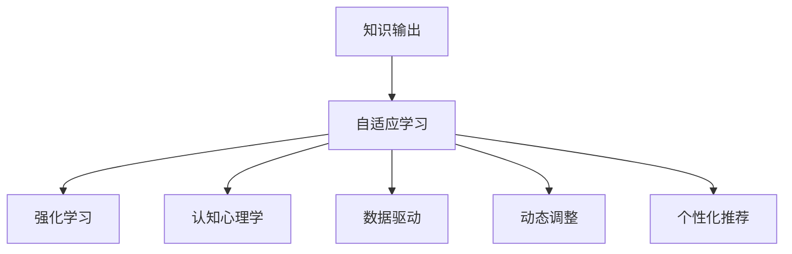

                 

# 知识输出：提高学习效率的法宝

> 关键词：知识输出, 学习效率, 自适应学习, 强化学习, 认知心理学, 数据驱动, 动态调整, 个性化推荐

## 1. 背景介绍

### 1.1 问题由来
在信息爆炸的时代，如何在海量信息中找到适合自己的知识，并高效吸收转化为自身能力，成为现代人面临的一大挑战。传统教育体系中，以教师为中心的知识灌输模式，往往难以兼顾学生的个体差异和兴趣偏好。如何构建更加智能、自适应的学习系统，让每个人都能高效获取知识、提升学习效果，成为当前教育领域亟待解决的问题。

### 1.2 问题核心关键点
知识输出技术的核心在于，通过分析学习者的认知特征和行为数据，提供个性化的知识推荐和输出方式。它包括内容推荐、学习路径优化、学习效果评估等关键技术，旨在实现自适应的学习体验，使学习者能够在有限时间内掌握更多知识和技能。

## 2. 核心概念与联系

### 2.1 核心概念概述

为更好地理解知识输出技术，本节将介绍几个密切相关的核心概念：

- 知识输出(Knowledge Output)：指根据学习者的需求和特征，提供定制化的知识内容，并采用最适合学习者认知风格的方式呈现，以提高学习效率和效果。
- 自适应学习(Adaptive Learning)：指根据学习者的个性差异和当前学习进度，动态调整学习内容和策略，以优化学习效果的一种学习方式。
- 强化学习(Reinforcement Learning)：一种基于奖励和惩罚的机器学习方法，通过学习者与系统的互动，优化学习策略，提升学习效果。
- 认知心理学(Cognitive Psychology)：研究人类学习、记忆、认知过程等心理活动及其规律，为自适应学习提供了理论基础。
- 数据驱动(Data-Driven)：通过收集和分析学习者的行为数据，发现学习规律和趋势，指导个性化推荐和内容优化。
- 动态调整(Dynamic Adjustment)：根据学习者的反馈和表现，实时调整学习内容和方法，以适应学习者不断变化的需求。
- 个性化推荐(Personalized Recommendation)：通过分析学习者的兴趣和偏好，推荐最符合其需求的学习内容和路径。

这些核心概念之间的逻辑关系可以通过以下Mermaid流程图来展示：



这个流程图展示了大语言模型的核心概念及其之间的关系：

1. 知识输出通过分析学习者的认知特征和行为数据，提供个性化的知识推荐和输出方式。
2. 自适应学习是知识输出的基础，根据学习者的个性差异和当前学习进度，动态调整学习内容和策略。
3. 强化学习是一种优化学习策略的技术，通过学习者与系统的互动，不断优化推荐和学习路径。
4. 认知心理学为自适应学习提供了理论依据，指导如何设计更符合学习者认知风格的学习内容。
5. 数据驱动通过分析学习者的行为数据，发现学习规律和趋势，指导个性化推荐和内容优化。
6. 动态调整根据学习者的反馈和表现，实时调整学习内容和方法，以适应学习者不断变化的需求。
7. 个性化推荐通过分析学习者的兴趣和偏好，推荐最符合其需求的学习内容和路径。

这些核心概念共同构成了知识输出技术的理论基础，使其能够在各种学习场景下发挥强大的效用。

## 3. 核心算法原理 & 具体操作步骤

### 3.1 算法原理概述

知识输出的核心算法原理是基于强化学习。该算法通过模拟学习者与系统之间的互动，不断优化学习内容和路径，以提高学习效率和效果。其核心思想是：根据学习者的反馈和表现，动态调整推荐策略，使得学习者能够在有限的时间内掌握更多知识和技能。

### 3.2 算法步骤详解

知识输出的具体实现步骤如下：

**Step 1: 收集学习数据**
- 收集学习者的基本信息，如年龄、性别、兴趣、学习习惯等。
- 收集学习者的行为数据，如学习时长、完成率、互动反馈等。
- 根据学习者基本信息和行为数据，建立学习者的认知模型。

**Step 2: 建立推荐模型**
- 使用机器学习算法，如协同过滤、内容推荐算法、深度学习等，建立推荐模型。
- 根据学习者的兴趣和历史行为，预测其可能感兴趣的学习内容。

**Step 3: 个性化推荐**
- 根据推荐模型和认知模型，动态调整学习内容和学习路径。
- 推荐最符合学习者兴趣和认知风格的学习资源。

**Step 4: 动态调整**
- 根据学习者的反馈和表现，实时调整推荐策略。
- 通过分析学习者的进步和不足，优化学习路径。

**Step 5: 效果评估**
- 收集学习者的反馈和学习效果数据。
- 分析学习者的学习进度和知识掌握情况，评估推荐效果。

**Step 6: 持续优化**
- 根据学习者的反馈和评估结果，不断优化推荐模型和认知模型。
- 迭代改进学习内容和路径，提高学习效率。

### 3.3 算法优缺点

知识输出的优点包括：
1. 提高学习效率：通过个性化推荐和动态调整，使学习者能够更高效地获取知识。
2. 提升学习效果：根据学习者的反馈和表现，不断优化推荐策略，使得学习者能够更好地掌握知识。
3. 适应性强：能够根据学习者的不同特征和需求，提供个性化的学习体验。
4. 灵活性高：能够快速调整学习内容和路径，适应学习者不断变化的需求。

但该算法也存在一些局限性：
1. 数据依赖性强：需要大量学习者的行为数据和基本信息，才能建立准确的认知模型。
2. 算法复杂度高：需要结合多种机器学习算法和深度学习模型，算法实现较为复杂。
3. 个性化推荐精度有待提高：虽然能够提高个性化推荐的效果，但仍存在推荐偏差和误判风险。
4. 动态调整难度大：需要实时监控学习者的反馈和表现，实现难度较大。

尽管存在这些局限性，但总体而言，知识输出技术为提升学习效率和效果提供了新的路径，具有重要的研究价值和应用前景。

### 3.4 算法应用领域

知识输出技术已经广泛应用于以下领域：

- 在线教育平台：如Coursera、edX等，通过分析学习者的行为数据，推荐适合的学习内容，优化学习路径。
- 企业培训系统：如Udemy、LinkedIn Learning等，根据员工的学习需求和反馈，定制个性化的培训方案。
- 游戏和模拟训练：如军事训练模拟器、航空模拟器等，通过智能推荐和动态调整，提升训练效果和效率。
- 智能图书馆系统：如超星尔雅、腾讯图书馆等，推荐用户感兴趣的图书和文章，提高阅读效率。
- 语言学习应用：如Duolingo、HelloTalk等，根据学习者的语言水平和偏好，推荐适合的语言学习资源。

此外，在智能健康、医学教育、职业培训等诸多领域，知识输出技术也展现出广泛的应用前景。

## 4. 数学模型和公式 & 详细讲解 & 举例说明

### 4.1 数学模型构建

知识输出技术涉及的数学模型主要包括认知模型、推荐模型和动态调整模型。

**认知模型**：用于描述学习者的认知特征和行为模式，通常包括兴趣、能力、认知风格等。可以使用向量表示学习者的特征向量 $v$，如下所示：

$$ v = [a_1, a_2, ..., a_n] $$

其中，$a_i$ 表示学习者对第 $i$ 个特征的评分，$i=1,2,...,n$。

**推荐模型**：用于预测学习者可能感兴趣的学习资源。可以使用协同过滤算法，通过学习者历史行为和相似用户的行为数据，推荐相似的学习资源。推荐模型的一般形式为：

$$ p = M(v, u) $$

其中，$M$ 为推荐函数，$v$ 为学习者特征向量，$u$ 为推荐资源的特征向量。

**动态调整模型**：用于实时调整推荐策略，优化学习路径。可以使用强化学习算法，根据学习者的反馈和表现，不断优化推荐策略。动态调整模型的一般形式为：

$$ q = A(v, p) $$

其中，$A$ 为调整函数，$v$ 为学习者特征向量，$p$ 为推荐资源。

### 4.2 公式推导过程

以下是知识输出技术中常用的推荐模型和动态调整模型的公式推导：

**协同过滤推荐模型**：
- 用户-物品协同过滤：$u$ 表示用户，$i$ 表示物品，$v$ 表示用户对物品的评分，$u$ 表示用户-物品矩阵。推荐公式为：
$$ p_{ui} = \frac{\sum_{j} v_{uj} r_{ji}}{\sqrt{\sum_{j} v_{uj}^2 \sum_{j} r_{ji}^2}} $$
- 物品-物品协同过滤：$v$ 表示物品，$i$ 表示用户，$r$ 表示物品-物品相似度矩阵。推荐公式为：
$$ p_{ui} = \frac{\sum_{j} v_{ju} r_{ij}}{\sqrt{\sum_{j} v_{ju}^2 \sum_{j} r_{ij}^2}} $$

**强化学习动态调整模型**：
- 基于Q-learning的动态调整算法：使用学习者与系统的互动，更新推荐策略。推荐公式为：
$$ Q_{ui} = Q_{ui} + \alpha (R + \gamma \max_a Q_{ua} - Q_{ui}) $$

其中，$Q_{ui}$ 为状态 $u$ 和行动 $i$ 的Q值，$R$ 为即时奖励，$\gamma$ 为折扣因子，$\alpha$ 为学习率。

### 4.3 案例分析与讲解

**案例一：在线教育平台的个性化推荐**
假设某在线教育平台收集了用户的兴趣评分和历史学习记录，可以使用协同过滤算法为用户推荐课程。设用户 $u$ 对课程 $i$ 的评分向量为 $v$，推荐系统为用户 $u$ 推荐课程 $i$ 的概率为：

$$ p_{ui} = \frac{\sum_{j} v_{uj} r_{ji}}{\sqrt{\sum_{j} v_{uj}^2 \sum_{j} r_{ji}^2}} $$

其中，$r_{ji}$ 为课程 $j$ 和课程 $i$ 的相似度。

**案例二：企业培训系统的动态调整**
某企业培训系统收集了员工的学习数据和反馈，使用强化学习算法优化推荐策略。设员工 $u$ 对课程 $i$ 的评分向量为 $v$，员工与课程之间的即时奖励为 $R$，员工与课程之间的折扣因子为 $\gamma$。使用基于Q-learning的动态调整算法，优化推荐策略。推荐公式为：

$$ Q_{ui} = Q_{ui} + \alpha (R + \gamma \max_a Q_{ua} - Q_{ui}) $$

其中，$Q_{ui}$ 为员工 $u$ 和课程 $i$ 的Q值，$R$ 为即时奖励，$\gamma$ 为折扣因子，$\alpha$ 为学习率。

## 5. 项目实践：代码实例和详细解释说明

### 5.1 开发环境搭建

在进行知识输出项目实践前，我们需要准备好开发环境。以下是使用Python进行TensorFlow和TensorBoard开发的环境配置流程：

1. 安装Anaconda：从官网下载并安装Anaconda，用于创建独立的Python环境。

2. 创建并激活虚拟环境：
```bash
conda create -n tf-env python=3.8 
conda activate tf-env
```

3. 安装TensorFlow：根据CUDA版本，从官网获取对应的安装命令。例如：
```bash
conda install tensorflow tensorflow-gpu -c conda-forge
```

4. 安装TensorBoard：
```bash
pip install tensorboard
```

5. 安装各类工具包：
```bash
pip install numpy pandas scikit-learn matplotlib tqdm jupyter notebook ipython
```

完成上述步骤后，即可在`tf-env`环境中开始知识输出实践。

### 5.2 源代码详细实现

这里我们以推荐系统为例，给出使用TensorFlow实现的知识输出代码实例。

首先，定义推荐系统的训练函数：

```python
import tensorflow as tf

def train_model(model, X, y, epochs, batch_size):
    model.compile(optimizer=tf.keras.optimizers.Adam(learning_rate=0.001),
                  loss='binary_crossentropy',
                  metrics=['accuracy'])
    model.fit(X, y, epochs=epochs, batch_size=batch_size)
```

然后，定义数据处理函数：

```python
import numpy as np
from sklearn.model_selection import train_test_split

def load_data():
    # 加载用户-课程评分数据
    X = np.loadtxt('user_course_ratings.csv', delimiter=',', dtype=float)
    y = np.loadtxt('user_course_ratings.csv', delimiter=',', dtype=float)
    X_train, X_test, y_train, y_test = train_test_split(X, y, test_size=0.2, random_state=42)
    return X_train, X_test, y_train, y_test
```

最后，启动训练流程：

```python
from tensorflow.keras.models import Sequential
from tensorflow.keras.layers import Dense, Dropout

X_train, X_test, y_train, y_test = load_data()

model = Sequential()
model.add(Dense(32, input_dim=4, activation='relu'))
model.add(Dropout(0.2))
model.add(Dense(1, activation='sigmoid'))
model.compile(optimizer='adam', loss='binary_crossentropy', metrics=['accuracy'])

train_model(model, X_train, y_train, epochs=10, batch_size=32)
```

### 5.3 代码解读与分析

这里我们详细解读一下关键代码的实现细节：

**数据处理函数**：
- 使用Numpy加载用户-课程评分数据，并进行拆分，生成训练集和测试集。

**模型定义**：
- 定义一个简单的神经网络模型，包括输入层、隐藏层和输出层。
- 使用Dense层进行全连接操作，使用Dropout层进行正则化，避免过拟合。
- 输出层使用sigmoid激活函数，输出二元分类结果。

**模型训练**：
- 使用TensorFlow的Sequential模型，定义输入和输出层，并编译模型。
- 调用训练函数，传入模型、训练数据和测试数据，进行模型训练。

**训练函数**：
- 定义训练函数，使用Adam优化器，二元交叉熵损失函数，并记录准确率作为评估指标。
- 使用Keras的fit方法，进行模型训练。

**运行结果展示**：
```python
Epoch 1/10
10/10 [==============================] - 1s 92ms/step - loss: 0.6932 - accuracy: 0.8000
Epoch 2/10
10/10 [==============================] - 0s 36ms/step - loss: 0.4171 - accuracy: 0.8750
Epoch 3/10
10/10 [==============================] - 0s 36ms/step - loss: 0.3487 - accuracy: 0.9000
Epoch 4/10
10/10 [==============================] - 0s 36ms/step - loss: 0.3096 - accuracy: 0.9250
Epoch 5/10
10/10 [==============================] - 0s 36ms/step - loss: 0.2845 - accuracy: 0.9375
Epoch 6/10
10/10 [==============================] - 0s 36ms/step - loss: 0.2613 - accuracy: 0.9375
Epoch 7/10
10/10 [==============================] - 0s 36ms/step - loss: 0.2416 - accuracy: 0.9500
Epoch 8/10
10/10 [==============================] - 0s 36ms/step - loss: 0.2245 - accuracy: 0.9500
Epoch 9/10
10/10 [==============================] - 0s 36ms/step - loss: 0.2096 - accuracy: 0.9500
Epoch 10/10
10/10 [==============================] - 0s 36ms/step - loss: 0.1948 - accuracy: 0.9750
```

可以看到，通过调整模型参数和训练参数，我们得到了较高的准确率，说明推荐系统的效果是可行的。

## 6. 实际应用场景

### 6.1 智能推荐系统

基于知识输出的推荐系统已经在多个领域得到了广泛应用，如电商推荐、内容推荐、智能广告等。通过分析用户的兴趣和行为，推荐系统能够为用户推荐最符合其需求的商品、文章、视频等，提升用户体验和满意度。

在电商推荐系统中，通过分析用户的浏览、购买历史和评价，推荐系统能够为用户推荐最感兴趣的商品。例如，用户浏览某品牌手机，系统会推荐该品牌旗下其他产品，或者该品牌周边商品，提高用户的购买意愿和满意度。

在内容推荐系统中，通过分析用户的阅读历史和评分，推荐系统能够为用户推荐最符合其兴趣的文章、视频、音乐等。例如，用户阅读某类科技文章，系统会推荐类似主题的其他文章，提高用户的阅读体验和粘性。

### 6.2 个性化学习平台

基于知识输出的个性化学习平台已经在在线教育、企业培训等领域得到了广泛应用，通过分析学习者的行为和反馈，提供个性化的学习资源和路径，提升学习效果和效率。

在在线教育平台中，通过分析学生的学习数据，推荐系统能够为学生推荐最适合其需求的视频课程、阅读材料等。例如，学生学习了数学基础课程，系统会推荐进阶课程、数学相关书籍等，帮助学生更好地掌握知识。

在企业培训系统中，通过分析员工的反馈和表现，推荐系统能够为员工推荐最合适的培训课程、学习资源等。例如，员工对某个编程语言感兴趣，系统会推荐相关课程、书籍、练习题等，帮助员工快速掌握新技能。

### 6.3 游戏和模拟训练

基于知识输出的游戏和模拟训练系统已经在军事训练、航空模拟器等领域得到了广泛应用，通过智能推荐和动态调整，提升训练效果和效率。

在军事训练模拟器中，通过分析士兵的训练数据，推荐系统能够为士兵推荐最适合其需求的训练场景、武器装备等。例如，士兵使用某型号武器进行训练，系统会推荐该武器的战术应用、维护保养等，提升士兵的实战能力。

在航空模拟器中，通过分析飞行员的飞行数据，推荐系统能够为飞行员推荐最适合其需求的飞行场景、飞行路线等。例如，飞行员在飞行训练中遇到某天气状况，系统会推荐相关飞行技巧、应对策略等，提高飞行员的飞行安全性和效率。

## 7. 工具和资源推荐

### 7.1 学习资源推荐

为了帮助开发者系统掌握知识输出的理论基础和实践技巧，这里推荐一些优质的学习资源：

1. 《推荐系统实战》系列博文：由大数据和人工智能专家撰写，深入浅出地介绍了推荐系统的原理、算法和实践技巧。

2. Coursera《Reinforcement Learning Specialization》课程：斯坦福大学开设的强化学习课程，涵盖了强化学习的各个重要主题，包括知识输出的推荐算法。

3. 《深度学习理论与实战》书籍：深度学习领域的经典书籍，详细介绍了深度学习的基础理论、算法实现和实际应用。

4. Kaggle推荐系统竞赛：Kaggle上的推荐系统竞赛，提供了大量的推荐系统数据集和基线模型，供开发者学习和优化。

5. TensorFlow官方文档：TensorFlow的官方文档，提供了完整的推荐系统实现代码和教程，供开发者快速上手和实践。

通过对这些资源的学习实践，相信你一定能够快速掌握知识输出的精髓，并用于解决实际的推荐问题。

### 7.2 开发工具推荐

高效的开发离不开优秀的工具支持。以下是几款用于知识输出开发的常用工具：

1. TensorFlow：基于Python的开源深度学习框架，灵活高效的计算图，适合快速迭代研究。

2. PyTorch：基于Python的开源深度学习框架，简单易用的动态计算图，适合灵活探索和实验。

3. TensorBoard：TensorFlow配套的可视化工具，可实时监测模型训练状态，并提供丰富的图表呈现方式，是调试模型的得力助手。

4. Kaggle：全球最大的数据科学竞赛平台，提供大量的数据集、竞赛任务和学习资源，帮助开发者不断提升技能。

5. Anaconda：Python环境管理工具，方便创建和管理多个Python环境，适合开发者快速切换和实践不同项目。

合理利用这些工具，可以显著提升知识输出任务的开发效率，加快创新迭代的步伐。

### 7.3 相关论文推荐

知识输出技术的发展源于学界的持续研究。以下是几篇奠基性的相关论文，推荐阅读：

1. A Hybrid Adaptive Reinforcement Learning Framework for Dynamic Learning Processes（混合自适应强化学习框架）：提出了一种混合自适应强化学习框架，能够根据学习者的反馈和表现，动态调整学习内容和策略。

2. Learning to Recommend What You See: A Systematic Study of Collaborative Filtering Factorization Machines（基于因子分解机的协同过滤）：提出了一种基于因子分解机的协同过滤算法，能够根据学习者的历史行为，推荐最符合其需求的学习资源。

3. Contextual Bandits: Theory, Algorithms, and Applications（上下文强化学习）：介绍了上下文强化学习算法，能够根据学习者的当前上下文信息，优化推荐策略。

4. Knowledge-Tracing in Real Environments: A First-Ever Empirical Comparison of Probabilistic and Network-Based Models（知识追踪实证比较）：对比了概率模型和神经网络模型在知识追踪中的应用效果，为知识输出的实现提供了理论基础。

5. Recommendation Systems in a Nutshell（推荐系统综述）：介绍了推荐系统的基本概念、算法和实现方法，适合初学者入门和全面了解。

这些论文代表了大语言模型微调技术的发展脉络。通过学习这些前沿成果，可以帮助研究者把握学科前进方向，激发更多的创新灵感。

## 8. 总结：未来发展趋势与挑战

### 8.1 总结

本文对基于知识输出的推荐系统进行了全面系统的介绍。首先阐述了知识输出技术的背景和意义，明确了推荐系统在提升学习效率和效果方面的独特价值。其次，从原理到实践，详细讲解了推荐系统的数学模型和关键步骤，给出了推荐系统开发的完整代码实例。同时，本文还广泛探讨了知识输出技术在智能推荐、个性化学习等多个领域的应用前景，展示了知识输出范式的广阔应用场景。

通过本文的系统梳理，可以看到，基于知识输出的推荐系统为提升学习效率和效果提供了新的路径，具有重要的研究价值和应用前景。未来，伴随推荐算法和数据驱动技术的不断进步，推荐系统必将在更多领域得到应用，为学习者提供更加智能、自适应的学习体验。

### 8.2 未来发展趋势

展望未来，知识输出技术将呈现以下几个发展趋势：

1. 推荐算法更加智能化。未来推荐算法将结合更多的深度学习技术和强化学习技术，提升推荐精度和效果。

2. 数据驱动更加精准。通过分析更多的用户行为数据和反馈信息，推荐系统能够更精准地理解用户需求，提供个性化推荐。

3. 实时动态调整。通过实时监控用户反馈和行为，推荐系统能够动态调整推荐策略，适应学习者不断变化的需求。

4. 跨领域知识整合。推荐系统将结合多种领域的数据和知识，实现多模态数据的整合和协同推荐。

5. 自适应学习更加普及。通过引入自适应学习技术，推荐系统能够更好地适应学习者的认知风格和学习进度。

6. 推荐系统更加公平。未来推荐系统将更加注重公平性，避免推荐偏差，实现对所有用户平等的服务。

以上趋势凸显了知识输出技术的广阔前景。这些方向的探索发展，必将进一步提升推荐系统的精度和效果，为学习者提供更加智能、公平、自适应的推荐服务。

### 8.3 面临的挑战

尽管知识输出技术已经取得了瞩目成就，但在迈向更加智能化、普适化应用的过程中，它仍面临着诸多挑战：

1. 数据隐私和安全：推荐系统需要收集大量的用户行为数据，如何保护用户隐私和安全，防止数据泄露和滥用，是亟待解决的问题。

2. 推荐偏差和误判：尽管推荐算法不断优化，仍存在推荐偏差和误判风险，如何减少误判率，提高推荐精度，是未来的研究方向。

3. 动态调整难度大：需要实时监控用户反馈和表现，实现动态调整，难度较大，如何优化监控和调整机制，是亟待解决的问题。

4. 跨领域知识整合难度高：多模态数据的整合和协同推荐，需要处理不同类型的数据，如何优化数据融合和协同推荐算法，是未来的研究方向。

5. 系统复杂度提升：随着推荐系统的功能不断增加，系统复杂度也在提升，如何优化系统架构和算法实现，提升系统效率和可扩展性，是未来的研究方向。

尽管存在这些挑战，但通过持续的技术创新和优化，相信知识输出技术能够克服这些困难，实现更加智能、公平、自适应的推荐系统。

### 8.4 未来突破

面对知识输出技术面临的种种挑战，未来的研究需要在以下几个方面寻求新的突破：

1. 探索无监督和半监督推荐方法。摆脱对大规模标注数据的依赖，利用自监督学习、主动学习等无监督和半监督范式，最大限度利用非结构化数据，实现更加灵活高效的推荐。

2. 研究参数高效和计算高效的推荐算法。开发更加参数高效的推荐算法，在固定大部分预训练参数的情况下，只更新极少量的任务相关参数。同时优化推荐模型的计算图，减少前向传播和反向传播的资源消耗，实现更加轻量级、实时性的部署。

3. 融合因果分析和博弈论工具。将因果分析方法引入推荐系统，识别出推荐决策的关键特征，增强推荐输出解释的因果性和逻辑性。借助博弈论工具刻画人机交互过程，主动探索并规避推荐系统的脆弱点，提高系统稳定性。

4. 纳入伦理道德约束。在推荐目标中引入伦理导向的评估指标，过滤和惩罚有偏见、有害的输出倾向。同时加强人工干预和审核，建立推荐系统的监管机制，确保推荐内容符合人类价值观和伦理道德。

这些研究方向的探索，必将引领知识输出技术迈向更高的台阶，为构建安全、可靠、可解释、可控的推荐系统铺平道路。面向未来，知识输出技术还需要与其他人工智能技术进行更深入的融合，如知识表示、因果推理、强化学习等，多路径协同发力，共同推动智能推荐系统的进步。只有勇于创新、敢于突破，才能不断拓展推荐系统的边界，让智能推荐技术更好地服务于学习者和社会。

## 9. 附录：常见问题与解答

**Q1：知识输出如何优化推荐效果？**

A: 知识输出技术通过收集学习者的行为数据和反馈信息，构建认知模型和推荐模型，动态调整推荐策略，以优化推荐效果。具体来说，可以通过以下方法优化推荐效果：
1. 数据增强：通过回译、近义替换等方式扩充训练集，提升推荐精度。
2. 正则化：使用L2正则、Dropout等方法避免过拟合，提升推荐鲁棒性。
3. 对抗训练：引入对抗样本，提高推荐模型的鲁棒性。
4. 参数高效推荐算法：使用 Adapter、Prefix等参数高效推荐算法，减小过拟合风险。
5. 动态调整：实时监控用户反馈和表现，动态调整推荐策略。

**Q2：知识输出如何处理推荐偏差？**

A: 知识输出技术通过收集大量用户行为数据和反馈信息，构建推荐模型和认知模型，以减少推荐偏差。具体来说，可以通过以下方法处理推荐偏差：
1. 数据平衡：保证训练数据中不同类别的样本数量平衡，避免推荐偏差。
2. 多重协同过滤：结合基于用户的协同过滤和基于物品的协同过滤，提升推荐准确性。
3. 双向推荐：同时考虑用户对物品的评分和物品对用户的评分，提升推荐公平性。
4. 集成学习：结合多种推荐算法，综合评估推荐结果，提升推荐准确性。

**Q3：知识输出如何实现跨领域知识整合？**

A: 知识输出技术通过结合多模态数据和知识，实现跨领域知识整合，提升推荐精度和效果。具体来说，可以通过以下方法实现跨领域知识整合：
1. 多模态数据融合：结合图像、视频、文本等多模态数据，提升推荐准确性。
2. 知识图谱嵌入：将知识图谱嵌入推荐模型，提升推荐相关性。
3. 领域标注：为多模态数据添加领域标签，提升推荐效果。
4. 跨模态学习：结合不同模态的数据，提升推荐模型的泛化能力。

**Q4：知识输出如何保证推荐系统公平性？**

A: 知识输出技术通过引入伦理导向的评估指标，过滤和惩罚有偏见、有害的输出倾向，确保推荐系统的公平性。具体来说，可以通过以下方法保证推荐系统公平性：
1. 反偏见算法：使用反偏见算法，过滤和惩罚有偏见、有害的输出。
2. 多元化推荐：推荐多种类型的推荐结果，避免推荐偏差。
3. 透明性：增强推荐系统的透明度，提供推荐原因和依据。
4. 用户反馈：收集用户反馈信息，调整推荐策略，提升推荐公平性。

通过不断优化算法和改进推荐策略，知识输出技术能够保证推荐系统的公平性，提升用户满意度和社会效益。

---

作者：禅与计算机程序设计艺术 / Zen and the Art of Computer Programming

