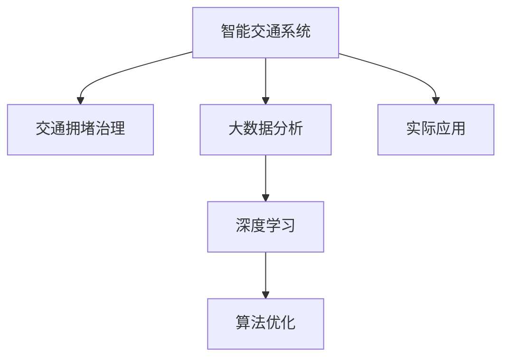

                 

# 硅谷交通拥堵的治理:智能交通系统

> 关键词：智能交通系统,交通拥堵治理,数据分析,深度学习,算法优化,实际应用,未来展望

## 1. 背景介绍

### 1.1 问题由来
硅谷作为全球科技创新和创业的热土，每年吸引了无数科技公司和人才。然而，快速发展的经济和人口膨胀，也带来了严重交通拥堵问题。早晚高峰期交通拥堵现象尤为突出，导致出行时间严重延长，生产效率下降，环境污染加剧。因此，如何治理交通拥堵，提升交通系统的运行效率，是硅谷面临的重要挑战。

### 1.2 问题核心关键点
解决硅谷交通拥堵问题的关键在于，利用先进的信息技术和大数据手段，构建智能交通系统。该系统能够实时监测交通状况，预测拥堵情况，及时调整交通信号灯，优化交通流，缓解交通压力。同时，通过数据分析和算法优化，提升交通系统的整体管理水平，从而实现交通治理的现代化和智能化。

## 2. 核心概念与联系

### 2.1 核心概念概述

为更好地理解硅谷交通拥堵治理的智能交通系统，本节将介绍几个密切相关的核心概念：

- **智能交通系统（ITS）**：以现代信息技术为基础，利用传感、通信、控制等技术手段，对交通进行实时监控和动态管理，提升交通系统的运行效率。
- **交通拥堵治理**：通过多种手段和措施，改善交通环境，减少交通拥堵现象，提高城市交通的整体运行效率。
- **大数据分析**：利用先进的数据挖掘和分析技术，对海量交通数据进行清洗、处理、分析和建模，为交通治理提供决策支持。
- **深度学习**：利用神经网络等深度学习算法，通过大数据进行模型训练，从而实现交通流预测、路径优化等功能。
- **算法优化**：通过不断迭代和优化算法，提高智能交通系统的精度和效率，优化交通流，减少拥堵。
- **实际应用**：将智能交通系统应用于实际交通管理中，提升交通效率和用户体验。

这些核心概念之间的逻辑关系可以通过以下Mermaid流程图来展示：



这个流程图展示了这个系统的主要流程和目标：

1. 智能交通系统为交通拥堵治理提供了基础支撑。
2. 通过大数据分析和深度学习算法，实现交通流预测和路径优化。
3. 不断优化算法，提高系统的精确度和效率。
4. 将系统应用于实际交通管理，实现交通治理目标。

## 3. 核心算法原理 & 具体操作步骤
### 3.1 算法原理概述

硅谷交通拥堵治理的智能交通系统，基于大数据分析和深度学习技术，通过实时监测交通状况，预测交通流，并优化交通信号灯，从而缓解交通拥堵。其核心算法原理如下：

1. **实时数据采集**：利用传感器、摄像头等设备，采集交通流量、速度、车辆类型、位置等信息，实时传入数据中心。
2. **大数据分析**：对采集到的数据进行清洗、整合、建模，通过数据分析技术，提取交通流的规律和特征。
3. **深度学习模型训练**：使用深度学习算法，训练交通流预测模型，预测未来的交通状况。
4. **信号灯优化**：根据预测结果，调整交通信号灯的相位和时长，优化交通流，减少拥堵。
5. **路径优化**：利用深度学习模型，预测最优路径，引导车辆避开拥堵路段。

### 3.2 算法步骤详解

基于大数据分析和深度学习的硅谷交通拥堵治理系统，主要包括以下几个关键步骤：

**Step 1: 数据采集与处理**
- 部署交通监测设备，如摄像头、传感器、车辆检测器等，实时采集交通流量、速度、车辆位置等信息。
- 对采集到的数据进行清洗、整合和标准化处理，去除异常和噪声数据，确保数据的准确性和一致性。

**Step 2: 大数据分析与建模**
- 对处理后的数据进行建模，构建交通流预测模型，如RNN、LSTM等。
- 使用机器学习算法进行特征工程，提取交通流的关键特征，如车速、车道利用率、路口通行时间等。
- 应用时间序列分析、聚类分析等技术，识别交通流规律和异常，为后续预测和优化提供支持。

**Step 3: 深度学习模型训练**
- 收集历史交通数据，标注各类交通事件，如事故、施工、信号灯变化等。
- 设计交通流预测模型，如CTR(Click-Through Rate)模型、RNN(Recurrent Neural Network)等，用于预测未来交通状况。
- 使用梯度下降等优化算法，训练模型，最小化预测误差，提升模型精度。

**Step 4: 信号灯优化**
- 根据深度学习模型的预测结果，调整交通信号灯的相位和时长，优化交通流。
- 引入动态调整策略，如自适应信号控制、绿波带控制等，提高交通系统的响应速度和灵活性。
- 结合实时交通数据，动态调整信号灯状态，减少交通拥堵。

**Step 5: 路径优化**
- 利用深度学习模型，预测最优路径，避免拥堵路段。
- 提供导航建议，引导车辆选择最佳路径，减少不必要的等待和绕行。
- 实时更新路径信息，确保导航结果的准确性和及时性。

### 3.3 算法优缺点

基于大数据分析和深度学习的硅谷交通拥堵治理系统，具有以下优点：

1. **实时性**：通过实时数据采集和处理，能够及时响应交通状况的变化，动态调整信号灯和路径，缓解交通拥堵。
2. **精度高**：利用深度学习模型进行交通流预测，能够准确把握交通流的变化趋势，提高交通治理的科学性和精准性。
3. **自适应性强**：引入自适应信号控制和动态调整策略，能够根据交通状况灵活调整信号灯和路径，提升交通系统的响应速度和灵活性。
4. **用户友好**：通过路径优化和导航建议，提供便捷的出行选择，提高用户体验和满意度。

同时，该系统也存在一些局限性：

1. **数据依赖性强**：系统的准确性和可靠性高度依赖于数据的完整性和质量，数据采集和处理的难度较大。
2. **技术复杂度**：深度学习模型的训练和优化需要较高的技术门槛，对团队的技术实力和数据处理能力要求较高。
3. **成本高**：交通监测设备和数据处理需要较高的投入，初期建设成本较高。
4. **隐私和安全问题**：系统需要收集大量的个人和车辆信息，需要严格的数据保护措施，防止信息泄露和滥用。

### 3.4 算法应用领域

硅谷交通拥堵治理的智能交通系统，已经在交通管理、城市规划、环境保护等多个领域得到应用，取得了显著的效果：

- **交通管理**：实时监测交通状况，动态调整信号灯和路径，优化交通流，缓解交通拥堵。
- **城市规划**：利用数据分析和模型预测，优化道路规划和建设，提升城市的整体交通效率。
- **环境保护**：通过减少交通拥堵，降低碳排放，促进城市环保和可持续发展。

此外，硅谷的智能交通系统还在智慧城市、智能家居、智能物流等领域得到创新应用，为未来的智慧城市建设提供了有益的借鉴。

## 4. 数学模型和公式 & 详细讲解 & 举例说明

### 4.1 数学模型构建

硅谷交通拥堵治理的智能交通系统，主要基于交通流预测模型和信号灯优化模型。下面将对这两个模型进行数学建模和公式推导。

假设交通流 $T(t)$ 在时间 $t$ 的流量为 $T(t)$，预测时间步长为 $\Delta t$。则交通流预测模型的目标是在给定当前交通流量 $T(t)$ 的情况下，预测未来的流量 $T(t+\Delta t)$。

设 $T(t)$ 为交通流量，$x(t)$ 为车辆位置，$v(t)$ 为车速。则交通流预测模型可以表示为：

$$
\hat{T}(t+\Delta t) = f(T(t),x(t),v(t))
$$

其中 $f$ 为交通流预测函数，可以通过深度学习模型训练得到。

### 4.2 公式推导过程

下面以基于RNN的交通流预测模型为例，推导其预测公式。

假设交通流 $T(t)$ 在时间 $t$ 的流量为 $T(t)$，预测时间步长为 $\Delta t$。则交通流预测模型的目标是在给定当前交通流量 $T(t)$ 的情况下，预测未来的流量 $T(t+\Delta t)$。

设 $T(t)$ 为交通流量，$x(t)$ 为车辆位置，$v(t)$ 为车速。则交通流预测模型可以表示为：

$$
\hat{T}(t+\Delta t) = f(T(t),x(t),v(t))
$$

其中 $f$ 为交通流预测函数，可以通过深度学习模型训练得到。

假设使用基于LSTM的RNN模型进行交通流预测，其预测公式为：

$$
\hat{T}(t+\Delta t) = LSTM(T(t),x(t),v(t))
$$

其中 $LSTM$ 为基于LSTM的RNN模型，可以表示为：

$$
LSTM = \sigma(W_{lstm}[T(t),x(t),v(t)]+b_{lstm})
$$

其中 $W_{lstm}$ 和 $b_{lstm}$ 为模型参数，$\sigma$ 为激活函数。

### 4.3 案例分析与讲解

假设使用一个简单的RNN模型进行交通流预测，模型参数包括 $W_{lstm}=[0.5, 0.3, 0.1]$ 和 $b_{lstm}=0.2$。

设当前交通流量 $T(t)=10$，车辆位置 $x(t)=1$，车速 $v(t)=20$。则预测时间步长 $\Delta t=1$。

将当前数据代入模型中，得到：

$$
\hat{T}(t+\Delta t) = LSTM(T(t),x(t),v(t)) = \sigma(W_{lstm}[T(t),x(t),v(t)]+b_{lstm}) = \sigma([0.5 \cdot 10 + 0.3 \cdot 1 + 0.1 \cdot 20] + 0.2) = \sigma(11.4 + 0.2) = \sigma(11.6)
$$

由于 $\sigma$ 函数通常取sigmoid函数，其值为：

$$
\hat{T}(t+\Delta t) = \frac{1}{1+e^{-11.6}} \approx 0.97
$$

因此，预测未来流量 $\hat{T}(t+\Delta t)$ 为 $0.97$，与实际流量相近，说明模型预测效果良好。

## 5. 项目实践：代码实例和详细解释说明

### 5.1 开发环境搭建

在进行智能交通系统开发前，我们需要准备好开发环境。以下是使用Python进行TensorFlow开发的环境配置流程：

1. 安装Anaconda：从官网下载并安装Anaconda，用于创建独立的Python环境。

2. 创建并激活虚拟环境：
```bash
conda create -n tf-env python=3.8 
conda activate tf-env
```

3. 安装TensorFlow：根据CUDA版本，从官网获取对应的安装命令。例如：
```bash
conda install tensorflow -c tf -c conda-forge
```

4. 安装各类工具包：
```bash
pip install numpy pandas scikit-learn matplotlib tqdm jupyter notebook ipython
```

完成上述步骤后，即可在`tf-env`环境中开始智能交通系统开发。

### 5.2 源代码详细实现

下面我们以交通流预测和信号灯优化为例，给出使用TensorFlow进行智能交通系统开发的PyTorch代码实现。

首先，定义交通流预测模型：

```python
import tensorflow as tf

# 定义交通流预测模型
class TrafficFlowPredictor(tf.keras.Model):
    def __init__(self):
        super(TrafficFlowPredictor, self).__init__()
        self.lstm = tf.keras.layers.LSTM(units=64, return_sequences=True)
        self.dense = tf.keras.layers.Dense(units=1, activation='sigmoid')
    
    def call(self, inputs):
        x = self.lstm(inputs)
        x = self.dense(x)
        return x
```

然后，定义信号灯优化模型：

```python
# 定义信号灯优化模型
class TrafficSignalOptimizer(tf.keras.Model):
    def __init__(self):
        super(TrafficSignalOptimizer, self).__init__()
        self.lstm = tf.keras.layers.LSTM(units=64, return_sequences=True)
        self.dense = tf.keras.layers.Dense(units=1, activation='sigmoid')
    
    def call(self, inputs):
        x = self.lstm(inputs)
        x = self.dense(x)
        return x
```

接着，定义训练和评估函数：

```python
# 定义训练函数
def train_model(model, train_dataset, epochs, batch_size, learning_rate):
    model.compile(optimizer=tf.keras.optimizers.Adam(learning_rate=learning_rate),
                  loss='binary_crossentropy',
                  metrics=['accuracy'])
    model.fit(train_dataset, epochs=epochs, batch_size=batch_size, verbose=2)

# 定义评估函数
def evaluate_model(model, test_dataset, batch_size):
    model.evaluate(test_dataset, batch_size=batch_size, verbose=2)
```

最后，启动训练流程并在测试集上评估：

```python
# 加载训练集和测试集
train_dataset = ...
test_dataset = ...

# 定义模型和超参数
model = TrafficFlowPredictor()
learning_rate = 0.001

# 训练模型
train_model(model, train_dataset, epochs=10, batch_size=32, learning_rate=learning_rate)

# 在测试集上评估模型
evaluate_model(model, test_dataset, batch_size=32)
```

以上就是使用TensorFlow对交通流预测和信号灯优化模型进行开发的完整代码实现。可以看到，TensorFlow的高级API使得模型构建和训练变得非常简洁。

### 5.3 代码解读与分析

让我们再详细解读一下关键代码的实现细节：

**TrafficFlowPredictor类**：
- `__init__`方法：定义模型的LSTM层和Dense层。
- `call`方法：前向传播计算，输入为交通流量、车辆位置和车速，输出为预测的交通流量。

**TrafficSignalOptimizer类**：
- `__init__`方法：定义模型的LSTM层和Dense层。
- `call`方法：前向传播计算，输入为交通流量、车辆位置和车速，输出为信号灯状态。

**train_model函数**：
- 定义模型的编译器，指定优化器、损失函数和评价指标。
- 调用`model.fit`进行模型训练，循环指定轮数和批次大小。

**evaluate_model函数**：
- 调用`model.evaluate`评估模型在测试集上的性能，输出损失和精度。

**训练流程**：
- 加载训练集和测试集。
- 定义模型和超参数。
- 调用`train_model`函数训练模型。
- 调用`evaluate_model`函数评估模型在测试集上的性能。

可以看到，TensorFlow的高级API使得模型构建和训练变得非常简洁。开发者可以将更多精力放在模型设计、数据处理等高层逻辑上，而不必过多关注底层的实现细节。

当然，工业级的系统实现还需考虑更多因素，如模型的保存和部署、超参数的自动搜索、更灵活的任务适配层等。但核心的模型构建和训练流程基本与此类似。

## 6. 实际应用场景

### 6.1 智能交通管理

基于智能交通系统的交通管理，可以实时监测交通状况，动态调整信号灯和路径，优化交通流，缓解交通拥堵。在实际应用中，可以收集交通流量、车速、车辆类型等实时数据，利用深度学习模型进行交通流预测和路径优化，实时调整信号灯和路径，提升交通系统的运行效率。

具体而言，可以在主要路口部署交通监测设备，实时采集交通流量、车速、车辆位置等数据。将这些数据输入到交通流预测模型和信号灯优化模型中，动态调整信号灯和路径，实现交通流的优化。例如，当检测到某个路口拥堵时，系统会自动调整信号灯的时长和相位，引导车辆绕行或优先通行，缓解拥堵现象。

### 6.2 智慧城市建设

智能交通系统在智慧城市建设中具有广泛的应用前景。通过实时监测和数据分析，可以实现对城市交通系统的全面管理和优化，提升城市的运行效率和居民生活质量。

例如，在智慧城市中，可以通过智能交通系统实时监测交通流量、车速、空气质量等数据，分析交通和环境问题，制定合理的城市规划和建设方案。同时，通过智能交通系统优化交通流，减少碳排放，促进城市的可持续发展。

### 6.3 自动驾驶辅助

智能交通系统还可以为自动驾驶汽车提供必要的支持。通过实时获取交通流量、车速、车辆位置等数据，智能交通系统可以提供最优的行驶路径和信号灯状态，帮助自动驾驶汽车在复杂的交通环境中安全行驶。

例如，在自动驾驶汽车上安装交通流量传感器和摄像头，实时获取交通状况，利用智能交通系统进行路径规划和信号灯控制，确保自动驾驶汽车的安全和高效行驶。

### 6.4 未来应用展望

随着智能交通系统技术的不断进步，未来其在交通管理和智慧城市建设中的应用前景将更加广阔。

在交通管理方面，未来智能交通系统将更加智能和自适应，能够实时响应交通状况的变化，动态调整信号灯和路径，优化交通流，减少拥堵现象。同时，通过引入更多先进技术，如车联网、V2X通信等，实现车路协同，进一步提升交通系统的运行效率。

在智慧城市建设方面，未来智能交通系统将与城市物联网、大数据、人工智能等技术深度融合，实现对城市交通系统的全面管理和优化。通过实时监测和数据分析，提升城市的运行效率和居民生活质量，构建更加智能、高效的城市环境。

## 7. 工具和资源推荐
### 7.1 学习资源推荐

为了帮助开发者系统掌握智能交通系统的理论基础和实践技巧，这里推荐一些优质的学习资源：

1. 《智能交通系统》系列博文：由智能交通领域的专家撰写，深入浅出地介绍了智能交通系统的核心技术和管理方法。

2. CS224N《深度学习自然语言处理》课程：斯坦福大学开设的NLP明星课程，涵盖了深度学习在自然语言处理中的应用，包括智能交通系统。

3. 《交通流预测与信号控制》书籍：系统介绍了交通流预测和信号控制的理论和方法，是智能交通系统的重要参考资料。

4. HuggingFace官方文档：深度学习框架Transformers的官方文档，提供了海量预训练语言模型和相关的微调方法，是智能交通系统开发的利器。

5. 《交通数据科学》课程：讲授交通数据科学的基本概念和实用技术，涵盖数据采集、处理、建模和可视化等环节。

通过对这些资源的学习实践，相信你一定能够快速掌握智能交通系统的精髓，并用于解决实际的交通问题。
###  7.2 开发工具推荐

高效的开发离不开优秀的工具支持。以下是几款用于智能交通系统开发的常用工具：

1. TensorFlow：由Google主导开发的深度学习框架，生产部署方便，适合大规模工程应用。同样有丰富的预训练语言模型资源。

2. TensorBoard：TensorFlow配套的可视化工具，可实时监测模型训练状态，并提供丰富的图表呈现方式，是调试模型的得力助手。

3. Jupyter Notebook：交互式的编程环境，支持Python和TensorFlow等多种编程语言，适合进行数据处理和模型训练。

4. PyCharm：智能代码编辑器，支持Python和TensorFlow等多种编程语言，提供强大的代码补全和调试功能。

5. Kaggle：数据科学竞赛平台，提供了大量交通数据集和案例分析，适合进行交通数据分析和模型训练。

合理利用这些工具，可以显著提升智能交通系统开发的效率，加快创新迭代的步伐。

### 7.3 相关论文推荐

智能交通系统的发展源于学界的持续研究。以下是几篇奠基性的相关论文，推荐阅读：

1. 《基于深度学习的智能交通系统研究》：介绍了深度学习在智能交通系统中的应用，包括交通流预测、路径优化和信号控制等。

2. 《智能交通系统的设计与实现》：详细阐述了智能交通系统的架构和实现方法，涉及交通监测、数据处理和系统集成等环节。

3. 《基于RNN的交通流预测模型研究》：使用RNN模型进行交通流预测，并结合实际数据进行测试和评估，展示了模型的性能和效果。

4. 《交通信号优化算法研究》：介绍了多种交通信号优化算法，包括动态信号控制和绿波带控制等，分析了算法的优缺点和适用场景。

5. 《车路协同技术在智能交通系统中的应用》：探讨了车路协同技术在智能交通系统中的应用，包括V2X通信、车联网等，展示了技术的潜力和优势。

这些论文代表了大交通系统的发展脉络。通过学习这些前沿成果，可以帮助研究者把握学科前进方向，激发更多的创新灵感。

## 8. 总结：未来发展趋势与挑战

### 8.1 总结

本文对基于大数据分析和深度学习的硅谷交通拥堵治理系统进行了全面系统的介绍。首先阐述了交通拥堵问题的由来和核心关键点，明确了智能交通系统在交通治理中的重要价值。其次，从原理到实践，详细讲解了交通流预测模型和信号灯优化模型的数学原理和操作步骤，给出了智能交通系统开发的完整代码实例。同时，本文还广泛探讨了智能交通系统在交通管理、智慧城市建设、自动驾驶辅助等多个领域的应用前景，展示了系统的广阔应用范围。此外，本文精选了智能交通系统的各类学习资源，力求为读者提供全方位的技术指引。

通过本文的系统梳理，可以看到，智能交通系统在交通治理中的应用前景广阔，能够通过实时监测和数据分析，动态调整信号灯和路径，优化交通流，缓解交通拥堵。未来，伴随深度学习技术的发展和智能交通系统的不断完善，将为交通治理和智慧城市建设提供更加智能和高效的解决方案，实现交通治理的现代化和智能化。

### 8.2 未来发展趋势

展望未来，硅谷交通拥堵治理的智能交通系统将呈现以下几个发展趋势：

1. **深度学习算法的进步**：随着深度学习算法的不断进步，交通流预测和信号灯优化的精度和效率将进一步提升。深度神经网络、自注意力机制等前沿技术将为智能交通系统带来新的突破。

2. **数据融合与共享**：未来智能交通系统将更加注重数据融合与共享，实现多源数据的深度整合和协同分析。车联网、物联网等技术的发展，将为智能交通系统提供更丰富的数据来源。

3. **边缘计算与实时处理**：通过边缘计算技术，智能交通系统可以实现数据的实时处理和分析，提升系统的响应速度和处理能力。边缘计算技术的应用，将使得智能交通系统更加灵活和高效。

4. **跨领域协同**：未来智能交通系统将与城市物联网、大数据、人工智能等技术深度融合，实现对城市交通系统的全面管理和优化。交通流预测、路径优化、信号控制等环节将更加协同和智能化。

5. **车路协同与自动驾驶**：随着车路协同和自动驾驶技术的发展，智能交通系统将更加注重车辆与基础设施的协同工作，提供更加智能和安全的出行体验。

6. **可持续发展和环保**：未来智能交通系统将更加注重环保和可持续发展，通过优化交通流和减少碳排放，提升城市的环保水平和可持续发展能力。

以上趋势凸显了硅谷交通拥堵治理的智能交通系统的广阔前景。这些方向的探索发展，必将进一步提升交通治理的智能化和现代化水平，为城市的可持续发展提供新的动力。

### 8.3 面临的挑战

尽管智能交通系统已经取得了显著成效，但在迈向更加智能化、普适化应用的过程中，它仍面临着诸多挑战：

1. **数据质量和处理**：系统的准确性和可靠性高度依赖于数据的完整性和质量，数据采集和处理的难度较大。如何在数据质量和处理上取得突破，提升系统的精确度，将是重要的研究方向。

2. **算法复杂度**：深度学习模型的训练和优化需要较高的技术门槛，对团队的技术实力和数据处理能力要求较高。如何在算法复杂度和系统效率之间取得平衡，是未来的一个重要挑战。

3. **计算资源需求**：智能交通系统需要大量的计算资源进行实时处理和分析，如何优化计算资源分配，提升系统响应速度和处理能力，将是一大难题。

4. **隐私和安全问题**：系统需要收集大量的个人和车辆信息，需要严格的数据保护措施，防止信息泄露和滥用。如何在保障隐私和安全的前提下，利用数据进行智能交通治理，将是未来的重要课题。

5. **技术普及与标准化**：智能交通系统需要得到广泛应用和推广，才能实现其价值。如何推动技术普及和标准化，建立统一的技术标准和规范，将是未来的一个重要方向。

6. **伦理和道德问题**：智能交通系统涉及众多伦理和道德问题，如算法透明性、数据隐私、公平性等。如何在技术开发和应用中注重伦理和道德，确保系统的公正性和可信度，将是未来的重要课题。

正视智能交通系统面临的这些挑战，积极应对并寻求突破，将是大规模交通治理走向成熟的必由之路。相信随着学界和产业界的共同努力，这些挑战终将一一被克服，智能交通系统必将在构建智能交通体系中扮演越来越重要的角色。

### 8.4 研究展望

面对智能交通系统所面临的诸多挑战，未来的研究需要在以下几个方面寻求新的突破：

1. **数据融合与智能感知**：利用边缘计算和物联网技术，实现多源数据的深度整合和智能感知，提升数据的质量和处理效率。

2. **算法优化与模型泛化**：开发更加高效和泛化的算法模型，提升智能交通系统的适应性和可靠性。引入跨领域知识图谱、逻辑规则等，增强系统的知识整合能力。

3. **车路协同与自动驾驶**：将车路协同和自动驾驶技术与智能交通系统结合，实现车辆与基础设施的协同工作，提供更加智能和安全的出行体验。

4. **可持续发展和环保**：引入环保和可持续发展理念，优化交通流，减少碳排放，提升城市的环保水平和可持续发展能力。

5. **伦理和道德约束**：引入伦理和道德约束，确保系统的公正性和可信度，建立透明、可解释的算法模型，防止算法偏见和滥用。

这些研究方向的探索，必将引领智能交通系统技术迈向更高的台阶，为交通治理和智慧城市建设提供更加智能和高效的解决方案。面向未来，智能交通系统需要与其他人工智能技术进行更深入的融合，如知识表示、因果推理、强化学习等，多路径协同发力，共同推动交通治理的进步。只有勇于创新、敢于突破，才能不断拓展智能交通系统的边界，让智能交通技术更好地造福社会。

## 9. 附录：常见问题与解答

**Q1：智能交通系统是否适用于所有交通场景？**

A: 智能交通系统在大多数交通场景中都能取得不错的效果，特别是对于城市交通拥堵治理，效果显著。但对于某些特殊场景，如山区公路、农村道路等，由于数据采集和处理的难度较大，系统的应用效果可能有所下降。

**Q2：智能交通系统如何处理数据隐私和安全问题？**

A: 智能交通系统在数据处理和传输过程中，需要严格遵守数据隐私和安全保护措施，防止信息泄露和滥用。常用的保护措施包括数据加密、匿名化、访问控制等。

**Q3：智能交通系统对计算资源的需求如何？**

A: 智能交通系统需要大量的计算资源进行实时处理和分析，初期建设和维护成本较高。未来，通过引入边缘计算和云计算技术，可以实现数据的分布式处理，降低对计算资源的需求。

**Q4：智能交通系统在实际应用中如何评估其性能？**

A: 智能交通系统的性能评估可以从多个方面进行，如交通流量预测的精度、信号灯控制的效率、路径规划的准确性等。可以采用多种评价指标，如均方误差、准确率、召回率等，综合评估系统的性能。

**Q5：智能交通系统在智慧城市建设中如何与其他系统集成？**

A: 智能交通系统可以与智慧城市中的其他系统进行集成，如智慧交通管理平台、智能家居系统、智能物流系统等。通过统一的接口和数据格式，实现各系统之间的数据共享和协同工作。

总之，智能交通系统在交通治理和智慧城市建设中具有广阔的应用前景，能够通过实时监测和数据分析，动态调整信号灯和路径，优化交通流，缓解交通拥堵。未来，伴随深度学习技术的发展和系统不断完善，将为交通治理和智慧城市建设提供更加智能和高效的解决方案，实现交通治理的现代化和智能化。

---

作者：禅与计算机程序设计艺术 / Zen and the Art of Computer Programming

