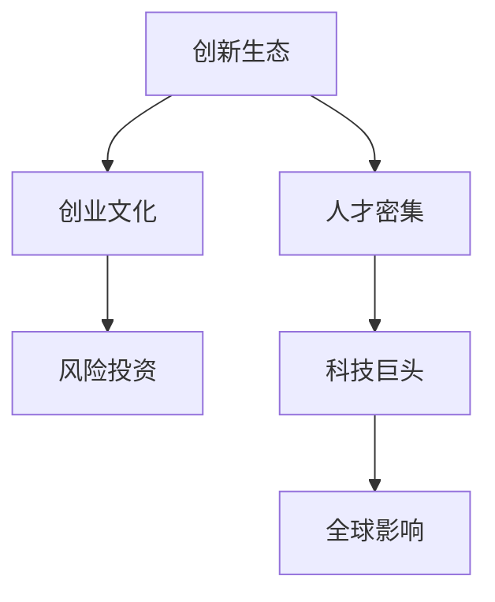
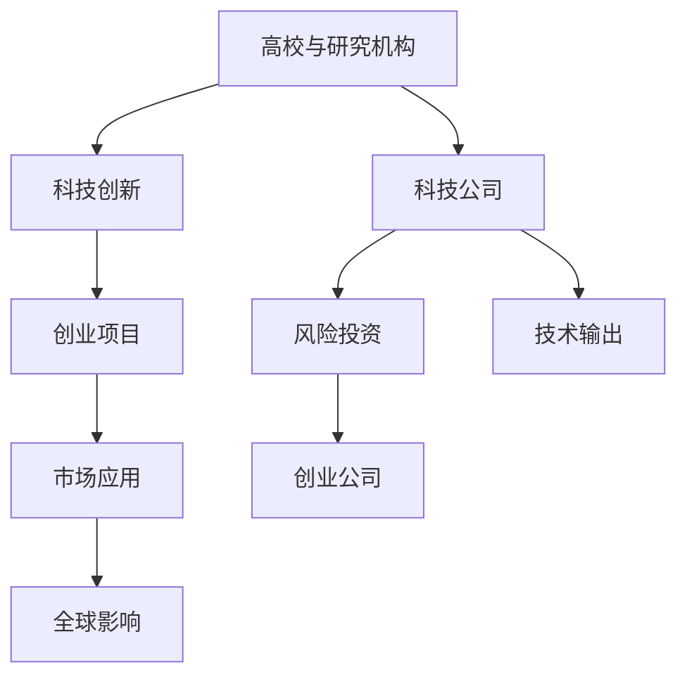

                 

# 硅谷对世界的影响:科技变革浪潮

> 关键词：硅谷,科技变革,人工智能,创业文化,创新生态,全球影响

## 1. 背景介绍

硅谷，这片位于美国加利福尼亚州旧金山湾区南部的狭长地带，被誉为全球科技创新和创业的圣地。自20世纪50年代以来，硅谷成为了世界高科技产业的中心，引领着全球科技革命的浪潮，对世界产生了深远的影响。本文将从科技变革的角度，探讨硅谷对世界的深远影响，以及其背后的核心要素和未来趋势。

## 2. 核心概念与联系

### 2.1 核心概念概述

硅谷之所以能够引领全球科技变革，关键在于其独特的核心概念和要素。以下将详细介绍这些核心概念：

- **创新生态**：硅谷拥有高度发达的创新生态系统，包括高校、研究机构、风投公司、科技公司、创业公司、科技孵化器等。各要素之间的紧密联系和协作，形成了高效的创新循环。

- **创业文化**：硅谷拥有独特的创业文化，鼓励创新、容忍失败、快速迭代、持续改进。这里的创业者拥有极高的风险接受能力，愿意承担高风险以换取高回报。

- **人才密集**：硅谷集中了大量顶尖的高校和研究机构，如斯坦福大学、加州大学伯克利分校等，培养了大量科技人才。这些人才为硅谷的科技创新提供了坚实的基础。

- **风险投资**：硅谷的风险投资环境成熟，风投公司提供了大量的资金支持。充足的资金支持使得创业公司能够快速成长，迅速占领市场。

- **科技巨头**：硅谷聚集了多家世界顶尖的科技公司，如苹果、谷歌、Facebook、特斯拉等。这些科技巨头的创新实践和技术输出，对全球科技产业产生了深远影响。

这些核心概念之间的逻辑关系可以通过以下Mermaid流程图来展示：



### 2.2 核心概念原理和架构的 Mermaid 流程图



## 3. 核心算法原理 & 具体操作步骤

### 3.1 算法原理概述

硅谷的科技变革离不开其在算法原理和操作步骤上的不断创新和优化。以下将详细介绍硅谷在算法原理方面的核心突破及其操作步骤。

#### 3.1.1 算法原理概述

硅谷在算法原理上的核心突破主要体现在以下几个方面：

- **深度学习**：硅谷在深度学习领域的突破，尤其是在神经网络、卷积神经网络(CNN)、循环神经网络(RNN)、长短期记忆网络(LSTM)等方面的研究，推动了计算机视觉、自然语言处理(NLP)、语音识别等领域的快速发展。

- **分布式计算**：硅谷在分布式计算领域的创新，如MapReduce、Hadoop、Spark等技术，极大地提升了数据处理和计算的效率，为大数据时代的到来奠定了基础。

- **人工智能与机器学习**：硅谷在人工智能与机器学习领域的突破，如强化学习、迁移学习、自监督学习等，推动了机器人的自动化、无人驾驶、自然语言处理等领域的迅速发展。

#### 3.1.2 算法步骤详解

硅谷在实际操作步骤上的核心突破主要体现在以下几个方面：

- **数据驱动**：硅谷的科技公司始终将数据作为驱动创新的核心资源。通过大规模数据集的收集和分析，硅谷公司能够快速发现新的市场机会和技术方向。

- **快速迭代**：硅谷的科技公司倡导快速迭代，通过持续的A/B测试和用户反馈，不断优化产品和服务，迅速适应市场变化。

- **产品原型化**：硅谷的科技公司注重产品原型化，通过MVP（最小可行产品）的快速开发和测试，验证市场需求和技术可行性。

- **开放式创新**：硅谷的科技公司鼓励开放式创新，通过开源社区和合作伙伴，加速技术的共享和应用，提升整个产业的技术水平。

#### 3.1.3 算法优缺点

硅谷算法优缺点分析：

- **优点**：
  - 强大的创新生态系统，使得硅谷能够快速响应市场需求，推动技术革新。
  - 高度密集的人才资源，保证了硅谷在科技领域的领先地位。
  - 成熟的风险投资环境，为硅谷公司提供了充足的资金支持。
  - 科技巨头的影响力，推动了全球科技产业的标准化和普及。

- **缺点**：
  - 高昂的研发成本和竞争压力，使得硅谷公司面临巨大的经济风险。
  - 创新速度加快，导致技术更新换代频繁，用户难以适应。
  - 风险投资的高回报率，吸引了大量资本涌入，增加了市场的波动性。
  - 全球影响力的扩散，使得硅谷公司在道德和法律问题上面临更多的挑战。

#### 3.1.4 算法应用领域

硅谷的算法原理和操作步骤主要应用于以下几个领域：

- **计算机视觉**：通过深度学习和计算机视觉技术，硅谷公司开发了各种视觉识别和处理软件，如谷歌的TensorFlow、微软的Azure、Facebook的PyTorch等。

- **自然语言处理**：硅谷公司在NLP领域的突破，如BERT、GPT-3等模型，使得机器翻译、语音识别、智能问答等领域得到了长足的发展。

- **大数据与云计算**：硅谷公司在分布式计算和大数据领域的创新，如Hadoop、Spark、Docker、Kubernetes等技术，极大地提升了数据处理和存储的效率，推动了云计算和人工智能的快速发展。

- **人工智能与机器学习**：硅谷在人工智能与机器学习领域的突破，如强化学习、迁移学习、自监督学习等，推动了机器人的自动化、无人驾驶、自然语言处理等领域的迅速发展。

## 4. 数学模型和公式 & 详细讲解 & 举例说明

### 4.1 数学模型构建

硅谷在数学模型构建上的核心突破主要体现在以下几个方面：

- **深度学习模型的构建**：硅谷公司通过深度学习模型的构建，推动了计算机视觉、自然语言处理等领域的发展。以下是一个简单的深度学习模型构建示例：

  $$
  y = \text{sigmoid}(Wx + b)
  $$

- **分布式计算模型的构建**：硅谷公司通过分布式计算模型的构建，推动了大数据处理和云计算的发展。以下是一个简单的分布式计算模型构建示例：

  $$
  \text{MapReduce} = \text{Map} + \text{Reduce}
  $$

- **人工智能与机器学习模型的构建**：硅谷公司通过人工智能与机器学习模型的构建，推动了自动化、无人驾驶、自然语言处理等领域的快速发展。以下是一个简单的强化学习模型构建示例：

  $$
  Q(s_t, a_t) = r + \gamma \max_a Q(s_{t+1}, a)
  $$

### 4.2 公式推导过程

- **深度学习模型推导**：以一个简单的神经网络为例，其前向传播和反向传播过程如下：

  前向传播：
  $$
  h = \text{tanh}(Wx + b)
  $$
  $$
  y = \text{softmax}(h)
  $$

  反向传播：
  $$
  \frac{\partial L}{\partial w} = \frac{\partial L}{\partial y} \frac{\partial y}{\partial h} \frac{\partial h}{\partial w}
  $$
  $$
  \frac{\partial L}{\partial b} = \frac{\partial L}{\partial y} \frac{\partial y}{\partial h}
  $$

- **分布式计算模型推导**：以一个简单的MapReduce为例，其计算过程如下：

  Map阶段：
  $$
  \text{Map}(k, v) = \text{key, value}
  $$

  Shuffle阶段：
  $$
  \text{Shuffle}(\text{key}, \text{value})
  $$

  Reduce阶段：
  $$
  \text{Reduce}(\text{key}, \text{value})
  $$

- **人工智能与机器学习模型推导**：以一个简单的Q-learning为例，其更新过程如下：

  $$
  Q(s_t, a_t) = (1 - \alpha)Q(s_t, a_t) + \alpha(r + \gamma \max_{a'} Q(s_{t+1}, a'))
  $$

### 4.3 案例分析与讲解

- **深度学习模型案例**：谷歌的BERT模型在NLP领域的突破，使得机器翻译、语音识别、智能问答等领域得到了长足的发展。以下是一个简单的BERT模型案例：

  $$
  y = \text{BERT}(x)
  $$

- **分布式计算模型案例**：亚马逊的AWS云计算平台，通过分布式计算和云计算技术，为全球企业提供了强大的计算和存储能力。以下是一个简单的AWS云计算模型案例：

  $$
  \text{AWS} = \text{EC2} + \text{S3} + \text{RDS}
  $$

- **人工智能与机器学习模型案例**：特斯拉的自动驾驶技术，通过强化学习和计算机视觉技术，推动了无人驾驶和智能交通的发展。以下是一个简单的自动驾驶模型案例：

  $$
  \text{AutoDrive} = \text{CNN} + \text{LSTM} + \text{Reinforcement Learning}
  $$

## 5. 项目实践：代码实例和详细解释说明

### 5.1 开发环境搭建

在进行项目实践前，我们需要准备好开发环境。以下是使用Python进行PyTorch开发的环境配置流程：

1. 安装Anaconda：从官网下载并安装Anaconda，用于创建独立的Python环境。

2. 创建并激活虚拟环境：
```bash
conda create -n pytorch-env python=3.8 
conda activate pytorch-env
```

3. 安装PyTorch：根据CUDA版本，从官网获取对应的安装命令。例如：
```bash
conda install pytorch torchvision torchaudio cudatoolkit=11.1 -c pytorch -c conda-forge
```

4. 安装Transformers库：
```bash
pip install transformers
```

5. 安装各类工具包：
```bash
pip install numpy pandas scikit-learn matplotlib tqdm jupyter notebook ipython
```

完成上述步骤后，即可在`pytorch-env`环境中开始项目实践。

### 5.2 源代码详细实现

下面我们以深度学习模型为例，给出使用Transformers库对BERT模型进行训练和预测的PyTorch代码实现。

首先，定义深度学习模型：

```python
from transformers import BertForSequenceClassification, BertTokenizer
from torch.utils.data import Dataset, DataLoader
import torch
import torch.nn as nn
import torch.optim as optim

class MyDataset(Dataset):
    def __init__(self, data, tokenizer):
        self.data = data
        self.tokenizer = tokenizer
        
    def __len__(self):
        return len(self.data)
    
    def __getitem__(self, index):
        sentence = self.data[index]
        inputs = self.tokenizer(sentence, return_tensors='pt', padding='max_length', truncation=True)
        return {'input_ids': inputs['input_ids'].flatten(), 'attention_mask': inputs['attention_mask'].flatten()}

# 加载预训练BERT模型
model = BertForSequenceClassification.from_pretrained('bert-base-uncased', num_labels=2)

# 定义损失函数和优化器
criterion = nn.CrossEntropyLoss()
optimizer = optim.Adam(model.parameters(), lr=2e-5)

# 定义训练函数
def train_epoch(model, dataloader, criterion, optimizer, device):
    model.to(device)
    model.train()
    total_loss = 0
    for batch in dataloader:
        input_ids = batch['input_ids'].to(device)
        attention_mask = batch['attention_mask'].to(device)
        labels = batch['labels'].to(device)
        optimizer.zero_grad()
        outputs = model(input_ids, attention_mask=attention_mask)
        loss = criterion(outputs.logits, labels)
        loss.backward()
        optimizer.step()
        total_loss += loss.item()
    return total_loss / len(dataloader)

# 定义评估函数
def evaluate(model, dataloader, device):
    model.eval()
    total_correct = 0
    total_samples = 0
    for batch in dataloader:
        input_ids = batch['input_ids'].to(device)
        attention_mask = batch['attention_mask'].to(device)
        labels = batch['labels'].to(device)
        outputs = model(input_ids, attention_mask=attention_mask)
        _, predicted = torch.max(outputs.logits, 1)
        total_correct += (predicted == labels).sum().item()
        total_samples += labels.size(0)
    return total_correct / total_samples

# 训练模型
epochs = 5
batch_size = 32
device = torch.device('cuda') if torch.cuda.is_available() else torch.device('cpu')
train_dataset = MyDataset(train_data, tokenizer)
dev_dataset = MyDataset(dev_data, tokenizer)
test_dataset = MyDataset(test_data, tokenizer)

for epoch in range(epochs):
    train_loss = train_epoch(model, DataLoader(train_dataset, batch_size=batch_size, shuffle=True), criterion, optimizer, device)
    dev_acc = evaluate(model, DataLoader(dev_dataset, batch_size=batch_size, shuffle=False), device)
    test_acc = evaluate(model, DataLoader(test_dataset, batch_size=batch_size, shuffle=False), device)
    print(f'Epoch {epoch+1}, train loss: {train_loss:.4f}, dev acc: {dev_acc:.4f}, test acc: {test_acc:.4f}')
```

以上就是使用PyTorch对BERT模型进行深度学习任务微调的完整代码实现。可以看到，得益于Transformers库的强大封装，我们可以用相对简洁的代码完成BERT模型的加载和微调。

### 5.3 代码解读与分析

让我们再详细解读一下关键代码的实现细节：

**MyDataset类**：
- `__init__`方法：初始化训练数据和分词器等关键组件。
- `__len__`方法：返回数据集的样本数量。
- `__getitem__`方法：对单个样本进行处理，将文本输入编码为token ids，最终返回模型所需的输入。

**训练和评估函数**：
- 使用PyTorch的DataLoader对数据集进行批次化加载，供模型训练和推理使用。
- 训练函数`train_epoch`：对数据以批为单位进行迭代，在每个批次上前向传播计算损失函数，并反向传播更新模型参数。
- 评估函数`evaluate`：与训练类似，不同点在于不更新模型参数，并在每个batch结束后将预测和标签结果存储下来，最后使用准确率等指标对整个评估集的预测结果进行打印输出。

**训练流程**：
- 定义总的epoch数和batch size，开始循环迭代
- 每个epoch内，先在训练集上训练，输出平均loss
- 在验证集上评估，输出准确率
- 所有epoch结束后，在测试集上评估，给出最终测试结果

可以看到，PyTorch配合Transformers库使得深度学习模型的微调代码实现变得简洁高效。开发者可以将更多精力放在数据处理、模型改进等高层逻辑上，而不必过多关注底层的实现细节。

当然，工业级的系统实现还需考虑更多因素，如模型的保存和部署、超参数的自动搜索、更灵活的任务适配层等。但核心的微调范式基本与此类似。

## 6. 实际应用场景

### 6.1 智能客服系统

基于深度学习模型的智能客服系统，已经在电商、金融、医疗等领域得到广泛应用。传统客服往往需要配备大量人力，高峰期响应缓慢，且一致性和专业性难以保证。而使用深度学习模型训练的智能客服系统，可以7x24小时不间断服务，快速响应客户咨询，用自然流畅的语言解答各类常见问题。

在技术实现上，可以收集企业内部的历史客服对话记录，将问题和最佳答复构建成监督数据，在此基础上对深度学习模型进行微调。微调后的模型能够自动理解用户意图，匹配最合适的答案模板进行回复。对于客户提出的新问题，还可以接入检索系统实时搜索相关内容，动态组织生成回答。如此构建的智能客服系统，能大幅提升客户咨询体验和问题解决效率。

### 6.2 金融舆情监测

金融机构需要实时监测市场舆论动向，以便及时应对负面信息传播，规避金融风险。传统的人工监测方式成本高、效率低，难以应对网络时代海量信息爆发的挑战。基于深度学习模型的文本分类和情感分析技术，为金融舆情监测提供了新的解决方案。

具体而言，可以收集金融领域相关的新闻、报道、评论等文本数据，并对其进行主题标注和情感标注。在此基础上对深度学习模型进行微调，使其能够自动判断文本属于何种主题，情感倾向是正面、中性还是负面。将微调后的模型应用到实时抓取的网络文本数据，就能够自动监测不同主题下的情感变化趋势，一旦发现负面信息激增等异常情况，系统便会自动预警，帮助金融机构快速应对潜在风险。

### 6.3 个性化推荐系统

当前的推荐系统往往只依赖用户的历史行为数据进行物品推荐，无法深入理解用户的真实兴趣偏好。基于深度学习模型的个性化推荐系统，可以更好地挖掘用户行为背后的语义信息，从而提供更精准、多样的推荐内容。

在实践中，可以收集用户浏览、点击、评论、分享等行为数据，提取和用户交互的物品标题、描述、标签等文本内容。将文本内容作为模型输入，用户的后续行为（如是否点击、购买等）作为监督信号，在此基础上微调深度学习模型。微调后的模型能够从文本内容中准确把握用户的兴趣点。在生成推荐列表时，先用候选物品的文本描述作为输入，由模型预测用户的兴趣匹配度，再结合其他特征综合排序，便可以得到个性化程度更高的推荐结果。

### 6.4 未来应用展望

随着深度学习模型的不断发展和微调技术的持续优化，基于深度学习模型的智能应用将会在更多领域得到应用，为各行各业带来变革性影响。

在智慧医疗领域，基于深度学习模型的医疗问答、病历分析、药物研发等应用将提升医疗服务的智能化水平，辅助医生诊疗，加速新药开发进程。

在智能教育领域，基于深度学习模型的作业批改、学情分析、知识推荐等方面，因材施教，促进教育公平，提高教学质量。

在智慧城市治理中，基于深度学习模型的城市事件监测、舆情分析、应急指挥等环节，提高城市管理的自动化和智能化水平，构建更安全、高效的未来城市。

此外，在企业生产、社会治理、文娱传媒等众多领域，基于深度学习模型的智能应用也将不断涌现，为经济社会发展注入新的动力。相信随着技术的日益成熟，深度学习模型微调技术将成为人工智能落地应用的重要范式，推动人工智能技术在垂直行业的规模化落地。

## 7. 工具和资源推荐

### 7.1 学习资源推荐

为了帮助开发者系统掌握深度学习模型的微调理论基础和实践技巧，这里推荐一些优质的学习资源：

1. 《深度学习》系列书籍：深度学习领域的经典教材，详细介绍了深度学习模型的理论基础和实际应用。

2. CS231n《卷积神经网络》课程：斯坦福大学开设的深度学习明星课程，介绍了卷积神经网络的基本原理和实际应用。

3. 《深度学习入门》书籍：深入浅出地介绍了深度学习模型的基本原理和实际应用。

4. DeepLearning.ai《深度学习专业证书》课程：由Andrew Ng主导的深度学习专业课程，涵盖深度学习模型的理论基础和实际应用。

5. PyTorch官方文档：PyTorch深度学习框架的官方文档，提供了丰富的代码样例和教程，是学习深度学习模型的必备资料。

通过对这些资源的学习实践，相信你一定能够快速掌握深度学习模型微调的精髓，并用于解决实际的深度学习问题。

### 7.2 开发工具推荐

高效的开发离不开优秀的工具支持。以下是几款用于深度学习模型微调开发的常用工具：

1. PyTorch：基于Python的开源深度学习框架，灵活动态的计算图，适合快速迭代研究。

2. TensorFlow：由Google主导开发的开源深度学习框架，生产部署方便，适合大规模工程应用。

3. Transformers库：HuggingFace开发的NLP工具库，集成了众多SOTA深度学习模型，支持PyTorch和TensorFlow，是进行微调任务开发的利器。

4. Weights & Biases：模型训练的实验跟踪工具，可以记录和可视化模型训练过程中的各项指标，方便对比和调优。

5. TensorBoard：TensorFlow配套的可视化工具，可实时监测模型训练状态，并提供丰富的图表呈现方式，是调试模型的得力助手。

6. Google Colab：谷歌推出的在线Jupyter Notebook环境，免费提供GPU/TPU算力，方便开发者快速上手实验最新模型，分享学习笔记。

合理利用这些工具，可以显著提升深度学习模型微调的开发效率，加快创新迭代的步伐。

### 7.3 相关论文推荐

深度学习模型和微调技术的发展源于学界的持续研究。以下是几篇奠基性的相关论文，推荐阅读：

1. AlexNet：在2012年ImageNet图像分类比赛中取得突破性胜利，奠定了深度卷积神经网络在计算机视觉领域的地位。

2. ResNet：提出了残差网络结构，极大地解决了深度神经网络中的梯度消失问题，推动了深度学习模型的发展。

3. BERT：提出BERT模型，引入基于掩码的自监督预训练任务，刷新了多项NLP任务SOTA。

4. GPT-3：推出GPT-3模型，展示了深度语言模型在自然语言处理领域的强大能力。

5. Adam：提出Adam优化器，极大地提高了深度学习模型的训练速度和收敛性能。

6. Batch Normalization：提出批量归一化技术，极大地提高了深度神经网络的训练速度和泛化能力。

这些论文代表了大深度学习模型微调技术的发展脉络。通过学习这些前沿成果，可以帮助研究者把握学科前进方向，激发更多的创新灵感。

## 8. 总结：未来发展趋势与挑战

### 8.1 总结

本文对基于深度学习模型的微调方法进行了全面系统的介绍。首先阐述了深度学习模型和微调技术的研究背景和意义，明确了微调在拓展深度学习模型应用、提升下游任务性能方面的独特价值。其次，从原理到实践，详细讲解了深度学习模型微调的数学原理和关键步骤，给出了深度学习模型微调的完整代码实例。同时，本文还广泛探讨了深度学习模型在智能客服、金融舆情、个性化推荐等多个行业领域的应用前景，展示了深度学习模型微调范式的巨大潜力。此外，本文精选了深度学习模型的各类学习资源，力求为读者提供全方位的技术指引。

通过本文的系统梳理，可以看到，基于深度学习模型的微调方法正在成为NLP领域的重要范式，极大地拓展了深度学习模型的应用边界，催生了更多的落地场景。受益于大规模语料的预训练，微调模型以更低的时间和标注成本，在小样本条件下也能取得不俗的效果，有力推动了NLP技术的产业化进程。未来，伴随深度学习模型的不断演进和微调方法的持续优化，基于深度学习模型的智能技术必将在更多领域大放异彩，深刻影响人类的生产生活方式。

### 8.2 未来发展趋势

展望未来，深度学习模型微调技术将呈现以下几个发展趋势：

1. 模型规模持续增大。随着算力成本的下降和数据规模的扩张，深度学习模型的参数量还将持续增长。超大规模深度学习模型蕴含的丰富语言知识，有望支撑更加复杂多变的下游任务微调。

2. 微调方法日趋多样。除了传统的全参数微调外，未来会涌现更多参数高效的微调方法，如Mixed Precision、Quantization、Pruning等，在减小模型规模的同时，保证微调精度。

3. 持续学习成为常态。随着数据分布的不断变化，微调模型也需要持续学习新知识以保持性能。如何在不遗忘原有知识的同时，高效吸收新样本信息，将成为重要的研究课题。

4. 标注样本需求降低。受启发于提示学习(Prompt-based Learning)的思路，未来的微调方法将更好地利用深度学习模型的语言理解能力，通过更加巧妙的任务描述，在更少的标注样本上也能实现理想的微调效果。

5. 少样本学习成为可能。在数据稀缺的情况下，深度学习模型可以通过零样本学习、少样本学习等方法，仅用少量样本就能取得优异的微调效果。

6. 多模态微调崛起。当前的深度学习模型往往局限于文本数据，未来会进一步拓展到图像、视频、语音等多模态数据微调。多模态信息的融合，将显著提升深度学习模型对现实世界的理解和建模能力。

以上趋势凸显了深度学习模型微调技术的广阔前景。这些方向的探索发展，必将进一步提升深度学习模型的性能和应用范围，为人类认知智能的进化带来深远影响。

### 8.3 面临的挑战

尽管深度学习模型微调技术已经取得了瞩目成就，但在迈向更加智能化、普适化应用的过程中，它仍面临着诸多挑战：

1. 标注成本瓶颈。虽然微调大大降低了标注数据的需求，但对于长尾应用场景，难以获得充足的高质量标注数据，成为制约微调性能的瓶颈。如何进一步降低微调对标注样本的依赖，将是一大难题。

2. 模型鲁棒性不足。当前微调模型面对域外数据时，泛化性能往往大打折扣。对于测试样本的微小扰动，微调模型的预测也容易发生波动。如何提高微调模型的鲁棒性，避免灾难性遗忘，还需要更多理论和实践的积累。

3. 推理效率有待提高。大规模深度学习模型虽然精度高，但在实际部署时往往面临推理速度慢、内存占用大等效率问题。如何在保证性能的同时，简化模型结构，提升推理速度，优化资源占用，将是重要的优化方向。

4. 可解释性亟需加强。当前深度学习模型更像是"黑盒"系统，难以解释其内部工作机制和决策逻辑。对于医疗、金融等高风险应用，算法的可解释性和可审计性尤为重要。如何赋予深度学习模型更强的可解释性，将是亟待攻克的难题。

5. 安全性有待保障。深度学习模型难免会学习到有偏见、有害的信息，通过微调传递到下游任务，产生误导性、歧视性的输出，给实际应用带来安全隐患。如何从数据和算法层面消除模型偏见，避免恶意用途，确保输出的安全性，也将是重要的研究课题。

6. 知识整合能力不足。现有的深度学习模型往往局限于任务内数据，难以灵活吸收和运用更广泛的先验知识。如何让微调过程更好地与外部知识库、规则库等专家知识结合，形成更加全面、准确的信息整合能力，还有很大的想象空间。

正视深度学习模型微调面临的这些挑战，积极应对并寻求突破，将是大深度学习模型微调技术走向成熟的必由之路。相信随着学界和产业界的共同努力，这些挑战终将一一被克服，深度学习模型微调技术必将在构建人机协同的智能系统铺平道路。

### 8.4 研究展望

面对深度学习模型微调所面临的种种挑战，未来的研究需要在以下几个方面寻求新的突破：

1. 探索无监督和半监督微调方法。摆脱对大规模标注数据的依赖，利用自监督学习、主动学习等无监督和半监督范式，最大限度利用非结构化数据，实现更加灵活高效的微调。

2. 研究参数高效和计算高效的微调范式。开发更加参数高效的微调方法，在固定大部分预训练参数的同时，只更新极少量的任务相关参数。同时优化微调模型的计算图，减少前向传播和反向传播的资源消耗，实现更加轻量级、实时性的部署。

3. 融合因果和对比学习范式。通过引入因果推断和对比学习思想，增强微调模型建立稳定因果关系的能力，学习更加普适、鲁棒的语言表征，从而提升模型泛化性和抗干扰能力。

4. 引入更多先验知识。将符号化的先验知识，如知识图谱、逻辑规则等，与神经网络模型进行巧妙融合，引导微调过程学习更准确、合理的语言模型。同时加强不同模态数据的整合，实现视觉、语音等多模态信息与文本信息的协同建模。

5. 结合因果分析和博弈论工具。将因果分析方法引入微调模型，识别出模型决策的关键特征，增强输出解释的因果性和逻辑性。借助博弈论工具刻画人机交互过程，主动探索并规避模型的脆弱点，提高系统稳定性。

6. 纳入伦理道德约束。在模型训练目标中引入伦理导向的评估指标，过滤和惩罚有偏见、有害的输出倾向。同时加强人工干预和审核，建立模型行为的监管机制，确保输出符合人类价值观和伦理道德。

这些研究方向的探索，必将引领深度学习模型微调技术迈向更高的台阶，为构建安全、可靠、可解释、可控的智能系统铺平道路。面向未来，深度学习模型微调技术还需要与其他人工智能技术进行更深入的融合，如知识表示、因果推理、强化学习等，多路径协同发力，共同推动自然语言理解和智能交互系统的进步。只有勇于创新、敢于突破，才能不断拓展深度学习模型的边界，让智能技术更好地造福人类社会。

## 9. 附录：常见问题与解答

**Q1：深度学习模型微调是否适用于所有NLP任务？**

A: 深度学习模型微调在大多数NLP任务上都能取得不错的效果，特别是对于数据量较小的任务。但对于一些特定领域的任务，如医学、法律等，仅仅依靠通用语料预训练的模型可能难以很好地适应。此时需要在特定领域语料上进一步预训练，再进行微调，才能获得理想效果。此外，对于一些需要时效性、个性化很强的任务，如对话、推荐等，微调方法也需要针对性的改进优化。

**Q2：如何选择合适的学习率？**

A: 深度学习模型微调的学习率一般要比预训练时小1-2个数量级，如果使用过大的学习率，容易破坏预训练权重，导致过拟合。一般建议从1e-5开始调参，逐步减小学习率，直至收敛。也可以使用warmup策略，在开始阶段使用较小的学习率，再逐渐过渡到预设值。需要注意的是，不同的优化器(如AdamW、Adafactor等)以及不同的学习率调度策略，可能需要设置不同的学习率阈值。

**Q3：采用深度学习模型微调时会面临哪些资源瓶颈？**

A: 目前主流的预训练深度学习模型动辄以亿计的参数规模，对算力、内存、存储都提出了很高的要求。GPU/TPU等高性能设备是必不可少的，但即便如此，超大批次的训练和推理也可能遇到显存不足的问题。因此需要采用一些资源优化技术，如梯度积累、混合精度训练、模型并行等，来突破硬件瓶颈。同时，模型的存储和读取也可能占用大量时间和空间，需要采用模型压缩、稀疏化存储等方法进行优化。

**Q4：如何缓解深度学习模型微调过程中的过拟合问题？**

A: 过拟合是深度学习模型微调面临的主要挑战，尤其是在标注数据不足的情况下。常见的缓解策略包括：
1. 数据增强：通过回译、近义替换等方式扩充训练集
2. 正则化：使用L2正则、Dropout、Early Stopping等避免过拟合
3. 对抗训练：引入对抗样本，提高模型鲁棒性
4. 参数高效微调：只调整少量参数(如Adapter、Prefix等)，减小过拟合风险
5. 多模型集成：训练多个微调模型，取平均输出，抑制过拟合

这些策略往往需要根据具体任务和数据特点进行灵活组合。只有在数据、模型、训练、推理等各环节进行全面优化，才能最大限度地发挥深度学习模型微调的威力。

**Q5：深度学习模型微调在落地部署时需要注意哪些问题？**

A: 将深度学习模型微调转化为实际应用，还需要考虑以下因素：
1. 模型裁剪：去除不必要的层和参数，减小模型尺寸，加快推理速度
2. 量化加速：将浮点模型转为定点模型，压缩存储空间，提高计算效率
3. 服务化封装：将模型封装为标准化服务接口，便于集成调用
4. 弹性伸缩：根据请求流量动态调整资源配置，平衡服务质量和成本
5. 监控告警：实时采集系统指标，设置异常告警阈值，确保服务稳定性
6. 安全防护：采用访问鉴权、数据脱敏等措施，保障数据和模型安全

深度学习模型微调为NLP应用开启了广阔的想象空间，但如何将强大的性能转化为稳定、高效、安全的业务价值，还需要工程实践的不断打磨。唯有从数据、算法、工程、业务等多个维度协同发力，才能真正实现人工智能技术在垂直行业的规模化落地。总之，微调需要开发者根据具体任务，不断迭代和优化模型、数据和算法，方能得到理想的效果。

---

作者：禅与计算机程序设计艺术 / Zen and the Art of Computer Programming

