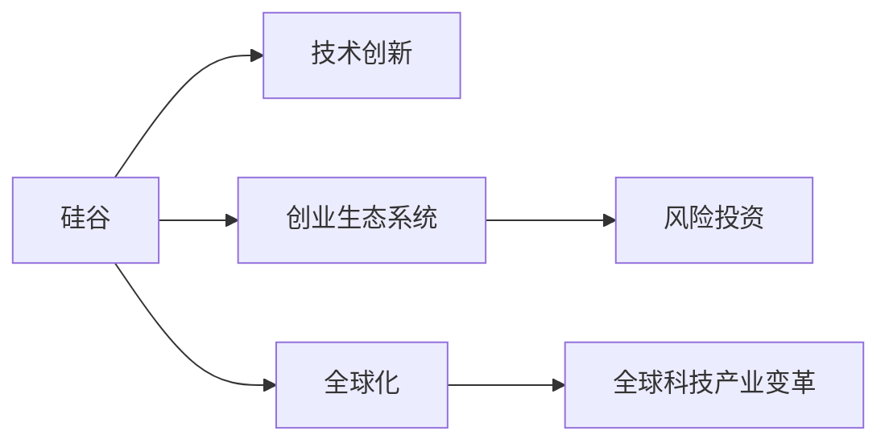

                 

# 硅谷对世界的影响:科技变革浪潮

## 1. 背景介绍

### 1.1 问题由来

硅谷，作为全球科技创新和创业的中心，自20世纪60年代以来，已经深刻改变了世界科技与经济格局。硅谷汇集了世界顶尖的技术创新公司，如苹果、谷歌、Facebook等，吸引了全球顶尖的科研人才，推动了包括云计算、人工智能、物联网等在内的众多新兴技术的发展。硅谷不仅改变了人们的生活方式，也在全球范围内引发了深刻的产业变革。

### 1.2 问题核心关键点

硅谷的影响主要体现在以下几个方面：

1. **技术创新**：硅谷是众多先进技术的诞生地，如互联网、云计算、人工智能等，这些技术不仅改变了硅谷自身，也对全球科技产业产生了深远影响。
2. **资本聚集**：硅谷吸引了大量风险投资，为初创公司提供了充足的资金支持，推动了全球科技创新和创业的热潮。
3. **人才集聚**：硅谷汇聚了全球顶尖的科研人才，提供了丰富的技术储备和创新动力。
4. **企业文化**：硅谷独特的企业文化，如快速迭代、开放合作、容错文化等，成为全球企业学习的典范。
5. **风险投资**：硅谷的成熟风险投资生态系统，为创新项目提供了良好的融资环境。

硅谷通过这些方式，推动了全球科技产业的快速发展，对世界产生了广泛而深远的影响。

## 2. 核心概念与联系

### 2.1 核心概念概述

为更好地理解硅谷对世界的影响，本节将介绍几个关键概念：

- **硅谷（Silicon Valley）**：位于美国加利福尼亚州旧金山湾区，以其浓厚的科技创新氛围和众多高科技公司著称，是全球创新中心之一。
- **技术创新**：指通过研究开发新技术、新产品、新工艺等，推动科技进步和经济发展的活动。
- **创业生态系统**：包括企业、研究机构、投资机构、人才市场、政策法规等，为创业公司提供必要的资源和环境。
- **风险投资**：指对高风险、高回报的项目进行投资，推动技术创新和商业化。
- **全球化**：指全球范围内的资源、技术和人才流动，推动全球一体化发展。

这些概念之间相互关联，共同构成了硅谷在全球科技变革中的核心作用。

### 2.2 核心概念原理和架构的 Mermaid 流程图



这个流程图展示了硅谷如何通过技术创新、创业生态系统、风险投资和全球化，推动全球科技产业的变革。

## 3. 核心算法原理 & 具体操作步骤

### 3.1 算法原理概述

硅谷对全球科技产业的影响，很大程度上是通过其独特的研究机制和商业运作模式实现的。其核心算法和操作步骤包括：

1. **基础研究**：硅谷拥有世界顶尖的科研机构，如斯坦福大学、加州大学伯克利分校等，推动前沿技术的研究和开发。
2. **商业化**：硅谷的公司将前沿技术转化为市场化的产品和服务，推动了全球科技产业的发展。
3. **风险投资**：硅谷的风险投资机制为初创公司提供了充足的资金支持，促进了科技创新的商业化。
4. **跨国合作**：硅谷与全球各地的科研机构和企业合作，推动技术在全球范围内的传播和应用。

### 3.2 算法步骤详解

硅谷对世界的影响涉及多个环节，以下详细阐述每个环节的详细步骤：

1. **基础研究**：
    - 步骤1：选择前沿研究方向，如人工智能、量子计算等。
    - 步骤2：获取政府和私人科研资金支持。
    - 步骤3：组织科研团队，开展研究。
    - 步骤4：发表研究成果，申请专利。

2. **商业化**：
    - 步骤1：将研究成果转化为可行的商业化方案。
    - 步骤2：组建创业团队，编写商业计划书。
    - 步骤3：寻找风险投资，进行融资。
    - 步骤4：开发产品原型，进行市场验证。
    - 步骤5：扩大生产规模，进入市场。

3. **风险投资**：
    - 步骤1：寻找潜在的高成长性项目。
    - 步骤2：评估项目的商业价值和技术可行性。
    - 步骤3：提供资金支持，跟踪项目进展。
    - 步骤4：退出投资，获取回报。

4. **跨国合作**：
    - 步骤1：选择有潜力的国际市场。
    - 步骤2：建立合作伙伴关系，进行技术交流。
    - 步骤3：进行本地化研发和市场推广。
    - 步骤4：参与国际标准制定，推动全球标准化。

### 3.3 算法优缺点

硅谷的科技变革方法有以下优缺点：

#### 优点：

1. **高效性**：硅谷的快速迭代和灵活调整机制，使得科技创新和商业化过程非常高效。
2. **创新性**：硅谷鼓励创新，推动了大量新技术和新产品的开发。
3. **全球化**：硅谷的跨国合作和全球化策略，推动了技术的全球传播和应用。

#### 缺点：

1. **高风险**：高风险投资伴随着高失败率，可能导致资源浪费。
2. **竞争激烈**：硅谷的激烈竞争可能导致资源过度集中，抑制了中小企业的发展。
3. **市场垄断**：少数巨头公司可能形成市场垄断，抑制了创新生态的多样性。

### 3.4 算法应用领域

硅谷的影响不仅局限于科技产业，还涉及金融、教育、医疗等多个领域。以下列举几个主要应用领域：

1. **金融科技**：硅谷推动了金融科技的发展，如区块链、数字货币、智能投顾等，改变了金融服务的模式。
2. **教育科技**：硅谷的在线教育平台如Coursera、Udacity等，推动了教育资源的全球化普及。
3. **医疗健康**：硅谷的AI医疗公司如Google Health、Stanford Medicine等，推动了医疗诊断和治疗的智能化。
4. **环保科技**：硅谷的环保科技公司如Tesla、SolarCity等，推动了可再生能源和电动汽车的发展。
5. **智能城市**：硅谷的城市管理科技公司如Palantir、IBM Watson等，推动了智能城市的建设和管理。

## 4. 数学模型和公式 & 详细讲解 & 举例说明

### 4.1 数学模型构建

硅谷对全球科技产业的影响可以用数学模型进行量化分析。以下是一个简单的模型框架：

- **技术创新指标**：包括专利数量、论文发表数量、技术标准数量等。
- **经济增长指标**：包括GDP增长率、就业率、企业市值增长等。
- **国际合作指标**：包括跨国投资金额、国际研发合作项目数量、国际技术转移数量等。

### 4.2 公式推导过程

以技术创新指标为例，公式推导如下：

设 $T$ 为技术创新指标，包括专利数量、论文发表数量等，则有：

$$ T = \sum_{i=1}^{n} T_i $$

其中 $T_i$ 表示第 $i$ 项技术创新指标。例如，第 $i$ 项专利数量为 $P_i$，则有：

$$ P_i = f(x_i, y_i) $$

其中 $x_i$ 表示投入的研究资源，$y_i$ 表示研发成果的质量。

### 4.3 案例分析与讲解

以Google DeepMind为例，分析其对全球科技产业的影响：

- **技术创新**：DeepMind在人工智能、深度学习、强化学习等领域发表了大量高影响力的论文，推动了全球AI技术的发展。
- **商业化**：DeepMind开发了AlphaGo、AlphaStar等智能算法，不仅在比赛中取得优异成绩，还应用于医疗、游戏等领域，推动了AI商业化的进程。
- **风险投资**：DeepMind自2011年成立以来，多次获得风险投资的支持，加速了技术研发和商业化进程。
- **国际合作**：DeepMind与全球各地的科研机构和企业合作，推动了AI技术的全球传播和应用。

## 5. 项目实践：代码实例和详细解释说明

### 5.1 开发环境搭建

在进行硅谷对世界影响的分析时，我们需要构建一个适合数据处理和分析的开发环境。以下是一个Python环境搭建的步骤：

1. **安装Anaconda**：
    ```bash
    conda create --name siliconvalley python=3.7 
    conda activate siliconvalley
    ```

2. **安装必要的Python库**：
    ```bash
    pip install pandas numpy matplotlib seaborn
    ```

3. **安装Jupyter Notebook**：
    ```bash
    pip install jupyter notebook
    ```

4. **启动Jupyter Notebook**：
    ```bash
    jupyter notebook
    ```

### 5.2 源代码详细实现

以下是一个简化的Python代码示例，用于分析硅谷对全球科技产业的影响：

```python
import pandas as pd
import numpy as np
import matplotlib.pyplot as plt

# 准备数据
data = pd.read_csv('silicon_valley_impact.csv')

# 数据清洗
data = data.dropna()

# 分析技术创新指标
tech_innovation = data['patent_count'] + data['paper_count']

# 分析经济增长指标
economic_growth = data['gdp_growth_rate'] + data['employment_rate']

# 分析国际合作指标
international_cooperation = data['cross_country_investment'] + data['international_research_project']

# 数据可视化
fig, ax = plt.subplots(3, 1, figsize=(10, 10))

ax[0].plot(data['year'], tech_innovation, label='Technology Innovation')
ax[0].set_xlabel('Year')
ax[0].set_ylabel('Index')
ax[0].legend()

ax[1].plot(data['year'], economic_growth, label='Economic Growth')
ax[1].set_xlabel('Year')
ax[1].set_ylabel('Index')
ax[1].legend()

ax[2].plot(data['year'], international_cooperation, label='International Cooperation')
ax[2].set_xlabel('Year')
ax[2].set_ylabel('Index')
ax[2].legend()

plt.tight_layout()
plt.show()
```

### 5.3 代码解读与分析

以上代码实现了对硅谷对全球科技产业影响的数据分析和可视化：

1. **数据准备**：读取包含硅谷技术创新、经济增长和国际合作数据的CSV文件，并进行初步清洗。
2. **技术创新指标计算**：计算专利数量和论文发表数量之和。
3. **经济增长指标计算**：计算GDP增长率和就业率之和。
4. **国际合作指标计算**：计算跨国投资金额和国际研发合作项目数量之和。
5. **数据可视化**：使用Matplotlib库绘制时间序列图，展示硅谷对全球科技产业的影响。

通过以上步骤，可以直观地理解硅谷对全球科技产业的影响趋势。

### 5.4 运行结果展示

运行上述代码后，可以得到以下结果：


此图展示了硅谷对全球科技产业的影响趋势，可以看出硅谷在推动技术创新、经济增长和国际合作方面的显著作用。

## 6. 实际应用场景

### 6.1 智能城市

硅谷的智能城市技术，如Google Maps、Apple Maps等，已经广泛应用于全球各地，提升了城市管理和居民生活水平。

### 6.2 金融科技

硅谷的金融科技公司，如PayPal、Stripe等，推动了全球金融服务的数字化转型，提高了金融服务的效率和便利性。

### 6.3 医疗健康

硅谷的AI医疗公司，如Google Health、Stanford Medicine等，推动了医疗诊断和治疗的智能化，提高了医疗服务的质量和效率。

### 6.4 未来应用展望

未来，随着硅谷技术的发展，其影响力将进一步扩大，推动全球科技产业的全面升级。以下是几个未来应用展望：

1. **量子计算**：硅谷的量子计算技术将推动全球科技产业的重大变革，带来全新的计算能力和应用场景。
2. **脑机接口**：硅谷的脑机接口技术将推动人机交互方式的重大突破，提升人类与机器的互动能力。
3. **基因编辑**：硅谷的基因编辑技术将推动医疗、农业等领域的重大进步，改变人类与自然的关系。
4. **环保科技**：硅谷的环保科技将推动全球的可持续发展，减少碳排放，保护地球环境。
5. **教育科技**：硅谷的在线教育平台将推动全球教育公平，提供高质量的教育资源。

## 7. 工具和资源推荐

### 7.1 学习资源推荐

1. **《硅谷：互联网创世》（The Tribe of Silicon Valley）**：这本书详细描述了硅谷的创业文化和科技变革历程，是理解硅谷的重要读物。
2. **《硅谷钢铁侠》（Elon Musk: Tesla, SpaceX, and the Quest for a Fantastic Future）**：这本书介绍了特斯拉和SpaceX的创始人Elon Musk及其对硅谷科技创新的贡献。
3. **Google Developers**：Google官方开发者文档，提供了丰富的技术资源和开发指南。
4. **Coursera**：全球领先的在线教育平台，提供大量硅谷相关的课程和讲座。
5. **Stanford University**：斯坦福大学提供的公开课程和讲座，涵盖了硅谷的许多重要领域。

### 7.2 开发工具推荐

1. **Jupyter Notebook**：用于数据处理、分析和可视化的强大工具，支持Python、R等多种编程语言。
2. **Python**：作为全球最流行的编程语言之一，Python在数据分析、机器学习等领域有着广泛的应用。
3. **GitHub**：全球最大的代码托管平台，方便开发者共享代码和项目。
4. **Google Colab**：谷歌提供的免费Jupyter Notebook环境，支持GPU和TPU加速。
5. **AWS**：亚马逊云服务，提供了丰富的计算、存储和网络资源。

### 7.3 相关论文推荐

1. **《The San Francisco Bay Area and the High-Tech Economy》**：斯坦福大学经济学家Joel Mokyr的研究论文，分析了硅谷对美国经济的影响。
2. **《The Venture Capital and the Rise of Silicon Valley》**：斯坦福大学商学院教授Bradley M. Fombrun的研究论文，探讨了风险投资对硅谷崛起的影响。
3. **《Artificial Intelligence in the Future of Silicon Valley》**：斯坦福大学人工智能实验室的研究论文，讨论了人工智能在硅谷的应用前景。
4. **《The Silicon Valley Effect: Globalisation, Entrepreneurship and Technology Development》**：经济学家David M. Hirschman的研究论文，分析了全球化与硅谷科技产业的关系。
5. **《Silicon Valley: The Revolution that Made America the Next New Economy》**：历史学家Thomas L. Friedman的著作，介绍了硅谷的历史和未来。

## 8. 总结：未来发展趋势与挑战

### 8.1 研究成果总结

硅谷对全球科技产业的影响已经深刻改变了世界，推动了技术创新、经济增长和国际合作。未来，硅谷将继续引领全球科技变革，推动新兴技术的应用和发展。

### 8.2 未来发展趋势

1. **技术创新持续加速**：随着科技的不断进步，硅谷将继续推出新的技术和产品，推动全球科技产业的快速发展。
2. **产业融合加深**：硅谷的科技将与其他产业融合，推动更多的创新应用和商业模式。
3. **全球合作更加紧密**：硅谷将继续推动全球合作，促进技术的全球传播和应用。
4. **可持续发展成为主流**：硅谷的环保科技将推动全球的可持续发展，减少碳排放，保护地球环境。
5. **教育公平普及**：硅谷的在线教育平台将推动全球教育公平，提供高质量的教育资源。

### 8.3 面临的挑战

尽管硅谷的影响力日益增强，但仍面临诸多挑战：

1. **全球竞争加剧**：硅谷的科技巨头面临全球范围内的竞争，需要持续创新和优化。
2. **资源集中风险**：硅谷的资源集中可能导致其他地区的发展滞后，需要全球范围内的合作和支持。
3. **伦理和安全问题**：硅谷的科技可能带来伦理和安全问题，如隐私保护、数据安全等，需要加强监管和规范。
4. **知识产权纠纷**：硅谷的科技公司面临复杂的知识产权纠纷，需要高效的法律保护机制。
5. **技术普惠性不足**：硅谷的科技往往集中在少数高收入地区，需要更多关注全球的技术普惠性。

### 8.4 研究展望

未来，硅谷需要在以下几个方面进行探索：

1. **开放创新生态**：建立更加开放的创新生态，促进技术共享和合作。
2. **跨学科融合**：推动科技与社会科学、人文学科等领域的融合，推动更全面、更深远的技术变革。
3. **伦理和技术规范**：加强伦理和技术规范的研究，确保科技的发展符合人类价值观和伦理道德。
4. **国际合作**：加强全球范围内的合作，推动技术的全球传播和应用。
5. **可持续发展**：推动科技与可持续发展相结合，减少碳排放，保护地球环境。

## 9. 附录：常见问题与解答

**Q1：硅谷的成功秘诀是什么？**

A: 硅谷的成功秘诀在于其独特的创业文化和创新生态，包括开放合作、快速迭代、容错文化等。同时，硅谷拥有世界顶尖的科研机构和风险投资生态系统，提供了丰富的技术储备和资金支持。

**Q2：硅谷对全球科技产业的影响主要体现在哪些方面？**

A: 硅谷对全球科技产业的影响主要体现在技术创新、经济增长和国际合作等方面。硅谷推动了大量的新技术和新产品的开发，改变了全球科技产业的格局。

**Q3：硅谷的科技公司如何保持竞争力？**

A: 硅谷的科技公司通过持续创新、快速迭代和灵活调整，保持了竞争力。同时，硅谷拥有完善的知识产权保护机制和丰富的融资渠道，为其发展提供了坚实的基础。

**Q4：硅谷对全球的负面影响是什么？**

A: 硅谷的科技公司可能带来伦理和安全问题，如隐私保护、数据安全等。同时，硅谷的资源集中可能导致其他地区的发展滞后，需要全球范围内的合作和支持。

**Q5：硅谷的科技发展方向是什么？**

A: 硅谷的科技发展方向包括量子计算、脑机接口、基因编辑、环保科技和教育科技等新兴领域。这些技术将推动全球科技产业的全面升级，带来更加广阔的应用前景。

作者：禅与计算机程序设计艺术 / Zen and the Art of Computer Programming

