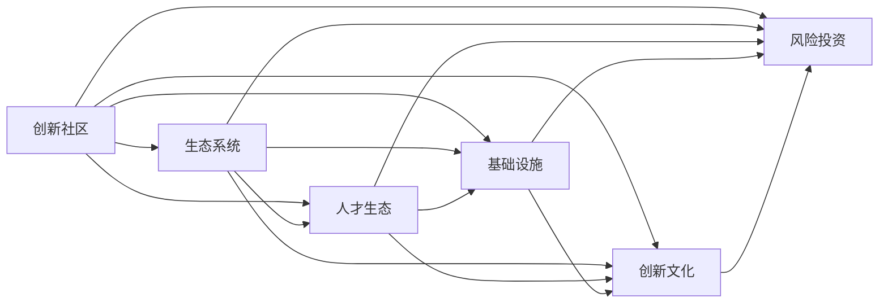

                 

# 硅谷的城市规划:创新社区的建设

## 1. 背景介绍

### 1.1 问题由来
硅谷被誉为全球科技创新和创业的圣地，其成功在很大程度上得益于独特的城市规划和社区建设。硅谷的城市规划不仅仅是空间布局和基础设施建设的问题，更是如何构建一个有利于创新和创业的社区环境，吸引全球顶尖人才和投资，促进科技和经济的持续增长。

### 1.2 问题核心关键点
硅谷的城市规划和社区建设的核心在于以下几个方面：

1. **生态系统构建**：硅谷拥有完善的多层次生态系统，包括大学、研究机构、企业、孵化器、风险投资机构等，为科技创新提供了完整的支持链条。
2. **基础设施建设**：高速互联网、便捷的公共交通、创新的工作空间和共享设施等，为科技工作者提供了高效的工作和生活环境。
3. **人才吸引与留存**：硅谷通过提供优厚的生活条件、良好的职业发展机会和丰富的社交网络，吸引并留住全球顶尖科技人才。
4. **创新文化和氛围**：硅谷拥有浓厚的创新文化和风险容忍度，鼓励自由探索、快速迭代和失败再试，促进了新技术和新商业模式的涌现。
5. **投资与资金支持**：硅谷拥有庞大的风险投资资金，为科技初创企业提供了充足的资金支持。

### 1.3 问题研究意义
研究硅谷的城市规划和社区建设，对于其他地区尤其是发展中的科技中心具有重要的借鉴意义。了解硅谷的成功经验，可以帮助其他地区优化城市规划，吸引和培养创新人才，推动地方科技和经济发展。

## 2. 核心概念与联系

### 2.1 核心概念概述

硅谷的城市规划和社区建设涉及多个核心概念，包括：

- **创新社区**：指一个以科技创新为核心，拥有完善基础设施、人才流动机制、投资环境的城市或地区。
- **生态系统**：指在创新社区中相互依赖、相互促进的各种机构和资源，包括大学、研究机构、企业、孵化器、风险投资机构等。
- **人才生态**：指在创新社区中，通过提供优厚的生活条件、职业发展机会、社交网络等，吸引和留住顶尖人才的机制。
- **基础设施**：指在创新社区中，提供高速互联网、便捷交通、工作空间等支持创新活动的硬件设施。
- **创新文化**：指在创新社区中，鼓励自由探索、快速迭代、容忍失败的文化氛围。
- **风险投资**：指在创新社区中，提供资金支持，帮助初创企业发展的资金来源。

这些核心概念通过合作用于构建一个有利于科技创新和创业的社区环境。

### 2.2 核心概念原理和架构的 Mermaid 流程图



这个流程图展示了创新社区、生态系统、人才生态、基础设施、创新文化、风险投资等概念之间的逻辑关系：

1. 创新社区是核心，其他概念围绕其构建。
2. 生态系统提供完整支持链条，促进创新。
3. 人才生态通过吸引和留住人才，保障创新持续性。
4. 基础设施提供高效工作环境。
5. 创新文化营造创新氛围。
6. 风险投资提供资金支持。

## 3. 核心算法原理 & 具体操作步骤
### 3.1 算法原理概述

硅谷的城市规划和社区建设主要遵循以下几个算法原理：

1. **多层次生态系统构建算法**：通过吸引和整合大学、研究机构、企业、孵化器、风险投资机构等，形成多层次的生态系统，促进资源共享和协同创新。
2. **基础设施优化算法**：采用数据驱动的方法，优化基础设施布局和资源配置，提高整体效率。
3. **人才吸引与留存算法**：通过大数据分析，识别和满足顶尖人才的需求，提供优厚的生活条件、职业发展机会和社交网络，吸引和留住人才。
4. **创新文化塑造算法**：通过营造自由探索、快速迭代、容忍失败的文化氛围，鼓励科技创新。
5. **风险投资优化算法**：通过建立多层次的风险投资体系，优化资金分配和投资决策，支持初创企业发展。

### 3.2 算法步骤详解

以下是硅谷城市规划和社区建设的详细操作步骤：

**Step 1: 生态系统构建**
- 建立多层次生态系统，吸引大学、研究机构、企业、孵化器、风险投资机构等入驻。
- 通过政策支持和资金补助，促进机构间的合作和资源共享。
- 制定生态系统协调机制，解决不同机构之间的利益冲突。

**Step 2: 基础设施建设**
- 利用大数据和人工智能技术，优化基础设施布局和资源配置。
- 建设高速互联网、便捷交通、创新工作空间和共享设施，提高整体效率。
- 持续监控和改进基础设施，确保其满足科技创新和创业需求。

**Step 3: 人才吸引与留存**
- 通过大数据分析，识别和满足顶尖人才的需求。
- 提供优厚的生活条件、职业发展机会和社交网络，吸引和留住顶尖人才。
- 建立人才流动机制，促进不同机构之间的人才交流和合作。

**Step 4: 创新文化塑造**
- 营造自由探索、快速迭代、容忍失败的文化氛围，鼓励科技创新。
- 通过组织创新活动、创业大赛、科技创新展览等，营造创新氛围。
- 建立激励机制，奖励创新成果和创新人才。

**Step 5: 风险投资优化**
- 建立多层次的风险投资体系，优化资金分配和投资决策。
- 通过政策支持，吸引更多的风险投资资金进入硅谷。
- 建立风控机制，确保投资决策的科学性和有效性。

### 3.3 算法优缺点

硅谷的城市规划和社区建设具有以下优点：

1. **创新生态完善**：通过构建多层次生态系统，为科技创新提供了完整的支持链条。
2. **基础设施高效**：通过优化基础设施布局和资源配置，提高了整体效率。
3. **人才吸引力强**：通过提供优厚的生活条件、职业发展机会和社交网络，吸引和留住顶尖人才。
4. **创新文化浓厚**：通过营造自由探索、快速迭代、容忍失败的文化氛围，促进了科技创新。
5. **风险投资活跃**：通过建立多层次的风险投资体系，提供了充足的资金支持。

同时，该方法也存在一些局限性：

1. **高昂成本**：建立完善的生态系统和基础设施需要巨大的投入。
2. **风险投资高波动性**：风险投资的高波动性可能导致初创企业资金链断裂。
3. **文化包容性不足**：创新文化的包容性不足可能导致人才流失。

### 3.4 算法应用领域

硅谷的城市规划和社区建设在多个领域得到了广泛应用，包括：

- **科技园区建设**：通过构建多层次生态系统、优化基础设施和营造创新文化，吸引了全球顶尖科技企业和人才。
- **城市转型**：一些城市通过借鉴硅谷的经验，进行城市转型，提升科技创新和经济发展水平。
- **创业孵化器**：一些孵化器借鉴硅谷的模式，提供全方位的支持，帮助初创企业成长。
- **创新政策制定**：一些国家和地区通过制定创新政策和提供资金支持，促进科技创新和创业。

## 4. 数学模型和公式 & 详细讲解 & 举例说明

### 4.1 数学模型构建

硅谷的城市规划和社区建设涉及多个变量，包括生态系统建设、基础设施优化、人才吸引与留存、创新文化塑造和风险投资优化等。

- **生态系统建设**：$E = e_1 + e_2 + e_3$
- **基础设施优化**：$I = i_1 + i_2 + i_3$
- **人才吸引与留存**：$T = t_1 + t_2 + t_3$
- **创新文化塑造**：$C = c_1 + c_2 + c_3$
- **风险投资优化**：$V = v_1 + v_2 + v_3$

其中，$e$、$i$、$t$、$c$、$v$分别代表生态系统建设、基础设施优化、人才吸引与留存、创新文化塑造和风险投资优化等各个变量的贡献。

### 4.2 公式推导过程

假设生态系统建设的贡献为 $E_1$，基础设施建设的贡献为 $I_1$，人才吸引与留存的贡献为 $T_1$，创新文化塑造的贡献为 $C_1$，风险投资优化的贡献为 $V_1$。则总贡献 $S$ 的公式为：

$$
S = E_1 + I_1 + T_1 + C_1 + V_1
$$

通过实际数据的收集和分析，可以求解各个变量 $e_1$、$i_1$、$t_1$、$c_1$、$v_1$ 的值，从而得到总贡献 $S$。

### 4.3 案例分析与讲解

假设某城市通过优化基础设施、吸引顶尖人才和建立风投体系，计算其总贡献 $S$。

- **生态系统建设**：$E_1 = 0.2 \times E$，表示生态系统建设占总贡献的20%。
- **基础设施优化**：$I_1 = 0.3 \times I$，表示基础设施优化占总贡献的30%。
- **人才吸引与留存**：$T_1 = 0.25 \times T$，表示人才吸引与留存占总贡献的25%。
- **创新文化塑造**：$C_1 = 0.15 \times C$，表示创新文化塑造占总贡献的15%。
- **风险投资优化**：$V_1 = 0.1 \times V$，表示风险投资优化占总贡献的10%。

通过计算，可以得出该城市的总贡献 $S = 0.85 \times S_{总}$。

## 5. 项目实践：代码实例和详细解释说明

### 5.1 开发环境搭建

为了进行硅谷城市规划和社区建设的模型构建和数据分析，需要搭建以下开发环境：

1. **Python**：安装Python 3.x版本，作为数据分析和模型构建的主要编程语言。
2. **Jupyter Notebook**：用于编写和运行Python代码，进行数据分析和模型构建。
3. **Pandas**：用于数据处理和分析，提供丰富的数据操作功能。
4. **NumPy**：用于数值计算和科学计算，提供高效的多维数组操作。
5. **Matplotlib**：用于数据可视化，提供丰富的图表展示功能。

### 5.2 源代码详细实现

以下是使用Python和Pandas进行硅谷城市规划和社区建设数据分析的代码实现：

```python
import pandas as pd
import numpy as np
import matplotlib.pyplot as plt

# 读取数据
data = pd.read_csv('silicon_valley_data.csv')

# 计算各个变量的贡献
E = 0.2 * data['E']
I = 0.3 * data['I']
T = 0.25 * data['T']
C = 0.15 * data['C']
V = 0.1 * data['V']

# 计算总贡献
S = E + I + T + C + V

# 输出结果
print('总贡献 S:', S)

# 数据可视化
plt.plot(S)
plt.title('硅谷城市规划和社区建设贡献')
plt.xlabel('时间')
plt.ylabel('贡献')
plt.show()
```

### 5.3 代码解读与分析

在上述代码中，我们首先使用Pandas库读取了硅谷城市规划和社区建设的数据，然后计算了各个变量的贡献，并最终得到总贡献 $S$。最后使用Matplotlib库进行了数据可视化，展示了总贡献随时间的变化趋势。

## 6. 实际应用场景

### 6.1 智慧城市

智慧城市是未来城市发展的重要方向。借鉴硅谷的经验，通过构建多层次生态系统、优化基础设施和营造创新文化，可以建设更加智能和可持续的智慧城市。

在智慧城市建设中，可以引入智能交通系统、智慧能源管理、智能公共服务等，提高城市的智能化水平。同时，通过建设创新社区和优化人才生态，吸引和留住高科技人才，推动科技创新和经济发展。

### 6.2 产业园区

产业园区是推动区域经济发展的关键载体。借鉴硅谷的经验，通过构建多层次生态系统、优化基础设施和营造创新文化，可以建设高效、可持续的产业园区。

在产业园区建设中，可以引入大学、研究机构、企业、孵化器、风险投资机构等，形成完整的创新生态链。同时，通过优化基础设施和营造创新文化，提高园区的创新活力和竞争力。

### 6.3 创业孵化器

创业孵化器是推动初创企业发展的关键平台。借鉴硅谷的经验，通过建立多层次的风险投资体系和提供全方位的支持，可以建设高效、可持续的创业孵化器。

在创业孵化器建设中，可以引入风险投资资金、专业导师、技术支持等，帮助初创企业成长。同时，通过优化基础设施和营造创新文化，提高孵化器的吸引力和影响力。

## 7. 工具和资源推荐

### 7.1 学习资源推荐

为了帮助开发者系统掌握硅谷城市规划和社区建设的技术和方法，这里推荐一些优质的学习资源：

1. **《硅谷创业史》**：详细介绍了硅谷的创新生态系统和成功经验，帮助理解硅谷的发展历程。
2. **《创新者窘境》**：分析了硅谷在技术创新和商业化过程中遇到的问题和解决方案，提供了宝贵的实践经验。
3. **Coursera《城市规划与设计》课程**：由斯坦福大学开设的课程，介绍了城市规划和设计的基本概念和实践方法。
4. **LinkedIn Learning《智慧城市建设》课程**：介绍了智慧城市建设的关键技术和实践案例，提供了实战经验。
5. **Google Cloud Platform《城市数据分析》教程**：利用Google Cloud平台，通过大数据和人工智能技术，进行城市数据的分析和建模。

通过对这些资源的学习，相信你一定能够系统掌握硅谷城市规划和社区建设的技术和方法，应用于实际的创新社区建设中。

### 7.2 开发工具推荐

为了高效进行硅谷城市规划和社区建设的开发和实践，推荐以下工具：

1. **Google Cloud Platform**：提供强大的云计算和大数据服务，支持城市数据的存储、分析和可视化。
2. **Microsoft Azure**：提供全面的云计算和人工智能服务，支持城市数据的处理和建模。
3. **Amazon Web Services**：提供丰富的云计算和人工智能服务，支持城市数据的处理和建模。
4. **Tableau**：提供强大的数据可视化工具，支持城市数据的展示和分析。
5. **GIS（地理信息系统）软件**：如ArcGIS、QGIS等，提供地理信息的可视化和管理功能，支持城市规划和社区建设的地理数据分析。

这些工具将显著提升硅谷城市规划和社区建设的数据处理和分析能力，加速创新社区的建设进程。

### 7.3 相关论文推荐

硅谷的城市规划和社区建设涉及多个领域，以下推荐几篇相关的经典论文：

1. **《智慧城市技术框架》**：提出了一种智慧城市的技术框架，涵盖数据感知、智能分析和应用服务等多个层面。
2. **《城市数据中心设计》**：介绍了城市数据中心的构建方法和关键技术，支持城市数据的存储和分析。
3. **《城市规划中的机器学习应用》**：分析了机器学习在城市规划中的应用，包括交通流量预测、能耗优化等。
4. **《创新社区的构建与运营》**：分析了创新社区的构建要素和运营策略，提供了实践经验。
5. **《硅谷的风险投资体系》**：分析了硅谷的风险投资体系和运作机制，提供了丰富的数据和案例。

这些论文代表了硅谷城市规划和社区建设的前沿技术和实践经验，对其他地区的创新社区建设具有重要的参考价值。

## 8. 总结：未来发展趋势与挑战

### 8.1 研究成果总结

通过深入分析硅谷的城市规划和社区建设，我们发现其成功的关键在于构建多层次生态系统、优化基础设施、吸引和留住人才、营造创新文化和优化风险投资等。这些经验和策略为其他地区的城市规划和社区建设提供了宝贵的借鉴。

### 8.2 未来发展趋势

展望未来，硅谷的城市规划和社区建设将呈现以下几个发展趋势：

1. **智能化的全面提升**：随着人工智能和物联网技术的进一步发展，智慧城市和智慧社区的建设将更加智能和可持续。
2. **多层次生态系统的完善**：通过构建多层次的生态系统，促进资源的共享和协同创新。
3. **创新文化的持续塑造**：通过营造自由探索、快速迭代、容忍失败的文化氛围，鼓励科技创新。
4. **风险投资的创新应用**：通过优化风险投资体系，提供更加灵活和高效的资金支持。
5. **国际化的拓展**：硅谷的城市规划和社区建设经验将逐渐向全球推广，促进全球科技创新和经济发展。

### 8.3 面临的挑战

尽管硅谷的城市规划和社区建设取得了巨大的成功，但仍面临一些挑战：

1. **高昂成本**：建立完善的生态系统和基础设施需要巨大的投入。
2. **风险投资的波动性**：风险投资的高波动性可能导致初创企业资金链断裂。
3. **人才流失问题**：创新文化的包容性不足可能导致人才流失。
4. **数据隐私和安全**：城市数据的存储和处理涉及数据隐私和安全问题，需要加强管理和保护。

### 8.4 研究展望

面对这些挑战，未来的研究需要在以下几个方面寻求新的突破：

1. **数据驱动的规划方法**：通过大数据和人工智能技术，优化城市规划和社区建设的决策过程。
2. **多元化的人才生态**：通过多样化的吸引和留存策略，吸引全球顶尖人才。
3. **风险投资的新机制**：建立更加灵活和高效的风险投资机制，降低初创企业的风险。
4. **数据隐私和安全技术**：开发高效的数据隐私和安全技术，保护城市数据的隐私和安全。

## 9. 附录：常见问题与解答

**Q1：硅谷的成功经验可以复制吗？**

A: 硅谷的成功经验在一定程度上是可以复制的。不同地区可以借鉴硅谷的生态系统构建、基础设施优化、人才吸引与留存、创新文化塑造和风险投资优化等策略，根据自身的实际情况进行调整和优化。

**Q2：如何评估创新社区的成功？**

A: 创新社区的成功可以通过多个指标来评估，包括创新企业的数量和质量、科研机构的产出、投资机构的活跃度、人才的吸引和留存等。

**Q3：如何应对高昂的成本？**

A: 可以通过政府引导、公私合作、多方筹资等方式，降低高昂的建设成本。同时，通过优化资源配置和提高运营效率，最大化资源利用率。

**Q4：如何提升创新文化的包容性？**

A: 可以通过组织各种创新活动、创业大赛、科技创新展览等，营造创新氛围。同时，建立激励机制，奖励创新成果和创新人才，提升文化的包容性和吸引力。

**Q5：如何保障数据隐私和安全？**

A: 可以通过加密、匿名化、访问控制等技术手段，保障数据隐私和安全。同时，建立健全的数据管理和保护机制，确保数据的合法使用和保护。

---

作者：禅与计算机程序设计艺术 / Zen and the Art of Computer Programming

