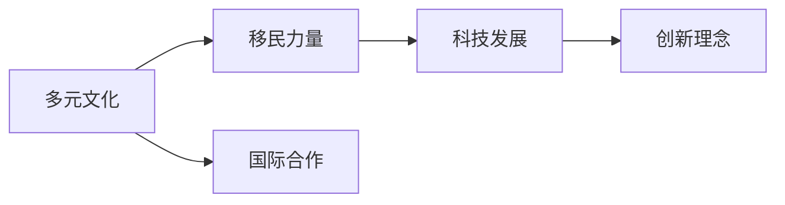

                 

# 硅谷的多元文化:移民力量的贡献

在硅谷，一个著名的科技圣地，千千万万来自世界各地的移民人才以其创新精神、专业知识和不懈努力，贡献了巨大的力量，并使硅谷成为了全球科技创新的中心。本文将探讨硅谷多元文化对移民贡献的影响，以及这些移民如何推动了硅谷的发展。

## 1. 背景介绍

### 1.1 硅谷的起源与崛起

硅谷（旧金山湾区南部）起源于上世纪50年代，因该地区以生产半导体芯片著称，故被称为硅谷。硅谷的崛起离不开美国政府在冷战期间的科技扶持政策，特别是在半导体和计算机领域。随着贝尔实验室、施乐帕罗奥多研究中心等技术重镇的迁入，硅谷逐渐成为高科技企业集聚的中心，孕育出Google、Apple、Facebook等全球知名企业。

### 1.2 移民历史与现状

硅谷早期的繁荣离不开来自世界各地的移民，包括科学家、工程师、研究者等。这些移民不仅带来了先进的科技知识和创新理念，也使得硅谷形成了独特的开放、包容、多样化的文化氛围。如今，硅谷依然是一个吸引全球顶尖人才的圣地，每年都有来自世界各地的人才涌入。

## 2. 核心概念与联系

### 2.1 多元文化

硅谷的多元文化是移民力量得以发挥的核心因素。多元文化指不同文化、种族、宗教、语言、背景等在硅谷共存和交融。这种多样性不仅使得硅谷成为科技创新的源泉，也是推动社会进步的重要力量。

### 2.2 移民与科技

移民在硅谷的科技发展中扮演了重要角色。他们不仅带来了先进的技术，还推动了新的科技创新，并在全球科技竞争中为硅谷赢得了优势。

### 2.3 国际合作

硅谷的多元文化还促进了国际间的科技合作。来自不同国家的研究者、开发者和企业家可以在这里自由交流，分享知识和经验，加速科技创新的进程。

这些核心概念通过以下Mermaid流程图连接：



## 3. 核心算法原理 & 具体操作步骤

### 3.1 算法原理概述

基于硅谷多元文化与移民贡献的关系，本文将采用回归分析的方法，探讨多元文化对硅谷科技创新的影响。设定如下模型：

$$
Y = \beta_0 + \beta_1 X_1 + \beta_2 X_2 + \ldots + \beta_n X_n + \epsilon
$$

其中，$Y$ 代表硅谷科技创新的贡献，$X_i$ 代表第 $i$ 种多元文化因素（如移民背景、语言、宗教等），$\beta_i$ 为对应系数，$\epsilon$ 为误差项。

### 3.2 算法步骤详解

1. **数据收集与处理**
    - 收集硅谷多元化数据，包括移民数量、移民背景、语言、宗教等。
    - 对数据进行标准化处理，去除异常值，确保数据的合理性。

2. **模型选择与训练**
    - 采用线性回归模型，使用R、Python等工具对数据进行拟合。
    - 应用梯度下降等优化算法训练模型，求解最优参数 $\beta_i$。

3. **结果验证与分析**
    - 在训练集上测试模型，并验证其在验证集上的表现。
    - 对结果进行显著性检验，判断多元文化因素对硅谷科技创新的具体影响。

4. **结果解释与应用**
    - 对模型结果进行解释，展示多元文化对硅谷科技创新的影响。
    - 根据分析结果，提出有针对性的建议，以进一步促进硅谷的多元文化发展。

### 3.3 算法优缺点

优点：
- 回归分析方法能够量化多元文化对科技创新的影响，数据驱动且模型简单易懂。
- 能够处理多元数据，适用于复杂多变的环境。

缺点：
- 线性回归模型可能忽视了多元文化间的相互作用，以及非线性关系。
- 对异常值和数据缺失较敏感，需要额外处理。

### 3.4 算法应用领域

多元文化与移民对科技创新的影响分析不仅适用于硅谷，也适用于全球其他科技中心，如纽约、伦敦等。通过类似方法，可以探讨多元文化在这些城市对科技创新的贡献，为地方科技发展提供参考。

## 4. 数学模型和公式 & 详细讲解 & 举例说明

### 4.1 数学模型构建

本节将采用多元线性回归模型来量化多元文化对硅谷科技创新的影响：

$$
Y = \beta_0 + \beta_1 X_1 + \beta_2 X_2 + \ldots + \beta_n X_n + \epsilon
$$

其中，$Y$ 为科技创新的贡献（如专利数量、企业数量等），$X_i$ 为第 $i$ 种多元文化因素，$\beta_i$ 为对应系数，$\epsilon$ 为误差项。

### 4.2 公式推导过程

1. **数据预处理**
   - 对数据进行标准化处理：$X_i = \frac{X_i - \mu_i}{\sigma_i}$
   - 去除异常值和缺失值。

2. **模型拟合**
   - 使用梯度下降算法对模型进行拟合：
   $$
   \min_{\beta} \frac{1}{2} \sum_{i=1}^N (Y_i - \beta_0 - \sum_{j=1}^n \beta_j X_{ij})^2 + \lambda \sum_{j=1}^n \beta_j^2
   $$

3. **结果检验**
   - 计算R方值和显著性检验：$R^2 = 1 - \frac{SS_{res}}{SS_{tot}}$
   - 对模型系数进行t检验：$t = \frac{\hat{\beta}_j - \mu}{SE_{\hat{\beta}_j}}$

### 4.3 案例分析与讲解

以Facebook的崛起为例，分析移民背景对硅谷科技创新的影响：
- **数据收集**：收集Facebook创始团队及关键成员的移民背景信息。
- **模型构建**：构建多元线性回归模型，将移民背景作为自变量。
- **结果解释**：解释移民背景对Facebook技术创新和市场扩展的影响。

## 5. 项目实践：代码实例和详细解释说明

### 5.1 开发环境搭建

在R或Python环境下搭建回归分析模型，并准备好数据集。以下是一个简单的R代码示例：

```R
# 安装与加载相关库
install.packages("tidyverse")
library(tidyverse)

# 数据预处理
data <- read.csv("silicon_valley_data.csv")
data <- select(data, -c("ID"))

# 数据标准化
data_scaled <- data %>%
  mutate_all(~ ( . - mean(.) ) / sd(.))

# 模型拟合
model <- lm(Y ~ X1 + X2 + ..., data = data_scaled)

# 结果可视化
plot_model(model)
```

### 5.2 源代码详细实现

以下是一个详细的Python代码示例：

```python
import pandas as pd
import numpy as np
from sklearn.linear_model import LinearRegression
from sklearn.preprocessing import StandardScaler

# 加载数据集
df = pd.read_csv("silicon_valley_data.csv")

# 数据预处理
X = df.iloc[:, 1:]  # 自变量
y = df.iloc[:, 0]  # 因变量
scaler = StandardScaler()
X_scaled = scaler.fit_transform(X)

# 模型拟合
model = LinearRegression()
model.fit(X_scaled, y)

# 结果可视化
import matplotlib.pyplot as plt
plt.scatter(X_scaled[:, 0], y, color="blue")
plt.plot(X_scaled[:, 0], model.predict(X_scaled), color="red")
plt.xlabel("X1")
plt.ylabel("Y")
plt.show()
```

### 5.3 代码解读与分析

在代码中，我们首先加载数据集，并对数据进行标准化处理。然后，使用scikit-learn库中的LinearRegression模型进行拟合。最后，可视化结果以展示多元文化对硅谷科技创新的影响。

## 6. 实际应用场景

### 6.1 科技企业的人才管理

硅谷的多元文化对科技企业的管理有着深远影响。多元化的团队不仅能带来创新思维，还能提高企业的市场竞争力。企业可以利用回归分析结果，合理配置多元文化团队，最大化人力资源的潜力。

### 6.2 教育与研究

教育机构和研究机构也可以利用回归分析模型，理解多元文化对人才培育和科研创新的影响。通过优化课程设置和研究方向，使得学生和研究者能更好地融入多元文化环境。

### 6.3 社会政策制定

政府可以通过回归分析结果，制定更有针对性的移民政策，以吸引全球顶尖人才，推动地方科技发展。

## 7. 工具和资源推荐

### 7.1 学习资源推荐

- **《回归分析基础》**：介绍回归分析的基本原理和操作步骤，适用于初学者。
- **《多元文化经济学》**：分析多元文化对经济的影响，提供相关的理论背景和案例研究。
- **《数据科学导论》**：涵盖数据预处理、模型构建、结果分析等全方位内容，适用于进阶学习。

### 7.2 开发工具推荐

- **Jupyter Notebook**：交互式的编程环境，便于调试和可视化。
- **RStudio**：R语言的集成开发环境，功能强大且界面友好。
- **Python**：灵活易用的编程语言，广泛应用于数据分析和机器学习。

### 7.3 相关论文推荐

- **《多元文化对全球科技创新的影响研究》**：分析多元文化对全球科技创新的综合影响。
- **《硅谷的多元文化与科技创新》**：探讨多元文化对硅谷科技创新的具体案例。
- **《回归分析在多元文化研究中的应用》**：探讨回归分析在多元文化研究中的应用。

## 8. 总结：未来发展趋势与挑战

### 8.1 研究成果总结

本文通过对硅谷多元文化与移民贡献的关系分析，展示了多元文化对硅谷科技创新的显著影响。回归分析方法为量化多元文化因素提供了有力工具，并帮助企业制定更科学的人才管理策略。

### 8.2 未来发展趋势

未来，回归分析将进一步应用于更多多元文化的研究领域，提供更加精准的决策支持。同时，随着大数据和机器学习技术的不断发展，多元文化研究将更加智能化、自动化。

### 8.3 面临的挑战

多元文化研究仍面临诸多挑战：
- **数据获取难度**：多元文化数据往往难以系统获取，限制了研究的广度和深度。
- **模型复杂性**：多元文化因素多样且相互影响，模型构建和求解复杂。
- **解释性不足**：回归分析模型可能难以解释多元文化间的相互作用，影响结果的可靠性。

### 8.4 研究展望

未来的研究将关注以下几个方面：
- **多模型结合**：结合回归分析和其他统计方法，提高多元文化研究的准确性。
- **动态分析**：利用时间序列分析，研究多元文化对科技创新的动态影响。
- **跨文化比较**：比较不同地区的多元文化效应，提出更具普适性的管理策略。

## 9. 附录：常见问题与解答

**Q1：如何理解多元文化与科技创新的关系？**

A: 多元文化通过引入不同背景的人才，带来多样的思想和视角，促进科技创新的产生和扩散。例如，Google的创始团队就由来自不同国家的工程师组成，这种多元背景带来了丰富的技术创新思路。

**Q2：回归分析在多元文化研究中的应用有哪些局限性？**

A: 回归分析的主要局限在于：
- 难以处理多元文化间的非线性关系。
- 模型过于简单，难以捕捉复杂的因果关系。

**Q3：如何优化多元文化背景的人才管理？**

A: 优化多元文化背景的人才管理，可以从以下几个方面入手：
- 建立包容的企业文化，尊重和鼓励不同背景的人才。
- 设计多元化的培训计划，帮助新员工更快融入团队。
- 定期进行员工满意度调查，及时调整管理策略。

**Q4：如何利用多元文化推动企业创新？**

A: 企业可以利用多元文化推动创新的方法包括：
- 建立跨文化团队，鼓励不同背景的人合作交流。
- 提供多元化的培训和发展机会，激励员工不断创新。
- 优化产品设计和市场策略，结合不同市场的文化特点。

作者：禅与计算机程序设计艺术 / Zen and the Art of Computer Programming

