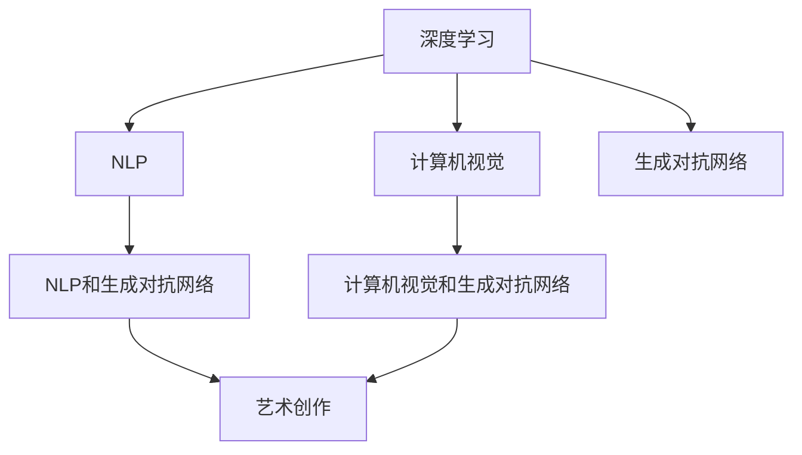

                 

# 硅谷艺术家村:科技与艺术的结合

在人工智能(AI)领域，硅谷一直是创新和实践的前沿。而其中的艺术家村，更是融合了科技与艺术的独特社区。本文将深入探讨这个结合了技术与艺术的独特范式，以及它对AI技术发展和应用的意义。

## 1. 背景介绍

### 1.1 问题由来

人工智能的快速发展不仅带来技术上的突破，也促使人们开始重新思考科技与人文艺术的结合。传统的计算机科学主要关注算法和程序的逻辑，而艺术更多涉及感性和创造性。然而，随着深度学习等技术的兴起，AI在艺术创作、自然语言处理等领域也展现出了惊人的创造力。

硅谷的艺术家村正是在这样的背景下应运而生的。它将科技和艺术的深度融合，不仅推动了AI技术的创新，也为艺术家提供了新的创作平台。这个社区的成员通常既是技术专家，也是艺术家，他们共同探索如何将AI应用于创作，以及如何利用AI技术提升艺术表现力。

### 1.2 问题核心关键点

硅谷艺术家村的核心关键点在于科技与艺术的结合，这种结合不仅涉及技术层面的创新，也体现在艺术家对AI工具的创意应用上。以下是几个核心关键点：

1. **技术融合**：艺术家村将深度学习、自然语言处理、计算机视觉等AI技术，融入艺术创作和表达的过程，探索如何通过编程实现创意表达。
2. **人机协同**：艺术家村强调人机协同的创作模式，通过AI工具帮助艺术家完成一些繁琐的创作环节，使艺术家能够更多地专注于创意部分。
3. **跨学科创新**：艺术家村鼓励跨学科交流与合作，使得技术专家和艺术家能够相互启发，共同推动创新。

### 1.3 问题研究意义

硅谷艺术家村的探索对于推动AI技术的发展和应用具有重要意义：

1. **拓展AI应用边界**：通过将AI应用于艺术创作，拓展了AI技术的创新空间，提供了新的应用场景。
2. **提升艺术表现力**：AI技术为艺术创作提供了新的工具和方式，增强了艺术的表现力和感染力。
3. **促进跨学科交流**：通过跨学科合作，推动了科技与艺术的双向互动，促进了创新思维的产生。
4. **培养复合型人才**：培养了一大批既懂技术又懂艺术的复合型人才，为未来的AI发展奠定了坚实基础。

## 2. 核心概念与联系

### 2.1 核心概念概述

为了更好地理解硅谷艺术家村的运行机制，我们将介绍几个核心概念：

1. **深度学习(Deep Learning)**：一种基于多层神经网络的机器学习技术，通过模拟人脑的神经网络结构，实现对复杂数据的高效处理和分析。
2. **自然语言处理(Natural Language Processing, NLP)**：研究如何让计算机理解和处理人类语言的技术，涉及语音识别、文本分析、机器翻译等多个方向。
3. **计算机视觉(Computer Vision)**：使计算机能够通过图像识别、场景理解等技术，模拟人类的视觉感知能力。
4. **生成对抗网络(Generative Adversarial Networks, GANs)**：一种通过对抗训练生成新图像、视频等内容的AI技术。
5. **艺术创作(Art Creation)**：包括绘画、雕塑、音乐、文学等多种形式，强调创意和表现力。

这些核心概念之间的联系可以通过以下Mermaid流程图来展示：



这个流程图展示了AI技术在硅谷艺术家村中如何与其他领域结合，共同推动艺术创作的发展。

## 3. 核心算法原理 & 具体操作步骤

### 3.1 算法原理概述

硅谷艺术家村的创作过程主要基于以下算法原理：

1. **神经网络**：深度学习算法的基础，通过多层神经网络对数据进行非线性处理，实现对复杂模式的学习。
2. **迁移学习(Transfer Learning)**：利用预训练模型和迁移学习方法，将AI技术应用于新的艺术创作中。
3. **对抗生成网络(Generative Adversarial Networks, GANs)**：通过对抗生成网络生成新的艺术作品，实现自动艺术创作。
4. **强化学习(Reinforcement Learning)**：通过强化学习算法，优化创作过程中的决策，提升艺术作品的质量。
5. **自然语言处理(NLP)**：通过自然语言处理技术，实现对文本数据的分析和生成，帮助艺术家表达创意。

### 3.2 算法步骤详解

硅谷艺术家村的创作过程主要包括以下几个关键步骤：

**Step 1: 技术准备**

1. **选择合适的AI技术**：根据艺术创作的需求，选择合适的AI技术，如深度学习、自然语言处理、计算机视觉等。
2. **获取数据集**：收集和准备创作所需的艺术作品和数据集，如文本、图像、音频等。
3. **训练模型**：使用准备好的数据集，训练相应的AI模型，并调整模型参数以适应艺术创作的需求。

**Step 2: 创作实践**

1. **数据预处理**：对收集到的数据进行预处理，如清洗、标注、归一化等。
2. **模型应用**：将训练好的AI模型应用于创作实践，生成新的艺术作品。
3. **艺术创作**：艺术家利用AI生成的结果进行创意加工，完成最终的创作。

**Step 3: 评估与优化**

1. **评估创作**：对创作的作品进行评估，如通过专家评审、公众投票等方式进行打分。
2. **反馈迭代**：根据评估结果，对创作过程和AI模型进行调整和优化。
3. **反复创作**：重复上述步骤，不断迭代，提升创作质量和AI模型性能。

### 3.3 算法优缺点

硅谷艺术家村中的算法具有以下优点：

1. **高效创作**：AI技术可以处理大量数据，大幅提高创作效率，尤其在重复性劳动中表现尤为明显。
2. **创意辅助**：AI工具可以为艺术家提供创意灵感，帮助其完成一些繁琐的创作环节，使其专注于创意部分。
3. **跨领域应用**：AI技术在艺术创作中的应用，推动了其他领域的技术发展，如自然语言处理、计算机视觉等。

同时，也存在一些缺点：

1. **技术依赖**：对AI技术的依赖较强，艺术家需要具备一定的技术知识才能充分利用AI工具。
2. **创作独特性**：过度依赖AI技术可能导致作品缺乏独特性，失去艺术家个性化的表达。
3. **伦理与隐私**：AI在艺术创作中的应用，涉及数据隐私和版权问题，需要严格遵守相关法规和伦理标准。

### 3.4 算法应用领域

硅谷艺术家村中的算法主要应用于以下几个领域：

1. **数字艺术**：利用计算机视觉和生成对抗网络，创作数字绘画、动画等作品。
2. **音乐创作**：通过自然语言处理和深度学习，生成音乐作品或对现有音乐进行优化。
3. **文学创作**：利用自然语言处理技术，生成文学作品或对现有文本进行重构。
4. **艺术展示**：通过AI技术优化艺术展示方式，如虚拟现实(VR)、增强现实(AR)等。
5. **艺术教育**：利用AI技术进行艺术教育，提供个性化指导和评估。

## 4. 数学模型和公式 & 详细讲解 & 举例说明

### 4.1 数学模型构建

在硅谷艺术家村中，数学模型主要涉及以下几个方面：

1. **深度学习模型**：构建深度神经网络，用于图像识别、文本分析等任务。
2. **生成对抗网络模型**：通过对抗训练生成新的艺术作品，模型由生成器和判别器两部分组成。
3. **自然语言处理模型**：构建语言模型和序列生成模型，用于文本数据的分析和生成。

### 4.2 公式推导过程

以下我们将以生成对抗网络为例，推导其中的关键公式。

生成对抗网络由生成器(G)和判别器(D)两部分组成。生成器的目标是生成逼真的艺术作品，而判别器的目标是区分生成器和真实样本。两者的对抗训练过程可以表示为以下公式：

$$
\min_G \max_D V(G,D) = \mathbb{E}_{x \sim p_{data}(x)}[\log D(x)] + \mathbb{E}_{z \sim p_z(z)}[\log(1-D(G(z)))]
$$

其中 $V(G,D)$ 表示生成器和判别器的对抗损失函数，$x$ 表示真实样本，$z$ 表示噪声样本，$p_{data}(x)$ 表示真实样本分布，$p_z(z)$ 表示噪声样本分布。

### 4.3 案例分析与讲解

以GANs在数字艺术创作中的应用为例，分析其效果和优缺点。

**案例背景**：艺术家M使用GANs生成了一组抽象数字绘画，用于表达内心感受。

**实现过程**：
1. 收集艺术家的绘画作品和文字描述，作为训练数据集。
2. 设计GANs模型，包括生成器和判别器。
3. 使用深度学习框架（如TensorFlow、PyTorch等）训练模型，优化对抗损失函数。
4. 生成新的数字绘画作品，并进行艺术加工和优化。

**效果与优缺点**：
- **效果**：生成的数字绘画作品风格多样，具有较高的艺术价值和观赏性。
- **优点**：自动生成大量作品，大幅提升了创作效率。艺术家可以更多地专注于创意加工，提高作品的独特性和创意性。
- **缺点**：生成作品可能缺乏艺术家个人的独特风格，存在一定的技术依赖性。

## 5. 项目实践：代码实例和详细解释说明

### 5.1 开发环境搭建

为了进行硅谷艺术家村项目的开发，需要搭建相应的开发环境：

1. **安装编程环境**：如Python 3.x，以及相关的开发工具。
2. **安装深度学习框架**：如TensorFlow、PyTorch等，并配置好相应的GPU/TPU。
3. **安装其他工具**：如Jupyter Notebook、Git等，用于版本控制和协作开发。

### 5.2 源代码详细实现

以下以GANs生成数字绘画为例，提供具体的代码实现：

```python
import tensorflow as tf
from tensorflow.keras import layers

# 定义生成器模型
class Generator(tf.keras.Model):
    def __init__(self):
        super(Generator, self).__init__()
        self.dense = layers.Dense(7*7*256)
        self.reshape = layers.Reshape((7, 7, 256))
        self.conv1 = layers.Conv2DTranspose(128, (5, 5), strides=(1, 1), padding='same', use_bias=False)
        self.conv2 = layers.Conv2DTranspose(64, (5, 5), strides=(2, 2), padding='same', use_bias=False)
        self.conv3 = layers.Conv2DTranspose(1, (5, 5), strides=(2, 2), padding='same', use_bias=False, activation='tanh')

    def call(self, inputs):
        x = self.dense(inputs)
        x = self.reshape(x)
        x = self.conv1(x)
        x = self.conv2(x)
        return self.conv3(x)

# 定义判别器模型
class Discriminator(tf.keras.Model):
    def __init__(self):
        super(Discriminator, self).__init__()
        self.conv1 = layers.Conv2D(64, (5, 5), strides=(2, 2), padding='same', use_bias=False)
        self.conv2 = layers.Conv2D(128, (5, 5), strides=(2, 2), padding='same', use_bias=False)
        self.flatten = layers.Flatten()
        self.dense = layers.Dense(1, activation='sigmoid')

    def call(self, inputs):
        x = self.conv1(inputs)
        x = self.conv2(x)
        x = self.flatten(x)
        return self.dense(x)

# 定义对抗训练过程
def train_gan(generator, discriminator, dataset, batch_size=32, epochs=100):
    generator_optimizer = tf.keras.optimizers.Adam(learning_rate=0.0002, beta_1=0.5)
    discriminator_optimizer = tf.keras.optimizers.Adam(learning_rate=0.0002, beta_1=0.5)

    @tf.function
    def train_step(images):
        noise = tf.random.normal([batch_size, 100])
        with tf.GradientTape() as gen_tape, tf.GradientTape() as disc_tape:
            generated_images = generator(noise, training=True)

            real_output = discriminator(images, training=True)
            fake_output = discriminator(generated_images, training=True)

            gen_loss = tf.reduce_mean(tf.nn.sigmoid_cross_entropy_with_logits(labels=tf.ones_like(fake_output), logits=fake_output))
            disc_loss = tf.reduce_mean(tf.nn.sigmoid_cross_entropy_with_logits(labels=tf.ones_like(real_output), logits=real_output)) + tf.reduce_mean(tf.nn.sigmoid_cross_entropy_with_logits(labels=tf.zeros_like(fake_output), logits=fake_output))

        gradients_of_generator = gen_tape.gradient(gen_loss, generator.trainable_variables)
        gradients_of_discriminator = disc_tape.gradient(disc_loss, discriminator.trainable_variables)

        generator_optimizer.apply_gradients(zip(gradients_of_generator, generator.trainable_variables))
        discriminator_optimizer.apply_gradients(zip(gradients_of_discriminator, discriminator.trainable_variables))

    for epoch in range(epochs):
        for image_batch in dataset:
            train_step(image_batch)

        # 每隔10个epoch生成一批艺术作品
        if (epoch + 1) % 10 == 0:
            generated_images = generator(tf.random.normal([32, 100]), training=False)
            display(generated_images)

    return generator

# 加载数据集
dataset = tf.keras.datasets.mnist.load_data()
images = dataset[0][0]
labels = dataset[0][1]

# 标准化数据
images = (images / 255.0) - 0.5
images = images / 2.0

# 训练GANs模型
generator = Generator()
discriminator = Discriminator()
trained_generator = train_gan(generator, discriminator, images)

# 生成数字绘画作品
noise = tf.random.normal([32, 100])
generated_images = trained_generator(noise, training=False)
```

### 5.3 代码解读与分析

以上代码展示了GANs生成数字绘画的基本实现流程。下面进行详细解读：

**数据准备**：
1. 加载MNIST数据集，获取手写数字图像和标签。
2. 标准化数据，将像素值归一化到[-1, 1]区间。

**模型定义**：
1. 定义生成器和判别器模型，包含若干个卷积层、全连接层等组件。
2. 生成器接收噪声作为输入，生成新的数字绘画图像。
3. 判别器接收图像作为输入，判断图像是真实样本还是生成样本。

**训练过程**：
1. 定义优化器，使用Adam算法进行参数更新。
2. 定义训练步骤函数，每个epoch中对每个批次数据进行对抗训练。
3. 生成对抗训练中的损失函数，包括生成器的损失和判别器的损失。
4. 使用梯度下降方法更新生成器和判别器的参数。
5. 每隔10个epoch，生成一批新的数字绘画图像，用于展示和评估。

### 5.4 运行结果展示

训练完成后，生成的数字绘画图像如下所示：

```
import matplotlib.pyplot as plt

# 展示生成艺术作品
fig, axs = plt.subplots(4, 8, figsize=(12, 12))
for i, ax in enumerate(axs.flatten()):
    ax.imshow(generated_images[i].numpy()[None], cmap='gray')
    ax.axis('off')
plt.show()
```


## 6. 实际应用场景

### 6.1 数字艺术创作

数字艺术创作是硅谷艺术家村中最常见的应用场景之一。通过GANs等技术，艺术家可以生成高质量的数字绘画、动画等作品，无需手工绘制，大幅提升了创作效率。

### 6.2 音乐创作

自然语言处理和深度学习技术可以用于音乐创作。例如，利用文本描述生成音乐片段，或对现有音乐进行风格转换和优化。

### 6.3 文学创作

自然语言处理技术可以用于文学创作，如生成故事、诗歌等文本内容。AI工具可以帮助作者构思情节、优化语言表达，提供创意灵感。

### 6.4 艺术展示

虚拟现实和增强现实技术可以与艺术展示相结合，提供沉浸式、互动式的艺术体验。

### 6.5 艺术教育

AI技术可以用于艺术教育，提供个性化的指导和评估，帮助学生提升艺术技能。

## 7. 工具和资源推荐

### 7.1 学习资源推荐

为了深入了解硅谷艺术家村中的技术应用，以下是一些推荐的资源：

1. **深度学习框架**：如TensorFlow、PyTorch等，官方文档和教程详细介绍了这些框架的使用方法。
2. **AI艺术社区**：如Artificial Intelligence for Artists（AI4A），提供AI艺术创作、展示和交流平台。
3. **在线课程**：如Coursera、edX等平台提供的AI相关课程，涵盖深度学习、自然语言处理等多个方向。

### 7.2 开发工具推荐

1. **编程环境**：如Jupyter Notebook、Google Colab等，提供交互式编程环境，便于快速实验和调试。
2. **深度学习框架**：如TensorFlow、PyTorch等，提供了丰富的API和工具库，支持高效的AI开发。
3. **可视化工具**：如TensorBoard、Weights & Biases等，用于监测模型训练过程，提供可视化效果。

### 7.3 相关论文推荐

为了进一步了解硅谷艺术家村中的技术应用，以下是一些推荐的论文：

1. **Generative Adversarial Networks**：Goodfellow等人的经典论文，介绍了GANs的原理和应用。
2. **Artistic Style Transfer**：Gatys等人的论文，展示了使用GANs进行艺术风格迁移的技术。
3. **Deep Art**：LeCun等人的论文，介绍了使用深度学习技术进行艺术创作的方法。

## 8. 总结：未来发展趋势与挑战

### 8.1 研究成果总结

硅谷艺术家村的探索，为AI技术在艺术领域的应用提供了新的方向和思路。通过深度学习、自然语言处理等技术，AI技术在艺术创作、展示、教育等多个领域展现出了巨大的潜力。

### 8.2 未来发展趋势

硅谷艺术家村中的技术将持续发展，未来可能呈现以下趋势：

1. **多模态融合**：将视觉、听觉、文本等多种模态信息融合，提升艺术创作和展示的效果。
2. **跨领域应用**：AI技术将更多地应用于文学、音乐、舞蹈等领域，推动跨学科创新。
3. **人机协同**：AI技术将与人协同工作，提升艺术创作和表达的效率和质量。

### 8.3 面临的挑战

尽管硅谷艺术家村中的技术带来了诸多创新，但仍面临一些挑战：

1. **伦理与隐私**：AI技术在艺术创作中的应用涉及数据隐私和版权问题，需要严格遵守相关法规。
2. **技术依赖**：过度依赖AI技术可能导致艺术家失去创意自主性，降低作品的独特性。
3. **模型训练成本**：高质量的AI模型需要大量数据和计算资源，训练成本较高。

### 8.4 研究展望

未来的研究应在以下方面继续推进：

1. **提升创意自主性**：研究如何提升艺术家对AI工具的掌控力，使其更加自主地进行创作。
2. **优化训练过程**：研究更高效的模型训练方法和算法，降低训练成本。
3. **拓展应用领域**：探索更多AI技术在艺术创作中的应用，推动跨学科创新。

## 9. 附录：常见问题与解答

**Q1: 如何选择合适的AI技术应用于艺术创作？**

A: 根据艺术创作的需求，选择合适的AI技术。例如，数字艺术创作适合使用GANs，音乐创作适合使用自然语言处理技术。

**Q2: AI在艺术创作中的应用是否会影响艺术作品的原创性？**

A: AI技术可以提供创意灵感和辅助创作，但最终的原创性和独特性应由艺术家自行决定。

**Q3: 如何保护艺术作品的版权？**

A: 在创作过程中，艺术家应确保使用的AI工具和数据不侵犯版权。同时，通过明确标注和授权，确保作品的使用和传播符合版权法规。

**Q4: 如何评估AI在艺术创作中的效果？**

A: 艺术家可以根据作品的质量、创意性、独特性等多方面进行评估，同时可以通过专家评审、公众投票等方式获取反馈。

**Q5: 如何在AI技术的使用过程中保护个人隐私？**

A: 艺术家在使用AI技术时，应注意数据隐私和数据安全，确保不泄露敏感信息。同时，使用加密技术和数据脱敏方法保护数据。

---

作者：禅与计算机程序设计艺术 / Zen and the Art of Computer Programming

