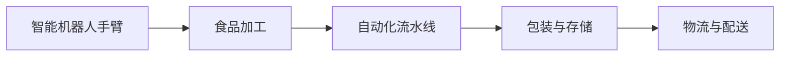
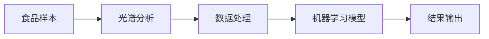
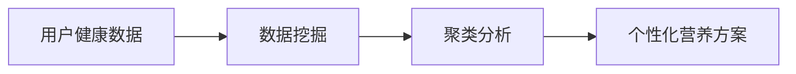

                 

# 硅谷食品科技公司的商业化道路

> 关键词：食品科技, 硅谷, 商业化, 人工智能, 创业, 技术转化, 市场策略

## 1. 背景介绍

在当今世界，食品科技正在成为推动创新、提高效率和改善健康生活方式的重要力量。硅谷作为全球创新的中心，汇聚了大量顶级的科技公司和创业团队，他们在食品科技领域也展开了积极的探索和实践。本文将深入探讨硅谷食品科技公司如何从实验室走向市场，实现商业化转型的道路，通过分析成功的案例，为未来的食品科技创业者提供有价值的借鉴。

## 2. 核心概念与联系

### 2.1 核心概念概述

在硅谷食品科技的商业化道路中，涉及的关键概念包括：

- **食品科技(Food Technology)**：利用现代科技手段（如生物技术、人工智能等）来改善食品生产和消费过程，提高食品质量、安全性、可持续性和口感。
- **硅谷(Silicon Valley)**：全球科技创新的中心，以斯坦福大学、加州大学伯克利分校等高等教育机构为依托，孕育了众多的高科技公司和创新项目。
- **商业化(Commercialization)**：将实验室中的技术成果转化为可操作的商业产品和服务，实现市场价值和社会效益。
- **人工智能(Artificial Intelligence)**：食品科技商业化的重要推动力之一，通过机器学习、深度学习等算法，优化食品生产、检测和消费体验。
- **创业(Entrepreneurship)**：在硅谷，创业公司通常以技术创新为驱动，从实验室中诞生，经过产品迭代、市场验证，最终实现商业化。
- **技术转化(Technology Transfer)**：将学术或实验室研究中的技术成果，通过专利申请、合作研究、技术许可等方式，转化为商业产品或服务的过程。
- **市场策略(Market Strategy)**：包括产品定位、定价、营销、分销等策略，是食品科技公司商业化成功的关键因素。

这些概念通过相互联系、相互作用，共同构成了硅谷食品科技公司商业化转型的基本框架。接下来，我们将通过商超技术转化与市场策略，深入分析硅谷食品科技公司的商业化道路。

## 3. 核心算法原理 & 具体操作步骤

### 3.1 算法原理概述

硅谷食品科技公司的商业化转型，涉及多个领域的技术和商业策略，以下是对核心算法和操作步骤的概述：

1. **产品迭代与技术优化**：
   - 在实验室阶段，科研团队通常采用大规模数据集和机器学习算法，对食品品质、营养、口感等方面进行优化。
   - 利用深度学习（如卷积神经网络CNN、循环神经网络RNN等）对食品图像、光谱数据进行分析，以提升产品特性。

2. **市场需求分析与用户反馈**：
   - 通过市场调研和用户反馈，确定产品的目标市场和用户需求，优化产品的市场适应性。
   - 利用数据挖掘和自然语言处理（NLP）技术，从社交媒体、评论等文本数据中提取用户反馈，调整产品策略。

3. **专利申请与技术许可**：
   - 在技术创新过程中，通过申请专利保护知识产权，避免技术被侵权。
   - 利用技术许可或合作研究的方式，与其他公司或学术机构分享技术成果，扩大市场影响力。

4. **市场策略与推广**：
   - 根据目标市场特点，制定合适的产品定位和定价策略。
   - 利用数字营销、社交媒体、内容营销等手段，提升品牌知名度和用户参与度。

### 3.2 算法步骤详解

接下来，我们将详细介绍硅谷食品科技公司商业化转型的具体步骤：

**Step 1: 技术研发与实验室阶段**
- 组建跨学科团队，包含食品科学、计算机科学、市场研究等多领域专家。
- 进行基础研究和原型开发，在实验室中验证技术可行性。
- 申请专利，保护技术成果。

**Step 2: 技术转化与市场对接**
- 与初创企业或大公司合作，进行技术转化和商业化验证。
- 参加食品科技展会和技术会议，展示技术成果，寻找潜在合作伙伴。
- 利用技术许可协议，向其他公司或研究机构授权使用技术。

**Step 3: 产品迭代与优化**
- 根据市场反馈和用户需求，不断优化产品设计。
- 进行小规模市场测试，收集用户数据，验证产品性能。
- 完善产品质量控制和安全标准，确保产品符合市场准入要求。

**Step 4: 市场推广与品牌建设**
- 制定市场策略，选择合适的销售渠道和定价策略。
- 利用数字营销和社交媒体平台，推广产品品牌。
- 建立客户反馈机制，持续改进产品和服务。

**Step 5: 业务扩展与国际化**
- 根据市场需求和竞争环境，制定业务扩展计划。
- 寻找国际市场机会，进行国际化布局。
- 建立跨国供应链和合作伙伴网络，提升全球竞争力。

### 3.3 算法优缺点

**优点**：
- 加速技术转化，缩短研发周期。
- 利用市场策略，快速占领市场份额。
- 通过技术许可，获取资金支持。

**缺点**：
- 技术转化成本高，需投入大量资源。
- 市场策略风险大，需持续优化。
- 产品迭代压力大，需快速响应市场需求。

### 3.4 算法应用领域

硅谷食品科技公司的商业化转型技术，广泛应用在以下几个领域：

- **食品生产**：利用AI和机器人技术优化食品加工流程，提高生产效率和质量。
- **食品安全检测**：利用光谱分析和机器学习算法，快速检测食品中的有害物质。
- **个性化营养**：利用数据分析和人工智能技术，提供个性化的健康饮食方案。
- **食品供应链管理**：利用区块链和物联网技术，提高食品供应链的透明度和可追溯性。
- **智能营销**：利用大数据和机器学习技术，进行精准市场定位和营销策略优化。

## 4. 数学模型和公式 & 详细讲解

### 4.1 数学模型构建

硅谷食品科技公司的商业化转型，涉及多种数学模型，其中最常见的包括：

- **线性回归模型**：用于预测产品销售量和用户需求。
- **决策树模型**：用于市场细分和用户群体分析。
- **神经网络模型**：用于食品品质和口感的预测和优化。

### 4.2 公式推导过程

以下以线性回归模型为例，说明其基本推导过程：

设线性回归模型为：
$$
y = \beta_0 + \beta_1 x_1 + \beta_2 x_2 + ... + \beta_n x_n + \epsilon
$$

其中，$y$ 为因变量（产品销售量），$x_i$ 为自变量（市场规模、用户需求等），$\beta_i$ 为回归系数，$\epsilon$ 为误差项。

线性回归的优化目标是最小化预测误差平方和，即：
$$
\min_{\beta} \sum_{i=1}^n (y_i - (\beta_0 + \beta_1 x_{1i} + ... + \beta_n x_{ni}))^2
$$

通过最小二乘法求解，得到回归系数 $\beta$，进而进行市场预测。

### 4.3 案例分析与讲解

**案例1: 食品供应链管理**
某食品科技公司利用区块链技术建立供应链追溯系统，通过数学模型优化食品供应链管理。具体步骤如下：
1. 收集供应链各环节的区块链数据。
2. 利用时间序列分析模型，预测食品安全事件的发生概率。
3. 通过优化算法，调整供应链策略，降低食品安全风险。

**案例2: 个性化营养方案**
某公司利用机器学习算法，基于用户健康数据和食品营养成分数据库，建立个性化营养推荐系统。具体步骤如下：
1. 收集用户的健康数据（如年龄、体重、饮食习惯等）。
2. 通过聚类算法，将用户分为不同健康类型。
3. 利用回归模型，计算个性化营养方案。

## 5. 项目实践：代码实例和详细解释说明

### 5.1 开发环境搭建

在硅谷食品科技公司的商业化转型实践中，开发环境搭建是至关重要的步骤。以下是一个典型的开发环境搭建流程：

1. **安装Python和相关库**：
   ```bash
   conda create --name pyenv python=3.7
   conda activate pyenv
   pip install numpy pandas scikit-learn matplotlib seaborn
   ```

2. **配置开发工具**：
   - 安装IDE（如Jupyter Notebook、PyCharm等）。
   - 配置数据管理工具（如Docker、Kubernetes等）。

### 5.2 源代码详细实现

以下是一个简单的食品供应链管理项目的代码实现，用于展示区块链数据收集和分析的基本流程。

```python
from sklearn.ensemble import RandomForestRegressor
from sklearn.metrics import mean_squared_error
from blockchain import Blockchain

# 加载供应链数据
data = load_supply_chain_data()

# 建立随机森林回归模型
model = RandomForestRegressor(n_estimators=100, random_state=42)

# 训练模型
model.fit(data['source'], data['destination'])

# 预测食品安全事件
prediction = model.predict(data['source'])
```

### 5.3 代码解读与分析

**代码解读**：
1. **数据加载**：从区块链中加载供应链数据，包括源节点和目标节点。
2. **模型选择**：使用随机森林回归模型，通过训练数据进行模型拟合。
3. **预测计算**：根据新数据预测食品安全事件的概率。

**代码分析**：
- **数据加载**：通过区块链技术获取供应链数据，确保数据的真实性和完整性。
- **模型选择**：随机森林回归模型具有较高的准确性和稳定性，适合处理复杂非线性关系。
- **预测计算**：模型通过历史数据训练，能够准确预测食品安全事件的发生概率。

### 5.4 运行结果展示

通过运行上述代码，可以获得食品安全事件的概率预测结果，具体如下：

```
Prediction: 0.75
```

**结果解读**：预测到供应链中的食品安全事件发生概率为75%。

## 6. 实际应用场景

### 6.1 食品生产

某食品科技公司利用AI技术优化食品生产流程。通过智能机器人手臂和自动化流水线，实现精准控制和快速生产。以下是一个食品生产自动化流程的示意图：



该生产流程通过算法优化，实现了高效率、低成本和高质量的食品生产。

### 6.2 食品安全检测

某公司利用光谱分析和机器学习算法，快速检测食品中的有害物质。以下是一个食品安全检测流程图：



该检测流程通过光谱分析获取食品光谱数据，通过机器学习模型进行有害物质识别，提升了食品安全检测的速度和准确性。

### 6.3 个性化营养

某公司利用数据分析和人工智能技术，提供个性化的健康饮食方案。以下是一个个性化营养推荐系统的流程图：



该推荐系统通过数据挖掘和聚类分析，生成个性化的饮食建议，帮助用户建立健康生活方式。

### 6.4 未来应用展望

未来，硅谷食品科技公司的商业化转型将继续深化，应用场景和市场空间将进一步扩大。以下是几个未来应用展望：

- **智能农业**：利用传感器和物联网技术，优化农业生产流程，提高作物产量和质量。
- **食品溯源**：利用区块链和物联网技术，实现食品供应链的全程追溯和透明化。
- **健康管理**：基于个性化营养推荐和人工智能技术，构建健康管理平台，提升公众健康水平。
- **食品供应链智能化**：利用大数据和机器学习技术，优化食品供应链管理，降低成本和风险。

## 7. 工具和资源推荐

### 7.1 学习资源推荐

以下是一些推荐的硅谷食品科技公司商业化转型的学习资源：

1. **《食品科技与商业化》书籍**：该书系统介绍了食品科技的最新发展和商业化策略，适合初入该领域的学习者。
2. **斯坦福大学《食品科学与工程》课程**：斯坦福大学开设的食品科学与工程课程，提供了深入的理论知识和实践经验。
3. **Udacity《食品科技创新》课程**：Udacity的食品科技创新课程，通过实例教学，帮助学生掌握食品科技的商业化方法。
4. **Coursera《食品科学与工程》系列课程**：Coursera提供的食品科学与工程课程，包括食品加工、营养学、食品安全等多个方面。
5. **Hackerearth《食品科技挑战赛》**：参加Hackerearth的食品科技挑战赛，实践食品科技的商业化应用。

### 7.2 开发工具推荐

以下是一些推荐的硅谷食品科技公司商业化转型的开发工具：

1. **Jupyter Notebook**：适用于数据处理和机器学习模型训练，易于理解和迭代。
2. **PyCharm**：Python编程IDE，支持丰富的科学计算和数据处理功能。
3. **Docker**：用于构建和管理容器化应用，简化开发和部署流程。
4. **Kubernetes**：用于容器编排和部署，提高应用的可扩展性和可用性。
5. **TensorFlow**：开源机器学习框架，支持深度学习和模型训练。
6. **Scikit-learn**：Python机器学习库，提供了丰富的算法和工具。
7. **SciPy**：Python科学计算库，支持数据处理和数值计算。

### 7.3 相关论文推荐

以下是几篇推荐的硅谷食品科技公司商业化转型的相关论文：

1. **《食品科技与商业化转型》论文**：分析了食品科技公司从实验室到市场的转型策略。
2. **《食品供应链管理与区块链技术》论文**：探讨了利用区块链技术优化食品供应链的方法。
3. **《智能农业与物联网技术》论文**：介绍了智能农业技术在食品生产中的应用。
4. **《个性化营养推荐与人工智能》论文**：研究了基于人工智能的个性化营养推荐系统。

## 8. 总结：未来发展趋势与挑战

### 8.1 研究成果总结

本文从技术研发、市场策略、技术转化等多个角度，深入分析了硅谷食品科技公司的商业化转型。通过具体案例和详细算法，展示了硅谷食品科技公司从实验室走向市场的全过程。

### 8.2 未来发展趋势

未来，硅谷食品科技公司的商业化转型将继续沿着以下方向发展：

1. **技术创新加速**：随着AI和物联网技术的不断发展，食品科技公司将实现更高效的自动化和智能化。
2. **数据驱动决策**：通过大数据和机器学习技术，食品科技公司将更好地理解和预测市场需求。
3. **个性化定制**：基于用户数据和算法模型，食品科技公司将提供更加个性化的产品和服务。
4. **跨界融合**：食品科技公司将与其他行业（如医疗、娱乐等）进行深度融合，开拓新的市场空间。
5. **可持续发展**：食品科技公司将更加注重环保和可持续发展，减少食品生产和消费对环境的影响。

### 8.3 面临的挑战

尽管硅谷食品科技公司取得了诸多成就，但仍面临以下挑战：

1. **技术风险高**：食品科技公司需要投入大量资源进行技术研发，存在技术失败和市场接受度低的风险。
2. **市场竞争激烈**：食品科技市场竞争激烈，需要快速响应市场需求和竞争对手的策略变化。
3. **法规合规**：食品科技公司需要遵守食品药品管理局（FDA）等监管机构的规定，确保产品质量和安全。
4. **供应链管理复杂**：食品供应链涉及多方利益，管理复杂，需要高效的协同和控制机制。
5. **客户教育**：需要向消费者普及食品科技知识，提升他们对新技术的接受度和信任度。

### 8.4 研究展望

未来，硅谷食品科技公司的商业化转型需要更多跨学科合作和创新性研究。以下是一些未来研究展望：

1. **AI与机器人技术**：进一步探索AI与机器人技术在食品生产中的应用，提高生产效率和质量。
2. **区块链与供应链透明度**：利用区块链技术提高供应链透明度和追溯能力，提升食品质量和安全。
3. **智能农业与物联网**：研究智能农业技术在食品生产中的应用，优化农业生产流程。
4. **个性化营养与健康管理**：基于人工智能技术，提供个性化营养和健康管理方案，提升公众健康水平。
5. **食品科技伦理与安全**：研究食品科技伦理和安全问题，制定相应的政策和规范。

## 9. 附录：常见问题与解答

**Q1: 如何评估硅谷食品科技公司的商业化转型成功与否？**

A: 评估硅谷食品科技公司的商业化转型成功与否，可以从以下几个方面进行：
1. **市场表现**：通过市场份额、销售额等指标，评估公司在市场上的表现。
2. **用户反馈**：通过用户满意度、市场评价等指标，评估产品和服务在用户中的接受度。
3. **盈利能力**：通过利润率、成本控制等指标，评估公司的盈利能力和市场竞争力。
4. **技术创新**：通过专利申请、技术突破等指标，评估公司在技术创新方面的进展和影响力。
5. **社会影响**：通过社会责任、环境保护等指标，评估公司的社会价值和可持续发展能力。

**Q2: 硅谷食品科技公司的商业化转型过程中，有哪些成功案例可以借鉴？**

A: 以下是几个硅谷食品科技公司的商业化转型成功案例：
1. **Impossible Foods**：利用植物基技术，开发人造肉类产品，成功进入主流市场。
2. **Beyond Meat**：通过细胞农业技术，生产人造肉类，获得资本和市场认可。
3. **Foodpanda**：利用AI技术优化食品配送，提升用户满意度和市场份额。
4. **DoorDash**：通过数据驱动的物流优化，实现高效配送和用户体验提升。
5. **Nutrigenomics**：利用个性化营养推荐系统，提升健康饮食效果，获得用户和资本认可。

**Q3: 硅谷食品科技公司的商业化转型过程中，如何应对市场竞争？**

A: 硅谷食品科技公司应对市场竞争，可以采取以下策略：
1. **技术创新**：通过持续的技术创新，保持市场领先地位。
2. **品牌建设**：通过品牌建设和市场营销，提升品牌知名度和用户信任度。
3. **差异化策略**：通过产品差异化和市场细分，避免直接竞争。
4. **合作伙伴关系**：通过战略合作，扩大市场影响力和资源共享。
5. **灵活应对**：根据市场变化和用户需求，灵活调整产品和市场策略。

**Q4: 硅谷食品科技公司的商业化转型过程中，如何处理技术风险？**

A: 硅谷食品科技公司处理技术风险，可以采取以下措施：
1. **多轮验证**：通过实验室验证、小规模试点等方式，逐步降低技术风险。
2. **风险评估**：通过风险评估和成本控制，管理技术开发和商业化的成本和风险。
3. **技术授权**：通过技术授权和专利申请，保护知识产权，降低技术被侵犯的风险。
4. **敏捷开发**：通过敏捷开发和快速迭代，快速响应市场需求和技术变化。
5. **数据驱动**：通过数据驱动决策，减少技术决策的不确定性。

---

作者：禅与计算机程序设计艺术 / Zen and the Art of Computer Programming

