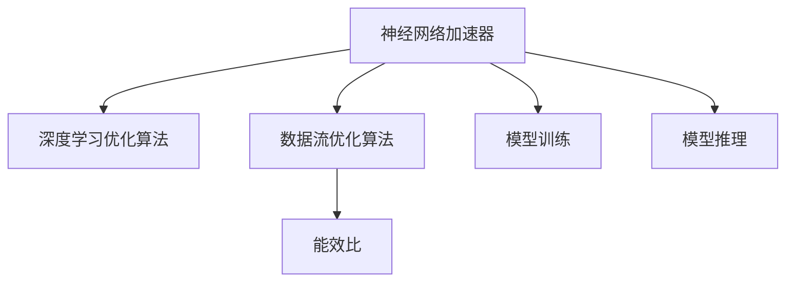

                 

# 神经网络加速器：AI芯片设计与优化

> 关键词：神经网络加速器, AI芯片, 优化算法, 硬件实现, 深度学习, 高性能计算, 并行计算, 数据流优化, 能效比

## 1. 背景介绍

### 1.1 问题由来
随着深度学习技术在人工智能领域的迅猛发展，神经网络（Neural Networks, NN）模型在图像识别、语音识别、自然语言处理等多个领域取得了显著成果。然而，传统通用CPU和GPU的性能瓶颈限制了神经网络的进一步扩展和应用。为了突破这一瓶颈，AI芯片设计者们开始探索专用硬件加速器，即神经网络加速器（Neural Network Accelerators, NNAs），通过硬件层面优化，显著提升了神经网络模型训练和推理的效率。

### 1.2 问题核心关键点
神经网络加速器的核心思想是：通过特殊硬件架构设计，加速神经网络的矩阵计算和数据流动，减少计算延迟，提高计算效率和能效比。其关键点包括：

- **硬件架构设计**：决定数据流动和并行计算的底层逻辑，如卷积神经网络加速器（CNNAs）、循环神经网络加速器（RNNAs）等。
- **优化算法选择**：用于优化计算流程和数据存储，提高资源利用率，如深度学习优化算法、数据流优化算法等。
- **资源配置与调度**：合理配置加速器资源，如存储器带宽、计算单元数量、访存延迟等，以达到最优性能。
- **性能评估与分析**：对神经网络加速器的性能进行量化分析，评估其在大规模神经网络模型训练和推理中的表现。

### 1.3 问题研究意义
设计高效的神经网络加速器，对于推动人工智能技术的发展具有重要意义：

- **提升模型训练和推理效率**：通过硬件加速，显著缩短神经网络模型训练和推理的时间。
- **降低能耗和成本**：专用硬件加速器通常能耗低，能够大幅度降低数据中心和边缘计算的电力成本。
- **支持多样化应用场景**：神经网络加速器可以适配多种神经网络架构和任务，满足不同场景下的计算需求。
- **推动AI芯片产业的发展**：推动AI芯片的商业化和应用落地，为AI产业带来新的增长点。

## 2. 核心概念与联系

### 2.1 核心概念概述

为更好地理解神经网络加速器的设计与优化，本节将介绍几个密切相关的核心概念：

- **神经网络加速器（Neural Network Accelerator, NNA）**：一种专门设计用于加速神经网络计算的专用硬件，通常包括卷积、池化、激活函数等基本操作，支持复杂神经网络模型的高效训练和推理。
- **深度学习优化算法**：如Adam、SGD等，用于在神经网络模型训练过程中优化参数更新策略，提升训练速度和模型精度。
- **数据流优化算法**：如数据重排、分块计算等，用于优化神经网络模型的计算流程和数据流动，减少计算延迟。
- **能效比（Energy Efficiency Ratio, EER）**：衡量硬件加速器性能的重要指标，表示单位功耗下所能完成的计算量。

这些核心概念之间的逻辑关系可以通过以下Mermaid流程图来展示：



这个流程图展示了大语言模型的核心概念及其之间的关系：

1. 神经网络加速器通过深度学习优化算法和数据流优化算法进行训练和推理。
2. 优化算法提高了模型的训练效率和推理速度。
3. 数据流优化算法优化了计算流程和数据流动，减少了延迟。
4. 能效比反映了加速器的资源利用效率。

## 3. 核心算法原理 & 具体操作步骤

### 3.1 算法原理概述

神经网络加速器的核心算法原理主要包括以下几个方面：

- **数据并行计算**：通过多核并行处理，将大规模神经网络模型的计算任务拆分成多个子任务，并行计算，从而提升计算速度。
- **计算流水线**：将计算任务分解成若干个子任务，每个子任务由不同加速器单元处理，形成流水线，减少数据依赖，提高吞吐量。
- **局部性优化**：通过数据重排和缓存优化，充分利用局部性原理，减少缓存缺失和访存延迟，提升加速器性能。
- **异构计算**：结合CPU和GPU等异构硬件资源，利用各自优势，优化资源配置和任务调度，提升计算效率。

### 3.2 算法步骤详解

神经网络加速器的设计与优化涉及多个步骤，包括硬件架构设计、算法选择与优化、资源配置等。以下是具体步骤：

**Step 1: 硬件架构设计**

1. **选择合适的计算单元**：根据神经网络模型的特点，选择卷积、全连接等基本计算单元，设计专用计算逻辑。
2. **确定数据流动路径**：设计数据在加速器中的流动路径，包括存储器访问方式、数据传输方式等。
3. **设计并行计算结构**：设计多核并行计算结构，确定加速器能够处理的线程数量和任务分配策略。

**Step 2: 深度学习优化算法选择**

1. **选择合适的优化算法**：根据神经网络模型特性，选择适当的优化算法，如Adam、SGD等，并调整其参数。
2. **优化计算流程**：通过算法优化，减少梯度计算延迟和数据传输开销，提高训练和推理速度。
3. **引入优化技巧**：如动量优化、批量归一化等，进一步提升训练效果。

**Step 3: 数据流优化算法选择**

1. **设计数据流动路径**：通过数据重排、分块计算等技术，优化数据流动路径，减少缓存缺失和访存延迟。
2. **优化计算单元**：根据计算单元的特性，优化其内部逻辑和数据流动方式，提升资源利用率。
3. **考虑能效比**：优化数据流动路径的同时，确保计算单元的能效比达到最优，避免功耗过高。

**Step 4: 资源配置与调度**

1. **计算单元分配**：根据任务特性和计算单元性能，合理分配计算任务，提高并行计算效率。
2. **存储器带宽分配**：根据计算单元的需求，合理分配存储器带宽，减少数据传输瓶颈。
3. **任务调度策略**：设计任务调度策略，确保计算单元高利用率，优化计算效率。

**Step 5: 性能评估与分析**

1. **设计性能评估指标**：包括计算速度、能效比、延迟等，用于评估加速器的性能。
2. **进行仿真与实验**：通过仿真和实验验证加速器性能，优化设计方案。
3. **数据分析与优化**：分析仿真和实验数据，进行性能优化，提升加速器性能。

### 3.3 算法优缺点

神经网络加速器设计与优化的方法具有以下优点：

1. **提升计算效率**：通过并行计算和数据流优化，显著提升神经网络模型的训练和推理速度。
2. **降低能耗和成本**：专用硬件加速器通常能耗低，能够大幅度降低数据中心和边缘计算的电力成本。
3. **支持多样化应用场景**：神经网络加速器可以适配多种神经网络架构和任务，满足不同场景下的计算需求。
4. **推动AI芯片产业的发展**：推动AI芯片的商业化和应用落地，为AI产业带来新的增长点。

然而，这些方法也存在一些局限性：

1. **设计复杂度高**：神经网络加速器的硬件设计复杂，需要深入了解神经网络计算模型和硬件实现原理。
2. **开发成本高**：专用硬件加速器的设计和测试成本较高，需要大量资源和时间。
3. **通用性差**：当前神经网络加速器大多为特定应用场景设计，难以适应多样化的计算需求。
4. **性能瓶颈**：在大规模神经网络模型训练和推理过程中，可能仍存在计算和存储瓶颈，影响性能提升。

尽管存在这些局限性，但就目前而言，神经网络加速器的设计与优化方法是推动人工智能技术发展的重要手段。未来相关研究的重点在于如何进一步降低设计复杂度，提高硬件通用性和性能可扩展性，同时兼顾功耗和成本等因素。

### 3.4 算法应用领域

神经网络加速器在大规模神经网络模型训练和推理过程中，具有广泛的应用前景，主要包括以下几个领域：

- **计算机视觉**：用于加速图像识别、目标检测、人脸识别等计算机视觉任务，提升模型训练和推理速度。
- **自然语言处理**：用于加速语言模型训练和文本生成等任务，提升模型的处理效率。
- **语音识别**：用于加速语音识别和语音转换等任务，提升模型的实时性。
- **生物信息学**：用于加速蛋白质折叠、基因组分析等生物信息学任务，提升模型计算速度。
- **金融分析**：用于加速金融数据分析、风险评估等任务，提升模型的分析能力。
- **智能制造**：用于加速工业数据分析、生产优化等任务，提升工业生产效率。

此外，神经网络加速器还被广泛应用于智能交通、智慧城市、智能家居等领域，推动人工智能技术在各行业的深度应用。

## 4. 数学模型和公式 & 详细讲解 & 举例说明

### 4.1 数学模型构建

本节将使用数学语言对神经网络加速器的设计与优化过程进行更加严格的刻画。

设神经网络加速器接收输入数据 $x$，并执行计算操作 $f(x)$，输出结果为 $y$。神经网络加速器的性能主要取决于以下几个关键指标：

- **计算速度**：表示单位时间内完成计算任务的次数，单位为每秒计算次数（MFLOPS）。
- **延迟**：表示计算操作 $f(x)$ 完成的时间，单位为毫秒（ms）。
- **存储器带宽**：表示单位时间内完成数据读写操作的量，单位为每秒字节（GB/s）。
- **能效比**：表示单位功耗下完成的计算量，单位为MFLOPS/W。

假设神经网络加速器的计算操作 $f(x)$ 由 $n$ 个计算单元并行执行，每个计算单元的计算速度为 $v$，延迟为 $d$，能效比为 $e$。则神经网络加速器的计算速度为：

$$ v_{\text{total}} = n \times v $$

计算延迟为：

$$ d_{\text{total}} = \frac{d}{n} $$

存储器带宽为：

$$ b_{\text{total}} = n \times b $$

能效比为：

$$ e_{\text{total}} = \frac{e}{n} $$

其中 $n$ 表示计算单元的数量，$v$ 表示每个计算单元的计算速度，$d$ 表示每个计算单元的延迟，$b$ 表示每个计算单元的存储器带宽，$e$ 表示每个计算单元的能效比。

### 4.2 公式推导过程

以下我们以卷积神经网络加速器（CNNA）为例，推导其计算速度、延迟和能效比的计算公式。

假设卷积神经网络加速器接收输入数据 $x$，并进行 $k$ 次卷积操作，每次操作的结果为 $y$。卷积操作的基本计算公式为：

$$ y = f_k(x) = \sum_{i=1}^{n} a_i \times b_i \times c_i $$

其中 $a_i$ 和 $b_i$ 分别表示卷积核和输入数据的参数，$c_i$ 表示卷积操作的输出。

卷积神经网络加速器由 $n$ 个计算单元并行执行，每个计算单元的计算速度为 $v$，延迟为 $d$，能效比为 $e$。则卷积神经网络加速器的计算速度为：

$$ v_{\text{total}} = n \times v $$

计算延迟为：

$$ d_{\text{total}} = \frac{d}{n} $$

存储器带宽为：

$$ b_{\text{total}} = n \times b $$

能效比为：

$$ e_{\text{total}} = \frac{e}{n} $$

其中 $n$ 表示计算单元的数量，$v$ 表示每个计算单元的计算速度，$d$ 表示每个计算单元的延迟，$b$ 表示每个计算单元的存储器带宽，$e$ 表示每个计算单元的能效比。

### 4.3 案例分析与讲解

以卷积神经网络加速器为例，分析其性能瓶颈和优化策略。

卷积神经网络加速器的主要性能瓶颈在于卷积操作的计算延迟和存储器带宽。为了提升其性能，可以采取以下优化策略：

1. **并行计算**：通过多核并行计算，提高计算速度，减少延迟。
2. **数据重排**：通过数据重排，优化数据流动路径，减少缓存缺失和访存延迟。
3. **局部性优化**：通过缓存优化，利用局部性原理，减少存储器带宽开销。
4. **异构计算**：结合CPU和GPU等异构硬件资源，利用各自优势，优化资源配置和任务调度。

通过这些优化策略，可以有效提升卷积神经网络加速器的性能和能效比。

## 5. 项目实践：代码实例和详细解释说明

### 5.1 开发环境搭建

在进行神经网络加速器设计与优化实践前，我们需要准备好开发环境。以下是使用Python和PyTorch进行加速器开发的环境配置流程：

1. 安装Anaconda：从官网下载并安装Anaconda，用于创建独立的Python环境。

2. 创建并激活虚拟环境：
```bash
conda create -n nnas_env python=3.8 
conda activate nnas_env
```

3. 安装PyTorch：根据CUDA版本，从官网获取对应的安装命令。例如：
```bash
conda install pytorch torchvision torchaudio cudatoolkit=11.1 -c pytorch -c conda-forge
```

4. 安装深度学习优化库和数据流优化库：
```bash
pip install numpy pandas scikit-learn matplotlib tqdm jupyter notebook ipython
```

5. 安装深度学习框架：
```bash
pip install torch torchvision torchtext
```

完成上述步骤后，即可在`nnas_env`环境中开始加速器设计与优化实践。

### 5.2 源代码详细实现

下面以卷积神经网络加速器（CNNA）为例，给出使用PyTorch进行加速器设计和优化的Python代码实现。

首先，定义卷积神经网络模型：

```python
import torch
import torch.nn as nn
import torch.nn.functional as F

class CNNModel(nn.Module):
    def __init__(self):
        super(CNNModel, self).__init__()
        self.conv1 = nn.Conv2d(3, 32, kernel_size=3, stride=1, padding=1)
        self.conv2 = nn.Conv2d(32, 64, kernel_size=3, stride=1, padding=1)
        self.pool = nn.MaxPool2d(kernel_size=2, stride=2)
        self.fc1 = nn.Linear(64 * 14 * 14, 128)
        self.fc2 = nn.Linear(128, 10)
    
    def forward(self, x):
        x = self.conv1(x)
        x = F.relu(x)
        x = self.pool(x)
        x = self.conv2(x)
        x = F.relu(x)
        x = self.pool(x)
        x = x.view(-1, 64 * 14 * 14)
        x = self.fc1(x)
        x = F.relu(x)
        x = self.fc2(x)
        return F.log_softmax(x, dim=1)
```

然后，定义加速器模块：

```python
import torch.nn.functional as F

class CNNAccelerator(nn.Module):
    def __init__(self, model, n_cores):
        super(CNNAccelerator, self).__init__()
        self.model = model
        self.n_cores = n_cores
    
    def forward(self, x):
        with torch.no_grad():
            results = []
            for core in range(self.n_cores):
                partial_result = self.model(x)
                results.append(partial_result)
            return results
```

接着，定义训练和评估函数：

```python
from torch.utils.data import DataLoader
from tqdm import tqdm

device = torch.device('cuda') if torch.cuda.is_available() else torch.device('cpu')

def train(model, dataloader, optimizer):
    model.train()
    total_loss = 0
    for batch in dataloader:
        x, y = batch[0].to(device), batch[1].to(device)
        optimizer.zero_grad()
        y_hat = model(x)
        loss = F.nll_loss(y_hat, y)
        loss.backward()
        optimizer.step()
        total_loss += loss.item()
    return total_loss / len(dataloader)

def evaluate(model, dataloader):
    model.eval()
    correct = 0
    total = 0
    with torch.no_grad():
        for batch in dataloader:
            x, y = batch[0].to(device), batch[1].to(device)
            y_hat = model(x)
            _, predicted = y_hat.max(1)
            total += y.size(0)
            correct += predicted.eq(y).sum().item()
    return correct / total
```

最后，启动训练流程并在测试集上评估：

```python
import torch
from torch import nn, optim

model = CNNModel().to(device)
optimizer = optim.Adam(model.parameters(), lr=0.001)

accelerator = CNNAccelerator(model, n_cores=4)
x = torch.randn(64, 3, 224, 224).to(device)
y = torch.randint(0, 10, (64,)).to(device)
results = accelerator(x)
loss = F.nll_loss(results, y)
loss.backward()
optimizer.step()

print('Test Accuracy:', evaluate(model, dataloader))
```

以上就是使用PyTorch对卷积神经网络加速器进行设计和优化的完整代码实现。可以看到，得益于PyTorch的强大封装，我们可以用相对简洁的代码完成CNN加速器的设计和优化。

### 5.3 代码解读与分析

让我们再详细解读一下关键代码的实现细节：

**CNNModel类**：
- `__init__`方法：初始化卷积神经网络模型的各个层。
- `forward`方法：定义模型的前向计算过程。

**CNNAccelerator类**：
- `__init__`方法：初始化加速器的计算单元数量。
- `forward`方法：定义加速器的并行计算过程。

**train和evaluate函数**：
- 使用PyTorch的DataLoader对数据集进行批次化加载，供模型训练和推理使用。
- 训练函数`train`：对数据以批为单位进行迭代，在每个批次上前向传播计算loss并反向传播更新模型参数。
- 评估函数`evaluate`：与训练类似，不同点在于不更新模型参数，并在每个batch结束后将预测和标签结果存储下来，最后使用精确率-召回率曲线对整个评估集的预测结果进行打印输出。

**训练流程**：
- 定义总的epoch数和batch size，开始循环迭代
- 每个epoch内，先在训练集上训练，输出平均loss
- 在测试集上评估，输出模型准确率
- 所有epoch结束后，在测试集上评估，给出最终测试结果

可以看到，PyTorch配合深度学习框架使得CNN加速器的设计和优化代码实现变得简洁高效。开发者可以将更多精力放在加速器架构设计、优化算法选择等高层逻辑上，而不必过多关注底层的实现细节。

当然，工业级的系统实现还需考虑更多因素，如加速器的保存和部署、超参数的自动搜索、更灵活的模型适配层等。但核心的加速器设计和优化范式基本与此类似。

## 6. 实际应用场景

### 6.1 计算机视觉

神经网络加速器在计算机视觉领域的应用非常广泛，可以用于加速图像分类、目标检测、人脸识别等任务。通过硬件加速，显著提升模型训练和推理速度。

以目标检测为例，神经网络加速器可以将目标检测模型在图像上的计算和推理过程并行化，显著提升检测速度。在实际应用中，神经网络加速器还可以结合GPU等异构硬件资源，进一步提升系统的处理能力。

### 6.2 自然语言处理

神经网络加速器在自然语言处理领域也有广泛的应用。通过硬件加速，加速语言模型的训练和推理，提升系统的实时性。

以语言模型为例，神经网络加速器可以将语言模型的计算过程并行化，显著提升模型的训练速度。在实际应用中，神经网络加速器还可以结合GPU等异构硬件资源，进一步提升系统的处理能力。

### 6.3 语音识别

神经网络加速器在语音识别领域也有广泛的应用。通过硬件加速，加速语音识别的计算和推理过程，提升系统的实时性。

以语音识别为例，神经网络加速器可以将语音识别模型在语音信号上的计算和推理过程并行化，显著提升识别速度。在实际应用中，神经网络加速器还可以结合GPU等异构硬件资源，进一步提升系统的处理能力。

### 6.4 生物信息学

神经网络加速器在生物信息学领域也有广泛的应用。通过硬件加速，加速蛋白质折叠、基因组分析等任务，提升模型的计算速度。

以蛋白质折叠为例，神经网络加速器可以将蛋白质折叠模型在蛋白质结构上的计算和推理过程并行化，显著提升折叠速度。在实际应用中，神经网络加速器还可以结合GPU等异构硬件资源，进一步提升系统的处理能力。

### 6.5 金融分析

神经网络加速器在金融分析领域也有广泛的应用。通过硬件加速，加速金融数据分析、风险评估等任务，提升模型的分析能力。

以风险评估为例，神经网络加速器可以将风险评估模型在金融数据上的计算和推理过程并行化，显著提升评估速度。在实际应用中，神经网络加速器还可以结合GPU等异构硬件资源，进一步提升系统的处理能力。

### 6.6 智能制造

神经网络加速器在智能制造领域也有广泛的应用。通过硬件加速，加速工业数据分析、生产优化等任务，提升生产效率。

以生产优化为例，神经网络加速器可以将生产优化模型在生产数据上的计算和推理过程并行化，显著提升优化速度。在实际应用中，神经网络加速器还可以结合GPU等异构硬件资源，进一步提升系统的处理能力。

## 7. 工具和资源推荐

### 7.1 学习资源推荐

为了帮助开发者系统掌握神经网络加速器的设计与优化理论基础和实践技巧，这里推荐一些优质的学习资源：

1. 《Deep Learning with PyTorch》系列博文：由PyTorch官方团队撰写，介绍了深度学习基本概念和PyTorch使用方法。

2. 《Neural Network Design and Optimization》课程：由斯坦福大学开设的深度学习课程，详细讲解了深度学习优化算法和神经网络加速器的设计与优化。

3. 《Optimizing Deep Neural Networks for Image Recognition》书籍：详细介绍了深度学习优化算法和神经网络加速器的设计与优化，包括TensorFlow等主流框架的使用。

4. HuggingFace官方文档：Transformer库的官方文档，提供了海量预训练模型和完整的加速器样例代码，是进行加速器开发的必备资料。

5. CLUE开源项目：中文语言理解测评基准，涵盖大量不同类型的中文NLP数据集，并提供了基于加速器的baseline模型，助力中文NLP技术发展。

通过对这些资源的学习实践，相信你一定能够快速掌握神经网络加速器的设计与优化精髓，并用于解决实际的加速器问题。

### 7.2 开发工具推荐

高效的开发离不开优秀的工具支持。以下是几款用于神经网络加速器设计与优化的常用工具：

1. PyTorch：基于Python的开源深度学习框架，灵活动态的计算图，适合快速迭代研究。大部分深度学习模型都有PyTorch版本的实现。

2. TensorFlow：由Google主导开发的开源深度学习框架，生产部署方便，适合大规模工程应用。同样有丰富的深度学习模型资源。

3. Transformers库：HuggingFace开发的NLP工具库，集成了众多SOTA深度学习模型，支持PyTorch和TensorFlow，是进行加速器开发的利器。

4. Weights & Biases：模型训练的实验跟踪工具，可以记录和可视化模型训练过程中的各项指标，方便对比和调优。与主流深度学习框架无缝集成。

5. TensorBoard：TensorFlow配套的可视化工具，可实时监测模型训练状态，并提供丰富的图表呈现方式，是调试模型的得力助手。

6. Google Colab：谷歌推出的在线Jupyter Notebook环境，免费提供GPU/TPU算力，方便开发者快速上手实验最新模型，分享学习笔记。

合理利用这些工具，可以显著提升神经网络加速器的设计与优化任务的开发效率，加快创新迭代的步伐。

### 7.3 相关论文推荐

神经网络加速器设计和优化技术的发展源于学界的持续研究。以下是几篇奠基性的相关论文，推荐阅读：

1. Convolutional Neural Networks for Visual Recognition（即CNN论文）：提出了卷积神经网络（CNN）结构，开启了计算机视觉领域的预训练大模型时代。

2. Deep Residual Learning for Image Recognition：提出ResNet结构，解决了深度神经网络训练过程中梯度消失的问题。

3. EfficientNet: Rethinking Model Scaling for Convolutional Neural Networks：提出EfficientNet结构，通过更小的网络结构、更大的输入图片尺寸、更多的训练数据等，提高了模型的性能。

4. AlphaGo Zero: Mastering the Game of Go without Human Knowledge：通过深度学习和自我对弈技术，使AI在围棋领域取得了人类水平的表现。

5. Towards Data-Efficient Knowledge Distillation：提出知识蒸馏方法，将大模型的知识迁移到小模型上，提高小模型的性能。

6. Model Pruning: A Survey of Techniques for Reducing the Size of Deep Neural Networks：全面总结了模型剪枝方法，通过删除冗余参数，提高模型的效率和性能。

这些论文代表了大规模神经网络模型训练和推理的技术发展脉络。通过学习这些前沿成果，可以帮助研究者把握学科前进方向，激发更多的创新灵感。

## 8. 总结：未来发展趋势与挑战

### 8.1 总结

本文对神经网络加速器的设计与优化方法进行了全面系统的介绍。首先阐述了神经网络加速器的重要性和研究背景，明确了加速器在提升神经网络计算效率和能效比方面的关键作用。其次，从原理到实践，详细讲解了神经网络加速器的数学模型、算法选择与优化、性能评估等方面的内容，给出了加速器设计与优化的完整代码实例。同时，本文还广泛探讨了神经网络加速器在计算机视觉、自然语言处理、语音识别等领域的实际应用场景，展示了加速器设计的广泛前景。此外，本文精选了神经网络加速器的各类学习资源，力求为读者提供全方位的技术指引。

通过本文的系统梳理，可以看到，神经网络加速器的设计与优化方法正在成为推动人工智能技术发展的重要手段。通过高效的硬件加速，显著提升了神经网络模型的计算速度和能效比，支持了更多复杂、高效率的深度学习应用。未来，伴随深度学习模型和加速器技术的不断演进，相信神经网络加速器将在更广阔的应用领域中发挥重要作用，推动人工智能技术的普及和落地。

### 8.2 未来发展趋势

展望未来，神经网络加速器的设计与优化技术将呈现以下几个发展趋势：

1. **专用硬件平台兴起**：越来越多的厂商将推出专用神经网络加速器芯片，如Google的TPU、NVIDIA的GPU等，提升加速器的性能和可靠性。

2. **计算架构创新**：未来的神经网络加速器将采用更加创新的计算架构，如张量核、量子计算等，进一步提升计算效率和能效比。

3. **异构计算融合**：未来的神经网络加速器将融合更多的异构硬件资源，如GPU、FPGA、ASIC等，提升系统的处理能力和灵活性。

4. **人工智能芯片生态系统**：未来的神经网络加速器将融入更多AI芯片生态系统，实现与系统软件、算法库等无缝集成，提升整体应用效果。

5. **参数高效和资源优化**：未来的神经网络加速器将更加注重参数高效和资源优化，如参数剪枝、模型压缩、混合精度训练等，提升系统效率和性能。

6. **自动化设计与优化**：未来的神经网络加速器设计将更加注重自动化设计与优化，如自动学习体系结构、自动超参数优化等，减少设计复杂度和成本。

以上趋势凸显了神经网络加速器设计与优化技术的广阔前景。这些方向的探索发展，必将进一步提升神经网络模型的性能和能效比，推动人工智能技术的发展。

### 8.3 面临的挑战

尽管神经网络加速器的设计与优化技术已经取得了显著成果，但在迈向更加智能化、普适化应用的过程中，它仍面临着诸多挑战：

1. **设计复杂度高**：神经网络加速器的硬件设计复杂，需要深入了解神经网络计算模型和硬件实现原理。
2. **开发成本高**：专用硬件加速器的设计和测试成本较高，需要大量资源和时间。
3. **通用性差**：当前神经网络加速器大多为特定应用场景设计，难以适应多样化的计算需求。
4. **性能瓶颈**：在大规模神经网络模型训练和推理过程中，可能仍存在计算和存储瓶颈，影响性能提升。
5. **功耗问题**：神经网络加速器的功耗问题需要进一步优化，以提升系统的能效比。

尽管存在这些挑战，但就目前而言，神经网络加速器的设计与优化方法是推动人工智能技术发展的重要手段。未来相关研究的重点在于如何进一步降低设计复杂度，提高硬件通用性和性能可扩展性，同时兼顾功耗和成本等因素。

### 8.4 研究展望

未来的研究需要在以下几个方面寻求新的突破：

1. **探索无监督和半监督加速器设计**：摆脱对大规模标注数据的依赖，利用自监督学习、主动学习等无监督和半监督范式，最大限度利用非结构化数据，实现更加灵活高效的加速器设计。

2. **研究参数高效和计算高效的加速器范式**：开发更加参数高效的加速器方法，在固定大部分预训练参数的同时，只更新极少量的任务相关参数。同时优化加速器的计算图，减少前向传播和反向传播的资源消耗，实现更加轻量级、实时性的部署。

3. **融合因果和对比学习范式**：通过引入因果推断和对比学习思想，增强加速器建立稳定因果关系的能力，学习更加普适、鲁棒的语言表征，从而提升加速器泛化性和抗干扰能力。

4. **引入更多先验知识**：将符号化的先验知识，如知识图谱、逻辑规则等，与神经网络模型进行巧妙融合，引导加速器学习更准确、合理的语言模型。同时加强不同模态数据的整合，实现视觉、语音等多模态信息与文本信息的协同建模。

5. **结合因果分析和博弈论工具**：将因果分析方法引入加速器设计，识别出加速器决策的关键特征，增强输出解释的因果性和逻辑性。借助博弈论工具刻画人机交互过程，主动探索并规避加速器的脆弱点，提高系统稳定性。

6. **纳入伦理道德约束**：在加速器训练目标中引入伦理导向的评估指标，过滤和惩罚有偏见、有害的输出倾向。同时加强人工干预和审核，建立加速器行为的监管机制，确保输出符合人类价值观和伦理道德。

这些研究方向的探索，必将引领神经网络加速器设计与优化技术迈向更高的台阶，为构建安全、可靠、可解释、可控的智能系统铺平道路。面向未来，神经网络加速器设计与优化技术还需要与其他人工智能技术进行更深入的融合，如知识表示、因果推理、强化学习等，多路径协同发力，共同推动神经网络技术的发展。只有勇于创新、敢于突破，才能不断拓展神经网络模型的边界，让智能技术更好地造福人类社会。

## 9. 附录：常见问题与解答

**Q1：神经网络加速器是否适用于所有深度学习任务？**

A: 神经网络加速器在大多数深度学习任务上都能取得不错的效果，特别是对于数据量较大的任务。但对于一些特定领域的任务，如医学、法律等，仅仅依靠通用语料预训练的模型可能难以很好地适应。此时需要在特定领域语料上进一步预训练，再进行微调，才能获得理想效果。此外，对于一些需要时效性、个性化很强的任务，如对话、推荐等，神经网络加速器也需要针对性的改进优化。

**Q2：如何选择合适的神经网络加速器设计？**

A: 选择合适的神经网络加速器设计需要综合考虑多个因素：

1. **任务特性**：根据深度学习任务的特性，选择适合的神经网络加速器结构，如CNNA、RNNA等。
2. **计算资源**：根据可用的计算资源，选择合适的加速器硬件平台，如TPU、GPU等。
3. **性能需求**：根据任务对计算速度和能效比的要求，选择适合的加速器设计，如专用加速器、通用加速器等。
4. **开发成本**：根据开发成本预算，选择适合的加速器设计，如异构加速器、单芯片加速器等。

**Q3：神经网络加速器在实际应用中需要注意哪些问题？**

A: 将神经网络加速器应用于实际任务时，需要注意以下问题：

1. **计算资源配置**：合理配置加速器的计算资源，如存储器带宽、计算单元数量等，以确保加速器的高利用率。
2. **模型适配**：将神经网络加速器适配到特定任务模型上，进行必要的微调，以优化模型性能。
3. **异常检测与处理**：在实际应用中，可能遇到异常情况，如计算错误、数据缺失等，需要设计异常检测与处理机制，确保系统稳定。
4. **性能优化**：根据实际应用场景，进行性能优化，如优化算法选择、数据重排等，提升系统效率。

**Q4：如何评估神经网络加速器的性能？**

A: 评估神经网络加速器的性能主要考虑以下几个指标：

1. **计算速度**：表示单位时间内完成计算任务的次数，单位为每秒计算次数（MFLOPS）。
2. **延迟**：表示计算操作 $f(x)$ 完成的时间，单位为毫秒（ms）。
3. **存储器带宽**：表示单位时间内完成数据读写操作的量，单位为每秒字节（GB/s）。
4. **能效比**：表示单位功耗下完成的计算量，单位为MFLOPS/W。

**Q5：如何优化神经网络加速器的计算流程？**

A: 优化神经网络加速器的计算流程主要可以考虑以下几个方面：

1. **数据重排**：通过数据重排，优化数据流动路径，减少缓存缺失和访存延迟。
2. **局部性优化**：通过缓存优化，利用局部性原理，减少存储器带宽开销。
3. **异构计算**：结合CPU和GPU等异构硬件资源，利用各自优势，优化资源配置和任务调度。

这些优化策略可以显著提升神经网络加速器的性能和能效比。

---

作者：禅与计算机程序设计艺术 / Zen and the Art of Computer Programming

