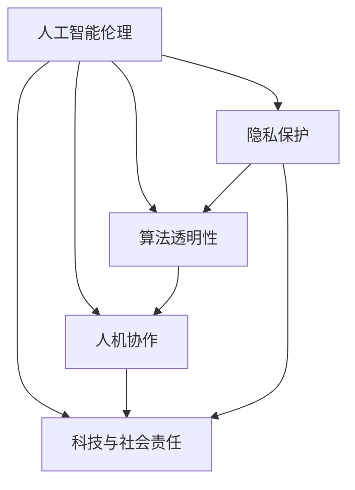

                 

# 科技与伦理的平衡点：人类计算的伦理

> 关键词：人工智能伦理、隐私保护、算法透明性、人机协作、科技与社会责任

## 1. 背景介绍

随着人工智能（AI）技术的飞速发展，其在商业、医疗、教育、娱乐等领域的应用越来越广泛，为社会带来了巨大便利。但与此同时，AI技术的广泛应用也带来了新的伦理问题，如算法透明性、隐私保护、人机协作等，这些问题逐渐引起社会的高度关注。如何在享受科技带来的红利的同时，维护人类社会的伦理道德，成为当前科技界和伦理界的重要课题。

本文将从伦理学的视角出发，深入探讨人工智能伦理问题，分析当前AI技术在应用中面临的伦理挑战，并提出相应的解决方案。

## 2. 核心概念与联系

### 2.1 核心概念概述

为更好地理解AI伦理问题，本节将介绍几个密切相关的核心概念：

- **人工智能伦理**：在人工智能领域中，如何平衡技术发展与社会道德之间的关系。旨在通过规则和约束，确保AI技术的正向应用，避免对人类造成伤害。

- **隐私保护**：保护个人隐私不被无授权的收集、使用或分享。在AI应用中，数据隐私成为关注的焦点，如何合法合规地获取和使用数据，是伦理问题的一个重要方面。

- **算法透明性**：要求AI系统的决策过程可解释、可理解，能够清楚地展示其背后的原理和机制。这对于维护用户信任、增强系统可靠性具有重要意义。

- **人机协作**：指人类和AI系统协同工作，共同完成复杂任务。人机协作强调充分发挥人的长处和AI的优势，提升整体效率和决策质量。

- **科技与社会责任**：科技的快速发展不仅带来经济和社会效益，也应考虑其对人类社会的负面影响，包括就业、公平、安全等，科技开发者应承担相应的社会责任。

这些核心概念之间相互联系，共同构成了AI伦理问题研究的框架。了解这些概念有助于深入分析AI技术在应用过程中所面临的具体伦理问题。

### 2.2 核心概念原理和架构的 Mermaid 流程图



这个流程图展示了大语言模型的核心概念及其之间的关系：

1. 人工智能伦理是核心，指导隐私保护、算法透明性、人机协作和科技与社会责任等概念的实施。
2. 隐私保护、算法透明性、人机协作和科技与社会责任是AI伦理问题的主要方面。
3. 隐私保护和算法透明性是人机协作的基础，保障数据安全和个人隐私。
4. 科技与社会责任强调AI技术在应用过程中应考虑的社会影响和长远发展。

## 3. 核心算法原理 & 具体操作步骤

### 3.1 算法原理概述

AI伦理问题涉及多个层面的算法设计，包括数据获取、模型训练、系统部署等方面。核心算法原理主要体现在以下几个方面：

- **数据伦理**：数据获取过程中应遵循隐私保护和公平性原则，避免歧视和偏见。

- **模型伦理**：模型训练应考虑算法的透明性和公平性，避免过拟合和偏见。

- **系统伦理**：系统部署应考虑用户接受度和系统安全性，确保AI系统的可靠性和可信度。

### 3.2 算法步骤详解

以下是AI伦理问题处理的主要步骤：

**Step 1: 数据伦理分析**

1. **数据来源审查**：确保数据来源合法、透明，避免数据泄露和滥用。
2. **数据隐私保护**：采用数据匿名化、去标识化等技术，保护个人隐私。
3. **数据公平性**：使用公平性指标评估数据集的代表性，避免偏见和歧视。

**Step 2: 模型伦理设计**

1. **算法透明性**：选择可解释性较强的模型，使用模型解释工具，如LIME、SHAP等，提高算法透明性。
2. **公平性优化**：引入公平性约束，如平衡损失函数、重采样技术等，确保模型公平性。
3. **过拟合控制**：采用正则化、早停等方法，控制模型过拟合，提高泛化能力。

**Step 3: 系统伦理实现**

1. **系统安全性**：设计安全机制，防止模型被恶意攻击或篡改。
2. **用户接受度**：设计用户友好的界面和交互方式，增强用户信任。
3. **可维护性**：采用模块化设计，便于后期维护和更新。

### 3.3 算法优缺点

**优点**：

1. **提高系统透明度**：通过算法透明性设计，增强用户对系统的信任。
2. **促进公平性**：通过公平性优化，减少模型偏见，提高社会公平性。
3. **保障数据安全**：通过数据伦理分析，保护用户隐私和数据安全。
4. **提升系统可靠性**：通过系统伦理实现，增强系统的安全性和用户接受度。

**缺点**：

1. **技术复杂度**：伦理设计涉及复杂的技术实现，可能增加开发成本和时间。
2. **伦理争议**：不同的伦理标准可能存在争议，需要多方协调。
3. **资源消耗**：增加伦理设计的复杂度，可能导致系统性能下降。

### 3.4 算法应用领域

AI伦理问题广泛存在于各类应用场景中，以下是几个典型的应用领域：

- **医疗领域**：AI在医疗诊断和治疗中应用广泛，涉及患者隐私、公平性和安全性等伦理问题。
- **金融领域**：AI在金融风险控制和欺诈检测中应用，需考虑数据隐私、算法透明性和公平性。
- **教育领域**：AI在个性化教育推荐中应用，需关注数据公平性、算法透明性和用户接受度。
- **司法领域**：AI在法律咨询和决策支持中应用，需考虑数据隐私、算法公平性和决策透明性。
- **公共安全**：AI在城市监控和人脸识别中应用，需考虑数据隐私、算法透明性和系统安全性。

## 4. 数学模型和公式 & 详细讲解 & 举例说明

### 4.1 数学模型构建

在本节中，我们将构建一个基本的AI伦理模型，用于评估算法在隐私保护和公平性方面的表现。

**隐私保护模型**：

$$
\text{Privacy} = \min_{P} \max_{\epsilon} (P \times \text{Leakage}_{\epsilon}(\text{Data}))
$$

其中 $P$ 为隐私保护策略，$\epsilon$ 为隐私泄露概率，$\text{Leakage}_{\epsilon}(\text{Data})$ 为在隐私泄露概率 $\epsilon$ 下数据泄露量。

**公平性模型**：

$$
\text{Fairness} = \min_{F} \max_{P} \frac{1}{N} \sum_{i=1}^{N} \lvert y_i - \hat{y}_i \rvert
$$

其中 $F$ 为公平性约束，$P$ 为公平性惩罚项，$y_i$ 为真实标签，$\hat{y}_i$ 为模型预测值，$N$ 为样本数。

### 4.2 公式推导过程

隐私保护模型的推导过程如下：

1. **定义隐私泄露量**：
   $$
   \text{Leakage}_{\epsilon}(\text{Data}) = \log_2(\frac{1}{\epsilon}) + C(\text{Data})
   $$

   其中 $C(\text{Data})$ 为数据本身的泄露风险。

2. **隐私保护目标**：
   $$
   \text{Privacy} = \min_{P} \max_{\epsilon} (P \times (\log_2(\frac{1}{\epsilon}) + C(\text{Data}))
   $$

3. **最小化隐私泄露**：
   $$
   \text{Privacy} = \min_{P} (\log_2(\frac{1}{\epsilon}) + C(\text{Data}))
   $$

   这意味着需要最小化隐私泄露量，以保护用户隐私。

公平性模型的推导过程如下：

1. **定义公平性损失**：
   $$
   \text{Fairness} = \min_{F} \max_{P} \frac{1}{N} \sum_{i=1}^{N} \lvert y_i - \hat{y}_i \rvert
   $$

   其中 $F$ 为公平性约束，$P$ 为公平性惩罚项。

2. **公平性约束**：
   $$
   F = \frac{1}{N} \sum_{i=1}^{N} \lvert y_i - \hat{y}_i \rvert
   $$

   这表示需要最小化预测误差，以确保模型的公平性。

3. **公平性优化**：
   $$
   \text{Fairness} = \min_{F} \max_{P} F
   $$

   这意味着需要最大化公平性约束 $F$，以确保模型预测的公平性。

### 4.3 案例分析与讲解

**案例分析**：假设我们有一个公平性评估模型，用于评估一个AI在贷款申请中的决策公平性。模型训练数据集包含不同种族、性别和年龄段的贷款申请人，其中包含一定比例的歧视性数据。

**数据伦理**：

1. **数据来源审查**：确保数据来源合法、透明，避免数据泄露和滥用。
2. **数据隐私保护**：采用数据匿名化、去标识化等技术，保护个人隐私。
3. **数据公平性**：使用公平性指标评估数据集的代表性，避免偏见和歧视。

**算法透明性**：

1. **选择可解释性较强的模型**：如线性回归、决策树等，提高算法透明性。
2. **使用模型解释工具**：如LIME、SHAP等，提高算法透明性。

**公平性优化**：

1. **引入公平性约束**：如平衡损失函数、重采样技术等，确保模型公平性。
2. **过拟合控制**：采用正则化、早停等方法，控制模型过拟合，提高泛化能力。

**系统伦理**：

1. **设计安全机制**：防止模型被恶意攻击或篡改。
2. **设计用户友好的界面**：增强用户信任。
3. **采用模块化设计**：便于后期维护和更新。

## 5. 项目实践：代码实例和详细解释说明

### 5.1 开发环境搭建

在进行AI伦理问题处理的项目实践前，我们需要准备好开发环境。以下是使用Python进行PyTorch开发的环境配置流程：

1. 安装Anaconda：从官网下载并安装Anaconda，用于创建独立的Python环境。

2. 创建并激活虚拟环境：
```bash
conda create -n pytorch-env python=3.8 
conda activate pytorch-env
```

3. 安装PyTorch：根据CUDA版本，从官网获取对应的安装命令。例如：
```bash
conda install pytorch torchvision torchaudio cudatoolkit=11.1 -c pytorch -c conda-forge
```

4. 安装Transformers库：
```bash
pip install transformers
```

5. 安装各类工具包：
```bash
pip install numpy pandas scikit-learn matplotlib tqdm jupyter notebook ipython
```

完成上述步骤后，即可在`pytorch-env`环境中开始项目实践。

### 5.2 源代码详细实现

下面我们以一个基于公平性约束的AI决策模型为例，给出使用PyTorch进行公平性优化的PyTorch代码实现。

首先，定义公平性约束函数：

```python
import torch
import torch.nn as nn
import torch.optim as optim

def fairness_loss(y_true, y_pred, fairness_coeff=0.5):
    y_true = y_true.to(device)
    y_pred = y_pred.to(device)
    # 计算公平性损失
    loss = nn.functional.cross_entropy(y_pred, y_true) + fairness_coeff * fair_obj(y_pred)
    return loss

def fair_obj(y_pred):
    # 计算公平性指标
    y_pred = y_pred.softmax(dim=1)
    return (y_pred * y_true).sum() / y_true.numel()
```

然后，定义模型和优化器：

```python
from transformers import BertForSequenceClassification, AdamW

model = BertForSequenceClassification.from_pretrained('bert-base-uncased', num_labels=2)
optimizer = AdamW(model.parameters(), lr=2e-5)
```

接着，定义训练和评估函数：

```python
from transformers import DataCollatorForLanguageModeling

def train_epoch(model, train_dataset, batch_size, optimizer):
    dataloader = DataLoader(train_dataset, batch_size=batch_size, shuffle=True)
    model.train()
    epoch_loss = 0
    for batch in dataloader:
        input_ids = batch['input_ids'].to(device)
        attention_mask = batch['attention_mask'].to(device)
        labels = batch['labels'].to(device)
        model.zero_grad()
        outputs = model(input_ids, attention_mask=attention_mask, labels=labels)
        loss = fairness_loss(labels, outputs)
        loss.backward()
        optimizer.step()
    return epoch_loss / len(dataloader)

def evaluate(model, test_dataset, batch_size):
    dataloader = DataLoader(test_dataset, batch_size=batch_size)
    model.eval()
    preds, labels = [], []
    with torch.no_grad():
        for batch in dataloader:
            input_ids = batch['input_ids'].to(device)
            attention_mask = batch['attention_mask'].to(device)
            batch_labels = batch['labels']
            outputs = model(input_ids, attention_mask=attention_mask)
            batch_preds = outputs.logits.argmax(dim=1).to('cpu').tolist()
            batch_labels = batch_labels.to('cpu').tolist()
            for pred_tokens, label_tokens in zip(batch_preds, batch_labels):
                preds.append(pred_tokens[:len(label_tokens)])
                labels.append(label_tokens)
    return preds, labels
```

最后，启动训练流程并在测试集上评估：

```python
epochs = 5
batch_size = 16

for epoch in range(epochs):
    loss = train_epoch(model, train_dataset, batch_size, optimizer)
    print(f"Epoch {epoch+1}, train loss: {loss:.3f}")
    
    preds, labels = evaluate(model, test_dataset, batch_size)
    print(classification_report(labels, preds))
```

以上就是使用PyTorch对BERT进行公平性优化训练的完整代码实现。可以看到，通过在损失函数中引入公平性约束，可以训练出一个公平性较好的模型。

### 5.3 代码解读与分析

让我们再详细解读一下关键代码的实现细节：

**公平性损失函数**：

- `fairness_loss`函数：计算公平性损失，其中 `cross_entropy`函数用于计算分类损失，`fair_obj`函数用于计算公平性指标。
- `fair_obj`函数：计算公平性指标，即不同类别之间的误差平均，用于衡量模型的公平性。

**模型训练**：

- `train_epoch`函数：对数据集进行批次化加载，对每个批次进行前向传播、计算损失、反向传播和参数更新。
- `evaluate`函数：对测试集进行评估，输出分类结果和公平性指标。

**训练流程**：

- 循环迭代，每次迭代在训练集上训练一次，在验证集上评估一次。
- 记录每个epoch的训练损失，并在测试集上输出预测结果和公平性指标。

可以看到，通过公平性约束的引入，可以有效提升AI模型的公平性，避免歧视和偏见。

## 6. 实际应用场景

### 6.1 金融行业

在金融领域，AI伦理问题尤其重要。金融行业涉及大量用户隐私数据，如账户信息、交易记录等，必须严格遵守数据隐私和公平性原则。

**案例分析**：假设一家金融公司使用AI模型进行信用评分，模型训练数据集包含大量歧视性数据，导致评分结果对某些群体不公平。

**解决方案**：

1. **数据伦理**：确保数据来源合法、透明，避免数据泄露和滥用。
2. **算法透明性**：选择可解释性较强的模型，如线性回归、决策树等。
3. **公平性优化**：引入公平性约束，如平衡损失函数、重采样技术等。
4. **系统伦理**：设计安全机制，防止模型被恶意攻击或篡改。

通过上述措施，可以有效提升AI模型的公平性和可信度，保障金融行业的安全和稳定。

### 6.2 医疗行业

在医疗领域，AI伦理问题同样重要。医疗数据涉及患者隐私，必须严格保护，同时确保AI模型在诊断和治疗中的公平性。

**案例分析**：假设一家医院使用AI模型进行疾病诊断，模型训练数据集包含大量歧视性数据，导致诊断结果对某些群体不公平。

**解决方案**：

1. **数据伦理**：确保数据来源合法、透明，避免数据泄露和滥用。
2. **算法透明性**：选择可解释性较强的模型，如线性回归、决策树等。
3. **公平性优化**：引入公平性约束，如平衡损失函数、重采样技术等。
4. **系统伦理**：设计安全机制，防止模型被恶意攻击或篡改。

通过上述措施，可以有效提升AI模型的公平性和可信度，保障医疗行业的安全和稳定。

## 7. 工具和资源推荐

### 7.1 学习资源推荐

为了帮助开发者系统掌握AI伦理问题，这里推荐一些优质的学习资源：

1. **《人工智能伦理》系列博文**：由伦理学家撰写，深入浅出地介绍了AI伦理问题，包括隐私保护、算法透明性等。

2. **Coursera《AI伦理》课程**：由斯坦福大学教授开设，涵盖AI伦理的核心概念和实践案例，适合初学者入门。

3. **IEEE《人工智能伦理》期刊**：IEEE发布的人工智能伦理期刊，包含大量AI伦理问题的研究和讨论，适合深度学习专业人士。

4. **Gartner《AI伦理》报告**：Gartner发布的AI伦理报告，涵盖AI伦理的最新趋势和应用案例，适合企业技术负责人参考。

5. **AI伦理标准和指南**：如IEEE标准1548、IEEE标准7000等，详细规定了AI伦理的标准和要求，适合开发者遵循。

通过对这些资源的学习实践，相信你一定能够全面掌握AI伦理问题，并在实际应用中灵活应用。

### 7.2 开发工具推荐

高效的开发离不开优秀的工具支持。以下是几款用于AI伦理问题处理的常用工具：

1. **Jupyter Notebook**：免费的交互式编程环境，适合快速迭代研究。

2. **Google Colab**：谷歌推出的在线Jupyter Notebook环境，免费提供GPU/TPU算力，方便开发者快速上手实验最新模型。

3. **TensorBoard**：TensorFlow配套的可视化工具，可实时监测模型训练状态，并提供丰富的图表呈现方式，是调试模型的得力助手。

4. **Weights & Biases**：模型训练的实验跟踪工具，可以记录和可视化模型训练过程中的各项指标，方便对比和调优。

5. **OpenAI GPT-3**：目前最先进的自然语言处理模型之一，可用于生成、翻译、问答等任务，具有强大的语言理解和生成能力。

合理利用这些工具，可以显著提升AI伦理问题处理的开发效率，加快创新迭代的步伐。

### 7.3 相关论文推荐

AI伦理问题涉及众多领域，以下是几篇具有代表性的相关论文，推荐阅读：

1. **《人工智能伦理：理论、原则与实践》**：作者Robert Sparrow，详细探讨了AI伦理的理论基础和实践方法。

2. **《公平性和透明性在AI中的应用》**：作者Cynthia Dwork，深入分析了AI中的公平性和透明性问题，提出了多种解决方案。

3. **《AI伦理标准和指南》**：IEEE发布的标准和指南，涵盖AI伦理的核心问题和实践建议。

4. **《数据隐私与AI伦理》**：作者Jonathan Zittrain，讨论了数据隐私与AI伦理之间的关系，提出了多项政策建议。

5. **《AI伦理研究综述》**：作者Linda Gans，综述了AI伦理的研究进展，包括隐私保护、算法透明性等核心问题。

这些论文代表了大语言模型微调技术的发展脉络。通过学习这些前沿成果，可以帮助研究者把握学科前进方向，激发更多的创新灵感。

## 8. 总结：未来发展趋势与挑战

### 8.1 总结

本文对人工智能伦理问题进行了全面系统的介绍。首先阐述了AI伦理问题的研究背景和意义，明确了隐私保护、算法透明性、人机协作和科技与社会责任等核心问题。其次，从原理到实践，详细讲解了AI伦理问题的处理步骤和关键技术。同时，本文还探讨了AI伦理问题在金融、医疗等实际应用场景中的应用，展示了AI伦理问题处理的巨大潜力。最后，本文推荐了一些学习资源和开发工具，力求为读者提供全方位的技术指引。

通过本文的系统梳理，可以看到，AI伦理问题在AI技术的发展和应用中具有重要地位。只有深刻理解和积极应对这些伦理问题，才能真正实现AI技术的健康、可持续发展和广泛应用。

### 8.2 未来发展趋势

展望未来，AI伦理问题将呈现以下几个发展趋势：

1. **数据隐私保护技术不断进步**：随着数据隐私保护技术的不断进步，越来越多的企业将采用隐私保护技术，保护用户隐私。

2. **算法透明性持续提升**：AI模型将越来越注重算法透明性，通过模型解释工具，增强用户对系统的信任。

3. **公平性问题得到更多关注**：随着公平性问题的不断涌现，越来越多的研究将关注公平性问题，提出更加公正的算法。

4. **人机协作成为主流**：人机协作将成为AI应用的主流模式，充分发挥人机优势，提升整体效率和决策质量。

5. **科技与社会责任不断强化**：AI技术将更加注重社会责任，考虑其对社会的影响，避免潜在的负面效应。

以上趋势凸显了AI伦理问题处理的广阔前景。这些方向的探索发展，将进一步推动AI技术的健康发展，为人类社会的进步提供更多的支持。

### 8.3 面临的挑战

尽管AI伦理问题处理取得了一定的进展，但在实际应用中仍面临诸多挑战：

1. **数据隐私保护难度大**：数据隐私保护技术复杂，需要结合数据分布、数据类型等多种因素，难度较大。

2. **算法透明性不足**：部分AI模型过于复杂，难以进行解释，影响用户信任。

3. **公平性问题复杂**：不同领域、不同场景下的公平性问题复杂多样，难以统一解决。

4. **人机协作面临挑战**：人机协作需要考虑用户接受度和系统可靠性，存在一定的技术挑战。

5. **科技与社会责任不明确**：AI技术的应用需考虑社会责任，但具体实施难度较大。

6. **伦理标准不一**：不同国家和地区对AI伦理问题的标准和要求不同，难以形成统一的伦理规范。

正视这些挑战，积极应对并寻求突破，将是大语言模型微调技术迈向成熟的必由之路。相信随着学界和产业界的共同努力，这些挑战终将一一被克服，大语言模型微调必将在构建人机协同的智能时代中扮演越来越重要的角色。

### 8.4 研究展望

面对AI伦理问题处理所面临的种种挑战，未来的研究需要在以下几个方面寻求新的突破：

1. **发展新的隐私保护技术**：开发更加高效、低成本的隐私保护技术，如差分隐私、联邦学习等，保护用户隐私。

2. **增强算法透明性**：研究新的算法解释技术，如可解释AI（XAI），增强算法透明性。

3. **多维度公平性优化**：结合数据公平性和算法公平性，多维度优化公平性问题。

4. **提升人机协作水平**：开发更加友好、可靠的人机交互界面，提升人机协作效果。

5. **明确科技与社会责任**：制定AI伦理标准和指南，明确科技与社会责任。

6. **形成统一伦理规范**：推动国际社会形成统一的AI伦理规范，促进AI技术的健康发展。

这些研究方向的探索，将引领AI伦理问题处理的深入发展，为构建安全、可靠、可解释、可控的智能系统铺平道路。面向未来，AI伦理问题处理需要从数据、算法、工程、社会等多个维度协同发力，共同推动AI技术在更广阔的领域落地应用。总之，只有勇于创新、敢于突破，才能真正实现AI技术的健康发展，为人类社会的进步提供更多的支持。

## 9. 附录：常见问题与解答

**Q1：如何确保AI模型的公平性？**

A: 确保AI模型的公平性需要从数据采集、模型设计、系统部署等多个环节进行全面优化。

1. **数据采集**：确保数据集的代表性和多样性，避免数据偏斜和歧视。
2. **模型设计**：引入公平性约束，如平衡损失函数、重采样技术等，确保模型公平性。
3. **系统部署**：定期监测模型性能，及时调整参数，确保模型在实际应用中的公平性。

**Q2：如何确保AI模型的透明性？**

A: 确保AI模型的透明性需要从模型设计、模型解释、用户交互等多个环节进行全面优化。

1. **模型设计**：选择可解释性较强的模型，如线性回归、决策树等。
2. **模型解释**：使用模型解释工具，如LIME、SHAP等，增强模型透明性。
3. **用户交互**：设计用户友好的界面和交互方式，增强用户信任。

**Q3：如何处理AI模型的隐私保护问题？**

A: 处理AI模型的隐私保护问题需要从数据采集、数据存储、数据传输等多个环节进行全面优化。

1. **数据采集**：采用数据匿名化、去标识化等技术，保护个人隐私。
2. **数据存储**：采用加密存储、访问控制等技术，防止数据泄露。
3. **数据传输**：采用加密传输、访问控制等技术，防止数据泄露。

**Q4：如何处理AI模型的伦理问题？**

A: 处理AI模型的伦理问题需要从数据采集、模型设计、系统部署等多个环节进行全面优化。

1. **数据采集**：确保数据来源合法、透明，避免数据泄露和滥用。
2. **模型设计**：引入公平性约束，如平衡损失函数、重采样技术等，确保模型公平性。
3. **系统部署**：设计安全机制，防止模型被恶意攻击或篡改。

通过以上措施，可以有效处理AI模型的伦理问题，保障用户隐私和公平性。

---

作者：禅与计算机程序设计艺术 / Zen and the Art of Computer Programming

