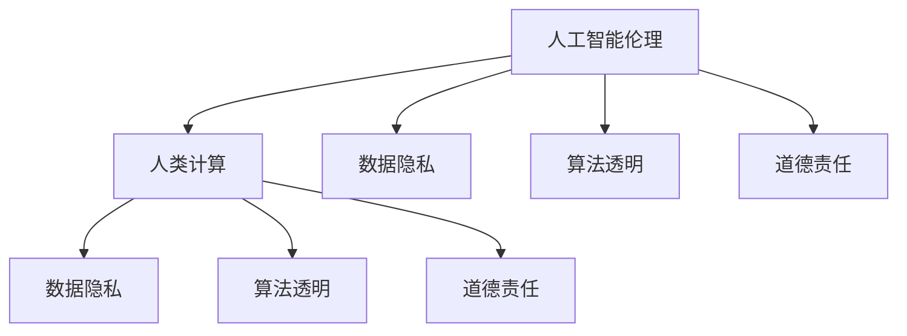

                 

# 科技与伦理的平衡点：人类计算的伦理思考

> 关键词：人工智能伦理,人类计算,数据隐私,算法透明,道德责任

## 1. 背景介绍

### 1.1 问题由来

随着科技的快速发展，人工智能（AI）技术已经渗透到社会的各个角落。从智能家居到自动驾驶，从个性化推荐到金融风险评估，AI的广泛应用极大地提高了生产力和生活质量。然而，这一技术进步同时也带来了新的伦理挑战，尤其是对数据隐私、算法透明和道德责任等方面的考量。

在AI的应用过程中，如何平衡科技进步与伦理道德的关系，成为当下社会广泛关注的问题。特别是随着深度学习模型的复杂化和规模化，这些伦理问题变得更加突出和紧迫。例如，深度学习模型在处理海量数据时，可能会无意中侵犯用户隐私，产生偏见，甚至对社会造成不平等的影响。

### 1.2 问题核心关键点

本文旨在探讨科技与伦理在人工智能中的平衡点，重点关注以下几个关键点：

- **数据隐私**：如何在AI模型中使用数据时保护用户隐私。
- **算法透明**：如何确保AI算法可解释、可理解，以便公众监督。
- **道德责任**：AI开发者和使用者应如何承担伦理责任，确保技术应用不会对社会产生负面影响。

这些问题不仅关系到技术进步，更关乎社会的公平、正义和可持续发展。本文将从这三个角度，系统阐述人工智能伦理的思考和实践。

## 2. 核心概念与联系

### 2.1 核心概念概述

为更好地理解科技与伦理在人工智能中的平衡点，本节将介绍几个关键概念及其相互联系：

- **人工智能伦理（AI Ethics）**：研究如何使人工智能技术在应用中遵循道德准则，避免对社会、环境、个体造成伤害。
- **人类计算（Human Computation）**：强调人与机器的协作，确保人工智能系统的决策过程透明、可解释，并符合人类伦理标准。
- **数据隐私（Data Privacy）**：在数据收集、处理和分析过程中，保护个人隐私不受侵犯。
- **算法透明（Algorithm Transparency）**：要求AI算法的工作机制和决策逻辑可被理解，便于公众监督。
- **道德责任（Moral Responsibility）**：AI开发者和使用者在技术应用过程中应承担的责任，以确保技术的公正性和无害性。

这些概念之间的逻辑关系可以通过以下Mermaid流程图来展示：



这个流程图展示了各个核心概念之间的相互关联：

1. 人工智能伦理是研究和应用的核心，涵盖了数据隐私、算法透明和道德责任等子概念。
2. 人类计算强调在AI开发和应用中融入人类价值判断，以实现科技与伦理的平衡。
3. 数据隐私保护是确保用户信息不被滥用的关键。
4. 算法透明要求确保AI决策过程的公开和可理解。
5. 道德责任指明了AI开发者和使用者应如何承担伦理责任，确保技术的正当性和有益性。

## 3. 核心算法原理 & 具体操作步骤
### 3.1 算法原理概述

本文重点讨论的是伦理与技术在人工智能系统中的应用，而非具体的算法实现细节。但为更全面地理解人工智能的伦理问题，仍需简要介绍一些基本的算法原理。

### 3.2 算法步骤详解

在人工智能系统中，算法步骤主要分为以下几个环节：

1. **数据收集与预处理**：收集和清洗数据，去除噪声和无关信息，确保数据的质量和可用性。
2. **模型训练与优化**：使用训练数据对模型进行训练，优化模型参数以最小化误差。
3. **测试与验证**：在测试数据集上评估模型性能，验证模型的泛化能力。
4. **部署与监控**：将模型部署到实际应用中，并持续监控模型行为，确保其符合伦理标准。

每个环节都需考虑伦理问题，如数据隐私保护、算法透明性和道德责任承担。

### 3.3 算法优缺点

人工智能算法具有以下优点：

- **高效性**：自动化处理大量数据，提高决策速度和效率。
- **精确性**：通过复杂模型和大量训练数据，获得高精度的预测结果。
- **可扩展性**：算法可以应用于不同场景，适应不同的需求。

然而，算法也存在以下缺点：

- **黑箱性**：部分算法模型（如深度学习）过于复杂，难以解释其决策过程。
- **偏差性**：数据偏差和模型偏见可能导致不公平的预测结果。
- **隐私风险**：处理大量数据时，可能侵犯用户隐私。

### 3.4 算法应用领域

人工智能算法广泛应用于以下几个领域：

- **医疗诊断**：通过分析患者数据，辅助医生进行诊断和治疗。
- **金融风控**：利用历史数据预测金融风险，帮助金融机构做出决策。
- **自然语言处理**：理解自然语言，实现机器翻译、情感分析等功能。
- **自动驾驶**：通过传感器数据，辅助车辆进行导航和避障。
- **智能推荐**：根据用户行为数据，推荐个性化产品或内容。

这些领域的应用，对社会产生了深远的影响，也提出了新的伦理挑战。

## 4. 数学模型和公式 & 详细讲解 & 举例说明

### 4.1 数学模型构建

在人工智能系统中，数学模型是算法的基础。这里以线性回归模型为例，简要说明数学模型的构建过程。

### 4.2 公式推导过程

假设有一个线性回归模型，其目标是最小化预测值与真实值之间的均方误差。数学表达式为：

$$
\min_{\theta} \frac{1}{N} \sum_{i=1}^{N} (y_i - \theta_0 - \theta_1 x_i)^2
$$

其中 $N$ 为样本数量，$y_i$ 为真实值，$\theta_0$ 和 $\theta_1$ 为模型参数。

通过最小化上述损失函数，可以求得模型的最优参数：

$$
\theta_0 = \frac{\sum_{i=1}^{N} y_i - \theta_1 \sum_{i=1}^{N} x_i}{N}
$$

$$
\theta_1 = \frac{\sum_{i=1}^{N} x_i y_i - \theta_0 \sum_{i=1}^{N} x_i}{\sum_{i=1}^{N} x_i^2 - \theta_0^2 \sum_{i=1}^{N} x_i}
$$

### 4.3 案例分析与讲解

在实际应用中，数据隐私是一个重要的问题。例如，某电商平台希望通过分析用户的购物行为来推荐商品。为了保护用户隐私，可以使用差分隐私技术，通过在数据中添加噪声，确保单个用户的隐私不被泄露。

差分隐私技术的基本思想是在数据中添加噪声，使得单个数据点的变化对模型输出的影响极小，从而保护用户隐私。其数学表达式为：

$$
\mathcal{L}(f(x_i)) \leq \epsilon
$$

其中，$\mathcal{L}$ 为损失函数，$\epsilon$ 为隐私保护参数。在实际应用中，可以通过设置合适的 $\epsilon$ 值，平衡模型性能和用户隐私保护。

## 5. 项目实践：代码实例和详细解释说明

### 5.1 开发环境搭建

在进行项目实践前，我们需要准备好开发环境。以下是使用Python进行TensorFlow开发的环境配置流程：

1. 安装Anaconda：从官网下载并安装Anaconda，用于创建独立的Python环境。

2. 创建并激活虚拟环境：
```bash
conda create -n tf-env python=3.8 
conda activate tf-env
```

3. 安装TensorFlow：根据CUDA版本，从官网获取对应的安装命令。例如：
```bash
conda install tensorflow -c conda-forge
```

4. 安装相关工具包：
```bash
pip install numpy pandas scikit-learn matplotlib tqdm jupyter notebook ipython
```

完成上述步骤后，即可在`tf-env`环境中开始项目实践。

### 5.2 源代码详细实现

这里我们以数据隐私保护为例，给出使用差分隐私技术进行线性回归模型开发的TensorFlow代码实现。

```python
import tensorflow as tf
import numpy as np

# 构建数据
x = np.array([1, 2, 3, 4, 5]).reshape(-1, 1)
y = np.array([2, 4, 6, 8, 10]).reshape(-1, 1)

# 差分隐私保护
epsilon = 0.1
sigma = epsilon / (2 * np.sqrt(x.shape[0]))
noise = sigma * np.random.randn(*x.shape)
x_with_noise = x + noise

# 构建模型
theta = tf.Variable(tf.zeros([1, 1]))
x_tf = tf.constant(x_with_noise)
y_tf = tf.constant(y)
pred = theta * x_tf

# 损失函数
loss = tf.losses.mean_squared_error(y_tf, pred)

# 优化器
optimizer = tf.optimizers.SGD(learning_rate=0.01)

# 训练过程
def train_step(x, y):
    with tf.GradientTape() as tape:
        pred = theta * x
        loss = tf.losses.mean_squared_error(y, pred)
    gradients = tape.gradient(loss, theta)
    optimizer.apply_gradients(zip(gradients, [theta]))
    return loss

# 训练
for i in range(100):
    loss = train_step(x_with_noise, y)
    print(f"Step {i+1}, loss: {loss:.4f}")
```

### 5.3 代码解读与分析

这段代码实现了使用差分隐私技术保护数据隐私的线性回归模型。

**数据生成与差分隐私**：
- 使用Numpy生成简单的线性数据。
- 在数据中添加一个高斯噪声，保护单个数据点的隐私。

**模型构建与训练**：
- 使用TensorFlow定义模型参数 $\theta$ 和输入数据 $x$。
- 通过前向传播计算预测值 $pred$。
- 定义损失函数为均方误差损失。
- 使用随机梯度下降优化器进行参数更新。
- 定义训练过程 `train_step`，每次迭代计算损失并更新参数。

**训练流程**：
- 循环100次，每次更新模型参数，输出当前损失。

可以看到，通过差分隐私技术，我们可以在保护用户隐私的前提下进行模型训练。这种技术的应用，体现了科技与伦理之间的平衡。

## 6. 实际应用场景

### 6.1 医疗领域

在医疗领域，人工智能技术被广泛应用于疾病诊断、治疗方案推荐等。然而，医疗数据涉及患者隐私，如何在保护隐私的前提下，利用这些数据进行医疗决策，是一个重要的伦理问题。

例如，某医院希望使用人工智能技术辅助医生进行乳腺癌诊断。医院可以收集患者的基因数据、影像数据和临床数据，并在此基础上训练模型。为保护患者隐私，可以在数据中加入噪声，使得单个患者的隐私不易被泄露。

### 6.2 金融领域

金融行业需要处理大量敏感数据，如用户的交易记录、信用评分等。在使用这些数据进行风险评估时，保护用户隐私是至关重要的。

例如，某银行希望利用AI技术预测用户的违约风险。银行可以收集用户的交易记录、信用评分等信息，并在模型训练过程中加入差分隐私噪声。这不仅能保护用户隐私，还能提升模型预测的公平性，减少歧视性风险。

### 6.3 教育领域

在教育领域，AI技术被用于个性化学习、智能辅导等。然而，学生的成绩、行为等信息涉及隐私，如何在保护隐私的前提下，利用这些数据进行个性化教学，是一个重要的伦理问题。

例如，某在线教育平台希望使用AI技术进行学生学习行为的分析。平台可以收集学生的在线学习记录、测试成绩等信息，并在此基础上训练模型。为保护学生隐私，可以在数据中加入噪声，使得单个学生的隐私不易被泄露。

## 7. 工具和资源推荐

### 7.1 学习资源推荐

为了帮助开发者系统掌握人工智能伦理的理论与实践，这里推荐一些优质的学习资源：

1. 《人工智能伦理》系列博文：由大模型技术专家撰写，深入浅出地介绍了人工智能伦理的基本概念和前沿问题。

2. 《深度学习与伦理学》课程：斯坦福大学开设的伦理学课程，涵盖人工智能伦理的多个方面，包括数据隐私、算法透明等。

3. 《Human-Centered AI》书籍：讨论了人工智能伦理的多个方面，包括数据隐私、算法透明、道德责任等。

4. IEEE的AI伦理指南：由IEEE发布的AI伦理指南，提供了AI技术应用的伦理建议和标准。

5. OpenAI的AI伦理报告：OpenAI发布的AI伦理报告，探讨了AI技术在实际应用中的伦理问题。

通过对这些资源的学习实践，相信你一定能够快速掌握人工智能伦理的精髓，并用于解决实际的伦理问题。

### 7.2 开发工具推荐

高效的开发离不开优秀的工具支持。以下是几款用于人工智能伦理开发的工具：

1. TensorFlow：基于Python的开源深度学习框架，灵活动态的计算图，适合快速迭代研究。

2. PyTorch：基于Python的开源深度学习框架，动态计算图，灵活性好，易于扩展。

3. TensorFlow Privacy：TensorFlow的差分隐私库，提供了差分隐私保护的工具和算法。

4. Weights & Biases：模型训练的实验跟踪工具，可以记录和可视化模型训练过程中的各项指标，方便对比和调优。

5. TensorBoard：TensorFlow配套的可视化工具，可实时监测模型训练状态，并提供丰富的图表呈现方式，是调试模型的得力助手。

合理利用这些工具，可以显著提升人工智能伦理开发的效率，加快创新迭代的步伐。

### 7.3 相关论文推荐

人工智能伦理的研究源于学界的持续研究。以下是几篇奠基性的相关论文，推荐阅读：

1. 《公平性、责任和透明性：人工智能伦理指南》：提出了人工智能伦理的基本原则和伦理框架。

2. 《人工智能伦理：一个跨学科视角》：讨论了人工智能伦理的多个方面，包括数据隐私、算法透明、道德责任等。

3. 《人工智能伦理的挑战与对策》：分析了人工智能伦理的多个挑战，并提出了相应的对策。

4. 《人工智能伦理：理论与实践》：系统阐述了人工智能伦理的理论基础和实践方法。

5. 《人工智能伦理：全球视角》：讨论了全球范围内的人工智能伦理问题，提供了多国视角和解决方案。

这些论文代表了大数据与人工智能伦理研究的发展脉络。通过学习这些前沿成果，可以帮助研究者把握学科前进方向，激发更多的创新灵感。

## 8. 总结：未来发展趋势与挑战

### 8.1 总结

本文对人工智能伦理在科技与人类计算中的平衡点进行了全面系统的介绍。首先阐述了人工智能伦理的研究背景和意义，明确了数据隐私、算法透明和道德责任在AI系统中的应用价值。其次，从原理到实践，详细讲解了差分隐私等保护用户隐私的技术，给出了代码实例和详细解释说明。同时，本文还探讨了人工智能伦理在医疗、金融、教育等多个领域的应用，展示了伦理技术的重要性和现实意义。此外，本文精选了人工智能伦理的学习资源和开发工具，力求为开发者提供全方位的技术指引。

通过本文的系统梳理，可以看到，人工智能伦理技术正在成为AI应用的重要保障，极大地提升了科技发展的伦理标准。未来，伴随人工智能技术的不断发展，如何在保障伦理的前提下推动科技进步，将是所有AI开发者和使用者共同面临的挑战。

### 8.2 未来发展趋势

展望未来，人工智能伦理将呈现以下几个发展趋势：

1. **数据隐私保护技术创新**：差分隐私、同态加密等隐私保护技术将不断创新，进一步提升数据隐私保护能力。

2. **算法透明与可解释性**：更先进的算法透明技术将被开发，帮助公众理解和监督AI决策过程。

3. **伦理准则与标准制定**：更多的伦理准则和标准将被制定和实施，确保AI技术的公正性和无害性。

4. **跨学科合作与研究**：计算机科学、伦理学、法律等多学科合作将深入开展，推动AI伦理研究的全面发展。

5. **社会公众参与**：公众对AI技术的理解和参与度将不断提升，共同构建科技与伦理的良性循环。

以上趋势凸显了人工智能伦理技术的广阔前景。这些方向的探索发展，必将进一步提升AI系统的可信度和可接受性，为构建公正、安全、可靠的人工智能社会奠定坚实基础。

### 8.3 面临的挑战

尽管人工智能伦理技术已经取得了显著进展，但在迈向更加智能化、普适化应用的过程中，它仍面临诸多挑战：

1. **隐私保护技术不足**：当前隐私保护技术尚不能完全解决数据隐私问题，尤其是面对大规模、高维度数据时，隐私保护面临更大挑战。

2. **算法透明性问题**：一些复杂模型（如深度学习）过于复杂，难以解释其决策过程，这增加了公众监督的难度。

3. **伦理标准不一致**：不同国家和地区对AI伦理有不同的理解和标准，如何制定统一的标准和规范，是一个难题。

4. **技术落地难度大**：伦理技术与现有技术体系（如大数据、云计算等）的整合，需要更多研究和实践。

5. **社会接受度低**：公众对AI技术的信任度不高，尤其是对于涉及个人隐私和敏感信息的应用，接受度较低。

6. **法律监管滞后**：当前的法律法规未能及时跟上AI技术的发展，法律监管面临挑战。

这些挑战需要科技界、法律界、伦理界共同努力，才能推动人工智能伦理技术的持续进步。

### 8.4 研究展望

面对人工智能伦理面临的种种挑战，未来的研究需要在以下几个方面寻求新的突破：

1. **隐私保护技术创新**：开发更先进的隐私保护技术，确保数据在处理和使用过程中不被滥用。

2. **算法透明与可解释性**：研究如何使AI算法更加透明和可解释，增强公众对AI决策的信任。

3. **伦理准则与标准制定**：制定全球统一的AI伦理准则和标准，确保技术应用的公正性和无害性。

4. **跨学科合作**：加强计算机科学、伦理学、法律等多学科合作，推动AI伦理研究的全面发展。

5. **技术落地应用**：探索如何在现有技术体系中融入伦理技术，实现科技与伦理的融合。

6. **社会公众教育**：通过教育提升公众对AI技术的理解和接受度，共同构建科技与伦理的良性循环。

7. **法律监管创新**：探索新的法律框架和监管机制，确保AI技术应用的合法性和合规性。

这些研究方向将引领人工智能伦理技术的持续进步，为构建安全、可靠、可解释、可控的智能系统铺平道路。面向未来，人工智能伦理技术还需要与其他人工智能技术进行更深入的融合，多路径协同发力，共同推动自然语言理解和智能交互系统的进步。只有勇于创新、敢于突破，才能不断拓展语言模型的边界，让智能技术更好地造福人类社会。

## 9. 附录：常见问题与解答

**Q1：数据隐私保护技术有哪些？**

A: 数据隐私保护技术主要包括以下几种：

1. **差分隐私**：在数据中添加噪声，使得单个数据点的变化对模型输出的影响极小。
2. **同态加密**：数据在加密状态下进行计算，计算结果仍保持加密性。
3. **联邦学习**：模型在分布式数据源上进行训练，保护数据不离开本地。
4. **隐私保留的聚合学习**：在聚合学习中，每个节点只上传加密后的数据，保护数据隐私。

这些技术可以结合使用，以提供更全面的数据隐私保护。

**Q2：如何确保AI算法的透明性？**

A: 确保AI算法透明性需要从以下几个方面入手：

1. **模型解释**：使用可解释性模型（如决策树、线性回归等），或通过解释技术（如SHAP、LIME等）解释黑盒模型的决策过程。
2. **透明度评估**：开发透明度评估工具，评估模型的可解释性。
3. **可解释性API**：提供可解释性API，帮助用户理解模型的内部工作机制。

通过这些方法，可以提升AI算法的透明性，增强公众对AI系统的信任。

**Q3：如何承担AI技术的伦理责任？**

A: AI开发者和使用者在技术应用过程中应承担以下伦理责任：

1. **数据隐私保护**：确保数据处理和使用过程中不侵犯用户隐私。
2. **算法透明性**：使AI算法的工作机制和决策逻辑可被理解，便于公众监督。
3. **公平性**：确保AI系统不产生歧视性、偏见性结果。
4. **安全性**：确保AI系统不会对社会造成安全威胁。
5. **社会责任**：确保AI系统的应用不会对社会造成不平等影响。

只有在技术应用过程中，严格遵守伦理准则，才能确保AI技术的正当性和有益性。

---

作者：禅与计算机程序设计艺术 / Zen and the Art of Computer Programming

