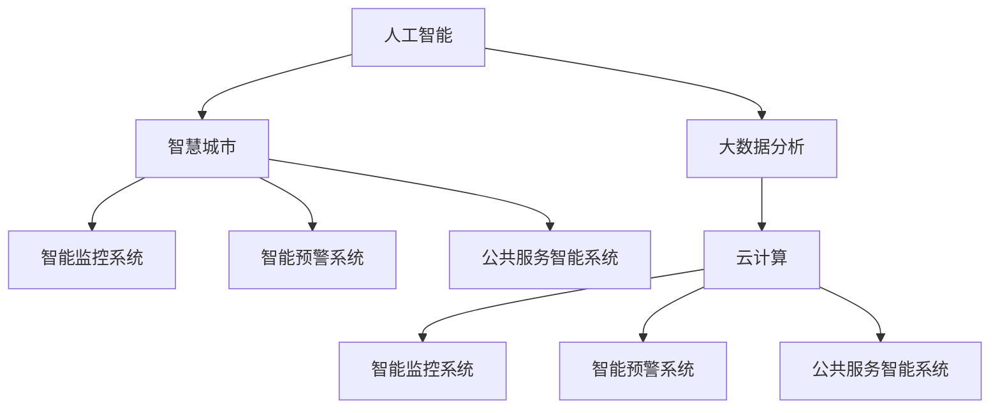

                 

# 科技创新：社会治理的新思路

> 关键词：科技创新,社会治理,人工智能,大数据,智慧城市,智能监控,预警系统,社会安全,公共服务

## 1. 背景介绍

### 1.1 问题由来
随着社会的快速发展，传统社会治理体系逐渐显现出其局限性。传统社会治理依赖人工进行信息收集、分析和决策，效率低下、成本高昂、难以适应信息爆炸的时代。而科技创新，特别是人工智能、大数据等前沿技术的飞速发展，为提升社会治理的效率和质量提供了新的路径。

过去几年，社会治理的数字化、智能化转型的步伐明显加快。各级政府、企业、科研机构纷纷启动智能化社会治理项目，利用AI和大数据技术提升公共安全、环境保护、交通管理等领域的治理能力。科技创新在社会治理中的作用日益凸显，带来了治理模式的根本变革。

### 1.2 问题核心关键点
科技创新在社会治理中的应用主要体现在以下几个方面：

1. **智能监控系统**：通过视频监控、传感器、物联网等技术，实时收集环境数据，提升公共安全、环境监测等方面的效率。

2. **大数据分析**：利用大数据技术，对海量数据进行快速处理和分析，辅助决策，提升决策的科学性和精准性。

3. **智能预警系统**：基于机器学习算法，对异常数据进行实时监测和预警，及时发现和处理潜在风险。

4. **智慧城市建设**：通过城市信息化、智能化改造，提升城市管理的整体水平，实现交通、环保、安全等领域的协同治理。

5. **智能客服与问答系统**：利用自然语言处理技术，提供智能客服和问答服务，提升公共服务的响应速度和质量。

科技创新在社会治理中的应用，不仅提升了治理效率，还优化了治理结构，降低了治理成本，增强了治理的透明性和公正性，成为推动社会治理现代化的重要引擎。

### 1.3 问题研究意义
科技创新在社会治理中的应用具有重要意义：

1. **提高治理效率**：通过智能化手段，大幅提升信息收集、分析和决策的效率，实现快速响应和高效处理。

2. **优化治理结构**：科技手段为决策提供数据支持，增强了决策的科学性和客观性，优化了治理结构。

3. **降低治理成本**：科技手段减少了人工干预，降低了治理成本，提升了资源利用效率。

4. **增强治理透明性**：科技手段使治理过程透明可溯，提升了治理的公信力和透明度。

5. **提升治理质量**：科技手段提升了数据处理能力，提高了决策的精准性和合理性。

6. **促进社会和谐**：科技创新在医疗、教育、环保等领域的应用，改善了社会福利，促进了社会和谐。

## 2. 核心概念与联系

### 2.1 核心概念概述

为更好地理解科技创新在社会治理中的应用，本节将介绍几个密切相关的核心概念：

- **人工智能（AI）**：通过模拟人脑的认知过程，使计算机系统具备学习、推理、决策、自我修正等智能行为的技术。

- **大数据分析**：对海量结构化或非结构化数据进行清洗、处理和分析，从中提取有价值的信息和知识，辅助决策。

- **智慧城市**：利用信息技术和智能设备，对城市资源和基础设施进行全面感知、整合和优化，实现城市管理的智能化。

- **智能监控系统**：通过视频监控、传感器、物联网等技术，实时收集环境数据，提升公共安全、环境监测等方面的效率。

- **智能预警系统**：利用机器学习算法，对异常数据进行实时监测和预警，及时发现和处理潜在风险。

- **公共服务智能系统**：通过自然语言处理等技术，提供智能客服、问答等服务，提升公共服务的响应速度和质量。

- **云计算**：基于分布式计算和存储技术，提供计算资源、存储资源和网络资源的按需访问，支持大规模数据处理和智能应用。

这些核心概念之间的逻辑关系可以通过以下Mermaid流程图来展示：



这个流程图展示了一系列科技创新在社会治理中的应用场景，并揭示了它们之间的联系。

## 3. 核心算法原理 & 具体操作步骤
### 3.1 算法原理概述

科技创新在社会治理中的应用，本质上是一个将先进技术应用于社会管理过程的过程。其核心思想是利用数据驱动和智能分析，实现对社会运行状态的感知、预测和优化。

以智能监控系统为例，其核心算法原理包括：

- **视频分析**：通过计算机视觉技术，实时监控视频画面，检测异常行为，如违法行为、交通拥堵等。

- **传感器融合**：将多种传感器数据进行融合，实现对环境参数的全面感知，如空气质量、温度、湿度等。

- **数据分析与模型预测**：利用大数据技术和机器学习算法，对传感器数据进行分析和建模，预测环境变化趋势，辅助决策。

- **信息反馈与智能控制**：根据监控结果和预测结果，智能控制系统进行实时调整，如调整交通信号灯、开启空气净化器等。

### 3.2 算法步骤详解

科技创新在社会治理中的应用，一般包括以下几个关键步骤：

**Step 1: 数据采集与预处理**
- 收集与治理目标相关的各类数据，如视频监控数据、传感器数据、用户行为数据等。
- 对数据进行清洗、去噪、归一化等预处理，确保数据质量。

**Step 2: 数据分析与模型构建**
- 利用大数据分析技术，对清洗后的数据进行统计分析和特征提取。
- 选择合适的机器学习或深度学习模型，对数据进行建模，如回归模型、分类模型、神经网络等。
- 利用历史数据和标注样本进行模型训练和调优。

**Step 3: 智能决策与控制**
- 利用训练好的模型，对实时数据进行预测和分析，辅助决策。
- 根据决策结果，智能控制系统进行实时调整，如调整交通信号灯、开启空气净化器等。
- 利用智能预警系统，对异常情况进行实时监测和预警。

**Step 4: 用户反馈与持续优化**
- 收集用户反馈，评估系统性能和效果。
- 持续优化模型和算法，提升系统准确性和响应速度。
- 更新和维护系统基础设施，确保系统的稳定性和可靠性。

### 3.3 算法优缺点

科技创新在社会治理中的应用，具有以下优点：

1. **效率提升**：利用先进技术，大幅提升数据处理和分析效率，实现快速响应和高效处理。

2. **成本降低**：减少人工干预和重复劳动，降低治理成本，提高资源利用效率。

3. **决策科学性**：数据驱动的决策过程，增强了决策的科学性和客观性，优化了治理结构。

4. **透明性和公正性**：数据和决策过程透明可溯，提升了治理的公信力和透明度。

5. **响应速度**：实时监控和智能控制，实现快速反应和及时处理。

但同时，该方法也存在一些局限性：

1. **数据依赖性强**：数据质量和数据量直接影响系统性能，数据获取难度大。

2. **技术门槛高**：智能化系统开发和维护需要高水平的技术支持，对技术人才需求量大。

3. **隐私和伦理问题**：数据收集和处理可能涉及隐私和伦理问题，需要严格的数据保护措施。

4. **模型鲁棒性**：模型可能存在过拟合或泛化能力不足的问题，需要持续优化和改进。

5. **社会接受度**：公众对智能化系统的接受度不一，需要平衡技术应用与公众诉求。

### 3.4 算法应用领域

科技创新在社会治理中的应用，覆盖了以下多个领域：

- **智能交通**：通过智能监控系统、大数据分析等技术，实现交通流量预测、智能调度和交通违法检测。

- **智慧环保**：利用传感器和数据分析技术，监测空气质量、水质、噪音等环境参数，实现环境监控和治理。

- **公共安全**：通过视频监控和智能预警系统，实时监测社会治安和公共安全，及时发现和处理潜在风险。

- **医疗健康**：利用智能分析技术，辅助诊断和病情监测，提升医疗服务水平。

- **智慧教育**：通过智能学习系统，提供个性化教学和学生行为分析，提升教育质量。

- **城市管理**：利用智慧城市技术，实现城市资源优化、公共服务智能化、基础设施智能化管理。

科技创新在社会治理中的应用，极大地提升了治理效率和质量，推动了社会治理的现代化进程。

## 4. 数学模型和公式 & 详细讲解  
### 4.1 数学模型构建

以智能监控系统为例，其数学模型构建包括以下几个关键步骤：

1. **视频监控数据建模**：利用计算机视觉技术，将视频数据转化为帧序列，检测异常行为。

2. **传感器数据建模**：对多种传感器数据进行融合，提取环境参数，如温度、湿度、空气质量等。

3. **异常检测模型**：利用机器学习算法，如SVM、深度学习等，对传感器数据进行异常检测。

4. **预测模型**：利用时间序列分析、回归模型等，对环境参数进行预测和趋势分析。

### 4.2 公式推导过程

以智能监控系统中的异常检测为例，其数学模型公式如下：

$$
\text{异常检测模型} = \text{数据预处理} + \text{特征提取} + \text{模型训练} + \text{异常检测}
$$

具体步骤如下：

1. **数据预处理**：对原始数据进行清洗、去噪、归一化等处理，确保数据质量。

2. **特征提取**：利用特征提取算法，如PCA、LDA等，从原始数据中提取重要特征。

3. **模型训练**：利用历史数据和标注样本，对异常检测模型进行训练和调优。

4. **异常检测**：利用训练好的模型，对实时数据进行异常检测，如交通违法行为、空气质量异常等。

### 4.3 案例分析与讲解

以智能交通为例，其核心技术流程如下：

1. **视频监控数据采集**：通过摄像头实时采集交通视频数据。

2. **传感器数据采集**：利用传感器实时采集道路交通状况数据，如车流量、车速等。

3. **数据融合**：将视频监控数据和传感器数据进行融合，获得全面感知的数据。

4. **数据分析**：利用大数据分析技术，对融合后的数据进行统计分析和特征提取。

5. **异常检测**：利用异常检测模型，对数据分析结果进行异常检测，如识别交通堵塞、车辆违法行为等。

6. **智能决策**：根据异常检测结果，智能控制系统进行实时调整，如调整交通信号灯、优化交通流量等。

7. **用户反馈**：收集用户反馈，评估系统性能和效果，持续优化系统。

## 5. 项目实践：代码实例和详细解释说明
### 5.1 开发环境搭建

在进行科技创新在社会治理中的应用实践前，我们需要准备好开发环境。以下是使用Python进行OpenCV、PyTorch、TensorFlow等库进行视频分析和机器学习开发的详细环境配置流程：

1. 安装Anaconda：从官网下载并安装Anaconda，用于创建独立的Python环境。

2. 创建并激活虚拟环境：
```bash
conda create -n cvt-py3 python=3.8 
conda activate cvt-py3
```

3. 安装OpenCV：
```bash
conda install opencv opencv-contrib
```

4. 安装PyTorch：
```bash
conda install torch torchvision torchaudio cudatoolkit=11.1 -c pytorch -c conda-forge
```

5. 安装TensorFlow：
```bash
conda install tensorflow -c conda-forge -c pytorch
```

6. 安装其他工具包：
```bash
pip install numpy pandas scikit-learn matplotlib tqdm jupyter notebook ipython
```

完成上述步骤后，即可在`cvt-py3`环境中开始项目实践。

### 5.2 源代码详细实现

以下是一个基于OpenCV和PyTorch实现视频监控异常检测的Python代码示例：

```python
import cv2
import torch
import torchvision.transforms as transforms
import numpy as np

# 加载模型
model = torch.load('path/to/model.pth')

# 定义视频源
cap = cv2.VideoCapture('path/to/video.mp4')

while cap.isOpened():
    # 读取视频帧
    ret, frame = cap.read()
    if not ret:
        break

    # 将视频帧转换为Tensor
    transform = transforms.Compose([
        transforms.ToTensor(),
        transforms.Resize((224, 224))
    ])
    frame_tensor = transform(frame).permute(2, 0, 1).unsqueeze(0)

    # 前向传播计算预测结果
    with torch.no_grad():
        output = model(frame_tensor)
        _, predicted = output.max(dim=1)

    # 在视频帧上标记异常检测结果
    cv2.putText(frame, 'Normal' if predicted.item() == 0 else 'Abnormal', (10, 50), cv2.FONT_HERSHEY_SIMPLEX, 1, (0, 255, 0), 2)

    # 显示视频帧
    cv2.imshow('frame', frame)
    if cv2.waitKey(1) == ord('q'):
        break

# 释放资源
cap.release()
cv2.destroyAllWindows()
```

### 5.3 代码解读与分析

让我们再详细解读一下关键代码的实现细节：

**视频监控数据采集**：

```python
import cv2
import torch
import torchvision.transforms as transforms
import numpy as np

# 加载模型
model = torch.load('path/to/model.pth')

# 定义视频源
cap = cv2.VideoCapture('path/to/video.mp4')
```

**数据预处理**：

```python
# 读取视频帧
ret, frame = cap.read()
if not ret:
    break
```

**数据转换**：

```python
# 将视频帧转换为Tensor
transform = transforms.Compose([
    transforms.ToTensor(),
    transforms.Resize((224, 224))
])
frame_tensor = transform(frame).permute(2, 0, 1).unsqueeze(0)
```

**模型前向传播**：

```python
# 前向传播计算预测结果
with torch.no_grad():
    output = model(frame_tensor)
    _, predicted = output.max(dim=1)
```

**异常检测结果标记**：

```python
# 在视频帧上标记异常检测结果
cv2.putText(frame, 'Normal' if predicted.item() == 0 else 'Abnormal', (10, 50), cv2.FONT_HERSHEY_SIMPLEX, 1, (0, 255, 0), 2)
```

**显示视频帧**：

```python
# 显示视频帧
cv2.imshow('frame', frame)
if cv2.waitKey(1) == ord('q'):
    break
```

这个代码示例展示了利用OpenCV和PyTorch实现视频监控异常检测的完整流程。可以看到，通过简单的预处理和模型前向传播，即可实现对视频帧的实时检测和标记。

## 6. 实际应用场景
### 6.1 智能交通系统

智能交通系统是科技创新在社会治理中应用的重要领域之一。通过视频监控、传感器融合、数据分析和智能决策，智能交通系统实现了交通流量预测、智能调度和交通违法检测等功能，提升了交通管理的智能化水平。

具体应用场景包括：

1. **交通流量预测**：通过视频监控数据和传感器数据，利用机器学习算法，预测交通流量变化趋势，辅助交通调度。

2. **智能调度和信号灯控制**：根据预测结果和实时交通数据，智能控制系统进行实时调整，如调整交通信号灯、优化交通流量等。

3. **交通违法行为检测**：利用计算机视觉技术，检测交通违法行为，如闯红灯、逆行等，实时上传违法行为数据，提升交通安全。

4. **交通事件应急响应**：实时监控交通异常情况，如交通事故、车辆堵塞等，快速响应和处理，保障交通顺畅。

### 6.2 智慧环保系统

智慧环保系统通过传感器和数据分析技术，实时监测环境参数，如空气质量、水质、噪音等，实现环境监控和治理，提升环保管理水平。

具体应用场景包括：

1. **空气质量监测**：利用传感器实时监测空气质量数据，如PM2.5、臭氧等，生成实时空气质量报告。

2. **水质监测**：利用传感器监测水质数据，如水温、PH值等，生成实时水质报告，辅助水质治理。

3. **噪音监测**：利用传感器监测噪音数据，如音量、频谱等，生成噪音监测报告，辅助噪音治理。

4. **智能预警**：利用异常检测模型，对监测数据进行异常检测，如空气质量异常、噪音超标等，及时发出预警，辅助环保管理。

### 6.3 公共安全系统

公共安全系统通过视频监控和智能预警技术，实时监测社会治安和公共安全，及时发现和处理潜在风险，提升社会治安管理水平。

具体应用场景包括：

1. **视频监控**：通过视频监控系统，实时监控重点区域，如公共场所、交通要道等，预防和打击违法犯罪行为。

2. **智能预警**：利用异常检测模型，对视频监控数据进行异常检测，如行为异常、物品丢失等，及时发出预警，辅助安保人员处置。

3. **应急响应**：实时监测社会治安事件，如突发事件、群体性事件等，快速响应和处理，保障公共安全。

## 7. 工具和资源推荐
### 7.1 学习资源推荐

为了帮助开发者系统掌握科技创新在社会治理中的应用，这里推荐一些优质的学习资源：

1. 《人工智能基础》系列博文：深入浅出地介绍了人工智能的基本概念和核心技术，适合初学者入门。

2. 《大数据分析与机器学习》课程：通过在线学习平台，系统学习大数据分析、机器学习的基本原理和实践方法，提升数据处理和分析能力。

3. 《智慧城市建设》书籍：详细介绍了智慧城市的技术架构和应用场景，有助于理解智慧城市建设的关键技术和实施路径。

4. 《智能监控与分析》书籍：介绍了智能监控系统的技术原理和实现方法，涵盖计算机视觉、数据融合、异常检测等核心技术。

5. 《Python深度学习》书籍：由深度学习领域权威专家撰写，系统介绍了深度学习的基本概念和实践方法，适合深入学习。

6. 《OpenCV与计算机视觉》课程：通过在线学习平台，系统学习计算机视觉技术和OpenCV库的用法，提升图像处理和分析能力。

通过对这些资源的学习实践，相信你一定能够快速掌握科技创新在社会治理中的应用技能，并用于解决实际的NLP问题。

### 7.2 开发工具推荐

高效的开发离不开优秀的工具支持。以下是几款用于科技创新在社会治理中应用开发的常用工具：

1. OpenCV：用于计算机视觉和图像处理，提供了丰富的计算机视觉算法和API。

2. PyTorch：基于Python的开源深度学习框架，灵活的动态计算图，适合快速迭代研究。

3. TensorFlow：由Google主导开发的开源深度学习框架，生产部署方便，适合大规模工程应用。

4. Weights & Biases：模型训练的实验跟踪工具，可以记录和可视化模型训练过程中的各项指标，方便对比和调优。

5. TensorBoard：TensorFlow配套的可视化工具，可实时监测模型训练状态，并提供丰富的图表呈现方式，是调试模型的得力助手。

6. Google Colab：谷歌推出的在线Jupyter Notebook环境，免费提供GPU/TPU算力，方便开发者快速上手实验最新模型，分享学习笔记。

合理利用这些工具，可以显著提升科技创新在社会治理中应用开发的效率，加快创新迭代的步伐。

### 7.3 相关论文推荐

科技创新在社会治理中的应用源于学界的持续研究。以下是几篇奠基性的相关论文，推荐阅读：

1. 《视频监控系统异常检测技术研究》：详细介绍了视频监控异常检测的技术原理和实现方法，涵盖计算机视觉、深度学习等核心技术。

2. 《智能交通系统构建与优化》：介绍了智能交通系统的技术架构和优化方法，涵盖交通流量预测、智能调度和信号灯控制等核心技术。

3. 《智慧城市建设与运营》：详细介绍了智慧城市的技术架构和应用场景，有助于理解智慧城市建设的关键技术和实施路径。

4. 《大数据在环保领域的应用》：介绍了大数据技术在环境监测和治理中的应用，涵盖空气质量监测、水质监测等核心技术。

5. 《智能监控与数据分析》：介绍了智能监控系统的技术原理和实现方法，涵盖计算机视觉、数据融合、异常检测等核心技术。

6. 《深度学习在公共安全领域的应用》：介绍了深度学习技术在公共安全领域的应用，涵盖视频监控、智能预警等核心技术。

这些论文代表了大语言模型微调技术的发展脉络。通过学习这些前沿成果，可以帮助研究者把握学科前进方向，激发更多的创新灵感。

## 8. 总结：未来发展趋势与挑战

### 8.1 研究成果总结

本文对科技创新在社会治理中的应用进行了全面系统的介绍。首先阐述了社会治理的数字化、智能化转型的必要性和科技创新在这一过程中的重要意义。其次，从原理到实践，详细讲解了科技创新在社会治理中的数学模型和关键步骤，给出了科技创新在社会治理中应用的完整代码实例。同时，本文还广泛探讨了科技创新在智能交通、智慧环保、公共安全等多个领域的应用前景，展示了科技创新在社会治理中的广阔前景。

通过本文的系统梳理，可以看到，科技创新在社会治理中的应用正在成为社会治理现代化的重要引擎。这些方向的探索发展，必将进一步提升治理效率和质量，推动社会治理的现代化进程。

### 8.2 未来发展趋势

展望未来，科技创新在社会治理中的应用将呈现以下几个发展趋势：

1. **技术融合与创新**：科技创新将与其他前沿技术，如5G、物联网、区块链等进行更深层次的融合，推动社会治理智能化水平的提升。

2. **数据驱动与隐私保护**：大规模数据的收集和处理将成为社会治理的重要驱动力，但数据隐私和安全问题也将成为技术应用的重要挑战，需要平衡数据利用和隐私保护。

3. **跨领域协同**：社会治理涉及多个领域，科技创新需要在各领域之间建立协同机制，实现跨领域数据的整合和应用。

4. **个性化与定制化**：社会治理需要针对不同地区、不同人群的需求进行定制化服务，科技创新应提供个性化解决方案。

5. **智慧化与可持续发展**：社会治理需要实现智慧化、可持续发展，科技创新应助力实现环境友好、资源节约的目标。

6. **开放性与合作**：科技创新应鼓励开放共享，推动多方合作，形成共同治理、共享治理的社会治理新模式。

以上趋势凸显了科技创新在社会治理中的广阔前景。这些方向的探索发展，必将进一步提升治理效率和质量，推动社会治理的现代化进程。

### 8.3 面临的挑战

尽管科技创新在社会治理中的应用已经取得了瞩目成就，但在迈向更加智能化、普适化应用的过程中，它仍面临诸多挑战：

1. **技术成熟度**：科技创新在社会治理中的应用仍处于起步阶段，部分技术尚未完全成熟，需要进一步优化和完善。

2. **数据质量与隐私保护**：数据质量和数据隐私保护问题仍需解决，需要建立健全的数据治理机制。

3. **跨领域协同**：不同领域的科技创新应用需要协同配合，形成统一标准和规范，避免信息孤岛和数据割裂。

4. **公众接受度**：部分公众对科技创新在社会治理中的应用接受度较低，需要加强宣传和教育，提升公众对科技创新的认同感。

5. **资源投入**：科技创新在社会治理中的应用需要大量资金和技术支持，资源投入压力大。

6. **技术应用风险**：部分科技创新应用存在技术应用风险，如智能监控系统可能导致隐私泄露，需要严格的数据保护措施和技术监控。

### 8.4 研究展望

面对科技创新在社会治理中面临的挑战，未来的研究需要在以下几个方面寻求新的突破：

1. **技术融合与创新**：探索5G、物联网、区块链等新技术与科技创新在社会治理中的应用结合，推动社会治理智能化水平的提升。

2. **数据驱动与隐私保护**：研究数据隐私保护和数据共享机制，确保数据利用与隐私保护之间的平衡。

3. **跨领域协同**：建立跨领域的科技创新应用协同机制，实现不同领域数据的整合和应用，提升治理效率和质量。

4. **个性化与定制化**：开发针对不同地区、不同人群的科技创新应用，提供个性化解决方案，满足多样化的治理需求。

5. **智慧化与可持续发展**：推动科技创新在社会治理中的应用，助力实现智慧化、可持续发展，促进环境友好、资源节约。

6. **开放性与合作**：鼓励开放共享，推动多方合作，形成共同治理、共享治理的社会治理新模式。

这些研究方向将引领科技创新在社会治理中的应用走向更高的台阶，为构建安全、可靠、可解释、可控的智能系统铺平道路。面向未来，科技创新需要在技术、数据、应用等多方面进行持续探索和优化，才能更好地服务于社会治理，推动社会治理的现代化进程。

## 9. 附录：常见问题与解答

**Q1：科技创新在社会治理中的应用是否存在隐私和伦理问题？**

A: 科技创新在社会治理中的应用确实存在隐私和伦理问题。数据收集和处理过程中，可能会涉及个人隐私和敏感信息，需要严格的数据保护措施和技术监控。此外，数据的使用和共享过程中，也需要注意伦理道德问题，避免数据滥用和隐私泄露。因此，需要建立健全的数据治理机制，确保数据的安全性和合法性。

**Q2：如何提升科技创新在社会治理中的应用效果？**

A: 提升科技创新在社会治理中的应用效果，可以从以下几个方面入手：

1. 数据质量：保证数据的高质量，确保数据的准确性和完整性，提升数据处理和分析的可靠性。

2. 技术创新：不断推进技术创新，优化算法和模型，提升系统的准确性和响应速度。

3. 跨领域协同：加强不同领域之间的协同合作，实现数据和资源的整合与共享，提升治理效率。

4. 用户反馈：积极收集用户反馈，及时调整和优化系统，提升用户体验。

5. 持续优化：持续跟踪和评估系统性能，根据实际情况进行优化和改进。

6. 隐私保护：严格遵守数据隐私保护法规和标准，确保数据的安全性和合法性。

**Q3：如何平衡数据利用与隐私保护？**

A: 平衡数据利用与隐私保护，可以从以下几个方面入手：

1. 数据脱敏：对敏感数据进行脱敏处理，减少隐私泄露的风险。

2. 数据匿名化：对数据进行匿名化处理，确保个人隐私的保护。

3. 数据访问控制：对数据的访问和使用进行严格控制，确保只有授权人员才能访问和使用数据。

4. 数据共享协议：制定数据共享协议，明确数据使用范围和权限，确保数据的安全性和合法性。

5. 数据治理机制：建立健全的数据治理机制，确保数据的安全性和合法性。

6. 法律合规：严格遵守数据隐私保护法规和标准，确保数据的安全性和合法性。

通过以上措施，可以平衡数据利用与隐私保护，确保数据的安全性和合法性，提升科技创新在社会治理中的应用效果。

