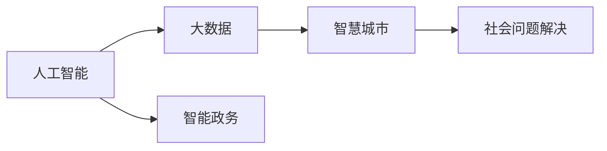

                 

# 科技创新：社会治理的新思路

> 关键词：科技创新, 社会治理, 人工智能, 大数据, 智慧城市, 智能政务, 社会问题解决, 公共服务优化

## 1. 背景介绍

### 1.1 问题由来

在全球化和技术加速发展的大背景下，社会治理面临着前所未有的挑战。传统社会治理模式依赖于人工管理，信息共享不够及时，治理效率较低，容易忽视一些细微但重要的社会问题。加之社会问题的复杂性、动态性，给社会治理带来了巨大的压力。

特别是新冠疫情爆发以来，社会治理的难度进一步加大，政府、企业、民众等多方协同合作的需求日益增强。这促使社会治理需要更加智能、高效、透明和灵活的解决方案。在此背景下，科技创新应运而生，成为推动社会治理模式变革的重要引擎。

### 1.2 问题核心关键点

科技创新在社会治理中的应用，主要聚焦于以下几个关键点：

- **智能决策**：利用人工智能技术对海量数据进行深度分析，支持决策者的决策过程。
- **数据驱动**：以大数据为核心，实现对社会现象、问题、趋势的实时监测和预测。
- **智慧城市**：通过物联网、云计算、人工智能等技术，构建智能、高效、可持续的城市基础设施。
- **智能政务**：优化政府服务流程，提高行政效率，提供更高效、便捷的公共服务。
- **社会问题解决**：创新性地利用人工智能和大数据分析技术，解决诸如公共卫生、教育不平等、环境保护等社会问题。

这些关键点共同构成了科技创新在社会治理中的全新思路和框架。

## 2. 核心概念与联系

### 2.1 核心概念概述

在本文中，我们将重点讨论几个关键的概念及其联系：

- **人工智能(AI)**：利用计算机算法和数据，使机器模拟人类的智能行为，包括学习、推理、感知和自我修正等。
- **大数据(Big Data)**：指以海量、高速、多样化的数据集为特征的数据集。
- **智慧城市(Smart City)**：利用物联网、云计算、大数据、人工智能等技术，提升城市管理和服务的智能化水平。
- **智能政务(Intelligent Government)**：通过数字化手段优化政府服务流程，提升行政效率，构建更透明、高效的公共服务体系。
- **社会问题解决(Social Problem Solving)**：通过数据驱动和智能化手段，有效识别、分析和解决社会问题。

这些核心概念通过如下Mermaid流程图展现了它们之间的联系：



该流程图直观地展示了人工智能、大数据、智慧城市、智能政务和社会问题解决等概念之间的逻辑关系和相互作用。

## 3. 核心算法原理 & 具体操作步骤

### 3.1 算法原理概述

科技创新在社会治理中的应用，主要依赖于以下几个算法原理：

1. **数据驱动决策**：通过收集和分析海量数据，提取有价值的信息，辅助决策者进行更科学的决策。
2. **人工智能模型**：利用机器学习、深度学习等算法，构建智能决策模型，预测和处理复杂问题。
3. **实时监测与预警**：基于物联网和大数据技术，实现对社会问题的实时监测和预警。
4. **智能治理引擎**：构建可复用的智能治理引擎，支持各类社会治理场景。
5. **社交媒体分析**：利用自然语言处理和情感分析技术，分析社交媒体数据，获取社会情绪和舆情动态。

### 3.2 算法步骤详解

以下是科技创新在社会治理中应用的详细步骤：

**Step 1: 数据收集与预处理**

- 通过传感器、移动设备、社交媒体等渠道，收集各类数据。
- 数据预处理包括数据清洗、去重、标准化等操作，保证数据质量。

**Step 2: 数据存储与管理**

- 利用大数据平台如Hadoop、Spark等，存储和管理大规模数据。
- 采用数据仓库和数据湖技术，构建统一的数据管理架构。

**Step 3: 数据挖掘与分析**

- 利用机器学习、深度学习等算法，从数据中提取有价值的信息。
- 通过时间序列分析、异常检测等方法，进行数据挖掘和特征提取。

**Step 4: 智能模型构建与训练**

- 基于数据挖掘结果，设计适合的算法模型。
- 在大量数据集上进行训练，优化模型参数。

**Step 5: 模型部署与应用**

- 将训练好的模型部署到生产环境，进行实时监测和预测。
- 构建智能治理引擎，支持社会治理场景的应用。

**Step 6: 结果评估与反馈**

- 定期评估模型性能，进行结果的可视化展示。
- 根据评估结果，调整模型参数，优化模型性能。

### 3.3 算法优缺点

科技创新在社会治理中的应用，具有以下优点：

1. **效率提升**：通过自动化流程和智能决策，大幅提升社会治理的效率。
2. **精确性提高**：大数据和人工智能的结合，使决策过程更加精准和科学。
3. **透明度增强**：数据驱动的决策过程，提高了社会治理的透明度和可追溯性。
4. **灵活性增加**：算法模型的可扩展性和适应性，支持动态调整和优化。

同时，该方法也存在一定的局限性：

1. **数据隐私问题**：大规模数据收集和存储可能引发隐私泄露风险。
2. **模型偏见**：算法模型可能受到训练数据的影响，存在偏见和歧视。
3. **技术壁垒**：高技术要求可能限制了中小城市的推广应用。
4. **成本较高**：大规模数据和复杂算法的应用，需要较高的资金投入和技术支持。
5. **依赖外部环境**：算法模型的性能和效果，依赖于外部环境的变化。

### 3.4 算法应用领域

科技创新在社会治理中的应用，涵盖多个领域：

1. **公共卫生管理**：利用人工智能和大数据分析，实时监测疾病传播，优化公共卫生资源配置。
2. **环境保护**：通过物联网和大数据技术，监测空气质量、水质、噪声等环境指标，支持环境决策。
3. **教育公平**：通过智能教育平台，提供个性化学习方案，缩小教育资源差距。
4. **交通管理**：利用交通大数据和AI技术，优化交通流量管理，提升道路安全和效率。
5. **安全监控**：采用智能视频分析和大数据分析，提升公共安全监测和预警能力。

这些领域的应用，展示了科技创新在社会治理中的广泛前景和深远影响。

## 4. 数学模型和公式 & 详细讲解 & 举例说明

### 4.1 数学模型构建

在社会治理应用中，我们通常使用以下数学模型进行建模：

1. **时间序列模型**：用于预测社会现象随时间的变化趋势。
   $$
   y_t = \alpha + \beta t + \gamma y_{t-1} + \epsilon_t
   $$
   其中，$y_t$ 为第 $t$ 期的预测值，$t$ 为时间，$\alpha$、$\beta$、$\gamma$ 为模型参数，$\epsilon_t$ 为随机误差项。

2. **异常检测模型**：用于识别异常情况和风险。
   $$
   y_i = \sum_{j=1}^n \alpha_j z_i^{(j)} + \epsilon_i
   $$
   其中，$y_i$ 为第 $i$ 个样本的异常得分，$z_i^{(j)}$ 为样本的第 $j$ 个特征，$\alpha_j$ 为特征权重，$\epsilon_i$ 为随机误差项。

3. **决策树模型**：用于处理分类问题。
   $$
   T = \left\{(r_i, V_i, T_i, L_i)\right\}_{i=1}^m
   $$
   其中，$T$ 为决策树，$r_i$ 为第 $i$ 个样本的特征，$V_i$ 为对应的特征值，$T_i$ 为划分后的子树，$L_i$ 为叶子节点。

4. **神经网络模型**：用于处理复杂的非线性关系。
   $$
   y = \sum_{i=1}^n w_i h_i + b
   $$
   其中，$y$ 为输出，$h_i$ 为输入，$w_i$ 为权重，$b$ 为偏置项。

### 4.2 公式推导过程

下面以时间序列模型为例，推导其推导过程。

假设我们有一组数据：

- 时间序列 $y_t = [y_1, y_2, \dots, y_n]$
- 时间 $t = [1, 2, \dots, n]$

假设模型为：

$$
y_t = \alpha + \beta t + \gamma y_{t-1} + \epsilon_t
$$

其中，$\epsilon_t$ 服从均值为0，方差为 $\sigma^2$ 的正态分布。

模型参数 $\alpha$、$\beta$、$\gamma$ 的估计可以通过最小二乘法实现：

$$
\hat{\alpha}, \hat{\beta}, \hat{\gamma} = \arg\min_{\alpha, \beta, \gamma} \sum_{i=1}^n (y_i - \alpha - \beta i - \gamma y_{i-1})^2
$$

假设 $\epsilon_t$ 的方差为 $\sigma^2$，则：

$$
\hat{\alpha}, \hat{\beta}, \hat{\gamma} = \arg\min_{\alpha, \beta, \gamma} \sum_{i=1}^n \left(\frac{y_i - \alpha - \beta i - \gamma y_{i-1}}{\sigma}\right)^2
$$

将其写成矩阵形式：

$$
\mathbf{y} = \mathbf{X} \boldsymbol{\theta} + \boldsymbol{\epsilon}
$$

其中，$\mathbf{y} = [y_1, y_2, \dots, y_n]^T$，$\mathbf{X} = \begin{bmatrix} 1 & 1 & y_0 \\ 1 & 2 & y_1 \\ \vdots & \vdots & \vdots \\ 1 & n & y_{n-1} \end{bmatrix}$，$\boldsymbol{\theta} = [\alpha, \beta, \gamma]^T$，$\boldsymbol{\epsilon} = [\epsilon_1, \epsilon_2, \dots, \epsilon_n]^T$。

利用最小二乘法求解 $\boldsymbol{\theta}$：

$$
\boldsymbol{\theta} = (\mathbf{X}^T \mathbf{X})^{-1} \mathbf{X}^T \mathbf{y}
$$

### 4.3 案例分析与讲解

以智能交通管理为例，介绍科技创新在社会治理中的应用。

假设某城市交通拥堵情况如下：

- 历史数据 $y_t = [y_1, y_2, \dots, y_n]$
- 时间 $t = [1, 2, \dots, n]$

其中，$y_t$ 表示第 $t$ 天的交通拥堵指数。

通过时间序列模型，可以建立如下关系：

$$
y_t = \alpha + \beta t + \gamma y_{t-1} + \epsilon_t
$$

假设 $\alpha = 0.5$，$\beta = 0.2$，$\gamma = 0.8$，$\sigma^2 = 0.1$，利用历史数据进行模型训练和预测，可以得到未来若干天的交通拥堵指数。

利用预测结果，城市交通管理部门可以采取措施，如调整红绿灯时序、优化路网结构、控制车流量等，以缓解交通拥堵问题。

## 5. 项目实践：代码实例和详细解释说明

### 5.1 开发环境搭建

在进行科技创新在社会治理中的应用开发时，需要准备好开发环境。以下是使用Python进行PyTorch开发的环境配置流程：

1. 安装Anaconda：从官网下载并安装Anaconda，用于创建独立的Python环境。

2. 创建并激活虚拟环境：
```bash
conda create -n pytorch-env python=3.8 
conda activate pytorch-env
```

3. 安装PyTorch：根据CUDA版本，从官网获取对应的安装命令。例如：
```bash
conda install pytorch torchvision torchaudio cudatoolkit=11.1 -c pytorch -c conda-forge
```

4. 安装相关库：
```bash
pip install pandas numpy matplotlib sklearn
```

完成上述步骤后，即可在`pytorch-env`环境中开始项目实践。

### 5.2 源代码详细实现

下面我们以智能交通管理为例，给出使用PyTorch进行时间序列模型训练的代码实现。

首先，定义数据处理函数：

```python
import pandas as pd
import numpy as np
from sklearn.preprocessing import MinMaxScaler
from torch.utils.data import Dataset, DataLoader
from torch import nn
from torch.nn import functional as F
from sklearn.metrics import mean_squared_error

class TrafficDataset(Dataset):
    def __init__(self, data, window_size=10):
        self.data = data
        self.window_size = window_size
        self.scaler = MinMaxScaler()
        
    def __len__(self):
        return len(self.data) - self.window_size
    
    def __getitem__(self, index):
        x = self.data.iloc[index:index+self.window_size]
        y = self.data.iloc[index+self.window_size]
        x = self.scaler.fit_transform(x.values)
        return x, y
    
class TimeSeriesModel(nn.Module):
    def __init__(self, input_size, output_size, hidden_size=50):
        super(TimeSeriesModel, self).__init__()
        self.rnn = nn.RNN(input_size, hidden_size, batch_first=True)
        self.fc = nn.Linear(hidden_size, output_size)
        
    def forward(self, x):
        x = self.rnn(x)
        x = self.fc(x[:, -1])
        return x

# 数据加载
data = pd.read_csv('traffic_data.csv', parse_dates=['date'], index_col='date')
data = data['traffic_flow'].resample('D').mean()
data = data.to_frame('traffic_flow').dropna().reset_index()

# 数据标准化
data_scaled = MinMaxScaler().fit_transform(data.values)

# 定义训练集和测试集
train_data = data_scaled.iloc[:200]
test_data = data_scaled.iloc[200:]

# 定义训练集和测试集的数据集
train_dataset = TrafficDataset(train_data, window_size=10)
test_dataset = TrafficDataset(test_data, window_size=10)

# 定义模型和优化器
model = TimeSeriesModel(input_size=1, output_size=1)
optimizer = torch.optim.Adam(model.parameters(), lr=0.01)

# 训练模型
def train(model, dataset, optimizer, epochs=100):
    dataloader = DataLoader(dataset, batch_size=10, shuffle=True)
    losses = []
    for epoch in range(epochs):
        running_loss = 0.0
        for i, data in enumerate(dataloader, 0):
            inputs, targets = data
            optimizer.zero_grad()
            outputs = model(inputs)
            loss = F.mse_loss(outputs, targets)
            loss.backward()
            optimizer.step()
            running_loss += loss.item()
        losses.append(running_loss / len(dataloader))
    return losses

# 训练模型
train_losses = train(model, train_dataset, optimizer)

# 在测试集上进行测试
def test(model, dataset):
    dataloader = DataLoader(dataset, batch_size=10, shuffle=False)
    predictions = []
    targets = []
    for data in dataloader:
        inputs, targets = data
        outputs = model(inputs)
        predictions.append(outputs.data.numpy())
        targets.append(targets.data.numpy())
    predictions = np.concatenate(predictions, axis=0)
    targets = np.concatenate(targets, axis=0)
    mse = mean_squared_error(targets, predictions)
    return mse

test_loss = test(model, test_dataset)
print(f'Test MSE: {test_loss}')
```

以上就是使用PyTorch进行时间序列模型训练的完整代码实现。

### 5.3 代码解读与分析

让我们再详细解读一下关键代码的实现细节：

**TrafficDataset类**：
- `__init__`方法：初始化数据和窗口大小，标准化数据。
- `__len__`方法：返回数据集长度。
- `__getitem__`方法：对单个样本进行处理，获取输入和输出，并进行标准化。

**TimeSeriesModel类**：
- `__init__`方法：初始化RNN和全连接层。
- `forward`方法：进行前向传播，输出预测结果。

**数据加载**：
- 利用Pandas读取数据，并进行数据处理。
- 利用MinMaxScaler对数据进行标准化处理。
- 将数据按时间分为训练集和测试集。

**模型训练**：
- 定义模型、优化器和损失函数。
- 在训练集上训练模型，记录损失值。
- 在测试集上测试模型，计算均方误差。

通过以上代码，我们可以构建一个基本的智能交通管理系统，利用时间序列模型进行交通流量预测，支持城市交通管理部门的决策和优化。

## 6. 实际应用场景

### 6.1 智能交通管理

智能交通管理系统通过收集实时交通流量数据，利用时间序列模型和深度学习技术，预测未来若干天的交通流量。基于预测结果，城市交通管理部门可以采取措施，如调整红绿灯时序、优化路网结构、控制车流量等，以缓解交通拥堵问题。

具体应用如下：

1. **数据采集与清洗**：通过交通传感器、车载GPS、摄像头等设备，采集交通流量、车速、车辆类型等数据，并进行清洗和预处理。
2. **数据存储与管理**：利用大数据平台如Hadoop、Spark等，存储和管理大规模交通数据。
3. **模型训练与预测**：利用时间序列模型和深度学习技术，训练预测模型，进行交通流量预测。
4. **结果展示与反馈**：将预测结果可视化展示，供城市交通管理部门进行决策和优化。

### 6.2 环境保护

环境保护管理通过物联网和大数据技术，监测空气质量、水质、噪声等环境指标，利用AI技术进行数据分析和预测，支持环境保护决策。

具体应用如下：

1. **数据采集与清洗**：通过环境监测设备，采集空气质量、水质、噪声等环境数据，并进行清洗和预处理。
2. **数据存储与管理**：利用大数据平台如Hadoop、Spark等，存储和管理大规模环境数据。
3. **模型训练与预测**：利用AI技术，训练预测模型，进行环境指标预测和分析。
4. **结果展示与反馈**：将预测结果可视化展示，供环境保护部门进行决策和优化。

### 6.3 教育公平

智能教育平台通过大数据和AI技术，提供个性化学习方案，缩小教育资源差距，促进教育公平。

具体应用如下：

1. **数据采集与清洗**：通过学习管理系统(LMS)等设备，采集学生学习数据，并进行清洗和预处理。
2. **数据存储与管理**：利用大数据平台如Hadoop、Spark等，存储和管理大规模学习数据。
3. **模型训练与预测**：利用AI技术，训练推荐模型，进行个性化学习方案推荐。
4. **结果展示与反馈**：将推荐结果展示给学生和教师，供教学决策和优化。

## 7. 工具和资源推荐

### 7.1 学习资源推荐

为了帮助开发者系统掌握科技创新在社会治理中的应用理论基础和实践技巧，这里推荐一些优质的学习资源：

1. 《人工智能：原理与技术》书籍：全面介绍人工智能的基本原理和技术，是学习人工智能的重要参考书。
2. 《深度学习》课程：由斯坦福大学开设，介绍深度学习的基本原理和实践应用。
3. 《大数据技术与应用》课程：介绍大数据的基本概念和应用，涵盖数据采集、存储、处理等各个环节。
4. 《智慧城市建设》书籍：介绍智慧城市的基本概念和应用，涵盖智能交通、智能安防、智能医疗等多个领域。
5. 《智能政务》课程：介绍智能政务的基本概念和应用，涵盖电子政务、电子健康、电子教育等多个领域。

通过对这些资源的学习实践，相信你一定能够快速掌握科技创新在社会治理中的应用精髓，并用于解决实际的治理问题。

### 7.2 开发工具推荐

高效的开发离不开优秀的工具支持。以下是几款用于科技创新在社会治理中应用的开发工具：

1. PyTorch：基于Python的开源深度学习框架，灵活高效，适合深度学习模型的开发和训练。
2. TensorFlow：由Google主导开发的开源深度学习框架，支持大规模分布式计算，适合大规模工程应用。
3. Weights & Biases：模型训练的实验跟踪工具，记录和可视化模型训练过程中的各项指标，方便对比和调优。
4. TensorBoard：TensorFlow配套的可视化工具，实时监测模型训练状态，提供丰富的图表呈现方式。
5. Jupyter Notebook：交互式编程环境，适合数据处理、模型训练和结果展示。
6. Apache Spark：大数据处理框架，支持大规模数据存储和处理，适合大数据应用开发。

合理利用这些工具，可以显著提升科技创新在社会治理中的应用开发效率，加快创新迭代的步伐。

### 7.3 相关论文推荐

科技创新在社会治理中的应用源于学界的持续研究。以下是几篇奠基性的相关论文，推荐阅读：

1. 《深度学习在交通流量预测中的应用》：介绍深度学习在智能交通管理中的应用。
2. 《基于大数据的环境监测与预测》：介绍大数据在环境保护中的应用。
3. 《智能教育平台的设计与实现》：介绍智能教育平台的设计与实现。
4. 《智慧城市的构建与优化》：介绍智慧城市的基本概念和应用。
5. 《智能政务系统的设计与实现》：介绍智能政务系统的设计与实现。

这些论文代表了大数据和人工智能技术在社会治理中的应用脉络。通过学习这些前沿成果，可以帮助研究者把握学科前进方向，激发更多的创新灵感。

## 8. 总结：未来发展趋势与挑战

### 8.1 总结

本文对科技创新在社会治理中的应用进行了全面系统的介绍。首先阐述了科技创新在社会治理中的研究背景和意义，明确了其在智能决策、数据驱动、智慧城市、智能政务、社会问题解决等关键领域的应用价值。其次，从原理到实践，详细讲解了时间序列模型、异常检测模型、决策树模型、神经网络模型的构建和推导，给出了具体的代码实现和案例分析。最后，我们探讨了科技创新在社会治理中的应用场景，并推荐了相关的学习资源和开发工具。

通过本文的系统梳理，可以看到，科技创新在社会治理中的应用正在成为推动治理模式变革的重要引擎，具有广阔的前景和深远的影响。

### 8.2 未来发展趋势

展望未来，科技创新在社会治理中的应用将呈现以下几个发展趋势：

1. **智能化水平提升**：随着AI技术的不断发展，社会治理的智能化水平将进一步提升，实现更高效、精准、智能的决策过程。
2. **数据驱动决策**：大数据技术将更加深入地融入社会治理，支持决策者进行数据驱动决策，提高治理效率和科学性。
3. **全域感知能力增强**：物联网和大数据技术将进一步普及，提升社会治理的全域感知能力，实现实时监测和预测。
4. **跨领域协同治理**：智慧城市、智能政务等应用将实现跨领域协同治理，形成更系统、更高效的治理体系。
5. **公众参与机制完善**：利用社交媒体分析等技术，完善公众参与机制，提升社会治理的透明度和公众满意度。
6. **伦理与隐私保护**：注重数据隐私和伦理问题的保护，确保社会治理的公正性和安全性。

这些趋势展示了科技创新在社会治理中的广阔前景和深远影响。相信未来在学界和产业界的共同努力下，科技创新将成为构建高效、透明、智能、可持续的社会治理体系的关键。

### 8.3 面临的挑战

尽管科技创新在社会治理中的应用已经取得了显著成果，但在迈向更加智能化、普适化应用的过程中，仍面临诸多挑战：

1. **技术复杂性**：AI和大数据技术的复杂性可能限制其在小城市的推广应用。
2. **数据隐私和安全**：大规模数据收集和存储可能引发隐私泄露风险。
3. **技术壁垒**：高技术要求可能限制了中小城市的推广应用。
4. **成本较高**：大规模数据和复杂算法的应用，需要较高的资金投入和技术支持。
5. **依赖外部环境**：算法模型的性能和效果，依赖于外部环境的变化。

### 8.4 研究展望

未来在科技创新在社会治理中的应用研究中，需要在以下几个方面进行更多探索：

1. **数据隐私保护**：开发更安全、可靠的数据存储和传输技术，确保数据隐私和安全。
2. **跨领域协同治理**：建立跨领域、跨部门的数据共享机制，实现协同治理。
3. **智能决策支持**：构建更加智能的决策支持系统，辅助决策者进行科学决策。
4. **公众参与机制**：利用社交媒体分析等技术，完善公众参与机制，提升社会治理的透明度和公众满意度。
5. **模型可解释性**：开发更可解释、可理解的AI模型，提高社会治理的可信度和透明度。
6. **伦理与法规约束**：建立伦理与法规约束机制，确保社会治理的公正性和安全性。

总之，科技创新在社会治理中的应用需要多学科、多领域的协同发力，共同推动构建高效、透明、智能、可持续的社会治理体系。面向未来，科技创新将在构建人机协同的智能社会中扮演越来越重要的角色，推动社会治理的持续进步和发展。

## 9. 附录：常见问题与解答

**Q1: 科技创新在社会治理中面临哪些挑战？**

A: 科技创新在社会治理中面临的挑战包括但不限于以下几点：

1. **技术复杂性**：AI和大数据技术的复杂性可能限制其在小城市的推广应用。
2. **数据隐私和安全**：大规模数据收集和存储可能引发隐私泄露风险。
3. **技术壁垒**：高技术要求可能限制了中小城市的推广应用。
4. **成本较高**：大规模数据和复杂算法的应用，需要较高的资金投入和技术支持。
5. **依赖外部环境**：算法模型的性能和效果，依赖于外部环境的变化。

**Q2: 如何在社会治理中有效利用大数据？**

A: 在社会治理中有效利用大数据，可以遵循以下步骤：

1. **数据收集**：通过传感器、移动设备、社交媒体等渠道，收集各类数据。
2. **数据清洗**：对数据进行清洗、去重、标准化等操作，保证数据质量。
3. **数据存储与管理**：利用大数据平台如Hadoop、Spark等，存储和管理大规模数据。
4. **数据挖掘与分析**：利用机器学习、深度学习等算法，从数据中提取有价值的信息。
5. **模型训练与预测**：基于数据挖掘结果，设计适合的算法模型，进行预测和决策支持。
6. **结果展示与反馈**：将分析结果可视化展示，供决策者进行决策和优化。

**Q3: 如何构建智能交通管理系统？**

A: 构建智能交通管理系统可以遵循以下步骤：

1. **数据采集与清洗**：通过交通传感器、车载GPS、摄像头等设备，采集交通流量、车速、车辆类型等数据，并进行清洗和预处理。
2. **数据存储与管理**：利用大数据平台如Hadoop、Spark等，存储和管理大规模交通数据。
3. **模型训练与预测**：利用时间序列模型和深度学习技术，训练预测模型，进行交通流量预测。
4. **结果展示与反馈**：将预测结果可视化展示，供城市交通管理部门进行决策和优化。

**Q4: 如何确保数据隐私和安全？**

A: 确保数据隐私和安全可以采取以下措施：

1. **数据匿名化**：对数据进行匿名化处理，确保数据无法追溯到个人。
2. **加密存储**：采用数据加密技术，保护数据在存储和传输过程中的安全。
3. **访问控制**：建立严格的访问控制机制，确保只有授权人员能够访问敏感数据。
4. **数据共享协议**：制定数据共享协议，明确数据使用范围和保护措施。
5. **法规合规**：遵守相关的数据隐私法律法规，确保数据使用合规。

**Q5: 如何在智慧城市中应用大数据和AI技术？**

A: 在智慧城市中应用大数据和AI技术可以遵循以下步骤：

1. **数据采集与清洗**：通过物联网设备、传感器、社交媒体等渠道，采集各类数据，并进行清洗和预处理。
2. **数据存储与管理**：利用大数据平台如Hadoop、Spark等，存储和管理大规模数据。
3. **模型训练与预测**：利用AI技术，训练预测模型，进行智慧城市管理和服务。
4. **结果展示与反馈**：将分析结果可视化展示，供城市管理者进行决策和优化。

通过以上步骤，可以有效利用大数据和AI技术，提升智慧城市的智能化水平，实现更加高效、透明、智能的治理和管理。

总之，科技创新在社会治理中的应用具有广阔的前景和深远的影响。通过系统梳理和深入分析，相信读者能够更好地理解其核心概念和关键技术，掌握其应用方法，推动科技创新在社会治理中的应用与发展。

---

作者：禅与计算机程序设计艺术 / Zen and the Art of Computer Programming

