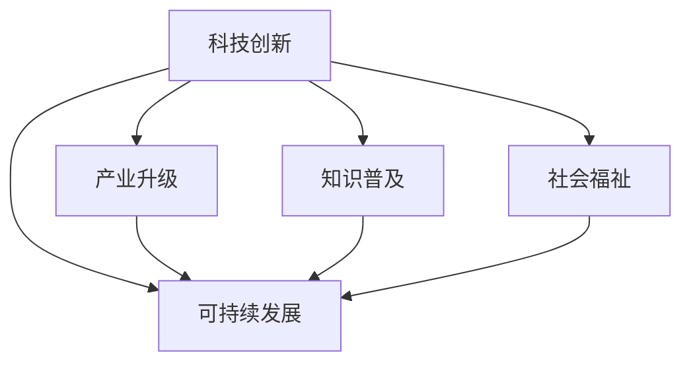

                 

## 1. 背景介绍

### 1.1 问题由来

随着科技的迅猛发展，创新驱动成为社会发展的重要引擎。科技创新不仅推动了产业结构的转型升级，也深刻改变了人类的生产生活方式。特别是信息技术、生物技术、新材料等领域的突破性进展，为社会进步注入了新的活力。本文旨在探讨科技创新如何成为社会进步的阶梯，帮助读者理解科技创新在各个领域的贡献和影响。

### 1.2 问题核心关键点

科技创新能够推动社会进步，其关键在于：

- **技术突破**：新技术的出现为社会提供了新的工具和手段，提升生产力水平。
- **产业升级**：科技创新带动相关产业的升级，优化资源配置，提高经济效率。
- **知识普及**：科技创新促使新知识、新方法的产生和传播，推动教育和培训的发展。
- **社会福祉**：科技创新改善了医疗、教育、交通等民生领域，提升了公众生活质量。

本文将重点围绕科技创新对社会进步的贡献展开讨论，并结合实际案例，详细阐述科技创新在不同领域的具体应用和影响。

## 2. 核心概念与联系

### 2.1 核心概念概述

为更好地理解科技创新如何推动社会进步，本节将介绍几个密切相关的核心概念：

- **科技创新**：指通过科学研究和技术开发，产生新知识、新方法和新技术的过程。科技创新是推动社会发展的核心动力。
- **产业升级**：通过引入新技术和新工艺，提升产业的效率和质量，推动产业结构的优化和升级。
- **知识普及**：新知识的传播和应用，使得更多人掌握新技术，提升自身能力。
- **社会福祉**：科技创新改善了公共服务，提升了民众的生活质量和幸福感。
- **可持续发展**：科技创新在环境保护、资源节约等方面起到重要作用，推动社会可持续发展。

这些核心概念之间的逻辑关系可以通过以下Mermaid流程图来展示：



这个流程图展示了一个由科技创新出发，通过不同路径推动社会进步的逻辑框架：

1. 科技创新通过产业升级，直接提升生产力和经济效益。
2. 科技创新推动知识普及，提高全民素质，形成人才红利。
3. 科技创新通过社会福祉提升，直接改善民众生活，形成社会共识。
4. 科技创新在可持续发展中起到关键作用，推动绿色经济和环境保护。

## 3. 核心算法原理 & 具体操作步骤

### 3.1 算法原理概述

科技创新是社会进步的阶梯，其核心在于通过新技术和新方法，提升生产效率和生活质量。科技创新的过程可以视为一个算法问题，其原理和操作步骤如下：

**Step 1: 发现问题**
- 识别现实中的问题和挑战，如生产力低下、疾病预防、环境污染等。

**Step 2: 研究探索**
- 通过科学研究和技术开发，探索问题的解决方案。

**Step 3: 技术研发**
- 开发新技术和新方法，并进行原型设计和实验验证。

**Step 4: 应用推广**
- 将新技术和新方法应用到实际场景中，形成大规模应用。

**Step 5: 持续迭代**
- 根据应用反馈和技术进展，持续优化和改进，形成良性循环。

### 3.2 算法步骤详解

科技创新推动社会进步的具体操作步骤如下：

**Step 1: 发现问题**
- 通过数据分析、用户反馈、社会调查等方式，识别出需要解决的问题。

**Step 2: 研究探索**
- 组织科研团队，进行文献综述、实验设计、理论推导等科学研究。
- 探索现有技术的局限性，寻找突破口。

**Step 3: 技术研发**
- 根据研究结果，设计和实现新技术。
- 进行原型测试和迭代优化。

**Step 4: 应用推广**
- 在实际场景中应用新技术，进行大规模试点。
- 收集反馈数据，优化产品和服务。

**Step 5: 持续迭代**
- 根据用户反馈和市场需求，持续进行技术创新和优化。
- 通过持续改进，提升技术成熟度和应用效果。

### 3.3 算法优缺点

科技创新在推动社会进步中，具有以下优点：

- **效率提升**：新技术的引入可以大幅提升生产效率和生活质量。
- **知识更新**：科技创新不断推动知识的更新和传播，形成知识迭代。
- **产业升级**：新技术推动产业升级，优化资源配置。
- **社会福祉**：科技创新改善民生，提升公众幸福感。

同时，科技创新也存在一些局限性：

- **投入成本高**：研发新技术需要大量资金投入，存在较高的失败风险。
- **创新周期长**：从研发到应用推广需要较长时间，周期较长。
- **伦理争议**：一些新技术可能带来伦理争议，需要慎重考虑。
- **依赖性强**：科技创新依赖于科研能力和资源，存在不确定性。

### 3.4 算法应用领域

科技创新在多个领域都发挥了重要作用，具体如下：

**信息技术**
- 推动了互联网、大数据、云计算等技术的发展，改变了信息获取和传播方式。

**生物技术**
- 在医药、农业、环境等领域发挥作用，推动了生物药物研发、基因编辑、精准农业等应用。

**新材料**
- 开发新型材料，提升产品性能和生产效率，推动制造业升级。

**智能制造**
- 应用人工智能、机器人技术，实现生产自动化、智能化，提升生产效率和质量。

**环保科技**
- 推动清洁能源、循环经济等环保技术的发展，推动绿色可持续发展。

## 4. 数学模型和公式 & 详细讲解 & 举例说明

### 4.1 数学模型构建

为了更好地理解科技创新对社会进步的影响，我们构建以下数学模型：

- **生产力提升模型**：$P = f(T)$，其中 $P$ 为生产力，$T$ 为技术水平。
- **知识普及模型**：$K = g(P, E)$，其中 $K$ 为知识普及程度，$E$ 为教育水平。
- **社会福祉模型**：$W = h(P, K, H)$，其中 $W$ 为社会福祉，$H$ 为卫生水平。
- **可持续发展模型**：$S = i(P, W, R)$，其中 $S$ 为可持续发展水平，$R$ 为资源利用效率。

### 4.2 公式推导过程

以**生产力提升模型**为例，推导如下：

- **假设条件**：技术水平 $T$ 和生产力 $P$ 成正比。
- **模型公式**：$P = kT$，其中 $k$ 为比例系数。
- **解释说明**：技术水平提升，可以大幅提升生产力水平。

类似地，**知识普及模型**和**社会福祉模型**的推导过程如下：

- **知识普及模型**：$K = g(P, E) = k_1P + k_2E$，其中 $g$ 为知识普及函数，$k_1$ 和 $k_2$ 为系数。
- **社会福祉模型**：$W = h(P, K, H) = k_3P + k_4K + k_5H$，其中 $h$ 为社会福祉函数。

### 4.3 案例分析与讲解

**案例1: 信息技术对经济的影响**
- **背景**：互联网技术的发展极大地提高了信息获取和传播效率。
- **分析**：信息技术的普及，使得企业能够更快速地获取市场信息，提升决策效率，进而提升整体生产力。
- **结论**：信息技术的发展显著提升了经济效率和社会福祉。

**案例2: 生物技术在医疗中的应用**
- **背景**：基因编辑技术的发展，为精准医疗提供了新手段。
- **分析**：基因编辑技术的应用，使得医生能够更精准地诊断和治疗疾病，提升医疗服务质量。
- **结论**：生物技术的发展显著改善了医疗服务，提升了公众健康水平。

## 5. 项目实践：代码实例和详细解释说明

### 5.1 开发环境搭建

在进行科技创新项目开发前，我们需要准备好开发环境。以下是使用Python进行OpenAI GPT-3开发的常见环境配置流程：

1. 安装Anaconda：从官网下载并安装Anaconda，用于创建独立的Python环境。
2. 创建并激活虚拟环境：
```bash
conda create -n openai-gpt python=3.8 
conda activate openai-gpt
```

3. 安装PyTorch：根据CUDA版本，从官网获取对应的安装命令。例如：
```bash
conda install pytorch torchvision torchaudio cudatoolkit=11.1 -c pytorch -c conda-forge
```

4. 安装OpenAI GPT-3 API：
```bash
pip install openai
```

5. 安装TensorBoard：
```bash
pip install tensorboard
```

完成上述步骤后，即可在`openai-gpt`环境中开始OpenAI GPT-3开发。

### 5.2 源代码详细实现

下面我们以文本生成应用为例，给出使用OpenAI GPT-3进行代码生成的PyTorch代码实现。

```python
import openai
from transformers import GPT2LMHeadModel, GPT2Tokenizer
import torch

openai.api_key = 'YOUR_API_KEY'

def generate_text(prompt, num_tokens):
    tokenizer = GPT2Tokenizer.from_pretrained('gpt2')
    model = GPT2LMHeadModel.from_pretrained('gpt2')
    model.eval()

    inputs = tokenizer.encode(prompt, return_tensors='pt')
    outputs = model.generate(inputs, max_length=num_tokens, top_p=0.9, temperature=1.0, num_return_sequences=1)
    generated_text = tokenizer.decode(outputs[0], skip_special_tokens=True)

    return generated_text

# 示例
print(generate_text("写一段Python代码生成文本", 50))
```

### 5.3 代码解读与分析

让我们再详细解读一下关键代码的实现细节：

**generate_text函数**：
- 初始化GPT-2模型和tokenizer。
- 使用tokenizer将提示文本转换为模型接受的格式。
- 在模型上进行前向传播，生成文本。
- 将生成的文本使用tokenizer解码为可读文本。

**代码实例**：
- 调用generate_text函数，传入提示文本和生成的文本长度。
- 返回生成的文本。

## 6. 实际应用场景

### 6.1 智慧城市

基于科技创新，智慧城市可以实现智能交通、环境监测、公共安全等功能的提升。例如：

- **智能交通**：利用大数据和物联网技术，实现交通流量实时监测和智能调控，提高交通效率，减少拥堵。
- **环境监测**：通过传感器网络，实时监测空气质量、水质、噪音等环境指标，及时采取措施，改善生态环境。
- **公共安全**：应用人工智能技术，进行视频监控、异常行为检测，提高公共安全水平。

### 6.2 智能医疗

科技创新在医疗领域的应用，可以大幅提升医疗服务的效率和质量。例如：

- **精准医疗**：通过基因编辑、大数据分析等技术，实现个性化治疗，提高治愈率。
- **智能诊断**：利用深度学习技术，辅助医生进行影像分析、疾病诊断，提升诊断准确率。
- **远程医疗**：通过5G、云计算等技术，实现远程医疗服务，提高医疗资源的利用率。

### 6.3 智能制造

智能制造通过科技创新，实现了生产自动化、智能化，提升了生产效率和质量。例如：

- **智能制造**：应用机器人技术、自动化设备，实现生产过程的自动化。
- **生产优化**：通过大数据分析，优化生产流程，提升生产效率。
- **质量检测**：利用视觉检测技术，实现产品质量的自动化检测，提高检测精度。

### 6.4 未来应用展望

随着科技创新的不断推进，未来将在更多领域实现科技创新，带来新的变革。

**新材料**：新型材料的开发将推动制造业升级，提高生产效率和产品质量。

**环保科技**：清洁能源、循环经济等环保技术的发展，将推动绿色可持续发展。

**智能家居**：利用人工智能技术，实现家居自动化、智能化，提升生活质量。

**虚拟现实**：虚拟现实技术的发展，将改变人类感知和交互方式，拓展新应用场景。

**量子计算**：量子计算技术的突破，将大幅提升计算能力和数据处理速度，推动科学研究的进步。

## 7. 工具和资源推荐

### 7.1 学习资源推荐

为了帮助开发者系统掌握科技创新的理论基础和实践技巧，这里推荐一些优质的学习资源：

1. **Coursera**《科技创新与未来社会》课程：由顶尖高校和专家教授讲解，涵盖科技创新的全过程和未来展望。
2. **TED Talks**：汇集全球顶尖科学家和创新者的演讲，涵盖科技创新在各个领域的应用和影响。
3. **MIT OpenCourseWare**：麻省理工公开课平台，提供大量科技创新相关的课程和讲座资源。
4. **Science Daily**：科普网站，提供最新的科技新闻和研究进展，帮助了解科技创新动态。

通过对这些资源的学习实践，相信你一定能够全面掌握科技创新的方法和应用，为未来科技创新奠定坚实基础。

### 7.2 开发工具推荐

高效的开发离不开优秀的工具支持。以下是几款用于科技创新开发的常用工具：

1. **Jupyter Notebook**：交互式开发环境，支持Python、R等语言，方便实验和调试。
2. **Git**：版本控制系统，支持多人协作开发，便于代码管理和版本控制。
3. **Docker**：容器化工具，支持应用打包和部署，简化开发流程。
4. **Jenkins**：持续集成工具，支持自动化测试和部署，提高开发效率。
5. **AWS**：云服务平台，支持各种资源部署和应用开发，提供强大的计算和存储资源。

合理利用这些工具，可以显著提升科技创新项目的开发效率，加速技术创新和应用迭代。

### 7.3 相关论文推荐

科技创新是一个多学科交叉的研究领域，相关论文涵盖了各个方面。以下是几篇奠基性的相关论文，推荐阅读：

1. **《The Future of Jobs Report 2020》**：由World Economic Forum发布，预测未来20年内各行业就业变化，为科技创新提供方向。
2. **《The Second Machine Age》**：由Erik Brynjolfsson和Andrew McAfee撰写，探讨了机器学习、人工智能对社会的广泛影响。
3. **《Innovation Economics》**：由Mario J. Mattheij撰写，深入分析了科技创新的经济效应和政策建议。
4. **《Building a Digital Society》**：由World Economic Forum发布，探讨了数字技术对社会的影响和未来发展趋势。

这些论文代表了大科技创新理论的发展脉络。通过学习这些前沿成果，可以帮助研究者把握学科前进方向，激发更多的创新灵感。

## 8. 总结：未来发展趋势与挑战

### 8.1 总结

本文对科技创新如何成为社会进步的阶梯进行了全面系统的介绍。首先阐述了科技创新的背景和意义，明确了科技创新在推动社会进步中的独特价值。其次，从原理到实践，详细讲解了科技创新的数学模型和操作步骤，给出了科技创新任务开发的完整代码实例。同时，本文还广泛探讨了科技创新在智慧城市、智能医疗、智能制造等多个领域的具体应用和影响，展示了科技创新的广阔前景。最后，本文精选了科技创新技术的各类学习资源，力求为读者提供全方位的技术指引。

通过本文的系统梳理，可以看到，科技创新通过推动产业升级、知识普及、社会福祉、可持续发展等多个方面，为社会进步提供了坚实的基础。科技创新引领了多个领域的发展，推动了经济和社会全面进步。未来，伴随科技创新的不断演进，相信科技创新必将在更多领域发挥重要作用，推动人类社会迈向更加美好的未来。

### 8.2 未来发展趋势

展望未来，科技创新将呈现以下几个发展趋势：

**技术突破加快**：随着科学研究的不断深入，新技术和新方法将不断涌现，推动各个领域的创新和进步。

**跨学科融合**：科技创新需要多学科交叉合作，结合不同领域的知识和方法，实现更大的创新突破。

**智能技术普及**：人工智能、大数据等智能技术将普及到各个领域，提升生产力和社会福祉。

**可持续发展**：科技创新在环境保护、资源利用等方面起到重要作用，推动绿色经济和可持续发展。

**社会共识增强**：科技创新在社会中的应用将增强公众对科技的认同感和信任感，形成广泛的社会共识。

以上趋势凸显了科技创新的广阔前景。这些方向的探索发展，必将进一步提升科技创新的影响力，为社会进步注入新的动力。

### 8.3 面临的挑战

尽管科技创新在推动社会进步中已经取得了瞩目成就，但在迈向更加智能化、普适化应用的过程中，它仍面临诸多挑战：

**资源瓶颈**：科技创新需要大量资金、设备和人才投入，存在较高的成本和风险。

**伦理争议**：一些新技术可能带来伦理争议，需要慎重考虑和规范。

**社会适应**：科技创新对社会的影响是多方面的，需要公众理解和支持。

**技术安全**：科技创新在提升生产效率的同时，也带来了新的安全风险。

**知识更新**：科技创新需要不断学习新知识，掌握新方法，对个人和社会都提出了挑战。

正视科技创新的这些挑战，积极应对并寻求突破，将使科技创新更好地服务于社会进步。相信随着学界和产业界的共同努力，这些挑战终将一一被克服，科技创新必将在构建人机协同的智能时代中扮演越来越重要的角色。

### 8.4 研究展望

面向未来，科技创新的研究需要在以下几个方面寻求新的突破：

**跨学科创新**：结合不同领域的知识和研究方法，实现跨学科的创新突破。

**伦理和法律规范**：建立完善的伦理和法律规范，确保科技创新的安全性和公正性。

**可持续发展**：将可持续发展理念融入科技创新，推动绿色技术的发展。

**社会参与**：加强公众对科技创新的理解和支持，形成广泛的社会共识。

**技术普及**：推广普及新技术，提高全民素质，形成人才红利。

这些研究方向的探索，必将引领科技创新迈向更高的台阶，为构建安全、可靠、可解释、可控的智能系统铺平道路。面向未来，科技创新需要与其他人工智能技术进行更深入的融合，如知识表示、因果推理、强化学习等，多路径协同发力，共同推动自然语言理解和智能交互系统的进步。只有勇于创新、敢于突破，才能不断拓展语言模型的边界，让智能技术更好地造福人类社会。

## 9. 附录：常见问题与解答

**Q1：科技创新是如何推动社会进步的？**

A: 科技创新通过提升生产力、推动知识普及、改善社会福祉、促进可持续发展等多个方面，直接推动了社会进步。例如，信息技术提升了信息获取效率，生物技术改善了医疗服务，智能制造提高了生产效率。

**Q2：如何进行科技创新？**

A: 科技创新的过程包括发现问题、研究探索、技术研发、应用推广和持续迭代。需要组织跨学科团队，进行科学研究和实验验证，然后开发新技术，推广应用，不断优化和改进。

**Q3：科技创新面临哪些挑战？**

A: 科技创新面临资源瓶颈、伦理争议、社会适应、技术安全、知识更新等挑战。需要积极应对这些挑战，确保科技创新能够健康、持续地推动社会进步。

**Q4：未来科技创新将有哪些趋势？**

A: 未来科技创新将加快技术突破、跨学科融合、智能技术普及、可持续发展、社会共识增强等趋势。需要抓住这些趋势，推动科技创新不断进步。

**Q5：如何应对科技创新面临的挑战？**

A: 应对科技创新挑战需要建立完善的伦理和法律规范，推动跨学科合作，加强社会参与，提升公众对科技创新的理解和支持。同时，需要不断学习新知识，掌握新方法，提高全民素质，形成人才红利。

---

作者：禅与计算机程序设计艺术 / Zen and the Art of Computer Programming

