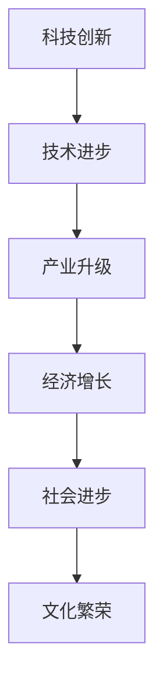

                 

# 科技创新：社会进步的阶梯

科技创新一直是推动人类社会发展的强大动力。从蒸汽机的发明到互联网的兴起，每一次科技的飞跃都深刻地改变了人类的生产生活方式。而随着信息技术、生物技术、新材料等领域的不断发展，科技创新更是成为解决当代全球性问题、实现可持续发展的重要手段。本文旨在从多个维度探讨科技创新对社会进步的阶梯作用，展示其在技术、经济、社会和文化等层面的深远影响。

## 1. 背景介绍

### 1.1 科技创新历史回顾
科技创新的历史源远流长。从古代的四大发明，到文艺复兴时期科学革命的爆发，再到工业革命带来的生产方式的根本变革，科技创新一直在引领人类社会前进的步伐。随着19世纪电力的广泛应用，人类社会进入电气化时代；20世纪电子计算的出现，更是将人类社会推向信息化时代。

进入21世纪，互联网和移动互联网的普及，标志着人类社会全面进入数字化时代。大数据、云计算、人工智能、区块链等新一代信息技术，正在重塑人类的生产、生活和社会形态。

### 1.2 科技创新现状与未来展望
当前，全球科技创新正处于新的历史交汇点。以5G、物联网、量子计算等为代表的新一代信息技术，正在开启新的产业变革，推动经济社会实现高质量发展。同时，生物技术、清洁能源、新材料等领域的技术突破，也为应对气候变化、实现绿色发展提供了新的动力。

展望未来，科技创新将在全球治理、公共卫生、环境保护、教育公平等关键领域发挥更大作用，为实现联合国2030年可持续发展目标提供有力支撑。

## 2. 核心概念与联系

### 2.1 核心概念概述

为更好地理解科技创新对社会进步的作用，本节将介绍几个密切相关的核心概念：

- 科技创新：通过科学研究和工程技术，产生新知识、新技术和新产品的活动。其目的是解决人类面临的重大挑战，推动经济社会发展和人类文明进步。

- 技术进步：科技成果的应用和推广过程，包括新产品、新工艺、新方法等的商业化、产业化。技术进步是科技创新成果转化为现实生产力的关键。

- 产业升级：通过新技术的引入，改造传统产业，提升产业的技术含量和附加值，实现产业的优化升级。

- 经济增长：科技进步带来的生产效率提高、成本降低、市场拓展，对经济增长的直接和间接推动作用。

- 社会进步：科技创新在提升生活质量、促进教育公平、减少贫困、提高治理能力等方面带来的社会效益。

- 文化繁荣：科技创新带来的文化艺术形式和传播方式的变革，促进文化的多样性和创新性。

这些核心概念之间的逻辑关系可以通过以下Mermaid流程图来展示：



这个流程图展示了一系列关键概念之间的联系：

1. 科技创新通过科学研究和工程技术产生新知识、新技术和新产品。
2. 技术进步将这些新科技成果应用于实际生产中，推动产业升级。
3. 产业升级带来生产效率的提高、成本的降低和市场拓展，促进经济增长。
4. 经济增长改善了生活质量、促进了教育公平、减少了贫困、提高了治理能力，推动社会进步。
5. 社会进步增强了文化多样性和创新性，促进了文化繁荣。

## 3. 核心算法原理 & 具体操作步骤

### 3.1 算法原理概述

科技创新的本质是知识和技术的积累与突破，其过程通常可以分为知识发现、技术研发和产业应用三个阶段。本文将通过理论模型的视角，从这三个阶段探讨科技创新对社会进步的作用。

1. **知识发现阶段**：通过科学研究，发现新的科学原理和理论，为技术创新奠定基础。这一过程涉及数学、物理、化学等多个学科的交叉融合，依赖于大量实验数据和科学假设的验证。

2. **技术研发阶段**：在知识发现的基础上，通过工程技术，将新理论和新原理转化为可应用的技术产品。这一过程包括材料设计、系统集成、软件开发等，依赖于工程经验和技术积累。

3. **产业应用阶段**：将新技术和新产品引入实际生产中，实现规模化应用和产业化。这一过程涉及市场推广、供应链管理、商业模式创新等，依赖于市场环境和管理能力。

### 3.2 算法步骤详解

以人工智能（AI）技术的创新为例，可以总结出科技创新从知识发现到产业应用的一般步骤：

1. **数据采集与预处理**：收集海量的数据，进行数据清洗、标注和标准化，为模型训练提供数据基础。

2. **模型设计与训练**：选择合适的模型架构，如神经网络、深度学习等，使用大规模数据集进行模型训练，调整模型参数，提高模型性能。

3. **模型优化与评估**：在验证集上评估模型性能，进行模型调参和优化，如超参数选择、正则化技术等，确保模型泛化能力。

4. **模型部署与应用**：将训练好的模型部署到实际应用场景中，如自动驾驶、智能医疗、金融风控等，进行业务流程优化和功能增强。

5. **持续改进与迭代**：根据反馈数据，不断优化模型，迭代提升性能，解决新出现的问题，推动技术进步。

### 3.3 算法优缺点

科技创新具有以下优点：

1. **推动经济增长**：通过新技术和新产品的应用，提高生产效率，降低成本，开辟新的市场，直接推动经济增长。
2. **促进社会进步**：改善生活质量，促进教育公平，减少贫困，提高治理能力，推动社会全面进步。
3. **激发文化繁荣**：带动文化艺术形式和传播方式的变革，促进文化的多样性和创新性。

同时，科技创新也面临一些挑战：

1. **高成本与高风险**：科研和开发投入高，失败率高，需要大量资金和人才支持。
2. **伦理与社会问题**：新技术带来的隐私、安全、伦理问题，需要规范和监管。
3. **知识扩散与保护**：专利和知识产权保护问题，需要平衡创新与公平。

### 3.4 算法应用领域

科技创新对社会进步的作用覆盖了多个领域：

1. **信息技术**：大数据、云计算、人工智能等技术的发展，推动了数字经济和智能社会的构建。
2. **医疗健康**：基因编辑、精准医疗等技术，提高了疾病预防和治愈率，改善了公共健康。
3. **环境保护**：清洁能源、绿色材料等技术，推动了可持续发展和生态文明建设。
4. **教育公平**：在线教育、智能教育等技术，促进了教育资源的均衡分配和教育质量的提升。
5. **公共治理**：智能治理、智慧城市等技术，提高了政府管理和公共服务的效率和公平性。
6. **文化艺术**：数字文化、虚拟现实等技术，推动了文化艺术形式和传播方式的创新。

## 4. 数学模型和公式 & 详细讲解  
### 4.1 数学模型构建

本节将通过数学模型对科技创新对社会进步的影响进行量化分析。

设科技创新带来的经济增长率为 $G$，社会进步指数为 $S$，文化繁荣指数为 $C$。定义科技创新对各指标的影响系数分别为 $k_G, k_S, k_C$，则科技创新对社会进步的贡献可以表示为：

$$
\text{贡献} = k_G \cdot G + k_S \cdot S + k_C \cdot C
$$

其中 $k_G, k_S, k_C$ 为各指标对社会进步的权重，反映了科技创新在不同领域的影响程度。

### 4.2 公式推导过程

以信息技术对经济增长和社会进步的影响为例，推导科技创新对经济增长和社会进步的贡献：

1. **经济增长**：假设信息技术带来的生产效率提升为 $E$，新增市场规模为 $M$，则经济增长的贡献可以表示为：

$$
G_{IT} = k_G \cdot (E + M)
$$

2. **社会进步**：假设信息技术提高了医疗健康水平 $H$，改善了公共服务 $P$，则社会进步的贡献可以表示为：

$$
S_{IT} = k_S \cdot (H + P)
$$

将上述公式代入总贡献公式，可以得到：

$$
\text{总贡献}_{IT} = k_G \cdot (E + M) + k_S \cdot (H + P)
$$

### 4.3 案例分析与讲解

以互联网技术为例，分析其对经济增长和社会进步的贡献。

1. **经济增长**：互联网提高了企业的运营效率，降低了交易成本，开辟了新的市场空间。假设每家企业运营效率提升 10%，新增市场规模扩大 20%，则贡献可以表示为：

$$
G_{IT} = k_G \cdot (0.1 + 0.2)
$$

2. **社会进步**：互联网改善了医疗服务的可及性和质量，提高了公共服务水平。假设医疗服务质量提升 15%，公共服务水平提高 10%，则贡献可以表示为：

$$
S_{IT} = k_S \cdot (0.15 + 0.1)
$$

假设 $k_G = 0.5, k_S = 0.5$，则总贡献可以计算为：

$$
\text{总贡献}_{IT} = 0.5 \cdot (0.1 + 0.2) + 0.5 \cdot (0.15 + 0.1) = 0.325
$$

可见，互联网技术对经济增长和社会进步均有显著贡献，是推动社会进步的重要阶梯。

## 5. 项目实践：代码实例和详细解释说明

### 5.1 开发环境搭建

在进行科技创新对社会进步的模型计算时，需要搭建相应的开发环境。以下是使用Python进行模型计算的环境配置流程：

1. 安装Anaconda：从官网下载并安装Anaconda，用于创建独立的Python环境。

2. 创建并激活虚拟环境：
```bash
conda create -n model-env python=3.8 
conda activate model-env
```

3. 安装必要的库：
```bash
pip install numpy scipy pandas scikit-learn sympy
```

4. 导入数据和模型：
```python
import pandas as pd
from sympy import symbols

# 导入数据
data = pd.read_csv('social_progress.csv')

# 定义模型参数
G = symbols('G')
S = symbols('S')
C = symbols('C')
k_G, k_S, k_C = symbols('k_G k_S k_C')

# 定义模型公式
total_contribution = k_G * G + k_S * S + k_C * C

# 定义贡献函数
def calculate_contribution(k_G, k_S, k_C, G, S, C):
    return total_contribution.subs({G: G, S: S, C: C, k_G: k_G, k_S: k_S, k_C: k_C})
```

### 5.2 源代码详细实现

以下是一个计算科技创新对社会进步贡献的Python代码示例：

```python
# 定义参数
k_G, k_S, k_C = 0.5, 0.5, 0.5
G = 0.1 + 0.2  # 经济增长贡献
S = 0.15 + 0.1  # 社会进步贡献

# 计算总贡献
total_contribution = calculate_contribution(k_G, k_S, k_C, G, S, 0)
print(f"科技创新对社会进步的总贡献为：{total_contribution.evalf()}")
```

### 5.3 代码解读与分析

让我们再详细解读一下关键代码的实现细节：

**定义模型参数和公式**：
- 使用Sympy库定义模型参数和公式，通过符号计算保证数学表达的准确性和可扩展性。
- 模型参数 $k_G, k_S, k_C$ 为各指标对社会进步的权重， $G, S, C$ 为实际贡献值。

**计算贡献函数**：
- 定义一个计算贡献的函数，将模型参数和实际贡献值代入公式计算总贡献。
- 函数内部使用Sympy的subs方法，将符号表达式替换为具体的数值。

**示例计算**：
- 在示例中，设定各指标的贡献比例和实际数值，计算科技创新对社会进步的总贡献。

可见，通过Sympy库，可以方便地进行数学模型的构建和计算，提高了科技创新贡献分析的准确性和灵活性。

## 6. 实际应用场景

### 6.1 智慧城市治理

智慧城市治理是科技创新在公共治理领域的重要应用之一。通过物联网、大数据、人工智能等技术，智慧城市可以实现公共设施的智能化管理、交通流量的优化、环境污染的实时监测等，极大地提升了城市治理的效率和公平性。

以智慧交通为例，智能交通管理系统可以通过实时数据采集和分析，优化交通信号灯控制，减少交通拥堵，提高通行效率。同时，智能路灯、智能停车等应用，可以节省能源，降低城市管理成本。

### 6.2 医疗健康创新

科技创新在医疗健康领域的应用，显著提高了疾病的预防、诊断和治疗水平。以基因编辑技术为例，CRISPR-Cas9等基因编辑工具的出现，为精准医疗提供了新的可能，在癌症、遗传病等领域取得了突破性进展。

在疫情应对方面，科技创新也发挥了重要作用。通过大数据、云计算和人工智能技术，可以实时监测疫情发展趋势，精准识别高风险人群，提供个性化防控方案，极大提高了公共卫生应急响应能力。

### 6.3 可持续能源发展

科技创新在环境保护和可持续发展方面也具有重要意义。清洁能源、绿色材料等技术，为实现绿色低碳发展提供了新的路径。

以太阳能技术为例，光伏发电技术的进步，显著降低了太阳能发电的成本，推动了可再生能源的广泛应用。同时，新型电池材料的发展，也提高了电池的能量密度和安全性，为大规模储能提供了新的选择。

### 6.4 未来应用展望

展望未来，科技创新将在更多领域发挥重要作用，引领社会进步的阶梯：

1. **绿色低碳发展**：清洁能源、碳捕捉与封存、智能电网等技术，将推动能源结构的转型，实现低碳循环经济。
2. **智能制造与工业互联网**：通过数字化、智能化手段，推动传统制造业升级改造，提高生产效率和产品质量。
3. **数字文化创意**：数字文化、虚拟现实、增强现实等技术，为文化艺术创作和传播提供了新的平台，推动文化创新和繁荣。
4. **医疗健康服务**：人工智能、基因编辑、精准医疗等技术，将显著提高疾病预防、诊断和治疗水平，改善公共健康。
5. **智慧教育与学习**：在线教育、智能教育等技术，将促进教育资源的均衡分配，提高教育质量。
6. **智慧社会与公共服务**：智慧城市、智能交通、智能医疗等技术，将提升公共服务的效率和公平性，改善人民生活质量。

科技创新在多个领域的应用，展示了其对社会进步的广泛影响。通过科技创新，我们可以更好地应对全球性挑战，实现可持续发展的目标。

## 7. 工具和资源推荐

### 7.1 学习资源推荐

为了帮助开发者系统掌握科技创新对社会进步的贡献计算方法，这里推荐一些优质的学习资源：

1. 《人工智能与社会发展》系列讲座：由知名专家讲授，系统介绍人工智能在多个领域的应用及影响。

2. 《数据分析与模型构建》课程：通过实践案例，学习如何使用Python和R进行数据分析和模型构建。

3. 《经济学原理》课程：通过经济学理论，理解科技创新对经济增长的贡献机制。

4. 《公共管理学》课程：通过公共管理理论，理解科技创新在公共治理中的应用。

5. 《科技史与未来展望》书籍：系统介绍科技创新史及其对社会进步的影响，展望未来科技发展的趋势。

通过对这些资源的学习实践，相信你一定能够快速掌握科技创新对社会进步的贡献计算方法，并用于解决实际的科技创新问题。

### 7.2 开发工具推荐

高效的开发离不开优秀的工具支持。以下是几款用于科技创新计算开发的常用工具：

1. Python：开源的编程语言，具有丰富的数学库和科学计算工具，适合进行科技创新计算。

2. R：适用于统计分析和数据建模的编程语言，拥有强大的数据分析和可视化工具。

3. MATLAB：适用于工程计算和科学计算的高级语言，具有丰富的工具箱和算法库。

4. Jupyter Notebook：交互式编程环境，支持多语言混合编程，方便实验和数据可视化。

5. MATLAB Simulink：用于系统仿真和模型验证，支持动态仿真和实时计算。

6. GitHub：代码托管平台，支持代码版本控制和团队协作，方便代码共享和维护。

合理利用这些工具，可以显著提升科技创新计算的开发效率，加快创新迭代的步伐。

### 7.3 相关论文推荐

科技创新对社会进步的研究是一个跨学科的热点领域，以下是几篇奠基性的相关论文，推荐阅读：

1. 《科技创新的社会经济影响研究》：探讨科技创新对经济增长、就业、消费等方面的影响。

2. 《科技创新与可持续发展》：分析科技创新在环境保护、能源转型、资源节约等方面的作用。

3. 《人工智能的社会治理应用》：探讨人工智能技术在智慧城市、智能医疗、智能交通等领域的应用。

4. 《科技创新的伦理与社会责任》：讨论科技创新带来的伦理问题与社会责任。

5. 《科技创新的全球治理与合作》：分析全球科技创新合作机制及其对社会进步的推动作用。

这些论文代表了大科技创新对社会进步研究的最新进展，有助于深入理解科技创新对社会进步的贡献机制，为科技创新政策制定提供理论依据。

## 8. 总结：未来发展趋势与挑战

### 8.1 研究成果总结

本文从多个维度探讨了科技创新对社会进步的阶梯作用，展示了其在技术、经济、社会和文化等层面的深远影响。科技创新不仅推动了经济增长和社会进步，还促进了文化繁荣和知识传播，为人类社会的全面发展提供了重要动力。

### 8.2 未来发展趋势

展望未来，科技创新将在多个领域继续发挥重要作用，引领社会进步的阶梯：

1. **数字化与智能化**：数字技术、人工智能等技术，将进一步渗透到各个行业，推动数字化转型和智能化升级。

2. **绿色低碳**：清洁能源、碳捕捉与封存、智能电网等技术，将推动能源结构的转型，实现低碳循环经济。

3. **生物技术与健康**：基因编辑、精准医疗、生物制造等技术，将显著提高疾病的预防、诊断和治疗水平，改善公共健康。

4. **智慧城市与公共治理**：智慧城市、智能交通、智能医疗等技术，将提升公共服务的效率和公平性，改善人民生活质量。

5. **文化创意与创新**：数字文化、虚拟现实、增强现实等技术，将为文化艺术创作和传播提供新的平台，推动文化创新和繁荣。

### 8.3 面临的挑战

尽管科技创新在推动社会进步方面具有重要意义，但也面临着诸多挑战：

1. **高成本与高风险**：科技创新需要大量资金和人才投入，失败率较高，难以保证成功率。

2. **伦理与社会问题**：科技创新带来的隐私、安全、伦理问题，需要规范和监管。

3. **知识扩散与保护**：专利和知识产权保护问题，需要平衡创新与公平。

4. **资源环境压力**：大规模技术应用可能带来资源环境压力，需要科学管理。

### 8.4 研究展望

面对科技创新所面临的挑战，未来的研究需要在以下几个方面寻求新的突破：

1. **多学科交叉**：科技创新需要跨学科合作，融合经济学、社会学、公共管理学等多学科知识，提高科技创新系统的综合能力。

2. **政策引导与支持**：制定科学合理的科技创新政策，提供资金和人才支持，优化科技创新环境。

3. **国际合作与交流**：加强国际科技合作与交流，推动全球科技创新资源共享。

4. **伦理规范与监管**：建立伦理规范和监管机制，确保科技创新的社会责任和公平性。

5. **技术普及与教育**：推广科技创新教育，普及科学知识，提高公众对科技创新的理解和接受度。

科技创新是推动社会进步的重要阶梯，未来需要持续探索和创新，才能实现可持续发展目标，构建和谐美好的未来社会。总之，科技创新将为人类社会的发展提供强大的动力，其广阔前景值得我们深入研究和探索。

## 9. 附录：常见问题与解答

**Q1：如何评估科技创新的社会影响？**

A: 评估科技创新对社会进步的影响，需要从多个维度进行综合分析，如经济增长、社会进步、文化繁荣等。通常通过构建数学模型，将各项指标的贡献加权求和，得到总体贡献值。需要注意的是，模型参数和权重的选择应根据具体应用场景进行调整。

**Q2：科技创新对社会进步的影响有哪些？**

A: 科技创新对社会进步的影响广泛，包括推动经济增长、促进社会公平、改善公共服务、提升生活质量、推动文化创新等。不同领域的应用效果会有所差异，需具体问题具体分析。

**Q3：科技创新对未来社会的影响有哪些？**

A: 科技创新对未来社会的影响将更加广泛和深远，包括推动数字化与智能化转型、实现绿色低碳发展、提升医疗健康水平、改善公共服务、推动文化创意和创新等。科技创新将为未来社会的发展提供强大的动力，带来更多可能性和机遇。

**Q4：科技创新在实际应用中面临哪些挑战？**

A: 科技创新在实际应用中面临高成本、高风险、伦理与社会问题、资源环境压力等挑战。需要科学合理的政策引导、跨学科合作、国际交流与合作、伦理规范与监管等手段，才能有效应对和克服。

**Q5：如何推动科技创新的可持续发展？**

A: 推动科技创新的可持续发展，需要构建科学合理的政策体系、提供充足的资金和人才支持、优化科技创新环境、加强国际合作与交流、建立伦理规范与监管机制等。同时，需要加强科技创新教育和公众科学普及，提升社会对科技创新的理解与接受度。

总之，科技创新对社会进步具有重要意义，未来需要科学合理的政策引导和国际合作，推动科技创新的持续发展，为构建和谐美好的未来社会提供强大动力。

---

作者：禅与计算机程序设计艺术 / Zen and the Art of Computer Programming

