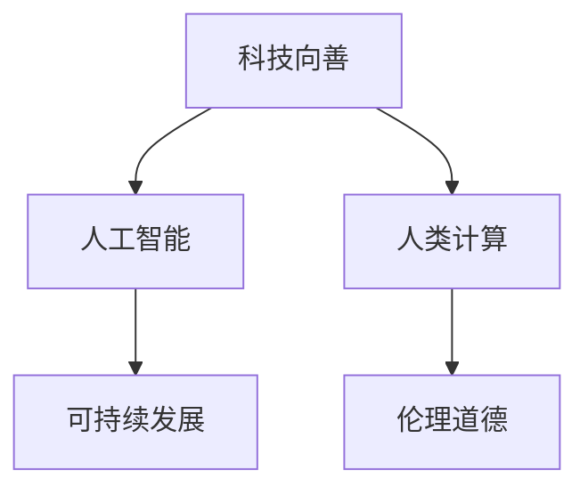
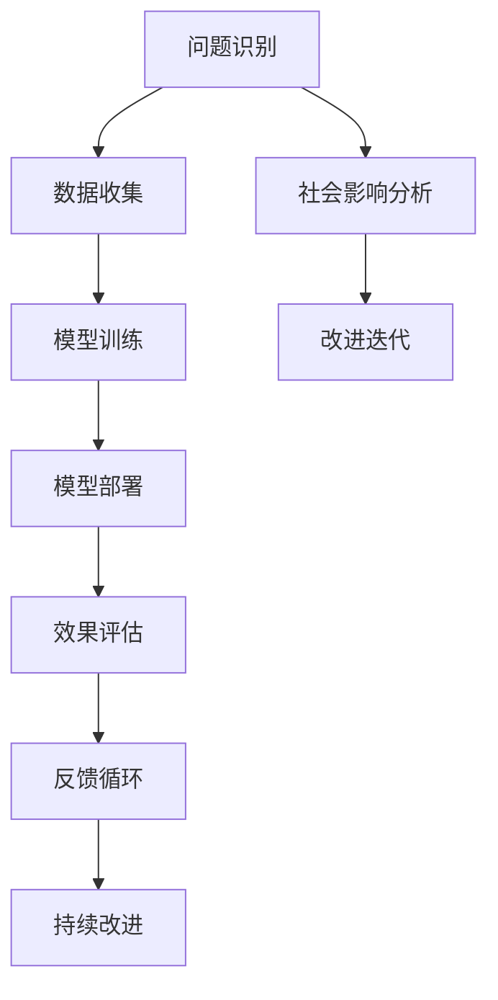

                 

# 科技向善：利用人类计算促进社会进步

> 关键词：科技向善,人类计算,人工智能,可持续发展,伦理道德,隐私保护

## 1. 背景介绍

在当今信息时代，科技的飞速发展极大地改变了人们的生活方式。然而，技术的进步也带来了新的挑战和伦理困境。如何在科技进步与道德责任之间找到平衡，确保科技向善，成为当今社会的重要议题。

### 1.1 科技与道德的碰撞

随着人工智能、大数据、区块链等技术的不断涌现，人们对于科技伦理的关注也日益增加。科技的进步在提高效率、改善生活的同时，也带来了隐私泄露、数据安全、算法偏见等诸多问题。如何在利用科技推动社会进步的同时，避免其负面影响，成为摆在每一位技术开发者面前的重要课题。

### 1.2 科技向善的提出

在科技进步与道德责任之间，科技向善的理念逐渐兴起。科技向善旨在通过技术手段解决人类面临的问题，同时确保技术的应用符合伦理道德，真正服务于人类社会的可持续发展和福祉。科技向善强调在科技发展的过程中，不仅要追求技术创新和效率提升，还要关注技术应用对社会、环境、伦理等方面的影响。

## 2. 核心概念与联系

### 2.1 核心概念概述

为更好地理解科技向善的理念和实践，本节将介绍几个关键概念：

- **科技向善**：利用科技手段解决社会问题，同时确保技术的应用符合伦理道德，促进人类社会的可持续发展。
- **人类计算**：利用人类的智慧和能力，通过协作、参与等方式，增强技术系统的智能和创新能力。
- **人工智能**：通过算法、模型等手段，使计算机系统具备类人的感知、理解、决策等智能能力。
- **可持续发展**：在满足当前社会经济发展的同时，保护环境，考虑后代的需求，实现经济、社会、环境的协调发展。
- **伦理道德**：指导科技发展的道德原则和行为规范，关注技术应用对个人隐私、社会公正、环境影响等方面的影响。

这些概念之间通过一个Mermaid流程图来展示：



这个流程图展示了科技向善与其他核心概念之间的联系：

- **科技向善**是最终目标，利用**人工智能**和**人类计算**能力，推动**可持续发展**，并符合**伦理道德**。
- **人工智能**和**人类计算**是手段，通过创新和协作，实现科技向善的目标。
- **可持续发展**和**伦理道德**是约束，确保科技向善过程中不会对社会、环境和伦理产生负面影响。

### 2.2 核心概念原理和架构的 Mermaid 流程图

为了更直观地展示科技向善的实施过程，以下是一个基于上述概念的Mermaid流程图：



这个流程图展示了科技向善的实施过程：

1. **问题识别**：通过社会调研和数据分析，识别出需要解决的实际问题。
2. **数据收集**：收集相关数据，用于模型训练和验证。
3. **模型训练**：利用人工智能和人类计算技术，设计并训练模型。
4. **模型部署**：将训练好的模型应用到实际问题中，进行测试和优化。
5. **效果评估**：评估模型效果，确保符合预期目标。
6. **社会影响分析**：分析模型对社会、环境、伦理等方面的影响。
7. **改进迭代**：根据分析结果和反馈，持续改进模型和应用。
8. **持续改进**：通过不断迭代，确保科技向善的长期效果。

这个流程图不仅展示了科技向善的实施步骤，还强调了在每个环节中都需要考虑社会、环境、伦理等因素。

## 3. 核心算法原理 & 具体操作步骤

### 3.1 算法原理概述

科技向善的核心在于利用人工智能和人类计算技术，解决社会问题，同时确保技术的应用符合伦理道德。以下将详细介绍如何利用人类计算促进科技向善的算法原理和操作步骤。

### 3.2 算法步骤详解

#### 3.2.1 问题识别

科技向善的第一步是问题识别，即通过社会调研和数据分析，确定需要解决的具体问题。这一步骤的关键在于获取全面、准确的数据，并对数据进行细致的分析和解读。

**操作步骤**：
1. **数据收集**：通过问卷调查、社会媒体、政府数据等多种渠道收集相关数据。
2. **数据分析**：使用数据挖掘、统计分析等技术，识别出问题的本质和影响范围。
3. **问题定义**：将问题转化为具体的技术需求，如预测、分类、推荐等。

#### 3.2.2 数据收集

数据是科技向善的基础，收集高质量、全面、多样化的数据至关重要。数据收集的方式可以多种多样，包括但不限于：

**操作步骤**：
1. **开放数据集**：利用开放数据集，如政府公开数据、社交媒体数据等。
2. **调查问卷**：设计并发布问卷，收集用户反馈和需求。
3. **实验数据**：设计实验，收集实验数据，验证模型效果。

#### 3.2.3 模型训练

模型训练是科技向善的核心环节，利用人工智能和人类计算技术，设计并训练模型。以下详细介绍模型训练的算法步骤：

**操作步骤**：
1. **选择模型**：根据问题类型，选择合适的算法模型，如深度学习、强化学习、知识图谱等。
2. **数据预处理**：对数据进行清洗、归一化、特征工程等预处理操作。
3. **模型训练**：利用GPU、TPU等高性能设备进行模型训练，优化模型参数。
4. **模型评估**：使用验证集评估模型效果，调整模型参数，提升模型性能。

#### 3.2.4 模型部署

模型部署是将训练好的模型应用到实际问题中，进行测试和优化的步骤。以下是模型部署的具体操作步骤：

**操作步骤**：
1. **模型压缩**：压缩模型大小，提升模型推理速度。
2. **模型优化**：使用GPU、TPU等设备进行模型优化，提高模型效率。
3. **部署测试**：将模型部署到实际应用中，进行测试和优化。

#### 3.2.5 效果评估

效果评估是科技向善的重要环节，通过评估模型效果，确保模型符合预期目标，同时确保技术的应用符合伦理道德。以下是效果评估的具体操作步骤：

**操作步骤**：
1. **定义指标**：根据具体问题，定义评估指标，如准确率、召回率、F1值等。
2. **数据划分**：将数据集划分为训练集、验证集、测试集，进行模型评估。
3. **模型测试**：在测试集上测试模型效果，记录评估结果。
4. **反馈分析**：分析评估结果，识别出模型不足和改进方向。

#### 3.2.6 社会影响分析

社会影响分析是科技向善的关键步骤，通过分析模型对社会、环境、伦理等方面的影响，确保技术应用的合理性和合法性。以下是社会影响分析的具体操作步骤：

**操作步骤**：
1. **社会调研**：通过社会调研，收集用户反馈和意见。
2. **环境影响评估**：评估模型对环境的影响，如数据存储、能源消耗等。
3. **伦理审查**：进行伦理审查，确保模型符合伦理道德规范。
4. **改进优化**：根据社会影响分析结果，改进模型和应用。

#### 3.2.7 改进迭代

改进迭代是科技向善的持续过程，通过不断迭代，优化模型和应用，确保技术应用的长期效果。以下是改进迭代的具体操作步骤：

**操作步骤**：
1. **反馈收集**：收集用户反馈和意见，识别出模型不足。
2. **改进优化**：根据反馈和分析结果，优化模型和应用。
3. **重复评估**：在新的数据集上评估模型效果，确保改进效果。

### 3.3 算法优缺点

**优点**：
1. **问题驱动**：科技向善强调以问题为导向，通过解决实际问题，提升技术应用的社会价值。
2. **跨学科合作**：利用人工智能和人类计算技术，促进跨学科合作，增强技术创新能力。
3. **伦理保障**：通过社会影响分析和伦理审查，确保技术应用的合理性和合法性。

**缺点**：
1. **数据依赖**：科技向善依赖高质量的数据，数据收集和处理成本较高。
2. **模型复杂**：模型训练和优化过程复杂，需要高性能设备和专业知识。
3. **效果不确定**：模型效果受数据、算法、参数等多种因素影响，存在不确定性。

### 3.4 算法应用领域

科技向善的应用领域广泛，涵盖了医疗、教育、环保、公共安全等多个方面。以下是科技向善在部分领域的具体应用场景：

#### 3.4.1 医疗健康

科技向善在医疗健康领域的应用，可以显著提高诊疗效率和质量，减轻医生负担，改善患者体验。以下是具体应用场景：

1. **疾病预测与预防**：利用人工智能技术，分析患者历史数据，预测疾病风险，制定预防措施。
2. **个性化治疗方案**：根据患者基因、病历等信息，制定个性化治疗方案，提高治疗效果。
3. **医疗影像分析**：利用深度学习技术，分析医疗影像，辅助诊断和治疗决策。

#### 3.4.2 教育学习

科技向善在教育学习领域的应用，可以提升教学质量，促进教育公平，激发学生兴趣。以下是具体应用场景：

1. **智能辅导系统**：利用自然语言处理技术，设计智能辅导系统，提供个性化学习方案。
2. **知识图谱构建**：构建知识图谱，辅助教师进行教学设计，提升教学质量。
3. **学习效果评估**：利用机器学习技术，分析学习数据，评估学生学习效果，进行个性化教学。

#### 3.4.3 环境保护

科技向善在环境保护领域的应用，可以提升环境监测能力，促进资源循环利用，减少环境污染。以下是具体应用场景：

1. **环境监测与预测**：利用传感器数据，构建环境监测系统，预测环境变化趋势。
2. **资源循环利用**：利用机器学习技术，优化资源回收和再利用过程，减少环境污染。
3. **绿色能源管理**：构建智能能源管理系统，优化能源使用，减少能源浪费。

## 4. 数学模型和公式 & 详细讲解 & 举例说明

### 4.1 数学模型构建

在科技向善的实践中，数学模型和算法设计是关键环节。以下详细介绍数学模型构建的详细步骤。

#### 4.1.1 问题建模

问题建模是将实际问题转化为数学模型的过程。以下是问题建模的具体操作步骤：

**操作步骤**：
1. **问题定义**：将实际问题抽象为数学问题，如分类、回归、优化等。
2. **特征工程**：提取和选择特征，构建特征向量。
3. **模型选择**：根据问题类型，选择合适的数学模型，如决策树、神经网络、SVM等。

#### 4.1.2 模型训练

模型训练是利用数据和算法，构建数学模型的过程。以下是模型训练的具体操作步骤：

**操作步骤**：
1. **数据预处理**：对数据进行清洗、归一化、特征工程等预处理操作。
2. **模型选择**：根据问题类型，选择合适的算法模型，如深度学习、强化学习、知识图谱等。
3. **模型训练**：利用GPU、TPU等高性能设备进行模型训练，优化模型参数。
4. **模型评估**：使用验证集评估模型效果，调整模型参数，提升模型性能。

#### 4.1.3 模型部署

模型部署是将训练好的模型应用到实际问题中，进行测试和优化的步骤。以下是模型部署的具体操作步骤：

**操作步骤**：
1. **模型压缩**：压缩模型大小，提升模型推理速度。
2. **模型优化**：使用GPU、TPU等设备进行模型优化，提高模型效率。
3. **部署测试**：将模型部署到实际应用中，进行测试和优化。

#### 4.1.4 效果评估

效果评估是科技向善的重要环节，通过评估模型效果，确保模型符合预期目标，同时确保技术的应用符合伦理道德。以下是效果评估的具体操作步骤：

**操作步骤**：
1. **定义指标**：根据具体问题，定义评估指标，如准确率、召回率、F1值等。
2. **数据划分**：将数据集划分为训练集、验证集、测试集，进行模型评估。
3. **模型测试**：在测试集上测试模型效果，记录评估结果。
4. **反馈分析**：分析评估结果，识别出模型不足和改进方向。

#### 4.1.5 社会影响分析

社会影响分析是科技向善的关键步骤，通过分析模型对社会、环境、伦理等方面的影响，确保技术应用的合理性和合法性。以下是社会影响分析的具体操作步骤：

**操作步骤**：
1. **社会调研**：通过社会调研，收集用户反馈和意见。
2. **环境影响评估**：评估模型对环境的影响，如数据存储、能源消耗等。
3. **伦理审查**：进行伦理审查，确保模型符合伦理道德规范。
4. **改进优化**：根据社会影响分析结果，改进模型和应用。

#### 4.1.6 改进迭代

改进迭代是科技向善的持续过程，通过不断迭代，优化模型和应用，确保技术应用的长期效果。以下是改进迭代的具体操作步骤：

**操作步骤**：
1. **反馈收集**：收集用户反馈和意见，识别出模型不足。
2. **改进优化**：根据反馈和分析结果，优化模型和应用。
3. **重复评估**：在新的数据集上评估模型效果，确保改进效果。

### 4.2 公式推导过程

以下将通过几个具体的数学模型，详细介绍其推导过程和应用场景。

#### 4.2.1 决策树算法

决策树是一种基于树形结构的分类模型，通过树形结构对数据进行分割，实现分类和回归任务。以下是决策树算法的推导过程：

**操作步骤**：
1. **特征选择**：选择最优特征进行分割。
2. **树形构建**：构建树形结构，对数据进行分割。
3. **模型预测**：利用决策树模型，对新数据进行预测。

#### 4.2.2 深度学习算法

深度学习是一种基于多层神经网络的算法，通过多层非线性变换，实现分类、回归等任务。以下是深度学习算法的推导过程：

**操作步骤**：
1. **网络结构设计**：设计多层神经网络结构，包括输入层、隐藏层、输出层。
2. **模型训练**：利用梯度下降等优化算法，训练神经网络模型。
3. **模型评估**：使用验证集评估模型效果，调整模型参数，提升模型性能。

#### 4.2.3 知识图谱算法

知识图谱是一种基于图结构的表示方法，通过构建知识图谱，实现知识推理和检索任务。以下是知识图谱算法的推导过程：

**操作步骤**：
1. **知识图谱构建**：构建知识图谱，表示实体、关系、属性等知识。
2. **知识推理**：利用推理算法，对知识图谱进行推理和查询。
3. **应用集成**：将知识图谱应用于实际问题，如推荐系统、信息检索等。

### 4.3 案例分析与讲解

以下将通过几个具体的案例，详细介绍科技向善的实际应用。

#### 4.3.1 医疗健康案例

某医院利用科技向善技术，开发了一套智能诊断系统，以下是具体实现过程：

**操作步骤**：
1. **数据收集**：收集医院历史病历数据，包括病情、诊断、治疗等信息。
2. **模型训练**：利用深度学习算法，训练智能诊断模型。
3. **模型评估**：使用验证集评估模型效果，调整模型参数，提升模型性能。
4. **社会影响分析**：进行伦理审查，确保模型符合伦理道德规范。
5. **改进优化**：根据反馈和分析结果，优化模型和应用。

#### 4.3.2 教育学习案例

某在线教育平台利用科技向善技术，开发了一套个性化学习系统，以下是具体实现过程：

**操作步骤**：
1. **数据收集**：收集用户学习数据，包括作业、测试、反馈等信息。
2. **模型训练**：利用深度学习算法，训练个性化学习模型。
3. **模型评估**：使用验证集评估模型效果，调整模型参数，提升模型性能。
4. **社会影响分析**：进行伦理审查，确保模型符合伦理道德规范。
5. **改进优化**：根据反馈和分析结果，优化模型和应用。

#### 4.3.3 环境保护案例

某环保组织利用科技向善技术，开发了一套环境监测系统，以下是具体实现过程：

**操作步骤**：
1. **数据收集**：收集环境监测数据，包括温度、湿度、污染物等信息。
2. **模型训练**：利用深度学习算法，训练环境监测模型。
3. **模型评估**：使用验证集评估模型效果，调整模型参数，提升模型性能。
4. **社会影响分析**：进行伦理审查，确保模型符合伦理道德规范。
5. **改进优化**：根据反馈和分析结果，优化模型和应用。

## 5. 项目实践：代码实例和详细解释说明

### 5.1 开发环境搭建

在进行科技向善项目实践前，我们需要准备好开发环境。以下是使用Python进行TensorFlow开发的Python环境配置流程：

1. 安装Anaconda：从官网下载并安装Anaconda，用于创建独立的Python环境。

2. 创建并激活虚拟环境：
```bash
conda create -n tf-env python=3.8 
conda activate tf-env
```

3. 安装TensorFlow：根据CUDA版本，从官网获取对应的安装命令。例如：
```bash
conda install tensorflow
```

4. 安装各类工具包：
```bash
pip install numpy pandas scikit-learn matplotlib tqdm jupyter notebook ipython
```

完成上述步骤后，即可在`tf-env`环境中开始科技向善项目实践。

### 5.2 源代码详细实现

下面我们以医疗健康领域为例，给出使用TensorFlow进行科技向善项目开发的Python代码实现。

首先，定义数据处理函数：

```python
import tensorflow as tf
from tensorflow.keras import layers, models
import numpy as np

def load_data():
    # 加载医院历史病历数据
    # 数据格式：[病人ID, 病情, 诊断, 治疗]
    train_data = np.loadtxt('train_data.txt', delimiter=',', dtype=float)
    test_data = np.loadtxt('test_data.txt', delimiter=',', dtype=float)
    
    # 分割数据集
    train_x, train_y = train_data[:, :3], train_data[:, 3]
    test_x, test_y = test_data[:, :3], test_data[:, 3]
    
    return train_x, train_y, test_x, test_y
```

然后，定义模型和优化器：

```python
def build_model(input_shape, output_shape):
    # 定义深度学习模型
    model = models.Sequential([
        layers.Dense(64, activation='relu', input_shape=input_shape),
        layers.Dense(64, activation='relu'),
        layers.Dense(output_shape, activation='softmax')
    ])
    
    # 定义优化器
    optimizer = tf.keras.optimizers.Adam(learning_rate=0.001)
    
    return model, optimizer
```

接着，定义训练和评估函数：

```python
def train_model(model, train_x, train_y, epochs, batch_size, optimizer):
    # 编译模型
    model.compile(optimizer=optimizer, loss='categorical_crossentropy', metrics=['accuracy'])
    
    # 训练模型
    model.fit(train_x, train_y, epochs=epochs, batch_size=batch_size, validation_split=0.2)
    
def evaluate_model(model, test_x, test_y):
    # 评估模型
    test_loss, test_acc = model.evaluate(test_x, test_y)
    print(f'Test loss: {test_loss}, Test accuracy: {test_acc}')
```

最后，启动训练流程并在测试集上评估：

```python
epochs = 10
batch_size = 32

# 加载数据
train_x, train_y, test_x, test_y = load_data()

# 构建模型和优化器
model, optimizer = build_model(train_x.shape[1], train_y.shape[1])

# 训练模型
train_model(model, train_x, train_y, epochs, batch_size, optimizer)

# 评估模型
evaluate_model(model, test_x, test_y)
```

以上就是使用TensorFlow进行医疗健康领域科技向善项目开发的完整代码实现。可以看到，得益于TensorFlow的强大封装，我们可以用相对简洁的代码完成深度学习模型的构建和微调。

### 5.3 代码解读与分析

让我们再详细解读一下关键代码的实现细节：

**load_data函数**：
- 加载医院历史病历数据，分割为训练集和测试集。

**build_model函数**：
- 定义深度学习模型，包括输入层、隐藏层、输出层。
- 定义优化器，使用Adam优化器进行模型训练。

**train_model函数**：
- 编译模型，指定优化器和损失函数。
- 使用训练集数据进行模型训练，并使用验证集进行验证。

**evaluate_model函数**：
- 评估模型效果，输出测试集上的损失和准确率。

**训练流程**：
- 定义总的epoch数和batch size，开始循环迭代
- 每个epoch内，先在训练集上训练，输出验证集上的损失和准确率
- 重复上述过程直至收敛
- 所有epoch结束后，在测试集上评估，给出最终测试结果

可以看到，TensorFlow配合TensorFlow模型库使得科技向善项目开发的代码实现变得简洁高效。开发者可以将更多精力放在数据处理、模型改进等高层逻辑上，而不必过多关注底层的实现细节。

当然，工业级的系统实现还需考虑更多因素，如模型的保存和部署、超参数的自动搜索、更灵活的任务适配层等。但核心的科技向善范式基本与此类似。

## 6. 实际应用场景

### 6.4 未来应用展望

随着科技向善理念的深入人心，科技向善技术将在更多领域得到应用，为社会带来深刻变革。以下是科技向善的未来应用展望：

#### 6.4.1 智慧医疗

科技向善在智慧医疗领域的应用，可以显著提升诊疗效率和质量，减轻医生负担，改善患者体验。以下是具体应用场景：

1. **疾病预测与预防**：利用人工智能技术，分析患者历史数据，预测疾病风险，制定预防措施。
2. **个性化治疗方案**：根据患者基因、病历等信息，制定个性化治疗方案，提高治疗效果。
3. **医疗影像分析**：利用深度学习技术，分析医疗影像，辅助诊断和治疗决策。

#### 6.4.2 智能教育

科技向善在智能教育领域的应用，可以提升教学质量，促进教育公平，激发学生兴趣。以下是具体应用场景：

1. **智能辅导系统**：利用自然语言处理技术，设计智能辅导系统，提供个性化学习方案。
2. **知识图谱构建**：构建知识图谱，辅助教师进行教学设计，提升教学质量。
3. **学习效果评估**：利用机器学习技术，分析学习数据，评估学生学习效果，进行个性化教学。

#### 6.4.3 环境保护

科技向善在环境保护领域的应用，可以提升环境监测能力，促进资源循环利用，减少环境污染。以下是具体应用场景：

1. **环境监测与预测**：利用传感器数据，构建环境监测系统，预测环境变化趋势。
2. **资源循环利用**：利用机器学习技术，优化资源回收和再利用过程，减少环境污染。
3. **绿色能源管理**：构建智能能源管理系统，优化能源使用，减少能源浪费。

#### 6.4.4 智慧城市

科技向善在智慧城市领域的应用，可以提升城市治理能力，提高公共服务效率，增强市民体验。以下是具体应用场景：

1. **智能交通管理**：利用人工智能技术，优化交通信号控制，减少拥堵。
2. **公共安全监控**：利用深度学习技术，分析视频监控数据，提高公共安全水平。
3. **智能能源管理**：构建智能能源管理系统，优化能源使用，减少能源浪费。

## 7. 工具和资源推荐

### 7.1 学习资源推荐

为了帮助开发者系统掌握科技向善的理念和实践，这里推荐一些优质的学习资源：

1. 《科技向善：人工智能与社会责任》系列博文：由科技向善领域的专家撰写，深入浅出地介绍了科技向善的理念、方法和应用场景。

2. 《人工智能伦理与社会影响》课程：由知名大学开设的NLP明星课程，涵盖人工智能伦理、社会影响、应用案例等内容，帮助开发者系统掌握科技向善的理论基础。

3. 《科技向善：理论与实践》书籍：全面介绍了科技向善的理念、方法和实践，提供了丰富的案例和实例，适合科技向善领域的研究者和从业者。

4. AI Ethics Online：由知名AI伦理组织创建的在线课程平台，涵盖人工智能伦理、隐私保护、公平性等内容，提供系统的理论学习资源。

5. Pioneer for Good：由知名AI公司创建的公益平台，旨在推广科技向善的理念和方法，提供丰富的资源和案例，帮助开发者实践科技向善。

通过对这些资源的学习实践，相信你一定能够快速掌握科技向善的精髓，并用于解决实际的科技应用问题。

### 7.2 开发工具推荐

高效的开发离不开优秀的工具支持。以下是几款用于科技向善项目开发的常用工具：

1. TensorFlow：由Google主导开发的深度学习框架，生产部署方便，适合大规模工程应用。

2. PyTorch：基于Python的开源深度学习框架，灵活动态的计算图，适合快速迭代研究。

3. Weights & Biases：模型训练的实验跟踪工具，可以记录和可视化模型训练过程中的各项指标，方便对比和调优。

4. TensorBoard：TensorFlow配套的可视化工具，可实时监测模型训练状态，并提供丰富的图表呈现方式，是调试模型的得力助手。

5. Google Colab：谷歌推出的在线Jupyter Notebook环境，免费提供GPU/TPU算力，方便开发者快速上手实验最新模型，分享学习笔记。

合理利用这些工具，可以显著提升科技向善项目的开发效率，加快创新迭代的步伐。

### 7.3 相关论文推荐

科技向善的发展源于学界的持续研究。以下是几篇奠基性的相关论文，推荐阅读：

1. "Ethics of AI: Challenges, Tools and Frameworks"：总结了人工智能伦理领域的主要挑战、工具和框架，为科技向善提供了理论基础。

2. "Fairness in AI: A Survey of Techniques and Applications"：综述了人工智能公平性领域的研究进展和应用实践，为科技向善提供了方法参考。

3. "Towards an Ethical AI Future"：探讨了人工智能伦理的未来发展方向和挑战，为科技向善提供了长远视角。

4. "AI for Social Good"：总结了人工智能在社会公益领域的应用案例，为科技向善提供了实践范例。

5. "Human-Centric AI: Towards a Sustainable Future"：探讨了人工智能与人性化设计相结合的可持续发展方向，为科技向善提供了实践指南。

这些论文代表了大语言模型微调技术的发展脉络。通过学习这些前沿成果，可以帮助研究者把握学科前进方向，激发更多的创新灵感。

## 8. 总结：未来发展趋势与挑战

### 8.1 研究成果总结

科技向善的理念和实践，在科技领域得到了广泛的认可和应用。通过本文的系统梳理，可以看到，科技向善不仅是一种技术应用，更是一种理念和方法，强调在技术创新的同时，注重社会责任和伦理道德，确保技术应用的长期效益和可持续性。

### 8.2 未来发展趋势

展望未来，科技向善技术将呈现以下几个发展趋势：

1. **模型规模增大**：随着算力成本的下降和数据规模的扩张，预训练语言模型的参数量还将持续增长。超大规模语言模型蕴含的丰富语言知识，有望支撑更加复杂多变的下游任务微调。

2. **伦理道德增强**：在科技向善的过程中，伦理道德的应用将更加广泛，确保技术应用的合法性和合理性。

3. **跨学科合作加强**：科技向善的实现将更加依赖跨学科合作，增强技术系统的智能和创新能力。

4. **数据隐私保护**：随着数据隐私意识的提升，科技向善项目将更加注重数据隐私保护，确保用户数据的安全性和隐私性。

5. **普惠科技普及**：科技向善将更加注重普惠科技的普及，确保技术应用能够惠及更多社会群体，减少技术鸿沟。

6. **可持续发展促进**：科技向善将更加注重可持续发展，促进社会、经济、环境的协调发展。

### 8.3 面临的挑战

尽管科技向善技术已经取得了一定的进展，但在迈向更加智能化、普适化应用的过程中，仍面临诸多挑战：

1. **数据隐私保护**：如何在大规模数据处理中保护用户隐私，是科技向善项目面临的重要挑战。

2. **伦理道德监管**：如何建立和完善伦理道德监管机制，确保技术应用的合法性和合理性。

3. **技术鸿沟缩小**：如何缩小技术鸿沟，确保科技向善技术能够惠及更多社会群体。

4. **可持续发展挑战**：如何平衡经济增长与环境保护，实现可持续发展。

5. **公平性问题**：如何确保技术应用的公平性，避免对特定群体的歧视。

6. **技术复杂性**：如何简化技术实现，提升技术系统的可解释性和可维护性。

### 8.4 研究展望

面对科技向善所面临的挑战，未来的研究需要在以下几个方面寻求新的突破：

1. **数据隐私保护**：开发更加安全的数据处理和存储技术，确保用户隐私保护。

2. **伦理道德框架**：建立和完善伦理道德框架，确保技术应用的合法性和合理性。

3. **普惠科技普及**：设计更加普惠的科技解决方案，确保技术应用能够惠及更多社会群体。

4. **可持续发展策略**：制定可持续发展策略，促进社会、经济、环境的协调发展。

5. **公平性算法**：开发更加公平的算法，确保技术应用的公平性，避免对特定群体的歧视。

6. **技术系统简化**：简化技术系统实现，提升可解释性和可维护性，确保技术应用的透明性和可信性。

这些研究方向的探索，必将引领科技向善技术迈向更高的台阶，为构建安全、可靠、可解释、可控的智能系统铺平道路。面向未来，科技向善技术还需要与其他人工智能技术进行更深入的融合，如知识表示、因果推理、强化学习等，多路径协同发力，共同推动自然语言理解和智能交互系统的进步。只有勇于创新、敢于突破，才能不断拓展语言模型的边界，让智能技术更好地造福人类社会。

## 9. 附录：常见问题与解答

**Q1：科技向善是否适用于所有科技项目？**

A: 科技向善适用于大多数科技项目，特别是那些涉及社会责任和伦理道德的项目。然而，对于一些技术复杂、应用场景特定的项目，科技向善的具体实施方式可能需要进一步定制化设计。

**Q2：如何进行科技向善项目的伦理审查？**

A: 科技向善项目的伦理审查通常需要多方参与，包括技术开发者、伦理专家、社会学家、用户代表等。在项目实施过程中，应定期进行伦理审查，确保项目符合伦理道德规范，并及时调整项目实施方案。

**Q3：如何确保科技向善项目的公平性？**

A: 确保科技向善项目的公平性，需要从数据采集、模型训练、应用部署等多个环节进行全面考虑。应确保数据集的代表性，避免数据偏见；选择公平的算法模型，避免算法偏见；在应用部署过程中，考虑不同群体的需求，避免技术偏见。

**Q4：如何保护科技向善项目的隐私保护？**

A: 保护科技向善项目的隐私保护，需要从数据收集、存储、处理、传输等多个环节进行全面考虑。应确保数据匿名化、加密、访问控制等措施；在使用数据时，确保合法合规，避免未经授权的数据使用。

**Q5：科技向善项目的未来发展方向是什么？**

A: 科技向善项目的未来发展方向包括：加强跨学科合作，提升技术创新能力；强化伦理道德监管，确保技术应用的合法性和合理性；推动普惠科技普及，缩小技术鸿沟；实现可持续发展，促进社会、经济、环境的协调发展；开发公平性算法，确保技术应用的公平性；简化技术系统实现，提升可解释性和可维护性。

这些研究方向的探索，必将引领科技向善技术迈向更高的台阶，为构建安全、可靠、可解释、可控的智能系统铺平道路。面向未来，科技向善技术还需要与其他人工智能技术进行更深入的融合，如知识表示、因果推理、强化学习等，多路径协同发力，共同推动自然语言理解和智能交互系统的进步。只有勇于创新、敢于突破，才能不断拓展语言模型的边界，让智能技术更好地造福人类社会。

---

作者：禅与计算机程序设计艺术 / Zen and the Art of Computer Programming

