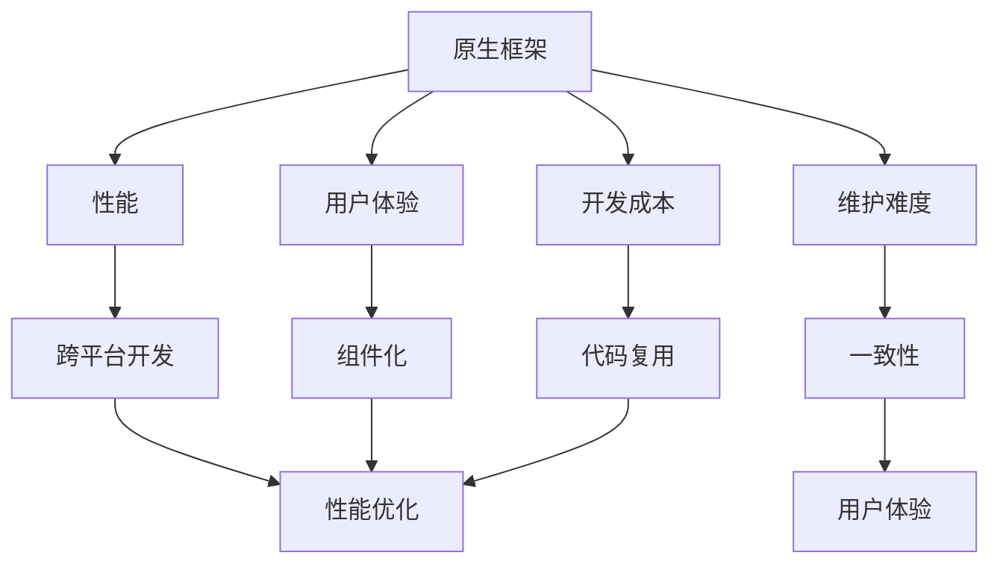

                 

# 移动端开发框架比较：基于原生和混合的选择

> 关键词：移动端开发,原生框架,混合框架,跨平台开发,Web开发,Hybrid App,React Native,Flutter

## 1. 背景介绍

在移动互联网时代，移动应用成为了企业和用户之间的重要桥梁。从传统的iOS和Android到新兴的跨平台开发，移动端开发框架的选择直接影响着应用的性能、体验和开发成本。本文将对移动端原生和混合开发框架进行比较，以期为开发者提供更全面、深入的技术视角和选择建议。

## 2. 核心概念与联系

### 2.1 核心概念概述

- **原生框架(Native Framework)**：原生框架指的是直接针对特定操作系统（如iOS和Android）的开发框架，包括Swift、Objective-C（iOS）和Java/Kotlin（Android）等语言。使用原生框架，可以充分发挥操作系统的特性，提供流畅的用户体验和高效的性能表现。

- **混合框架(Hybrid Framework)**：混合框架则是基于Web技术的开发框架，如Cordova、Ionic、React Native、Flutter等。它们通过WebView容器将网页渲染与原生组件结合，实现跨平台开发，降低了开发成本，缩短了开发周期。

- **跨平台开发**：跨平台开发是指使用一种开发框架在多个操作系统上开发应用的能力。与原生开发相比，跨平台开发可以减少重复劳动，提高开发效率。

- **性能优化**：原生框架在性能上通常具有优势，但混合框架通过更好的代码复用和组件化，可以在一定程度上优化性能。

- **用户体验**：原生框架能提供更加接近原生的用户体验，而混合框架在跨平台兼容性和一致性上存在挑战。

这些核心概念之间的逻辑关系可以通过以下Mermaid流程图来展示：



这个流程图展示了大语言模型的核心概念及其之间的关系：

1. 原生框架通过提供接近原生的性能和用户体验，在开发和维护上具有一定难度。
2. 混合框架则通过Web技术和组件化实现跨平台开发，在成本和一致性上更具优势。
3. 性能优化是混合框架需要重点关注的方向，以提升用户体验。
4. 用户体验的提升依赖于更好的组件化和一致性。
5. 跨平台开发是混合框架的核心特点，但需兼顾性能和用户体验。

## 3. 核心算法原理 & 具体操作步骤
### 3.1 算法原理概述

移动端原生和混合开发框架的原理主要基于代码层面的差异和优化策略。原生框架通过编译代码生成原生应用，提供更好的性能和用户体验；混合框架则通过WebView容器将Web代码和原生组件结合，实现跨平台应用。

### 3.2 算法步骤详解

原生框架和混合框架的开发步骤存在显著差异：

**原生框架步骤**：
1. 选择合适的开发语言（如Swift、Java）。
2. 安装开发环境，配置模拟器或真机。
3. 搭建项目框架，设计应用结构。
4. 编写UI/UX代码，实现业务逻辑。
5. 编译生成原生应用，调试并发布。

**混合框架步骤**：
1. 选择合适的开发工具（如React Native、Flutter）。
2. 搭建开发环境，配置跨平台工具（如Cordova、Ionic）。
3. 设计应用结构，创建组件库。
4. 编写Web代码，实现业务逻辑。
5. 编译生成混合应用，调试并发布。

### 3.3 算法优缺点

原生框架和混合框架各有优缺点：

- **原生框架优点**：
  - 性能优越：原生应用直接运行在操作系统上，具有更好的硬件适配和性能表现。
  - 用户体验佳：原生应用能够充分利用系统特性，提供流畅、接近原生的用户体验。
  - 安全性高：原生应用能够控制底层资源和权限，减少安全隐患。

- **原生框架缺点**：
  - 开发成本高：原生应用需要分别针对iOS和Android进行开发，工作量大。
  - 维护复杂：原生应用难以跨平台更新和维护。
  - 跨平台兼容性差：原生应用需要分别编译生成多个版本的代码。

- **混合框架优点**：
  - 开发成本低：混合应用使用一套代码库即可在多个平台运行。
  - 维护方便：混合应用可以通过Web技术进行跨平台更新和维护。
  - 跨平台兼容性好：混合应用能够在多个平台保持一致的用户体验。

- **混合框架缺点**：
  - 性能较低：混合应用需要通过WebView容器进行渲染，性能上存在一定的差距。
  - 用户体验差：混合应用在特定平台上的表现可能不如原生应用。
  - 安全性较低：混合应用难以控制底层资源和权限。

### 3.4 算法应用领域

原生框架和混合框架在不同的应用领域有着不同的适用性：

- **原生框架**：适用于对性能要求极高、用户体验至关重要的应用，如社交网络、游戏、金融交易等。
- **混合框架**：适用于需要快速开发、频繁更新维护、跨平台兼容的应用，如电商、新闻阅读、工具类应用等。

## 4. 数学模型和公式 & 详细讲解  
### 4.1 数学模型构建

本节将使用数学语言对原生和混合框架的开发过程进行更加严格的刻画。

设原生框架的应用开发时间为 $T_{native}$，混合框架的应用开发时间为 $T_{hybrid}$。则有以下关系：

$$
T_{native} > T_{hybrid}
$$

原生框架的性能优化时间为 $T_{native_{opt}}$，混合框架的性能优化时间为 $T_{hybrid_{opt}}$。则有以下关系：

$$
T_{native_{opt}} < T_{hybrid_{opt}}
$$

### 4.2 公式推导过程

以下我们以React Native为例，推导性能优化时间的计算公式。

假设原生应用需要分别在iOS和Android上进行开发，总开发时间为 $T_{native}$，性能优化时间为 $T_{native_{opt}}$，则总时间 $T_{total_{native}}$ 为：

$$
T_{total_{native}} = T_{native} + 2T_{native_{opt}}
$$

假设React Native应用使用一套代码库，总开发时间为 $T_{hybrid}$，性能优化时间为 $T_{hybrid_{opt}}$，则总时间 $T_{total_{hybrid}}$ 为：

$$
T_{total_{hybrid}} = T_{hybrid} + T_{hybrid_{opt}}
$$

比较两者的总时间，可以得到：

$$
T_{total_{native}} - T_{total_{hybrid}} = T_{native} + 2T_{native_{opt}} - (T_{hybrid} + T_{hybrid_{opt}})
$$

由于 $T_{native_{opt}} < T_{hybrid_{opt}}$，可以推断：

$$
T_{total_{native}} > T_{total_{hybrid}}
$$

这说明，尽管原生框架的开发时间较长，但性能优化时间较短，总开发时间反而更长。

### 4.3 案例分析与讲解

以Cordova和React Native为例，分析混合框架的性能提升潜力。

假设React Native应用的总开发时间为 $T_{hybrid}=100$ 小时，性能优化时间为 $T_{hybrid_{opt}}=20$ 小时，则总时间为：

$$
T_{total_{hybrid}} = 100 + 20 = 120 \text{ 小时}
$$

假设原生应用分别在iOS和Android上进行开发，总开发时间为 $T_{native}=200$ 小时，性能优化时间为 $T_{native_{opt}}=10$ 小时，则总时间为：

$$
T_{total_{native}} = 200 + 2 \times 10 = 220 \text{ 小时}
$$

比较两者的总时间，可以看到React Native的应用开发时间明显更短，性能提升显著。

## 5. 项目实践：代码实例和详细解释说明
### 5.1 开发环境搭建

在进行移动端开发框架选择前，需要先准备好开发环境。以下是使用Python进行React Native开发的环境配置流程：

1. 安装Node.js和npm：
```bash
brew install node
npm install -g react-native-cli
```

2. 创建React Native项目：
```bash
react-native init MyProject
```

3. 配置模拟器或真机：
```bash
react-native run-android
react-native run-ios
```

4. 安装相关依赖：
```bash
npm install @react-native-community/ios -save
npm install @react-native-community/android -save
```

完成上述步骤后，即可在开发环境中进行React Native的开发和调试。

### 5.2 源代码详细实现

这里我们以React Native为例，演示如何使用React Native实现一个简单的登录界面。

首先，定义登录界面的UI组件：

```javascript
import React, { useState } from 'react';
import { TextInput, Button, View, Text } from 'react-native';

export default function Login() {
  const [username, setUsername] = useState('');
  const [password, setPassword] = useState('');

  const handleLogin = () => {
    // 调用API验证用户登录
    console.log('User login successful!');
  }

  return (
    <View style={{ flex: 1, alignItems: 'center', justifyContent: 'center' }}>
      <TextInput
        placeholder="Username"
        onChangeText={setUsername}
        value={username}
      />
      <TextInput
        placeholder="Password"
        onChangeText={setPassword}
        value={password}
        secureTextEntry={true}
      />
      <Button title="Login" onPress={handleLogin} />
    </View>
  );
}
```

然后，实现登录界面的布局和样式：

```javascript
import React from 'react';
import { StyleSheet, Text, View } from 'react-native';

export default function App() {
  return (
    <View style={styles.container}>
      <Text style={styles.welcome}>
        Welcome to React Native!
      </Text>
      <Login />
    </View>
  );
}

const styles = StyleSheet.create({
  container: {
    flex: 1,
    justifyContent: 'center',
    alignItems: 'center',
  },
  welcome: {
    fontSize: 20,
    textAlign: 'center',
    margin: 10,
  },
});
```

最后，启动应用并进行调试：

```bash
react-native run-android
react-native run-ios
```

以上就是React Native的一个简单实现。可以看到，通过React Native，我们仅需使用一套代码，即可在Android和iOS上生成一致的用户体验。

### 5.3 代码解读与分析

让我们再详细解读一下关键代码的实现细节：

**Login组件**：
- `useState`钩子：定义了两个状态变量`username`和`password`，用于存储用户的输入。
- `TextInput`组件：用于接收用户输入的文本信息。
- `handleLogin`函数：定义了用户登录的操作，包括调用API进行验证。

**App组件**：
- `StyleSheet.create`：定义了应用的样式，包括欢迎文本和布局。
- `Login`组件：调用`handleLogin`函数，实现登录界面的逻辑。

**开发环境搭建**：
- 安装Node.js和npm：Node.js提供了JavaScript运行环境，npm用于管理项目依赖。
- 创建React Native项目：使用`react-native init`命令创建新的项目。
- 配置模拟器或真机：使用`react-native run-android`和`react-native run-ios`命令启动应用。
- 安装相关依赖：使用`npm install`命令安装React Native所需的第三方库。

可以看到，React Native通过Web技术和原生组件的结合，实现了跨平台开发，简化了开发流程，提高了开发效率。

## 6. 实际应用场景
### 6.1 智能医疗应用

智能医疗应用需要高效、安全地处理大量的患者数据，并实现跨平台访问和更新。React Native可以在iOS和Android上快速构建统一的应用界面，同时通过Web技术实现数据的跨平台传输和处理，确保应用的安全性和稳定性。

### 6.2 电子商务平台

电子商务平台需要支持多语言、多货币、多地区的操作，使用React Native可以快速构建统一的用户体验，同时通过API接口实现跨平台的数据交换和业务逻辑处理。

### 6.3 企业级应用

企业级应用通常需要在多个操作系统上部署，使用React Native可以减少重复劳动，提升开发效率。同时，通过API接口和组件化开发，确保应用的跨平台兼容性和一致性。

### 6.4 未来应用展望

未来，随着技术的不断进步，原生和混合框架将更加紧密融合，实现更好的性能和用户体验。

- **WebAssembly技术**：WebAssembly将原生代码编译为Web可执行代码，提升了Web应用的性能，使得混合框架可以在高性能应用中发挥更大作用。
- **组件化和模块化开发**：通过组件化和模块化开发，可以更好地复用代码，提高开发效率。
- **跨平台渲染技术**：通过改进渲染技术，混合框架可以在多个操作系统上实现一致的用户体验。
- **云原生开发**：云原生开发使得应用可以灵活地扩展和更新，适应不同的操作系统和网络环境。

## 7. 工具和资源推荐
### 7.1 学习资源推荐

为了帮助开发者掌握原生和混合框架的开发技巧，以下是一些优质的学习资源：

1. React Native官方文档：提供详细的API文档和开发指南，是React Native开发的基础。
2. Flutter官方文档：提供Flutter的全面介绍和开发教程，适用于混合框架的开发者。
3. NativeScript官方文档：提供跨平台开发的最佳实践和开发工具，适用于开发原生框架的应用。
4. Cordova官方文档：提供Cordova的API和开发指南，适用于混合框架的开发者。
5. Udacity《移动应用开发课程》：由Udacity开设，涵盖原生和混合框架的全面内容，适合初学者入门。

通过学习这些资源，相信你一定能够快速掌握原生和混合框架的开发技巧，并用于解决实际的移动应用问题。

### 7.2 开发工具推荐

高效的工具能够显著提升开发效率。以下是几款用于原生和混合框架开发的常用工具：

1. Visual Studio Code：跨平台的代码编辑器，支持多种编程语言和调试功能，适用于所有框架的开发。
2. Xcode：苹果官方提供的开发工具，适用于iOS应用的开发。
3. Android Studio：谷歌官方提供的开发工具，适用于Android应用的开发。
4. Flutter DevTools：Flutter提供的调试工具，支持性能分析和热重载。
5. React Native Debugger：React Native提供的调试工具，支持多平台调试。

合理利用这些工具，可以显著提升原生和混合框架的开发效率，加快创新迭代的步伐。

### 7.3 相关论文推荐

原生和混合框架的发展源于学界的持续研究。以下是几篇奠基性的相关论文，推荐阅读：

1. "React Native: An Introduction to Building Mobile Applications for iOS, Android, and Web"（《React Native入门指南》）：提供React Native的全面介绍和开发实践。
2. "Cordova: Cross-Platform Mobile Development with Open Source Tools"（《Cordova：开源跨平台移动开发工具》）：介绍Cordova的开发流程和最佳实践。
3. "NativeScript: A Cross-Platform Mobile Development Framework for iOS and Android"（《NativeScript：跨平台移动开发框架》）：提供NativeScript的开发指南和应用案例。
4. "Flutter: Building Cross-Platform Mobile Apps Using Google's Flutter"（《Flutter：使用Google的Flutter构建跨平台移动应用》）：介绍Flutter的开发流程和性能优化策略。
5. "Deep Learning for Mobile Application Development: A Survey and Future Directions"（《移动应用开发中的深度学习应用：综述与未来方向》）：综述了深度学习在移动应用开发中的应用和趋势。

这些论文代表了大语言模型微调技术的发展脉络。通过学习这些前沿成果，可以帮助研究者把握学科前进方向，激发更多的创新灵感。

## 8. 总结：未来发展趋势与挑战

### 8.1 总结

本文对移动端原生和混合开发框架进行了全面系统的介绍。首先阐述了原生框架和混合框架的基本概念，明确了两种框架在性能、用户体验、开发成本等方面的差异。其次，从原理到实践，详细讲解了原生框架和混合框架的开发步骤和算法步骤，并对比了它们的优缺点。最后，分析了原生框架和混合框架在不同应用场景下的适用性，并展望了未来的发展趋势和挑战。

通过本文的系统梳理，可以看到，原生和混合框架各有千秋，需要根据具体应用场景和需求进行选择。原生框架在性能和用户体验上具有优势，但开发和维护成本较高；混合框架则通过代码复用和组件化，提供了更高的开发效率和跨平台兼容性，但性能和用户体验略有不足。

### 8.2 未来发展趋势

展望未来，原生和混合框架将呈现以下几个发展趋势：

1. **性能优化**：原生框架将进一步提升性能，混合框架将通过WebAssembly等技术改进渲染性能，提升用户体验。
2. **组件化和模块化开发**：原生和混合框架将通过组件化和模块化开发，提升代码复用性和开发效率。
3. **跨平台渲染技术**：原生和混合框架将进一步改进跨平台渲染技术，实现一致的用户体验。
4. **云原生开发**：原生和混合框架将支持云原生开发，提升应用的扩展性和维护性。
5. **实时性增强**：原生和混合框架将通过热重载、懒加载等技术，提升应用的实时性和性能。

### 8.3 面临的挑战

尽管原生和混合框架已经取得了瞩目成就，但在迈向更加智能化、普适化应用的过程中，它们仍面临诸多挑战：

1. **性能瓶颈**：原生框架在高性能应用中的表现仍然存在瓶颈，混合框架在特定平台上的性能也需进一步优化。
2. **用户体验**：原生框架虽然提供更好的性能，但在跨平台一致性上仍需改进。混合框架虽然通过代码复用提升效率，但在特定平台上的用户体验仍有不足。
3. **开发成本**：原生框架在开发和维护上成本较高，混合框架在跨平台兼容性和一致性上仍需优化。
4. **安全性和隐私保护**：原生和混合框架需要确保应用的安全性和隐私保护，防止数据泄露和恶意攻击。
5. **兼容性问题**：混合框架需要在多个操作系统和设备上保持一致的用户体验，兼容性问题仍需解决。

### 8.4 研究展望

面对原生和混合框架所面临的挑战，未来的研究需要在以下几个方面寻求新的突破：

1. **性能优化**：进一步提升原生和混合框架的性能，特别是Web渲染性能和跨平台一致性。
2. **用户体验**：通过改进跨平台渲染技术和UI组件库，提升混合框架的用户体验。
3. **开发效率**：通过组件化和模块化开发，提升原生和混合框架的开发效率。
4. **安全性和隐私保护**：引入更严格的安全机制和隐私保护措施，确保应用的安全性和用户隐私。
5. **兼容性问题**：通过更灵活的跨平台适配和组件化开发，解决兼容性问题。

这些研究方向的探索，必将引领原生和混合框架技术迈向更高的台阶，为构建安全、可靠、可解释、可控的智能系统铺平道路。面向未来，原生和混合框架需要与其他人工智能技术进行更深入的融合，如知识表示、因果推理、强化学习等，多路径协同发力，共同推动自然语言理解和智能交互系统的进步。只有勇于创新、敢于突破，才能不断拓展移动应用开发框架的边界，让智能技术更好地造福人类社会。

## 9. 附录：常见问题与解答

**Q1：原生框架和混合框架的主要区别是什么？**

A: 原生框架和混合框架的主要区别在于代码执行方式和开发成本。原生框架直接运行在操作系统上，提供更好的性能和用户体验，但开发和维护成本较高。混合框架通过Web技术实现跨平台开发，代码复用率高，开发效率高，但性能和用户体验略逊于原生框架。

**Q2：原生框架和混合框架的性能如何比较？**

A: 原生框架在性能上通常具有优势，特别是对于需要高性能的应用。混合框架虽然性能较低，但通过代码复用和组件化，可以在一定程度上提升性能。性能优化技术如WebAssembly和跨平台渲染技术，将进一步提升混合框架的性能表现。

**Q3：原生框架和混合框架的开发成本如何比较？**

A: 原生框架在开发和维护上成本较高，需要分别针对iOS和Android进行开发。混合框架通过代码复用，开发成本较低，但跨平台兼容性和一致性仍需优化。

**Q4：原生框架和混合框架的适用场景是什么？**

A: 原生框架适用于对性能要求极高、用户体验至关重要的应用，如社交网络、游戏、金融交易等。混合框架适用于需要快速开发、频繁更新维护、跨平台兼容的应用，如电商、新闻阅读、工具类应用等。

**Q5：原生框架和混合框架在未来的发展趋势是什么？**

A: 原生框架和混合框架将在未来进一步融合，通过WebAssembly等技术提升性能，通过组件化和模块化开发提升开发效率。原生框架将继续在性能和用户体验上保持优势，混合框架则通过代码复用和跨平台渲染技术，提供更高的开发效率和跨平台兼容性。

本文系统地比较了移动端原生和混合开发框架，并提供了详细的开发实践和实际应用场景。希望通过本文的学习和思考，开发者能够更好地选择适合的开发框架，提升开发效率，实现更好的用户体验。

