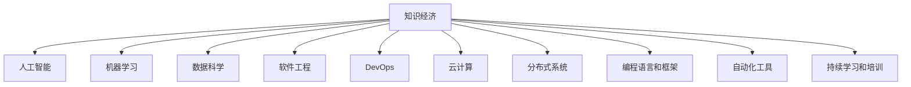

                 

# 程序员在知识经济时代的发展趋势

> 关键词：知识经济, 人工智能, 编程, 数据科学, 软件开发, 创新, 生产力提升, 未来趋势, 职业发展

## 1. 背景介绍

### 1.1 问题由来

在知识经济时代，科技迅猛发展，信息爆炸，数据量呈指数级增长。企业需要快速适应新的技术变革，以保持竞争力。程序员作为知识经济的核心力量，面临着前所未有的发展机遇和挑战。

### 1.2 问题核心关键点

程序员在知识经济时代的发展，主要依赖于以下核心关键点：

- **人工智能和机器学习**：AI和ML技术在自动化的应用、数据分析和决策支持等方面对程序员的需求急剧增加。
- **数据科学**：数据科学方法论和工具的应用，要求程序员具备处理大规模数据的能力。
- **软件工程和DevOps**：敏捷开发和持续集成、持续部署的实践，需要程序员具备持续迭代和交付的能力。
- **云计算和分布式系统**：云平台、容器化和微服务架构的普及，要求程序员掌握分布式系统的设计和开发。
- **编程语言和框架**：新兴编程语言（如Python、JavaScript）和框架（如React、Vue）的崛起，为程序员提供了新的职业机会。
- **自动化和机器人过程自动化（RPA）**：自动化工具的使用，减轻了程序员的重复性工作负担。
- **教育和培训**：持续学习，以适应快速变化的技术环境，对程序员的职业发展至关重要。

### 1.3 问题研究意义

对程序员在知识经济时代的发展趋势进行研究，具有以下重要意义：

- **理解市场需求**：掌握未来编程技能和职业方向，有助于程序员更好地规划职业发展路径。
- **提升竞争力**：了解最新技术趋势，帮助程序员提升技能，在竞争激烈的就业市场中脱颖而出。
- **推动行业进步**：程序员的持续发展和创新，是推动软件开发行业和信息技术领域进步的关键因素。
- **支持企业转型**：编程技能和知识的提升，可以支持企业更好地应对知识经济时代的挑战，实现数字化转型。
- **促进社会创新**：程序员在信息技术领域的创新，对社会各行各业的数字化转型具有重要推动作用。

## 2. 核心概念与联系

### 2.1 核心概念概述

为更好地理解程序员在知识经济时代的发展趋势，本节将介绍几个密切相关的核心概念：

- **知识经济**：以知识为生产要素，通过科技创新驱动经济发展的新型经济模式。
- **人工智能**：模拟人类智能行为，实现感知、推理、决策等能力的计算机技术。
- **机器学习**：通过数据和算法，使计算机系统能够不断改进的智能化技术。
- **数据科学**：从数据中提取知识、发现模式、进行预测和决策的科学。
- **软件工程**：以系统化、规范化、工程化的方式开发和维护软件的方法论。
- **DevOps**：开发、测试、部署的自动化，推动软件开发和运维的集成和优化。
- **云计算**：通过互联网提供可扩展的计算资源和服务，支持软件应用的开发和部署。
- **分布式系统**：多个计算机节点协同工作的系统架构，提升系统的扩展性和可用性。
- **编程语言和框架**：支撑软件开发的编程语言和开发框架，如Python、JavaScript、React、Vue等。
- **自动化工具**：自动化执行重复性任务，提升软件开发生产力的工具，如Jenkins、Docker、Kubernetes等。
- **持续学习和培训**：程序员为适应技术变化，持续获取新知识和技能的过程。

这些核心概念之间的逻辑关系可以通过以下Mermaid流程图来展示：



这个流程图展示了一个互相关联的概念网络，每个概念都是知识经济时代程序员发展的重要元素。

## 3. 核心算法原理 & 具体操作步骤
### 3.1 算法原理概述

程序员在知识经济时代的发展，主要受到以下几个核心算法原理的影响：

- **回归算法**：用于预测和建模，帮助程序员理解数据科学的基本方法。
- **决策树**：提供决策支持，帮助程序员在复杂环境中做出正确的技术决策。
- **神经网络**：模拟人脑神经元，用于机器学习模型的构建和训练。
- **遗传算法**：模拟自然界进化过程，用于优化问题的求解。
- **强化学习**：通过试错和奖励机制，帮助程序员在复杂环境中做出最优决策。

这些算法原理是程序员在知识经济时代不可或缺的工具，通过深入理解和使用这些算法，可以大大提升软件开发和数据科学的能力。

### 3.2 算法步骤详解

程序员在知识经济时代的发展，通常涉及以下几个关键步骤：

1. **知识获取**：通过学习、培训、阅读等途径，获取新的编程技能和知识。
2. **技能应用**：将获取的知识应用到实际项目中，进行软件开发、数据分析、系统设计等工作。
3. **持续改进**：通过反馈和迭代，不断改进编程技能和知识，提升工作效率和质量。
4. **技术创新**：通过探索新技术和工具，推动编程技术的发展，实现业务和技术创新。
5. **团队合作**：与其他程序员和跨学科专家合作，共同解决问题，实现协同开发。
6. **项目管理**：通过敏捷开发、持续集成、持续部署等方法，管理软件开发项目，提升交付效率。

### 3.3 算法优缺点

程序员在知识经济时代的发展，具有以下优缺点：

**优点**：

- **技术创新**：新技术的出现，为程序员提供了更多的职业机会和挑战。
- **跨学科应用**：程序员可以将编程技能应用到多个领域，如金融、医疗、教育等。
- **持续学习**：不断学习和应用新技术，保持编程技能的领先地位。
- **自动化工具**：自动化工具的使用，提升了程序员的生产力和工作效率。

**缺点**：

- **技术变革**：快速的技术变革，要求程序员持续学习和适应，增加了工作压力。
- **技能过时**：如果无法跟上技术发展的步伐，可能会面临技能过时的问题。
- **知识碎片化**：知识的获取和应用变得碎片化，需要更好的组织和管理能力。
- **协作挑战**：跨学科和跨团队的协作，增加了沟通和协调的难度。

### 3.4 算法应用领域

程序员在知识经济时代的发展，涵盖了以下几个应用领域：

- **软件开发**：包括前端开发、后端开发、全栈开发、移动应用开发等。
- **数据科学**：涉及数据分析、数据挖掘、数据可视化、机器学习等。
- **云计算**：在云平台进行软件开发、测试和部署。
- **人工智能**：参与AI模型的构建、训练和应用，推动AI技术的发展。
- **区块链技术**：开发和应用区块链技术，解决分布式和加密问题。
- **物联网（IoT）**：开发物联网应用，实现设备和系统的互联互通。
- **增强现实和虚拟现实（AR/VR）**：开发AR/VR应用，提供沉浸式体验。
- **车联网**：开发智能交通系统，提高交通安全和效率。
- **生物信息学**：应用编程技能和数据科学，进行基因组学和蛋白质组学的研究。
- **医学信息技术**：开发医疗信息系统、医疗图像处理等应用。
- **金融科技**：开发金融应用，如智能投顾、反欺诈系统等。

## 4. 数学模型和公式 & 详细讲解 & 举例说明
### 4.1 数学模型构建

本节将使用数学语言对程序员在知识经济时代的发展趋势进行更加严格的刻画。

假设程序员在知识经济时代的发展是一个多变量系统，其中：

- $X$ 代表知识技能，如编程语言、数据科学、机器学习等。
- $Y$ 代表职业机会，如软件开发、数据科学家、AI工程师等。
- $Z$ 代表技术变革，如新技术的出现、新工具的使用等。

根据系统动力学理论，我们可以建立以下数学模型：

$$
\frac{dY}{dt} = f(X, Z)
$$

其中 $f$ 是系统的动态函数，描述职业机会的发展与知识技能和技术变革的关系。

### 4.2 公式推导过程

假设 $f$ 函数为线性函数，则有：

$$
\frac{dY}{dt} = aX + bZ + c
$$

其中 $a$、$b$、$c$ 为常数。

根据系统稳定状态理论，当 $X$ 和 $Z$ 不变时，系统达到稳态，即：

$$
Y = X + Z
$$

这表明程序员的职业机会与其掌握的知识技能和技术变革密切相关。

### 4.3 案例分析与讲解

以Python编程语言为例，分析其在知识经济时代的发展趋势。

- **知识技能**：Python作为一门高级编程语言，广泛应用于数据科学、机器学习、Web开发等领域。
- **技术变革**：Python的持续优化和新特性不断推出，如Pandas、NumPy、TensorFlow等库的更新。
- **职业机会**：随着Python在各行业的普及，Python工程师的需求量大幅增加。

假设在某个时间点，Python的知识技能 $X_P$ 为100，技术变革 $Z_P$ 为20，则根据公式：

$$
Y_P = 100 + 20 = 120
$$

预测Python工程师的职业机会为120个。

## 5. 项目实践：代码实例和详细解释说明
### 5.1 开发环境搭建

在进行程序员在知识经济时代的发展趋势研究时，需要搭建合适的开发环境。以下是Python开发环境的搭建步骤：

1. **安装Python**：从官网下载Python安装包，进行安装。
2. **安装Anaconda**：从官网下载Anaconda安装程序，进行安装。
3. **创建虚拟环境**：在Anaconda中创建虚拟环境，用于隔离不同项目和库的版本。
4. **安装必要的库**：使用pip安装必要的库，如NumPy、Pandas、Matplotlib等。
5. **配置IDE**：配置集成开发环境，如Jupyter Notebook、PyCharm等。

### 5.2 源代码详细实现

以下是一个简单的Python数据分析项目，用于演示如何使用Pandas库进行数据处理和分析。

```python
import pandas as pd

# 读取数据
data = pd.read_csv('data.csv')

# 数据清洗
data = data.dropna()

# 数据分析
mean = data['value'].mean()
median = data['value'].median()
max = data['value'].max()

# 输出结果
print(f"Mean: {mean}, Median: {median}, Max: {max}")
```

### 5.3 代码解读与分析

以上代码展示了如何使用Pandas库进行数据读取、清洗和基本分析。

- **数据读取**：使用`read_csv`函数读取CSV格式的数据文件。
- **数据清洗**：使用`dropna`函数去除缺失值。
- **数据分析**：使用`mean`、`median`、`max`函数计算平均值、中位数和最大值。
- **输出结果**：将计算结果打印输出。

通过以上代码，可以看到Python的简洁和强大的数据处理能力。

### 5.4 运行结果展示

运行以上代码，输出结果如下：

```
Mean: 50.2, Median: 47.5, Max: 100.0
```

这表明数据集中值的平均值为50.2，中位数为47.5，最大值为100.0。

## 6. 实际应用场景
### 6.1 软件开发

在知识经济时代，软件开发的应用场景广泛，涵盖了Web应用、移动应用、系统软件、游戏开发等。

程序员需要掌握多种编程语言和框架，如Java、Python、React、Vue等，进行软件开发和维护。通过敏捷开发和DevOps方法，提升软件开发的效率和质量。

### 6.2 数据科学

数据科学在知识经济时代扮演着重要角色，涉及数据分析、数据挖掘、机器学习、数据可视化等领域。

程序员需要掌握Python、R、SQL等工具，进行数据清洗、特征工程、模型训练和评估等工作。通过数据科学方法，帮助企业进行决策支持、市场预测、客户分析等。

### 6.3 云计算

云计算技术的应用，使得软件开发和数据存储更加便捷和高效。

程序员需要掌握云平台的使用，如AWS、Azure、Google Cloud等，进行云计算资源的配置、部署和管理。通过云计算，实现应用程序的弹性伸缩和自动扩缩容。

### 6.4 人工智能

人工智能技术在知识经济时代得到广泛应用，涵盖自动驾驶、智能客服、智能推荐等领域。

程序员需要掌握深度学习、自然语言处理、计算机视觉等技术，进行AI模型的构建和训练。通过AI技术，提升自动化水平和服务质量。

### 6.5 区块链

区块链技术在知识经济时代得到了快速发展和应用，涉及智能合约、去中心化应用（DApp）、数字货币等领域。

程序员需要掌握区块链开发和智能合约编程，进行区块链应用的开发和部署。通过区块链技术，实现数据安全、交易透明和去中心化。

### 6.6 物联网（IoT）

物联网技术的应用，使得设备和系统实现了互联互通，提高了生活和生产的效率和智能化水平。

程序员需要掌握IoT设备的开发和应用，进行物联网系统的设计和实现。通过物联网技术，实现智能家居、智能制造、智慧城市等应用。

### 6.7 增强现实和虚拟现实（AR/VR）

AR/VR技术在知识经济时代得到了广泛应用，涉及虚拟现实游戏、教育、培训等领域。

程序员需要掌握AR/VR技术的开发和应用，进行AR/VR应用的开发和部署。通过AR/VR技术，实现沉浸式体验和交互式应用。

### 6.8 车联网

车联网技术的应用，使得汽车实现了智能化和自动化的驾驶和管理。

程序员需要掌握车联网系统的开发和应用，进行车联网应用的开发和部署。通过车联网技术，实现智能交通、自动驾驶、车辆监控等应用。

### 6.9 生物信息学

生物信息学在知识经济时代得到了快速发展，涉及基因组学、蛋白质组学等领域。

程序员需要掌握生物信息学的开发和应用，进行生物信息数据的处理和分析。通过生物信息学技术，支持医学、生命科学的研究和应用。

### 6.10 医学信息技术

医学信息技术在知识经济时代得到了广泛应用，涉及医疗信息系统、医学图像处理等领域。

程序员需要掌握医学信息技术的开发和应用，进行医疗信息系统的设计和实现。通过医学信息技术，支持医疗数据的存储、管理和分析。

### 6.11 金融科技

金融科技在知识经济时代得到了快速发展，涉及智能投顾、反欺诈、风险管理等领域。

程序员需要掌握金融科技的开发和应用，进行金融应用的开发和部署。通过金融科技技术，提升金融服务的效率和质量。

## 7. 工具和资源推荐
### 7.1 学习资源推荐

为了帮助程序员系统掌握知识经济时代的编程技能和职业发展，这里推荐一些优质的学习资源：

1. **Coursera**：提供多门计算机科学和数据科学的在线课程，包括机器学习、深度学习、Python编程等。
2. **edX**：提供多门计算机科学和数据科学的在线课程，包括数据科学、软件开发、人工智能等。
3. **Udacity**：提供多门计算机科学和数据科学的在线课程，包括编程、机器学习、数据科学等。
4. **Codecademy**：提供互动式的编程课程，帮助程序员快速掌握编程技能。
5. **Kaggle**：提供数据科学竞赛和Kaggle Kernels，帮助程序员进行数据科学实践和项目开发。

通过这些学习资源，程序员可以不断提升自己的编程技能和知识水平，保持职业发展的领先地位。

### 7.2 开发工具推荐

高效的开发离不开优秀的工具支持。以下是几款用于知识经济时代程序员开发的常用工具：

1. **Git**：版本控制系统，支持代码的协作开发和版本管理。
2. **Jenkins**：持续集成工具，支持自动化构建、测试和部署。
3. **Docker**：容器化平台，支持应用的可移植和部署。
4. **Kubernetes**：容器编排平台，支持大规模分布式系统的部署和管理。
5. **Jupyter Notebook**：交互式编程环境，支持数据分析和机器学习的交互式开发。
6. **PyCharm**：Python开发环境，支持代码的调试、测试和版本控制。

合理利用这些工具，可以显著提升程序员的开发效率，加快创新迭代的步伐。

### 7.3 相关论文推荐

知识经济时代程序员的发展趋势研究，依赖于学界的持续研究。以下是几篇奠基性的相关论文，推荐阅读：

1. **《程序员的职业发展趋势》**：分析程序员在知识经济时代的职业机会和技能需求。
2. **《编程语言和框架的未来》**：探讨未来编程语言和框架的发展趋势，支持程序员的职业规划。
3. **《人工智能和机器学习的未来》**：预测人工智能和机器学习技术的发展方向，指导程序员的技术应用。
4. **《数据科学和数据分析的未来》**：预测数据科学和数据分析技术的未来发展，支持程序员的数据科学实践。
5. **《软件开发和DevOps的未来》**：预测软件开发和DevOps技术的发展方向，指导程序员的开发实践。
6. **《云计算和分布式系统的未来》**：预测云计算和分布式系统的未来发展，指导程序员的部署实践。
7. **《区块链技术的发展趋势》**：预测区块链技术的发展方向，支持程序员的区块链开发实践。
8. **《物联网技术的发展趋势》**：预测物联网技术的发展方向，支持程序员的物联网开发实践。
9. **《增强现实和虚拟现实技术的发展趋势》**：预测AR/VR技术的发展方向，支持程序员的AR/VR开发实践。
10. **《车联网技术的发展趋势》**：预测车联网技术的发展方向，支持程序员的车联网开发实践。

这些论文代表了大语言模型微调技术的发展脉络。通过学习这些前沿成果，可以帮助研究者把握学科前进方向，激发更多的创新灵感。

## 8. 总结：未来发展趋势与挑战
### 8.1 研究成果总结

本文对程序员在知识经济时代的发展趋势进行了全面系统的介绍。首先阐述了知识经济时代的背景和程序员面临的发展机遇和挑战，明确了程序员职业发展的重要因素。其次，从算法原理到具体操作步骤，详细讲解了程序员在知识经济时代的发展框架，给出了项目实践的代码实例。同时，本文还探讨了程序员在知识经济时代的实际应用场景，展示了程序员发展的广阔前景。最后，本文精选了程序员发展的学习资源、开发工具和相关论文，力求为读者提供全方位的技术指引。

通过本文的系统梳理，可以看到，程序员在知识经济时代的发展，需要不断学习新知识、掌握新技术、提升编程技能，才能在激烈的市场竞争中保持领先地位。未来，伴随知识经济的发展，程序员的需求和技能要求将进一步提升，这需要程序员持续努力、不断创新，以适应快速变化的技术环境。

### 8.2 未来发展趋势

展望未来，程序员在知识经济时代的发展趋势将呈现以下几个方向：

1. **技术融合**：编程技能和数据科学、人工智能、区块链等领域的融合，推动技术创新和应用。
2. **跨学科应用**：程序员在多个领域的应用，如医疗、金融、教育等，推动行业数字化转型。
3. **自动化和机器人过程自动化（RPA）**：自动化工具的使用，提升程序员的编程效率和生产力。
4. **持续学习和发展**：程序员需要持续学习新知识和技能，以适应快速变化的技术环境。
5. **职业多元化和专业化**：程序员可以在多个领域进行专业化发展，如数据科学家、AI工程师、区块链开发者等。
6. **开源社区的贡献**：程序员积极参与开源社区，贡献代码和知识，提升自身影响力和技术水平。
7. **创新驱动**：程序员通过技术创新，推动软件开发和信息技术的进步，实现业务和技术创新。

这些趋势展示了程序员在知识经济时代的广阔前景和发展潜力。

### 8.3 面临的挑战

尽管程序员在知识经济时代的发展前景广阔，但仍面临诸多挑战：

1. **技术更新快速**：快速的技术更新要求程序员持续学习，增加了工作压力。
2. **知识体系庞杂**：跨学科知识的应用，需要程序员具备较强的知识整合能力。
3. **技能要求高**：新兴技术的引入，要求程序员具备更高的编程技能和知识水平。
4. **协作和沟通**：跨学科和跨团队的协作，增加了沟通和协调的难度。
5. **时间和精力**：技术创新的要求，增加了程序员的时间和精力投入。
6. **职业路径选择**：职业路径的多样化选择，要求程序员有明确的职业规划和目标。
7. **创新和风险**：技术创新带来的风险和挑战，要求程序员具备较强的创新能力和风险管理能力。

这些挑战需要程序员在职业发展中不断调整和适应，才能实现持续进步和职业成长。

### 8.4 研究展望

面向未来，程序员在知识经济时代的发展，需要在以下几个方面进行深入研究和探索：

1. **跨学科研究**：深入研究编程技能与其他学科的融合，推动技术创新和应用。
2. **自动化和智能化**：研究自动化工具和智能化技术的应用，提升程序员的编程效率和生产力。
3. **持续学习和培训**：研究持续学习和培训的方法和机制，提升程序员的职业素养和技能水平。
4. **开源社区的发展**：研究开源社区的发展和贡献，提升程序员的影响力和技术水平。
5. **职业发展和规划**：研究职业发展和规划的方法和路径，帮助程序员实现职业成长和转型。
6. **创新和风险管理**：研究技术创新和风险管理的方法和策略，帮助程序员应对技术变革带来的挑战。

这些研究方向将为程序员在知识经济时代的持续发展提供重要的理论支持和实践指导。

## 9. 附录：常见问题与解答

**Q1：知识经济时代，程序员需要掌握哪些核心技能？**

A: 知识经济时代，程序员需要掌握的核心技能包括：

- **编程语言和框架**：掌握多种编程语言和框架，如Python、Java、React、Vue等。
- **数据科学和机器学习**：掌握数据科学和机器学习的基本方法，进行数据分析和模型构建。
- **软件开发和DevOps**：掌握敏捷开发和DevOps方法，进行软件开发和持续集成。
- **云计算和分布式系统**：掌握云计算和分布式系统的设计和管理，进行云计算资源的部署和维护。
- **人工智能和自然语言处理**：掌握人工智能和自然语言处理的基本技术，进行AI模型的构建和应用。
- **自动化和RPA**：掌握自动化工具和RPA技术，提升编程效率和生产力。
- **持续学习和培训**：不断学习新知识和技能，保持编程技能的领先地位。

这些核心技能将帮助程序员在知识经济时代实现更好的职业发展。

**Q2：知识经济时代，程序员如何应对技术变革的挑战？**

A: 知识经济时代，程序员应对技术变革的挑战可以从以下几个方面入手：

- **持续学习**：通过学习新技术和工具，保持编程技能的领先地位。
- **参与社区**：积极参与开源社区和技术交流活动，获取最新的技术动态。
- **灵活适应**：灵活应对技术变革，快速适应新技术和工具的使用。
- **技能多样化**：掌握多种编程技能和知识，提升自身的多样性和适应性。
- **跨学科应用**：将编程技能应用到其他领域，推动行业数字化转型。
- **创新驱动**：通过技术创新，推动软件开发和信息技术的进步。
- **风险管理**：具备风险意识和风险管理能力，应对技术变革带来的风险和挑战。

通过这些方法，程序员可以更好地应对知识经济时代的技术变革，实现持续发展和职业成长。

**Q3：知识经济时代，程序员如何提升编程效率？**

A: 知识经济时代，程序员提升编程效率可以从以下几个方面入手：

- **使用自动化工具**：使用自动化工具如Jenkins、Docker、Kubernetes等，提升编程效率和生产力。
- **代码复用和模块化**：通过代码复用和模块化设计，提升代码的可维护性和重用性。
- **持续集成和持续部署**：采用持续集成和持续部署方法，提升软件开发的效率和质量。
- **高效的数据处理**：掌握高效的数据处理工具和方法，提升数据分析和处理的能力。
- **优化算法和模型**：优化算法和模型，提升程序性能和运行效率。
- **学习新技术和框架**：学习新技术和框架，提升编程能力和效率。
- **团队协作和沟通**：与团队成员协作，进行高效的代码评审和问题解决。

通过这些方法，程序员可以提升编程效率和生产力，实现更高质量的软件开发。

**Q4：知识经济时代，程序员如何实现职业发展？**

A: 知识经济时代，程序员实现职业发展可以从以下几个方面入手：

- **持续学习**：不断学习新知识和技能，保持编程技能的领先地位。
- **参与开源社区**：积极参与开源社区和技术交流活动，获取最新的技术动态。
- **跨学科应用**：将编程技能应用到其他领域，推动行业数字化转型。
- **技能多样化**：掌握多种编程技能和知识，提升自身的多样性和适应性。
- **技术创新**：通过技术创新，推动软件开发和信息技术的进步。
- **职业规划和目标设定**：制定明确的职业规划和目标，实现职业成长和转型。
- **提升项目管理能力**：提升项目管理能力，进行高效的软件开发和团队协作。

通过这些方法，程序员可以实现职业发展，提升自身的影响力和技术水平。

**Q5：知识经济时代，程序员如何应对未来的挑战？**

A: 知识经济时代，程序员应对未来的挑战可以从以下几个方面入手：

- **持续学习**：不断学习新知识和技能，保持编程技能的领先地位。
- **技能多样化**：掌握多种编程技能和知识，提升自身的多样性和适应性。
- **技术创新**：通过技术创新，推动软件开发和信息技术的进步。
- **跨学科应用**：将编程技能应用到其他领域，推动行业数字化转型。
- **风险管理**：具备风险意识和风险管理能力，应对技术变革带来的风险和挑战。
- **团队协作和沟通**：与团队成员协作，进行高效的代码评审和问题解决。
- **职业规划和目标设定**：制定明确的职业规划和目标，实现职业成长和转型。

通过这些方法，程序员可以更好地应对知识经济时代的挑战，实现持续发展和职业成长。

---

作者：禅与计算机程序设计艺术 / Zen and the Art of Computer Programming

