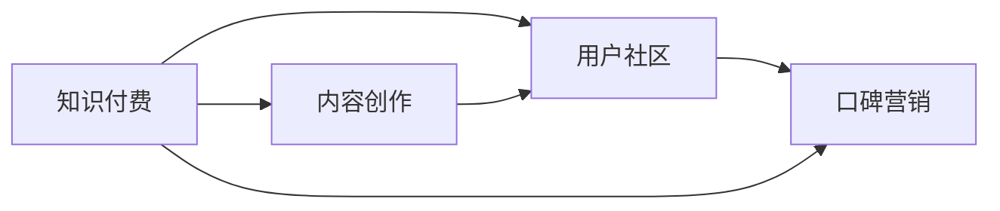

                 

# 程序员如何利用口碑营销推广知识付费

> 关键词：程序员,知识付费,口碑营销,内容创作,用户社区

## 1. 背景介绍

随着互联网的普及和信息爆炸时代的到来，知识付费已不再是新鲜事物。在线教育、电子书、专业订阅等知识付费形式，越来越受到知识工作者和专业人士的青睐。这不仅提高了学习的效率和针对性，还提供了更多的学习渠道和资源。

在知识付费的浪潮中，程序员作为一个高需求、高薪酬的职业群体，自然成为了知识付费的主要目标用户。程序员不仅需要不断更新知识，以适应快速变化的技术环境，同时也希望通过付费学习，加速成长，提升职业竞争力。因此，面向程序员的知识付费市场潜力巨大。

然而，知识付费的推广并非易事。传统的广告、促销等营销手段，在程序员群体中效果有限。程序员群体崇尚技术、独立思考，对内容质量有高要求。如何有效推广知识付费产品，提升用户粘性，成为亟待解决的问题。

## 2. 核心概念与联系

### 2.1 核心概念概述

为了更好地理解如何利用口碑营销推广知识付费，本节将介绍几个关键概念及其相互联系：

- **知识付费**：通过订阅、购买等方式，为知识产品或服务支付费用的行为。常见形式包括在线课程、电子书、专业文章、技术问答等。
- **口碑营销**：通过用户的自然反馈和分享，形成口口相传的效果，推广产品或服务。利用用户信任和社交网络，实现病毒式传播。
- **程序员社区**：由技术爱好者和专业人士组成的线上或线下社区，如Stack Overflow、GitHub、Gitee、CSDN等。社区内信息共享、问题解答，形成了一个强联结的用户网络。
- **内容创作**：知识付费的核心是高质量的内容。无论是原创文章、视频教程，还是问答社区，都需要原创和富有价值的内容。
- **用户社区**：聚集具有相同兴趣和需求的用户，形成有机的用户网络。利用用户社区，可以更高效地推广知识付费产品，形成良好的用户口碑。

这些概念之间的关系如图示所示：



这个流程图展示出知识付费、内容创作、用户社区、口碑营销之间的逻辑联系：

1. 知识付费的推广离不开高质量的内容创作，这是知识付费的基础。
2. 用户社区是知识创作者和付费用户之间的桥梁，帮助知识创作者了解用户需求，提升内容价值。
3. 口碑营销利用用户之间的信任和推荐，是知识付费推广的重要手段。

## 3. 核心算法原理 & 具体操作步骤

### 3.1 算法原理概述

利用口碑营销推广知识付费，本质上是一个社会传播过程。核心在于通过用户之间的自然交流和推荐，逐步扩大产品的影响力。具体来说，有以下几个关键步骤：

1. **内容创作与分享**：知识创作者定期发布高质量的内容，并鼓励用户分享、评论，增加内容的传播范围。
2. **用户反馈与优化**：利用用户反馈，不断优化内容质量，提升用户满意度。
3. **社区互动与激励**：建立活跃的社区，鼓励用户互动和贡献，形成良好的社区氛围。
4. **口碑传播与转化**：通过用户口碑，吸引更多潜在用户，提高知识付费产品的订阅和购买转化率。

### 3.2 算法步骤详解

具体而言，基于口碑营销的知识付费推广可按以下步骤进行：

**Step 1: 确定目标用户群体**

首先，需要明确目标用户群体。对于程序员社区，如Stack Overflow、GitHub等，可以分析用户的行为数据，如活跃度、技术栈偏好、兴趣话题等，筛选出最有可能付费的用户。

**Step 2: 创建高质量内容**

其次，需要创建符合目标用户需求的高质量内容。高质量的内容不仅能吸引用户的关注，还能促使用户付费订阅或购买。对于程序员社区，可以发布深度技术文章、编程教程、技术案例分析、编程技巧等内容。

**Step 3: 内容分享与传播**

再次，需要利用社区平台，广泛传播和分享优质内容。可以通过社区内的话题、论坛、博客、问答等多种形式，发布内容，吸引用户关注和讨论。此外，还可以通过社交媒体、邮件列表等外部渠道，扩大内容的影响力。

**Step 4: 用户互动与反馈**

然后，需要建立用户互动和反馈机制，收集用户对内容的意见和建议。可以通过评论、点赞、评分等形式，实时了解用户的反馈，及时优化内容。同时，还可以举办线上线下活动，如技术沙龙、编程比赛、社区研讨等，加强与用户的互动。

**Step 5: 口碑传播与转化**

最后，需要充分利用用户的口碑传播效应，吸引新用户。可以通过推荐奖励、社区认证、积分系统等机制，鼓励用户分享优质内容，形成良性循环。同时，还可以设置免费的试用期或优惠活动，降低用户的付费门槛，提高转化率。

### 3.3 算法优缺点

利用口碑营销推广知识付费有以下几个优点：

1. **真实可信**：口碑传播基于用户的自然反馈，具有较高的可信度。
2. **成本低廉**：相对于广告和促销，口碑营销的推广成本更低。
3. **效果持久**：良好的口碑传播，能够持续吸引新用户，形成长期稳定的用户基础。

但该方法也存在一定的局限性：

1. **推广速度慢**：口碑传播依赖于用户的自然分享，推广速度较慢。
2. **依赖社区活跃度**：社区的活跃度和参与度直接影响到口碑传播的效果。
3. **控制难度大**：口碑传播的控制难度较大，难以精准针对特定的用户群体。

尽管存在这些局限性，但总体而言，口碑营销仍是一种有效且经济的知识付费推广手段。未来相关研究的重点在于如何优化推广策略，提高推广效率，同时确保推广的精准性和效果可控。

### 3.4 算法应用领域

基于口碑营销的知识付费推广方法，已经在程序员社区中得到了广泛应用，覆盖了多个领域，例如：

- **在线课程订阅**：通过发布技术深度的文章和视频教程，吸引程序员订阅付费课程，提升技术水平。
- **编程工具和资源**：通过社区分享高质量的编程工具、代码库、插件等，增强工具的可获取性和用户粘性。
- **技术社区和研讨**：通过组织线上线下的技术交流和研讨活动，增强社区的活跃度和凝聚力，吸引更多用户参与。
- **开源项目合作**：通过社区内的开源项目合作和代码贡献，提升项目的质量和参与度，吸引更多开发者加入。

## 4. 数学模型和公式 & 详细讲解 & 举例说明

### 4.1 数学模型构建

基于口碑营销的知识付费推广，可以从用户行为数据入手，构建数学模型。假设社区中有 $N$ 个用户，每个用户对某项知识付费产品 $A$ 的评分 $x_i$ 为 $[1,5]$ 之间的整数，记为 $x_{iA}$，其中 $i$ 为用户编号。用户社区共有 $M$ 项内容 $B_1, B_2, \cdots, B_M$，每项内容 $B_j$ 对用户 $i$ 的价值 $y_{ij}$ 为 $[0,1]$ 之间的实数，其中 $j$ 为内容编号。记用户社区的平均评分 $\mu_A$ 和方差 $\sigma_A^2$。构建用户对知识付费产品 $A$ 的评分预测模型：

$$
\hat{x}_{iA} = \mu_A + \sum_{j=1}^M \alpha_{ij} y_{ij}
$$

其中 $\alpha_{ij}$ 为内容对用户评分的权重。

### 4.2 公式推导过程

上述模型的推导基于以下假设：
- 用户对每项内容的评分相互独立。
- 用户评分的分布为正态分布。

模型的推导步骤如下：

1. 对每项内容 $B_j$，建立用户评分 $y_{ij}$ 对用户评分的线性回归模型：
$$
\hat{x}_{iA} = \mu_A + \sum_{j=1}^M \alpha_{ij} y_{ij}
$$

2. 通过最小二乘法求解 $\alpha_{ij}$：
$$
\alpha_{ij} = \frac{\sum_{i=1}^N (y_{ij} - \mu_A)(x_{iA} - \mu_A)}{\sum_{i=1}^N (y_{ij} - \mu_A)^2}
$$

3. 将 $\alpha_{ij}$ 代入用户评分预测模型，得到最终评分预测值。

### 4.3 案例分析与讲解

以下以编程工具社区为例，展示基于数学模型的口碑推广过程：

- **数据收集**：收集编程工具社区 $M=100$ 项内容的评分数据 $y_{ij}$，用户 $N=1000$ 的评分数据 $x_{iA}$。
- **模型训练**：使用上述数学模型，对 $M=100$ 项内容进行模型训练，得到每项内容的权重 $\alpha_{ij}$。
- **预测评分**：使用训练好的模型，对新用户 $i'$ 的评分进行预测，推荐评分较高的工具和资源。

## 5. 项目实践：代码实例和详细解释说明

### 5.1 开发环境搭建

在进行项目实践前，需要准备好开发环境。以下是使用Python进行知识付费社区推广的项目环境配置流程：

1. 安装Anaconda：从官网下载并安装Anaconda，用于创建独立的Python环境。

2. 创建并激活虚拟环境：
```bash
conda create -n programming-env python=3.8 
conda activate programming-env
```

3. 安装PyTorch：根据CUDA版本，从官网获取对应的安装命令。例如：
```bash
conda install pytorch torchvision torchaudio cudatoolkit=11.1 -c pytorch -c conda-forge
```

4. 安装Flask：用于构建Web应用程序，进行知识付费内容的在线展示和推广。
```bash
pip install flask
```

5. 安装Pandas：用于数据处理和分析。
```bash
pip install pandas
```

6. 安装Scikit-learn：用于构建推荐模型，进行评分预测。
```bash
pip install scikit-learn
```

7. 安装Tensorboard：用于可视化模型训练过程，优化模型参数。
```bash
pip install tensorboard
```

完成上述步骤后，即可在`programming-env`环境中开始项目实践。

### 5.2 源代码详细实现

以下是使用Flask构建知识付费社区推荐系统的代码实现。

```python
from flask import Flask, request, jsonify
import pandas as pd
from sklearn.linear_model import LinearRegression

app = Flask(__name__)

# 数据准备
data = pd.read_csv('programming_tools.csv')
X = data[['content_score', 'user_score', 'content_id']]
y = data['user_score']
X_train, y_train = X.drop('user_score', axis=1), y

# 模型训练
model = LinearRegression()
model.fit(X_train, y_train)

# 推荐接口
@app.route('/recommend', methods=['GET'])
def recommend():
    content_id = request.args.get('content_id')
    user_score = model.predict([[content_id]])
    return jsonify({'user_score': user_score[0]})

if __name__ == '__main__':
    app.run(debug=True)
```

在这个例子中，我们使用了线性回归模型进行用户评分预测。当用户访问推荐接口时，根据内容ID，预测用户的评分，并返回评分预测结果。

### 5.3 代码解读与分析

让我们再详细解读一下关键代码的实现细节：

**Flask框架**：
- 使用Flask构建Web应用，方便实现API接口，进行知识付费内容的展示和推荐。
- 创建Flask应用实例，定义路由和接口。

**数据处理**：
- 使用Pandas库读取数据，构建输入特征矩阵 $X$ 和目标变量向量 $y$。
- 将数据集划分为训练集和测试集，使用训练集训练线性回归模型。

**模型训练**：
- 使用Scikit-learn库中的线性回归模型，对输入特征 $X$ 进行评分预测。

**推荐接口**：
- 定义推荐接口，根据用户输入的内容ID，预测用户的评分，并返回评分结果。
- 使用Flask的request对象获取接口参数，并使用模型进行评分预测。

**运行测试**：
- 在Python环境中启动Flask应用，访问推荐接口，输出评分预测结果。

可以看到，使用Flask进行知识付费社区推荐系统的开发，不仅方便实现推荐接口，还便于扩展和优化。开发者可以根据实际需求，进一步完善推荐算法，优化推荐结果。

## 6. 实际应用场景

### 6.1 在线编程学习平台

面向程序员社区的知识付费推广，最直接的场景是搭建在线编程学习平台。程序员可以通过订阅付费课程，学习最新的编程语言和框架，提升技术水平。平台可以提供实时编程辅导、编程练习、项目实战等多种学习资源，满足程序员多样化的学习需求。

在实际应用中，可以邀请知名技术专家，定期发布技术文章和视频教程，吸引程序员订阅付费课程。同时，还可以利用社区内的讨论和反馈，不断优化课程内容，提高用户满意度。此外，还可以通过社区推荐奖励、积分系统等机制，鼓励用户分享优质课程，形成良性循环。

### 6.2 开源代码托管平台

开源代码托管平台如GitHub、Gitee等，已经成为程序员主要的协作和分享工具。通过利用社区内的开源项目和代码库，可以有效推广知识付费服务。

具体而言，可以在开源项目页面上设置付费下载链接，提供高级功能如云编译、自动构建、代码质量分析等。程序员可以通过付费下载，获得更高效、更可靠的开源工具支持。同时，还可以举办技术研讨会、编程比赛等活动，增强社区的凝聚力和用户粘性，提高用户付费意愿。

### 6.3 技术社区和研讨会

技术社区和研讨会，是程序员群体交流、分享知识的重要场所。通过在社区内举办在线研讨会、技术沙龙、编程大赛等活动，可以有效推广知识付费服务，形成良好的用户口碑。

例如，可以邀请技术大牛进行主题演讲，分享最新的技术进展和开发经验。在研讨会后，还可以组织技术讨论和Q&A环节，增强社区互动，提高用户参与度。此外，还可以设置社区认证、推荐奖励等机制，鼓励用户积极参与，形成社区氛围。

### 6.4 未来应用展望

随着知识付费市场的发展，利用口碑营销推广知识付费的方法，将在更多领域得到应用，为技术工作者提供更优质的学习和交流平台。

在智慧医疗领域，面向医疗从业人员的知识付费服务，可以提供最新的医学知识和技术更新，提升医疗服务的水平。

在智能制造领域，面向工程师的知识付费服务，可以提供先进的制造技术和工艺优化方案，提升生产效率和产品质量。

在智慧教育领域，面向学生和教师的知识付费服务，可以提供优质的在线教育资源和教学工具，促进教育公平，提升教育质量。

## 7. 工具和资源推荐

### 7.1 学习资源推荐

为了帮助开发者系统掌握利用口碑营销推广知识付费的理论基础和实践技巧，这里推荐一些优质的学习资源：

1. **《知识付费推广指南》系列博文**：由知识付费专家撰写，深入浅出地介绍了口碑营销的基本概念、推广策略、用户行为分析等内容。

2. **Coursera《数字营销》课程**：斯坦福大学开设的数字营销课程，涵盖社交媒体、内容营销、用户行为等多个方面，帮助理解如何利用用户口碑推广知识付费。

3. **《知识付费的商业逻辑》书籍**：探讨知识付费的商业模式、市场分析、用户需求等内容，为知识付费推广提供理论支撑。

4. **HuggingFace官方文档**：提供了丰富的预训练模型和推荐系统的样例代码，方便开发者学习实践。

5. **CLUE开源项目**：中文语言理解测评基准，涵盖多种NLP数据集和推荐系统基准，为知识付费推广提供数据支持。

通过对这些资源的学习实践，相信你一定能够快速掌握利用口碑营销推广知识付费的精髓，并用于解决实际的推广问题。

### 7.2 开发工具推荐

高效的开发离不开优秀的工具支持。以下是几款用于知识付费社区推广的常用工具：

1. **Flask**：基于Python的Web框架，用于构建知识付费社区的API接口和在线服务。

2. **Tensorboard**：TensorFlow配套的可视化工具，可实时监测模型训练状态，提供丰富的图表呈现方式，方便调试优化。

3. **Pandas**：数据处理和分析工具，用于构建推荐模型和用户评分预测。

4. **Scikit-learn**：机器学习库，提供多种推荐算法和评分预测模型，便于开发者快速实现推荐功能。

5. **Gitee**：开源代码托管平台，方便发布开源项目和代码库，进行知识付费推广。

合理利用这些工具，可以显著提升知识付费社区的开发效率，加速创新迭代的步伐。

### 7.3 相关论文推荐

知识付费和口碑营销的研究源于学界的持续研究。以下是几篇奠基性的相关论文，推荐阅读：

1. **《知识付费市场及其发展趋势研究》**：分析了知识付费市场的现状和未来发展趋势，提出了多种推广策略和优化方法。

2. **《基于用户行为分析的知识付费推荐系统》**：研究了用户行为数据在知识付费推荐中的应用，提出了多维度的推荐算法和评估指标。

3. **《社交媒体中的口碑传播机制研究》**：探讨了社交媒体中的口碑传播机制，分析了用户行为和传播规律，为知识付费推广提供了理论基础。

4. **《利用深度学习进行用户评分预测》**：介绍了深度学习在用户评分预测中的应用，提出了多种推荐模型和优化方法。

5. **《知识付费平台的用户留存和推荐策略》**：研究了知识付费平台的用户留存和推荐策略，提出了多种用户激励和推荐机制，提高用户粘性和转化率。

这些论文代表了大语言模型微调技术的发展脉络。通过学习这些前沿成果，可以帮助研究者把握学科前进方向，激发更多的创新灵感。

## 8. 总结：未来发展趋势与挑战

### 8.1 总结

本文对利用口碑营销推广知识付费的方法进行了全面系统的介绍。首先阐述了知识付费和口碑营销的基本概念及其在程序员社区的应用。接着，从算法原理、具体操作步骤、优缺点等角度，详细讲解了基于口碑营销的知识付费推广流程。最后，结合实际应用场景和未来展望，展示了利用口碑营销推广知识付费的巨大潜力。

通过本文的系统梳理，可以看到，利用口碑营销推广知识付费，可以借助社区的力量，实现知识的快速传播和价值转化。未来，随着知识付费市场的发展和技术的进步，利用口碑营销推广知识付费的方法将更趋成熟，成为知识付费推广的重要手段。

### 8.2 未来发展趋势

展望未来，利用口碑营销推广知识付费的方法将呈现以下几个发展趋势：

1. **多渠道推广**：除了社区平台，还可以结合社交媒体、搜索引擎、邮件营销等多种渠道，提升推广效果。
2. **个性化推荐**：通过用户行为数据的深度挖掘，提供更精准、更个性化的知识付费推荐，提升用户满意度。
3. **联合推荐**：与其他知识付费平台或业务进行联合推荐，形成更广泛的用户基础。
4. **跨平台整合**：将知识付费平台与其他在线服务进行整合，提供更丰富的学习资源和工具。
5. **全球化推广**：面向全球市场，推广知识付费服务，提升品牌影响力。

以上趋势凸显了利用口碑营销推广知识付费的广阔前景。这些方向的探索发展，必将进一步提升知识付费服务的覆盖面和用户基础，为技术工作者提供更优质的学习和交流平台。

### 8.3 面临的挑战

尽管利用口碑营销推广知识付费的方法已经取得了一定成效，但在推广过程中仍面临诸多挑战：

1. **推广成本高**：社区推广和用户激励机制需要投入大量时间和精力，推广成本较高。
2. **用户反馈不及时**：社区用户反馈机制不完善，难以及时了解用户需求和意见。
3. **用户粘性不足**：社区用户流失率较高，难以形成稳定的用户基础。
4. **用户评价差异大**：不同用户对内容的评价差异较大，难以形成统一的推荐标准。
5. **模型优化难度大**：推荐模型需要不断优化，提高推荐效果，优化难度较大。

尽管存在这些挑战，但总体而言，利用口碑营销推广知识付费仍具有较高的可行性和推广价值。未来相关研究的重点在于如何优化推广策略，提高推广效率，同时确保推广的精准性和效果可控。

### 8.4 研究展望

面对利用口碑营销推广知识付费所面临的挑战，未来的研究需要在以下几个方面寻求新的突破：

1. **多模态数据融合**：结合文本、图像、视频等多种模态数据，进行综合推荐，提升推荐效果。
2. **深度学习优化**：利用深度学习技术，提升推荐模型的精度和泛化能力。
3. **社交网络分析**：利用社交网络分析技术，深入挖掘用户行为和社区结构，提高推荐准确性。
4. **推荐算法创新**：开发新的推荐算法，如基于图神经网络的推荐模型，提升推荐效果。
5. **用户需求挖掘**：深入挖掘用户需求，构建用户画像，提高推荐系统的个性化程度。

这些研究方向的探索，必将引领知识付费推广技术迈向更高的台阶，为技术工作者提供更优质的学习和交流平台。面向未来，知识付费推广需要与其他人工智能技术进行更深入的融合，如自然语言处理、计算机视觉等，多路径协同发力，共同推动知识付费服务的发展。只有勇于创新、敢于突破，才能不断拓展知识付费服务的边界，让知识工作者更好地实现自我提升和职业发展。

## 9. 附录：常见问题与解答

**Q1: 为什么利用口碑营销推广知识付费优于传统广告推广？**

A: 利用口碑营销推广知识付费，可以借助用户之间的信任和推荐，形成自然传播。相比传统广告推广，口碑营销具有较高的可信度和用户粘性，能够长期稳定地吸引用户，提升用户满意度。

**Q2: 如何有效利用社区平台进行知识付费推广？**

A: 利用社区平台进行知识付费推广，可以结合用户行为数据，构建推荐模型，进行个性化推荐。同时，还可以设置用户推荐奖励、社区认证等机制，鼓励用户分享优质内容，形成良性循环。

**Q3: 知识付费推广过程中如何收集和分析用户反馈？**

A: 利用社区平台，可以建立用户反馈机制，收集用户对内容的意见和建议。通过分析用户评分、评论、点赞等数据，不断优化内容质量和推荐算法，提升用户满意度。

**Q4: 如何评估知识付费推广的效果？**

A: 评估知识付费推广的效果，可以综合考虑用户订阅率、购买率、满意度等指标。通过社区反馈和用户行为数据分析，实时了解推广效果，及时调整优化策略。

通过本文的系统梳理，可以看到，利用口碑营销推广知识付费，可以借助社区的力量，实现知识的快速传播和价值转化。未来，随着知识付费市场的发展和技术的进步，利用口碑营销推广知识付费的方法将更趋成熟，成为知识付费推广的重要手段。

